# 第一部分、基础知识


## 第一章、为什么要关心Java8


2014年3月发布的Java8带来了众多改变：Lambda表达式、流、默认方法


Java8对硬件也有影响：绝大多数的Java程序只能使用其中一个内核，其余的几个都闲着

在Java8之前，专家可能会告诉你必须利用线程才能使用多个内核，但用起来很麻烦，很容易出错。Java一直致力于让并行变得更简单：Java1.0有线程和锁，还有一个专门的内存模型，但是在当时不具备专业知识的项目团队很难可靠的使用这些框架。Java5加入了工业级的构建模块：线程池和并发集合（不是同步容器），Java7添加了fork/join框架，但仍然很困难。Java8提供了一些新思路

提供了Stream API，支持数据的并行操作，核心思想：用更高级的方式来表达想要的东西，而由“实现”（这里是Stream库）来选择最佳低级执行机制。这样就可以避免使用Synchronized写代码，不仅能够避免错误，还能降低执行成本。


编程概念：

- 流处理

流：是一系列数据项，一次只能生成一项，程序可以从输入流中一个一个读取数据项，然后以同样的方式将数据项写入输出流。一个程序的输出流很可能是另一个程序的输入流

这种情况在Linux和Unix里面很常见，例如：对文件的处理：

```
cat file1 file2 | tr "[a-z]" "{A-Z}" | sort | tail -3
```

这里就是通过标准输入流读入file1和file2，Unix的cat命令会将两个文件连接起来并创建一个流，tr命令转换流中的字符，sort对流中的行进行排序，tail -3给出流的最后三行。（类似于Spring WebFlux的思想）


基于这一思想，Java给出了Stream<T>，在java.util.stream包下。Stream的很多方法可以形成复杂的流水线（也就是WebFlux里面提供的数据管道的概念）。思路其实就是NetFlix提供的反应式编程代替了命令式编程（2013年年底提出的，有理由相信Java8借鉴了）。更关键的是：从一个流转换到另一个流的编程思路使得Java8可以透明的把输入的不相关的部分拿到几个CPU上去执行，几乎算是免费的并行了。


- 用行为参数化把代码传递给方法

Java8新增：通过API来传递代码的能力

就例如开头排序的代码，使用sort排序，如果需要指定排序方式，就需要传入一个Comparator实现类，但这使得代码变啰嗦了

Java 8增加了把方法（你的代码）作为参数传递给另一个方法的能力


- 并行与共享的可变数据

上面提到Stream可以帮我们**几乎**完成并行了，当然有代价，共享数据的线程不安全问题仍然需要我们自己解决，当然不是使用Synchronized关键字，这就与反应式编程有点相悖了（这里好像把反应式编程叫做函数式编程，但命令式编程的叫法没有改变）


Java8的新概念：

函数——值的一种新形式

值的可能形式：

- 原始值，即基本数据类型，如int，double等等
- 对象，如String，Integer，int[]（数组也是对象）

上述的都是传统编程语言的基石，这些值可以被称为一等公民，而目前对于Java而言方法和类是二等公民，Java8将方法从二等公民拉近了一等公民。（至于类，很多语言如JavaScript都探索过这条道路）


其实将方法和类从二等公民拉到一等公民不是Java首创，而是由运行在Java虚拟机上的Scale和Groovy早已实现了，Java只是借鉴了而已。

用方法传值也构成了其他Java8功能（如Stream）的基础


方法引用语法：`::`，即`类::方法`


感觉还是因为FileFilter支持函数式编程导致的，先继续往后看。


Lambda——匿名函数

除了允许函数作为一等值之外，还允许Lambda（匿名函数）的形式

可以当你在没有方便的方法和类可用的时候，使用lambda来创建一个匿名方法会更加的简洁


一个Demo：

```java
public class FilteringApples {

    private static List<Apple> apples = new ArrayList<>();

    static {
        for (int i = 0; i < 10; i++) {
            Apple apple2 = new Apple(i, "green");
            Apple apple1 = new Apple(i, "red");
            apples.add(apple1);
            apples.add(apple2);
        }
    }

    /**
     * @return 通用的筛选函数
     */
    public static List<Apple> filterApples(Predicate<Apple> predicate) {
        ArrayList<Apple> filter = new ArrayList<>();
        for (Apple apple : apples) {
            if (predicate.test(apple)) {
                filter.add(apple);
            }
        }
        return filter;
    }

    /**
     * @return 筛选出color为green的苹果
     */
    public static boolean isGreenApple(Apple apple) {
        return Objects.equals("green", apple.getColor());
    }

    /**
     * @return 筛选出weight大于4的apple
     */
    public static boolean isHeavyApple(Apple apple) {
        return apple.getWeight() > 4;
    }


    public static void main(String[] args) {
        //调用测试
        System.out.println(filterApples(FilteringApples::isGreenApple));
        System.out.println(filterApples(FilteringApples::isHeavyApple));
    }
}
```

好像仅支持静态方法，如果方法是非静态的就会报错了

如果要引入非静态方法，得使用`对象名::方法名`的形式将方法注入进来

在Java8中可以传递方法了！

> 上面代码里的Predicate<T>是一个谓词，谓词是一个类似于函数的东西，接收一个参数值，返回True或者False（可以理解为函数的一个子集），当然Java8也允许你以函数的方式——Function<T,Boolean>的形式，建议使用Predicate<T>，返回类型都不用装箱成Boolean的形式了。


传入到谓词Predicate<T>的方法必须满足：方法的返回结果是boolean，入参类型是T


使用Lambda（匿名函数的形式）

使用Lambda进行筛选：

```java
public class FilteringApples {

    private static List<Apple> apples = new ArrayList<>();

    static {
        for (int i = 0; i < 10; i++) {
            Apple apple2 = new Apple(i, "green");
            Apple apple1 = new Apple(i, "red");
            apples.add(apple1);
            apples.add(apple2);
        }
    }

    /**
     * @return 通用的筛选函数
     */
    public static List<Apple> filterApples(Predicate<Apple> predicate) {
        ArrayList<Apple> filter = new ArrayList<>();
        for (Apple apple : apples) {
            if (predicate.test(apple)) {
                filter.add(apple);
            }
        }
        return filter;
    }

    public static void main(String[] args) {
        //使用lambda表达式的形式
        System.out.println(filterApples((Apple apple) -> Objects.equals("green", apple.getColor())));
        System.out.println(filterApples((Apple apple) -> apple.getWeight()>4));
    }
}
```

不需要只为一次的方法写定义，代码更简洁

但如果你的lambda表达式多于几行，则应该使用一个方法引用指向一个有描述性名称的方法，而不是匿名方法


本来Java8的新特性到此为止就可以打住了，要是没有多核CPU。

完全可以仅仅只是在集合工具类上加上以下静态方法供我们直接调用：

```java
static <T> Collection<T> filter(Collection<T> c, Predicate<T> p);
```

==但是Java没有这样做==，Java 8提出了一套新的类集合API——Stream，它有一套函数式程序员熟悉的、类似于filter的操作。


流——相当于是为了制造和处理集合补充的，因为有时候使用集合不是很方便，需要大量的嵌套和模板代码，代码在后面章节会有详细讲述，这里只要有个整体概念就行了。

如果使用集合的话，需要自己去forEach循环，然后再处理元素，这叫外部迭代

而如果使用了Stream，完全不用管循环的事情了，数据处理完全是在库内部进行的，我们把这种思想叫做内部迭代

使用集合还有一个问题：如果一个集合相当大，在遍历过程中使用单核CPU的利用率就非常的低下了，但如果使用Stream，会默认使用多核（例如是八核），那么处理速度理论上就提高了八倍

但仍然会造成线程安全问题，Java8基于Stream的并行并提倡少使用Synchronized的函数式编程风格，它关注的是数据块而不是协同访问（如果是命令式编程还是提倡使用Synchronized的，能使用上封装好了的类更好）

Stream解决的问题（集合遍历方面）：

- 避免了常规的forEach套路
- 很容易给各个CPU分配任务，完全可以将集合的每一份数据交给每一个CPU去处理，最后再执行结果合并操作

观点：Collection是为了存储数据，而Stream主要是用于描述对数据的处理过程，最终还是要转换成Collection保存结果的。


筛选一个重苹果并输出（顺序处理）：

```java
    System.out.println(apples.stream().filter((a) -> a.getWeight() > 4).collect(Collectors.toList()));
```

> 始终是主线程在处理，使用JProfile去监视了，没有创建线程去并行执行

使用并行处理：

```java
    System.out.println(apples.parallelStream().filter((a) -> a.getWeight() > 4).collect(Collectors.toList()));
```

并行处理的执行过程：


佐证（如果没有使用并行的流就只有main了）：


但是随后在Java更新的过程中，发现了一个实际的问题：现有的接口也在改进，最明显的——sort函数，本来就该隶属于List接口的，硬是放到了Collections工具类中去了。如果现在再要更新的话，会需要所有List的实现类去重写sort方法，简直是逻辑灾难，还好有默认方法：

摘自JDK11的List.sort(Comparator c)，使用default关键字修饰

```java
default void sort(Comparator<? super E> c) {
    Object[] a = this.toArray();
    Arrays.sort(a, (Comparator) c);
    ListIterator<E> i = this.listIterator();
    for (Object e : a) {
        i.next();
        i.set((E) e);
    }
}
```


默认方法：

主要是为了支持库设计师，让他们能够写出更容易改进的接口

主要是为了解决：改变已发布的接口而不破坏已有的实现。使得后期的接口扩充更容易实现

但是如果多个接口都声明了同一个默认的方法，那么不就造成问题了吗，在第九章会讲到，Java8用一些限制来避免出现类似于C++的菱形继承问题。


Java从函数式编程中引入的两个重要思想：

- 将方法和Lambda作为一等值
- 在没有共享变量时，函数或者方法可以有效，安全地并行执行

Stream API就用到了这两个思想


Java中的switch仅仅局限于原始数据类型和String类型。而函数式语言更加倾向允许switch允许更多的数据类型，即访客模式——最常见的是用来遍历一组类，如汽车的各个部件，然后对各个组件分别进行操作，这种模式容易在编译期发现问题，很容易告诉你某个组件没有显式的处理，你需要声明处理方法


小结：

- 语言会面临“要么改变，要么淘汰”的压力。最明显的例子：COBOL语言
- 函数是一等值，可以传递
- Lambda（匿名函数）是如何写的
- 接口的默认方法


## 第二章、通过行为参数化传递代码


软件工程中时常出现的问题——用户的需求在不断的改变。

行为参数化就可以帮你解决频繁更变需求的一种软件开发模式

将可能需要变更的地方封装成一个代码块传入方法中，当需求改变的时候，直接修改封装好的代码块就可以了，而不用再去重写整个方法调用。

如果不使用Lambda表达式，代码可能变得十分啰嗦（当然是在操作简单的情况下，如果操作变难了，就需要显式的声明方法并给上Javadoc标注）


Demo：

刚开始只要筛选绿苹果：

```java
/**
     * 刚开始可能只是需要筛选绿色的苹果
     */
public static List<Apple> filterGreenApples(List<Apple> apples) {
    ArrayList<Apple> filter = new ArrayList<>();
    for (Apple apple : apples) {
        if (Objects.equals("green", apple.getColor())) {
            filter.add(apple);
        }
    }
    return filter;
}
```

后来可能需要筛选各种颜色的苹果，你就可能会尝试抽象代码了：

```java
/**
     * 一旦需要筛选的颜色多了起来，你就会尝试的去抽象代码，避免类似代码重复发生
     * 此时抽象出：根据颜色筛选出苹果
     */
public static List<Apple> filterApplesByColor(List<Apple> apples, String color) {
    ArrayList<Apple> filter = new ArrayList<>();
    for (Apple apple : apples) {
        if (Objects.equals(color, apple.getColor())) {
            filter.add(apple);
        }
    }
    return filter;
}
```

一个良好的原则是在编写类似的代码时候，尝试将其抽象化

此时又需要增加筛选体重大于150的苹果，你可能学聪明了，不把150写死，说不定能重用

```java
/**
     * 这时候需求又改了，改成需要筛选出较重的苹果（指150以上）
     * 你可能学聪明了，要是150也改了咋办，先抽象下
     */
public static List<Apple> filterHeavyApple(List<Apple> apples, Integer weight) {
    ArrayList<Apple> filter = new ArrayList<>();
    for (Apple apple : apples) {
        if (apple.getWeight() > weight) {
            filter.add(apple);
        }
    }
    return filter;
}
```


其实这三个方法有大量的重复代码，打破了DRY原则（Don’t Repeat Yourself）

如果是以前你可能会有这样的尝试：

```java
public static List<Apple> filter(List<Apple> apples,String color,Integer weight,Integer flag);
```

通过flag来指定哪些条件时需要的，哪些条件是不需要的，然后根据需要的条件去进行过滤（但这样做，写代码实现的感觉很糟糕，很有可能简单的筛选就写成了一大片的if-else调用，一旦属性多了体验会更糟糕）


使用更高级的抽象：根据选择标准建模。

在这里我们根据Apple的某些属性来返回一个boolean值。我们把这一动作称作谓词（即返回一个boolean类型的函数）

于是我们可以定义一个选择建模标准：

```java
public interface ApplePredicate{
    boolean test(Apple apple);
}
```

然后就可以用这个接口的实现来表示不同的选择标准


刚才做的与策略设计模式有关——它让你定义一族算法，将他们封装起来，称为策略。然后在运行时候选择一个算法


继续更高程度的封装：


所有的条件筛选都可以自定义，只要将算法的实现传入到ApplePredicate中即可


但现在仍然有点遗憾，你需要将代码封装到ApplePredicate的test的方法中，然后返回ApplePredicate对象，而不是直接传递方法

非常具体的体现：


虽然上述思想很优秀，但是会非常啰嗦，需要声明很多只要实例化一次了的类。接下来是如何改进


上述传递方法是通过实例化一个类的方式来实现的，然而在Java8中方法是可以被作为参数来进行传递的。

改进1：使用匿名类来改进，本质上仍然是传递的对象，但是可以少显式的声明一个类，还是比较舒服的。

缺点：

- 很笨拙，占用大量代码空间
- 用起来比较费解，如下一个经典的Java谜题


答案是5，this指的是Runnable对象

尽管匿名类已经在一定程度上解决了创建多个接口实现的问题，但仍然有大量的重复代码。有优化的空间


使用Lambda表达式

感觉Java就是帮我们把传入的方法封装成一个匿名类的对象，然后再传给方法的


更高的抽象——将List类型抽象化，而不是仅仅局限于Apple，于是可以的带下述代码：


手敲了一遍：

```java
/**
     * 直接来最高程度的抽象了
     */
public static <T> List<T> filter(List<T> list, Predicate<T> p) {
    LinkedList<T> list1 = new LinkedList<>();
    for (T t : list) {
        if (p.test(t)) {
            list1.add(t);
        }
    }
    return list1;
}

public static void main(String[] args) {
    List<Integer> list = Arrays.asList(1, 2,50, 3, 5);
    List<Integer> filter = filter(list, a -> a % 2 == 0);
    System.out.println(filter);
}
```

体验还是非常好的。


行为参数化是非常有用的——可以吧一个行为（一段代码）封装起来，并通过传递和使用创建的行为将方法的行为参数化

Java API中其实有很多地方都是用到了行为参数化了，大量的与匿名类一起使用（Java8之前）：

- 用Comparator来排序
- 用Runnable来执行一个代码块


排序：可以使用Java8在List中添加的默认方法sort，也可以使用Collections中的sort方法，但是现在不推荐使用了

Comparator接口概述（去除掉了默认方法）：

```java
@FunctionalInterface
public interface Comparator<T> {
    int compare(T o1, T o2);
}
```

如果需要对Apple进行重量排序：有小到大，可以使用：

```java
ArrayList<Apple> apples = new ArrayList<>();
apples.sort(new Comparator<Apple>() {
    @Override
    public int compare(Apple o1, Apple o2) {
        return o1.getWeight().compareTo(o2.getWeight());
    }
});
```

使用包装类默认的比较函数，产生的结果是由小到大的排序

如果是想让默认排序变成由大到小，可以对`o1.getWeight()`的结果进行取反操作即可


上述可以使用Lambda表达式来取代：

```java
apples.sort((o1, o2) -> o1.getWeight().compareTo(o2.getWeight()));
```

IDEA还推荐简化为：

`apples.sort(Comparator.comparing(Apple::getWeight));`

从大到小：

`apples.sort((o1, o2) -> o1.getWeight().compareTo(o2.getWeight())*-1);`


Runnable执行代码块：

就不过多赘述了，多线程里面使用的非常多，也是我目前使用Lambda表达式使用的最多的地方


小结：

- 行为参数化。就是一个方法接收多个不同的行为作为参数，并在内部使用他们
- 行为参数化可以使得代码更好的适应不断变化的需求
- 传递代码，在Java8之前是依赖于对象的，无论是普通类的对象还是匿名类的对象都一样，在Java8之后可以直接传递方法，无论是通过`::`语法还是Lambda表达式
- Java API就包含了些许将不同行为进行参数化的方法。如排序，启动线程


## 第三章、Lambda表达式


在上一章中你了解到了使用行为参数化来解决不断变化的需求

但是使用匿名类对象来传递行为方法显得过于的繁琐了，Java8为了解决这个问题，提出了Lambda表达式，可以让你很简洁的传递一个行为（仅仅只是通过方法的方式，而不是通过实例化对象的方式来进行传递）

最后还会介绍方法引用——常与Lambda表达式联用的一个有用的新功能


可以把Lambda理解成为一个可传递的匿名函数的一种方式。这个函数没有名称，但有参数列表，返回类型，函数主体，返回类型，还有可能拥有可以跑出的异常列表

> 总感觉Java对方法与函数的定义有点重合了
>
> 百度了一下，主要的两点区别：
>
> 非静态方法可以使用this关键字，一个方法可以处理包含在一个类里面的数据
>
> 相当于对象里面的函数就叫做了方法，或者说：方法就是面向对象版的函数

所以这里将Lambda称为匿名函数而不是匿名方法是很有道理的，因为Lambda不属于任何一个类，这在Java中时不常见的，所以Java领域中几乎使用了方法这个词来取代了函数

可传递的特点：可以作为参数传递给方法或:question:==存储在变量中==（还没见到过，画个重点）


Lambda表达式鼓励我们使用行为参数化的风格


Lambda表达式的三部分：

- 参数列表

用（）包裹起来的部分

- 箭头

将参数列表和主体隔离开来

- Lambda主体


Demo：

```java
//返回一个int，隐含了return语句
(String s) -> s.length()
    
//将Apple类型的参数传入，返回重量是否大于150的boolean值
(Apple a) -> a.getWeight() > 150
    
//接收两个int型数据，无返回值
(int x, int y) -> {
	System.out.println("Result:");
	System.out.println(x+y);
}

() -> 42
    
(Apple a1, Apple a2) -> a1.getWeight().compareTo(a2.getWeight())
```

通用的语法类型为：

```java
(parameters) -> expression
    或者
(parameters) -> {
    statement;
}
```

的语法格式

>  还是建议在参数前面带上参数类型的


那么在哪里可以使用到Lambda表达式呢？上述的接口都是函数式接口

第一个遇到的函数式接口：`Predicate<T>`

```java
@FunctionalInterface
public interface Predicate<T> {
    boolean test(T t);
}
```

依旧是省去了default方法，毕竟default方法与我们也不想干（设计default方法的目的就是为了在接口中屏蔽某些方法，对于实现类来说）


还有：

Comparator和Runnable等等

```java
public interface Comparator<T> {
	int compare(T o1, T o2);
}
public interface Runnable{
	void run();
}
public interface ActionListener extends EventListener{
	void actionPerformed(ActionEvent e);
}
public interface Callable<V>{
	V call();
}
public interface PrivilegedAction<V>{
	V run();
}
```

> 接口可以拥有很多默认方法（在实现类没有对其实现的时候，其主体为方法提供的默认提供实现的方法），**只要接口只定义了一个抽象方法，那么它仍然是一个函数式接口**


函数式接口可以用来做什么呢？回到我们的Lambda表达式中来

Java允许你将整个Lambda表达式作为函数式接口的实例，当然是用匿名类也可以完成同样的事情，但只是显得比较笨拙而已

Demo（就不写能测通的代码了，伪代码）：

```java
//使用Lambda表达式和匿名类，让Runnable输出hello world
Runnable r1 = () -> System.out.println("hello world");

Runnable r2 = new Runnable() {
    @Override
    public void run() {
        System.out.println("hello world");
    }
};
```


抽象描述符：

函数式接口的抽象方法的签名基本上就是Lambda表达式的签名，我们把这种抽象方法叫做函数描述符

现在只需要了解Lambda可以被赋予给一个变量（即函数式接口）或者是传递一个接受函数式接口作为参数的方法就行了，至于编译器是如何对Lambda方法做参数检查的，在以后再讲述，当然Lambda表达式的签名要与函数式接口的抽象方法一样（入参和返回参数类型一致即可，或者可以转换，无论是自动拆箱装箱、向上转型都可以）

> 建议在函数式接口上加上注解`@FunctionalInterface`
>
> 可以做到简单的检查，例如接口中有多个抽象方法就会报错
>
> 不是必须的，但是推荐使用


Demo：处理文件的时候经常需要打开，关闭操作，显得多余，尝试构建模板代码

依旧是硬性要求：尝试读取文件的第一行

```java
private static final String FILEPATH = "E:/info.txt";

	/**
     * //读取资源的一行
     */
public static String processFile() throws IOException {
    //使用了Java7中带资源的try，不需要关闭
    try (BufferedReader br = new BufferedReader(new FileReader(FILEPATH))){
        return br.readLine();
    }
}
```

> 确实，代码中不应该出现硬编码，都应该声明为常量


来开始行为参数化来保证高可用，避免频繁的复用try/catch代码

保证对BufferReader的操作不是死的（Lambda大展身手的时候了）

很显然，这里需要一个`(BufferReader br)->String`的函数式接口，然而官方不一定会总是替我们准备好，我们需要自己声明一个函数式接口，

```java
@FunctionalInterface
public interface BufferedReaderProcessor {
    /**
     * 要做的事情
     * @param br 
     * @return
     * @throws IOException
     */
    String process(BufferedReader br) throws IOException;
}
```

开始重构processFile方法

```java
/**
 * 开始重构
 */
public static String processFile(BufferedReaderProcessor processor) throws IOException {
    try (BufferedReader br = new BufferedReader(new FileReader(FILEPATH))){
        return processor.process(br);
    }
}
```

测试使用：

传递Lambda：`System.out.println(processFile((BufferedReader br) -> br.readLine()));`

可以改进成传递方法：`System.out.println(processFile(BufferedReader::readLine));`

:question:这里感觉蛮疑惑的，讲道理readLine是非静态方法，按道理来说应该是使用`对象名::方法名`来调用，但这里使用类名调用也成功了


查看Java8中提供的几个函数式接口：

具体的可以查看`java.util.function`

提供的还是比较丰富的，基础的数据类型接口基本都有，可以找找

下面是几个比较通用的：

Predicate：

```java
@FunctionalInterface
public interface Predicate<T>{
	boolean test(T t);
}
```

> 接口里的方法默认被public abstract修饰，不需要显式的去进行public声明


常见的使用场景：

```java
/**
 * 通用的List过滤器，为什么List不提供呢
 */
public static <T> List<T> filter(List<T> list, Predicate<T> p) {
    ArrayList<T> result = new ArrayList<>();
    for (T t : list) {
        if (p.test(t)) {
            result.add(t);
        }
    }
    return result;
}

/**
 * 测试使用
 */
public static void main(String[] args) {
    List<String> list = Arrays.asList("hello", "world", "Java");
    //使用Lambda表达式给对象赋值，可能显得比较啰嗦，但是实际情况仍然存在
    Predicate<String> pr = (String a) -> a.length() > 4;
    for (String s : filter(list, pr)) {
        System.out.println(s);
    }
}
```


Consumer：

当你只需要执行某些操作的时候就可以使用这个接口

```java
@FunctionalInterface
public interface Consumer<T> {
    void accept(T t);
}
```


常见使用场景：

```java
/**
 * 自动循环遍历整个List，传入对List的操作即可
 */
public static <T> void forEach(List<T> list, Consumer<T> p) {
    for (T t : list) {
        p.accept(t);
    }
}

/**
 * 测试使用
 */
public static void main(String[] args) {
    List<String> list = Arrays.asList("hello", "world", "Java");
    //使用Lambda表达式给对象赋值，可能显得比较啰嗦，但是实际情况仍然存在
    Consumer<String> consumer = (String a) -> System.out.println(a.length() > 4 ? a : "\n");
    forEach(list, consumer);
}
```


Function：

接受一个对象，返回一个对象，相当于是可以囊括所有函数式接口了，除了void好像无法作为返回值之外

```java
@FunctionalInterface
public interface Function<T, R> {
    R apply(T t);
}
```


在我们进行抽象的时候尽量保证泛型的存在，从而提高方法的复用性

```java
/**
 * 集合内内容的转换
 */
public static <T, R> List<R> map(List<T> list, Function<T, R> function) {
    ArrayList<R> result = new ArrayList<>();
    for (T t : list) {
        result.add(function.apply(t));
    }
    return result;
}

/**
 * 测试使用
 */
public static void main(String[] args) {
    List<String> list = Arrays.asList("hello", "world", "Java");
    List<Integer> list1 = map(list, (String a) -> a.length());
    System.out.println(list1);
}
```


因为泛型中是无法指定基础数据类型的，只能使用其对应的封装类

Java8为了避免自动装箱和拆箱带来的性能损耗，也选择了可以接收基本数据类型的函数式接口


例如这些类就分别对应着Consumer<Integer>等等

基础数据类型+Consumer/Function/Predicate

Function还有对应的To关键字来指定输入和输出


Java8中提供的函数式接口：


主体上就是这么多了


默认的函数式接口都不支持异常抛出，想要抛出异常，可以自定义函数式接口、或者是在代码块内部使用catch语句来消费掉本该抛出的异常


Lambda表达式的语法检查


Lambda的类型是根据使用Lambda表达式的上下文推断出来的：主要是（或者说只能是）接收它的方法的参数，或者接收它的值的局部变量中推断出Lambda表达式的目标类型

主要是检查需要的函数式接口中的方法的签名与Lambda表达式的签名（主要是参数信息和返回值信息）是否一致


因此，同一个Lambda表达式可以与不同的函数式接口连接起来，只要套门的抽象方法签名能够兼容

```java
private static final String FLAG = "hello world";

public static void main(String[] args) {
    Callable<String> callable = () -> FLAG;
    Supplier<String> supplier = () -> FLAG;
}
```

只要Lambda满足抽象方法签名即可


原来这里利用到了Java7中的菱形运算符：

```java
List<String> list = new ArrayList<>();
```

可以根据上下文即左边的 推断出适当的参数类型出来


Lambda的void兼容规则：

```java
//Consumer接收T返回void
Consumer<String> consumer = (String a) -> list.add(a)
```

尽管list.add方法会返回一个Boolean，但上述代码仍然是正确的，Lambda表达式可以根据方法签名很清楚的知道你的需求


==Lambda有时候显式的写出类型更易读，有时候去掉他们更易读，具体选用哪种看程序员自身，没有哪种法则更好的说法==

>当Lambda仅有一个类型需要推断的参数时，参数两边的括号也可以省略


如果Lambda表达式使用了方法中的局部变量，那么该局部变量应该是不可变的或者是事实不可变的，以下例子就会报错

```java
int num = 59;
Runnable r = () -> System.out.println(num);
num = 10;
```

`Variable used in lambda expression should be final or effectively final`

主要是对基础数据类型和其封装类的限制，如果上升到对象层面就基本不会出现以上情况了

```java
ArrayList<Integer> num = new ArrayList<>();
Runnable r = () -> System.out.println(num);
num.add(2);
```


方法引用——可以被视为某些Lambda的快捷写法

重复使用现有的方法定义

方法引用应该被视为仅仅调用特定方法的Lambda的一种快捷写法

基本思想：如果一个Lambda代表的仅仅是去直接调用这个方法，那最好还是直接使用名称来调用它，而不是用一些固定的代码去描述调用过程


可以将方法引用看作是仅仅涉及单一方法的Lambda语法糖


方法引用的分类：

- 指向静态方法的引用，直接`类名::方法名`
- 指向任意类型实例方法的方法引用，例如`String::length`
- 指向现有对象的方法引用，例如存在实例化对象string，使用`string::length`

第二种和第三种看起来有点矛盾，其实不是的。

第二种的意思：

```java
(String s) -> s.length();    
	可以等价，因为已经在
String::length
```

第三种的意思：

```java
String string = "hello world";
() -> string.length();
	可以等价
string::length
```


实战：忽略字符大小对其进行排序

```java
public static void main(String[] args) {
    List<String> list = Arrays.asList("a", "A", "Z", "W", "w");
    //优化前
    list.sort((o1,o2)->o1.compareToIgnoreCase(o2));
    System.out.println(list);
    //优化后
    list.sort(String::compareToIgnoreCase);
}
```


> 有些蛮夸张的用法（感觉要是实际开发中老老实实使用Lambda表达式把，剩余的能使用方法引用的就交给编译器去发挥）
>
> ```java
> Function<String,Integer> stringToInt = (a) -> Integer.parseInt(a);
> Function<String,Integer> stringToInt2 = Integer::parseInt;
> 
> BiPredicate<List<String>,String> contains = (list,element) -> list.contains(element);
> BiPredicate<List<String>,String> contains2= List::contains;
> ```
>
> 编译器都可以识别得到，不用太过担心


复合Lambda表达式的有用方法

Java8提供的函数式接口都提供了允许你进行复合的方法，意味着你可以把多个简单的Lambda表达式复合成复杂的表达式，比如把两个Lambda表达式（两个谓词）之间来一个or操作，诀窍在于这些操作都是对应的接口里面的默认方法

各种骚操作，有点小厉害：


比较器复合：

```java
ArrayList<Apple> list = new ArrayList<>();
list.add(new Apple(55, "green"));
list.add(new Apple(15, "green"));
list.add(new Apple(45, "green"));
list.add(new Apple(100, "green"));
list.add(new Apple(100, "Red"));
list.add(new Apple(90, "green"));
list.add(new Apple(95, "green"));
list.add(new Apple(37, "green"));

//按重量反序
list.sort(Comparator.comparing(Apple::getWeight).reversed());
System.out.println(list);

//比较器链，让两个一样的weight的Apple可以排序
list.sort(Comparator.comparing(Apple::getWeight).reversed().thenComparing(Apple::getColor));
System.out.println(list);
```


谓词复合，

在Java8中谓词的主要体现就是Predicate接口，接收一个T，返回一个Boolean

主要是三个方法：and、or和negate，对应着的正是与或非

和Mybatis Plus里面的Wrapper一样都是从左到右确定优先级的。


函数复合：

即Function接口代表的Lambda的表达式的复合，主要通过compose和andThen两个默认方法来是吸纳的

andThen相当于将两个Function简单的链接起来，让指令流执行的时候能够顺序执行

```java
Function<Integer, Integer> fun1 = a -> a + 1;
Function<Integer, Integer> fun2 = a -> a * 2;
//使用andThen方法连接着两个Function
System.out.println(fun1.andThen(fun2).apply(10));
//使用compose方法来连接两个Function
System.out.println(fun1.compose(fun2).apply(10));
```

输出结果分别为：`22   21`

fun1.andThen(fun2)：就会先执行fun1方法再执行fun2方法

fun1.compose(fun2)：先执行fun2方法，再执行fun1方法

感觉就目前使用而言还是andThen使用的会更多一点


小结：

- Lambda表达式可以裂解为匿名函数，拥有参数列表，函数主体，返回类型，有可能还会有异常列表（如果接口有声明抛出了异常的话）
- 只有在接收函数式接口的地方才可以使用Lambda表达式
- 方法引用可以让你重用现有的方法并直接传递他们
- Comparator，Predicate和Function等函数式接口都提供了一组默认实现了的方法——复合方法


# 第二部分、函数式数据处理


主要是使用Stream API


## 第四章、引入流


集合是Java中使用最多的API

尽管集合对于任何一个Java应用都是不可或缺的，但集合操作远称不上完美

- 遍历集合中的元素需要迭代器
- 如果需要集合支持并发得手动编写

以上问题的解决方案——流


流允许你以声明的方式处理数据集合，还可以透明的并行处理任务

结合Lambda表达式可以节省大量的代码空间，很舒服

流的优点：

- 是声明式的，说明想要完成什么，而不是说明如何实现一个操作
- 支持链式操作来表达复杂的数据处理流水线


Java8的集合支持一个新的stream方法，会返回一个流，当然还有其他很多方法都可以返回流，例如利用数值范围或IO资源生成流元素


流简单定义——从支持数据处理操作的源生成的元素序列

集合讲的是数据，流讲的是计算

流会使用一个提供数据的源，如集合，数据，或输入输出资源，如果是从有序集合和列表中读取的数据，流会保证他们的有序性（应该无论是在顺序执行还是在并行执行的情况下）

流提供一系列操作：filter map limit reduce find match sort等，流操作可以顺序执行，也可以并行执行


流的两个重要的特点：

- 流水线，很容易形成链式操作，因为很多操作都会返回一个Stream，除了最后的collect方法
- 内部迭代


流往往可以做到按需生成，而集合中的元素必须全部一起生成

例如生成所有的质数，就可以使用流，而无法使用集合

流只能遍历一次，相当于一个流上只能进行一次操作，但这个操作往往会生成新的流供你继续操作

```java
Stream<Dish> stream = Dish.sample().stream();
stream.forEach(System.out::println);
stream.forEach(System.out::println);
```

这种代码就是错的，但IDEA好像识别不出来


流和集合还有迭代的区别：

集合使用外部迭代（forEach语法糖，本质上还是Iterator），流使用内部迭代隐藏了迭代的细节

由于隐藏了迭代的细节，Java往往可以在这方面优化性能，例如使用并行技术，或者使用更优的顺序进行处理。如果是forEach想要做并行化处理，就要开始了任务与Synchronized之间的漫长的斗争


流操作：

大体可以分为两类：

- filter，map和limit等可以连成一条流水线，称为中间操作
- collect触发流水线执行并关闭它，称为终端操作


中间操作：

中间操作会返回另一个流，这就可以很轻易的让多个流连接起来

除非流水线上触发了一个终端操作，否则中间操作是不会执行任何处理

**一般中间操作都会合并起来，在终端操作中一次性解决**

因此即使你limit写在了最后面，如limit3了，前面的操作并不会返回非常多的数据然后在limit这里取3个，而是所有操作都是直接取3个的

目前已知的中间操作：filter、limit、map


终端操作：

终端操作会从流的流水线生成结果，其结果是任意不是流的值，比如List，Integer，甚至是void

使用`forEach(System.out::println)`就返回的是void

目前已知的终端操作：collect、list、count


使用流：


还有更多


小结：

- 流是“从支持数据处理操作的源生成的一系列元素”
- 流是内部迭代的
- 流的两类操作：中间操作和终端操作


## 第五章、使用流


流一系列操作：

distinct操作：

返回一个元素各异（判断依据：HashCode和Equals）的流

Demo：

```java
public static void distinct() {
    List<Integer> list = Arrays.asList(1, 2, 3, 5, 2, 1, 50, 5);
    list.stream().distinct().forEach(System.out::println);
}
```


limit操作：会截取前n个限定的元素，如果数据源是有序的话，如果是Set就随机了


Skip操作：指定跳过流前面的n个元素，与limit操作是互补的


map操作：对流中的每一个元素应用函数

这个指定的函数会被应用到每个元素上，并将其映射成一个新的元素

> 映射与转换的关系：
>
> 映射是去创建一个新版本而不是去修改原有的版本

~~map操作好像只能完成一个对象对应另一个对象的这个事情，而不能对应成多个对象~~

Map做一对多的时候无法将生成的多个流合并。

如果存在这个需求：给定一个单词列表，统计所有出现的字母，返回一个字符，那么又要该怎么做呢，这里显然可能出现一个单词对应多个字母的问题


第一次尝试

```java
public static void print() {
    List<String> list = Arrays.asList("hello", "world");
    list.stream().map(a -> a.split(""))
        .map(Arrays::stream)
        .distinct()
        .forEach(System.out::println);
}
```

经过String的split("")方法，单个单词会被分隔称为单个字母的数组

你可能会去尝试使用Arrays这个工具类里面的stream方法，会为数组中的每个元素生成一个流

但这样流里面存放的就是`Stream<String>`了，而不是我们期望的`String`


我们需要使用flatmap了，相当于处理压缩多个流的特殊方法：

```java
public static void print2() {
    List<String> list = Arrays.asList("hello", "world");
    list.stream().map(a -> a.split(""))
        .flatMap(Arrays::stream)
        .distinct()
        .forEach(System.out::println);
}
```

示意图：

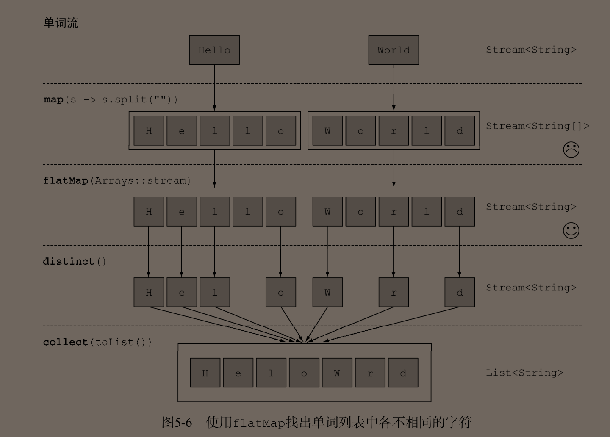


Lambda表达式碰到个复杂的东西真的是头疼：

如果有两个指定列表，分别存储元素[1,2,3]和[3,4]，如果想要使用Lambda表达式返回如下指定的数据：[(1, 3), (1, 4), (2, 3), (2, 4), (3, 3), (3, 4)]

使用Lambda表达式：

```java
public static void test() {
    List<Integer> list1 = Arrays.asList(1, 2, 3);
    List<Integer> list2 = Arrays.asList(3, 4);
    //返回数对，如（1,3），（1,4）形式
    //思路：先考虑从list1中一个元素与list2中所有元素组成一个List
    list1.stream().
        flatMap(i -> list2.stream().map(j -> {
            HashMap<Integer, Integer> map = new HashMap<>();
            map.put(i, j);
            return map;
        }))
        .forEach(System.out::println);
}
```

使用常规方式：

```java
public static void test2() {
    List<Integer> list1 = Arrays.asList(1, 2, 3);
    List<Integer> list2 = Arrays.asList(3, 4);
    ArrayList<HashMap<Integer, Integer>> list = new ArrayList<>();
    for (Integer i : list1) {
        for (Integer j : list2) {
            HashMap<Integer, Integer> map = new HashMap<>();
            map.put(i, j);
            list.add(map);
        }
    }
    System.out.println(list);
}
```


查找与匹配：


匹配：

Stream API提供了一系列方法来进行判断，应该都是返回的Boolean类型

都是终端操作：

```java
List<String> list = Arrays.asList("hello", "luckyCurve");
if (list.stream().anyMatch(i -> i.length() > 9)) {
    System.out.println("有长度大于9的字符串，但无法知道是谁");
}
```

与此类似的方法有：allMatch和noneMatch

都具有短路性，即如果allMatch碰到了一个不满足的就直接返回false了

很多操作都具有短路的特性


查找：

主要方法：findAny和findFirst

不过方法会返回一个Optional类，Optional类主要是为了避免null值（对null进行单独处理，赋予默认值或者其他操作），以下为Optional的几种操作：

- `isPresent();` optional包含值时候返回true，否则false
- `ifPresent(Consumer<T> block);` 在值存在的时候执行指定代码块
- `get();`  值存在时候返回值，否则抛出异常
- `orElse(T other);`

测试代码：

```java
ArrayList<Integer> src = new ArrayList<>();
for (int i= 0; i < 999999; i++) {
    src.add(i);
}
Optional<Integer> any = src.stream().findAny();
System.out.println(any.get());
System.out.println(any.get());
System.out.println(any.get());
```

并不会消费掉获取的元素，仅仅只是获取他罢了

会发现findAny方法也是返回第一个元素，那么和FindFirst方法有什么区别呢？

答案在并行，findFirst会严格按照并行需求返回第一个元素，而如果不关心返回的元素是哪一个，建议使用findAny方法。


Java8中的并发支持也不是非常的到位：

```java
ArrayList<Integer> src = new ArrayList<>();
for (int i= 0; i < 999999; i++) {
    src.add(i);
}

ArrayList<Integer> distinct = new ArrayList<>();
src.parallelStream().forEach(distinct::add);
```

以上代码就会报错


归约操作：将流规约成一个值，通过reduce操作来实现


求和：

主要有两个重载的方式：

```java
Optional<Integer> sum = list.stream().reduce(Integer::sum);
Integer reduce = list.stream().reduce(0, Integer::sum);
```

两者区别：第一种没有给初始值，Stream有可能为空，求出的结果有可能不存在，故使用Optional来包装

第二种是有初始值，一定能够返回一个对象回来，所以没有使用Optional对象来包装

本来传入的是`(a,b)->a+b`表达式的，但Integer里面有静态函数sum已经实现了


求最值的思路也是一样：

```java
//    求最值
Optional<Integer> max = list.stream().reduce(Integer::max);
max.ifPresent(System.out::println);
Optional<Integer> min = list.stream().reduce(Integer::min);
min.ifPresent(System.out::println);
```

也可以点进去查看求最值的具体函数实现，都是使用三元运算符来实现的


于是可以很轻易的使用map和reduce函数来实现计数处理：

```java
//    数一数流中元素的个数
Integer num = list.stream().map(a -> 1).reduce(0, Integer::sum);
System.out.println(num);
```

> map reduce操作的链接通常称为map-reduce操作，因为Google使用它进行网络搜索而得名，非常容易实现并行化


规约里面的并行好像并不容易实现，只能采取map-reduce分而治之的思想来实现并行化了


已经学到的流的操作：

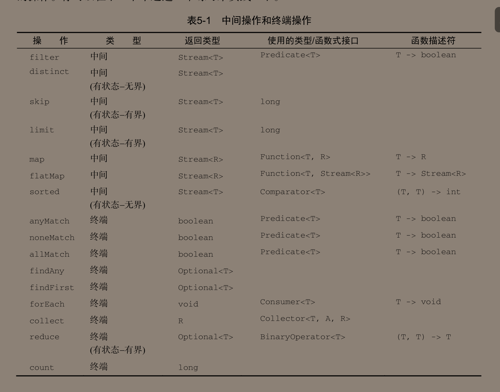


因为泛型的影响，使得流中不可能存在基本数据类型了，所有的基本数据类型都必须经过自动装箱的过程变成对应的包装类才能进入，这就造成了一定的性能损耗，还好Stream提供了三个原始类型转换流接口：

- IntStream
- DoubleStream
- LongStream

避免了自动装箱的陈本，当然其中也提供了比价多的定制化方法，例如sum等等。当然也可以在必要时候将他们转换成对象流的方法


将对象流转换成原始类型流可以直接使用mapToXXX（XXX：Int，Double，Long）

例如使用IntStream来进行求和避免自动装箱操作（如果直接使用Integer就不会有这么多事儿了，为啥都喜欢在定义数据的时候使用int这种原始类型来定义呢）

例如求交易总额：

```java
int sum = Transaction.transactions().stream()
    .mapToInt(Transaction::getValue)
    .sum();
System.out.println("Sum:"+sum);
```


如果要将其转换成为对象流：

例子：生成1~100的连续整数，并转换成`Stream<Integer>`

```java
Stream<Integer> stream = IntStream.rangeClosed(1, 100).boxed();
```

这里包括了100了，感觉好乱哦，有些end是不包含在里边的，而有些是包含在里边的


除了求和的例子很奇怪，直接返回了int类型的数据，其他的会返回OptionalInt类型，相当于是对应以下版本的Optional：`Optional<int>`，当然这个写法是错误的。

例如查找最大的元素就会返回一个OptionalInt对象。


连续值的生成，如下两个静态方法：

- range（int start，int end）
- rangeClosed（int start，int end）

区别：前者不包含end，后者包含end


练习：求100以内的勾股数

改进前的代码：

```java
Stream<int[]> stream = IntStream.rangeClosed(1, 100).boxed()
    //扁平化一个流，要不然就成为了Stream<Stream<int[]>>
    .flatMap(a -> IntStream.rangeClosed(a, 100)
             .filter(b -> Math.sqrt(a * a + b * b) % 1 == 0)
             .mapToObj(b -> new int[]{a, b, (int) Math.sqrt(a * a + b * b)}));

stream.forEach(a -> System.out.println(Arrays.toString(a)));
```


改进后的代码：

```java
Stream<double[]> stream = IntStream.rangeClosed(1, 100).boxed()
    //扁平化一个流，要不然就成为了Stream<Stream<int[]>>
    .flatMap(a -> IntStream.rangeClosed(a, 100)
             .mapToObj(b -> new double[]{a, b, Math.sqrt(a * a + b * b)})
             .filter(result -> result[2] % 1 == 0));
```


学习Stream表达式，更是为了适应以后的反应式编程

创建流的几种方式：

- 由值创建流

调用Stream的静态方法of或者是empty创建一个空流

- 有数组创建流

使用Arrays工具类的静态方法stream来创建一个流

- 由文件生成流

使用Files.lines方法返回一个流，事例代码如下：

```
Stream<String> lines = Files.lines(Paths.get("data.txt"), Charset.defaultCharset());
```

可能会抛出IO异常，使用来了新的NIO（非阻塞式IO来读取的），建议使用JDK7的try-with-resources语法糖来使用

- 由函数生成流

Stream提供的两个静态方法：Stream.iterator或者是Stream.generate，这两个方法都可以创建出无限流来，通过函数的方式

例如我要使用Iterator方法生成所有正偶数：

`Stream.iterator(0,n-> n+2);`

简单测试：生成斐波纳契数列

```java
//生成Fibonacci数列
Stream<Integer> stream = Stream.iterate(new int[]{0, 1}, t -> new int[]{t[1], t[0] + t[1]})
    .limit(20)
    .map(t -> t[0]);
stream.forEach(System.out::println);
```


上面都是使用Stream的Iterator来生成流，下面使用generate来生成，他接收一个Supplier<T>类型的Lambda表达式（Java提供了例如IntSupplier等类型），即`T get()`的表达式。他与Iterator最主要的区别就是语法形式上的不同，iterator更有种通过上一个元素生成下一个元素的语义在里面，因为语法格式的支持就是这样的，传入的对象就是上一个存储的对象

所以以下这样使用Iterator生成的斐波纳契数列更符合Iterator的语义：通过上面的元素来迭代出后面的元素来：

```java
AtomicInteger before = new AtomicInteger(1);

Stream.iterate(0, t -> {
    int result = before.get() + t;
    before.set(t);
    return result;
}).limit(20).forEach(System.out::println);
```

这里为了防止并发还是使用了原子类，其实用不用一个样，不会有并发条件的产生，没想到歪打正着，准备使用int代替的时候出现了如下异常：

```
No lines changed: content is already properly formatted
```


仍然会产生有序的输出


在并发代码中使用有状态的供应源是不安全的，应该尽量避免


不能对一个无限流使用排序或者是规约，因为所有元素都需要处理，是不可能的，永远也完不成


小结：

对流的基本操作：


对流的创建


对基本数据的流操作：IntStream，DoubleStream，LongStream和包装类流的转换


## 第六章、用流收集数据


流的终端操作会消耗流，以产生一个最终的结果，例如：count、findFirst、forEach和reduce等等


本章了解的是另一个归约操作，类似于reduce的操作——collect，将流中的元素积累成一个汇总结果，配合Collector实现


学会的第一个分组技巧（按次序生成一个List）：

```
collect(Collectors.toList())
```

第二个语法（根据某些值将Stream中的元素区分开来，并以Map形式保存）：

```
Map<Integer, List<Integer>> map = Stream.of(1, 2, 3, 4).collect(Collectors.groupingBy(integer -> 1));
System.out.println(map);

result：{1=[1, 2, 3, 4]}
```

更多的可以直接查看Collectors的支持，这些被称作预定义收集器


预定义收集器主要提供的功能：

- 将元素归约和汇总成一个值（这不就是reduce的操作码）
- 元素分组：以一个key将流中的元素进行分组
- 元素分区：元素分组的特殊情况：以Boolean类型作为分组条件


第一块：归约成一个值：

```java
Long length = info.stream().collect(Collectors.counting());
System.out.println("Length:" + length);
```

可以写成：

```
long length = info.stream().count();
```


之所以书上的例子可以直接写counting()而不用写成Collectors的形式，是因为在类开头静态导入了：`import static java.util.stream.Collectors.*;`


求最大值和最小值：

```java
Optional<String> max = info.stream().collect(Collectors.maxBy(String::compareTo));
Optional<String> min = info.stream().collect(Collectors.minBy(String::compareTo));
//省略了对Optional是否含有元素的判断，需要传入一个Comparator
System.out.println("Max:" + max.get());
System.out.println("Min:" + min.get());
```

可以写成：

```
Optional<String> max = info.stream().max(String::compareTo);
Optional<String> min = info.stream().min(String::compareTo);
```


> Java好像对Collect的一些入参都直接抽象出了对应的Stream API


汇总操作：Reduce也提供了相关操作

```
infoInteger.stream().collect(Collectors.summingInt(t -> t));
```

原函数对应着summingInt、summingDouble、summingLong，刚好对应三种基本数据类型，不过还是建议转换成IntStream然后再执行sum操作：

```
infoInteger.stream().mapToInt(t -> t).sum();
```

也可以使用Collectors::avragingInt等操作来轻松求出平均值（无法应用于无限流当中）


有时候可能会有这样的需求：一次操作返回数据的平均值，最大值等等，代码如下：

```java
IntSummaryStatistics statistics = infoInteger.stream().collect(Collectors.summarizingInt(t-> t));
//可以分别get出来
System.out.println("Statistics:" + statistics);
```


连接字符串

```java
String s = info.stream().collect(Collectors.joining());
System.out.println("Joining Result:" + s);
```

会自动调用流中元素的toString方法将其转换为Stream<String>然后执行连接操作。

增强可读性（有分隔符）的写法：

```java
String s = info.stream().collect(Collectors.joining(" | "));
System.out.println("Joining Result:" + s);
```


上面所有收集器的抽象是如下方法：

```
Collectors.reducing()
```

默认提供的那些实现只是为了增加程序的可读性和方便程序员等等

IDEA推荐将其直接转换为reduce操作，而不是collect操作


> 收集与归约：
>
> reduce和collect有什么不同？因为两种方法通常会获得相同的结果
>
> 都是聚合操作，但运行的原理有所不同：
>
> collect是可变聚合，把输入的元素积累到一个可变的容器中
>
> reduce是其他聚合，一般不是通过修改某个可变对象，而是通过将前一次的汇聚结果当成下一次的入参，反复如此，还有：count，allMatch
>
> 实际问题：reduce这种其他聚合无法并行工作，collect更适合表达可变容器的归约，很好的支持了并行


虽然达到某种情况的方案有很多，尽量选择最专业的那一个，例如求和操作就更加倾向于使用IntStream的sum函数而不是去使用`reduce(Integer::sum)`


分组操作

最佳实践展示函数式编程比指令式编程的优势

用于演示的Data类：

```java
public class Data {
    private final String name;
    private final Type type;

    public Data(String name, Type type) {
        this.name = name;
        this.type = type;
    }

    public String getName() {
        return name;
    }

    public Type getType() {
        return type;
    }

    @Override
    public String toString() {
        return "Data{" +
                "name='" + name + '\'' +
                ", type=" + type +
                '}';
    }
}
```

需要根据Data中的Type字段进行分组操作：

```java
Map<Type, List<Data>> map = infoData.stream().collect(Collectors.groupingBy(Data::getType));
System.out.println("Group Map: " + map);
```

非常的简单，如果用指令式编程估计得创建多个forEach循环

有可能出现如下需求：可能需要以id为2分组等等

```java
Map<String, List<Data>> collect = infoData.stream().collect(Collectors.groupingBy(t -> {
    if (t.getId() < 3) {
        return "LowId";
    } else {
        return "HighID";
    }
}));
System.out.println("result:"+ collect);
```


多级分组：

最常见的二级分组：groupingBy的第二个参数可为groupBy

```java
        Map<Type, Map<String, List<Data>>> map = infoData.stream().collect(Collectors.groupingBy(Data::getType,
                Collectors.groupingBy(t -> {
                    if (t.getId() < 3) {
                        return "LowId";
                    } else {
                        return "HighId";
                    }
                })));
        System.out.println("multipartGroup:" + map);
```

groupBy是一个递归函数，可以无限的嵌套下去


第二个参数其实不必要是groupingBy收集器，也可以是counting收集器

例如如下方法就统计每个Type对应的个数：

```java
Map<Type, Long> countResult = infoData.stream().collect(Collectors.groupingBy(Data::getType, Collectors.counting()));
System.out.println("Count Result: " + countResult);
```


可以多使用如下函数生成Comparator：

```java
Comparator.comparing(Data::getName)
```

```java
//找出每个Type中id最大的元素
Map<Type, Optional<Data>> map = infoData.stream().collect(Collectors.groupingBy(Data::getType, Collectors.maxBy(Comparator.comparing(Data::getId))));

map.forEach((op1,op2)-> {
    System.out.println(op1+ "\t" +op2.get());
});
```

> groupingBy不会单独为所有元素都去创建一个key，所以不存在value为null的情况，故上面的Optional不是很有意义，值是必然存在的


可以使用Collectors.collectionAndThen函数来实现对Optional的自动拆箱

```java
//改进，去掉Optional
Map<Type, Data> collect = infoData.stream().collect(Collectors.groupingBy(Data::getType, Collectors.collectingAndThen(Collectors.maxBy(Comparator.comparing(Data::getId)), Optional::get)));
System.out.println("Simple Result:" + collect);
```

> 使用collectionAndThen函数去操作Optional的get函数前提是这个操作是绝对安全的


分区：是分组的特殊形式，得到的Map的键是Boolean类型（感觉也可以使用groupingBy来进行分组，不过使用partitioningBy语义更加明显），和groupingBy一样也支持多级的分组，只需要传入合适的收集器即可，不过最外层永远是Key为true或者是false的Map

划分质数与非质数：

```java
//判断一个数是否为质数
public static Boolean isPrime(Integer candidate) {
    //如果都不满足：
    return IntStream.range(2, candidate).noneMatch(i -> candidate % i == 0);
}

//分区操作
public static Map<Boolean, List<Integer>> partitionPrimes(Integer n) {
    if (n<2) {
        throw new IllegalArgumentException("Number is too small");
    }
    return IntStream.rangeClosed(2,n)
        .boxed()
        .collect(Collectors.partitioningBy(PrimeNumber::isPrime));
}

public static void main(String[] args) {
    Map<Boolean, List<Integer>> map = partitionPrimes(100);
    System.out.println(map);
}    
```


Collectors操作汇总表：

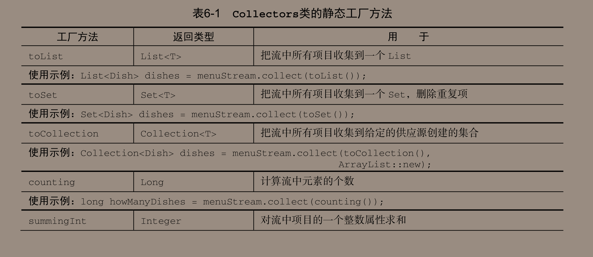

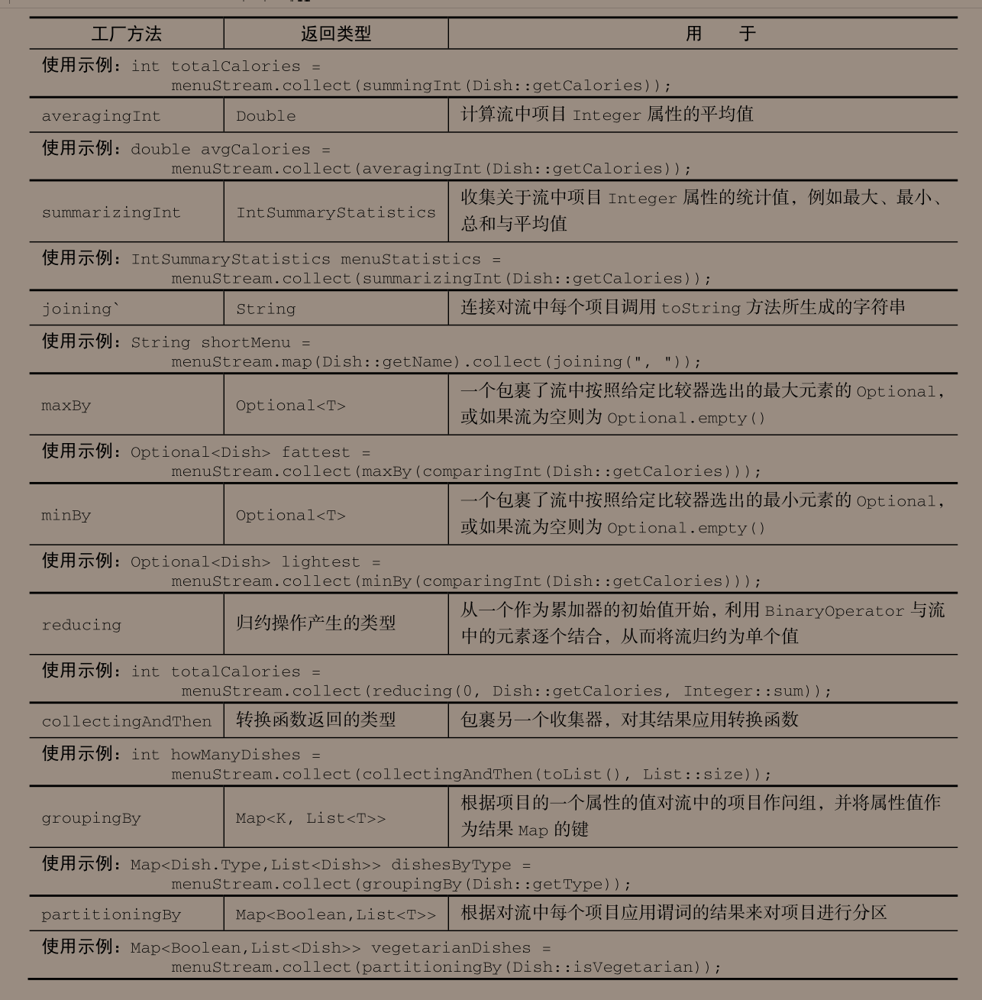


所有的收集器都是对Collector接口的实现，接下来讨论自定义的Collector接口实现，实现自定义的归约操作，例如将数据流划分成质数与非质数


Collector接口抽象：

```java
public interface Collector<T, A, R> {
    //返回元素的承载容器，如果是List就创建一个空的List
    Supplier<A> supplier();
    
    BiConsumer<A, T> accumulator();

    BinaryOperator<A> combiner();

    Function<A, R> finisher();
	//提供一系列特征，告诉collect方法在执行时候可以应用哪些优化
    Set<Characteristics> characteristics();
}
```

> 泛型说明：
>
> - T：流中要收集的元素的泛型
> - A：累加器类型，在收集过程当中用于积累部分结果的对象
> - R：收集操作得到的对象的类型，通常是集合


类似于Collectors.toList()方法的实现：

```java
/**
 * @author LuckyCurve
 * @date 2020/7/5 16:10
 * 自定义Collector
 */
public class ToListCollector<T> implements Collector<T, List<T>, List<T>> {
    /**
     * 1、创建空的累加器实例，通常直接调用实例的无参构造函数
     */
    @Override
    public Supplier<List<T>> supplier() {
        return ArrayList::new;
    }

    /**
     * 2、将元素添加到结果容器。会提供两个参数：
     * 流中前n-1个项目的结果累加器
     * 第n个元素本身
     * 都是通过lambda表达式体现出来的
     */
    @Override
    public BiConsumer<List<T>, T> accumulator() {
        //return (list,item) -> list.add(item);
        //写法优化
        return List::add;
    }

    /**
     * 4、如果不考虑并行操作，这里就不用了
     * 对并行操作的支持，并行操作的结果合并
     * 主要是合并两个结果容器
     */
    @Override
    public BinaryOperator<List<T>> combiner() {
        return (list1, list2) -> {
            list1.addAll(list2);
            return list1;
        };
    }

    /**
     * 3、对结果容器应用最终转换
     * 在完成对最后一个元素的遍历后，是否需要操作将累加器转换
     * 成为最终符合预期的对象类型，通常是不需要的
     */
    @Override
    public Function<List<T>, List<T>> finisher() {
        return Function.identity();
    }

    /**
     * 5、对流操作优化的配置
     * 主要包含三个特性的枚举
     * CONCURRENT：允许并行调度，如果没有UNORDERED特性，只会在无序的数据源情况下使用并行归并操作
     * UNORDERED：归约结果不受流中项目遍历和积累顺序影响
     * IDENTITY_FINISH：finisher（）方法可以跳过，跳过转换
     */
    @Override
    public Set<Characteristics> characteristics() {
        /*
          可以标注为CONCURRENT，但所有入参都是有序的，标注了也不会有太大作用
          无法标注为UNORDERED
          可以标注IDENTITY_FINISH
         */

        return Set.of(Characteristics.IDENTITY_FINISH,Characteristics.CONCURRENT);
    }


    /**
     * 测试
     */
    public static void main(String[] args) {
        Stream<String> stream = Stream.of("hello", "world", "Java");
        List<String> list = stream.collect(new ToListCollector<String>());
        System.out.println(list);
    }
}

```


自定义Collector的优势在于：

可以在Collector内部访问到先前处理的元素了，而在外部仅仅只是使用封装好的Collector是达到这种效果的

性能的优化也来源于此，可以在利用前面已经满足条件的数据来增加这次查找的效率

可以查看6.6节查看具体应用，感觉使用场合不会很多，虽然利用前面的数据确实可以很大的提升效率，但规律比较难找，需要对算法的了解程度。


小结：

- collect操作及其传入的收集器
- 使用内置的收集器统计出流的最值，平均值等值，可以直接通过summarizingInt全部取出，或者转换成对应的原始类型Stream来处理
- 分区、分组
- 收集器可以轻易的复合，进行多级分区和多级分组
- 自定义Collector


## 第七章、并行数据处理与性能


使用Stream最大的好处就是利用计算机的多个内核进行运算

在JDK8之前，想要使用并发处理得避免竞态条件，还好JDK7引入了叫做分支/合并的框架，让这些操作执行起来更加稳定

流即在幕后应用JDK7提供的分支合并框架的

了解并行流的运行原理以及可能会产生的意外的结果


可以通过parallelStream方法将收集源转换成并行流

并行流：把一个内容分成多个数据块，并用不同的线程分别处理每个数据块的流


只有当数据特别大的时候并行流的优势才得以体现，要不然协同几个处理器的结果都需要花费不少时间，反倒效率会降低

可以直接对stream调用parallel方法可以使流并行化，生成的还是Stream对象，实际上只是内部设置了一个boolean标志位是否要将操作并行化而已

也可以对一个并行流调用sequential方法将其变换为一个顺序流

因此可以很方便的控制流的哪一段操作并行执行，哪一些操作可以串行执行


底层是基于分支/合并框架执行的，即ForkJoin框架，默认创建线程池的数量是当前处理器的核心数量，通过`Runtime.getRuntime().availableProcessors()`获得，其实Runtime可以获取到很多信息，包括剩余内存等等


书本上的测试Demo：

```java
package cn.luckycurve.demo.character7;

import java.util.function.Function;
import java.util.stream.Stream;

/**
 * @author LuckyCurve
 * @date 2020/7/6 10:34
 * 对并行流的性能测试：迭代式，顺序归纳，并行归纳
 */
public class PerformanceTesting {

    public static Long statistic = 10_000_000L;

    /**
     * @return 返回最快时间，单位ms
     */
    public static Long measureSumPerf(Function<Long, Long> adder, Long n) {
        //记录最短时间
        long fastest = Long.MAX_VALUE;
        for (int i = 0; i < 10; i++) {
            long start = System.nanoTime();
            Long sum = adder.apply(n);
            long duration = (System.nanoTime() - start) / 1_000_000;
            System.out.println("Result:" + sum);
            if (duration < fastest) {
                fastest = duration;
            }
        }
        return fastest;
    }

    /**
     * 常规迭代
     */
    public static Long normal(Long n) {
        long sum = 0;
        for (int i = 0; i < n; i++) {
            sum += i;
        }
        return sum;
    }

    public static Long order(Long n) {
        return Stream.iterate(0L, p -> p + 1)
                .limit(n)
                .reduce(0L, Long::sum);
    }

    public static Long parallel(Long n) {
        return Stream.iterate(0L, p -> p + 1)
                .limit(n)
                .parallel()
                .reduce(0L, Long::sum);
    }


    public static void main(String[] args) {
        Long time = 0L;
        time = measureSumPerf(PerformanceTesting::normal, statistic);
        System.out.println("Time:" + time + "ms");
        System.out.println("-----------------------------------------");
        time = measureSumPerf(PerformanceTesting::order, statistic);
        System.out.println("Time:" + time + "ms");
        System.out.println("-----------------------------------------");
        time = measureSumPerf(PerformanceTesting::parallel, statistic);
        System.out.println("Time:" + time + "ms");
    }


}

```

> 真的很漂亮，对方法抽象的非常完美

Result：

```java
Result:49999995000000
Result:49999995000000
Result:49999995000000
Result:49999995000000
Result:49999995000000
Result:49999995000000
Result:49999995000000
Result:49999995000000
Result:49999995000000
Result:49999995000000
Time:6ms
-----------------------------------------
Result:49999995000000
Result:49999995000000
Result:49999995000000
Result:49999995000000
Result:49999995000000
Result:49999995000000
Result:49999995000000
Result:49999995000000
Result:49999995000000
Result:49999995000000
Time:80ms
-----------------------------------------
Result:49999995000000
Result:49999995000000
Result:49999995000000
Result:49999995000000
Result:49999995000000
Result:49999995000000
Result:49999995000000
Result:49999995000000
Result:49999995000000
Result:49999995000000
Time:150ms

Process finished with exit code 0
```

结果和我自己测试的差不多，

并行性能远差于串行性能

主要是Iterator的限制，每次都需要上一次Iterator的结果才能继续执行，很难将问题直接分成独立的小块，其实本质上还是串行操作，只是将串行任务分配到不同的线程上去了，且同一时间只有一个线程在执行而已

至于常规的操作也比串行的操作好，还是由于Iterator的性能瓶颈

解决办法很简单，也就是我一直推崇的原始数据流的range方法来代替Iterator方法

改进：

```java
public static Long optimizeOrder(Long n) {
    return LongStream.range(0,n)
        .sum();
}

public static Long optimizeParallel(Long n) {
    return LongStream.range(0,n)
        .parallel()
        .sum();
}
```

结果：

```java
Result:49999995000000
Result:49999995000000
Result:49999995000000
Result:49999995000000
Result:49999995000000
Result:49999995000000
Result:49999995000000
Result:49999995000000
Result:49999995000000
Result:49999995000000
Normal Time:6ms
-----------------------------------------
Result:49999995000000
Result:49999995000000
Result:49999995000000
Result:49999995000000
Result:49999995000000
Result:49999995000000
Result:49999995000000
Result:49999995000000
Result:49999995000000
Result:49999995000000
Order Time:81ms
-----------------------------------------
Result:49999995000000
Result:49999995000000
Result:49999995000000
Result:49999995000000
Result:49999995000000
Result:49999995000000
Result:49999995000000
Result:49999995000000
Result:49999995000000
Result:49999995000000
OptimizeOrder Time:3ms
-----------------------------------------
Result:49999995000000
Result:49999995000000
Result:49999995000000
Result:49999995000000
Result:49999995000000
Result:49999995000000
Result:49999995000000
Result:49999995000000
Result:49999995000000
Result:49999995000000
Parallel Time:275ms
-----------------------------------------
Result:49999995000000
Result:49999995000000
Result:49999995000000
Result:49999995000000
Result:49999995000000
Result:49999995000000
Result:49999995000000
Result:49999995000000
Result:49999995000000
Result:49999995000000
OptimizeParallel Time:1ms
```

突破Iterator带来的性能瓶颈，就连串行的方法都快了很多

如果用错了，性能损失的不是一点两点了，而且很难调试的到


避免共享可变状态，确保并行Stream得到正确的结果，特别是在使用forEach迭代数据的时候千万要记得避免共享变量


使用并行流的一些建议：

- 如果有疑问，测试、问题通常与你的感觉相悖
- 留意装箱、装箱会大大降低性能，Java8有原始数据流供使用，尽量使用这些流
- 有些操作在并行流上的性能就比顺序流差、特别是limit、findFirst等依赖于元素顺序的操作，~~还有Iterator~~（Iterator是数据源操作，不该列在这里）。对limit，无序流调用会比有序流更加高效，可以调用unordered方法将有序流变成无序流。对findFirst在并行流中代价非常大，如果对顺序不执著的话强烈建议使用findAny代替。
- 对于较小的数据量，使用并行几乎从来都不是一件好事儿、和我的理解非常像
- 考虑数据结构是否容易分解、例如ArrayList就比LinkedList容易拆分的多，因为前者可以不用遍历就平均拆分，后者则不行，另外用range工厂方法创建的原始数据流也可以快速的拆分，非常适合用来做并发
- 考虑终端操作对流的合并操作代价的大小，避免在结果合并的时候消费了太多的性能


数据源操作对并发的支持（也就是下表的可分解性）：

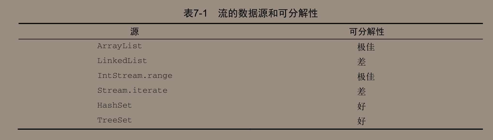


接下来看看并行流的基础框架：ForkJoin框架


分支/合并框架：以递归方式将可以并行的任务拆分成更小的任务，然后将每个任务的结果合并起来并生成整体结果。他是ExecutorService接口的一个实现，将任务交给线程池中的工作线程，然后再合并

可以看下ForkJoinPool的类继承图：

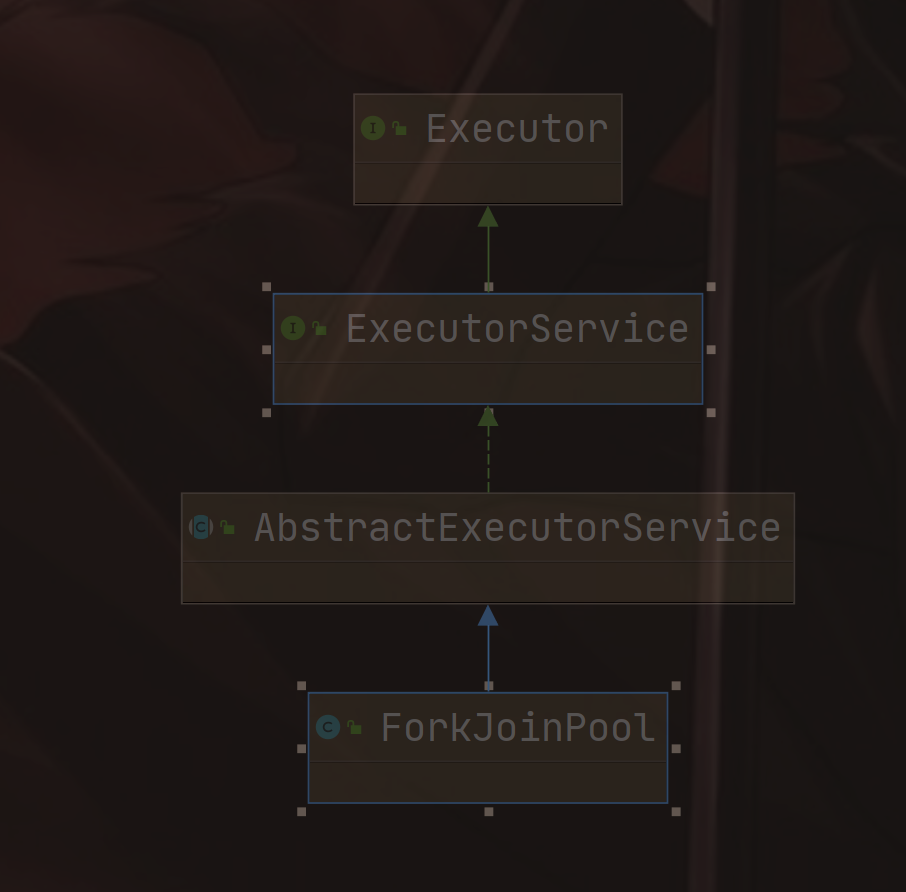


这里的Task实质上指的是ForkJoinTask实现——RecursiveTask<R>

R是任务产生的结果返回类型，如果没有返回结果，则使用RecursiveAction来代替

唯一的需要实现方法：

```java
protected abstract V compute();
```

任务处理逻辑是：将任务拆分成子任务，直到任务无法拆分时候生成解决单个子任务的逻辑，类似于递归调用，不过是多核同时的递归调用

执行逻辑：

```
if (任务足够小或不可分) {
	顺序计算该任务
} else {
    将任务分成两个子任务
    递归调用本方法，拆分每个子任务，等待所有子任务完成
    合并每个子任务的结果
}
```

即分而治之思想的并行版本


执行的代码示例：

```java
new ForkJoinPool().invoke(RecursiveTaskImpl)
```

尽量别这么用，保证ForkJoinPool的单例，可以注入到IOC容器当中，要使用的时候直接取出

使用起来可能比直接使用并行流来的效果要差


ForkJoin需要你找到一个标准来判断这个任务是应该继续拆分还是直接执行，这个标准是动态的，需要你自己根据机器的实际环境去测试

尽量把任务分细一点，虽然可能会遇到一些问题，但可以充分利用ForkJoin框架的窃取机制，从别的线程的工作队列的队尾获取到一个任务去执行，保证CPU的最大利用率，直到全部任务都完成为止或者全部任务都在被执行


既然并行流是依赖于ForkJoin框架的，必然会有任务的拆分，那么是如何完成的呢？

依赖的自动机制被称为——Spliterator机制


Spliterator是一个接口，可分迭代器，一般都不用自己去实现Spliterator接口，Java8已经为集合框架中包含的所有数据结构都提供了一个默认的Spliterator实现，了解即可


# 第三部分、高效Java8编程


旨在通过Java8的各种特性更有效的改善代码的质量


## 第八章、重构、测试和调试


本章主要讨论的就是：面对老版Java接口编写的遗留问题，即对代码的重构

并且还讲解了几种设计模式和Lambda表达式，Stream API的调试


从增强可读性的方向重构代码需要注意的几点：

- 用Lambda表达式取代匿名类
- 用方法引用重构Lambda表达式（例：尽量使用Integer::sum去代替你写的求和）
- 用Stream API重构命令式的数据处理


第一点的限制：

不仅仅是需要接口支持函数式编程，还会出现以下问题：

```java
Integer a = 10;
//报错
Runnable runnable1 = () -> {
    Integer a = 20;
    System.out.println(a);
};
new Thread(runnable1).start();

Runnable runnable2 = new Runnable() {
    @Override
    public void run() {
        Integer a = 20;
        System.out.println(a);
    }
};
new Thread(runnable2).start();
```

原因在于：匿名类可以屏蔽包含类的对象，但是Lambda表达式不行，换言之，Lambda里面定义的变量的作用域与包含类里面的变量作用域相同，而匿名类拥有自己的变量作用域

此外还有：由于Lambda变量没有自己的作用域，在Lambda表达式中的this指的是包含类的实例化对象，而匿名类指的是当前匿名对象

最后，在涉及重载的方法中，Lambda表达式可能不适用，例如如下代码：

```java
@FunctionalInterface
interface Task{
	public void execute();
}
public static void doSomething(Runnable r){
    r.run(); 
}
public static void doSomething(Task a){ 
    a.execute(); 
}
```

如果使用如下代码：

```java
doSomething(()->{System.out.println("Hello world")});
```

则可能出现问题，因为Lambda是根据上下文语义来判断的，这时候可能就需要显式转换了：

```java
doSomething((Task)()->{System.out.println("Hello world")});
```

IntelliJ支持这种重构，会帮你避免发生这种情况


第二点：从Lambda表达式到方法引用之间的转换

往往方法名更能够直观的表达代码的意图，可以使用类中的方法来改善代码的可读性（更常见的：自己将代码块抽象出方法来，给方法一个合理的命名）

```java
List<Integer> list = List.of(1, 4, 7, 3, 7, 9, 4, 2, 99, 0);
Map<String, List<Integer>> map = list.stream().collect(Collectors.groupingBy(t -> {
    if (t < 5) {
        return "Lower";
    } else {
        return "Higher";
    }
}));
System.out.println(map);
```

可以将groupBy代码抽象出如下结果：

```java
public static void main(String[] args) {
    List<Integer> list = List.of(1, 4, 7, 3, 7, 9, 4, 2, 99, 0);
    Map<String, List<Integer>> map = list.stream().collect(Collectors.groupingBy(GroupByExample::intJudge));
    System.out.println(map);
}

public static String intJudge(Integer i) {
    if (i < 5) {
        return "Lower";
    } else {
        return "Higher";
    }
}
```

> 这里之所以将方法标注为static，主要是因为主函数是static，static方法无法调用非static方法

尽量使用库函数，不仅少些代码，读起来还直观，如以下两个求和操作：

```java
int totalCalories =menu.stream()
    .map(Dish::getCalories)
    .reduce(0, (c1, c2) -> c1 + c2);

int totalCalories = menu.stream()
    .collect(summingInt(Dish::getCalories));
```


最后一点：将数据处理从命令式转换为Stream

主要的优点就是：代码容易实现并行，可读性强，短路，延迟加载等特性

缺点：转换过程困难，需要将原本的控制流转换成流方式的控制流


以上是代码的可读性，下面是代码的灵活性：

构建函数式接口，在什么情况下应该使用函数式接口呢？主要是**有条件的延迟执行**和**环绕执行**

- 有条件的延迟执行：

可以直接将需要判断的固定代码抽象到一个方法里面去，将需要执行的方法作为参数传入，设计这样的一个通用接口就可以了

- 环绕执行

特别是对特定资源，需要指定准备阶段和清理阶段，完美适配Lambda表达式


<hr></hr>


使用Lambda表达式重构面向对象的设计模式

对设计经验的归纳被称作设计模式，往往可以复用这些方式方法来解决一些常见问题。如：

访问者模式：用于分离程序的算法和它的操作对象

单例模式：限制类的实例化，只生成一份对象

使用Lambda表达式可以使得很多现存的略显臃肿的面向对象设计模式以更加精炼的方式实现了。本书举例：

- 策略模式
- 模板方法
- 观察者模式
- 责任链模式
- 工厂模式


这部分直接挪到了常见错误&基础结论中去了。


Lambda表达式的测试：

开发一时爽，维护火葬场

我们往往是需要正确的代码

应该尽量测试外层方法而不是Lambda表达式，因为Lambda表达式没有方法名，无法直接调用并测试他

如果实在需要，可以再将其转换成方法进行测试

高阶函数测试更加难，即传入一个函数，传出一个函数

如果测试出现问题，那么就进入了调试阶段


调试的两大要素：

- 查看栈追踪
- 输出日志

不幸的是，Lambda表达式没有方法名字，它的栈追踪可能比较难

至于输出日志，别用forEach输出，forEach会直接影响整个流，使用peek方法打印你想要直到的中间值，用法如下：

```java
List<Integer> result =
numbers.stream()
.peek(x -> System.out.println("from stream: " + x))
.map(x -> x + 17)
.peek(x -> System.out.println("after map: " + x))
.filter(x -> x % 2 == 0)
.peek(x -> System.out.println("after filter: " + x))
.limit(3)
.peek(x -> System.out.println("after limit: " + x))
.collect(toList());
```


## 第九章、默认方法


默认方法的出现主要是为了以一种兼容的方式改进API

往往设计者更新接口的时候，接口的实现类都无法使用了，特别是随着Java API的数量级的增大，这种问题愈发严重

Java8的接口现在支持在声明方法的同时提供实现，可以通过两种方法来实现：

- 在接口内部声明静态方法
- 使用默认方法，指定方法的默认实现

这样就可以让接口平滑的进行优化和演进。

最常见的例子：

- List接口中的sort方法
- Collection接口的stream方法

这样的话接口看起来越发的像抽象类了，只有其中的一部分方法需要去实现，会带一些默认实现的方法

> 抽象类与接口之间的区别：
>
> - 一个类只能继承一个抽象类，却可以实现多个接口
> - 抽象类可以通过实例变量（字段）来保存信息，而接口是不能有实例变量的


突发奇想：如果一个类继承两个接口，两个接口都定义了相同的签名的默认方法实现，即以下这种情况，会怎么样呢？

```java
public interface Interface1 {
    default String hello() {
        return "Interface1:hello";
    }
}

public interface Interface2 {
    default String hello() {
        return "Interface2:hello";
    }
}

public class ImplTest implements Interface1,Interface2 {

}
```

编译器会强制要求ImplTest手动实现hello方法

如果修改其中一个接口的方法签名，例如在Interface1接口中的方法中增加一个参数，就会使得其可进行编译。


> 随着Java8的接口对静态方法的支持，很多的辅助工具类会渐渐地被取代
>
> 例如Collections可能会逐步被声明在Collection内部的static方法所取代，从而保证更好的向后兼容性


默认方法的使用途径：

- 可选方法

即对一些方法的默认不支持，避免了许多方法的方法体都是return null的情况发生

例如Iterator的remove方法使用Java8的默认方法：

```java
default void remove() {
    throw new UnsupportedOperationException("remove");
}
```

虽然提供了remove接口，但是会损伤迭代器的整体运行逻辑，不好写，但是有可能用户自定义的迭代器可以很轻松的实现这个功能，于是提供了这个方法接口


> 关于继承的错误观点：
>
> 不应该一想到代码复用就试图使用继承，会将类引入不必要的复杂性。就像Java编程思想里说的，优先考虑组合而不是继承。Java为了防止继承这种属性被滥用，JDK里大量定义了final类来防止被继承，防止核心代码的功能被污染


接下来就是默认方法实现冲突规则：

如果一个类实现了两个接口，这两个接口都拥有相同方法的数字签名，那么处理这种冲突的规则如下（书上举的例子和我这也差不多，都是接口提供hello方法）：

1. 类中的方法优先级最高，类或父类中声明的方法优先级高于任何声明为默认方法的优先级
2. 如果无法依靠第一条进行判断，则子接口的优先级更高，即如果B接口扩展了A接口，那么B接口方法的优先级较高
3. 如果还是无法判断，则继承了多个接口的类必须显式的覆盖和调用期望的方法，显式的选择使用哪一个默认方法的实现


存在一个折磨人的问题：

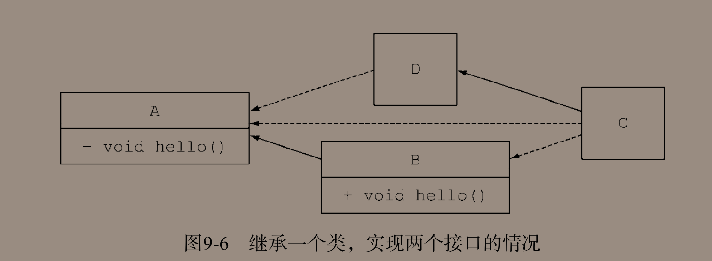

D是实现了A接口的一个类，直接沿用了A的默认方法，并以D为基类创建了类C。

此时调用C的hello方法，按照第一条规则应该直接遵从D中的hello方法，答案却是遵循B中的方法，因为D没有实现自己的hello方法，他的hello方法源于A，所以根据第二条规则执行的是B

如果D实现了自己的hello方法，则执行的是D的hello方法

即编译器会选择更加具体的接口或类实现来定义类的方法源于何处

```java
public class ImplTest implements Interface1,Interface2 {

    public static void main(String[] args) {
        new ImplTest().hello();
    }

    @Override
    public String hello() {
        return Interface1.super.hello();
    }
}
```


最后一个场景，也是C++最为头疼的一个难题：菱形继承问题

接口BC直接拓展接口A，类D直接实现了BC接口

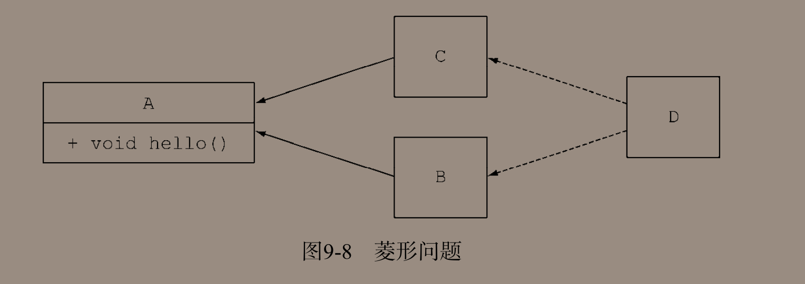

这时候调用D的hello方法就相当于调用A的hello方法了。


如果BC实现了自己的hello默认方法，就会以BC的默认方法为依据

如果C中声明了一个普通的hello方法，由于其优先级比A中的默认方法要高（B中的hello方法也要被认作是A中的），就需要类D自己实现hello了


> 当然这只是在Java语言中被简化了的菱形问题，由于C++的多继承会造成更加复杂的问题，直接将上面的全部看成类（这在Java当中是不存在的），因为C++中也支持向上转型，如果使用A的引用去调用某个方法，这个方法在BC中都有各自的实现，在D中没有实现，则需要手动的指定这个方法是来源于B还是来源于C


遵循着越具体的原则去处理冲突问题可以很轻易的解决问题。


记住Java8还提供了接口对静态代码的支持


## 第十章、用Optional取代null


1965年就有人提出了null，只是因为这种方式设计语言实现起来比较容易，此后的语言为了与前面的语言保持兼容，都保存了null，例如1972年发行的C和1995年发行的Java

导致最常见的NullPointerException异常

最常见的避免的方式就是：每次都做null检查


看下其他语言对NULL的替代品：

Groovy通过引入安全导航操作符？可以安全访问可能为null的变量

Scala提供了名为Optional[T]的数据结构，他既可以包含T类型的变量，也可以不包含变量，每次想要获取值的时候不得不做语法层面的检查。


Java8借鉴的Optional，完成了null到Optional的迁移

使用Optional空对象来代替null值，语义是等价的。例如在传入用户名的时候当用户名不存在的时候不要传入null，而是传入`Optional<String>`来避免NULL值的产生，可以使用Optional.empty来返回一个空的Optional对象。

此外使用Optional还有一个好处就是在语义层面上可以告诉别人这里是可以为null的

主要是为了在存取数据的时候直接报出异常，而不是等你调用null里面的某个方法再发现null异常之后再用工具调试这个null值是哪儿来的


使用Optional

1. 创建Optional对象

主要因为Optional构造方法被声明为private了，

主要有三种工厂方法：

声明空的Optional：`Optional.empty()`

```java
public static<T> Optional<T> empty() {
    @SuppressWarnings("unchecked")
    Optional<T> t = (Optional<T>) EMPTY;
    return t;
}
```

依据一个非空值创建Optional：`Optional.of(obj)`

```java
public static <T> Optional<T> of(T value) {
    return new Optional<>(value);
}

private Optional(T value) {
    this.value = Objects.requireNonNull(value);
}
```

所以当value为null的时候会直接抛出NullPointerException异常，避免过久后才发现异常

可接受null的Optional：`Optional.ofNullable(obj)`

```java
public static <T> Optional<T> ofNullable(T value) {
    return value == null ? empty() : of(value);
}
```


对其中的对象转换成另一种数据——map

就是Stream里面我们使用的map，可以把Optional理解成单个对象的Stream

```java
public <U> Optional<U> map(Function<? super T, ? extends U> mapper) {
    Objects.requireNonNull(mapper);
    if (!isPresent()) {
        return empty();
    } else {
        return Optional.ofNullable(mapper.apply(value));
    }
}
```

接收一个Function，将Optional中的对象转入到另一种形式，如果不存在的话就直接变成了empty的状态


map能操作，flatmap也能操作，其目的就是为了让流扁平化，防止出现多层Optional嵌套的情况出现


可以对optional对象使用orElse方法来保证当其为null的时候可以有一个默认值

```java
public T orElse(T other) {
    return value != null ? value : other;
}
```

通过这个方法，处理潜在的缺失值的时候就非常的具有优势


Optional的使用范围：

Java语言的架构师Brain Goetz曾经明确的陈述过：Optional的设计初衷仅仅是要支持能返回Optional对象的语法。所以不支持Serializable接口，在框架中使用Optional很有可能会引发程序故障


获取Optional内部的对象：

- get

```java
public T get() {
    if (value == null) {
        throw new NoSuchElementException("No value present");
    }
    return value;
}
```

最简单但是最不安全的方法，很容易抛出异常


- orElse

```java
public T orElse(T other) {
    return value != null ? value : other;
}
```

提供默认值在Optional不包含对象的时候使用


- orElseGet

```java
public T orElseGet(Supplier<? extends T> supplier) {
    return value != null ? value : supplier.get();
}
```

传入一个Supplier在Optional不包含对象的时候调用


- orElseThrow

```java
public T orElseThrow() {
    if (value == null) {
        throw new NoSuchElementException("No value present");
    }
    return value;
}

public <X extends Throwable> T orElseThrow(Supplier<? extends X> exceptionSupplier) throws X {
    if (value != null) {
        return value;
    } else {
        throw exceptionSupplier.get();
    }
}
```

方法被重载过，可以使用第二个方法抛出定制化的异常


使用Optional的建议：

Optional是在Java8提出的，很多老的API都不可能改成Optional的样子


- 用Optional封装可能为null的值

```java
Optional<Object> value = Optional.ofNullable(map.get("key"));
```

- 将异常转换为Optional

最常见的就是Integer.parseInt(String s) throws NumberFormatException

如果转换不成功就会抛出异常，你不想每次都去catch然后再来处理这些异常，这样会显得程序很笨拙，可以使用如下包装类：

```java
public static Optional<Integer> stringToInt(String s) {
    try {
    	return Optional.of(Integer.parseInt(s));
    } catch (NumberFormatException e) {
    	return Optional.empty();
    }
}
```


Optional也像Stream一样提供了三个原始类型数据，但是不建议使用他们


## 第十一章、CompletableFuture：组合式异步编程


本章主要是关于异步非阻塞计算


两种趋势推动着Java语言的发展：

- 硬件平台的影响

随着多核CPU时代的来领，如何充分利用硬件成为了一个重要的因素。

Java对其支持：Java7的分支/合并框架，Java8的并行流都为了更简单高效的实现这一目的

- 公共API日益增长的互联网服务应用

各个公司纷纷提供自己的API服务，而不是像以前一样以完全隔离的方式工作。现代的网络应用愈发倾向于调用别的API采用“混聚”的方式聚合来自多个源的内容

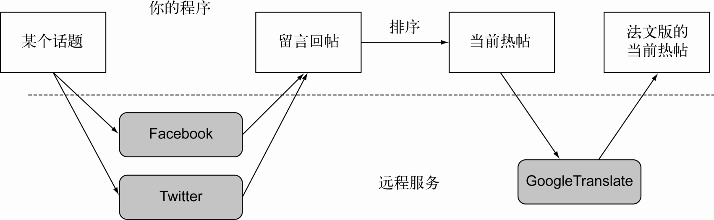

当然当出现网络服务慢的时候应用程序可以单独处理，例如调用谷歌地图，如果网络慢，可以先展示文字而不是呆呆地等着谷歌地图的图片加载出来

这其中就可能存在这样的问题：你不想因为等待FaceBook的数据而暂停对来自Twitter的数据的处理

对这种问题的抽象：如果想要充分利用CPU的核，尽可能地提高程序的吞吐量，那么你真正想要的其实是避免因为等待远程服务的返回，或者对数据库的查询，而阻塞线程的执行，浪费宝贵的计算资源。

那么Java8的Future接口，尤其是他的新版实现类CompletableFuture

> Future和CompletableFuture都是来自于JUC包下，出自并发大师Doug Lea之手
>
> Future1.5版本就有了，CompletableFuture在Java8推出


Future接口

设计初衷就是对将来某个时刻会发生的结果进行建模。它建模了一种异步计算，返回一个执行运算结果的引用，当运算结束后，这个引用被返回给调用方。**在Future中触发那些潜在耗时的操作把调用线程解放出来，让它能够继续执行其他有价值的工作，不再呆呆等待耗时操作的完成**

在Java8之前使用Future的一个典型例子：

```java
ExecutorService executor = Executors.newSingleThreadExecutor();

//标准用法
Future<String> future = executor.submit(() -> {
    //do calculate to get a result
    return "hello world";
});

//do something else
try {
    String s = future.get(1, TimeUnit.SECONDS);
} catch (InterruptedException e) {
    //线程被中断异常处理
    e.printStackTrace();
} catch (ExecutionException e) {
    //异步计算异常处理
    e.printStackTrace();
} catch (TimeoutException e) {
    //等待超时异常处理
    e.printStackTrace();
}
```

使用submit方法去异步执行任务，使用Future的get方法化异步为同步，极力推荐带超时时间的get版本，为了防止永无止境的等待下去的问题

可以调用Future的isDone方法来查看Future计算是否完成


Future接口的局限性：

- 很难通过代码的方式来表述Future之间结果的依赖性，从文字上看表达很简单，特别是出现以下情况：
  - 将两个异步任务合并成一个——这两个异步任务相互独立，第二个任务依赖于第一个任务的结果
  - 等待Future集合中的所有任务都完成
  - 仅等待Future集合中最快结束的任务完成，并返回它的结果
  - 通过编程方式完成一个Future任务的执行（手工设置异步操作结果的方式）
  - 应对Future的完成事件（即当前线程会在Future完成时候收到消息，并能使用Future的计算结果去进行下一步的操作，不只是简单地阻塞等待操作的完成）

CompletableFuture使用了Java8提供的语法实现了Future接口并使用其新特性更直观的将上述的方式变为可能，很好的支持了Lambda表达式。

CompletableFuture和Future的关系类似于Stream和Collection的关系


使用CompletableFuture：

目标：最佳价格查询器，查询多个在线商店，找出最低的商品价格


> 同步API和异步API：
>
> 同步API只是对传统方法调用的另一种称呼：调用了某个方法，调用方在调用方法运行的过程中会持续等待，被调用方运行结束返回，调用方取得返回值并继续运行，即**阻塞式调用**这个名词的由来
>
> 异步API：会直接返回，会将剩余的任务调用交给另一个线程去做，该线程和调用方是异步的——也就是非阻塞调用，等到计算完成之后，线程会将他的计算结果返回给调用方，主要的方式有两种：
>
> 1. 回调函数
> 2. 由调用方再次执行一个“等待，直到计算完成”的方法调用
>
> 第二种方式在IO系统程序设计中非常常见：发起一次磁盘访问，这次访问是异步的，当你完成其他任务时候，想要再对磁盘执行操作，这时候磁盘操作可能还没有执行完成，你只需要等待磁盘操作的执行即可


最佳实践：最佳价格查询器

先模拟每个商店查找价格的API

```java
public class Shop {    
	public Double getPrice(String product) {
        //待实现的操作
        return null;
    }
}
```

这里面可能执行一些耗时的任务，如：查询数据库、联系其他外部服务（商品供应商、和制造商有关的推广服务），使用线程休眠来模拟延迟

```java
public static void delay(Integer second) {
    try {
        TimeUnit.SECONDS.sleep(second);
    } catch (InterruptedException e) {
        //    返回RuntimeException，确实是无法修复
        throw new RuntimeException(e);
    }
}
```


使用异步方法来对getPrice方法进行重写

```java
public Future<Double> getPriceAsync(String product) {
    CompletableFuture<Double> future = new CompletableFuture<>();
    //在实际项目中使用池化资源
    new Thread(() -> {
        Double price = calculatePrice(product);
        //将计算结果存入CompletableFuture中
        future.complete(price);
    }).start();
    return future;
}
```

到主线程中会得到一个Future对象，在需要获取数值前可以做一些别的事儿，获取时候调用其带时间的get方法，测试代码如下

```java
Shop shop = new Shop("MyShop");
long start = System.nanoTime();
Future<Double> future = shop.getPriceAsync("My favorite product");
long durationTime = (System.nanoTime() - start) / 1_000_000L;
//此时输出5ms，远低于我们预定的1s
System.out.println("Consume Time: " + durationTime + "ms");

//do something
System.out.println(future.get(2, TimeUnit.SECONDS));

```

出现异常一定要向上抛出，不要轻易的在线程中使用catch，除非是构建自定义异常再抛出，否则可能出现异常生吞的情况发生


问题：如何正确的处理异步任务执行过程中可能出现的错误

如果商品价格在计算过程中发生错误，且如果get方法没有使用限时版本的，get方法就会一直阻塞下去：

```java
//计算抛出异常：
public Future<Double> getPriceAsync(String product) {
    CompletableFuture<Double> future = new CompletableFuture<>();
    //在实际项目中使用池化资源
    new Thread(() -> {
        Double price = calculatePrice(product);
        int a = 1 / 0;
        //将计算结果存入CompletableFuture中
        future.complete(price);
    }).start();
    return future;
}

//主函数里面部分代码
try {
    System.out.println(future.get(2, TimeUnit.SECONDS));
} catch (Exception e) {
    System.out.println("异常捕获");
    e.printStackTrace();
}
```

会发生除零异常，具体的异常如下：

```java
Consume Time: 4ms
Exception in thread "Thread-0" java.lang.ArithmeticException: / by zero
	at cn.luckycurve.demo.character11.Shop.lambda$getPriceAsync$0(Shop.java:31)
	at java.base/java.lang.Thread.run(Thread.java:834)
异常捕获
java.util.concurrent.TimeoutException
	at java.base/java.util.concurrent.CompletableFuture.timedGet(CompletableFuture.java:1886)
	at java.base/java.util.concurrent.CompletableFuture.get(CompletableFuture.java:2021)
	at cn.luckycurve.demo.character11.Shop.main(Shop.java:63)
```

如果没有使用定时的get，第二个TimeoutException就不会抛出，get方法就一直阻塞下去了

避免上面比较好的做法就是定时的get，但仍然不知道计算商品价格的线程发生了什么问题，需要将Future中的异常打包发出到主线程中，事例代码如下：

```java
public Future<Double> getPriceAsync(String product) {
    CompletableFuture<Double> future = new CompletableFuture<>();
    //在实际项目中使用池化资源
    new Thread(() -> {
        try {
            Double price = calculatePrice(product);
            int a = 1 / 0;
            //将计算结果存入CompletableFuture中
            future.complete(price);
        } catch (Exception e) {
            //将异常加入到Future中，只有CompletableFuture提供了这个方法
            future.completeExceptionally(e);
        }
    }).start();
    return future;
}
```

**这样做的一个好处是：发生问题会直接将异常抛出给主线程中，主线程不会阻塞到get方法上，主线程通过对get方法抛出的ExecutionException异常的处理即可获取线程中的异常**

```java
Consume Time: 3ms
异常捕获
java.util.concurrent.ExecutionException: java.lang.ArithmeticException: / by zero
	at java.base/java.util.concurrent.CompletableFuture.reportGet(CompletableFuture.java:395)
	at java.base/java.util.concurrent.CompletableFuture.get(CompletableFuture.java:2022)
	at cn.luckycurve.demo.character11.Shop.main(Shop.java:68)
Caused by: java.lang.ArithmeticException: / by zero
	at cn.luckycurve.demo.character11.Shop.lambda$getPriceAsync$0(Shop.java:32)
	at java.base/java.lang.Thread.run(Thread.java:834)
```

异常中没有出现TimeoutException异常，表明get方法提前结束了。


但是这里面存在大量重复的代码，真正有用的代码也就那么几行，于是提供了大量的工厂方法来简化我们对CompletableFuture的使用，例如上面的getPriceAsync代码可以改成如下形式：

```java
public Future<Double> getPriceAsyncOpt(String product) {
    //使用CompletableFuture的工厂方法来达到上面的目的
    return CompletableFuture.supplyAsync(() -> {
        //模拟异常处理
        int a = 1/0;
        return calculatePrice(product);
    });
}
```

使用起来很舒服，只需要传递一个Supplier进去即可，返回一个T传入到Future中去，至于执行线程都是交给了Java7提供的ForkJoin框架去了，异常处理也是非常到位，直接使用这种工厂方法就好了

**还是强烈建议使用带超时的get方法。**

异常信息：

```
Consume Time: 6ms
异常捕获
java.util.concurrent.ExecutionException: java.lang.ArithmeticException: / by zero
	at java.base/java.util.concurrent.CompletableFuture.reportGet(CompletableFuture.java:395)
	at java.base/java.util.concurrent.CompletableFuture.get(CompletableFuture.java:2022)
	at cn.luckycurve.demo.character11.Shop.main(Shop.java:79)
Caused by: java.lang.ArithmeticException: / by zero
	at cn.luckycurve.demo.character11.Shop.lambda$getPriceAsyncOpt$1(Shop.java:49)
	at java.base/java.util.concurrent.CompletableFuture$AsyncSupply.run(CompletableFuture.java:1700)
	at java.base/java.util.concurrent.CompletableFuture$AsyncSupply.exec(CompletableFuture.java:1692)
	at java.base/java.util.concurrent.ForkJoinTask.doExec(ForkJoinTask.java:290)
	at java.base/java.util.concurrent.ForkJoinPool$WorkQueue.topLevelExec(ForkJoinPool.java:1020)
	at java.base/java.util.concurrent.ForkJoinPool.scan(ForkJoinPool.java:1656)
	at java.base/java.util.concurrent.ForkJoinPool.runWorker(ForkJoinPool.java:1594)
	at java.base/java.util.concurrent.ForkJoinWorkerThread.run(ForkJoinWorkerThread.java:177)
```

当然也可以指定一个线程池来代替默认的ForkJoinPool：

`public static <U> CompletableFuture<U> supplyAsync(Supplier<U> supplier, Executor executor)`


默认就使用ForkJoinPool，大小等于CPU虚拟核心数，通过`Runtime.getRuntime().availableProcessors()`获取


<hr></hr>

接下来模拟假如你非常不幸，Shop提供的getPrice都是同步阻塞的，这也是HTTP API最常发生的情况。这时候如何避免被单一的请求所阻塞。


简单测试环境搭建

数据源：

```java
public static List<Shop> shopList() {
    return Arrays.asList(new Shop("BestPrice"),
                         new Shop("LetsSaveBig"),
                         new Shop("MyFavoriteShop"),
                         new Shop("BuyItAll"));
}
```


用于记录时间的工具方法：

```java
public static <T> T consumeTimeTest(Supplier<T> supplier) {
    long start = System.nanoTime();
    T t = supplier.get();
    System.out.println("Consume Time: " + (System.nanoTime() - start) / 1_000_000L);
    return t;
}
```


最简单的一种方式：使用Java8的语法直接遍历全部的shop

```java
public static List<String> findPrices(String product) {
    return shops.stream()
        .map(shop -> String.format("%s price is %.2f", shop.getShopName(), shop.getPrice(product)))
        .collect(Collectors.toList());
}
```

之所以声明成static是为了方便在main函数中直接调用

> 格式化输出可以好好学一下


测试：

```java
//性能测试
public static void main(String[] args) {
    List<String> test = Utils.consumeTimeTest(() -> findPrices(PRODUCT_NAME));
    System.out.println("Result: "+test);
}
```


输出日志：

```
Consume Time: 4016
Result: [BestPrice price is 113.20, LetsSaveBig price is 108.85, MyFavoriteShop price is 75.89, BuyItAll price is 128.14]
```

四个商店，每个商店都阻塞了一秒


最简单的改进：并行流：

```java
public static List<String> findPricesOpt1(String product) {
    return shops.parallelStream()
        .map(shop -> String.format("%s price is %.2f", shop.getShopName(), shop.getPrice(product)))
        .collect(Collectors.toList());
}
```

输出结果如下：

```
Consume Time: 1032
Result: [BestPrice price is 104.66, LetsSaveBig price is 152.59, MyFavoriteShop price is 93.72, BuyItAll price is 155.86]
```


如果按照以上结论，单查询这一个步骤就需要`max(所有查询时间)`了，是否还能做得更好呢？


如果使用CompletableFuture，建议使用join方法代替get方法

Join方法和get方法非常类似，唯一不同点是如果顶层的CompletableFuture完成之前发现异常，会直接抛出一个直接继承与RuntimeException的异常——CompletionException

不用我们手动的像使用get方法一样去强制捕获几个异常。可以理解为join方法是框架帮我们将可能抛出的异常进行了进一步的封装。


尝试使用CompletableFuture：

```java
public static List<String> findPricesOpt2(String product) {
    return shops.stream()
        .map(shop -> CompletableFuture.supplyAsync(() ->
                                                   shop.getShopName() + " price is " + String.format("%.2f", shop.getPrice(product))))
        .map(CompletableFuture::join)
        .collect(Collectors.toList());
}
```

运行结果：`Consume Time: 4031`


虽然使用了CompletableFuture类，但是并没有并行执行，原因如下：

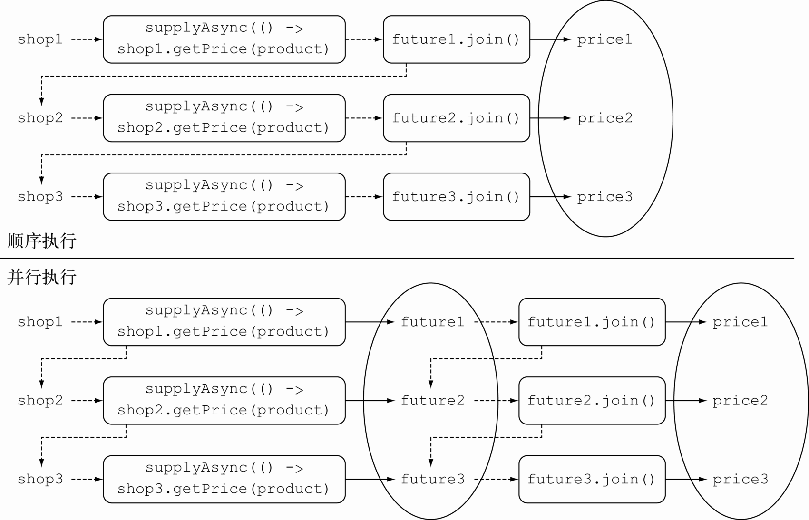

因为流的顺序执行，大量时间被浪费在了每次的join上面，其实本质上是：让别的线程执行这个计算任务，主线程在这儿等待结果，完全的并行执行，甚至效率可能比第一次还低


解决办法：开启两个流：一个流发布任务，一个流接收任务

因为发布任务就相当于是开启多个任务的异步执行

代码如下：

```java
public static List<String> findPricesOpt3(String product) {
    List<CompletableFuture<String>> list = shops.stream()
        .map(shop -> CompletableFuture.supplyAsync(() ->
                                                   shop.getShopName() + " price is " + String.format("%.2f", shop.getPrice(product))))
        .collect(Collectors.toList());

    return list.stream().map(CompletableFuture::join).collect(Collectors.toList());
}
```


输出结果：

```
Consume Time: 1055
Result: [BestPrice price is 100.00, LetsSaveBig price is 133.69, MyFavoriteShop price is 153.39, BuyItAll price is 97.93]
```

甚至比直接使用ParallelStream运行的还慢一点点


但随着任务数量的增大，CompletableFuture还是没啥优势，那么CompletableFuture的意义在哪儿呢？增加了大量复杂的处理逻辑，提升的效率寥寥无几。

优势在于：定制Executor，不像ParallelStream只能使用固定大小为`Runtime.getRuntime().availableProcessors()`的线程池

> 如何指定线程池的大小呢？
>
> 《Java并发编程实战》中Brain Goetz给出的建议：
>
> N<sub>threads</sub> = N<sub>CPU</sub> * U<sub>CPU</sub> * (1 + W/C)
>
> - N<sub>CPU</sub>：处理器核心数
> - U<sub>CPU</sub>：期望的CPU利用率
> - W/C：等待时间与计算时间之比


N<sub>CPU</sub>为8，U<sub>CPU</sub>我们期待为1，应用99%都在等待商店的响应，预估W/C为99。计算得出N<sub>threads</sub>的最佳值为800


不过远远用不到这么多，可以采取如下逻辑，设定一个阈值，当商店数量在阈值之下时候，让线程数等于商店数目，如果商店数目激增，大于阈值了，就直接采用阈值来创建线程池，我们设置这个阈值为100

代码如下：

创建线程池

```java
public static final Integer THREAD_MAX = 100;

//创建一个指定大小的Executor，跟随阈值来
public static Executor getExecutor(Integer number) {
    return Executors.newFixedThreadPool(Math.min(number, THREAD_MAX), r -> {
        Thread thread = new Thread(r);
        //设置守护线程，防止线程池阻止主线程关闭
        thread.setDaemon(true);
        return thread;
    }
                                       );
}
```

测试类：

```java
public static List<String> findPricesOpt4(String product) {
    List<CompletableFuture<String>> list = shops.stream()
        .map(shop -> CompletableFuture.supplyAsync(() ->
                                                   shop.getShopName() + " price is " + String.format("%.2f", shop.getPrice(product)),
                                                   Utils.getExecutor(shops.size())))
        .collect(Collectors.toList());

    return list.stream().map(CompletableFuture::join).collect(Collectors.toList());
}
```

测试数据改成了69个，测试结果如下：

```
Consume Time: 1083
普通CompletableFuture测试：
Consume Time: 10062
ParallelStream测试：
Consume Time: 10034
```

并行流的资源利用率：

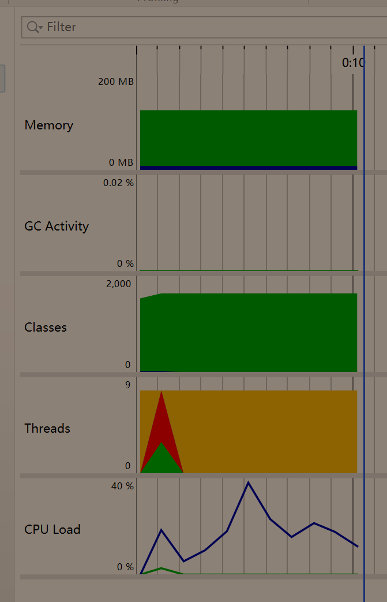

CPU下面那一条线是利用率


自定义线程池的资源利用率：

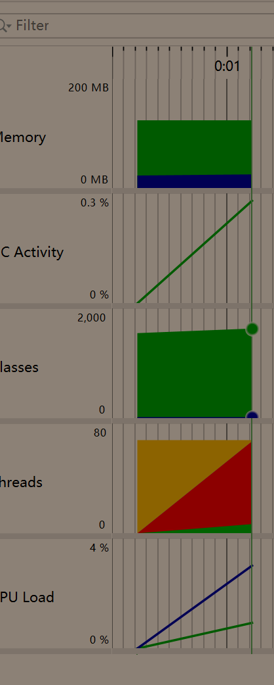

自定义线程池优势还是很多的，特别是在CPU资源利用率较低的情况下


> 并行——使用流还是CompletableFuture？
>
> - 如果你进行的是计算密集型的操作，并且没有IO，推荐使用Stream接口，实现简单，利用率也是最高的
> - 如果并行的工作单元涉及等待IO的操作，使用前面的Brain Goetz推荐的来确定线程池的大小。另外这里不推荐使用并行流的另一个原因：流如果发生了IO等待，流的延迟特性很难让我们判断到底什么时候触发了等待


对多个异步操作执行流水线操作

运行逻辑：

```java
public String getPrice(String product) {
    Utils.delay(1);
    Double price = calculatePrice(product);
    Random random = new Random();
    //values取出所有可能的值,随机抽取一个
    Code code = Code.values()[
        random.nextInt(Code.values().length)];
    return String.format("%s : %.2f : %s", name, price, code);
}
```

会获取一个带有打折力度，打折金额等信息的String

```java
public static PriceParse parse(String s) {
    String[] split = s.split(" : ");
    String shopName = split[0];
    Double price = Double.valueOf(split[1]);
    DiscountShop.Code code = DiscountShop.Code.valueOf(split[2]);
    return new PriceParse(shopName, price, code);
}
```

使用parse方法来解析产生的打折力度的字符串，返回一个含有商店名字，产品价值，打折力度的对象

```java
public static String applyDiscount(PriceParse parse) {
    //商店这边的业务，假设远程有一秒的网络等其他的阻塞
    Utils.delay(1);
    return String.format("%s price is %.2f", parse.getShopName(),
                         parse.getPrice() * (100 - parse.getCode().percentage) / 100.0);
}
```

商店收到打折信息后对商品进行打折并且输出最终的价格


测试：

Java8语法的串行执行：

减少了数据规模，只有4个商店

```java
public static List<String> findPrice(String product) {
    return shopList.stream()
            .map(discountShop -> discountShop.getPrice(product))
            .map(PriceParse::parse)
            .map(DiscountShop::applyDiscount)
            .collect(Collectors.toList());
}
```

输出结果：

```java
Consume Time: 8018
Result: [hello world0 price is 48.34, hello world1 price is 97.33, hello world2 price is 128.51, hello world3 price is 91.18]
```

当然可以通过改成并行流的方式来提高性能，但当商店数量增多时候效果并不好，使用CompletableFuture来更充分的利用CPU资源。


代码如下，好复杂，写的头晕

```java
//解决方案。异步实现
public static List<String> findPriceAsync(String product) {

    Executor executor = Utils.getExecutor(shopList.size());
    //计算的异步任务
    List<CompletableFuture<String>> list = shopList.stream()
        .map(i -> CompletableFuture.supplyAsync(() -> i.getPrice(PRODUCT), executor))
        //异步任务的连接
        .map(future -> future.thenApply(PriceParse::parse))
        //再开启一个异步任务
        .map(future -> future.thenCompose(i ->
                                          CompletableFuture.supplyAsync(() ->
                                                                        DiscountShop.applyDiscount(i), executor
                                                                       )))
        .collect(Collectors.toList());

    //合并
    return list.stream().map(CompletableFuture::join)
        .collect(Collectors.toList());
}
```

主要的两个方法：

- Future的thenApply方法，可以让Future中任务完成后继续执行新添加的任务
- Future的thenCompose方法，在建立一个CompletableFuture来进行异步调用，本质上是对两步异步操作的流水数据拼接

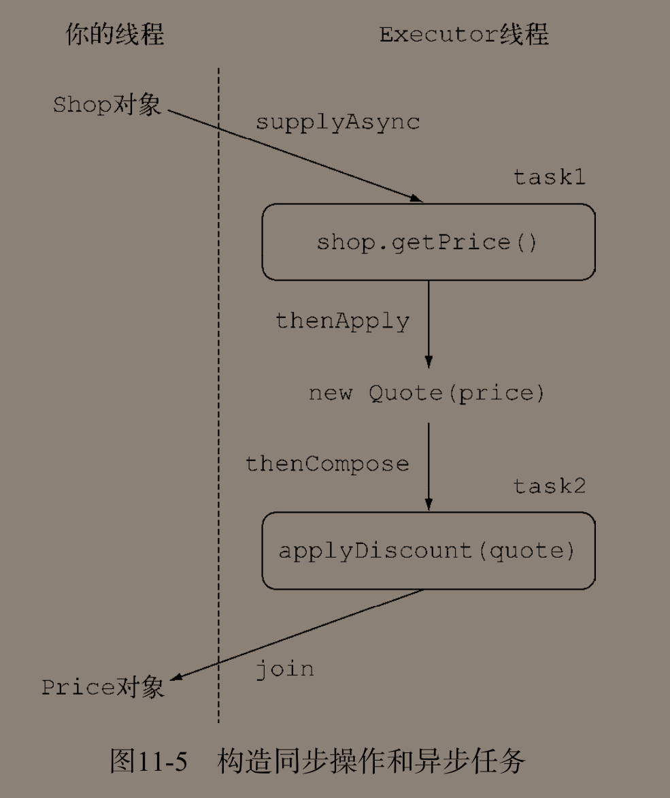

即主线程只负责**一次性交付全部**任务和等着接收全部任务

以上的thenCompose是将两个CompletableFuture拼接起来，两个Future之间有依赖关系。


而有些情况下两个CompletableFuture之间没有依赖关系，不像上面那样第二个依赖于第一个的结果，完全不用等到第一个结束，就是简单的将两个进行数据拼接


简单的例子：一家商店的价格是以欧元计算的，但是你希望使用美元呈现该商店的价格，于是你便有了以下应用：采用异步的方式同时从商店查询欧元价格和从汇率服务中查询汇率，然后再由一个CompletableFuture计算出美元结果

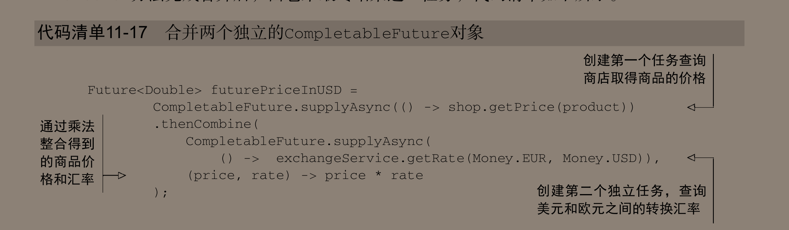

这里使用了thenCombine函数将两个CompletableFuture连接起来，连接方式为相乘

这里的运行逻辑为：

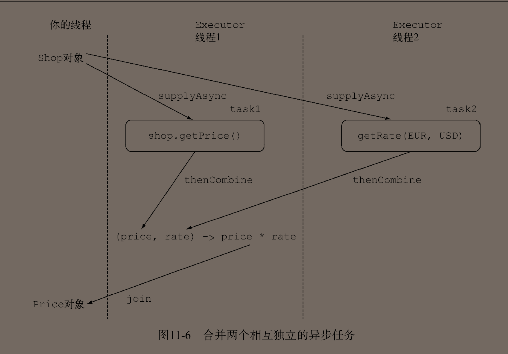

没有显式地指定为同一个线程池，所以会为每一个CompletableFuture创建一个Pool


使用CompletableFuture，利用了Lambda表达式对Future有巨大的提升。提别是其中的工厂方法


最后的一个需求：

你希望尽快的将不同商店中已经查询到的商品价格呈现给你的用户，而不是等到所有数据都加载完再进行呈现

使用的是CompletableFuture的completion方法，与之相反的，调用get或者join方法只会造成阻塞，直到当前任务完成才能去执行下一个任务


实现这个需求完全有必要，因为这里每个商店都只是延迟了1s，要是现实生活中有些商店直接不响应了，那整个程序都会直接阻塞在对该商店的API调用中

核心逻辑：将原本的整合步骤移除，直接返回一个CompletableFuture的Stream

```java
public static Stream<CompletableFuture<String>> findPriceAsyncReCon(String product) {

    Executor executor = Utils.getExecutor(shopList.size());
    //计算的异步任务
    return shopList.stream()
        .map(i -> CompletableFuture.supplyAsync(() -> i.getPrice(PRODUCT), executor))
        //异步任务的连接
        .map(future -> future.thenApply(PriceParse::parse))
        //再开启一个异步任务
        .map(future -> future.thenCompose(i ->
                                          CompletableFuture.supplyAsync(() ->
                                                                        DiscountShop.applyDiscount(i), executor
                                                                       )));
}
```

调用方：

```java
CompletableFuture[] futures = findPricesStream("myPhone")
    .map(f -> f.thenAccept(System.out::println))
    .toArray(size -> new CompletableFuture[size]);
//给机会后续依次输出
CompletableFuture.allOf(futures).join();
```

感觉有点理解不过来，但是这个需求确实存在还蛮重要，看下别的框架有没有支持的把

如果只需要其中一个满足希求，就可将allof改成anyof，于是便只会返回第一个

可以做到依次输出


小结：

- 执行耗时操作，记得使用异步，加快程序的响应速度
- 尽可能为客户端提供异步API
- CompletableFuture提供了异常管理的机制，使用其中的工厂方法更是自动帮你将异常抛出到主线程当中去
- 将同步API封装到CompletableFuture中，用异步的方式使用其结果
- 可以尽可能的将结果的处理交给主线程，即不要在自己的逻辑里直接全部要任务执行完成才返回，说不定只想要的是最快执行的那一个呢，即直接返回`Stream<CompletableFuture<?>>`而不是在方法里面就用map拆箱CompletableFuture对象


## 第十二章、新的日期和时间API


Java虽然提供了很多非常好的组件，但其中的一些组件难免会不完善，例如Java8之前的库对时间和日期的支持就非常不理想

且DataFormat方法不是线程安全的，可能出现多个线程调用此方法出现不同的结果


这些缺陷导致开发人员转头第三方库，如Joda-Time

Oracle于是在java8中整合了Joda-Time的特性


创建简单的日期和时间间隔入手，主要操作的类为：

LocalDate，LocalTime，Instant，Duration和Period


- LocalDate：

只提供简单的日期，并不包含当天的时间信息，不附带任何与时区有关的信息

主要使用工厂方法来创建，而不是通过构造器方法来创建，具体Demo：

```java
public static void main(String[] args) {
    LocalDate date = LocalDate.of(2020, 7, 11);
    //获取年份，输出为2020
    int year = date.getYear();
    System.out.println("year: " + year);

    //获取月份信息，输出为JULY
    Month month = date.getMonth();
    System.out.println("month: " + month);

    //获取天数信息，输出为11
    int day = date.getDayOfMonth();
    System.out.println("day: " + day);

    //获取星期几，输出为SATURDAY
    DayOfWeek week = date.getDayOfWeek();
    System.out.println("week: " + week);

    //当前月份天数，输出31
    int len = date.lengthOfMonth();
    System.out.println("Mouth Len: " + len);

    //是否是闰年，输出true
    boolean leapYear = date.isLeapYear();
    System.out.println("isLeapYear: " + leapYear);

    //现在时间，输出2020-07-11
    System.out.println("now: " + LocalDate.now());
}
```


LocalTime也提供类似的工厂方法，参数分别为：时分秒。事例代码：

```java
public static void main(String[] args) {
    LocalTime time = LocalTime.of(13, 20, 20);

    //获取小时信息，输出为13
    int hour = time.getHour();
    System.out.println("hour: "+hour);

    //获取分钟信息，输出为20
    int minute = time.getMinute();
    System.out.println("minute: "+minute);

    //获取分钟信息，输出为20
    int second = time.getSecond();
    System.out.println("second: "+second);
}
```


试下LocalDate和LocalTime的解析操作：

```java
public static void main(String[] args) {
    //测试LocalData和LocalTime的解析字符串操作，标准格式
    LocalDate date = LocalDate.parse("2020-07-11");
    LocalTime time = LocalTime.parse("13:20:20");

    System.out.println(date + " : " + time);
}
```

以上是标准格式，在后面会了解public static LocalTime parse(CharSequence text, DateTimeFormatter formatter)。带DateTimeFormatter的parse版本，取代了老板的DateFormat

解析不成功抛出DateTimeParseException异常


LocalDateTime合并日期和时间，不带有时区信息，具体创建方法如下：

```java
LocalDateTime dt1 = LocalDateTime.of(2020, 7, 12, 13, 20, 20);

LocalDate date = LocalDate.of(2020, 7, 12);
LocalTime time = LocalTime.of(13, 20, 20);
LocalDateTime dt2 = LocalDateTime.of(date,time);

LocalDateTime dt3 = date.atTime(13, 20, 20);

LocalDateTime dt4 = date.atTime(time);

LocalDateTime dt5 = time.atDate(date);
```

相当于LocalDateTime = LocalDate+LocalTime

可以相互转换，可以使用toLocalDate或者toLocalTime完成转换


机器通常不会像人一样计算时间，时间建模在机器内部是以Instant类的方式来完成的，基本上都是以Unix元年（UTC时区的1970-1-1午夜时分）开始所经历的秒数进行计算

可以使用Instant的工厂方法来完成：

```java
public static Instant ofEpochSecond(long epochSecond);
public static Instant ofEpochSecond(long epochSecond, long nanoAdjustment);
```

也为了便于使用提供了now方法返回当前的时间戳

Instant的设计初衷就是为机器准备的，没有必要的情况建议不要使用

但是可以通过Duration和Period来使用Instant


Duration可以进行以秒和纳秒为衡量单位的时间的长短，使用如下的静态方法：

```java
Duration d1 = Duration.between(time1, time2);
Duration d1 = Duration.between(dateTime1, dateTime2);
Duration d2 = Duration.between(instant1, instant2);
```

不能将以上三者混用，因为是以s为计量单位，无法接受参数LocalDate


如果需要以年，月，日的方式建模，可以使用Period类：

```java
public static Period between(LocalDate startDateInclusive, LocalDate endDateExclusive)
```

使用Period的get方法来获取信息


也可以使用of工厂方法来直接创建Period和Duration


上面创建的与时间有关的对象，是不可修改的，但也提供了一个简单的创建对象副本并按照需要修改它的属性，如`WithXXX（）;`方法。

可以理解为get和with方法是对Temporal对象的读写操作

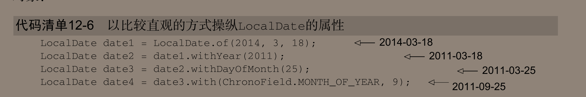


也可以以相对方式修改LocalDate对象

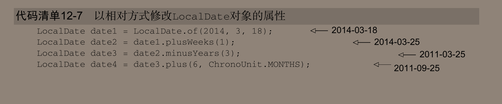

特别是最后的plus方法配上ChronoUnit工具类可以轻易地实现对时间的相对方式操作


通用方法：

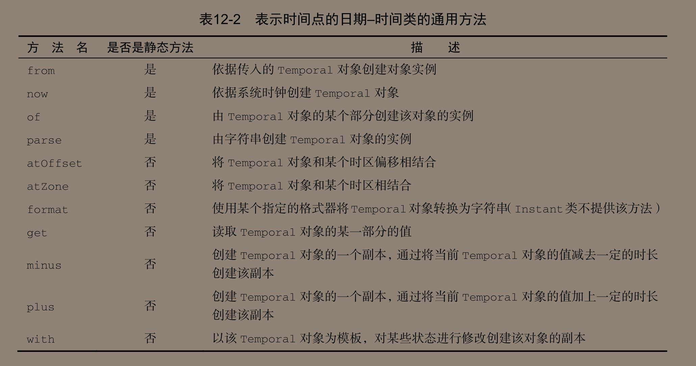

> 只要记住with是创建一个副本对象就好了，原来的对象是无法修改的


如果需要对Temporal进行更复杂的操作，就需要使用入参为TemporalAdjuster对象的with方法。

例如：需要将日期调整到下个周日，下个工作日，或者是本月的最后一天

当然，提供的大量预定的TemporalAdjuster，可以使用TemporalAdjusters类来访问到

```java
import static java.time.temporal.TemporalAdjusters.nextOrSame;

public static void main(String[] args) {
    LocalDate date = LocalDate.now();
    //输出下一个星期一的日期
    LocalDate time = date.with(nextOrSame(DayOfWeek.MONDAY));
    System.out.println(time);
}
```

具体的TemporalAdjusters工厂方法：

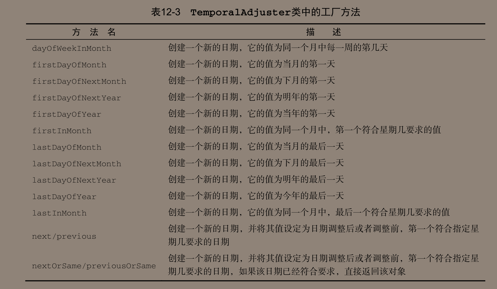

非常有用


如果预设的这些还是无法满足你的需求，去自定义自己的TemporalAdjuster，是一个函数式接口，可以用Lambda表达式轻松实现（如果逻辑简单且只有这一处用到的话）

接口摘要如下：

```java
@FunctionalInterface
public interface TemporalAdjuster {
    Temporal adjustInto(Temporal temporal);
}
```

只需要学会将一个Temporal转换成为另外一个Temporal即可


例如实现自己的TemporalAdjuster去计算下个工作日，将其封装到工具类里面去了，说不定以后可以直接拿出来用

```java
/**
 * @author LuckyCurve
 * @date 2020/7/12 11:28
 * 自己的工具类，没有必要使用单例模式
 */
public class DateUtils {

    public static TemporalAdjuster getNextWorkDay() {
        //直接使用Lambda表达式了，反正都封装成了工具类了
        return temporal -> {
            DayOfWeek day = DayOfWeek.of(temporal.get(ChronoField.DAY_OF_WEEK));
            int add = 1;
            if (day == DayOfWeek.FRIDAY) {
                add = 3;
            } else if (day == DayOfWeek.SATURDAY) {
                add = 2;
            }
            //返回后几天
            return temporal.plus(add, ChronoUnit.DAYS);
        };
    }
}
```

如果使用Lambda表达式，当然更建议使用TemporalAdjusters的`public static TemporalAdjuster ofDateAdjuster(UnaryOperator<LocalDate> dateBasedAdjuster)`方法

修改代码如下

```java
return TemporalAdjusters.ofDateAdjuster(temporal -> {
    DayOfWeek day = DayOfWeek.of(temporal.get(ChronoField.DAY_OF_WEEK));
    int add = 1;
    if (day == DayOfWeek.FRIDAY) {
        add = 3;
    } else if (day == DayOfWeek.SATURDAY) {
        add = 2;
    }
    //返回后几天
    return temporal.plus(add, ChronoUnit.DAYS);
});
```

基本逻辑没变，只是使用了工具类进行了包装


日期时间对象与String之间的转换关系

主要依赖于java.time.format包下的DateTimeFormatter的静态工厂方法以及一些预定义好的常亮来进行打印输出和解析

```java
LocalDate date = LocalDate.now();
System.out.println("Default Style: "+date);
//Default Style: 2020-07-12
System.out.println("Style1: "+date.format(DateTimeFormatter.BASIC_ISO_DATE));
//Style1: 20200712
System.out.println("Style2: "+date.format(DateTimeFormatter.ISO_LOCAL_DATE));
//Style2: 2020-07-12
```

与之对应的：

```java
String style1 = "20200712";
String style2 = "2020-07-12";
//也就是默认的
LocalDate date1 = LocalDate.parse(style1 ,DateTimeFormatter.BASIC_ISO_DATE);
LocalDate date2 = LocalDate.parse(style2, DateTimeFormatter.ISO_LOCAL_DATE);
```


还支持自定义解析格式的静态工厂方法

```java
//演示静态工厂自定义Formatter方法
DateTimeFormatter formatter = DateTimeFormatter.ofPattern("dd/MM/yyyy");
String style3 = date.format(formatter);
System.out.println("My Style: "+style3);
//My Style: 12/07/2020
//尝试解析
LocalDate.parse(style3,formatter);
```

还可以选择带Locale参数的ofPattern方法


如果想要更加细粒度的操作，可以使用DateTimeFormatterBuilder来去构建DateTimeFormatter。


接下来是一个复杂的问题：处理不同的时区和立法

Java8的API都对这类问题有很好的支持，新的ZoneId是老版的TimeZone的替代品


可以直接通过ZoneId的getAvailableZoneIds方法获取所有时区信息，格式为：

{区域}/{城市}，例如：Asia/Shanghai

使用ZoneId的of方法生成一个ZoneId对象。

一旦有了Zone对象，就可以与LocalDate，LocalDateTime整合起来，转换成ZoneDateTime

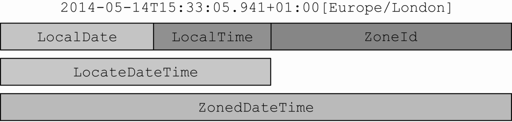


另一种是类Zoneoffset，是ZoneId的一个子类，表示的是当前时间与UTC/格林尼治的固定偏差，在大多数情况下不推荐使用，由于是ZoneId的一个子类，使用情况差不多


提供了ISO和其他四种公历日期建模，并且可以轻易的相互转换


# 第四部分、超越Java8


简单介绍Java的函数式编程并对Java8和Scale中相关的特性进行比较


## 第十三章、函数式的思考


如果存在一个大型的遗留系统需要进行升级，稍有理智的程序员只会依赖于如下言不由衷的格言来做决定：”搜索一下代码中有没有使用过Synchronized关键字，如果有就直接拒绝，否则进一步看看系统的复杂程度“。由此可以了解到修复并发问题是多么的复杂

如果是无状态的行为（处理Stream流水线中的函数不会由于需要等待从另一个方法中读取变量，或者由于需要写入的变量同时有另一个方法正在写而发生中断），Java8中的Stream提供了强大的技术支撑


命令式编程与函数式编程

命令式编程的特点是他的指令与计算机底层的词汇非常相近。

函数式编程重要的思想是内部迭代，将如何实现的细节交给函数库，于是你的代码更像是陈述问题，而不是如何解决问题，理解起来也比较容易（真的吗，一旦复杂起来就直接看的一脸蒙蔽，还不好调试，开发一时爽，维护火葬场）

> 不过IDEA好像开发了一款插件
>
> 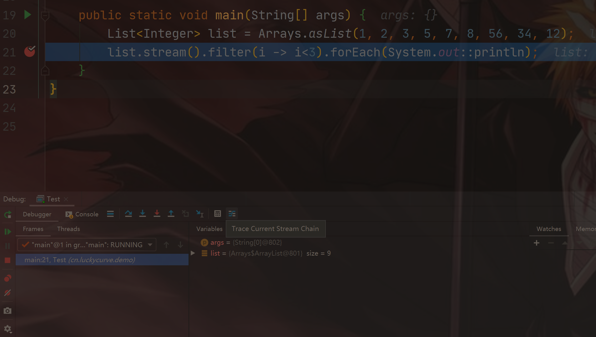
>
> 这个体验还是蛮不错的
>
> 或者使用peek打印每一次的结果


函数式程序还有一个附加条件往往被人们所忽略：函数或者方法不应该抛出任何异常。因为一旦抛出异常，就意味着结果被终止了

但往往代码里面难免会抛出异常，例如算术运算的除法运算和开方运算

这里就容易引起争论了，有人认为抛出代表严重错误的异常是可以接受的，有人认为这违反了我们的黑盒模型中对函数的定义：“传递参数，返回结果”的规则，引出了代表异常的第三个箭头

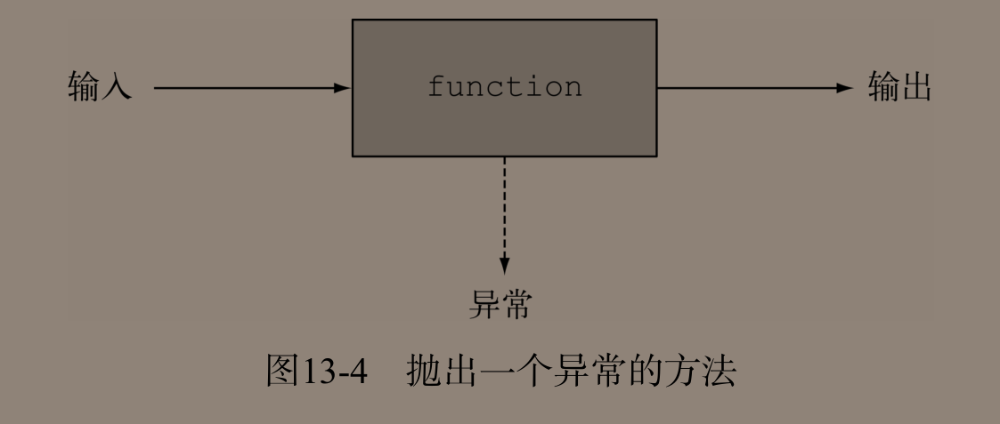


Java的递归调用通常都是尾递归，即在函数的尾部在调用自身，这样可以充分利用JVM，尽可能的回收当前栈帧的无用局部变量（因为都到了最后一行了，无需保护现场）。


使用Java8进行编程时，应该尽量使用Stream取代迭代操作。


## 第十四章、函数式编程的技巧


本章介绍更高级的函数式编程技巧，可以将本章看做实战


Java8对函数进行了升级，可以想变量赋值一样来操作函数，这样使用的函数被称为一等函数