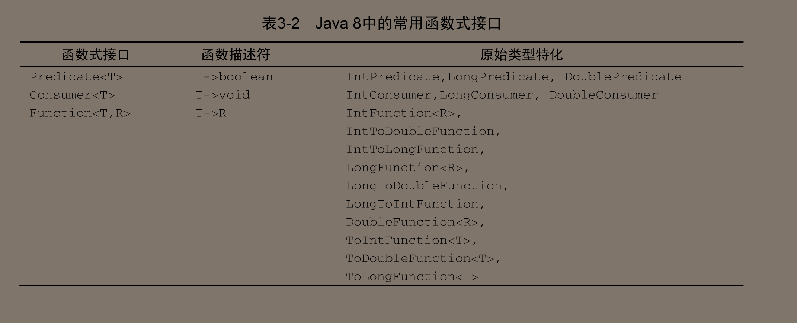

# 第一部分、基础知识


## 第一章、为什么要关心Java8


2014年3月发布的Java8带来了众多改变：Lambda表达式、流、默认方法


Java8对硬件也有影响：绝大多数的Java程序只能使用其中一个内核，其余的几个都闲着

在Java8之前，专家可能会告诉你必须利用线程才能使用多个内核，但用起来很麻烦，很容易出错。Java一直致力于让并行变得更简单：Java1.0有线程和锁，还有一个专门的内存模型，但是在当时不具备专业知识的项目团队很难可靠的使用这些框架。Java5加入了工业级的构建模块：线程池和并发集合（不是同步容器），Java7添加了fork/join框架，但仍然很困难。Java8提供了一些新思路

提供了Stream API，支持数据的并行操作，核心思想：用更高级的方式来表达想要的东西，而由“实现”（这里是Stream库）来选择最佳低级执行机制。这样就可以避免使用Synchronized写代码，不仅能够避免错误，还能降低执行成本。


编程概念：

- 流处理

流：是一系列数据项，一次只能生成一项，程序可以从输入流中一个一个读取数据项，然后以同样的方式将数据项写入输出流。一个程序的输出流很可能是另一个程序的输入流

这种情况在Linux和Unix里面很常见，例如：对文件的处理：

```
cat file1 file2 | tr "[a-z]" "{A-Z}" | sort | tail -3
```

这里就是通过标准输入流读入file1和file2，Unix的cat命令会将两个文件连接起来并创建一个流，tr命令转换流中的字符，sort对流中的行进行排序，tail -3给出流的最后三行。（类似于Spring WebFlux的思想）


基于这一思想，Java给出了Stream<T>，在java.util.stream包下。Stream的很多方法可以形成复杂的流水线（也就是WebFlux里面提供的数据管道的概念）。思路其实就是NetFlix提供的反应式编程代替了命令式编程（2013年年底提出的，有理由相信Java8借鉴了）。更关键的是：从一个流转换到另一个流的编程思路使得Java8可以透明的把输入的不相关的部分拿到几个CPU上去执行，几乎算是免费的并行了。


- 用行为参数化把代码传递给方法

Java8新增：通过API来传递代码的能力

就例如开头排序的代码，使用sort排序，如果需要指定排序方式，就需要传入一个Comparator实现类，但这使得代码变啰嗦了

Java 8增加了把方法（你的代码）作为参数传递给另一个方法的能力


- 并行与共享的可变数据

上面提到Stream可以帮我们**几乎**完成并行了，当然有代价，共享数据的线程不安全问题仍然需要我们自己解决，当然不是使用Synchronized关键字，这就与反应式编程有点相悖了（这里好像把反应式编程叫做函数式编程，但命令式编程的叫法没有改变）


Java8的新概念：

函数——值的一种新形式

值的可能形式：

- 原始值，即基本数据类型，如int，double等等
- 对象，如String，Integer，int[]（数组也是对象）

上述的都是传统编程语言的基石，这些值可以被称为一等公民，而目前对于Java而言方法和类是二等公民，Java8将方法从二等公民拉近了一等公民。（至于类，很多语言如JavaScript都探索过这条道路）


其实将方法和类从二等公民拉到一等公民不是Java首创，而是由运行在Java虚拟机上的Scale和Groovy早已实现了，Java只是借鉴了而已。

用方法传值也构成了其他Java8功能（如Stream）的基础


方法引用语法：`::`，即`类::方法`


感觉还是因为FileFilter支持函数式编程导致的，先继续往后看。


Lambda——匿名函数

除了允许函数作为一等值之外，还允许Lambda（匿名函数）的形式

可以当你在没有方便的方法和类可用的时候，使用lambda来创建一个匿名方法会更加的简洁


一个Demo：

```java
public class FilteringApples {

    private static List<Apple> apples = new ArrayList<>();

    static {
        for (int i = 0; i < 10; i++) {
            Apple apple2 = new Apple(i, "green");
            Apple apple1 = new Apple(i, "red");
            apples.add(apple1);
            apples.add(apple2);
        }
    }

    /**
     * @return 通用的筛选函数
     */
    public static List<Apple> filterApples(Predicate<Apple> predicate) {
        ArrayList<Apple> filter = new ArrayList<>();
        for (Apple apple : apples) {
            if (predicate.test(apple)) {
                filter.add(apple);
            }
        }
        return filter;
    }

    /**
     * @return 筛选出color为green的苹果
     */
    public static boolean isGreenApple(Apple apple) {
        return Objects.equals("green", apple.getColor());
    }

    /**
     * @return 筛选出weight大于4的apple
     */
    public static boolean isHeavyApple(Apple apple) {
        return apple.getWeight() > 4;
    }


    public static void main(String[] args) {
        //调用测试
        System.out.println(filterApples(FilteringApples::isGreenApple));
        System.out.println(filterApples(FilteringApples::isHeavyApple));
    }
}
```

好像仅支持静态方法，如果方法是非静态的就会报错了

如果要引入非静态方法，得使用`对象名::方法名`的形式将方法注入进来

在Java8中可以传递方法了！

> 上面代码里的Predicate<T>是一个谓词，谓词是一个类似于函数的东西，接收一个参数值，返回True或者False（可以理解为函数的一个子集），当然Java8也允许你以函数的方式——Function<T,Boolean>的形式，建议使用Predicate<T>，返回类型都不用装箱成Boolean的形式了。


传入到谓词Predicate<T>的方法必须满足：方法的返回结果是boolean，入参类型是T


使用Lambda（匿名函数的形式）

使用Lambda进行筛选：

```java
public class FilteringApples {

    private static List<Apple> apples = new ArrayList<>();

    static {
        for (int i = 0; i < 10; i++) {
            Apple apple2 = new Apple(i, "green");
            Apple apple1 = new Apple(i, "red");
            apples.add(apple1);
            apples.add(apple2);
        }
    }

    /**
     * @return 通用的筛选函数
     */
    public static List<Apple> filterApples(Predicate<Apple> predicate) {
        ArrayList<Apple> filter = new ArrayList<>();
        for (Apple apple : apples) {
            if (predicate.test(apple)) {
                filter.add(apple);
            }
        }
        return filter;
    }

    public static void main(String[] args) {
        //使用lambda表达式的形式
        System.out.println(filterApples((Apple apple) -> Objects.equals("green", apple.getColor())));
        System.out.println(filterApples((Apple apple) -> apple.getWeight()>4));
    }
}
```

不需要只为一次的方法写定义，代码更简洁

但如果你的lambda表达式多于几行，则应该使用一个方法引用指向一个有描述性名称的方法，而不是匿名方法


本来Java8的新特性到此为止就可以打住了，要是没有多核CPU。

完全可以仅仅只是在集合工具类上加上以下静态方法供我们直接调用：

```java
static <T> Collection<T> filter(Collection<T> c, Predicate<T> p);
```

==但是Java没有这样做==，Java 8提出了一套新的类集合API——Stream，它有一套函数式程序员熟悉的、类似于filter的操作。


流——相当于是为了制造和处理集合补充的，因为有时候使用集合不是很方便，需要大量的嵌套和模板代码，代码在后面章节会有详细讲述，这里只要有个整体概念就行了。

如果使用集合的话，需要自己去forEach循环，然后再处理元素，这叫外部迭代

而如果使用了Stream，完全不用管循环的事情了，数据处理完全是在库内部进行的，我们把这种思想叫做内部迭代

使用集合还有一个问题：如果一个集合相当大，在遍历过程中使用单核CPU的利用率就非常的低下了，但如果使用Stream，会默认使用多核（例如是八核），那么处理速度理论上就提高了八倍

但仍然会造成线程安全问题，Java8基于Stream的并行并提倡少使用Synchronized的函数式编程风格，它关注的是数据块而不是协同访问（如果是命令式编程还是提倡使用Synchronized的，能使用上封装好了的类更好）

Stream解决的问题（集合遍历方面）：

- 避免了常规的forEach套路
- 很容易给各个CPU分配任务，完全可以将集合的每一份数据交给每一个CPU去处理，最后再执行结果合并操作

观点：Collection是为了存储数据，而Stream主要是用于描述对数据的处理过程，最终还是要转换成Collection保存结果的。


筛选一个重苹果并输出（顺序处理）：

```java
    System.out.println(apples.stream().filter((a) -> a.getWeight() > 4).collect(Collectors.toList()));
```

> 始终是主线程在处理，使用JProfile去监视了，没有创建线程去并行执行

使用并行处理：

```java
    System.out.println(apples.parallelStream().filter((a) -> a.getWeight() > 4).collect(Collectors.toList()));
```

并行处理的执行过程：


佐证（如果没有使用并行的流就只有main了）：


但是随后在Java更新的过程中，发现了一个实际的问题：现有的接口也在改进，最明显的——sort函数，本来就该隶属于List接口的，硬是放到了Collections工具类中去了。如果现在再要更新的话，会需要所有List的实现类去重写sort方法，简直是逻辑灾难，还好有默认方法：

摘自JDK11的List.sort(Comparator c)，使用default关键字修饰

```java
default void sort(Comparator<? super E> c) {
    Object[] a = this.toArray();
    Arrays.sort(a, (Comparator) c);
    ListIterator<E> i = this.listIterator();
    for (Object e : a) {
        i.next();
        i.set((E) e);
    }
}
```


默认方法：

主要是为了支持库设计师，让他们能够写出更容易改进的接口

主要是为了解决：改变已发布的接口而不破坏已有的实现。使得后期的接口扩充更容易实现

但是如果多个接口都声明了同一个默认的方法，那么不就造成问题了吗，在第九章会讲到，Java8用一些限制来避免出现类似于C++的菱形继承问题。


Java从函数式编程中引入的两个重要思想：

- 将方法和Lambda作为一等值
- 在没有共享变量时，函数或者方法可以有效，安全地并行执行

Stream API就用到了这两个思想


Java中的switch仅仅局限于原始数据类型和String类型。而函数式语言更加倾向允许switch允许更多的数据类型，即访客模式——最常见的是用来遍历一组类，如汽车的各个部件，然后对各个组件分别进行操作，这种模式容易在编译期发现问题，很容易告诉你某个组件没有显式的处理，你需要声明处理方法


小结：

- 语言会面临“要么改变，要么淘汰”的压力。最明显的例子：COBOL语言
- 函数是一等值，可以传递
- Lambda（匿名函数）是如何写的
- 接口的默认方法


## 第二章、通过行为参数化传递代码


软件工程中时常出现的问题——用户的需求在不断的改变。

行为参数化就可以帮你解决频繁更变需求的一种软件开发模式

将可能需要变更的地方封装成一个代码块传入方法中，当需求改变的时候，直接修改封装好的代码块就可以了，而不用再去重写整个方法调用。

如果不使用Lambda表达式，代码可能变得十分啰嗦（当然是在操作简单的情况下，如果操作变难了，就需要显式的声明方法并给上Javadoc标注）


Demo：

刚开始只要筛选绿苹果：

```java
/**
     * 刚开始可能只是需要筛选绿色的苹果
     */
public static List<Apple> filterGreenApples(List<Apple> apples) {
    ArrayList<Apple> filter = new ArrayList<>();
    for (Apple apple : apples) {
        if (Objects.equals("green", apple.getColor())) {
            filter.add(apple);
        }
    }
    return filter;
}
```

后来可能需要筛选各种颜色的苹果，你就可能会尝试抽象代码了：

```java
/**
     * 一旦需要筛选的颜色多了起来，你就会尝试的去抽象代码，避免类似代码重复发生
     * 此时抽象出：根据颜色筛选出苹果
     */
public static List<Apple> filterApplesByColor(List<Apple> apples, String color) {
    ArrayList<Apple> filter = new ArrayList<>();
    for (Apple apple : apples) {
        if (Objects.equals(color, apple.getColor())) {
            filter.add(apple);
        }
    }
    return filter;
}
```

一个良好的原则是在编写类似的代码时候，尝试将其抽象化

此时又需要增加筛选体重大于150的苹果，你可能学聪明了，不把150写死，说不定能重用

```java
/**
     * 这时候需求又改了，改成需要筛选出较重的苹果（指150以上）
     * 你可能学聪明了，要是150也改了咋办，先抽象下
     */
public static List<Apple> filterHeavyApple(List<Apple> apples, Integer weight) {
    ArrayList<Apple> filter = new ArrayList<>();
    for (Apple apple : apples) {
        if (apple.getWeight() > weight) {
            filter.add(apple);
        }
    }
    return filter;
}
```


其实这三个方法有大量的重复代码，打破了DRY原则（Don’t Repeat Yourself）

如果是以前你可能会有这样的尝试：

```java
public static List<Apple> filter(List<Apple> apples,String color,Integer weight,Integer flag);
```

通过flag来指定哪些条件时需要的，哪些条件是不需要的，然后根据需要的条件去进行过滤（但这样做，写代码实现的感觉很糟糕，很有可能简单的筛选就写成了一大片的if-else调用，一旦属性多了体验会更糟糕）


使用更高级的抽象：根据选择标准建模。

在这里我们根据Apple的某些属性来返回一个boolean值。我们把这一动作称作谓词（即返回一个boolean类型的函数）

于是我们可以定义一个选择建模标准：

```java
public interface ApplePredicate{
    boolean test(Apple apple);
}
```

然后就可以用这个接口的实现来表示不同的选择标准


刚才做的与策略设计模式有关——它让你定义一族算法，将他们封装起来，称为策略。然后在运行时候选择一个算法


继续更高程度的封装：


所有的条件筛选都可以自定义，只要将算法的实现传入到ApplePredicate中即可


但现在仍然有点遗憾，你需要将代码封装到ApplePredicate的test的方法中，然后返回ApplePredicate对象，而不是直接传递方法

非常具体的体现：


虽然上述思想很优秀，但是会非常啰嗦，需要声明很多只要实例化一次了的类。接下来是如何改进


上述传递方法是通过实例化一个类的方式来实现的，然而在Java8中方法是可以被作为参数来进行传递的。

改进1：使用匿名类来改进，本质上仍然是传递的对象，但是可以少显式的声明一个类，还是比较舒服的。

缺点：

- 很笨拙，占用大量代码空间
- 用起来比较费解，如下一个经典的Java谜题


答案是5，this指的是Runnable对象

尽管匿名类已经在一定程度上解决了创建多个接口实现的问题，但仍然有大量的重复代码。有优化的空间


使用Lambda表达式

感觉Java就是帮我们把传入的方法封装成一个匿名类的对象，然后再传给方法的


更高的抽象——将List类型抽象化，而不是仅仅局限于Apple，于是可以的带下述代码：


手敲了一遍：

```java
/**
     * 直接来最高程度的抽象了
     */
public static <T> List<T> filter(List<T> list, Predicate<T> p) {
    LinkedList<T> list1 = new LinkedList<>();
    for (T t : list) {
        if (p.test(t)) {
            list1.add(t);
        }
    }
    return list1;
}

public static void main(String[] args) {
    List<Integer> list = Arrays.asList(1, 2,50, 3, 5);
    List<Integer> filter = filter(list, a -> a % 2 == 0);
    System.out.println(filter);
}
```

体验还是非常好的。


行为参数化是非常有用的——可以吧一个行为（一段代码）封装起来，并通过传递和使用创建的行为将方法的行为参数化

Java API中其实有很多地方都是用到了行为参数化了，大量的与匿名类一起使用（Java8之前）：

- 用Comparator来排序
- 用Runnable来执行一个代码块


排序：可以使用Java8在List中添加的默认方法sort，也可以使用Collections中的sort方法，但是现在不推荐使用了

Comparator接口概述（去除掉了默认方法）：

```java
@FunctionalInterface
public interface Comparator<T> {
    int compare(T o1, T o2);
}
```

如果需要对Apple进行重量排序：有小到大，可以使用：

```java
ArrayList<Apple> apples = new ArrayList<>();
apples.sort(new Comparator<Apple>() {
    @Override
    public int compare(Apple o1, Apple o2) {
        return o1.getWeight().compareTo(o2.getWeight());
    }
});
```

使用包装类默认的比较函数，产生的结果是由小到大的排序

如果是想让默认排序变成由大到小，可以对`o1.getWeight()`的结果进行取反操作即可


上述可以使用Lambda表达式来取代：

```java
apples.sort((o1, o2) -> o1.getWeight().compareTo(o2.getWeight()));
```

IDEA还推荐简化为：

`apples.sort(Comparator.comparing(Apple::getWeight));`

从大到小：

`apples.sort((o1, o2) -> o1.getWeight().compareTo(o2.getWeight())*-1);`


Runnable执行代码块：

就不过多赘述了，多线程里面使用的非常多，也是我目前使用Lambda表达式使用的最多的地方


小结：

- 行为参数化。就是一个方法接收多个不同的行为作为参数，并在内部使用他们
- 行为参数化可以使得代码更好的适应不断变化的需求
- 传递代码，在Java8之前是依赖于对象的，无论是普通类的对象还是匿名类的对象都一样，在Java8之后可以直接传递方法，无论是通过`::`语法还是Lambda表达式
- Java API就包含了些许将不同行为进行参数化的方法。如排序，启动线程


## 第三章、Lambda表达式


在上一章中你了解到了使用行为参数化来解决不断变化的需求

但是使用匿名类对象来传递行为方法显得过于的繁琐了，Java8为了解决这个问题，提出了Lambda表达式，可以让你很简洁的传递一个行为（仅仅只是通过方法的方式，而不是通过实例化对象的方式来进行传递）

最后还会介绍方法引用——常与Lambda表达式联用的一个有用的新功能


可以把Lambda理解成为一个可传递的匿名函数的一种方式。这个函数没有名称，但有参数列表，返回类型，函数主体，返回类型，还有可能拥有可以跑出的异常列表

> 总感觉Java对方法与函数的定义有点重合了
>
> 百度了一下，主要的两点区别：
>
> 非静态方法可以使用this关键字，一个方法可以处理包含在一个类里面的数据
>
> 相当于对象里面的函数就叫做了方法，或者说：方法就是面向对象版的函数

所以这里将Lambda称为匿名函数而不是匿名方法是很有道理的，因为Lambda不属于任何一个类，这在Java中时不常见的，所以Java领域中几乎使用了方法这个词来取代了函数

可传递的特点：可以作为参数传递给方法或:question:==存储在变量中==（还没见到过，画个重点）


Lambda表达式鼓励我们使用行为参数化的风格


Lambda表达式的三部分：

- 参数列表

用（）包裹起来的部分

- 箭头

将参数列表和主体隔离开来

- Lambda主体


Demo：

```java
//返回一个int，隐含了return语句
(String s) -> s.length()
    
//将Apple类型的参数传入，返回重量是否大于150的boolean值
(Apple a) -> a.getWeight() > 150
    
//接收两个int型数据，无返回值
(int x, int y) -> {
	System.out.println("Result:");
	System.out.println(x+y);
}

() -> 42
    
(Apple a1, Apple a2) -> a1.getWeight().compareTo(a2.getWeight())
```

通用的语法类型为：

```java
(parameters) -> expression
    或者
(parameters) -> {
    statement;
}
```

的语法格式

>  还是建议在参数前面带上参数类型的


那么在哪里可以使用到Lambda表达式呢？上述的接口都是函数式接口

第一个遇到的函数式接口：`Predicate<T>`

```java
@FunctionalInterface
public interface Predicate<T> {
    boolean test(T t);
}
```

依旧是省去了default方法，毕竟default方法与我们也不想干（设计default方法的目的就是为了在接口中屏蔽某些方法，对于实现类来说）


还有：

Comparator和Runnable等等

```java
public interface Comparator<T> {
	int compare(T o1, T o2);
}
public interface Runnable{
	void run();
}
public interface ActionListener extends EventListener{
	void actionPerformed(ActionEvent e);
}
public interface Callable<V>{
	V call();
}
public interface PrivilegedAction<V>{
	V run();
}
```

> 接口可以拥有很多默认方法（在实现类没有对其实现的时候，其主体为方法提供的默认提供实现的方法），**只要接口只定义了一个抽象方法，那么它仍然是一个函数式接口**


函数式接口可以用来做什么呢？回到我们的Lambda表达式中来

Java允许你将整个Lambda表达式作为函数式接口的实例，当然是用匿名类也可以完成同样的事情，但只是显得比较笨拙而已

Demo（就不写能测通的代码了，伪代码）：

```java
//使用Lambda表达式和匿名类，让Runnable输出hello world
Runnable r1 = () -> System.out.println("hello world");

Runnable r2 = new Runnable() {
    @Override
    public void run() {
        System.out.println("hello world");
    }
};
```


抽象描述符：

函数式接口的抽象方法的签名基本上就是Lambda表达式的签名，我们把这种抽象方法叫做函数描述符

现在只需要了解Lambda可以被赋予给一个变量（即函数式接口）或者是传递一个接受函数式接口作为参数的方法就行了，至于编译器是如何对Lambda方法做参数检查的，在以后再讲述，当然Lambda表达式的签名要与函数式接口的抽象方法一样（入参和返回参数类型一致即可，或者可以转换，无论是自动拆箱装箱、向上转型都可以）

> 建议在函数式接口上加上注解`@FunctionalInterface`
>
> 可以做到简单的检查，例如接口中有多个抽象方法就会报错
>
> 不是必须的，但是推荐使用


Demo：处理文件的时候经常需要打开，关闭操作，显得多余，尝试构建模板代码

依旧是硬性要求：尝试读取文件的第一行

```java
private static final String FILEPATH = "E:/info.txt";

	/**
     * //读取资源的一行
     */
public static String processFile() throws IOException {
    //使用了Java7中带资源的try，不需要关闭
    try (BufferedReader br = new BufferedReader(new FileReader(FILEPATH))){
        return br.readLine();
    }
}
```

> 确实，代码中不应该出现硬编码，都应该声明为常量


来开始行为参数化来保证高可用，避免频繁的复用try/catch代码

保证对BufferReader的操作不是死的（Lambda大展身手的时候了）

很显然，这里需要一个`(BufferReader br)->String`的函数式接口，然而官方不一定会总是替我们准备好，我们需要自己声明一个函数式接口，

```java
@FunctionalInterface
public interface BufferedReaderProcessor {
    /**
     * 要做的事情
     * @param br 
     * @return
     * @throws IOException
     */
    String process(BufferedReader br) throws IOException;
}
```

开始重构processFile方法

```java
/**
 * 开始重构
 */
public static String processFile(BufferedReaderProcessor processor) throws IOException {
    try (BufferedReader br = new BufferedReader(new FileReader(FILEPATH))){
        return processor.process(br);
    }
}
```

测试使用：

传递Lambda：`System.out.println(processFile((BufferedReader br) -> br.readLine()));`

可以改进成传递方法：`System.out.println(processFile(BufferedReader::readLine));`

:question:这里感觉蛮疑惑的，讲道理readLine是非静态方法，按道理来说应该是使用`对象名::方法名`来调用，但这里使用类名调用也成功了


查看Java8中提供的几个函数式接口：

具体的可以查看`java.util.function`

提供的还是比较丰富的，基础的数据类型接口基本都有，可以找找

下面是几个比较通用的：

Predicate：

```java
@FunctionalInterface
public interface Predicate<T>{
	boolean test(T t);
}
```

> 接口里的方法默认被public abstract修饰，不需要显式的去进行public声明


常见的使用场景：

```java
/**
 * 通用的List过滤器，为什么List不提供呢
 */
public static <T> List<T> filter(List<T> list, Predicate<T> p) {
    ArrayList<T> result = new ArrayList<>();
    for (T t : list) {
        if (p.test(t)) {
            result.add(t);
        }
    }
    return result;
}

/**
 * 测试使用
 */
public static void main(String[] args) {
    List<String> list = Arrays.asList("hello", "world", "Java");
    //使用Lambda表达式给对象赋值，可能显得比较啰嗦，但是实际情况仍然存在
    Predicate<String> pr = (String a) -> a.length() > 4;
    for (String s : filter(list, pr)) {
        System.out.println(s);
    }
}
```


Consumer：

当你只需要执行某些操作的时候就可以使用这个接口

```java
@FunctionalInterface
public interface Consumer<T> {
    void accept(T t);
}
```


常见使用场景：

```java
/**
 * 自动循环遍历整个List，传入对List的操作即可
 */
public static <T> void forEach(List<T> list, Consumer<T> p) {
    for (T t : list) {
        p.accept(t);
    }
}

/**
 * 测试使用
 */
public static void main(String[] args) {
    List<String> list = Arrays.asList("hello", "world", "Java");
    //使用Lambda表达式给对象赋值，可能显得比较啰嗦，但是实际情况仍然存在
    Consumer<String> consumer = (String a) -> System.out.println(a.length() > 4 ? a : "\n");
    forEach(list, consumer);
}
```


Function：

接受一个对象，返回一个对象，相当于是可以囊括所有函数式接口了，除了void好像无法作为返回值之外

```java
@FunctionalInterface
public interface Function<T, R> {
    R apply(T t);
}
```


在我们进行抽象的时候尽量保证泛型的存在，从而提高方法的复用性

```java
/**
 * 集合内内容的转换
 */
public static <T, R> List<R> map(List<T> list, Function<T, R> function) {
    ArrayList<R> result = new ArrayList<>();
    for (T t : list) {
        result.add(function.apply(t));
    }
    return result;
}

/**
 * 测试使用
 */
public static void main(String[] args) {
    List<String> list = Arrays.asList("hello", "world", "Java");
    List<Integer> list1 = map(list, (String a) -> a.length());
    System.out.println(list1);
}
```


因为泛型中是无法指定基础数据类型的，只能使用其对应的封装类

Java8为了避免自动装箱和拆箱带来的性能损耗，也选择了可以接收基本数据类型的函数式接口


例如这些类就分别对应着Consumer<Integer>等等

基础数据类型+Consumer/Function/Predicate

Function还有对应的To关键字来指定输入和输出


Java8中提供的函数式接口：




主体上就是这么多了


默认的函数式接口都不支持异常抛出，想要抛出异常，可以自定义函数式接口、或者是在代码块内部使用catch语句来消费掉本该抛出的异常


Lambda表达式的语法检查


Lambda的类型是根据使用Lambda表达式的上下文推断出来的：主要是（或者说只能是）接收它的方法的参数，或者接收它的值的局部变量中推断出Lambda表达式的目标类型

主要是检查需要的函数式接口中的方法的签名与Lambda表达式的签名（主要是参数信息和返回值信息）是否一致


因此，同一个Lambda表达式可以与不同的函数式接口连接起来，只要套门的抽象方法签名能够兼容

```java
private static final String FLAG = "hello world";

public static void main(String[] args) {
    Callable<String> callable = () -> FLAG;
    Supplier<String> supplier = () -> FLAG;
}
```

只要Lambda满足抽象方法签名即可


原来这里利用到了Java7中的菱形运算符：

```java
List<String> list = new ArrayList<>();
```

可以根据上下文即左边的 推断出适当的参数类型出来


Lambda的void兼容规则：

```java
//Consumer接收T返回void
Consumer<String> consumer = (String a) -> list.add(a)
```

尽管list.add方法会返回一个Boolean，但上述代码仍然是正确的，Lambda表达式可以根据方法签名很清楚的知道你的需求


==Lambda有时候显式的写出类型更易读，有时候去掉他们更易读，具体选用哪种看程序员自身，没有哪种法则更好的说法==

>当Lambda仅有一个类型需要推断的参数时，参数两边的括号也可以省略


如果Lambda表达式使用了方法中的局部变量，那么该局部变量应该是不可变的或者是事实不可变的，以下例子就会报错

```java
int num = 59;
Runnable r = () -> System.out.println(num);
num = 10;
```

`Variable used in lambda expression should be final or effectively final`

主要是对基础数据类型和其封装类的限制，如果上升到对象层面就基本不会出现以上情况了

```java
ArrayList<Integer> num = new ArrayList<>();
Runnable r = () -> System.out.println(num);
num.add(2);
```


方法引用——可以被视为某些Lambda的快捷写法

重复使用现有的方法定义

方法引用应该被视为仅仅调用特定方法的Lambda的一种快捷写法

基本思想：如果一个Lambda代表的仅仅是去直接调用这个方法，那最好还是直接使用名称来调用它，而不是用一些固定的代码去描述调用过程


可以将方法引用看作是仅仅涉及单一方法的Lambda语法糖


方法引用的分类：

- 指向静态方法的引用，直接`类名::方法名`
- 指向任意类型实例方法的方法引用，例如`String::length`
- 指向现有对象的方法引用，例如存在实例化对象string，使用`string::length`

第二种和第三种看起来有点矛盾，其实不是的。

第二种的意思：

```java
(String s) -> s.length();    
	可以等价，因为已经在
String::length
```

第三种的意思：

```java
String string = "hello world";
() -> string.length();
	可以等价
string::length
```


实战：忽略字符大小对其进行排序

```java
public static void main(String[] args) {
    List<String> list = Arrays.asList("a", "A", "Z", "W", "w");
    //优化前
    list.sort((o1,o2)->o1.compareToIgnoreCase(o2));
    System.out.println(list);
    //优化后
    list.sort(String::compareToIgnoreCase);
}
```


> 有些蛮夸张的用法（感觉要是实际开发中老老实实使用Lambda表达式把，剩余的能使用方法引用的就交给编译器去发挥）
>
> ```java
> Function<String,Integer> stringToInt = (a) -> Integer.parseInt(a);
> Function<String,Integer> stringToInt2 = Integer::parseInt;
> 
> BiPredicate<List<String>,String> contains = (list,element) -> list.contains(element);
> BiPredicate<List<String>,String> contains2= List::contains;
> ```
>
> 编译器都可以识别得到，不用太过担心


复合Lambda表达式的有用方法

Java8提供的函数式接口都提供了允许你进行复合的方法，意味着你可以把多个简单的Lambda表达式复合成复杂的表达式，比如把两个Lambda表达式（两个谓词）之间来一个or操作，诀窍在于这些操作都是对应的接口里面的默认方法

各种骚操作，有点小厉害：


比较器复合：

```java
ArrayList<Apple> list = new ArrayList<>();
list.add(new Apple(55, "green"));
list.add(new Apple(15, "green"));
list.add(new Apple(45, "green"));
list.add(new Apple(100, "green"));
list.add(new Apple(100, "Red"));
list.add(new Apple(90, "green"));
list.add(new Apple(95, "green"));
list.add(new Apple(37, "green"));

//按重量反序
list.sort(Comparator.comparing(Apple::getWeight).reversed());
System.out.println(list);

//比较器链，让两个一样的weight的Apple可以排序
list.sort(Comparator.comparing(Apple::getWeight).reversed().thenComparing(Apple::getColor));
System.out.println(list);
```


谓词复合，

在Java8中谓词的主要体现就是Predicate接口，接收一个T，返回一个Boolean

主要是三个方法：and、or和negate，对应着的正是与或非

和Mybatis Plus里面的Wrapper一样都是从左到右确定优先级的。


函数复合：

即Function接口代表的Lambda的表达式的复合，主要通过compose和andThen两个默认方法来是吸纳的

andThen相当于将两个Function简单的链接起来，让指令流执行的时候能够顺序执行

```java
Function<Integer, Integer> fun1 = a -> a + 1;
Function<Integer, Integer> fun2 = a -> a * 2;
//使用andThen方法连接着两个Function
System.out.println(fun1.andThen(fun2).apply(10));
//使用compose方法来连接两个Function
System.out.println(fun1.compose(fun2).apply(10));
```

输出结果分别为：`22   21`

fun1.andThen(fun2)：就会先执行fun1方法再执行fun2方法

fun1.compose(fun2)：先执行fun2方法，再执行fun1方法

感觉就目前使用而言还是andThen使用的会更多一点


小结：

- Lambda表达式可以裂解为匿名函数，拥有参数列表，函数主体，返回类型，有可能还会有异常列表（如果接口有声明抛出了异常的话）
- 只有在接收函数式接口的地方才可以使用Lambda表达式
- 方法引用可以让你重用现有的方法并直接传递他们
- Comparator，Predicate和Function等函数式接口都提供了一组默认实现了的方法——复合方法


# 第二部分、函数式数据处理


主要是使用Stream API


## 第四章、引入流


集合是Java中使用最多的API

尽管集合对于任何一个Java应用都是不可或缺的，但集合操作远称不上完美

- 遍历集合中的元素需要迭代器
- 如果需要集合支持并发得手动编写

以上问题的解决方案——流


流允许你以声明的方式处理数据集合，还可以透明的并行处理任务

结合Lambda表达式可以节省大量的代码空间，很舒服

流的优点：

- 是声明式的，说明想要完成什么，而不是说明如何实现一个操作
- 支持链式操作来表达复杂的数据处理流水线


Java8的集合支持一个新的stream方法，会返回一个流，当然还有其他很多方法都可以返回流，例如利用数值范围或IO资源生成流元素


流简单定义——从支持数据处理操作的源生成的元素序列

集合讲的是数据，流讲的是计算

流会使用一个提供数据的源，如集合，数据，或输入输出资源，如果是从有序集合和列表中读取的数据，流会保证他们的有序性（应该无论是在顺序执行还是在并行执行的情况下）

流提供一系列操作：filter map limit reduce find match sort等，流操作可以顺序执行，也可以并行执行


流的两个重要的特点：

- 流水线，很容易形成链式操作，因为很多操作都会返回一个Stream，除了最后的collect方法
- 内部迭代


流往往可以做到按需生成，而集合中的元素必须全部一起生成

例如生成所有的质数，就可以使用流，而无法使用集合

流只能遍历一次，相当于一个流上只能进行一次操作，但这个操作往往会生成新的流供你继续操作

```java
Stream<Dish> stream = Dish.sample().stream();
stream.forEach(System.out::println);
stream.forEach(System.out::println);
```

这种代码就是错的，但IDEA好像识别不出来


流和集合还有迭代的区别：

集合使用外部迭代（forEach语法糖，本质上还是Iterator），流使用内部迭代隐藏了迭代的细节

由于隐藏了迭代的细节，Java往往可以在这方面优化性能，例如使用并行技术，或者使用更优的顺序进行处理。如果是forEach想要做并行化处理，就要开始了任务与Synchronized之间的漫长的斗争


流操作：

大体可以分为两类：

- filter，map和limit等可以连成一条流水线，称为中间操作
- collect触发流水线执行并关闭它，称为终端操作


中间操作：

中间操作会返回另一个流，这就可以很轻易的让多个流连接起来

除非流水线上触发了一个终端操作，否则中间操作是不会执行任何处理

**一般中间操作都会合并起来，在终端操作中一次性解决**

因此即使你limit写在了最后面，如limit3了，前面的操作并不会返回非常多的数据然后在limit这里取3个，而是所有操作都是直接取3个的

目前已知的中间操作：filter、limit、map


终端操作：

终端操作会从流的流水线生成结果，其结果是任意不是流的值，比如List，Integer，甚至是void

使用`forEach(System.out::println)`就返回的是void

目前已知的终端操作：collect、list、count


使用流：


还有更多


小结：

- 流是“从支持数据处理操作的源生成的一系列元素”
- 流是内部迭代的
- 流的两类操作：中间操作和终端操作


## 第五章、使用流


流一系列操作：

distinct操作：

返回一个元素各异（判断依据：HashCode和Equals）的流

Demo：

```java
public static void distinct() {
    List<Integer> list = Arrays.asList(1, 2, 3, 5, 2, 1, 50, 5);
    list.stream().distinct().forEach(System.out::println);
}
```


limit操作：会截取前n个限定的元素，如果数据源是有序的话，如果是Set就随机了


Skip操作：指定跳过流前面的n个元素，与limit操作是互补的


map操作：对流中的每一个元素应用函数

这个指定的函数会被应用到每个元素上，并将其映射成一个新的元素

> 映射与转换的关系：
>
> 映射是去创建一个新版本而不是去修改原有的版本

