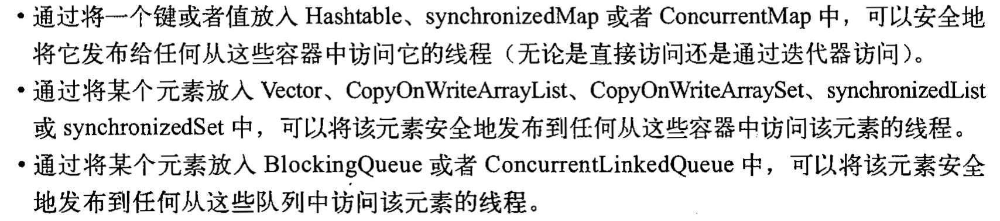
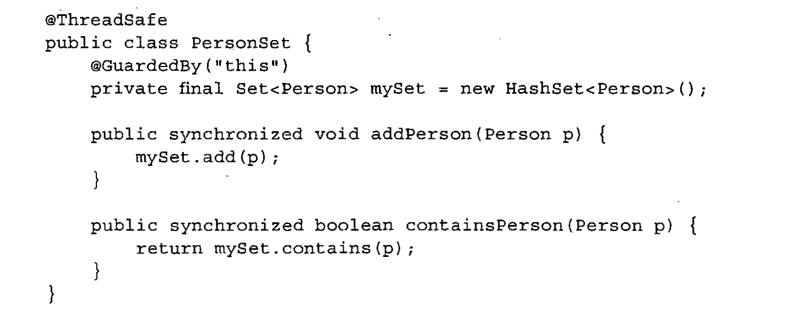
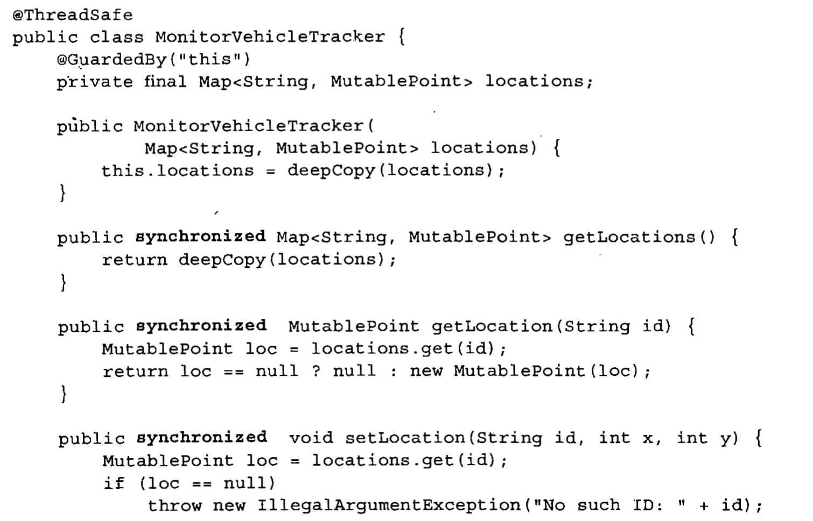
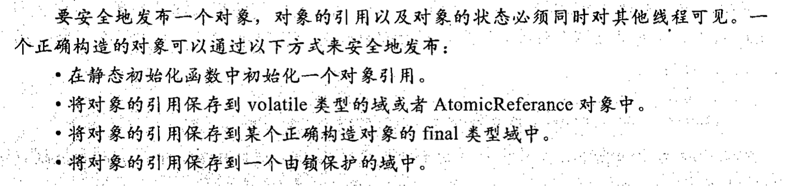

# 第一章、简介


但凡做事高效的人，总能在串行性和并行性之间找到合理的平衡


线程会共享进程范围内的资源，例如内存句柄和文件句柄，但每个线程都拥有各自的程序计数器，栈以及本地方法（原文是局部变量，也没错）等等

可见每一个线程都有独立的本地方法栈

> 局部变量：在方法体内声明的变量存储于栈中
>
> 成员变量：从属于类，在实例化对象中，存储在堆区
>
> :question:但是在网上查了资料说方法区里面存储了虚拟机加载的类信息，静态变量，常量，即时编译器编译的代码数据等等，按道理来说方法应该是类信息的一部分（肯定不会存在于堆中，堆中的对象只是包含了对象的数据），应该也属于方法区才是，但是另外的资料说局部变量属于栈中，有可能是在方法中使用了指向栈中的指针了吧:question:
>
> 近似的可以把方法区划作堆区（尽管是no heap，这是虚拟机的划法，便于标注于普通的堆区功能上的区别，物理模型上就是属于堆区）


在大多数现代操作系统中，都是以线程为基本的调度单位


线程的优势：在GUI应用程序中可以提高响应灵敏度，在服务器程序中可以提升资源利用率，JVM的实现还依赖线程（垃圾回收器通常运行在一个或多个相同的线程中）


Java对线程的支持其实是一柄双刃剑


简单线程同步问题跑出：

```java
@NotThreadSafe
public class Demo1 {
    private int value;

    public Integer getNext(){
        return value++;
    }

}
```

典型的线程不安全的代码，虽然看起来方法中只有value++一步，其实value对内存的操作分三步完成，读取value，value+1，回写value

如果此时value为9，线程A和B同时读取到了value，那么线程A输出value，将value+1成10，回写到内存中，线程B也将value+1成为10，回写到value

最后getNext执行了两次，value却只是加了一

> 这都只是按照指令顺序执行，JVM还涉及到指令重排的情况


使用自定义注释来指定对象是否为线程安全：

```java
@Documented
@Target(ElementType.TYPE)
@Retention(RetentionPolicy.RUNTIME)
public @interface NotThreadSafe {
}
```

> @Documented：标明这个注解应该被Javadoc记录，默认Javadoc是不包含注解的，是一个标记注解
>
> @Target：表面Annotation注解所修饰的对象范围，取值主要有以下几种：1.CONSTRUCTOR:用于描述构造器
> 2.FIELD:用于描述域
> 3.LOCAL_VARIABLE:用于描述局部变量
> 4.METHOD:用于描述方法
> 5.PACKAGE:用于描述包
> 6.PARAMETER:用于描述参数
> 7.TYPE:用于描述类、接口(包括注解类型) 或enum声明
>
> @Retention：标明注解会被保留到哪个阶段，取值主要有以下几种：1.RetentionPolicy.SOURCE —— 这种类型的Annotations只在源代码级别保留,编译时就会被忽略
> 2.RetentionPolicy.CLASS —— 这种类型的Annotations编译时被保留,在class文件中存在,但JVM将会忽略
> 3.RetentionPolicy.RUNTIME —— 这种类型的Annotations将被JVM保留,所以他们能在运行时被JVM或其他使用反射机制的代码所读取和使用.


将注解保留到JVM期，使得开发人员，维护人员和软件维护人员都可以了解你的代码


幸运的是，Java提供了各种同步机制来协同这种访问


通过将getNext修改为一个同步方法即可解决这个问题：

```java
@ThreadSafe
public class Demo2 {
    @GuardedBy("this")
    private int value;

    public synchronized Integer getNext(){
        return value++;
    }
}
```

Threadsafe的注解和上面的一模一样

GuardedBy注解：

```java
@Documented
@Target({ElementType.FIELD,ElementType.METHOD})
@Retention(RetentionPolicy.RUNTIME)
public @interface GuardedBy {
    String value();
}
```

指定了GuadedBy的标注对象：字段和方法（也确实是我们需要的）指定同步策略


线程还会导致活跃性问题：

活跃性：某种正确的问题最终会发生

活跃性问题的形式之一就是无意中造成的无限循环——死锁，饥饿，活锁


线程的性能问题：线程之间会频繁的切换上下文，导致CPU长期处于线程的调度状态而不是执行状态，压力全给了内存


每个Java应用程序都包含多个线程，如JVM内部的（垃圾收集，终结操作的线程），main方法的主线程。

Java应用程序启动时候至少包含两个线程：垃圾回收线程和主线程


# 第二章、线程安全性


并发编程的核心在于对访问状态操作进行管理，即共享的和可变的


Java实现同步的机制：关键字synchronized，volatile，显示锁以及原子变量


处理多个线程访问同一变量可能出现问题的方法：

- 不在线程之间共享该变量
- 将该变量由可变改为不可变
- 在访问该变量时候使用同步


完全由线程安全的类构成的程序不一定是线程安全的，在线程安全的程序中也可以包含非线程安全的类


线程安全的定义：当多个线程访问某个类时，这个类始终都能表现出正确的行为，那么称这个类是线程安全的。


在线程安全类当中就封装了必要的同步机制，在外调用这个线程安全的类的时候可以不用去采取同步措施


无状态对象是线程安全的

> 无状态对象：
>
> ​	既不包含任何域，也不包含任何对其他域的引用（即不操作内存上的数据，不存在数据共享，不会出现问题）


当类中加了一个long类型的域count后，就可能出现线程不安全的因素

如果执行count++操作，此操作是非原子的，不会作为一个不可分割的操作来完成（可能线程执行到++操作的一半就去执行其他操作了）

在并发编程中，由于不恰当的执行时序而出现不正确的结果被称作竞态条件

出现竞态条件后，正确的结果（你想达到的结果）的出现就要取决于运气了（CPU时段）。


- 最常见的竞态条件就是先检查后执行，在检查完后，如果CPU时间段到期了，会保存现有状态去执行其他线程，在去执行其他线程的时间段里，很有可能你先前执行的条件就改变了

使用先检查后执行最常见的例子就是延迟初始化（单例模型常用）


```java
@NotThreadSafe
public class Demo3 {

    private static Demo3 demo3 = null;
    private Demo3(){}
    public static Demo3 getDemo3(){
        if (demo3 == null) {
            demo3 = new Demo3();
        }
        return demo3;
    }
}
```

保证只存在一个Demo3对象（单例模型），但是如果直接这样使用的话，这是一个典型的先判断后执行的例子


- 还有一种竞态条件就是“读取——修改——写入”（value++）


使用不可分割的操作（原子操作）可以避免竞态条件


将“先检查后执行”和“读取-修改-写入”等操作叫做复合操作，要复合操作为原子操作时候才能保证不会出现竞态条件（Java加锁机制来确保原子性的内置机制）


使用java.util.concurrent.atomic来解决

对比：

```java
public class Demo4 {
    private static AtomicInteger integer1 = new AtomicInteger(0);

    private static Integer integer2 = 0;

    public static void main(String[] args) {
        //for (int i = 0; i < 100; i++) {
        //    new Thread(()->{
        //        System.out.println(integer2++);
        //    }).start();
        //}

        for (int i = 0; i < 100; i++) {
            new Thread(()->{
                System.out.println(integer1.getAndIncrement());
            }).start();
        }
    }

}

```

会发现第一个循环输出（操作的Integer类）无法输出99【中间有读写重复的，覆盖了一些操作】

而使用AtomicInteger可以（atomic包下的共性）都能保证访问操作是原子性的


当在无状态的类中添加一个状态时，如果该状态完全由线程安全的对象来管理，那么这个类仍然是线程安全的（这个条件不适用于从一变多）


尽量使用现有的线程安全对象来管理类的状态


模拟使用缓存情况出现安全问题

```java
/*
    模拟方法使用缓存
 */

@NotThreadSafe
public class Demo5 {

    private final AtomicReference<Integer> key = new AtomicReference<>();
    private final AtomicReference<Integer> value = new AtomicReference<>();

    {
        key.set(10);
        value.set(100);
    }

    //模拟要缓存的方法
    public void fun1(Integer a) {
        if (a != null && a.equals(key.get())) {
            System.out.println("进入缓存");
            System.out.println(value.get());
        } else {
            key.set(a);
            int b = a * 10;
            value.set(b);
            System.out.println(b);
        }
    }

    public static void main(String[] args) {
        Demo5 demo5 = new Demo5();
        demo5.fun1(10);
    }

}

```

使用了两个final类型（防止引用被改变）的变量来做缓存（Key和Value，每次只要计算完成之后都会将参数传入key，返回值传入value）如果接连着两次传入的值相同的话，那么就可以少运行一次，使用代码块来做初始化


这种方法是非线程安全的（虽然都是原子类），仍然存在着竞态条件

无法保证key和value更新的同步（只能保证自身更新的同步）


synchronized同步代码块保证代码块的原子性，如果修饰的是方法，则代码块就是方法体，锁就是调用该方法的对象，静态的方法则锁就是Class对象


每个Java对象都可以用作实现同步的锁，这种锁被称为内置锁或监视锁


进入代码块的唯一条件是能获取锁，当退出同步代码块，或跑出异常退出时会自动释放锁。


并发中的原子性与事务控制的原子性有着相同的含义——一组语句被作为一个不可分割的单元在执行


上述问题的解决方法：

```java
/*
    模拟方法使用缓存
 */

@ThreadSafe
public class Demo5Opt {
    @GuardedBy("this")
    private Integer key;
    @GuardedBy("this")
    private Integer value;

    {
        key = 10;
        value = 100;
    }

    //模拟要缓存的方法
    public synchronized void fun1(Integer a) {
        if (Objects.equals(a, key)) {
            System.out.println("进入缓存");
            System.out.println(value);
        } else {
            key = a;
            value = a*10;
            System.out.println(value);
        }
    }
}

```

虽然可以解决线程安全问题，但是处理效率极其低下（并发效率非常糟糕）

（这种设计方式设计出来的类最典型的就是Vector和HashTable，都是直接锁住整个方法，导致速度慢）


内置锁是可重入的：某个线程正在获取他已经拥有的锁，那么这个请求会成功

重入意味着锁的操作颗粒是线程，而不是调用

实现方式：为每个锁关联一个获取计数器和所有者线程，当计数器为0时，就认为锁没有被任何线程持有，当一个线程持有的锁时，锁会记录下所有者，并将计数器置1，如果再次获取锁，则计数器加1，当退出同步代码块时候则开始递减，直到重新减为零，这个锁将被释放


重入避免了死锁情况的发生：

```java
public class Demo6 extends Exam {

    @Override
    public synchronized void fun1() {
        super.fun1();
    }
}

class Exam {
    public synchronized void fun1(){
    }
}

```

如果不是可重入的，则当Demo6调用fun1会有一层锁，在锁内再次调用父类的fun1则会产生死锁


使用锁来保证复合操作的原子性（如：读取-修改-写入，先检查后执行）让其变为原子操作


:warning:常见错误：只有在写入共享变量时候需要加锁（第三章解释原因）


```java
public class Test {
    public synchronized void fun1() throws InterruptedException {
        System.out.println("进入fun1");
        TimeUnit.SECONDS.sleep(5);
    }
    public synchronized void fun2() throws InterruptedException {
        System.out.println("进入fun2");
        TimeUnit.SECONDS.sleep(5);
    }
```

如果有fun1和fun2方法，都需要获取当前调用对象，fun1和fun2不能同时运行


把对象设置成私有的可以防止其他线程通过其他方法直接操作对象，破坏了该对象的并发性


只有多线程同时访问的可变数据才需要通过锁来保护


即使将每个方法都声明成了synchronized（不可取，效率），也不能保证Vector上的复合操作都是原子的

```java
if (!vector.contains(element)) {
  vector.add(element);
}
```

还是造成了先检查后执行的毛病，导致产生了竞态条件


在方法上加锁是一种简单且粗粒度的方法来保证线程安全的，但付出了很高的代价


SpringBoot自动实现了线程池，使用异步任务就是启用线程池中的线程池来完成（默认高并发）


如果应用层的方法都是synchronized，必然导致Springboot接收的很多请求处于阻塞状态，我们将这种应用程序称为不良并发应用程序

可以通过缩小同步代码块的作用范围来确保SpringBoot的并发性，也保证了线程的安全性，应该尽量将不影响共享状态且执行时间较长的操作从同步代码块中移除


例子：

```java
/*
    模拟方法使用缓存
 */

@ThreadSafe
public class Demo5Opt2 {
    @GuardedBy("this")
    private Integer key;
    @GuardedBy("this")
    private Integer value;
    @GuardedBy("this")
    private Integer hits;
    @GuardedBy("this")
    private Integer cacheHits;

    {
        key = 10;
        value = 100;
    }

    public synchronized Integer getHits() {
        return hits;
    }

    public synchronized Double getCacheHitsRatio() {
        return (double) cacheHits / hits;
    }

    //模拟要缓存的方法
    public void fun1(Integer a) {
        Integer value = null;
        synchronized (this) {
            hits++;
            if (Objects.equals(a, key)) {
                cacheHits++;
                value = this.value;
                System.out.println("进入缓存");
                System.out.println(value);
            }
        }
        if (value == null) {
            value = a * 10;
            synchronized (this) {
                key = a;
                this.value = value;
            }
            System.out.println(value);
        }
    }

    public static void main(String[] args) {
        Demo5 demo5 = new Demo5();
        demo5.fun1(10);
    }
}

```

增加了总命中次数和缓存命中次数（也是安全的）【通过访问方法控制】

优化点（对比锁方法的）：

分别锁住了先检查后执行，K，V同时修改的模块，保证了内部的秩序


> 为什么这里的几个变量都没有使用原子类呢？
>
> 因为对他们的操作（如++）都直接放在了synchronized里面，保证了原子性
>
> 原文：
>
> “对在单个变量上实现原子操作来说，原子变量是很有用的，但由于我们已经使用了同步代码块来构造原子操作，而使用两种不同的同步代码机制不仅会带来混乱，也不会在性能和安全性上带来任何好处，因此这里不使用原子变量”


保证性能的前提是安全


如果持有锁的时间过长，那么都会带来活跃性或性能问题

> 当执行较长时间的计算或者无法快速完成操作（如：网络IO或者控制台IO时候，尽量避免持有锁）


# 第三章、对象的共享


第二章通过同步来避免多个线程同一时刻访问相同的数据

本章介绍如何共享和发布对象，从而使他们安全的由多个线程同时访问


同步不仅只保证原子性，还有保证了内存可见性


内存可见性的初步理解：当一个线程修改了对象状态后，其他线程能够看到发生的状态变化


通常，我们无法确保执行读操作的线程能够适时地看到其他线程写入的值，有时甚至是不可能的，为确保多线程对内存写入操作的可见性，必须使用同步机制


例子：

```java
package cn.luckycurve.threadsecurity;

@NotThreadSafe
public class Demo7 {
    private static Boolean ready;
    private static Integer number;

    public static void main(String[] args) {
        for (int i = 0; i < 100; i++) {
            ready = false;
            number = 0;
            new Thread(() -> {
                while (!ready) {
                    Thread.yield();
                }
                System.out.println(number);
            }).start();
          	number = 42;
            ready = true;
			}
    }
}

```

> Thread.yield();
>
> ​	线程让步，降低线程执行优先级，**但不会释放锁**


【程序目的】：开启监视线程，默认ready为false，当ready为true的时候输出number的数值，主线程就开启监视线程后将number置为42，再讲ready置为true（顺序有讲究）

> 如果是先将ready置为true，再将num置为42，那么出现零则可以这样解释：
>
> 在主线程执行完ready = true后，CPU转去执行另外的线程去了，就有可能出现零。

为了让效果明显，循环十次

:question:输出会出现零的情况


监视线程可能只看到了写入ready的值，却没有看到写入number的值，这种现象称为“重排序”

只要在某个线程中无法检测到重排序情况（即使在其他线程中可以感受到明显的重排序），那么就无法确保线程中的操作会按照指令顺序来执行

有可能重排成了ready = ttrue	number = 42  ，在这两条语句之前出现了线程切换，就会出现零的情况


> 在没有同步的情况下，编译器，处理器，JVM都会对操作进行重排


要对那些缺乏足够同步的并发程序的执行状况进行推断是十分困难的

解决方法：只要有数据在多个线程之间共享，就是用正确的同步


上述的例子就是缺乏同步导致的一种情况：失效数据

可能会出现这种情况：该线程获取某个变量的最新值，获取其他变量的失效值

最常见的可能出现失效数据的情况：

```java
@NotThreadSafe
public class Demo8 {
    private Integer value;

    public Integer getValue() {
        return value;
    }

    public void setValue(Integer value) {
        this.value = value;
    }
}
```

改进：

```java
@NotThreadSafe
public class Demo8Opt {
    @GuardedBy("this")
    private Integer value;

    public synchronized Integer getValue() {
        return value;
    }

    public synchronized void setValue(Integer value) {
        this.value = value;
    }
}

```


在没有同步的情况下读取变量，可能会获得一个失效值，但这个失效值还是以前某个线程设置的，这种安全性保证也被称作最低安全性

并不是所有的变量都拥有最低安全性的，有一个例外：非volatile类型的64位数值变量（8个字节：long和double）


同步的可见性保证：当线程B执行由锁保护的同步代码块时，可以看到线程A之前在同一个同步代码块中的所有操作结果。

为了保证某个共享变量的可见性，需要加锁，如果没加锁，读取的可能是一个失效值


> 加锁的含义不仅仅是局限于互斥行为，还包括内存可见性（确保所有线程都能看到共享变量的最新值）


Java还提供了一个稍弱的同步机制：volatile变量，确保变量更新操作会通知到其他线程

大多数处理器架构上，volatile的开销只比非volatile的开销略大一点

JVM不会对volatile变量的操作进行重排

volatile变量不会缓存到寄存器或者是其他的地方，因此读取volatile的变量总是最新写入的


并不建议过度依赖volatile提供的可见性

volatile的正确使用方式包括：确保自身的可见性，确保所引用的对象的可见性，以及标识一些重要的程序生命周期时间的发生

经典用法：

```java
volatile boolean asleep;

while (!asleep) {
  countSomeSheep();
}
```

【程序目的】当asleep为false，没睡着的时候，执行数绵羊操作

使用volatile保证别的线程修改了asleep时候能够发现，也可以用锁来确保asleep的可见性，但是会很麻烦


虽然volatile很方便，也存在局限性：无法保证count++的原子性

常用于操作的状态的标志


对象发布：在某一个非私有的方法中返回该引用，或者将引用传递到其他类的方法中

对象逸出：当某个不该发布的对象被发布时，例如在对象构造函数完成之前就发布该对象


发布对象最简单的方式就是将对象的引用保存到一个公有的静态变量中

```java
public static Object obj;

public void init (){
  obj = new HashMap<String,String>();
}
```


逸出例子：内部可变状态逸出

```java
public class Data{
  private ArrayList<String> status = new ArrayList<String>();
  public ArrayList<String> getStatus(){
    return status;
  }
}
```

只有基本的数据类型和封装类需要get和set方法，如果是一个对象包括基本数据类型数组，就直接传递地址了（不是传递引用，例子在Java基础一）


逸出对象可能某个类或者线程正在使用和改变他，可能导致系统稳定性降低，这正是封装的最主要原因


this逸出：

```java
public class Demo9 {

    public Demo9(EventSource source) {
        source.RegisterListener(new EventListener() {
            @Override
            public void onEvent(Event e) {
                doSomething(e);
            }
        });
    }

    void doSomething(Event e) {

    }

    interface EventSource {
        void RegisterListener(EventListener e);
    }

    interface EventListener {
        void onEvent(Event e);
    }

    interface Event {

    }
}
```

this逸出（看了老半天，作者是真的强）

出现了this逸出：

开启了一个事务监听器，自然就开启了一个线程。

>  创建匿名类时候：
>
> Class A {
>
> ​	public A () {
>
> ​		new B(){
>
> ​			this指的是当前A对象
>
> ​		}
>
> ​	}
>
> }


不要在构造方法中使得this逸出


最常见的this逸出就是在构造函数中启用一个线程，因为线程会记录启用自己的对象，自然而然就获取到了this，可此时的this还未完成初始化，造成了逸出


解决办法：定义一个私有的构造方法和一个公有的工厂方法，让返回实例化对象由构造函数转移到工厂方法，并在工厂方法中启动线程代替在构造函数中启用线程


实现线程安全线最简单的方式之一就是：线程封闭

线程封闭：当某个对象封装在一个线程中时，这种做法自动实现线程安全线


线程封闭技术常用的应用为：Swing和JDBC中的Connection对象

Swing的可视化组件和数据模型对象都是通过这种形式来保证线程安全的

虽然JDBC规范中并不要求Connection对象是必须线程安全的，但我们在使用时候，线程从连接池中获取Connection对象，处理请求，再返还给线程本身，由于在Connection对象返还之前，连接池不会将他分配给其他的线程，这也就实现了Connection对象在一段时间内的线程封闭，保证了线程安全


如果使用线程封闭，程序员需要自己确保封闭在线程中的对象不会逸出


ad-hoc线程封闭：维护线程封闭性的职责完全由程序实现承担，非常脆弱

单线程子系统的简便性要胜过ad-hoc线程封闭技术的脆弱性


只要在volatile变量能确保只有单个线程对共享的volatile对象进行写入操作，那么volatile对象就是线程安全的（本身具有可见性，任何时可只有单个线程执行写入操作可以保证操作的原子性）自然就是线程安全的


由于ad-hoc的脆弱，尽量少用，使用更强的线程封闭技术（栈封闭或ThreadLoacl类）


栈封闭【线程封闭的一种特例】（封闭的是局部变量，更容易管理）（直接上代码）：

```java
@ThreadSafe
public class Demo10 {
//    栈封闭的小Demo
    public Integer loadCandidates(List<String> candidates){
        ArrayList<String> strings;
        Integer num = 0;

    //    strings有可能逸出，需要注意，num不会逸出(基本数据类型和封装类传值)
        strings = new ArrayList<>();
        for (String i : candidates) {
            num++;
            strings.add(i);
        }
        return num;
    }
}
```

栈封闭指的是直接对在方法中创建的对象或者基本数据类型数组封装在方法区里边，不让其逸出，而对基础数据类型和封装类则可以（传的是指，不是地址，不会影响其中的数据）


如果发布了strings对象或者是其中的内部数据，那么封闭性会被破坏，并且导致strings对象全部逸出


如果在线程内部使用非线程安全的对象，那么该对象仍然是线程安全的【通过编码来体现，如果没有特殊说明，后期的维护人员很可能造成对象逸出】


以上均是通过编码人员的编码约定来实现的，不够标准和体系化，很容易在后期被破坏

维护线程封闭性的更规范的办法是使用ThreadLoacl类，ThreadLocal使得保存的在线程中的对象和当前线程中的某个值相关联，提供get和set方法，set进其中的对象会为每个线程安排一份独立的副本，因此get出来的值一定是当前线程之前执行set时设置的最新值

```java
//通过使用线程封闭ThreadLocal来保证线程的封闭性
@ThreadSafe
public class Demo11 {

    private static ThreadLocal<Connection> connectionHolder =
            new ThreadLocal<Connection>(){
                @Override
                protected Connection initialValue() {
                    return DriverManager.getConnection();
                }
            };

    public static Connection getConnection () {
        return connectionHolder.get();
    }

    public static void main(String[] args) {
        System.out.println(Demo11.getConnection());
        for (int i = 0; i < 5; i++) {
            new Thread(()->{
                System.out.println(Demo11.getConnection());
            }).start();
        }
    }

}

```

Connection不是线程安全的，需要自己保护（使用ThreadLoacl）


想向ThreadLoacl里面赋初值，千万不要使用静态代码块调用set方法

静态代码块只会被第一个加载他的线程触发，初始化数值也只是初始化了一个线程的，重写initialValue（）方法。


ThreadLoacl的另一个使用场景：做缓冲区

例如Java5之前的Integer.toString();就是用ThreadLoacl来保存一个是十二字节大小的缓冲区。而不是采用共享的静态缓冲区（需要每个地方都上锁）或每次调用都分配一个新的缓冲区【在这里和分配一个新的缓冲区相比ThreadLocal没有任何的优势，除非该操作执行效率非常高，或者分配操作的开销高】   5.0之后就直接使用分配一个新的缓冲区了。


可以将ThreadLocal<T>理解成Map<Thread,T>，但有一点不同：当线程终结的时候，该Thread可以被回收（Map好像做不到部分K回收）


ThreadLocal在被大量使用，但不能滥用，会降低代码的可重用性，使得类之间增加了耦合，使用时候要小心


线程安全性是不可变对象的固有属性之一


在程序设计中，一个最困难的地方就是判断复杂对象的可能状态


并不是所有字段为final，该对象就是不可变对象（final可以是可变对象的引用）


当对象满足以下条件时，为不可变对象：

- 对象创建之后值就无法修改
- 对象的所有域都是final的
- 对象是正确创建的（没有this逸出）


```java
@Immutable
public final class Demo12 {
    private final List<String> condition = new ArrayList<>();

    public Demo12() {
        condition.add("con1");
        condition.add("con2");
        condition.add("con3");
    }
}
```

不可变对象不是不能改变的，只是不提供外界改变对象中的数据的接口而已


final可以理解成C++中的const的受限版本，final类型的域是不可修改的


除非需要更高的可见性，否则应该将所有的域都声明为final域


对前面缓存操作的另一种实现（通过常量方式）

```java
@ThreadSafe
public class Demo5Opt3 {
    private volatile OneValueCache cache = new OneValueCache(10, 100);

    public void fun1(Integer key) {
        if (cache.getValueByKey(key) != null) {
            System.out.println("进入缓存");
            System.out.println(cache.getValueByKey(key));
        } else {
            Integer value = key * 10;
            System.out.println(value);
            cache = new OneValueCache(key,value);
        }
    }
}

@ThreadSafe
class OneValueCache {
    private final Integer key;
    private final Integer value;

    public OneValueCache(Integer key, Integer value) {
        this.key = key;
        this.value = value;
    }

    public Integer getValueByKey(Integer key) {
        return Objects.equals(key, this.key) ? value : null;
    }
}
```

每个OneValueCache都是不可变的，即是线程安全的。

将OneValueCache作为上一次运行结果的缓存，并且声明为volatile保证所有线程的可见性，当下一次传入的操作不是上一次时，会让cache指向本次运行结果所封装的OneValueCache，上一个cache自然而然就被垃圾回收了。


上面都是讨论如何阻止一个对象发布（防止逸出）

那么如何进行安全的发布呢？


不安全的发布：

```java
public Demo demo;

public void init () {
  demo = new Demo();
}
```

:warning:构造函数没有问题，目前已知的构造函数出问题的情况就是在构造函数中启动线程导致this逸出

这里出现的问题是可见性问题（信息不一致）


书上说这个代码可能报错，但我跑了一会儿并没有报错，可能方式不对吧

```java
@NotThreadSafe
public class Demo13 {
    private Integer n;

    public Demo13(Integer n) {
        this.n = n;
    }

    public void check() throws Exception {
        if (n != n) {
            throw new Exception("没有完全构造完成");
        }
    }
}
```

理论：有可能当前的这个Demo13对象还没有创建完成，其他线程就直接调用了check方法导致一些奇怪的错误


如果Demo13这个例子变成了不可变对象，那么就不会出现问题（Java自动保证不可变类型的初始化）。


任何线程都可以在不需要额外同步的情况下安全的访问不可变变量，但不能保证final域所指的对象线程安全（没有保证数据的可见性，可以使用volatile来轻松解决这个问题）


一个构造正确的对象（构造函数中不会出现this逸出）可以通过以下方式来安全的发布：

- 在静态初始化函数中初始化一个对象引用
- 将对象的引用保存到volatile的域或者是AtomicReference对象中
- 将对象的引用保存到某个正确构造对象的final类型域中
- 将对象的引用保存到一个由锁保存的域中


可以将对象放入线程安全的容器来就满足最后一条

使用该对象X的线程A和线程B都不用包含显式的同步，但是却是线程安全的


在线程安全的容器类中提供了以下安全发布的保障：




发布一个静态变量最简单也是最安全的办法

```java
public static Object obj = new Object();
```


事实不可变对象：如果对象在发布后不会改变，那么确保安全发布（保证发布时候的同步性）那么就够了。

例如存储用户访问时间信息（假设时间信息不会再改变）：

```java
public Map<String , Date> loginTime = ConcurrentHashMap<String,Data>();
```

即可保证安全，如果改变了的话就无法保证了


如果是可变对象，使用上述方法只能保证发布当时的线程安全性，还需要在每次对象被访问时候同样需要使用同步操作来保证后续操作的可见性


总结：

- 不可变对象（全字段为final）可以通过任意机制发布
- 事实不可变对象必须通过安全方式发布
- 可变对象必须通过安全方式发布，并且必须是线程安全的


当发布一个对象时，必须明确的说明对象的访问方式，让别人知道可以在这个引用上线程安全的执行哪些操作


>  总结：共享对象时候可以使用一些策略：
>
> - 线程封闭：封闭到线程中，只供自己拥有（Ad-hoc线程封闭（手动实现），栈封闭（封闭到方法体里面），ThreadLoacl（让每个线程独享一份数据备份））
> - 只读共享：主要包括不可变对象和事实不可变对象
> - 线程安全的对象：在内部实现同步，让多个线程访问接口不需要做任何处理
> - 保护对象：被保护的对象只能通过持有锁来访问（此时锁在当前被保护对象的手上）


# 第四章、对象的组合

我们并不希望每一次访问都需要对内存进行分析以确保安全，而是希望通过现有的安全组价来组合成为更大规模的组件或程序


设计线程安全的类的三个基本要素：

- 找出构成对象状态的所有变量
- 找出约束状态变量的不变性条件
- 建立对象状态的并发访问管理策略




通过封闭机制来确保类的线程安全（尽管该类的状态变量是非线程安全的）

防止mySet逸出，并且将访问状态变量mySet的两个方法全都使用this来锁了起来，所以PersonSet的访问状态完全由它的内置锁保护


这里并没有讨论到Person的线程安全性，如果Person是非线程安全的，那么在mySet与Person的交互过程中可能出现了别的线程来修改了获取到的Person对象


以上PersonSet的封装被称为实例封闭，实例封装是构建线程安全类的一个最简单的方式

Java底层中也存在大量的实例封闭的使用：例如Collections.synchronizedList以及其他的类似方法，通过装饰器模式将容器类封装进一个同步的包装类对象中，包装类中所有的方法都是加锁的，然后在映射到底层的集合类的操作上面去，只要包装类拥有的是底层集合的唯一引用（底层的集合没有被直接的或间接地（例如发布了迭代器，或内部的类实例）），那么他就是线程安全的。

只要封装类中的对象满足第三章结尾的其中一个共享策略，那么就能保证这个封装类是线程安全的


由线程封闭原则可以得出Java监视器模式——会把对象的所有可变状态都封装起来，并由对象自己的内置锁来保护，Java监视器模式仅仅只是一种书写代码的约定，Java监视器模式从属于实例封装，用来保护对象的状态。

```java
//典型的Java监视器模式
@ThreadSafe
public class Demo14 {
    @GuardedBy("this")
    private long value = 0;

    public synchronized long getValue(){
        return value;
    }

    public synchronized long increment(){
        if (value == Long.MAX_VALUE) {
            throw new IllegalStateException("count overflow");
        }
        return ++value;
    }
}
```


可以使用一个私有锁来让其他线程无法获取到这把锁，从而保证被锁的代码块只有在该类才能得到执行

```java
@ThreadSafe
public class Demo14Opt {
    private final Object mylock = new Object();

    @GuardedBy("mylock")
    private Object data;

    public Object getData() {
        synchronized (mylock) {
            return data;
        }
    }

    public void setData(Object data) {
        synchronized (mylock) {
            this.data = data;
        }
    }
}
```

使用内部锁来保证了data的get和set方法屏蔽掉了类外的调用，并且还保持了线程的安全性

感觉等价于以下代码：

```java
    private Object getData() {
        synchronized (this) {
            return data;
        }
    }

    private void setData(Object data) {
        synchronized (this) {
            this.data = data;
        }
    }
```

都是让外界无法访问到这两个方法，并且在内部还实现了线程安全性




说白了就是提供操作被封装的非线程安全的对象的一系列线程安全的操作


Java中大多是组合对象，如果有多个非线程安全的类组合在一起，那么监听器模式或者说是实例封装就会非常有用，将每个类都固定在线程内部，提供唯一的访问接口用加锁。**可是如果组成该类的所有类都是线程安全的呢？**答案是“视情况而定”，某些情况下是的，某些情况下只是开头有效。可以类比于只有一个线程安全类组成的类，也是一样的看情况而定，例如使用以下操作就不是线程安全的了

```java
if (!a.contain("hello")) {
  a.add("hello");
}
```

第一章讲的先判断后赋值操作，虽然单步都是原子性的，但是还是有问题

:question:：到后面讨论问题都没探讨到每一步骤了，都是直接站在类和方法的角度来分析


假设类A由类B和类C组合而成，如果满足以下条件：

- 类B和类C的实例化对象都被声明为final（保证可见性）
- 类B和类C都是线程安全的（保证操作的原子性）
- 类B和类C之间不存在耦合关系

类A即可将他的线程安全性委托给类B和类C


当全局变量被声明成final的时候，他的可见性已经提高了



所以不用担心可见性的问题，只需要考虑对象的操作的原子性即可（保证返回的对象是线程安全的）


