# 简介


但凡做事高效的人，总能在串行性和并行性之间找到合理的平衡


线程会共享进程范围内的资源，例如内存句柄和文件句柄，但每个线程都拥有各自的程序计数器，栈以及本地方法（原文是局部变量，也没错）等等

可见每一个线程都有独立的本地方法栈

> 局部变量：在方法体内声明的变量存储于栈中
>
> 成员变量：从属于类，在实例化对象中，存储在堆区
>
> :question:但是在网上查了资料说方法区里面存储了虚拟机加载的类信息，静态变量，常量，即时编译器编译的代码数据等等，按道理来说方法应该是类信息的一部分（肯定不会存在于堆中，堆中的对象只是包含了对象的数据），应该也属于方法区才是，但是另外的资料说局部变量属于栈中，有可能是在方法中使用了指向栈中的指针了吧:question:
>
> 近似的可以把方法区划作堆区（尽管是no heap，这是虚拟机的划法，便于标注于普通的堆区功能上的区别，物理模型上就是属于堆区）


在大多数现代操作系统中，都是以线程为基本的调度单位


线程的优势：在GUI应用程序中可以提高响应灵敏度，在服务器程序中可以提升资源利用率，JVM的实现还依赖线程（垃圾回收器通常运行在一个或多个相同的线程中）


Java对线程的支持其实是一柄双刃剑


简单线程同步问题跑出：

```java
@NotThreadSafe
public class Demo1 {
    private int value;

    public Integer getNext(){
        return value++;
    }

}
```

典型的线程不安全的代码，虽然看起来方法中只有value++一步，其实value对内存的操作分三步完成，读取value，value+1，回写value

如果此时value为9，线程A和B同时读取到了value，那么线程A输出value，将value+1成10，回写到内存中，线程B也将value+1成为10，回写到value

最后getNext执行了两次，value却只是加了一

> 这都只是按照指令顺序执行，JVM还涉及到指令重排的情况


使用自定义注释来指定对象是否为线程安全：

```java
@Documented
@Target(ElementType.TYPE)
@Retention(RetentionPolicy.RUNTIME)
public @interface NotThreadSafe {
}
```

> @Documented：标明这个注解应该被Javadoc记录，默认Javadoc是不包含注解的，是一个标记注解
>
> @Target：表面Annotation注解所修饰的对象范围，取值主要有以下几种：1.CONSTRUCTOR:用于描述构造器
> 2.FIELD:用于描述域
> 3.LOCAL_VARIABLE:用于描述局部变量
> 4.METHOD:用于描述方法
> 5.PACKAGE:用于描述包
> 6.PARAMETER:用于描述参数
> 7.TYPE:用于描述类、接口(包括注解类型) 或enum声明
>
> @Retention：标明注解会被保留到哪个阶段，取值主要有以下几种：1.RetentionPolicy.SOURCE —— 这种类型的Annotations只在源代码级别保留,编译时就会被忽略
> 2.RetentionPolicy.CLASS —— 这种类型的Annotations编译时被保留,在class文件中存在,但JVM将会忽略
> 3.RetentionPolicy.RUNTIME —— 这种类型的Annotations将被JVM保留,所以他们能在运行时被JVM或其他使用反射机制的代码所读取和使用.


将注解保留到JVM期，使得开发人员，维护人员和软件维护人员都可以了解你的代码


幸运的是，Java提供了各种同步机制来协同这种访问


通过将getNext修改为一个同步方法即可解决这个问题：

```java
@ThreadSafe
public class Demo2 {
    @GuardedBy("this")
    private int value;

    public synchronized Integer getNext(){
        return value++;
    }
}
```

Threadsafe的注解和上面的一模一样

GuardedBy注解：

```java
@Documented
@Target({ElementType.FIELD,ElementType.METHOD})
@Retention(RetentionPolicy.RUNTIME)
public @interface GuardedBy {
    String value();
}
```

指定了GuadedBy的标注对象：字段和方法（也确实是我们需要的）指定同步策略


线程还会导致活跃性问题：

活跃性：某种正确的问题最终会发生

活跃性问题的形式之一就是无意中造成的无限循环——死锁，饥饿，活锁


线程的性能问题：线程之间会频繁的切换上下文，导致CPU长期处于线程的调度状态而不是执行状态，压力全给了内存


每个Java应用程序都包含多个线程，如JVM内部的（垃圾收集，终结操作的线程），main方法的主线程。

Java应用程序启动时候至少包含两个线程：垃圾回收线程和主线程


# 第一部分、基础知识

## 第二章、线程安全性


并发编程的核心在于对访问状态操作进行管理，即共享的和可变的


Java实现同步的机制：关键字synchronized，volatile，显示锁以及原子变量


处理多个线程访问同一变量可能出现问题的方法：

- 不在线程之间共享该变量
- 将该变量由可变改为不可变
- 在访问该变量时候使用同步


完全由线程安全的类构成的程序不一定是线程安全的，在线程安全的程序中也可以包含非线程安全的类


线程安全的定义：当多个线程访问某个类时，这个类始终都能表现出正确的行为，那么称这个类是线程安全的。


在线程安全类当中就封装了必要的同步机制，在外调用这个线程安全的类的时候可以不用去采取同步措施


无状态对象是线程安全的

> 无状态对象：
>
> ​	既不包含任何域，也不包含任何对其他域的引用（即不操作内存上的数据，不存在数据共享，不会出现问题）


当类中加了一个long类型的域count后，就可能出现线程不安全的因素

如果执行count++操作，此操作是非原子的，不会作为一个不可分割的操作来完成（可能线程执行到++操作的一半就去执行其他操作了）

在并发编程中，由于不恰当的执行时序而出现不正确的结果被称作竞态条件

出现竞态条件后，正确的结果（你想达到的结果）的出现就要取决于运气了（CPU时段）。


- 最常见的竞态条件就是先检查后执行，在检查完后，如果CPU时间段到期了，会保存现有状态去执行其他线程，在去执行其他线程的时间段里，很有可能你先前执行的条件就改变了

使用先检查后执行最常见的例子就是延迟初始化（单例模型常用）


```java
@NotThreadSafe
public class Demo3 {

    private static Demo3 demo3 = null;
    private Demo3(){}
    public static Demo3 getDemo3(){
        if (demo3 == null) {
            demo3 = new Demo3();
        }
        return demo3;
    }
}
```

保证只存在一个Demo3对象（单例模型），但是如果直接这样使用的话，这是一个典型的先判断后执行的例子


- 还有一种竞态条件就是“读取——修改——写入”（value++）


使用不可分割的操作（原子操作）可以避免竞态条件


将“先检查后执行”和“读取-修改-写入”等操作叫做复合操作，要复合操作为原子操作时候才能保证不会出现竞态条件（Java加锁机制来确保原子性的内置机制）


使用java.util.concurrent.atomic来解决

对比：

```java
public class Demo4 {
    private static AtomicInteger integer1 = new AtomicInteger(0);

    private static Integer integer2 = 0;

    public static void main(String[] args) {
        //for (int i = 0; i < 100; i++) {
        //    new Thread(()->{
        //        System.out.println(integer2++);
        //    }).start();
        //}

        for (int i = 0; i < 100; i++) {
            new Thread(()->{
                System.out.println(integer1.getAndIncrement());
            }).start();
        }
    }

}

```

会发现第一个循环输出（操作的Integer类）无法输出99【中间有读写重复的，覆盖了一些操作】

而使用AtomicInteger可以（atomic包下的共性）都能保证访问操作是原子性的


当在无状态的类中添加一个状态时，如果该状态完全由线程安全的对象来管理，那么这个类仍然是线程安全的（这个条件不适用于从一变多）


尽量使用现有的线程安全对象来管理类的状态


模拟使用缓存情况出现安全问题

```java
/*
    模拟方法使用缓存
 */

@NotThreadSafe
public class Demo5 {

    private final AtomicReference<Integer> key = new AtomicReference<>();
    private final AtomicReference<Integer> value = new AtomicReference<>();

    {
        key.set(10);
        value.set(100);
    }

    //模拟要缓存的方法
    public void fun1(Integer a) {
        if (a != null && a.equals(key.get())) {
            System.out.println("进入缓存");
            System.out.println(value.get());
        } else {
            key.set(a);
            int b = a * 10;
            value.set(b);
            System.out.println(b);
        }
    }

    public static void main(String[] args) {
        Demo5 demo5 = new Demo5();
        demo5.fun1(10);
    }

}

```

使用了两个final类型（防止引用被改变）的变量来做缓存（Key和Value，每次只要计算完成之后都会将参数传入key，返回值传入value）如果接连着两次传入的值相同的话，那么就可以少运行一次，使用代码块来做初始化


这种方法是非线程安全的（虽然都是原子类），仍然存在着竞态条件

无法保证key和value更新的同步（只能保证自身更新的同步）


synchronized同步代码块保证代码块的原子性，如果修饰的是方法，则代码块就是方法体，锁就是调用该方法的对象，静态的方法则锁就是Class对象


每个Java对象都可以用作实现同步的锁，这种锁被称为内置锁或监视锁


进入代码块的唯一条件是能获取锁，当退出同步代码块，或跑出异常退出时会自动释放锁。


并发中的原子性与事务控制的原子性有着相同的含义——一组语句被作为一个不可分割的单元在执行


上述问题的解决方法：

```java
/*
    模拟方法使用缓存
 */

@ThreadSafe
public class Demo5Opt {
    @GuardedBy("this")
    private Integer key;
    @GuardedBy("this")
    private Integer value;

    {
        key = 10;
        value = 100;
    }

    //模拟要缓存的方法
    public synchronized void fun1(Integer a) {
        if (Objects.equals(a, key)) {
            System.out.println("进入缓存");
            System.out.println(value);
        } else {
            key = a;
            value = a*10;
            System.out.println(value);
        }
    }
}

```

虽然可以解决线程安全问题，但是处理效率极其低下（并发效率非常糟糕）

（这种设计方式设计出来的类最典型的就是Vector和HashTable，都是直接锁住整个方法，导致速度慢）


内置锁是可重入的：某个线程正在获取他已经拥有的锁，那么这个请求会成功

重入意味着锁的操作颗粒是线程，而不是调用

实现方式：为每个锁关联一个获取计数器和所有者线程，当计数器为0时，就认为锁没有被任何线程持有，当一个线程持有的锁时，锁会记录下所有者，并将计数器置1，如果再次获取锁，则计数器加1，当退出同步代码块时候则开始递减，直到重新减为零，这个锁将被释放


重入避免了死锁情况的发生：

```java
public class Demo6 extends Exam {

    @Override
    public synchronized void fun1() {
        super.fun1();
    }
}

class Exam {
    public synchronized void fun1(){
    }
}

```

如果不是可重入的，则当Demo6调用fun1会有一层锁，在锁内再次调用父类的fun1则会产生死锁


使用锁来保证复合操作的原子性（如：读取-修改-写入，先检查后执行）让其变为原子操作


:warning:常见错误：只有在写入共享变量时候需要加锁（第三章解释原因）


```java
public class Test {
    public synchronized void fun1() throws InterruptedException {
        System.out.println("进入fun1");
        TimeUnit.SECONDS.sleep(5);
    }
    public synchronized void fun2() throws InterruptedException {
        System.out.println("进入fun2");
        TimeUnit.SECONDS.sleep(5);
    }
```

如果有fun1和fun2方法，都需要获取当前调用对象，fun1和fun2不能同时运行


把对象设置成私有的可以防止其他线程通过其他方法直接操作对象，破坏了该对象的并发性


只有多线程同时访问的可变数据才需要通过锁来保护


即使将每个方法都声明成了synchronized（不可取，效率），也不能保证Vector上的复合操作都是原子的

```java
if (!vector.contains(element)) {
  vector.add(element);
}
```

还是造成了先检查后执行的毛病，导致产生了竞态条件


在方法上加锁是一种简单且粗粒度的方法来保证线程安全的，但付出了很高的代价


SpringBoot自动实现了线程池，使用异步任务就是启用线程池中的线程池来完成（默认高并发）


如果应用层的方法都是synchronized，必然导致Springboot接收的很多请求处于阻塞状态，我们将这种应用程序称为不良并发应用程序

可以通过缩小同步代码块的作用范围来确保SpringBoot的并发性，也保证了线程的安全性，应该尽量将不影响共享状态且执行时间较长的操作从同步代码块中移除


例子：

```java
/*
    模拟方法使用缓存
 */

@ThreadSafe
public class Demo5Opt2 {
    @GuardedBy("this")
    private Integer key;
    @GuardedBy("this")
    private Integer value;
    @GuardedBy("this")
    private Integer hits;
    @GuardedBy("this")
    private Integer cacheHits;

    {
        key = 10;
        value = 100;
    }

    public synchronized Integer getHits() {
        return hits;
    }

    public synchronized Double getCacheHitsRatio() {
        return (double) cacheHits / hits;
    }

    //模拟要缓存的方法
    public void fun1(Integer a) {
        Integer value = null;
        synchronized (this) {
            hits++;
            if (Objects.equals(a, key)) {
                cacheHits++;
                value = this.value;
                System.out.println("进入缓存");
                System.out.println(value);
            }
        }
        if (value == null) {
            value = a * 10;
            synchronized (this) {
                key = a;
                this.value = value;
            }
            System.out.println(value);
        }
    }

    public static void main(String[] args) {
        Demo5 demo5 = new Demo5();
        demo5.fun1(10);
    }
}

```

增加了总命中次数和缓存命中次数（也是安全的）【通过访问方法控制】

优化点（对比锁方法的）：

分别锁住了先检查后执行，K，V同时修改的模块，保证了内部的秩序


> 为什么这里的几个变量都没有使用原子类呢？
>
> 因为对他们的操作（如++）都直接放在了synchronized里面，保证了原子性
>
> 原文：
>
> “对在单个变量上实现原子操作来说，原子变量是很有用的，但由于我们已经使用了同步代码块来构造原子操作，而使用两种不同的同步代码机制不仅会带来混乱，也不会在性能和安全性上带来任何好处，因此这里不使用原子变量”


保证性能的前提是安全


如果持有锁的时间过长，那么都会带来活跃性或性能问题

> 当执行较长时间的计算或者无法快速完成操作（如：网络IO或者控制台IO时候，尽量避免持有锁）


## 第三章、对象的共享


第二章通过同步来避免多个线程同一时刻访问相同的数据

本章介绍如何共享和发布对象，从而使他们安全的由多个线程同时访问


同步不仅只保证原子性，还有保证了内存可见性


内存可见性的初步理解：当一个线程修改了对象状态后，其他线程能够看到发生的状态变化


通常，我们无法确保执行读操作的线程能够适时地看到其他线程写入的值，有时甚至是不可能的，为确保多线程对内存写入操作的可见性，必须使用同步机制


例子：

```java
package cn.luckycurve.threadsecurity;

@NotThreadSafe
public class Demo7 {
    private static Boolean ready;
    private static Integer number;

    public static void main(String[] args) {
        for (int i = 0; i < 100; i++) {
            ready = false;
            number = 0;
            new Thread(() -> {
                while (!ready) {
                    Thread.yield();
                }
                System.out.println(number);
            }).start();
          	number = 42;
            ready = true;
			}
    }
}

```

> Thread.yield();
>
> ​	线程让步，降低线程执行优先级，**但不会释放锁**


【程序目的】：开启监视线程，默认ready为false，当ready为true的时候输出number的数值，主线程就开启监视线程后将number置为42，再讲ready置为true（顺序有讲究）

> 如果是先将ready置为true，再将num置为42，那么出现零则可以这样解释：
>
> 在主线程执行完ready = true后，CPU转去执行另外的线程去了，就有可能出现零。

为了让效果明显，循环十次

:question:输出会出现零的情况


监视线程可能只看到了写入ready的值，却没有看到写入number的值，这种现象称为“重排序”

只要在某个线程中无法检测到重排序情况（即使在其他线程中可以感受到明显的重排序），那么就无法确保线程中的操作会按照指令顺序来执行

有可能重排成了ready = ttrue	number = 42  ，在这两条语句之前出现了线程切换，就会出现零的情况


> 在没有同步的情况下，编译器，处理器，JVM都会对操作进行重排


要对那些缺乏足够同步的并发程序的执行状况进行推断是十分困难的

解决方法：只要有数据在多个线程之间共享，就是用正确的同步


上述的例子就是缺乏同步导致的一种情况：失效数据

可能会出现这种情况：该线程获取某个变量的最新值，获取其他变量的失效值

最常见的可能出现失效数据的情况：

```java
@NotThreadSafe
public class Demo8 {
    private Integer value;

    public Integer getValue() {
        return value;
    }

    public void setValue(Integer value) {
        this.value = value;
    }
}
```

改进：

```java
@NotThreadSafe
public class Demo8Opt {
    @GuardedBy("this")
    private Integer value;

    public synchronized Integer getValue() {
        return value;
    }

    public synchronized void setValue(Integer value) {
        this.value = value;
    }
}

```


在没有同步的情况下读取变量，可能会获得一个失效值，但这个失效值还是以前某个线程设置的，这种安全性保证也被称作最低安全性

并不是所有的变量都拥有最低安全性的，有一个例外：非volatile类型的64位数值变量（8个字节：long和double）


同步的可见性保证：当线程B执行由锁保护的同步代码块时，可以看到线程A之前在同一个同步代码块中的所有操作结果。

为了保证某个共享变量的可见性，需要加锁，如果没加锁，读取的可能是一个失效值


> 加锁的含义不仅仅是局限于互斥行为，还包括内存可见性（确保所有线程都能看到共享变量的最新值）


Java还提供了一个稍弱的同步机制：volatile变量，确保变量更新操作会通知到其他线程

大多数处理器架构上，volatile的开销只比非volatile的开销略大一点

JVM不会对volatile变量的操作进行重排

volatile变量不会缓存到寄存器或者是其他的地方，因此读取volatile的变量总是最新写入的


并不建议过度依赖volatile提供的可见性

volatile的正确使用方式包括：确保自身的可见性，确保所引用的对象的可见性，以及标识一些重要的程序生命周期时间的发生

经典用法：

```java
volatile boolean asleep;

while (!asleep) {
  countSomeSheep();
}
```

【程序目的】当asleep为false，没睡着的时候，执行数绵羊操作

使用volatile保证别的线程修改了asleep时候能够发现，也可以用锁来确保asleep的可见性，但是会很麻烦


虽然volatile很方便，也存在局限性：无法保证count++的原子性

常用于操作的状态的标志


对象发布：在某一个非私有的方法中返回该引用，或者将引用传递到其他类的方法中

对象逸出：当某个不该发布的对象被发布时，例如在对象构造函数完成之前就发布该对象


发布对象最简单的方式就是将对象的引用保存到一个公有的静态变量中

```java
public static Object obj;

public void init (){
  obj = new HashMap<String,String>();
}
```


逸出例子：内部可变状态逸出

```java
public class Data{
  private ArrayList<String> status = new ArrayList<String>();
  public ArrayList<String> getStatus(){
    return status;
  }
}
```

只有基本的数据类型和封装类需要get和set方法，如果是一个对象包括基本数据类型数组，就直接传递地址了（不是传递引用，例子在Java基础一）


逸出对象可能某个类或者线程正在使用和改变他，可能导致系统稳定性降低，这正是封装的最主要原因


this逸出：

```java
public class Demo9 {

    public Demo9(EventSource source) {
        source.RegisterListener(new EventListener() {
            @Override
            public void onEvent(Event e) {
                doSomething(e);
            }
        });
    }

    void doSomething(Event e) {

    }

    interface EventSource {
        void RegisterListener(EventListener e);
    }

    interface EventListener {
        void onEvent(Event e);
    }

    interface Event {

    }
}
```

this逸出（看了老半天，作者是真的强）

出现了this逸出：

开启了一个事务监听器，自然就开启了一个线程。

>  创建匿名类时候：
>
> Class A {
>
> ​	public A () {
>
> ​		new B(){
>
> ​			this指的是当前A对象
>
> ​		}
>
> ​	}
>
> }


不要在构造方法中使得this逸出


最常见的this逸出就是在构造函数中启用一个线程，因为线程会记录启用自己的对象，自然而然就获取到了this，可此时的this还未完成初始化，造成了逸出


解决办法：定义一个私有的构造方法和一个公有的工厂方法，让返回实例化对象由构造函数转移到工厂方法，并在工厂方法中启动线程代替在构造函数中启用线程


实现线程安全线最简单的方式之一就是：线程封闭

线程封闭：当某个对象封装在一个线程中时，这种做法自动实现线程安全线


线程封闭技术常用的应用为：Swing和JDBC中的Connection对象

Swing的可视化组件和数据模型对象都是通过这种形式来保证线程安全的

虽然JDBC规范中并不要求Connection对象是必须线程安全的，但我们在使用时候，线程从连接池中获取Connection对象，处理请求，再返还给线程本身，由于在Connection对象返还之前，连接池不会将他分配给其他的线程，这也就实现了Connection对象在一段时间内的线程封闭，保证了线程安全


如果使用线程封闭，程序员需要自己确保封闭在线程中的对象不会逸出


ad-hoc线程封闭：维护线程封闭性的职责完全由程序实现承担，非常脆弱

单线程子系统的简便性要胜过ad-hoc线程封闭技术的脆弱性


只要在volatile变量能确保只有单个线程对共享的volatile对象进行写入操作，那么volatile对象就是线程安全的（本身具有可见性，任何时可只有单个线程执行写入操作可以保证操作的原子性）自然就是线程安全的


由于ad-hoc的脆弱，尽量少用，使用更强的线程封闭技术（栈封闭或ThreadLoacl类）


栈封闭【线程封闭的一种特例】（封闭的是局部变量，更容易管理）（直接上代码）：

```java
@ThreadSafe
public class Demo10 {
//    栈封闭的小Demo
    public Integer loadCandidates(List<String> candidates){
        ArrayList<String> strings;
        Integer num = 0;

    //    strings有可能逸出，需要注意，num不会逸出(基本数据类型和封装类传值)
        strings = new ArrayList<>();
        for (String i : candidates) {
            num++;
            strings.add(i);
        }
        return num;
    }
}
```

栈封闭指的是直接对在方法中创建的对象或者基本数据类型数组封装在方法区里边，不让其逸出，而对基础数据类型和封装类则可以（传的是指，不是地址，不会影响其中的数据）


如果发布了strings对象或者是其中的内部数据，那么封闭性会被破坏，并且导致strings对象全部逸出


如果在线程内部使用非线程安全的对象，那么该对象仍然是线程安全的【通过编码来体现，如果没有特殊说明，后期的维护人员很可能造成对象逸出】


以上均是通过编码人员的编码约定来实现的，不够标准和体系化，很容易在后期被破坏

维护线程封闭性的更规范的办法是使用ThreadLoacl类，ThreadLocal使得保存的在线程中的对象和当前线程中的某个值相关联，提供get和set方法，set进其中的对象会为每个线程安排一份独立的副本，因此get出来的值一定是当前线程之前执行set时设置的最新值

```java
//通过使用线程封闭ThreadLocal来保证线程的封闭性
@ThreadSafe
public class Demo11 {

    private static ThreadLocal<Connection> connectionHolder =
            new ThreadLocal<Connection>(){
                @Override
                protected Connection initialValue() {
                    return DriverManager.getConnection();
                }
            };

    public static Connection getConnection () {
        return connectionHolder.get();
    }

    public static void main(String[] args) {
        System.out.println(Demo11.getConnection());
        for (int i = 0; i < 5; i++) {
            new Thread(()->{
                System.out.println(Demo11.getConnection());
            }).start();
        }
    }

}

```

Connection不是线程安全的，需要自己保护（使用ThreadLoacl）


想向ThreadLoacl里面赋初值，千万不要使用静态代码块调用set方法

静态代码块只会被第一个加载他的线程触发，初始化数值也只是初始化了一个线程的，重写initialValue（）方法。


ThreadLoacl的另一个使用场景：做缓冲区

例如Java5之前的Integer.toString();就是用ThreadLoacl来保存一个是十二字节大小的缓冲区。而不是采用共享的静态缓冲区（需要每个地方都上锁）或每次调用都分配一个新的缓冲区【在这里和分配一个新的缓冲区相比ThreadLocal没有任何的优势，除非该操作执行效率非常高，或者分配操作的开销高】   5.0之后就直接使用分配一个新的缓冲区了。


可以将ThreadLocal<T>理解成Map<Thread,T>，但有一点不同：当线程终结的时候，该Thread可以被回收（Map好像做不到部分K回收）


ThreadLocal在被大量使用，但不能滥用，会降低代码的可重用性，使得类之间增加了耦合，使用时候要小心


线程安全性是不可变对象的固有属性之一


在程序设计中，一个最困难的地方就是判断复杂对象的可能状态


并不是所有字段为final，该对象就是不可变对象（final可以是可变对象的引用）


当对象满足以下条件时，为不可变对象：

- 对象创建之后值就无法修改
- 对象的所有域都是final的
- 对象是正确创建的（没有this逸出）


```java
@Immutable
public final class Demo12 {
    private final List<String> condition = new ArrayList<>();

    public Demo12() {
        condition.add("con1");
        condition.add("con2");
        condition.add("con3");
    }
}
```

不可变对象不是不能改变的，只是不提供外界改变对象中的数据的接口而已


final可以理解成C++中的const的受限版本，final类型的域是不可修改的


除非需要更高的可见性，否则应该将所有的域都声明为final域


对前面缓存操作的另一种实现（通过常量方式）

```java
@ThreadSafe
public class Demo5Opt3 {
    private volatile OneValueCache cache = new OneValueCache(10, 100);

    public void fun1(Integer key) {
        if (cache.getValueByKey(key) != null) {
            System.out.println("进入缓存");
            System.out.println(cache.getValueByKey(key));
        } else {
            Integer value = key * 10;
            System.out.println(value);
            cache = new OneValueCache(key,value);
        }
    }
}

@ThreadSafe
class OneValueCache {
    private final Integer key;
    private final Integer value;

    public OneValueCache(Integer key, Integer value) {
        this.key = key;
        this.value = value;
    }

    public Integer getValueByKey(Integer key) {
        return Objects.equals(key, this.key) ? value : null;
    }
}
```

每个OneValueCache都是不可变的，即是线程安全的。

将OneValueCache作为上一次运行结果的缓存，并且声明为volatile保证所有线程的可见性，当下一次传入的操作不是上一次时，会让cache指向本次运行结果所封装的OneValueCache，上一个cache自然而然就被垃圾回收了。


上面都是讨论如何阻止一个对象发布（防止逸出）

那么如何进行安全的发布呢？


不安全的发布：

```java
public Demo demo;

public void init () {
  demo = new Demo();
}
```

:warning:构造函数没有问题，目前已知的构造函数出问题的情况就是在构造函数中启动线程导致this逸出

这里出现的问题是可见性问题（信息不一致）


书上说这个代码可能报错，但我跑了一会儿并没有报错，可能方式不对吧

```java
@NotThreadSafe
public class Demo13 {
    private Integer n;

    public Demo13(Integer n) {
        this.n = n;
    }

    public void check() throws Exception {
        if (n != n) {
            throw new Exception("没有完全构造完成");
        }
    }
}
```

理论：有可能当前的这个Demo13对象还没有创建完成，其他线程就直接调用了check方法导致一些奇怪的错误


如果Demo13这个例子变成了不可变对象，那么就不会出现问题（Java自动保证不可变类型的初始化）。


任何线程都可以在不需要额外同步的情况下安全的访问不可变变量，但不能保证final域所指的对象线程安全（没有保证数据的可见性，可以使用volatile来轻松解决这个问题）


一个构造正确的对象（构造函数中不会出现this逸出）可以通过以下方式来安全的发布：

- 在静态初始化函数中初始化一个对象引用
- 将对象的引用保存到volatile的域或者是AtomicReference对象中
- 将对象的引用保存到某个正确构造对象的final类型域中
- 将对象的引用保存到一个由锁保存的域中


可以将对象放入线程安全的容器来就满足最后一条

使用该对象X的线程A和线程B都不用包含显式的同步，但是却是线程安全的


在线程安全的容器类中提供了以下安全发布的保障：


发布一个静态变量最简单也是最安全的办法

```java
public static Object obj = new Object();
```


事实不可变对象：如果对象在发布后不会改变，那么确保安全发布（保证发布时候的同步性）那么就够了。

例如存储用户访问时间信息（假设时间信息不会再改变）：

```java
public Map<String , Date> loginTime = ConcurrentHashMap<String,Data>();
```

即可保证安全，如果改变了的话就无法保证了


如果是可变对象，使用上述方法只能保证发布当时的线程安全性，还需要在每次对象被访问时候同样需要使用同步操作来保证后续操作的可见性


总结：

- 不可变对象（全字段为final）可以通过任意机制发布
- 事实不可变对象必须通过安全方式发布
- 可变对象必须通过安全方式发布，并且必须是线程安全的


当发布一个对象时，必须明确的说明对象的访问方式，让别人知道可以在这个引用上线程安全的执行哪些操作


>  总结：共享对象时候可以使用一些策略：
>
> - 线程封闭：封闭到线程中，只供自己拥有（Ad-hoc线程封闭（手动实现），栈封闭（封闭到方法体里面），ThreadLoacl（让每个线程独享一份数据备份））
> - 只读共享：主要包括不可变对象和事实不可变对象
> - 线程安全的对象：在内部实现同步，让多个线程访问接口不需要做任何处理
> - 保护对象：被保护的对象只能通过持有锁来访问（此时锁在当前被保护对象的手上）


## 第四章、对象的组合

前三章介绍了一些线程和同步的基础知识


我们并不希望每一次访问都需要对内存进行分析以确保安全，而是希望通过现有的安全组价来组合成为更大规模的组件或程序


设计线程安全的类的三个基本要素：

- 找出构成对象状态的所有变量
- 找出约束状态变量的不变性条件
- 建立对象状态的并发访问管理策略


通过封闭机制来确保类的线程安全（尽管该类的状态变量是非线程安全的）

防止mySet逸出，并且将访问状态变量mySet的两个方法全都使用this来锁了起来，所以PersonSet的访问状态完全由它的内置锁保护


这里并没有讨论到Person的线程安全性，如果Person是非线程安全的，那么在mySet与Person的交互过程中可能出现了别的线程来修改了获取到的Person对象


以上PersonSet的封装被称为实例封闭，实例封装是构建线程安全类的一个最简单的方式

Java底层中也存在大量的实例封闭的使用：例如Collections.synchronizedList以及其他的类似方法，通过装饰器模式将容器类封装进一个同步的包装类对象中，包装类中所有的方法都是加锁的，然后在映射到底层的集合类的操作上面去，只要包装类拥有的是底层集合的唯一引用（底层的集合没有被直接的或间接地（例如发布了迭代器，或内部的类实例）），那么他就是线程安全的。

只要封装类中的对象满足第三章结尾的其中一个共享策略，那么就能保证这个封装类是线程安全的


由线程封闭原则可以得出Java监视器模式——会把对象的所有可变状态都封装起来，并由对象自己的内置锁来保护，Java监视器模式仅仅只是一种书写代码的约定，Java监视器模式从属于实例封装，用来保护对象的状态。

```java
//典型的Java监视器模式
@ThreadSafe
public class Demo14 {
    @GuardedBy("this")
    private long value = 0;

    public synchronized long getValue(){
        return value;
    }

    public synchronized long increment(){
        if (value == Long.MAX_VALUE) {
            throw new IllegalStateException("count overflow");
        }
        return ++value;
    }
}
```


可以使用一个私有锁来让其他线程无法获取到这把锁，从而保证被锁的代码块只有在该类才能得到执行

```java
@ThreadSafe
public class Demo14Opt {
    private final Object mylock = new Object();

    @GuardedBy("mylock")
    private Object data;

    public Object getData() {
        synchronized (mylock) {
            return data;
        }
    }

    public void setData(Object data) {
        synchronized (mylock) {
            this.data = data;
        }
    }
}
```

使用内部锁来保证了data的get和set方法屏蔽掉了类外的调用，并且还保持了线程的安全性

感觉等价于以下代码：

```java
    private Object getData() {
        synchronized (this) {
            return data;
        }
    }

    private void setData(Object data) {
        synchronized (this) {
            this.data = data;
        }
    }
```

都是让外界无法访问到这两个方法，并且在内部还实现了线程安全性


说白了就是提供操作被封装的非线程安全的对象的一系列线程安全的操作


Java中大多是组合对象，如果有多个非线程安全的类组合在一起，那么监听器模式或者说是实例封装就会非常有用，将每个类都固定在线程内部，提供唯一的访问接口用加锁。**可是如果组成该类的所有类都是线程安全的呢？**答案是“视情况而定”，某些情况下是的，某些情况下只是开头有效。可以类比于只有一个线程安全类组成的类，也是一样的看情况而定，例如使用以下操作就不是线程安全的了

```java
if (!a.contain("hello")) {
  a.add("hello");
}
```

第一章讲的先判断后赋值操作，虽然单步都是原子性的，但是还是有问题

:question:：到后面讨论问题都没探讨到每一步骤了，都是直接站在类和方法的角度来分析【纠正】：这里讨论的状态变量都是没有不变性条件的


假设类A由类B和类C组合而成，如果满足以下条件：

- 类B和类C的实例化对象都被声明为final（保证可见性）
- 类B和类C都是线程安全的（保证操作的原子性）
- 类B和类C之间不存在耦合关系

类A即可将他的线程安全性委托给类B和类C


当全局变量被声明成final的时候，他的可见性已经提高了


所以不用担心可见性的问题，只需要考虑对象的操作的原子性即可（保证返回的对象是线程安全的）


如果组合对象之间存在某些不变性条件时（存在某种耦合关系），线程安全的委托就会失效，例子如下：

```java
@NotThreadSafe
public class Demo15 {
    //会出现条件upper>lower
    private final AtomicInteger lower = new AtomicInteger(0);
    private final AtomicInteger upper = new AtomicInteger(0);

    public void setLower(Integer i) {
        if (i > upper.get()) {
            throw new IllegalArgumentException("can`t set lower to "+i+" > upper");
        }
        lower.set(i);
    }

    public void setUpper(Integer i) {
        if (i < lower.get()) {
            throw new IllegalArgumentException("can`t set upper to "+i+" < lower")
        }
        upper.set(i);
    }
}

```

因为两个变量会有不变性关系（upper >= lower）,所以在每次执行插入的时候都需要判断lower或upper的情况再来做决定（为了保持upper和lower的不变性）

Demo15的线程安全性不能委托给状态变量lower和upper

【解决办法】：给相关方法加锁，并且还要避免发布lower和upper


能否将底层的状态变量发布出去，还是取决于类中的这些状态变量施加了哪些不变性条件，发布出去之后会不会打破这些不变性条件，例如上面缓存例子中的Key-Value，很显然不能讲KV单独发布出去，因为会破坏KV之间的一一对应的不变性条件


【条件】：如果一个状态变量是线程安全的（前提），并且没有不变性条件来约束他的取值（与其他的状态变量没有耦合），在变量的操作上也不存在任何不允许的状态（不会要保证例如：count>0这种类似的条件，因为其他线程会随意修改这个值），那么就可以将这个对象安全的发布。


```java
@ThreadSafe
public class Demo16 {

    private final Map<String, Point> locations;
    private final Map<String, Point> unmodifiableMap;

    public Demo16(Map<String, Point> locations) {
        this.locations = locations;
        this.unmodifiableMap = Collections.unmodifiableMap(this.locations);
    }

    //无法修改
    public Map<String, Point> getLocations() {
        return unmodifiableMap;
    }

    //可以修改指定name的Point
    public Point getLocation(String name) {
        return locations.get(name);
    }

    public void setLocation(String name, Integer x, Integer y) {
        if (!locations.containsKey(name)) {
            throw new IllegalArgumentException("invalid name:" + name);
        }
        locations.get(name).set(x, y);
    }
}

@ThreadSafe
class Point {
    //XY之间的不变性关系就是XY成对
    @GuardedBy("this")
    private Integer x, y;

    /*
    使用自身对象（保证了线程安全）来实现构造函数一定要小心
    因为在初始化过程中可能出现线程切换，导致x赋值了，y没有赋值
    而此时参数point对象被其他线程修改（保证了可见性），会立马在
    你的构造函数中体现，所以破坏了可见性条件，要保证操作的原子性
     */
    public Point(Point point) {
        this(point.get());
    }

    /*
    通过构造函数的私有化保证操作的原子性
     */
    private Point(Integer[] a) {
        this(a[0], a[1]);
    }


    /*
    使用基本数据类型来做初始化则不会有任何问题
    因为哪怕出现了线程切换，参数x，y是固定的
     */
    public Point(Integer x, Integer y) {
        this.x = x;
        this.y = y;
    }

    public synchronized Integer[] get() {
        return new Integer[]{x, y};
    }

    public synchronized void set(Integer x, Integer y) {
        this.x = x;
        this.y = y;
    }
}

```

Demo16安全发布底层对象locations（ConcurrentHashMap<String,Point>），通过getLocation发布locations的只读对象副本（不能直接发送locations原版对象，因为需要维护KV键值对的顺序），如果想要修改locations，可以通过getLocation来获取指定name的Point对象，并直接操作获取到的Point对象即可（ConcurrentHashMap具有可见性的特性，保证数据同步）（Point对象在已经保证了线程安全性【重点】）

Point线程安全性的实现【很有意思，代码在上面】


重用能降低开发工作量，应该在现有的线程安全类上加功能

例如：给已经是线程安全的链表添加一个“若没有则添加”的方法（注意“先判断再执行”的错误），要添加一个新的原子操作，最安全的办法就是修改原始的类，意味着同步策略的代码在一个源文件中，非常容易理解和维护

第二种办法就是继承这个类，需要这个类考虑到了扩展性（如果类库的设计者没有考虑可拓展性，例如大量使用了private，对子类进行了屏蔽），就不适合采用这种方法，

```java
@ThreadSafe
public class Demo17<E> extends Vector<E> {
    public synchronized boolean putIfAbsent(E e) {
        boolean contains = !contains(e);
        if (contains) {
            add(e)
        }
        return contains;
    }
}
```

如果Vector的底层同步策略改变了，那么Demo17就会被破坏


如果要对Collections.synchronizedList返回的List进行功能扩展呢？

先了解下该方法

```java
public static <T> List<T> synchronizedList(List<T> list) {
  return (list instanceof RandomAccess ?
          new SynchronizedRandomAccessList<>(list) :
          new SynchronizedList<>(list));
}
```

返回一个静态内部类SynchronizedList

synchronizedList类的简单摘要：


也是把传入的List封装到对象内部，通过几个固定的接口来实现同步的调用底层的代码

类默认访问权限为包访问权限，必不可能和Collections在一个包下，怎么办？


第三种策略是扩展类的功能，但不是通过类本身，而是将代码放在一个“辅助类”中

典型错误（想直接将synchronizedList封装起来，再增加一个同步方法）

**这里将synchronizedList声明为public而不是private因为这个类不是用来封装synchronizedList的，这个类是为了提供同步操作synchronizedList的一个公共接口**

```java
@NotThreadSafe
public class Demo18<E> {
    public List<E> list = Collections.synchronizedList(new ArrayList<E>());

    public synchronized boolean putIfAbsent(E e) {
        boolean absent = !list.contains(e);
        if (absent) {
            list.add(e);
        }
        return absent;
    }
}
```

这是不正确的，因为List里面的其他操作的锁是当前List对象，而putIfAbsent的锁是

Demo18对象本身，可能出现putIfAbsent刚判断出不包含e这个对象，另外一个线程先行调用list.add（e），再到putIfAbsent使用add出现问题


解决方案：使用同一个锁就好了

```java
@ThreadSafe
public class Demo18Opt<E> {
    public List<E> list = Collections.synchronizedList(new ArrayList<>());

    public boolean putIfAbsent(E e) {
        synchronized (list) {
            boolean absent = !list.contains(e);
            if (absent) {
                list.add(e);
            }
            return absent;
        }
    }
}
```

这种操作非常的脆弱，将synchronizedList的加锁方法拓展到了一个完全无关的类中，不利于维护

这种加锁机制（客户端加锁）与拓展类机制有很多的共同点：

- 新类或派生类的行为与组合类或基类的行为耦合在一起

也许会破坏原有对象的封装性


通过组合来实现原子操作，最常见的例子就是Collections的synchronizedList，Map等

```java
@ThreadSafe
public class Demo18Opt2<E> implements List<E> {
    //这个传入的List是线程安全的
    private final List<E> saveList;

    public Demo18Opt2(List<E> saveList) {
        this.saveList = saveList;
    }

    public synchronized boolean putIfAbsent(E e) {
        boolean absent = !saveList.contains(e);
        if (absent) {
            saveList.add(e);
        }
        return absent;
    }

    //一系列操作直接调用saveList的原子操作即可
    @Override
    public synchronized void clear() {
        saveList.clear();
    }
}

```

和上面的客户端加锁的区别就是：将对saveList的访问完全依赖于Demo18Opt2，并且不让saveList发布。


充分利用文档：在文档中说明客户代码需要了解的线程安全，以及代码维护人员需要了解的同步策略


设计同步策略来保证并发访问时候的数据完整性以及可见性，并及时记录


最起码要保证类中的线程安全性文档化，如类是否是安全的@ThreadSafe，@NotThreadSafe，为了让该类更好拓展，应该在类中的状态变量上加上保护该变量的锁的类型@GuardedBy


即使在官方文档里面的线程安全也不是坟场完美


如果没有提供这些细节，你只能去猜测


## 第五章、基础构建模块


第四章介绍了构建线程安全类的一些技术，例如线程安全性的依托条件等，委托是创建线程安全类的一个最有效的策略


Java提供了丰富的并发基础构建模块，如：线程安全的容器类以及线程控制流的同步工具类（Synchronizer），本章介绍最有用的并发构建模块


容器中常见的复合操作包括：迭代，跳转以及条件运算，例如“若没有则添加”（putIfAbsent方法）

这些复合操作在没有客户端锁的情况下依然是安全的

当多个线程一起修改容器时候，他们可能会出现意料之外的情况


这些容器都支持客户端加锁，例如以下工具类来操作CopyOnWriteArrayList

```java
//操作CopyOnWriteArrayList的封装
public class Demo19 {
    //好像有这个方法了 ：）
    public static boolean addIfAbsent(CopyOnWriteArrayList list, Object obj) {
        synchronized (list) {
            boolean absent = !list.contains(obj);
            if (absent) {
                list.add(obj);
            }
            return absent;
        }
    }
}
```

当然，这个类也并不是绝对的安全，因为CopyOnWriteArrayList里面的操作都不是直接锁对象的，所以有可能这个AddIfAbsent方法判断完成之后对象的状态就发生了改变（这样就降低了CopyOnWriteArrayList的延展性和并发性）。


> 《Java并发编程实战》：虽然Vector是一个古老的类（书中是以Vector来举例子的），但很多“现代”的容器类也并没有消除复合操作中的问题


在多线程中使用迭代器非常容易跑出ConcurrentModificationException异常，在单线程中也有可能抛出，可以使用线程安全的容器如CopyOnWriteArrayList来操作，或者对容器加锁，对其中的迭代器也需要以相同的方式加锁，因为迭代器也可以改变容器中的内容，实际情况操作起来非常复杂，需要对所有共享容器和其迭代器的地方加上锁，而且在某些情况下迭代器会隐藏起来：

```java
@NotThreadSafe
public class Demo20 {
    @GuardedBy("this")
    private final HashSet<Integer> set = new HashSet<>();

    public synchronized void add(Integer integer){
        set.add(integer);
    }

    public synchronized boolean remove(Integer integer) {
        //这里虽然可能会有iterator的隐形逸出，但是是在锁里面
        boolean include = set.contains(integer);
        if (include) {
            set.remove(integer);
        }
        return include;
    }

    public void print() {
        //这里就会有迭代器逸出了，还没有在锁当中
        System.out.println(set);
    }

}

```

调用print方法依然有出现ConcurrentModificationException异常的情况，因为set的toString方法会隐藏使用迭代器：

```java
public String toString() {
  Iterator<E> it = iterator();
  if (! it.hasNext())
    return "[]";

  StringBuilder sb = new StringBuilder();
  sb.append('[');
  for (;;) {
    E e = it.next();
    sb.append(e == this ? "(this Collection)" : e);
    if (! it.hasNext())
      return sb.append(']').toString();
    sb.append(',').append(' ');
  }
}
```

追toString的源码追到了AbstractCollection类当中去了，所有间接地迭代操作都有可能抛出ConcurrentModificationException异常，例如：当容器中包含另一个容器，外容器使用hashcode方法和equals方法会间接地执行迭代操作


利用Java5提出的并发容器代替同步容器来极大的增加性能


ConcurrentHashMap：对比与传统方式的对HashMap的封装，例如Collections.synchronizedMap(map)等同步容器，执行get或者是contains方法时候会一直遍历Key，如果HashMap足够大，可能需要很多的时间，同时会占用锁让其他的线程无法访问HashMap，性能会比较低

实现：底层与HashMap一样，但是使用了粒度更细的加锁策略来提供更高的并发性和伸缩性，这种机制被称为”分段锁“，可以保证任意数量的读取线程来并发的访问Map，一定数量的写入线程可以并发的修改Map，极大提高了并发环境下的吞吐量，而在单线程环境下只损失非常小的性能

局限：不提供独占访问，导致ConcurrentHashMap无法在外部被扩充，例如“不存在则添加”则无法在外部实现（即使你加锁了，让同一时刻只有一个线程来访问，但是无法独占访问整个map），但是ConcurrentHashMap也考虑到了这些，实现了“若没有则添加”，“若相等则移除”，“若相等则替换”等诸多操作，接口在ConcurrentMap接口中都有，ConcurrentHashMap做了一一实现


CopyOnWriteArrayList

在迭代期间可以不用加锁


基于事实不可变对象的线程安全性的理论：只要发布一个事实不可变对象，那么在访问该对象时就不需要进一步的同步


在每次修改时候都会创建并重新发布一个副本（创建副本过程是锁起来的），从而实现可变性，每次修改就创建一个事实不可变对象，保证了发布的对象的安全性，他的迭代器是指向底层基础数据的引用，所以能保证迭代器不抛出ConcurrentModificationException异常，并且返回的元素与迭代器创建的元素一样


阻塞队列

支持生产者消费者设计模式，该模式将“需要完成的任务”和“已经完成的任务”和“执行工作”这两步分开来，并把任务放入一个待完成的列表里，以便后续处理


阻塞队列的简单实现：

```java
public class Demo21 {
    private final LinkedBlockingQueue<String> queue = new LinkedBlockingQueue<>();

    public static void main(String[] args) throws InterruptedException {
        Demo21 demo21 = new Demo21();
        LinkedBlockingQueue<String> queue = demo21.queue;
        new Thread(() -> {
            Integer i = 0;
            while (true) {
                try {
                  	//向队列里添加任务
                    queue.put(Integer.toString(i));
                } catch (InterruptedException e) {
                    e.printStackTrace();
                }
                i++;
            }
        }).start();
				//读取任务，如果读取不到就阻塞线程
        while (true) {
            String s = queue.take();
            System.out.println("取出任务："+s);
        }
    }
}
```


很多生产者消费者模式可以通过Executor任务执行框架来实现


如果是可变对象，生产者-消费者设计和阻塞队列一起，促进了串行线程封闭。即保证对象的线程封闭性，在阻塞队列传输的过程中，通过安全发布对象的方式来讲对象的线程所有权由生产者线程交给消费者线程，并且在这之后生产者线程也无权访问这个对象，实现了对象的安全发布转交线程所有权。


对象池就使用了串行线程封闭，将对象借给一个线程，使用完成后线程将对象还给对象池，安全的在线程之间传递对象所有权


通过发布机制来传递对象的所有权的注意点：必须确保只有一个线程能接受被转移的对象


1.6提出的Deque和BlockingDeque，适用于工作密取模式：每个消费者都有各自的双端队列，如果一个消费者完成了自己的双端队列里的任务，就可以从其他消费者的双端队列的尾部秘密的读取一个任务，与生产者消费者模式的区别：没有共用一条阻塞队列，极大的减少了竞争


线程可能会阻塞或暂停状态，原因：等待IO操作结束，等待获取一个锁，等待Sleep方法结束，等待另一个线程计算结果，线程阻塞被挂起，处于某种阻塞状态（BLOCKING，WAITING或TIMED_WAITING），当某个外部事件发生时，线程会被置回RUNNABLE状态，继续运行


对线程阻塞的方法通常有可能会抛出InterruptedException异常，如sleep方法和BlockingQueue的put和take方法。即

如果该方法抛出InterruptedException异常，那么该方法是一个阻塞方法，如果该方法被中断，他会努力使得线程提前结束阻塞状态并抛出异常


Thread提供了interrupt方法来中断线程，中断只是一种协议或建议，不是强制性的立马中断，如果主线程调用线程A的interrupt方法，主线程仅仅只是要求A线程到某个可以停下的地方再停下（取决于B线程对中断请求的响应速度）


对于interruptException异常的处理：

- 向上抛出
- 捕获异常，调用Thread.interrupt方法来保持中断状态

千万不能捕获了异常但是不进行处理，这是非常不好的习惯


同步工具类：根据自身的状态来协调线程的控制流


常见的同步工具类：阻塞队列，信号量，栅栏，闭锁


闭锁：相当于一扇门，在闭锁到达状态结束之前，这扇门是闭着的，没有任何线程能够通过，当到达结束状态时候，门会打开，所有线程都能通过，且永远保持打开状态

闭锁通常用来确保某些活动直到其他活动完成之后再继续执行：

- 确保R被初始化之后再进行操作，所有对R的操作都需要现在这个闭锁上等待
- 开始游戏操作需要在所有玩家准备这个比索上等待


CountDownLatch是一种灵活的闭锁实现，使得一个或多个线程等待一组事件发生。包括一个计数器，用来表示需要等待的线程数量，其中有一个CountDown方法来递减计数，表示一个操作已经执行完成。当计数器为零时候，await方法才会取消线程阻塞，或者是等待的线程中断，或等待超时

标准的闭锁使用案例：

```java
public class Demo22 {
    public long timeTasks(int nThreads, final Runnable runnable) throws InterruptedException {
        final CountDownLatch startGate = new CountDownLatch(1);
        final CountDownLatch lastGate = new CountDownLatch(nThreads);

        for (int i = 0; i < nThreads; i++) {
            new Thread(() -> {
                try {
                    startGate.await();
                    try {
                        runnable.run();
                    } finally {
                        lastGate.countDown();
                    }
                } catch (InterruptedException e) {
                    e.printStackTrace();
                }
            }).start();
        }

        long startTime = System.nanoTime();
        startGate.countDown();
        lastGate.await();
        long lastTime = System.nanoTime();
        return lastTime - startTime;
    }
		//测试调用
    public static void main(String[] args) throws InterruptedException {
        Demo22 demo22 = new Demo22();
        long timeTasks = demo22.timeTasks(5, () -> {
            System.out.println(Thread.currentThread().getName());
        });
        System.out.println("耗时：" + timeTasks);
    }

}

```


需要闭锁管理的线程调用闭锁的await方法阻塞起来，直到countDown 到零为止，线程取消阻塞，继续向下执行


FutureTask也可以用来做闭锁

Future.get的行为取决于任务的状态，如果执行完成则直接返回结果，如果没有执行完则线程会被阻塞直到执行完，你可以先将任务添加到FutrueTask里面去，再去执行其他事情，直到任务执行完之后再来Future.get

```java
public class Demo23 {
    private final ThreadPoolExecutor executor = new ThreadPoolExecutor(9, 15, 100, TimeUnit.SECONDS,
            new ArrayBlockingQueue<>(10));

    public void addTask(Callable callable) throws ExecutionException, InterruptedException {
        CopyOnWriteArrayList<Future> futureList = new CopyOnWriteArrayList<>();
        for (int i = 0; i < 100; i++) {
            Future future = executor.submit(callable);
            futureList.add(future);
        }
        //    可以做一些其他事情等待任务执行完，避免电泳future.get阻塞了
        for (Future i : futureList) {
            System.out.println(i.get());
        }
    }

    public static void main(String[] args) throws ExecutionException, InterruptedException {
        Demo23 demo23 = new Demo23();
        demo23.addTask(()->{
            return "hello world";
        });
    }
}

```

futrue.get方法对异常进行了封装，封装成了ExecutionException异常，有可能包含以下三种情况：

- Callable抛出的受检查异常
- RuntimeException异常
- Error

因此并不好处理


信号量（Semaphore）

控制同时访问某个特定资源的操作数量，或者同时执行某个操作的数量

信号量里面存放了一组虚拟的许可，可以通过构造函数来指定许可的数量，执行操作或者获取资源时候都需要许可，如果没有许可就会处于阻塞的状态


简单应用：资源池的应用，如数据库连接池

将Semaphore的大小置于池的大小，每次获取连接的时候调用acquire方法，获取一个许可，执行完后再调用release来释放许可，如果线程池里面空了（都被占用了），自然也就不存在许可，acquire会一直阻塞

【更简单的方法】：使用BlockingQueue作为资源池，将资源直接存进BlockingQueue里面，用的时候取，用完了存回去


Demo：

```java
package cn.luckycurve.threadsecurity;

import java.util.Set;
import java.util.concurrent.CopyOnWriteArraySet;
import java.util.concurrent.Semaphore;

public class Demo24<T> {
    private final Set<T> set;
    private final Semaphore semaphore;


    public Demo24(Integer bound) {
        set = new CopyOnWriteArraySet<>();
        semaphore = new Semaphore(bound);
    }

    public boolean add(T t) throws InterruptedException {
        semaphore.acquire();
        boolean wasAdd = false;
        try {
            wasAdd = set.add(t);
            return wasAdd;
        } finally {
            semaphore.release();
            if (wasAdd) {
                semaphore.release();
            }
        }
    }

    public boolean remove(T t) throws InterruptedException {
        semaphore.acquire();
        boolean wasRemove = false;
        try {
            wasRemove = set.remove(t);
            return wasRemove;
        } finally {
            semaphore.release();
            if (wasRemove) {
                semaphore.acquire();
            }
        }
    }
}

```


栅栏

栅栏与闭锁非常类似，只不过闭锁是等待某个事件（方法）的执行来触发取消线程挂起的操作，而栅栏是：必须所有的线程都同时达到栅栏处，才能够继续执行


任务：构建一个高效且可伸缩的缓存

模拟长时间的计算类的计算：

```java
public interface Computable<A, V> {
    V compute(A a);
}
```

封装这个类，将他的A和V传入到缓存中

```java
public class Memoizerl<A, V> implements Computable<A, V> {
    @GuardedBy("this")
    private final Map<A, V> cache = new HashMap<>();
    private final Computable<A, V> computable;

    public Memoizerl(Computable<A, V> computable) {
        this.computable = computable;
    }

    @Override
    public synchronized V compute(A a) {
        V result = cache.get(a);
        if (result == null) {
            result = computable.compute(a);
            cache.put(a, result);
        }
        return result;
    }
}

```

> 注意：
>
> ​	Computable不是线程安全的（因为他是被其他线程传入进来的，线程拥有者为两个，况且他还不是线程安全的）

这种实现缓存的方法并不好，每次只有一个线程能进入到computable方法中，如果计算面广，缓存命中率会很低，每次都是单线程先去查缓存，再去做运算，效率有时候还不如不使用并发的程序


```java
public class Memorizerl2<A, V> implements Computable<A, V> {

    private final ConcurrentHashMap<A, V> cache = new ConcurrentHashMap<>();

    private final Computable<A, V> computable;

    public Memorizerl2(Computable<A, V> computable) {
        this.computable = computable;
    }

    @Override
    public V compute(A a) {
        V result = cache.get(a);
        if (result == null) {
            result = computable.compute(a);
            cache.put(a, result);
        }
        retun result;
    }
}
```

改进的Memorizerl2比Memorizerl有着更优秀的并发性能

也存在漏洞：如果线程A进行了一个开销很大的计算，而线程B也紧跟着进行了这个计算（显然是划不来的），应该告知线程B线程A正在计算，等待线程A计算完成之后去缓存里面查就好了

FutrueTask就可以完成这个功能，FutureTask的get方法是有结果立即返回，否则就阻塞

一个近乎完美的解决方案：

```java
public class Memorizerl3<A, V> implements Computable<A, V> {
    private final ConcurrentHashMap<A, Future<V>> cache = new ConcurrentHashMap<>();

    private final Computable<A, V> computable;

    public Memorizerl3(Computable<A, V> computable) {
        this.computable = computable;
    }

    @Override
    public V compute(final A a) {
        Future<V> result = cache.get(a);
        if (result == null) {
            FutureTask<V> task = new FutureTask<>(() -> {
                return computable.compute(a);
            });
            result = task;
            cache.put(a, task);
            task.run();
        }
        try {
            return result.get();
        } catch (ExecutionException | InterruptedException e) {
            e.printStackTrace();
        }
        return null;
    }
}

```

与第二个的区别：

- 将传参加上final类型修饰符来修饰（保证不会改变）
- 与第二个方法的最主要区别：第二个方法是先计算再添加结果，而这一种方法是通过使用FutureTask来实现先添加再计算

在计算时长较长的时候，明显的第二种方法的缓存命中率高，且随着计算时间的增长，命中率会更高


>  仅有一点点的小瑕疵：如果当线程A判断完没有key这个键的时候，还没来得及添加到cache里面去，线程B也来判断是否包含Key
>
> 这种事件出现的概率是微乎其微的，对比与计算所用的时长，这几条语句的运行时长可以忽略不计，于是就相当于每次线程进来的时候其他线程都是处于计算阶段的，key必然已经添加到了缓存中

造成这个瑕疵的原因是：操作不是原子性的，即“先判断后操作”


```java
public class Memorizerl4<A, V> implements Computable<A, V> {
    private final ConcurrentHashMap<A, FutureTask<V>> cache = new ConcurrentHashMap<>();

    private final Computable<A, V> computable;

    public Memorizerl4(Computable<A, V> computable) {
        this.computable = computable;
    }

    @Override
    public V compute(A a) {
        //    书本上的写法，感觉while（true没有意义）
        while (true) {
            FutureTask<V> result = cache.get(a);
            if (result == null) {
                FutureTask<V> task = new FutureTask<V>(() -> {
                    return computable.compute(a);
                });
                result = cache.putIfAbsent(a, task);
                if (result == null) {
                    result = task;
                    task.run();
                }
            }
            try {
                return result.get();
            } catch (InterruptedException | ExecutionException e) {
                e.printStackTrace();
            }
        }
    }

    public static void main(String[] args) {
    }
}

```

唯一的BUG被解决掉了（通过PutIfAbsent的原子性操作来解决的，在添加之前先检查一遍有没有）

【重点】：通过PutIfAbsent的返回值来确定是否执行task（如果不为null，这说明正好是第二种情况的漏洞，解决了“先判断后执行”的问题），就直接让线程走到result的get方法，让线程挂起


因为缓存的V存储的是Future对象，可能会造成污染（如果计算取消或者是失败，调用future.get方法可能返回一个毫不相关的值），可以在

也可以通过futureTask的子类来设置一个过期时间，并定时清理预期的元素


## 第一部分小结


- 可变状态是至关重要的

    所有的并发问题都可以归结为如何协调对并发状态的访问。可变状态越少，就越容易保证线程安全性（如果是不可变对象或者是事实不可变对象，则是线程安全的）

- 尽量将域声明为final，除非需要他们是不可变的

    如果是一个类（封装类除外），尽量都声明成final，并在声明的时候就进行初始化（不要将初始化任务交给构造函数去做，这样这个对象就逸出了）（声明成final最重要的一点是：保证可见性）

- 不可变对象一定是线程安全的

    第一点已经提到过

- 封装有助于管理复杂性

    尽量使用封装，将数据封装在对象中，将同步机制封装在对象中，保证了被封装对象不会轻易的逸出，更容易保证安全性

- 用锁来保护可变对象

    这点在我看来是非常难的（如果你不遵循上一条封装原则的话），就会出现很多地方都能够发布对象，而你需要在每个可能的地方（包括对象的隐式调用）都需要大量的逻辑去维护，如果锁运用的不恰当，将会造成大量的性能损失

- 当保护同一个不变性条件中的所有变量时，需要使用同一把锁

    这是肯定的，例如对象Data中存在两个变量lower和upper，不变性条件：lower < upper，如果没有使用同一把锁，则不能保证变量之间的可见性，很可能别的线程已经修改了lower值，而你手上的还是以前的lower值，更可怕的是你会依据以前的lower值来修改此时的upper值

- 执行复合操作期间，要持有锁

- 如果多个线程访问同一可变变量而没有同步机制，程序就会出问题

- 不要故作聪明的推断出不需要同步

    【非常重要】：有可能在你现有的逻辑上不需要同步，但是当别人来拓展你这个类的时候难道还要重新自己来加锁（更糟糕的是别人可能没注意到你没有加锁，直接拿来就用了）

- 在设计过程中考虑线程安全，或者在文档中明确指出不是线程安全的

- 同步策略文档化


# 第二部分、结构化并发应用程序


## 第六章、任务执行


大部分并发应用程序都是围绕着“任务执行”来构造的

第一步、找出任务边界

理想状态下各个任务是相互独立的，任务并不依赖其他任务的边界，状态，独立性可以有助于实现并发

在正常负载下，服务器应用程序应该保持良好的吞吐量和响应速度，尽可能多的支持更多用户，降低用户的服务成本

在负荷过载时，服务器不应该是直接停止运行，而是应该性能逐步降低

要保证以上条件，需要应用程序拥有清晰的边界任务以及明确的任务执行策略


大多数应用服务器的任务边界就是服务器本身，例如Web服务器，邮箱服务器，文件服务器等等，既可以保证任务的独立性，也可以实现合理的任务规模


串行模型在GUI客户端上或许还能用，因为不会存在长时间的堵塞

但在Web服务器上基本是使用不了的，因为存在大量的IO操作，例如读取请求和回写请求的IO，文件处理的IO，数据库的请求，都非常容易造成堵塞，一旦堵塞服务器就不会响应，资源利用率低（堵塞的时候只有IO在工作，CPU处于空闲状态）


进阶思路：为每个请求创建一个新的线程来提供服务，主程序则负责接收请求并创建线程：任务处理代码必须是线程安全的，因为会有很多线程并发的调用这段代码，只要请求的速率达不到服务器的处理效率，那么这种方法可以同时带来更快的响应速度和更高的吞吐量

缺陷：

- 线程的生命周期的开销非常大

    线程的创建和销毁根据平台的不同会存在着不同的消耗，而且会比较费时，如果请求的到达率非常高并且处理的请求都是轻量级的，可能导致一个问题：花在创建线程和销毁线程上的时间会远远多于处理业务代码的时间

- 资源消耗

    活跃的线程非常占用资源，尤其是内存，会给GC带来很大的压力，而且过多的线程会同时抢占CPU，导致CPU大部分时间处于线程切换的状态，处理效率反而降低

- 稳定性

    创建线程的数量会有一个限制，受平台的影响。同时JVM的启动参数，Thread的栈大小等多种因素都会影响线程数量，如果超过这个数量，会抛出OutOfMemoryError异常（Error异常，重新编写代码吧，太难处理了，Java也不建议我们处理）


Executor框架即可解决这个问题：

任务是一组逻辑工作单元，线程就是使得异步任务执行的机制

线程池简化了线程的管理工作，在Java类库中，任务执行的主要抽象不是Thread，而是Executor

简单Demo

```java
public class Demo1 {
    private final Integer NTHREADS = 100;
    private final Executor executor = Executors.newFixedThreadPool(NTHREADS);

    public void calculate(){
        executor.execute(()->{
            //一系列业务操作
        });
    }
}

```

一般Executor的配置是固定的，配置完成后在服务器的任意地方都可以向此ececutor提交任务


任务的执行策略：

因为将任务的提交与执行解耦开来，使得任务的执行策略很容易修改，具体包括：

- 在什么线程中执行任务
- 任务按照什么顺序执行
- 有多少个任务能并发地执行
- 在队列中有多少个任务在等待执行
- 如果因为过载需要拒绝一个任务，应该优先拒绝哪一个？如何通知应用程序被拒绝？
- 执行任务之后需要进行哪些动作


各种执行策略都是一种资源管理工具，对不同的硬件资源需要采取不同的执行策略


> 每当看到下面形式的代码
>
> new Thread(Runnable runnable).start();
>
> 并且希望有一种更灵活的执行策略时，请使用Executor代替Thread


线程池：管理一组同构工作线程的资源池

工作者的任务很简单：从工作队列中取出任务，执行，执行完毕后返回线程池等待下一个任务

可以调整线程池大小来保证足够多的线程使得服务器处于忙碌状态，还免去了创建线程和销毁线程的时间，更重要的是可以防止过多线程竞争使得应用程序耗尽内存


工具类Executors提供了一系列的默认配置

- newFixedThreadPool

    `return new ThreadPoolExecutor(nThreads, nThreads,0L, TimeUnit.MILLISECONDS, new LinkedBlockingQueue<Runnable>());`

默认创建一个固定长度的线程池，每提交一个任务就创建一个线程，直到线程数量达到最大，这时候线程规模将不变化（如果线程抛出了异常导致线程挂掉了，会补充一个新的线程）

- newCachedThreadPool

    `return new ThreadPoolExecutor(0, Integer.MAX_VALUE, 60L, TimeUnit.SECONDS, new SynchronousQueue<Runnable>());`

线程池的规模不受限制，如果当前线程数超过了处理需求时，那么将回收空闲的线程，而当需求增加时，则会添加新的线程

- newSingleThreadExecutor

    `return new FinalizableDelegatedExecutorService
    (new ThreadPoolExecutor(1, 1, 0L, TimeUnit.MILLISECONDS, new LinkedBlockingQueue<Runnable>()));`

是一个单线程的Executor，当这个线程挂了之后就会重新创建一个补上能够确保依照任务在队列中的顺序串行执行

- newScheduledThreadPool

    ```
    public ScheduledThreadPoolExecutor(int corePoolSize) { super(corePoolSize, Integer.MAX_VALUE, 0, NANOSECONDS,
              new DelayedWorkQueue());
    }
    ```

创建固定长度线程池，以延迟或者定时的方式执行


Executor的生命周期的讨论

如果Executor无法正常的关闭，那么就会存在运行的线程，而JVM只有在所有（非守护）线程全部终止后才会退出，也可能导致JVM无法正常结束


Executor执行关闭应用程序时，可能采用最平缓的方式（完成所有任务，不接受新的任务），也可能是最暴力的方式（像是直接关闭电源），最起码是可关闭的，并且返回任务的状态给应用程序


为了解决这个问题，Executor向下拓展了ExecutorService接口，添加了一些生命周期管理的方法，还有一些用于任务提交的便利方法

Executor接口：

```java
public interface Executor {
    void execute(Runnable command);
}
```

ExecutorService接口：

```java
public interface ExecutorService extends Executor {

    void shutdown();

    List<Runnable> shutdownNow();

    boolean isShutdown();

  	boolean isTerminated();

    boolean awaitTermination(long timeout, TimeUnit unit)
        throws InterruptedException;

    <T> Future<T> submit(Callable<T> task);

    <T> Future<T> submit(Runnable task, T result);

    Future<?> submit(Runnable task);

    <T> List<Future<T>> invokeAll(Collection<? extends Callable<T>> tasks)
        throws InterruptedException;

    <T> List<Future<T>> invokeAll(Collection<? extends Callable<T>> tasks,
                                  long timeout, TimeUnit unit)
        throws InterruptedException;

    <T> T invokeAny(Collection<? extends Callable<T>> tasks)
        throws InterruptedException, ExecutionException;

    <T> T invokeAny(Collection<? extends Callable<T>> tasks,
                    long timeout, TimeUnit unit)
        throws InterruptedException, ExecutionException, TimeoutException;
}
```


ExecutorService的生命周期的三种状态：运行，关闭和已终止

在创建时候就处于运行状态，shutdown方法执行平稳的关闭过程，不接受新的任务，等待已经加载的任务的完成，shutdownNow执行暴力的停止，关闭所有正在运行的任务，并且不再执行队列中尚未开始的任务


在ExecutorService关闭之后（终止之前）提交的任务是由“拒绝执行处理器”来完成的，处理方法有多种多样。

等所有的线程都终止之后，ExecutorService进入终止状态，可以调用awaitTermination来等待ExecutorService到达终止状态，或者通过isTerminated来检查是否已经终止，通常在调用awaitTermination之后立马调用shutdown，从而同步关闭Executor


定时任务与周期任务

在Java1.5中提出的Timer类和ScheduledThreadPoolExecutor类都有定时任务和周期任务的方法，而后来一般都使用后者，因为Timer是基于绝对时间的，而ScheduledThreadPoolExecutor只支持相对时间的调度


Timer类的具体问题：执行所有的定时任务只会开启一个线程，如果我们设置每十分钟执行一次，然而这个操作花费了四十分钟的时间，那么在执行完这个操作之后或许会连续执行四次该操作，又或者是直接不执行，无论哪种都会出现问题（最起码的失去了最起码的时效性），还有另一个问题就是Timer一旦抛出了异常就会直接中断执行，并不会重新去创建线程去尝试（被称之为线程泄露）


如果想自己实现一个定时任务，可以与ScheduledThreadPoolExecutor一样底层采用DelayQueue的方式来管理一组Delay对象来实现定时任务


HTML页面渲染器：

串行的HTML页面渲染器：


先渲染文字，再去加载图片（比从上到下渲染好的很多，可以在网络带宽不好的情况下先去加载文字后图片），但是在加载图片的过程中IO操作一直占用，CPU空闲，利用率不高


携带结果的Callable和Future

Runnable和Callable的局限性：都有明确的入口点和出口点，任务一旦传输到Executor并且开始执行之后就无法取消，只能等到任务执行完成，会一直占用当前线程，也可以用Callable来调用一个无返回值的任务，如Callable<void>

而Future表示一个任务的生命周期，并提供了相应的方法来判断任务是否完成或者取消，以便获取任务和取消任务等

get方法会根据Future的状态来返回值，如果没有执行完成，则会发生阻塞，如果已经执行完成，会返回执行完成的值，如果任务抛出了异常，get方法会将异常封装成为ExecutionException对象并且将其抛出，可以使用getCause来获取具体原因。如果任务被取消，则会报CancellationException异常

ExecutorService的submit方法可以接受一个Callable或者一个Runnable，返回封装成的Futrue对象（安全发布问题），你可以通过这个对象获取任务的执行结果或者是取消任务，然后Executor会自动帮你调用Future的run方法


HTML页面渲染（Future）：

即使是单线程CPU也能有很大的提升（保证一个线程是CPU密集型，另一个线程是IO密集型，都不会相互影响）


新建了个线程池，把加载图片的任务丢到线程池里面去

【重点】最后的异常处理：InterruptedException异常的处理，让当前线程断开，并且强制取消future任务

其实还有值得优化的地方：上述是另启动一个线程加载全部的图片后再依次显示，最好是加载一张显示一张


上面例子获得的并发性是非常有限的，因为通常主线程加载文字一会儿就加载完了，处于阻塞状态等待新线程，而新线程还再执行图片IO操作（并发性提升不大，代码量和复杂度却提高了很多）

【结论】：只有当大量相互独立且同构的任务并发的进行处理时，才能体现性能上的真正提升


使用Executor需要先将任务存储进去，然后会返回给你一个Future，你只要在线程中使用Future对象的get方法，即可获得结果，方法有点繁琐（个人已经觉得不繁琐了，这是Brian Goetz的观点），可以通过一种更好的方法来完成服务——CompletionService接口

CompletionService只有唯一的实现类ExecutorCompletionService

使用大致过程：将Callable直接传递给他（如果是Runnable就直接丢给Executor，又不用返回值，没必要用这个），这些结果会在完成时候返回并封装成一个Future加到内部的BlockingQueue队列里面去，将计算部分委托到了内部的Executor上

具体实现思路：在我们使用CompletionService，给他传入Runnable或者是Callable，都会被封装成为QueueingFuture（FutureTask）的一个子类，并且覆盖他的done方法，当计算完成之后就将结果保存包BlockQueue里面，具体的QueueingFuture的代码为

```java
private class QueueingFuture extends FutureTask<Void> {
  QueueingFuture(RunnableFuture<V> task) {
    super(task, null);
    this.task = task;
  }
  protected void done() { completionQueue.add(task); }
  private final Future<V> task;
}
```

好的点是：如果Future没有算出来，就不会将Future加入到BlockingQueue里面去


使用 CompletionService来实现图片的一张张顺序加载


相当于是对每个图片就分开处理了（都是相似的任务），然后获取图片的数量，一直从completionService里面拿出future，图片IO处理完就拿得到，没处理完就拿不到，可以实现每个图片加载过程是单个任务的，不会造成大图片阻塞


另外，多个CompletionService可以共用一个线程池（Executor），CompletionService的作用就是相当于将任务丢给Executor，再取回结果封装到自身，使得开发者可以完全忽略掉Executor的存在（当然，创建工作还是要你去完成的）


为任务设置时限？特别是在Web环境下，如果响应速度过慢，很多任务也就失去了意义（用户可能随时关闭浏览器以为服务器卡死了）


可以对future的get方法入手，设置过期时间，如果没有过期则直接返回结果，如果过期了就会抛出TimeoutException异常，一定要通过future取消任务，避免计算资源的浪费

简单的例子：

```java
public class OutOfTime2 {

    public static void main(String[] args) {
        FutureTask<String> task = new FutureTask<String>(()->{
            TimeUnit.SECONDS.sleep(10);
            return "hello world";
        });
        ExecutorService executor = Executors.newFixedThreadPool(1);
        executor.execute(task);
        try {
            task.get(2,TimeUnit.SECONDS);
        } catch (InterruptedException e) {
            e.printStackTrace();
            Thread.currentThread().interrupt();
        } catch (ExecutionException e) {
            e.printStackTrace();
        } catch (TimeoutException e) {
            e.printStackTrace();
            System.out.println("-------timeout------------");
            task.cancel(true);
        }
        executor.shutdown();
    }
}

```

future.cancel(boolean) 的参数标注是mayInterruptIfRunning

> 可能关闭executor的方式有点瑕疵


可以使用invokeAll方法来简化Future组操作的get方法和定时任务操作，同时会返回一个Future组

如果其中的任务超过了限定的时间或者是被中断时候，任务将被自动取消，客户端可以通过对返回的Future组调用get或isCancelled方法来判断状态

```java
public class Demo25 {
    public static void main(String[] args) {
        ExecutorService executor = Executors.newFixedThreadPool(1);
        ArrayList<Callable<String>> list = new ArrayList<>();
        for (int i = 0; i < 10; i++) {
            list.add(() -> {
                return Thread.currentThread().getName();
            });
        }
        try {
            List<Future<String>> futures = executor.invokeAll(list, 10, TimeUnit.SECONDS);
            for (Future<String> i : futures) {
                System.out.println(i.get());
            }
        } catch (InterruptedException | ExecutionException e) {
            e.printStackTrace();
            Thread.currentThread().interrupt();
        }
    //    关闭线程池
        executor.shutdown();

    }
}
```

通过这个例子的输出也可以验证线程池的正确性

同样的，关闭线程池的地方不是很完善


面向任务来设计并发程序，简化了开发过程

尽量使用Executor去代替Thread，每次创建线程和销毁线程都会调用本地方法，非常消耗资源

此时的任务重点就落在了划定任务边界上，当然是划分的越细越好（会存在更高的并发性，而且使用线程池又没有了创建线程和销毁线程所带来的的开销）


## 第七章、取消与关闭


任务和线程的启动都非常容易，但有时候我们需要提前结束任务或线程，例如：用户取消了操作，系统急需关闭


Java没有提供任何机制来安全的终止线程，但却提供的interrupt，让一个线程去终止另外一个线程

【虽然Thread的stop方法和suspend方法可以达到中断任务的效果，但是是极度不安全的，连Java官方都不建议使用】


应该使任务首先清除当前正在执行的工作然后再结束，保证了数据处于一致的状态（例如转账任务）


一个行为良好的软件和勉强运行的软件之间的最主要区别就是：行为良好的软件能够很完善的处理失败，关闭和取消等过程


如果外部代码在某个操作完成之前将其置入“完成”状态，那么这个操作就被称为是可取消的

取消操作的原因：

- 用户请求取消
- 有时间限制的操作
- 应用程序事件：如应用程序启动了多个搜索线程/任务，当其中一个线程找到了搜索结果时，要自动取消其他的线程
- 错误：例如存储文件，当磁盘空间已满，就应该取消执行存入数据任务
- 关闭：如果是缓慢的关闭，则会等待所有任务执行完成，如果强制关闭则必须取消任务了


需要使用一些协作式的机制


一种协作机制就是：设置某个“已请求取消”的标志，并且定期的检查

```java
@ThreadSafe
public class Demo26 implements Runnable {

    @GuardedBy("this")
    private final List<BigInteger> list = new ArrayList<>();

    private volatile boolean cancelled = false;

    @Override
    public void run() {
        BigInteger p = BigInteger.ONE;
        //等价于BigInteger p = new BigInteger("1");
        while (!cancelled) {
            //获取下一个素数
            p = p.nextProbablePrime();
            //写入要锁起来，因为有读取
            synchronized (this) {
                list.add(p);
            }
        }

    }

    public void cancel() {
        cancelled = true;
    }

    public synchronized List<BigInteger> getList() {
        return list;
    }

    //使用事例
    public static void main(String[] args) throws InterruptedException {
        Demo26 demo26 = new Demo26();
        new Thread(demo26).start();
        try {
            TimeUnit.SECONDS.sleep(1);
        } finally {
            demo26.cancel();
        }
        System.out.println(demo26.getList());
    }
}

```

以上例子就使用了一个简单的“已请求取消”的标志，通过在Run方法中判断标志位来解决。

> 需要注意的点：
>
> ​	标志位使用了volatile来修饰，保证了可见性


当然，这种做法存在一种局限：如果线程被阻塞了，那么永远也不会运行到对标志位的检查的代码那儿去，就会卡死：

使用一个BlockingQueue来存储数据，生产者检查标志位，标志位为false则向队列中put一个素数，消费者处理素数，当主线程检测到消息队列满的时候，同时通知生产者和消费者同时取消任务，然而生产者已经阻塞在了put方法那儿，无法取消操作，造成线程一直卡死在那儿，可能JVM都无法退出了


然而一些特殊库的阻塞方法支持中断

>  只有在取消操作中使用中断技术才合适（虽然Java的语言规范中没有指出）

Thread的中断方法：

- public void interrupt()		中断目标线程
- public boolean isInterrupted()      返回线程中断状态
- public static boolean interrupted()    取消当前线程的中断状态（唯一方法）


如果线程中断，那么阻塞库里的Thread.sleep和Object.wait方法都会提前返回

JVM不保证阻塞线程响应中断的速度，但是实际上是非常快的


非阻塞线程使用中断就会立即取消操作，如果不触发InterruptException异常，那么中断状态会一直保持，直到明确的清除中断状态


调用interrupt并不是立即停止目标所做的任务，而是传递了申请中断的消息，置于响应速度则与JVM有关


如同取消一样，中断也需要策略，被称为中断策略，如：发现中断请求时，应该做些什么，以多快的速度去响应这个中断请求等

最合理的中断策略：线程级取消操作 或 服务级取消操作，轻快退出，在必要时候进行清理，并且通知操作者该线程已经退出


很多时候会抛出InterruptException异常，在捕获该异常后，应该继续保证当前线程的阻断：`Thread.currentThread().interrupt();`，防止在捕获异常之后线程还在继续执行，没有对中断请求做出处理


处理可中断的阻塞方法的阻塞时候可使用的两种操作：

- 向上抛出InterruptException异常，使得当前方法也变成一个可中断的方法
- 恢复中断状态：标准做法就是再次调用interrupt方法来恢复中断状态

如：

```java
try {
  integers.put(2);
} catch (InterruptedException e) {
  Thread.currentThread().interrupt();
}
```

如果不想处理InterruptedException异常，也可以直接在任务中轮询interrrupt状态来决定线程是否中断

中断是线程层面的操作，并且可以使得一些框架对线程进行一些操作，例如：ThreadPoolExecutor拥有的工作线程被中断时候，框架会检测是否线程池正在关闭，如果正在关闭的话，会对中断线程进行一系列清理操作


如果任务抛出了异常，只能传达到其他线程的顶部，如果没做处理的话这个异常很有可能会被忽略


中断存在的目的：协助取消操作，来取消那些阻塞的方法


一般阻塞的方法都会抛出InterruptException异常，用来响应中断状态，如果这个状态是你自己产生的，你就需要捕获状态并且完成一系列操作用来提升系统的响应速度，如果不是你产生的，可能是他的父线程在其他地方调用了线程的中断操作，那么直接抛出就好了。


InterruptException就是阻塞操作对中断的响应，如果是非阻塞操作则不会对中断请求做出响应，如果在你的业务逻辑中存在中断请求，就处理，没有就抛出

```java
Thread thread = new Thread(() -> {
    try {
        queue.put("1");
        queue.put("2");
        queue.put("3");
    } catch (InterruptedException e) {
        System.out.println("线程中断");
        e.printStackTrace();
    }
    System.out.println("正常执行完成");
});
```

如果是这样一个请求（队列长度为1），会阻塞在queue.put("2")这条语句上，当主线程调用了thread.interrupt方法，输出如下：

```java
线程中断
正常执行完成
```

可以看到，中断操作只是一种信号，让其停止当前的阻塞操作，去执行catch语句，然后继续向下执行，最常见的处理方式便是：

```java
try {
  TimeUnit.SECONDS.sleep(100);
} catch (InterruptedException e) {
  //do something and ...
  Thread.currentThread().interrupt();
}
```

尽量抛出InterruptException异常作为中断响应，除非线程中断是在你自己的业务代码中调用的，你可以了解到中断的逻辑。


也可以在接受到InterruptException的时候不进行任何处理，在适当的时候再抛出，在catch语句最后使用throw语句。


对InterruptException的理解：当一个方法抛出 InterruptedException 时，它是在告诉您，如果执行该方法的线程被中断，它将尝试停止它正在做的事情而提前返回，并通过抛出 InterruptedException 表明它提前返回。行为良好的阻塞库方法应该能对中断作出响应并抛出 InterruptedException，以便能够用于可取消活动中，而不至于影响响应。


中断对于处于Runnable的线程没有任何的影响，调用interrupt的方法仅仅只是将interrupted标志位置为true，那么interrupt对于处于Runnable阶段的程序岂不是费用了？我们需要在线程的run方法中手动实现根据interrupt标志位是否进行提前退出，给了我们更大的灵活性，而不是已检测到interrupt就直接终止线程


在抛出interruptException后interrupt即被置为false，如果在线程中处理InterruptException，除了在catch中处理完将异常抛出，或者也可以将interrupt置为true，在后面再对interrupt标志位进行判断

使用callable抛出异常使得任务提前结束：

```java
public static void main(String[] args) throws InterruptedException {
  FutureTask<String> task = new FutureTask<>(() -> {
    while (true) {
      if (Thread.currentThread().isInterrupted()) {
        throw new InterruptedException();
      }
    }
  });

  Thread thread = new Thread(() -> {
    task.run();
  });
  thread.start();

  TimeUnit.SECONDS.sleep(1);

  thread.interrupt();

  System.out.println("线程一直在执行");
}
```

如果不支持调用或传递InterruptException异常，标准的方法就是保持中断请求：在catchInterruptException的地方调用Thread.currentThread().interrupt()；来记录中断状态


在捕获InterruptException之后不要过早的设置中断状态，**因为每次一设置中断状态就会抛出InterruptException异常，一直循环重复**


通常将任务的创建，线程的初始化，线程的消亡都在一个专门的线程中执行


定时任务：可以通过Thread的join方法来指定超时时间，一旦超时了，线程就会直接死亡。但是无法知道是任务超时而结束的还是因为执行完成而结束的


任务：使用Future和任务执行框架实现定时取消

通常使用现有库中的类比自己写要更好


Future有一个cancel方法，带有一个参数mayInterruptIfRunning


除非清楚线程的中断机制，否则不要中断线程，那么什么时候可以取消任务呢？在标准的Executor中存在线程的中断策略，实现了一种中断策略使得任务可以通过中断来取消

```java
/**
 * @author Lexiang(LuckyCurve)
 * @date 2020/4/7 17:29
 * @Desc 类的简单描述
 */
public class Demo27 {

    private static ExecutorService executor = Executors.newFixedThreadPool(20);

    //    定时方法
    public static void timedRun(Runnable r, long timeout, TimeUnit unit) throws InterruptedException, ExecutionException {
        Future<?> task = executor.submit(r);
        try {
            task.get(timeout, unit);
        } catch (InterruptedException | ExecutionException e) {
            //    重新抛出就好了
            throw e;
        } catch (TimeoutException e) {
            task.cancel(true);
        }
    }


    //    测试
    public static void main(String[] args) throws ExecutionException, InterruptedException {
        Runnable runnable = new Runnable() {
            @Override
            public void run() {
                try {
                    TimeUnit.SECONDS.sleep(50);
                } catch (InterruptedException e) {
                    e.printStackTrace();
                }
                System.out.println("哈哈，执行成功");
            }
        };

        timedRun(runnable, 2, TimeUnit.SECONDS);
    }

}

```


处理一些不可中断的阻塞：即使调用了interrupt方法，也不给你抛出异常，只是将interrupt标志位改为true了而已，不会做出任何响应

对于这种不可中断的阻塞，我们需要了解阻塞的原因，以下是几种典型情况的解决方案：

- 同步Socket I/O：因为InputStream和OutputStream中的read和write方法不会响应中断，对于这种情况只能采取关闭底层的Socket，可以使得阻塞的read和write方法抛出SocketException异常
- JavaIO包的同步IO：在InterruptibleChannel上的线程中的IO操作也可以通过关闭Channel来抛出一个AsynchronousCloseException来实现对IO阻塞操作的停止
- 获取某个锁：等待内置锁而形成的阻塞是无法响应中断的，但Lock类中提供了lockInterruptibly方法来允许响应中断


采用newTaskFor来封装非标准的取消

上述的几种情况都是在取消中不标准的使用中断，也就是非标准的取消

就是一种设计模式（装饰器模式）还读不懂


停止基于线程池的服务

如线程池，如果线程池需要关闭，则需要每个线程都自行结束

线程的操作权应该归于线程的所有者（创建线程的类），如线程池是池中线程的所有者，对池中线程的操作都应该由线程池来提供【线程的所有者无法传递】


项目结构：应用程序--> 服务 --> 工作者线程

只能一级管一级，应用程序不可能直接管理线程，因为线程并不属于应用程序，只属于对于的服务，但是服务可以提供方法让应用程序来操作工作者线程


实例：日志服务

```java
/**
 * @author Lexiang(LuckyCurve)
 * @date 2020/4/7 20:02
 * @Desc 日志写入类
 */
public class Demo28 {

    private final BlockingQueue<String> queue;
    public final LoggerThread loggerThread;

    public Demo28(File file) throws FileNotFoundException {
        queue = new ArrayBlockingQueue<>(10);
        loggerThread = new LoggerThread(file);
    }

    public void start() {
        loggerThread.start();
    }

    public void log(String log) throws InterruptedException {
        queue.put(log);
    }

    public void stop() {
        loggerThread.interrupt();
    }

    private class LoggerThread extends Thread {
        private final PrintWriter printWriter;

        private LoggerThread(File file) throws FileNotFoundException {
            this.printWriter = new PrintWriter(file);
        }

        @Override
        public void run() {
            try {
                while (true) {
                    String a = queue.take();
                    System.out.println(a);
                    printWriter.println(a);
                }
            } catch (InterruptedException e) {
                //    写入被打断，可以不用处理，在final中关闭流即可
                System.out.println("捕获到异常");
            } finally {
                printWriter.close();
            }
        }
    }


    //测试
    public static void main(String[] args) throws IOException, InterruptedException {
        File file = new File("E:\\springboot.log");
        if (!file.exists()) {
            file.createNewFile();
        }

        Demo28 demo28 = new Demo28(file);

        demo28.start();

        for (int i = 0; i < 10; i++) {
            demo28.log("hello world!");
        }

        TimeUnit.SECONDS.sleep(1);

        demo28.stop();

    }
}

```

> 注意点：
>
> - 测试的时候要休眠主线程，不要直接去中断线程了，可能还没有写进去
> - 一定要关闭流，上述例子如果没有关闭流，文件会置为空 


上述例子是不规整的，主要是退出的时候：只是简单的终止了线程，但是有可能线程里面还有没有写入的数据，还必然造成生产者的put方法的堵塞。


改进建议：增加一个标志位用来记录当前线程是否关闭，如收到请求后，将标志位置为true，每次插入进来都要检查标志位，当标志位为true时候不能插入到队列里面来，再让写入线程将所有的队列消息都写入到本地，当队列为null，直接关闭


改进：

```java
private boolean flag;

public void log(String log) throws InterruptedException {

  if (!flag) {
    queue.put(log);
  } else {
    throw new IllegalStateException("logger is shutdown");
  }
}

public void stop() {
  flag = true;
  while (queue.size() != 0) {
  }
  loggerThread.interrupt();
}
```

还是有问题：先判断后执行，满足竞态条件


更优解（千万别再给BlockingQueue上锁了，要不然卡死你）

维持两个标质量：一个是我们上面的flag，另一个是队列里的元素个数

更标准【如果有第二次的话一定要好好看，用了类名.this锁等高级操作】：

```java
/**
 * @author Lexiang(LuckyCurve)
 * @date 2020/4/7 20:02
 * @Desc 日志写入类
 */

@ThreadSafe
public class Demo28 {
    private final ArrayBlockingQueue<String> queue;
    public final LoggerThread loggerThread;
    @GuardedBy("this")
    private boolean flag;
    @GuardedBy("this")
    private int size;

    public Demo28(File file) throws FileNotFoundException {
        queue = new ArrayBlockingQueue<>(10);
        loggerThread = new LoggerThread(file);
    }

    public void start() {
        loggerThread.start();
    }

    public void log(String log) throws InterruptedException {
        synchronized (this) {
            if (flag) {
                throw new IllegalStateException("logger is shutdown");
            }
            size++;
        }
        queue.put(log);
    }

    public void stop() {
        synchronized (this) {
            flag = true;
        }
        loggerThread.interrupt();
    }

    private class LoggerThread extends Thread {
        private final PrintWriter printWriter;

        private LoggerThread(File file) throws FileNotFoundException {
            this.printWriter = new PrintWriter(file);
        }

        @Override
        public void run() {
            try {
                while (true) {
                    synchronized (Demo28.this) {
                        if (flag && size == 0) {
                            break;
                        }
                    }
                    String a = queue.take();
                    System.out.println(a);
                    synchronized (Demo28.this) {
                        size--;
                    }
                    printWriter.println(a);
                }
            } catch (InterruptedException e) {
                //    写入被打断，可以不用处理，在final中关闭流即可
                System.out.println("捕获到异常");
            } finally {
                printWriter.close();
            }
        }
    }


    //测试
    public static void main(String[] args) throws IOException, InterruptedException {
        File file = new File("E:\\springboot.log");

        Demo28 demo28 = new Demo28(file);

        demo28.start();

        for (int i = 0; i < 10; i++) {
            demo28.log("hello world!");
        }

        TimeUnit.SECONDS.sleep(1);

        demo28.stop();

    }
}


```


ExecutorService的关闭

Executor里面只有一个execute方法，使用更精确的接口ExecutorService

有两种方法：

- shutdown方法：停止接受外来的任务，并且将队列中的任务执行完
- shutdownNow方法：停止接受外来的任务，并且将队列中的任务直接返回一个List<Runnable>，有可能存在当前执行的任务执行一半就被关闭了的情况


尝试将上述的日志系统的任务交给Executor框架去执行

```java
/**
 * @author Lexiang(LuckyCurve)
 * @date 2020/4/7 22:46
 * @Desc 类的简单描述
 */
@ThreadSafe
public class LoggerInfoAno {
    private final ExecutorService executor = Executors.newFixedThreadPool(10);
    private final PrintWriter writer;

    public LoggerInfoAno(File file) throws FileNotFoundException {
        this.writer = new PrintWriter(file);
    }

//    不需要start方法，代理给了Executor

    public void stop() {
        //直接完成了关闭的工作
        try {
            executor.shutdown();
        } finally {
            writer.close();
        }
    }

    public void log(String log) {
        executor.submit(() -> {
            writer.println(log);
        });
    }


    //    测试
    public static void main(String[] args) throws FileNotFoundException {
        File file = new File("E:/springboot.log");
        LoggerInfoAno ano = new LoggerInfoAno(file);

        for (int i = 0; i < 500; i++) {
            ano.log("hello LuckyCurve，当前线程：" + Thread.currentThread().getName());
        }

        ano.stop();

    }

}

```

使用框架真的能够极大的简化开发的工作量，不用自己去维护其中的并发性，都可以直接交给类库去完成（在开发过程中要考虑到并发，流的关闭等问题）


另一种关闭生产者--消费者服务的方式就是使用毒丸对象，当生产者发送毒丸对象后，就停止生产，当消费者接受到毒丸的时候，停止处理事务。如果是先进先出的队列（FIFO）则能保证消费者在关闭之前完成队列中的所有工作

毒丸对象的使用有很大的局限性：只能用在生产者和消费者都已知的条件下才能使用，确保每个生产者至少发送一个毒丸和每个消费者至少接受到一颗毒丸。

如果当生产者和消费者数量太多时候则不适用

【只有在无界队列中，“毒丸”才能安全可靠的工作】


事例：只执行一次的服务

```java
/**
 * @author Lexiang(LuckyCurve)
 * @date 2020/4/8 9:21
 * @Desc 只执行一次的服务
 */
public class Demo28 {

    boolean checkMail(Set<String> set, long timeout, TimeUnit unit) throws InterruptedException {
        ExecutorService executorService = Executors.newFixedThreadPool(10);
        final AtomicBoolean aBoolean = new AtomicBoolean(false);

        try {
            for (final String s : set) {
                executorService.submit(() -> {
                //    执行一个个检查逻辑

                    if (true/*检查*/) {
                        aBoolean.set(true);
                    } else {
                        aBoolean.set(false);
                    }
                });
            }
        } finally {
            executorService.shutdown();
            executorService.awaitTermination(timeout, unit);
        }
        
        return aBoolean.get();

    }
}

```

注意finally语句块中的结束线程池

> awaitTermination方法描述：
>
> ```
> * Blocks until all tasks have completed execution after a shutdown
> * request, or the timeout occurs, or the current thread is
> * interrupted, whichever happens first.
> ```


shutdownNow的局限性：

会立即结束当前正在执行的任务，并且将没有执行的任务以一个List的集合形式进行返回

局限性：不会返回正在执行的任务


可以实现手动追踪

```java
/**
 * @author Lexiang(LuckyCurve)
 * @date 2020/4/8 9:39
 * @Desc 类的简单描述
 */
public class TrackingExecutor {

    private final ExecutorService executor;
    private final CopyOnWriteArraySet<Runnable> set = new CopyOnWriteArraySet<>();

    //不能让Executor内部创建，如果内部创建外面的类就都无法操作了
    public TrackingExecutor(ExecutorService executor) {
        this.executor = executor;
    }

    public List<Runnable> getRunnableTask() {
        if (!executor.isTerminated()) {
            throw new IllegalStateException("Executor not end");
        }
        //千万不要直接返回set啊，造成里面对象逸出
        return new ArrayList<>(set);
    }

    public void execute(final Runnable runnable) {

        executor.execute(() -> {
            try {
                runnable.run();
            } finally {
                if (executor.isShutdown() && Thread.currentThread().isInterrupted()) {
                    set.add(runnable);
                }
            }
        });
    }

    public void shutdownNow() {
        executor.shutdownNow();
    }
}

```

注意finally语句块：

如果仅仅只是currentThread   interrupt 那么有可能是线程池中的某个线程中断了，这种情况不用处理，线程池会自动记录任务并重新启用线程去执行

存在一个小小的风险（根据情况，有时候这种风险不存在）：有可能Runnable执行到了最后的一条语句了，然而此时线程池关闭，那么这个Runnable会被记录下来，在下次线程池启动的时候按照逻辑会自动执行，出现了两次相同的结果（某些情况：指的是任务执行两次和执行一次得到的结果相等，称为“幂等”，就不会在意这个风险）


在单线程中如果有未捕获的异常，程序会被终止

但在多线程环境下，线程抛出异常，应用程序看起来仍然可以运行，所以这个失败很可能被忽略，所幸有防止应用监控并防止遗漏线程的方法


线程非正常退出的后果可能是良性的，也可能是恶性的，取决于实际情况，如果是线程数远远大于CPU的同时处理的线程数，那么挂掉几个线程反而能加快程序运行的速度，但如果在GUI程序中丢失了一个线程，那么GUI程序会直接失去响应


最可能碰到的异常便是RuntimeException异常，任何代码都可能抛出该异常

不要盲目的认为一个方法一定正常返回，或者是抛出一个在方法中已经声明了的异常，对调用的代码越不熟悉，越要保持这种怀疑


当工作线程调用了不熟悉的外部代码时，最好使用完整的try/catch/finally语句来包裹，可以捕获未检查的异常，也可以在finally语句中通知线程池线程非正常退出的情况


上面介绍了一种主动方法来检查未知的异常（catch语句），在Thread API里面提供了一个UncaughtExceptionHandler方法也可以来捕获未检查的异常，和上面的是互补的关系


其实Thread在接受到未捕获的异常后，会调用UncaughtExceptionHandler方法，该方法的默认行为就是将该异常的追踪信息输送到System.err中。

我们也可以重写该方法，通常的响应方式是：将对应的错误信息以及栈追踪写入到日志中，或者采用更直接的方式：尝试重启线程，关闭应用程序，或执行其他修复和诊断工作

使用以前的日志框架来将线程的err写入到本地文件中【写起来好爽】

```java
public static void main(String[] args) throws FileNotFoundException, InterruptedException {
  File file = new File("E:/springboot.log");
  LoggerInfoAno ano = new LoggerInfoAno(file);

  Thread thread = new Thread(() -> {
    throw new IllegalStateException("haha");
  });

  thread.setUncaughtExceptionHandler((Thread t, Throwable e)->{
    ano.log(Level.SEVERE+"Thread terminated with exception : " + t.getName() +e);
  });

  thread.start();

  ano.log(System.currentTimeMillis()+"");

  TimeUnit.SECONDS.sleep(2);

  ano.stop();
}
```

如果不调用sleep方法，那么新建的线程可能还在创建过程中，JVM就已经要关闭了


文件输出结果

```java
1586316830448
SEVEREThread terminated with exception : Thread-0java.lang.IllegalStateException: haha
```

很爽~


在java5.0之前，实现处理未知异常的唯一方法便是通过ThreadGroup进行类化，在Java5.0之后允许通过Thread.setUnCaughtException来设置UnCaughtException来处理未捕获的异常。


JVM会先查看每个线程的异常处理器，如果不存在则在查看ThreadGroup的异常处理器，如果还不存在则再将异常传递到外层的ThreadGroup，直到传递到顶层的ThreadGroup（如果存在，默认情况下操作代码为空），否则就直接打印到控制台


通常运行时间较长的应用都会需要指定一个异常处理器


如果要使用ThreadPoolExecutor，则需要在构造函数里面指定ThreadFactory

```java
public ThreadPoolExecutor(int corePoolSize,
                          int maximumPoolSize,
                          long keepAliveTime,
                          TimeUnit unit,
                          BlockingQueue<Runnable> workQueue,
                          ThreadFactory threadFactory)
```


查看到ThreadFactory的默认是由一个内部类DefaultThreadFactory来实现的，我们无法去利用这个内部类，所以需要自己去实现ThreadFactory


实现的另一种方式：

```java
public static void main(String[] args) throws FileNotFoundException, InterruptedException {
  File file = new File("E:/springboot.log");
  LoggerInfoAno ano = new LoggerInfoAno(file);

  ExecutorService executor = Executors.newFixedThreadPool(10);

  executor.execute(() -> {
    Thread.currentThread().setUncaughtExceptionHandler((thread, throwable) -> {
      ano.log(Level.SEVERE + " Thread terminated with exception ");
      StackTraceElement[] trace = throwable.getStackTrace();
      for(StackTraceElement i : trace) {
        ano.log("\t"+i);
      }
    });
    System.out.println("进入任务主体");
    throw new IllegalStateException("haha");
  });

  TimeUnit.SECONDS.sleep(1);

  executor.shutdown();

  ano.stop();

}

```

在每次执行任务当中进行热加载，设置当前线程的UNcaughtException


JVM的关闭：

- 正常关闭
    - 最后一个非守护的线程结束后
    - 方法调用了System.exit后
    - 其他的输入信号（如Ctrl+C）
- 强行关闭
    - 操作系统直接结束进程
    - 调用Runtime，halt


关闭钩子（Shutdown Hook）

正常关闭中：JVM首先调用所有已经注册了的关闭钩子。关闭钩子指的是：在Runtime.addShutdownHook注册了的但是没有开始的线程。

此时线程并不会立即停止执行，而是与关闭进程并发执行。

当所有的关闭钩子都执行过后，如果标志位runFinalizersOnExit为true，则JVM运行终结器，然后停止工作。

> 注意：
>
> ​	线程并不会被JVM的结束进程影响，只有在JVM关闭后，此时还没有结束的线程会立马被强行结束。
>
> ​	如果关闭钩子或者终结器执行失败，那么JVM会直接强制关闭（这种情况下不会运行关闭钩子）


关闭钩子必须是线程安全的，并且要避免死锁

要考虑到程序所有的运行状态

要尽快的关闭，因为会影响JVM的关闭


因为关闭钩子是并发执行的，所以关闭钩子不应该依赖于被应用程序或者其他关闭钩子关闭的服务，解决这一问题的最好办法便是对所有的服务都使用同一个关闭钩子（而不是每个服务都定义一个自己的关闭钩子，难免会涉及到别的服务）


小运用（通过关闭钩子结束日志服务）：

```java
{
  Runtime.getRuntime().addShutdownHook(new Thread(()->{
    System.out.println("关闭钩子执行");
    LoggerInfoAno.this.stop();
  }));
}
```

加入一个代码块，在创建一个对象的时候就注册钩子。

在主线程中需要使用以下代码来保证正常退出（因为stop方法里面才涉及到对线程池的关闭，此时封装了stop方法到关闭钩子里去了）

```java
System.exit(1);
```


守护线程

希望创建一个线程来进行辅助工作，但不想影响JVM的关闭，就需要使用守护进程（Daemon Thread）


启动JVM会启动主线程和其他守护线程（如：垃圾回收线程和其他等等。。），在默认情况下，主线程创建的所有线程都只是普通线程


守护线程唯一的特殊点在于当JVM关闭时候，当JVM要退出时候，所有的守护线程都会被抛弃（既不会执行finally语句，也不会执行回卷栈（感觉是一种线程的基本操作，在线程回收时候会执行）（目前还没查到资料））


尽量少用守护线程，操作不好非常危险

> 此外，守护线程通常不能用来代替应用程序管理程序中各个服务的生命周期


终结器

有些资源如内存资源可以轻易的由垃圾回收机制回收并释放，但其他的资源，例如文件句柄和套接字句柄，需要手动交换给操作系统，通常定义finalize方法，在普通资源被释放后，调用这些方法来将这些持久化资源释放


编写正确的终结器是异常困难的，通常使用try/finally 显式的调用close方法可以比终结器更好的释放资源

唯一的例外：资源是通过本地方法获取的

> 避免使用终结器


本章小结：

通过使用FutureTask和Executor框架可以帮助我们构建可取消的任务和服务


## 第八章、线程池的使用


第六章介绍了任务执行框架的作用：

- 简化任务与线程的生命周期管理
- 将任务的提交与执行解耦开来

第七章讲了使用框架时候与生命周期的一些问题

本章将介绍线程池的配置与调优，以及Executor的注意事项和高级使用等等


特殊任务的执行策略：

- 依赖性任务

当前提交给线程池的任务依赖于其他任务的完成，如果处理的不好可能会造成问题

- 使用线程封闭机制的任务

如果规定了Executor的长度为1，那么编写任务的时候可以不用采取同步机制，全局变量默认是线程安全的（即线程封闭机制），但是如果修改了线程池的大小，那么封闭性会被破坏

- 对响应时间敏感的任务

GUI程序中提交到线程池中的任务，如果线程池大小很小（假设现在空闲的只有一个），那么GUI程序就会卡主

- 使用ThreadLoacl的任务

ThreadLoacl依赖于：当线程的生命周期受限于任务的生命周期（换言之：一个任务一个线程，执行完后就销毁），才会有意义。但是在线程池环境下，线程会复用，ThreadLocal无意义


> 线程池对线程的管理：
>
> - 条件允许，线程池会复用里面的线程
> - 当执行需求较低的时候会回收一部分线程，当需求增加的时候创建一部分线程
> - 如果一个线程抛出了异常，会新创建一个线程来取代这个抛出了异常的线程


:warning:：只有当任务是同类型的并且独立时，线程池的性能才会被完全的发挥出来


在线程池中，如果任务依赖于其他任务，那么可能会产生饥饿死锁。

很容易理解：当线程池不是足够大的时候，当前线程等待别的线程执行，被阻塞，而别的线程又在等待当前任务的线程

还有一种情况就是：所有的线程通过栅栏机制来彼此协调时，如果线程池不够大可能会导致饥饿死锁


> 每当提交了一个依赖性任务时候，要记得饥饿死锁


有时候会出现以下问题：

执行时间长的任务和执行时间短的任务掺杂在一起，并且线程池的大小小于执行时间长的任务数量的话，很有可能造成线程池都在执行执行时间长的任务，而阻塞了执行时间短的任务，使得响应变得糟糕。

解决方法：

- 扩充线程池大小（通常不现实，资源就那么多）
- 设定阻塞时间：阻塞方法通常都有超时版本和无限时版本，如果任务等待时间超时，就将任务标记为失败，终止任务或者将任务重新放回队列中以待执行（虽然效率上没提升，但能给用户一个失败的提示，增加了响应性）


线程池的理想大小取决于被提交任务的类型以及部署系统的特征

通常不会写死线程池的大小，而通过某种配置机制来提供，例如：`Runtime.getRuntime().availableProcessors()`方法来动态的计算


幸运的是：设置线程池的大小并不困难，只需要避免过大和过小

过大：内存压力太大

过小：资源利用率低，系统吞吐量自然下降


对于计算密集型的任务，在拥有N<sub>CPU</sub>的处理器系统上（现在是能同时运行的线程数，因为有可能是四核八线）【N<sub>CPU</sub>可以直接使用`Runtime.getRuntime().availableProcessors()`方法来获取到】 当线程池的大小为N<sub>CPU</sub>+1的时候通常能达到最优的利用率（即使其中一个线程发生了故障，也会有另一个线程补上，不会导致CPU的时钟周期被浪费）


对于包含IO操作和其他阻塞操作的任务，线程池的规模应该更大

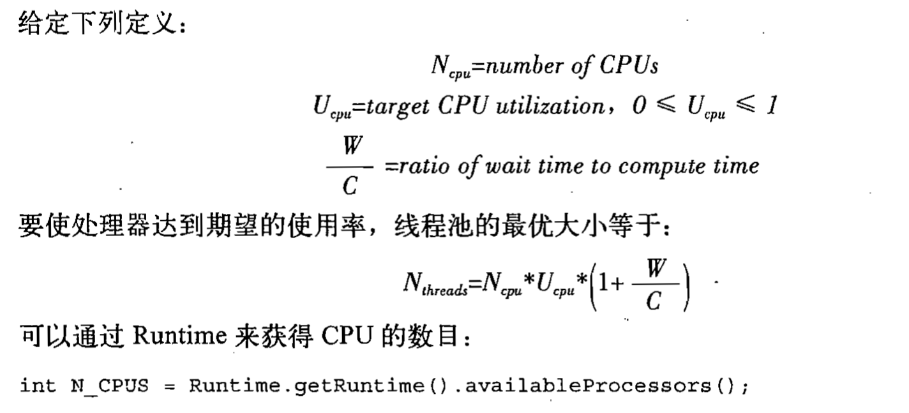


当然，当任务需要某种被资源池管理的资源时，例如数据库连接池，任务的执行也会受到数据库连接池里面的链接数目的影响。当然，如果当前线程池是数据库连接池的唯一使用者时，线程池也成为了数据库连接池的利用率的限制


配置ThreadPoolExecutor

ThreadPoolExecutor是一个灵活的稳定的线程池，允许进行各种定制，例如：Executors里面的一些内部类都是定制的ThreadPoolExecutor

如果这些定制化的ThreadPoolExecutor不满足需求，可自定义配置一个执行策略

全参构造函数如下：

```java
public ThreadPoolExecutor(int corePoolSize,
                          int maximumPoolSize,
                          long keepAliveTime,
                          TimeUnit unit,
                          BlockingQueue<Runnable> workQueue,
                          ThreadFactory threadFactory,
                          RejectedExecutionHandler handler)
```

最后两个参数有默认实现，也可以自己定制。


参数的详细解读：

corePoolSize，maximumPoolSize，以及keepAliveTime和unit都负责线程的创建和销毁

corePoolSize：线程池的基本大小，在没有任务执行时线程池的大小，并且只有在线程池满了的情况下才会继续创建线程数量。

maxiMumPoolSize：线程池能同时活动的最大数量，当任务队列满了的时候，会创建线程，但总的线程数的上限便是maximumPoolSize

keepAliveTime和unit：如果某个线程的空闲时间超过了限定的存活时间，并且此时线程池的大小大于corePoolSize，那么该线程将会被回收


特定的Pool的设定：

newFixedThreadPool：将基本大小和最大大小设置成相同的值，额外创建的线程数不会超时（额外创建线程数永远为0，超时也无所谓）

````java
public static ExecutorService newFixedThreadPool(int nThreads) {
  return new ThreadPoolExecutor(nThreads, nThreads,
                                0L, TimeUnit.MILLISECONDS,
                                new LinkedBlockingQueue<Runnable>());
}
````


newCachedThreadPool：基本大小为0，最大大小为最大整数，线程的超时时间设置为60s。可以收缩（没任务的时候占有线程为0）

```java
public static ExecutorService newCachedThreadPool() {
  return new ThreadPoolExecutor(0, Integer.MAX_VALUE,
                                60L, TimeUnit.SECONDS,
                                new SynchronousQueue<Runnable>());
}
```


newSingleThreadExecutor：就是newFixedThreadPool的线程数为1的特例

```java
public static ExecutorService newSingleThreadExecutor() {
  return new FinalizableDelegatedExecutorService
    (new ThreadPoolExecutor(1, 1,
                            0L, TimeUnit.MILLISECONDS,
                            new LinkedBlockingQueue<Runnable>()));
}
```


在高负载的情况下还是有可能存在资源耗尽的情况（只不过几率比不使用线程池的低得多），因为请求的速率远远大于线程池处理任务的速度，就会有大量的请求堆积，并导致任务队列无限制增长（如果该队列可扩张的话，无界队列），并且随着请求的存储，线程池的处理速度会越来越慢


可以给ThreadPoolExecutor传递一个BlockingQueue。基本的任务排队方法有：无界队列，有界队列和同步移交

newFixedThreadPool和newSingleThreadExecutor默认情况下使用的是无界的LinkedBlockingQueue


一种稳妥的方式是使用有界队列，如ArrayBlockingQueue，有界的LinkedBlockingQueue，PriorityBlockingQueue。使用有界队列时候要考虑到队列满之后，并且线程池也到达了最大值，则需要指定饱和策略来解决这些问题


还有一种队列是newCachedThreadPool里面使用的SynchronousQueue，这个队列通常使用在非常大的或者无界的线程池中，前面所说的队列实际上不准确，因为SynchronousQueue不是一个真正的队列，而是一种在线程之间移交对象的机制，必须有一个线程来接收这个在发送的对象（所以要求任何时候都必须有新的空闲线程），否则根据饱和策略处理这个任务（或者丢弃或者重新发送）。

**只有当线程池是无界的或者是可以拒绝任务时，SynchronousQueue才有实际意义**


队列里的ArrayBlockingQueue和LinkedBlockingQueue都是FIFO的，SynchronousQueue是无序的，如果需要使用有序队列，则可以使用PriorityBlockingQueue，任务的排序顺序是通过自然顺序或者是任务实现Comparable来定义的


只有独立的任务排队才是有意义的，如果任务之前相互依赖，很容易产生死锁，建议非独立的任务使用newCachedThreadPool线程池来运行，保证不会导致饥饿死锁


饱和策略：对提交到已经关闭的Executor或者是已经满了的Executor，则会用到饱和策略RejectedExecutionHandler，JDK提供的默认饱和策略有：

- AbortPolicy

默认的饱和策略，会抛出一个RejectedExecutionException异常（从submit或者是excute方法里面抛出）

- CallerRunsPolicy

调用者运行：实现了一种协调机制，如果此时线程池已满，那么任务就会返还给提交该任务的线程，让该线程自己去执行，无论是以execute还是以submit来提交任务

- DiscardPolicy

会悄悄丢弃该任务

- DiscardOldestPolicy

抛弃即将执行的（如果是FIFO队列则是最开始提交的）任务


使用信号量来阻塞

```java
/**
 * @author Lexiang(LuckyCurve)
 * @date 2020/4/11 15:01
 * @Desc 封装当前线程池为阻塞线程池
 */
@ThreadSafe
public class BoundedExecutor {
    private final ExecutorService executor;
    private final Semaphore semaphore;


    public BoundedExecutor(ExecutorService executor, Semaphore semaphore) {
        this.executor = executor;
        this.semaphore = semaphore;
    }


    public void run(final Runnable runnable) throws InterruptedException {
        semaphore.acquire();
        try {
            executor.submit(runnable);
            semaphore.release();
        } catch (RejectedExecutionException e) {
            semaphore.release();
        }
    }

    public static void main(String[] args) throws InterruptedException {
        BoundedExecutor executor = new BoundedExecutor(Executors.newSingleThreadExecutor(), new Semaphore(1));
        for (int i = 0; i < 10; i++) {
            executor.run(() -> {
                try {
                    TimeUnit.SECONDS.sleep(1);
                } catch (InterruptedException e) {
                    e.printStackTrace();
                }
                System.out.println("hello world");
            });
        }
    }
}

```

通过使用同步工具类的方式使得每次只能提交一个


线程工厂

Executor默认的线程工厂会创建一个新的，没有任何设置项的线程，我们可以在Executor的构造函数里指定自定义的ThreadFactory，实现里面的newThread方法

简单的一个Demo（其实在前面的未捕获异常处理里面就使用过了）

```java
package cn.luckycurve.threadsecurity;

import java.util.concurrent.ThreadFactory;

/**
 * @author Lexiang(LuckyCurve)
 * @date 2020/4/11 15:18
 * @Desc 自定义线程工厂，让每个线程的名字都与poolName相同
 */

public class MyThreadFactory implements ThreadFactory {
    private final String poolName;

    public MyThreadFactory(String poolName) {
        this.poolName = poolName;
    }

    @Override
    public Thread newThread(Runnable r) {
        return new Thread(r, poolName);
    }

}

```

如果程序实行了严格的安全管理，那么则要通过Executor的privilegeThreadFactory工厂来定制自己的线程工厂。通过这种方式创建的Thread所具有的权限继承于创建这个Thread的线程的权限，实现了权限的对接


在构造函数之后再定制ThreadPoolExecutor

在使用构造函数创建了一个ThreadPoolExecutor对象后，仍然可以使用set方法来改变属性里面的数值，使用Executors的静态工厂方法new出来的对象（除了newSingleThreadExecutor外）都可以改变属性【其实从方法名里面就可以看出，其他的方法都是以ThreadPool结尾，维度Single以Executor结尾】

> 不能修改的原因：
>
> ​	定义了一个静态内部类，并将ThreadPoolExecutor转换成了这个类，这个类的继承图如下：
>
> 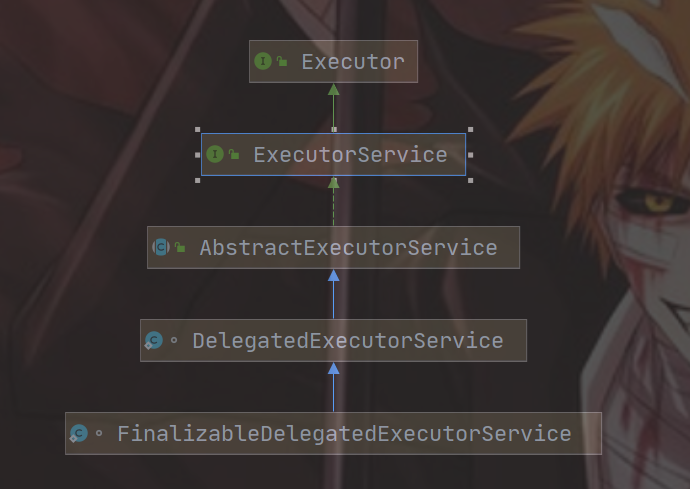
>
> ```java
> static class FinalizableDelegatedExecutorService
>     extends DelegatedExecutorService {
>     FinalizableDelegatedExecutorService(ExecutorService executor) {
>         super(executor);
>     } 
> ```
>
> 这个类只是继承自ExecutorService，里面没有set犯法，set方法是ThreadPoolExecutor里面的，如果我们也想要定义一个不能被更改的定制化的ThreadPoolExecutor，可以参考这个类


扩展ThreadPoolExecutor

ThreadPoolExecutor具有良好的扩展性，主要的扩展方法为：

```java
protected void beforeExecute(Thread t, Runnable r) { }  
//在任务开始执行前将调用
protected void afterExecute(Runnable r, Throwable t) { }
//在任务执行后调用
protected void terminated() { }
//线程池关闭时候调用
```


都会自动调用，默认的方法体即为空，需要自己写业务代码。

> 注意事项：
>
> 1. 如果beforeExecute方法抛出了RuntimeException异常，那么任务不会执行，并且afterExecute方法也不会被调用
> 2. 如果任务抛出了一个Exception，afterExecute方法依旧会执行
> 3. 如果任务抛出了一个Error，afterExecute无法执行


有点AOP那个味道了


> :warning:：如果在你的自定义ThreadPoolExecutor类中使用了别的Executor，需要关闭，千万不要重写自定义ThreadPoolExecutor的shutdown方法，要在terminated方法里面添加关闭内部Executor的语句，理由如下：
>
> - ThreadPoolExecutor只留了三个方法给你去扩展，其他的不要动（应该是类库设计人员的意愿）
>
> - shutdown是非阻塞的，会直接强制关闭，而terminated是阻塞的，会等待任务执行(自己理解，可能有问题)


实例：使用日志框架记录计算结果：

```java
/**
 * @author Lexiang(LuckyCurve)
 * @date 2020/4/11 16:53
 * @Desc 通过自定义Executor来记录运行时间
 */
public class TimingThreadPool extends ThreadPoolExecutor {

    private final ThreadLocal<Long> startTime = new ThreadLocal<>();
    private final LoggerInfoAno logger = new LoggerInfoAno(new File("E:/springboot.log"));
    //总时间
    private final AtomicLong totalTime = new AtomicLong();
    private final AtomicLong numTime = new AtomicLong();

    public TimingThreadPool(int corePoolSize, int maximumPoolSize, long keepAliveTime, TimeUnit unit, BlockingQueue<Runnable> workQueue) throws FileNotFoundException {
        super(corePoolSize, maximumPoolSize, keepAliveTime, unit, workQueue);
    }

    @Override
    protected void beforeExecute(Thread t, Runnable r) {
        System.out.println("before");
        super.beforeExecute(t, r);
        startTime.set(System.nanoTime());
        logger.log(String.format("Thread %s: start %s", t, r));
    }

    @Override
    protected void afterExecute(Runnable r, Throwable t) {
        System.out.println("after");
        try {
            long endTime = System.nanoTime();
            long tastTime = endTime - startTime.get();
            numTime.incrementAndGet();
            totalTime.addAndGet(tastTime);
            logger.log(String.format("Thread %s: end %s", t, r));
        } finally {
            super.afterExecute(r, t);
        }
    }

    @Override
    protected void terminated() {
        System.out.println("terminated");
        try {
            logger.log(String.format("Terminated: avg time=%dns", (totalTime.get() / numTime.get())));
            logger.stop();
        } finally {
            super.terminated();
        }
    }

    public static void main(String[] args) throws FileNotFoundException {
        TimingThreadPool pool = new TimingThreadPool(1, 1, 1, TimeUnit.SECONDS, new LinkedBlockingDeque<>());
        for (int i = 0; i < 10; i++) {
            pool.execute(() -> {
                try {
                    TimeUnit.SECONDS.sleep(1);
                } catch (InterruptedException e) {
                    e.printStackTrace();
                }
            });
        }

        pool.shutdown();
    }
}
```


<hr>

递归算法的并行化

如果所有迭代操作都是独立的，并且不需要等待迭代操作都完成后再继续执行，那么就可以使用Executor框架将串行循环转化成并行循环，如下：

```java
void process(List<Element> element) {
  for (Element e : element) {
    process(e);
  }
}

//并行化
void processInParallel (Executor execute,List<Element> element) {
  for (final Element e : element) {
    executor,execute(()->{
      process(e);
    });
  }
}
```

当串行循环中的各个操作之间彼此独立，并且每个操作的工作量比管理一个新任务时带来的开销更多，那么这个串行循环就适合并行化


在递归设计中也时长采用这种做法，前提是：每个迭代操作都不需要后续递归迭代的结果，例如：用递归遍历一棵树，并且统计总的值（举的例子不是很恰当，因为此时的工作量不是很大，如果遍历数）


使用事例如一些解谜框架，例如推箱子等等，每个线程都去尝试一种做法，如果有唯一解得话找到了一个就可以直接返回，并强制停止整个框架（自定义闭锁或者是使用JDK实现的CountDownLatch来实现所需的闭锁行为），否则筛选整个解空间

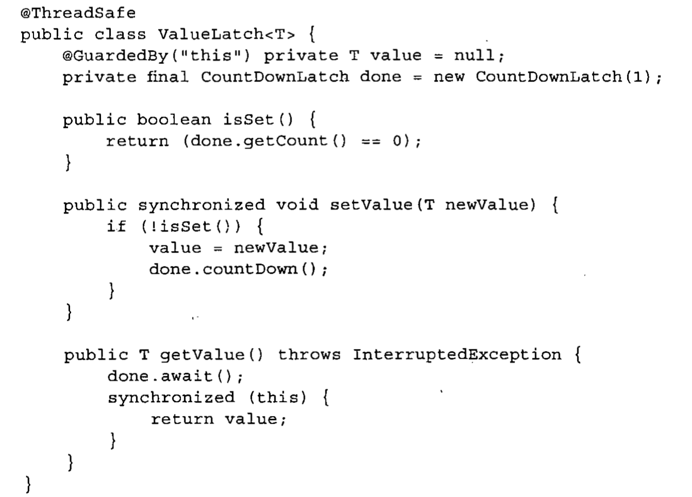

主线程启动线程，然后就调用getValue方法，会一直处于阻塞状态，启动的线程会开启运算，直到查询到一个解，CountDownLatch置0，getValue取消阻塞，运行下一条关闭线程池的语句（记得设定线程池的饱和策略为直接丢弃，可能还有任务一直等待执行，任务已经完成了）（如果还在运行的任务的运行时间过长，那么可能中断他们而不是等他们完成）


当前程序有一个BUG，如果任务无解，那么主线程会永远的阻塞在getValue方法上无法继续执行。

解决思路：记录活动任务的数量，如果为零的话将解答设置成null

或者让用户传入一个超时时间给getValue的参数上去


小结：

Executor是一个灵活且强大的框架，提供了大量可调节的选项，如创建线程关闭线程的策略（before/after Execute），处理队列任务的策略（FIFO，SynchronousQueue，PriorityBlockingQueue），处理过多任务的策略（四种），提供了钩子方法


## 第九章、图形用户界面应用程序


很多平台的GUI程序都是单线程的

很多人都曾经尝试过使用多线程编程，但是又由于竞态条件和死锁导致的稳定性问题而又回到了单线程的事务队列模型中，基于AWT对多线程编程的尝试，Swing在实现时候决定使用单线程模型


已经过时的技术，略过了，以后有兴趣可以回来看看，毕竟每个技术都有辉煌的时候


# 第三部分、活跃性，性能和测试


## 第十章、避免活跃性危险


在安全性与活跃性之间存在某种制衡


如果过度的偏向安全性：

- 过度地使用加锁——可能导致顺序死锁
- 过度使用线程池和信号量对资源的限制——资源死锁


死锁是活跃性最低的表现

对死锁的生动描述：每个人都拥有其他人需要的资源，同时又等待其他人已经拥有的资源，并且每个人在获取需要的资源前不会放弃已经拥有的资源


数据库系统设计的时候就考虑到了检测死锁以及从死锁中恢复，由于每执行一个事务都要获取多个锁，并在事务执行完成之前不会释放这些锁（合情合理的设计），因此两个事务可能会发生死锁，实际上并不常见。当系统检测到了一组事务处于死锁时候，会选择一个牺牲品，释放现有的资源。


但JVM不会像数据库系统那样有强大的解决死锁的方法


一个类往往只是有可能发生死锁，并不意味着每次一定都发生死锁。但发生死锁往往是在最糟糕的条件下——高负载条件下


锁的几种常见形式：

1.锁顺序死锁

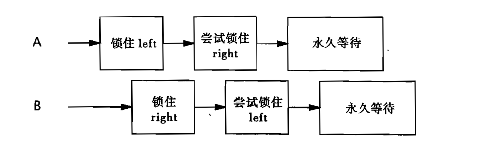

> 如果所有线程都以固定的顺序来获取锁，那么在程序中就不会出现锁**顺序死锁**的问题


2.动态的锁顺序死锁


转账模型，锁住两个账户，判断转出账户金额是否充足，开始转账。

BUG：

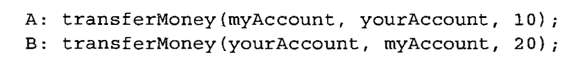

如果这样调用的话，依旧有可能会产生死锁，看似规定了锁的先后顺序，实则完全没有。


> 可以通过比较给定对象的hash码来决定锁的顺序
>
> 使用`System.identityHashCode()`方法获取的hashCode与对象的hashCode获取的hashCode相同，但是如果对象为null，则返回0（如果是对象的hashCode方法则会直接报错）
>
> ```java
> int fromHash = System.identityHashCode(fromAccount);
> int toHash = System.identityHashCode(toAccount);
> 
> if (fromHash<toHash) {
>   synchronized(fromHash) {
>     synchronized(toHash){
>       //fun()
>     }
>   }
> } else if (toHash<fromHash) {
>   synchronized(toHash) {
>     synchronized(fromHash) {
>       //fun()
>     }
>   }
> } else {
>   //如果没覆盖HashCode，则两个对象一模一样，依旧会产生死锁，这时候最好的办法就是在类中创建一个Object类型的普通对象lock
>   synchronized(lock) {		//这时候锁的顺序就无所谓了
>     synchronized(fromLock) {		//随便锁哪一个
>       //fun()
>     }
>   }
> }
> ```
>
> 注意HashCode相等的时候不要直接锁this，如果该类中有其他的方法也使用this锁，会很影响活跃性（尽量锁小范围的）
>
> 如果在Account类中存在一个唯一的，不可变的，具备可比性的键值（通常为id）可以直接用id的比较来替代对hashCode的比较


3.在协同对象之间发生的死锁

很多方法都是直接锁当前对象，这就导致了内部的一些问题：

例如实际模型中：类A包含了类B的实例化对象

在数据建模中，类A需要有一个List记录包含着的B，类B需要一个字段指向他被包含的对象。

如果此时AB的方法都是锁this，那么在操作类A的时候，可能出现要先获取类A的实例化对象的锁，然后调用了类B的方法要获取类B的实例化对象的锁，在操作类B的时候，获取锁的顺序正好相反，直接爆炸


> 如果在持有锁的情况下调用了某个外部方法（特别是当该外部方法还是加锁的），那么要特别注意死锁

> 在持有锁时候调用外部方法，很容易出现活跃性问题，要么是当前线程被长时间阻塞，锁无法被释放，亦或者是直接形成循环死锁


于是提出了开放调用的概念


当调用某个方法时不需要持有锁，那么这种调用被称为开放调用（Open Call）

这种通过开放调用来避免死锁的方法，类似于采用封装机制来提供线程安全的方法。

对采用了封装的程序进行安全分析，比没采用封装的程序进行安全分析容易得多

同样的，分析一个完全依赖于开放性调用的程序的活跃性，比分析哪些不依赖于开放性调用的程序的活跃性简单

尽可能的使用开放调用，更容易找出获取锁的路径，更容易保证采用一致的顺序来获取锁


> 自己理解：说白了就是尽量缩小锁的范围，不要锁方法（锁住了方法该方法就不开放了）


有时候，使用同步代码块来取代同步方法以使用开放调用会产生意想不到的结果，因为这会使得某个操作由原子操作变为非原子操作，让原子操作变成非原子操作在许多情况下是可以接受的（这也正是开放调用的核心，尽量将对多个锁的获取不处于同一原子操作内）

然而，某些情况下丢失原子性是非常恐怖的，但也可以构造一些其他的协议来防止线程进入代码的临界区（而不是通过锁）


资源死锁

常见形式：例如A，B需要数据库连接池D<sub>1</sub>和D<sub>2</sub>的链接，每个人都持有一个资源，等待别人释放另外一个

另一种基于资源的死锁形式就是线程饥饿死锁：

例如前面提到的使用栅栏的一种实现方式CountDownLatch来实现线程的等待，如果需要等待5个线程同时执行完成，向大小为4的线程池中提交5个任务，那么也会形成死锁


锁的避免与诊断

尽量使用细粒度锁，在使用时候遵循如下建议：

- 找出在什么地方将获取多个锁
- 并在这些地方进行锁的获取顺序的分析


通过支持定时的锁：

也可以使用Lock类的tryLock来实现定时锁的功能，取代内置锁，可以在发生意外情况的时候让线程重新获得控制权而不是一直阻塞


通过线程存储信息来分析死锁：

JVM提供线程存储（Thread Dump）来帮助识别死锁的发生

线程存储包括个线程中的栈追踪信息，加锁信息等待。可以找出死锁发生的位置以及涉及到的线程


死锁是最常见的活跃性危险

其他活跃性危险：

- 饥饿

当线程由于无法访问到他需要的资源而不能继续执行时，称为饥饿

引发饥饿的最常见资源就是CPU时钟周期

在Java中对线程的优先级安排不当，或者占有资源的线程无法结束（无限循环等等）都可能导致饥饿

尽量不要改变线程的优先级，虽然Java提供了Thread API去修改优先级，并将优先级分为十等，与操作系统的线程优先级相映射（可能不是一对一的，每个操作系统都不一样），只是将优先级的操作交给了操作系统，依赖了平台，而Java设计的初衷就是使用JVM来摆脱平台的约束，并且改变线程优先级通常不会起到任何的作用，还可能导致某个线程的调度优先级高于其他线程，导致饥饿。

通过对JVM的语句分析会发现在一些奇怪的地方调用了Thread.sleep或Thread.yield，这是因为该程序视图克服优先级调用问题或响应性问题，试图给低优先级的任务分配一点时间

> 在大多数并发应用程序中，都可以使用默认的线程优先级

- 丢失信号——后面介绍
- 活锁

该问题不会阻塞线程，但也不能继续执行，因为该线程总是在一直处理相同的操作，并且一直失败，通常发生在事务处理上

当一个事务处理失败后，事务会立马回滚，该任务又会被重新置于任务队列的开头，继续执行仍然错误，虽然线程没阻塞，但仍然会有类似阻塞的状态（通常是由于错误的恢复代码导致的）


小结：

活跃性故障是一个非常严重的问题

最常见的活跃性故障就是锁顺序死锁，解决办法就是大力使用开放调用


## 第十一章、性能与可分析性


线程最主要的目的就是提高资源的利用率，其次，线程可以立即开始一个事务的执行，从而提高了系统的响应性


本章将介绍方法来提高性能，但在提高性能的同时，也会提高编码的复杂性和增加了安全性与活跃性发生失败的风险

要将系统的安全性放在第一位，这样一个程序才能运行

在并发编程的应用程序中，最重要的考虑因素通常不是将程序的性能发挥到极致


对性能的思考：

性能的提升意味着使用相同的资源做更多的事情

资源：例如，CPU时钟周期，内存，网络带宽，IO带宽，数据库请求，磁盘空间以及其他资源

当操作性能受到某种资源的限制时，通常称该操作为资源密集型操作，例如：CPU密集型，数据库密集型等等

与单线程相比，使用并发技术往往会有多余的性能开销，如线程之间的协调（锁，内存同步，信号量），增加的上下文切换，线程的创建与销毁，线程的调度等等，如果过度的使用性能，那么开销的性能很有可能大于吞吐量，响应性，计算能力提升的性能

摘自《Java并发编程实战》


想要提高性能，需要做两件事：

- 尽量利用现有资源（如果是计算密集型的，充分利用现有的CPU）
- 利用新增加的资源（增加新的CPU也需要利用到）


主要从两个方面来衡量性能：

- 多快：程序的运行速度：服务时间，等待时间
- 多少：程序的处理能力：生产量，吞吐量


可伸缩性是指：在增加计算资源时，程序的吞吐量或处理能力能够相应的增加


并发情况下的提升性能的目的是提升程序的吞吐量（与单线程程序提升性能提升运行速度有所不同）


性能的两个方面——多快和多好通常是非常矛盾的（即使是使用并发编程也解决不了其中的矛盾）

我们熟悉的三层模型（表现层，业务层，持久层，都是相互独立）就是通过将任务分解为多个流水线子任务来增大吞吐量的，这肯定降低了处理速度，因为对象在各个层中传递中会带来额外的开销。

如果我们使用单一的并发系统达到自身的处理极限时，再提高他就会非常的困难，因此我们通常会选择妥协任务的执行时间来增加任务的并发量，以换取在获取更多性能的情况下具有更高的负载


>  并发线程通常更注意任务的并发量性能而不是单线程的任务的执行速率


避免不成熟的优化，首先使程序正确，然后再提高运行速度


当进行决策时，有时候会通过某种形式的成本来降低另一种形式的开销，也会通过开销来换取安全性


在使得某个方案比其他方案更快之前，首先应该问自己这样一些问题：

- 更快的含义是什么
- 在什么条件下会更快
- 这些条件在运行环境中发生的评率，能否通过测试结果来验证你的答案
- 在不同的条件下能否使用这些代码
- 隐含的代价，例如：增加了开发风险和维护开销


>  对性能的提升可能是并发错误的最大来源
>
> 由于并发错误是最难追踪的和消除的错误，不要轻易的使用一些看似聪明的方法来减少同步的使用


更糟糕的是，性能调优一般都会牺牲一部分的安全性，但最终可能什么都得不到（如果你处理不好的话），另外，开发人员的直觉调优也是非常危险的举动。

在对性能调优后，需要再次测量性能是否提升了你想象中的那么多，并且通过实际获取的性能和放弃的安全性和稳定性之间做权衡


> 以测试为基准，不要猜测


有很多的分析工具，例如可以通过免费的perfbar来给出CPU的忙碌状态信息，我们使用并发编程通常就是要使得CPU一直保持忙碌状态，使用该软件即可验证。


amdahl定律

以农业耕作为例子：有些任务是可用资源越多，就可以执行的越快，例如农作物的收割，但是有些任务本质上是串行的，即使增加了再多的资源也无济于事，例如增加再多工人也不会加快农作物的生长

大多数并发程序与农业耕作有很多相似之处，例如：都是由一系列的串行工作和并行工作完成的

amdahl定律表述的是，在增加计算资源的情况下程序理论上实现的最高的加速比

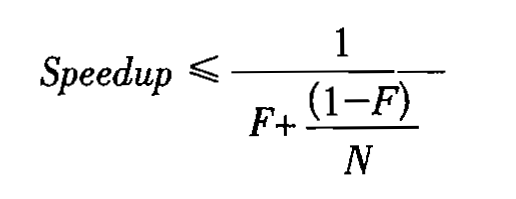

> F：必须被串行执行的部分
>
> N：CPU同时运行的线程数


很好理解，串行的时间无法简化，并行的任务时间可以理解成为原来任务的时间除以N

可以看到，当N无限大的时候，最高的加速比也不过是1/F


当串行占比不同的情况下随着资源数的增多利用率的变化曲线

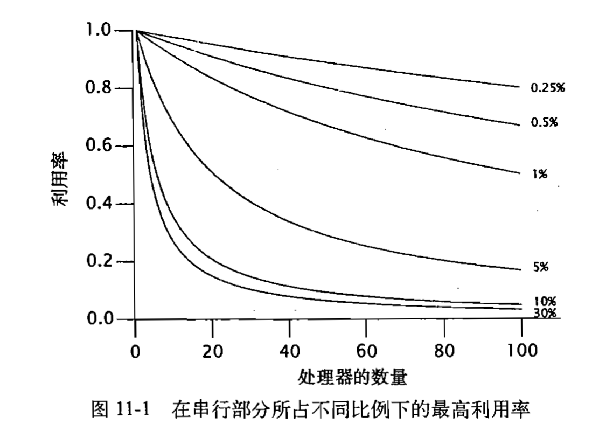


在所有的并发程序中都包含一部分串行部分

常见的隐藏的串行部分：

- 任务的获取（特别是从工作队列中，需要维持串行）
- 结果的处理，例如日志的写入，也要串行操作


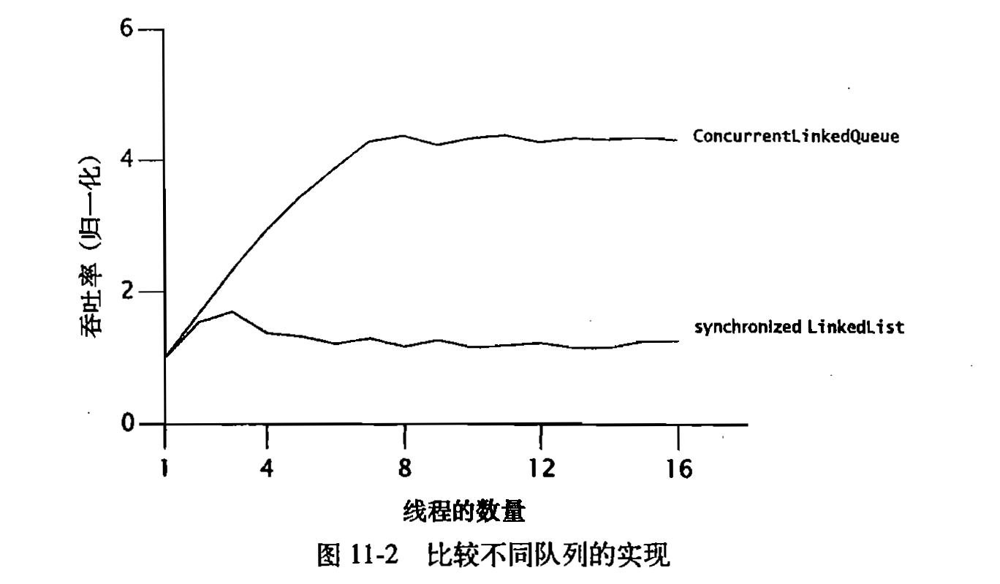

选用更高效的队列，就可以对程序的伸缩性产生明显的影响

这种吞吐量的差异来源于两个队列中不同比例的串行部分

SynchronizedLinkedList直接全部锁死，全部的执行操作都是并行的，而ConcurrentLinkedQueue采用了一种非阻塞队列算法实现了程序的高效性


虽然测量串行部分的比例非常困难，但即使在不就行测试的情况下amdahl定律也是非常有用的


接下来讨论线程的开销


并发带来的性能提升必须超过并发导致的开销（线程开销，安全性和稳定性的开销，编码和维护的开销）


频繁的上下文切换将造成大量的开销：

- CPU时钟周期的开销

应用程序，操作系统，JVM共享一个CPU，当发生上下文切换时候，操作系统和JVM会消费一定的CPU时钟周期来完成切换

- 缓存的丢失

CPU的内部缓存就那么大，每个线程在运行时候都会存储一些数据进来，必然会导致以前缓存的数据的丢失。这也是为什么调度器会为每个线程都分配一个最小执行时间，目的就是防止缓存被频繁的刷新


内存同步的性能开销

使用synchronized和volatile会使用一些特殊的指令来达到内存同步的目的，保证可见性。这种操作指令即为：内存栅栏（memory barrier）。内存栅栏可以刷新缓存，使得缓存无效，刷新硬件的写缓冲，以及停止执行通道，内存栅栏还会抑制编译器的优化操作。在内存栅栏中，大部分操作是不允许重排的


在评估内存同步的性能开销时，区分有竞争和无竞争是有必要的：

synchronized对无竞争的同步就行了优化，虽然此时的额外开销仍不为零，但对整体的性能影响微乎其微（另外，JVM也会优化一些不会发生竞争的锁）


另外，更完备的JVM还会通过对对象的逸出分析来判断该对象是否是采用了线程封闭技术，如果没有逸出，则会直接取消对这个对象的所有锁操作


编译器还有可能进行锁粗化操作，例如以下语句：

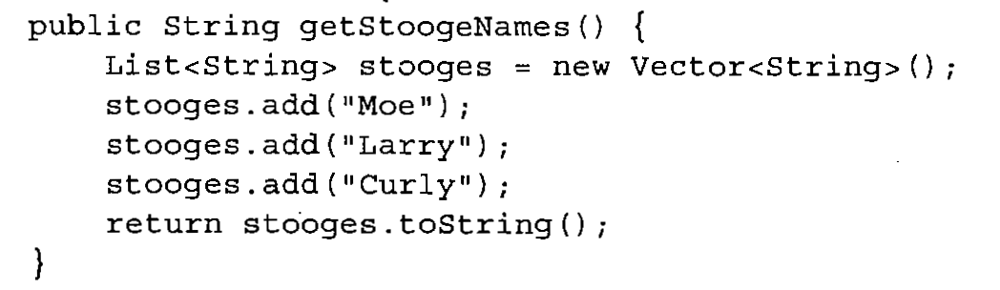

每次对stooges的操作都要重新获取一次锁，存在多余的开销，JVM可能会将三条add语句和一条return语句一起合并成单个锁的获取/释放操作


> 不要去担心非竞争同步所带来的的开销，JDK和JVM已经优化的非常快了
>
> 我们更应该关注的是发生竞争的地方


最后，线程之间也可能相互影响，当线程需要同步时候，会通过内存总线来传递数据流，如果有过多的线程在竞争同步带宽，也会受到影响


阻塞

当线程竞争锁失败时候，就会发生阻塞

JVM在实现对线程的阻塞时候，有两种方式：

- 自旋等待（不断尝试获取锁，直到成功）
- 通知操作系统挂起需要阻塞的线程

性能高低取决于实际的情况，等待时间短的任务，通过第一种方式很容易实现高效，等待时间长的任务，在第二种方式上更高效

有些JVM会通过历史记录对上一个任务进行分析来决定采用哪种方式

但大多数JVM都只是将线程挂起


如何减少锁的竞争

在并发编程中，对可伸缩性的主要威胁就是独占式的资源锁

根据amdahl定律，锁激烈，串行执行频率增大，最大可伸缩性降低

降低锁的竞争可以提高性能（主要是并发量而不是单个任务的执行速率）和可伸缩性


影响锁发生竞争的可能性：锁的请求评率和持有锁的时间


降低锁的竞争程度的三种操作：

- 减少锁的持有时间
- 降低锁的请求评率
- 使用带有协议机制的独占锁


减少持有锁的时间最好的方式就是减少锁的范围

尽量将与锁无关的操作移出同步代码块，尤其是开销大，耗时长，可能被阻塞的操作，典型的如IO操作

但也不要太过执着将同步代码块拆分成多个同步代码块，（有可能JVM在后期又执行了锁粗化的操作），因为获取锁和释放锁也需要消耗资源，除非可以将一些耗时长的操作移除，才应该使用


降低锁的请求频率最好的方式就是减小锁的粒度

采用相互独立的几个锁来取代整个锁的技术称为锁分解，通常分解锁使用的越多，就更容易出现死锁

可以细化锁，让每个锁分别处理外部锁的各种条件，从而降低了锁的请求频率

> 更标准的说法是：如果一个锁需要保护多个相互独立的状态变量，那么可以将这个锁分解成多个（不同的）锁

优化例子：

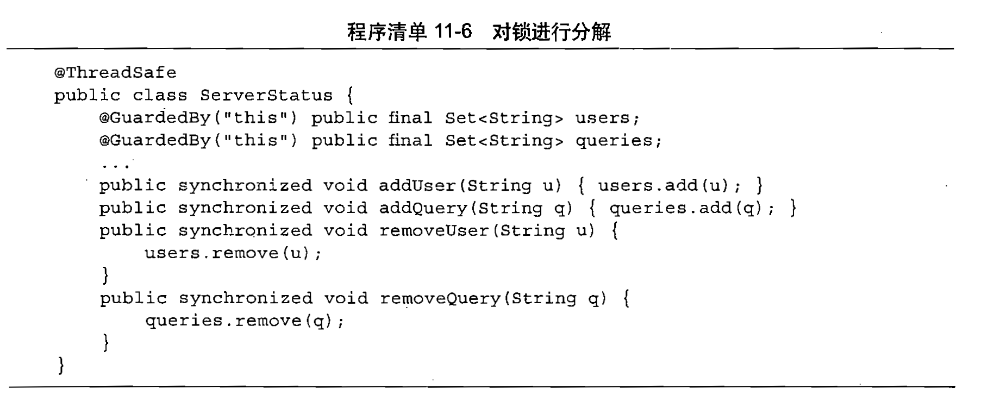

全部锁的是this，锁的竞争激烈，建议各个方法根据需求使用users或者queries作为锁，减少锁的请求频率

通过锁分解技术可以提高性能和吞吐量


分段锁

在某些情况下，可以将锁分解技术进一步拓展为对一组独立对象上的锁进行分解，这种情况被称为锁分段。例如ConcurrentHashMap就使用了这个策略，使用了一个包含16个锁的数组，每个锁保护所有散列桶的1/16，其中第N个散列桶由 N mod 16 的锁来守护，使得ConcurrentHashMap的并发量最大提高到了原来的十六倍

锁分段的最大劣势在于：获取相同的资源操作空间，需要获取更多的锁，会产生更大的开销，例如对Hash值的重新计算以及重排时，就要操作整个Map，需要获取所有的锁。


简单实现一个分段锁

```java
/**
 * @author Lexiang(LuckyCurve)
 * @date 2020/4/13 15:49
 * @Desc 模拟锁分段技术
 */
@ThreadSafe
public class StripedMap {
    //分段锁的数量
    private static final Integer N_LOCKS = 16;
    private final Node[] buckets;
    private final Object[] locks;

    public StripedMap(Integer numBuckets) {
        buckets = new Node[numBuckets];
        locks = new Object[N_LOCKS];
    }

    //通过Key的Hash值找出该Key对应于buckets的下标
    private Integer hash(Object key) {
        return Math.abs(key.hashCode() % buckets.length);
    }

    //读，不用锁，默认使用fianl保持了可见性
    public Object get(Object key) {
        int hash = hash(key)
        synchronized (locks[hash % N_LOCKS]) {
            //一系列读取操作
        }
        return null;
    }

    public void clear() {
        for (int i = 0; i < buckets.length; i++) {
            synchronized (locks[i % N_LOCKS]) {
                buckets[i] = null;
            }
        }
    }


    class Node<K, V> {
    }
}

```


如果要采用分段锁，**一定要表现出在锁上的竞争频率高于在锁保护的数据上的竞争频率**


避免热点域

当每个操作都需要请求多个变量时，锁的粒度很难降低了

常见的优化方式便是将计算结果缓存成“热点域”，但是热点域通常会限制可伸缩性

最常见的热点域便是我们设置的标志量

例如，统计Map的大小，我们通常会设置一个size，默认初值为0，put加一，remove减一。这样在单线程和完全同步的实现中既能降低空间占用率，也能实现快速获取size的目的

但是在多线程环境下，这个是不可取的，会严重影响可伸缩性，所有的put和remove操作都必须回到size标志量这里来进行同步，虽然执行++--的操作有可能只有1微秒，但是如果有同时一万个任务排队，光是这一个地方就需要浪费一秒钟，太影响系统的伸缩性了


ConcurrentHashMap给每个分段都单独生成一个size，占用的内存基本忽略不计，提升的性能理想情况下却是16倍


第三种降低竞争锁的方法就是放弃使用占用锁，而使用一些友好的并发方式来进行共享，例如：使用并发容器，读写锁，不可变对象以及原子变量等等

- 读写锁（ReadWriteLock）：实现了多个读取操作以及单个写入操作下的规则。
- 原子变量：提供了一些方法来降低更新“热点域”时候的开销，原子变量提供的是在基本数据类型或者对象上更细粒度的加锁操作，因此拥有更高的可伸缩性


通过监测CPU的利用率来进一步找出程序的并发性

如果CPU没有得到充分的利用（有些CPU处于忙碌，有些处于空闲），通常有以下的原因：

- 负载不充足：可能你客户端系统发出的负载没能使得服务器达到全速运行的状态
- IO密集：监测被测试机的磁盘写入和网络IO带宽是否充足
- 外部性能：如果依赖于数据库，可能是数据库的处理能力不足
- 激烈的锁竞争


对 对象池 说不

Java对象分配发展到如今已经非常的快，甚至比C语言的malloc都快

在并发线程（甚至是平常开发中）不要使用对象池去进行性能优化，虽然会降低垃圾回收线程的开销，但是很容易导致线程阻塞和应用的可伸缩问题，**对象池有其特定的用途，但对于优化性能来说，是非常有局限的。**


> 通常，对象分配操作的开销比同步的开销更低


实例：对Map的性能分析

单线程条件下，ConcurrentHashMap比HashMap略好，而并发条件下则会好得多

在同步Map的实现中，所有操作都使用的是同一把锁，而ConcurrentHashMap基本上不加锁，而在写入和其他必须要锁的操作下都使用的是分段锁

具体的伸缩性表现：

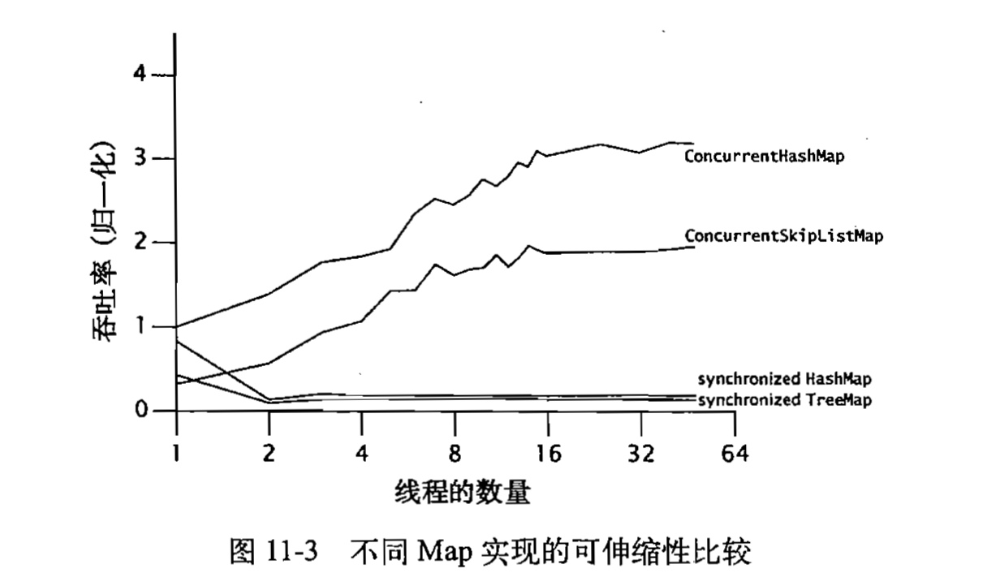


当线程在阻塞和运行这两种状态之间切换时候，就相当于发生了一次上下文切换

发生阻塞的原因之一就是要进行日志录入，一般的日志框架都是对println进行简单的包装，而我们前面写的日志框架就是创建一个独立的线程去完成。在性能上的优劣取决于日志操作的工作量以及上下文切换的开销

尽量避免在获取锁的同步代码块中使用IO等费时的操作，很有可能导致大量线程去竞争锁，导致大量的上下文切换，极大的降低了吞吐量

可以单独列出一个线程池来专门处理IO操作，在同步代码块中只需要发送请求即可，由专门的线程池去后台完成


小结：

在并发程序中讨论性能更关注的是吞吐量和可伸缩性上面，而不是服务时间

由Amdahl定律，我们知道决定可伸缩性的重要条件就是代码中必须串行执行的代码比例，我们通常通过以下几个方式来提升可伸缩性：减少锁的持有时间，降低锁的粒度，采用非独占的锁（分解锁，分段锁技术）或非阻塞（算法）的锁


## 第十二章、并发程序的测试


并发程序与串行程序最大的区别就在于存在一定的不确定性，这种不确定性可能会增加故障出现的数量，因此需要分析


测试并发程序的挑战在于：潜在错误的发生具有不确定性，因此需要测试更广的范围和消耗更多的时间


并发测试包含两方面：安全性测试和活跃性测试

安全性：不发生任何错误的行为

活跃性：某个良好的行为中就会发生


与活跃性相关的是性能测试，主要包括：

- 吞吐量
- 响应性
- 可伸缩性


例子：实现一个有界缓存队列并对其分析

```java
/**
 * @author Lexiang(LuckyCurve)
 * @date 2020/4/14 11:57
 * @Desc 使用Semaphore实现一个有界缓存并进行测试
 */
@ThreadSafe
public class BoundedBuffer<E> {
    //第一个代表占的元素个数，第二个表示空闲的元素个数
    private final Semaphore availableItems, availableSpaces;
    @GuardedBy("this")
    private final E[] items;
    @GuardedBy("this")
    private Integer putPosition = 0, takePosition = 0;

    public BoundedBuffer(int length) {
        availableItems = new Semaphore(0);
        availableSpaces = new Semaphore(length);
        items = (E[]) new Object[length];
    }

    public boolean isEmpty() {
        //感觉这样也行：return putPosition == 0;
        return availableItems.availablePermits() == 0;
    }

    public boolean isFull() {
        return availableSpaces.availablePermits() == 0;
    }

    public void put(E e) throws InterruptedException {
        availableSpaces.acquire();
        doInsert(e);
        availableItems.release();
    }

    //私有插入方法，太厉害了，值得学习
    private synchronized void doInsert(E e) {
        Integer i = putPosition;
        items[i] = e;
        putPosition = (++i == items.length) ? 0 : i;
    }

    public E take() throws InterruptedException {
        availableItems.acquire();
        E obj = doExtract();
        availableSpaces.release();
        return obj;
    }

    //私有的获取方法
    private synchronized E doExtract() {
        int i = takePosition;
        E obj = items[i];
        takePosition = ++i == items.length ? 0 : i;
        return obj;
    }
}

```


- 基本的单元测试，在实际测试中要使用Junit对方法进行测试

```java
//简单的单元测试，在开发中应该建立对应的test并使用junit
public static void main(String[] args) throws InterruptedException {
    BoundedBuffer<Integer> buffer = new BoundedBuffer<>(10);
    System.out.println(buffer.isEmpty());
    System.out.println(buffer.isFull());
    for (int i = 0; i < 10; i++) {
        buffer.put(i);
    }
    System.out.println(buffer.take());
    System.out.println(buffer.take());
    System.out.println(buffer.take());
    System.out.println(buffer.take());
}
```


- 对阻塞操作的测试

大多数的测试框架都不是很友好的支持并发性测试

测试方法的阻塞行为（在理论上这个方法在该条件下应该阻塞）

最简单测试阻塞方法就是使用其他线程==等待该方法阻塞后==再中断该测试方法的阻塞，并且要接收一个InterruptException异常来响应中断


等待该方法阻塞后：并不容易做到，需要估计运行到阻塞的时间，如果时间给少了，很有可能会看到伪测试失败，可以增大等待时间来验证是否为伪测试失败

```java
//简单的单元测试，在开发中应该建立对应的test并使用junit
public static void main(String[] args) throws InterruptedException {
    BoundedBuffer<Integer> buffer = new BoundedBuffer<>(10);
    Thread thread = new Thread(() -> {
        try {
            buffer.take();
            System.out.println("fail");
        } catch (InterruptedException e) {
            System.out.println("success!");
        }
    });

    try {
        thread.start();
        //尽量给大点，但也不能太大，要不然很浪费时间
        TimeUnit.SECONDS.sleep(1);
        thread.interrupt();
        //防止线程出现意外情况，让他保持运行一分钟
        thread.join(3600);
    } catch (Exception e) {
        System.out.println("测试方法中抛出异常");
        e.printStackTrace();
    }

}

```

上述即为实际的测试例子

很多开发人员会使用thread的getState方法来判断线程的状态，如果线程处于WAITING或TIMED_WAITING就认为线程到达阻塞状态

:warning::warning:这里面漏掉了一种阻塞的情况，即JVM有可能让线程进行自旋操作，一直去请求锁，实际上也是处于阻塞状态，但没有被记录下来


- 数据的安全性测试


需要创建多个线程来分别进行put和take操作，并在执行一段时间后判断测试中是否出现问题

> 摘自《Java并发编程实战》
>
> 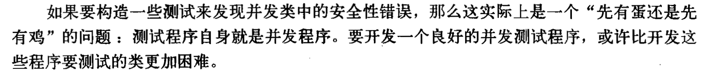
>


理想条件下的测试方法不需要任何的同步机制也能完成同步功能


对生产者消费者模式进行测试的一些经验：通过一个对顺序敏感的校验和计算函数来计算所有入列元素以及出列元素的校验和【对单个生产者和消费者特别有效】

如果是多生产者消费者模式，则需要对顺序和计算不敏感的校验和函数


在校验过程中尽量不要使用连续的整数进行校验，因为现在的编译器通常都可以预先计算出这个结果


可以使用随机数生成器来避免这个问题，但随机数大都是线程同步的，会增加同步代码块的量，对其他的结果造成影响。可以每个线程都有自己的一个随机数生成器


更好的办法是写一个伪随机数的函数，并且不需要进行同步，如下：

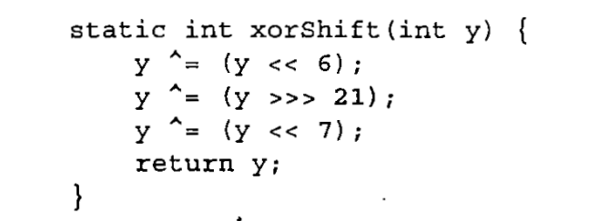

用返回的y做数字校验即可

> ^是异或操作，不是多少次方


检测上面写的BoundedBuffer在生产者消费者模型的表现：

```java
package cn.luckycurve.test;

import java.util.concurrent.CyclicBarrier;
import java.util.concurrent.ExecutorService;
import java.util.concurrent.Executors;
import java.util.concurrent.atomic.AtomicInteger;

/**
 * @author Lixiang(LuckyCurve)
 * @date 2020/4/14 16:01
 * @Desc 类的简单描述
 */
public class PutTakeTask {
    private static final ExecutorService pool = Executors.newCachedThreadPool();
    private final AtomicInteger putSum = new AtomicInteger(0);
    private final AtomicInteger takeSum = new AtomicInteger(0);
    private final CyclicBarrier barrier;
    //测试的主体
    private final BoundedBuffer<Integer> bb;
    //多少次测试  多少对生产者消费者
    private final Integer nTrials, nPairs;

    public PutTakeTask(int capacity, int nPairs, int nTrials) {
        bb = new BoundedBuffer<>(capacity);
        this.nTrials = nTrials;
        this.nPairs = nPairs;
        //所有生产者消费者线程，还有一个主线程
        barrier = new CyclicBarrier(nPairs * 2 + 1);
    }

    //主测试方法
    void test() {
        try {
            //执行多少对
            for (int i = 0; i < nPairs; i++) {
                //生产者线程
                pool.execute(() -> {
                    try {
                        //    生成随机种子
                        int seed = this.hashCode() ^ (int) System.nanoTime();
                        int sum = 0;
                        barrier.await();
                        for (int j = 0; j < nTrials; j++) {
                            bb.put(seed);
                            sum += seed;
                            seed = random(seed);
                        }
                        putSum.getAndAdd(sum);
                        barrier.await();
                    } catch (Exception e) {
                        throw new RuntimeException(e);
                    }
                });
                //消费者线程
                pool.execute(() -> {
                    try {
                        int sum = 0;
                        barrier.await();
                        for (int j = 0; j < nTrials; j++) {
                            sum += bb.take();
                        }
                        takeSum.getAndAdd(sum);
                        barrier.await();
                    } catch (Exception e) {
                        throw new RuntimeException(e);
                    }
                });
            }

            //等待所有线程开始执行
            barrier.await();
            //等待所有线程执行完成
            barrier.await();

            //    进行检测
            System.out.println("检测结果为  ：  "+(putSum.get() == takeSum.get()));
        } catch (Exception e) {
            throw new RuntimeException(e);
        }
    }

    //随机数生成
    private Integer random(Integer seed) {
        seed ^= seed >> 6;
        seed ^= seed >> 2;
        seed ^= seed << 6;
        return seed;
    }


    //大任务里面main就少写一点，抽象出一个函数去
    public static void main(String[] args) {
        new PutTakeTask(10, 10, 1000).test();
        pool.shutdown();
    }

}

```

==太完善的例子了，有时间一定要仔细看==


> 对这里将异常封装成RuntimeException异常的理解：
>
> ​	**RuntimeException异常通常无法处理，默认直接抛出**，直到最顶层。
>
> ​	如果这里面出现了异常，确实无法处理，应该封装成这样的

> 这里面使用了barrier，最大程度的保障了所有线程并发执行的可能性，如果没有这个栅栏，难免会有任务提交的先后，最糟糕的情况就是：任务执行不会花费多少时间，导致所有任务串行了
>
> 使用两个CountDownLatch也可以达到相同的效果【一个卡开始，一个卡结束】（要保证从任务开始到任务执行都是并发的）


在测试环境下，线程数量应该多于CPU的核心数，这样会保证同一时间段内总有多个线程在运行，且能增大线程之间的数据竞争，更容易发现问题


- 资源管理的测试


测试的另一个方式就是判断资源泄露

应该在不需要某些对象的时候即时销毁他们的引用，便于垃圾回收器来释放资源

像BoundedBuffer就需要尤其注意资源的控制，通过限制缓存区的大小（实际上是内部的`E[] items`）保证在生产者的生产力大于消费者的消费力的时候不会一直去消耗资源，而是去阻塞生产，防止资源浪费

可以使用一些堆分析工具，可以很容易的测试出对内存的不合理使用


- 产生更多的交替操作

通过产生更多的交替操作来模拟出很多现实中出现的低概率情况

常见方法：在线程访问共享状态的操作时候，使用Thread.yield来产生更多的上下文切换（当然这与实际情况有关，这条语句只是向JVM提供了一条意见，JVM可以将该条语句置空，也可以立即降低线程的优先级），或者使用更可靠的sleep操作（虽然更慢些，但是会更可靠），目的都是为了增加锁的竞争激烈程度，来模拟出是否会出现错误

> 当然，这样会给开发人员带来很大的不便：需要在开发时候加上这些语句，然后在运行打包的时候又要删除
>
> 建议通过使用面向切面编程（AOP）的工具来完成，可以降低这种不便性


前面介绍的是功能测试，保证代码运行的时候不会出错，下面介绍的是性能测试，应该在功能测试的基础之上


性能测试的两个目标：

- 反应被测试对象在应用程序中的实际用法
- 根据经验值来调整不同的限值，例如线程数量，缓存容器等等


- 增加计时操作


例如在PutTakeTask中使用到的栅栏技术，就可以增加一个计数器

`public CyclicBarrier(int parties, Runnable barrierAction)`使用带Runnable的CyclicBarrier构造器，可以在每次所有线程都await后，放行的时候执行runnable代码

因为使用了两次栅栏（分别是开始的时候和结束的时候），可以和轻易的计算出总耗时

代码实现：

```java
barrier = new CyclicBarrier(nPairs * 2 + 1, new Runnable() {
    private boolean started;
    private long startTime, endTime;

    //这里为什么使用了Synchronized还没想清楚，估计
    //也是保险起见，反正Synchronized进行了串行的优化
    @Override
    public synchronized void run() {
        long t = System.nanoTime();

        if (!started) {
            started = true;
            startTime = t;
        } else {
            endTime = t;
            System.out.println("消费时间：" + (endTime - startTime) / 1000000000.0 + "s");
            System.out.println("单个线程的任务平均执行时间："+ (endTime - startTime) / (1000000000.0*nPairs*nTrials) + "s");
        }

    }

    public synchronized void clear() {
        started = false;
    }

    public synchronized Long getTime() {
        return endTime - startTime;
    }
});
```

这里使用的是匿名内部类，如果是一个类实现了Runnable，最后的两个方法就有作用了，这里懒得再去写一个类了，直接在run方法里面一步到位。

运行数据：

```
消费时间：0.01057957s
单个线程的任务平均执行时间：1.057957E-6s
检测结果为：true
```

可以通过调整线程池的大小，内部队列的长度来看下对性能的影响

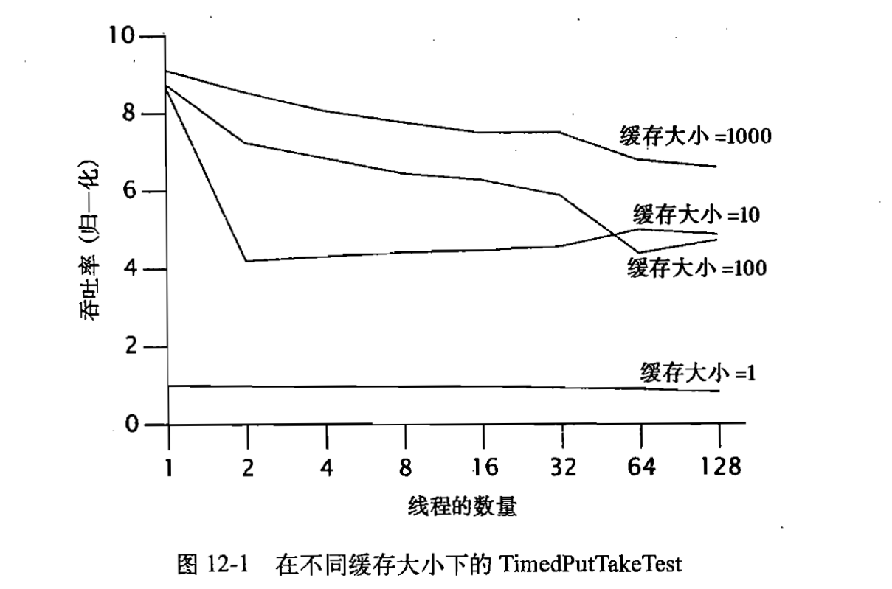


算法的比较，虽然BoundedBuffer已经很优秀了，有良好的执行性能和吞吐量，但还是没有ArrayBlockingQueue或者LinkedBlockingQueue那么好。JUC包下的代码实现基本上都采用了已知的最佳状态，其次，这里面的算法还能提供额外的功能

> 性能不高的最主要原因就是存在太多可能发生竞争的操作，拿BoundedBuffer来说，存取操作都需要获取两个信号量，里面的操作还要获取锁，存在了太多的竞争了


性能的比较：

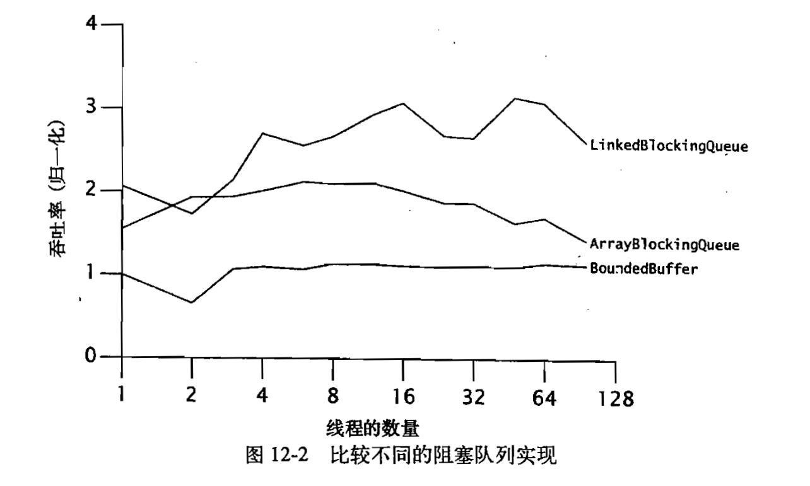

在我们的理解中，链表的数据结构每次在插入元素和取出元素的时候都要创建新的节点，应该不会太高效，但是实际上是LinkedBlockingQueue的并发量最好

> 这种情况再次证明了：基于传统的性能调优的直觉与可伸缩性的实际需求是背道而驰的


在实际场景中可能存在很多的性能测试陷阱

可能你会针对一个场景写有针对性的代码，并且多次统计执行时间已获取平均响应时间，但在实际过程中，你必须要避免以下几点，才能使你的工作有意义：

- 垃圾回收

垃圾回收的执行没有时序性，无法预测，可能在你这次测试的时候发生了（多增加了一条线程，平均响应速度受到了影响）

解决方法：

```
调用JVM时候指定参数来判断是否执行了GC，
1.确保没执行了GC，如果执行了就丢弃这次结果
2.确保执行了GC，丢弃没执行的样本（更好，更符合现实情况）
```


- 动态编译

当某个类第一次加载的时候，JVM会通过解释字节码的方式来执行它。在某个时刻，如果某个方法被执行的足够多，那么动态编译器会将他编译称为机器代码。

这种行为是无法预测的，同时也会带来性能上的损耗

解决办法：

```
1.使程序运行足够长的时间（至少几分钟），来减小动态编译带来的损耗
2.使得代码预先执行一段时间，并不统计这一段时间，让JVM有足够的时间去编译他
```


- 对代码路径不真实采样

JVM会针对方法在不同地方的调用对方法进行不同的优化。因此，在不同地方即使调用相同的方法，结果也不做数

- 不真实的竞争程度

想要获取有意义的结果，应该尽量的去模拟竞争激烈的情况下的性能表现和可伸缩性，而不是模拟出虽然有大量线程，但是很多线程都没有去竞争那些锁等资源

- 无用代码的消除

编译器的优化可能使得你当前的调用代码与你的执行逻辑完全不一样了，（例如从A点到B点，你希望走一条远路，这样更能合理的测试出走路的平均速度。然而编译器优化使得你直接从A点走到了B点，让你得出了错误的结论）

解决方法：

```
如果仅仅是存在静态的编译，那么处理这个问题将会相当的简单：只需要查看编译出来的字节码是否出现缺失代码的状况即可
但是对于动态编译则相当困难（后期执行过程中检查）
```

测试过程中尽量给JVM加上-server来取代默认情况下的-client。因为server模式能在编译器产生更有效的代码，减少动态编译时候的代码优化的可能性。此外也能模拟出服务端的情况


如果运算的结果没有进行校验或者输出，那么这个运算的过程很有可能被优化掉

有一个简单的技巧来避免算数优化，同时不会引入过多的开销

```java
使用该类中的某个对象，计算它的hash值与当前时间是否相等【计算hash值会需要整个类的所有字段，自然就用到了计算字段了】
if(x.hashCode() == System.nanoTime()) {
    System.out.println(" ");
}
一般不会相等，即使相等了也只是输出了一个空格
```


小结：

检测并发程序的正确性可能非常困难，很多故障都是低概率事件，并且故障的重现条件非常的敏感，即使调试过后仍然需要大量的时间来触发这种可能性

测试并发程序的性能同样非常困难，与使用静态编译语言C等相比，Java的动态编译，垃圾回收，自动优化都会影响性能的测试


使用传统的测试技术与代码审查和自动分析工具相结合，提升准确率


 


