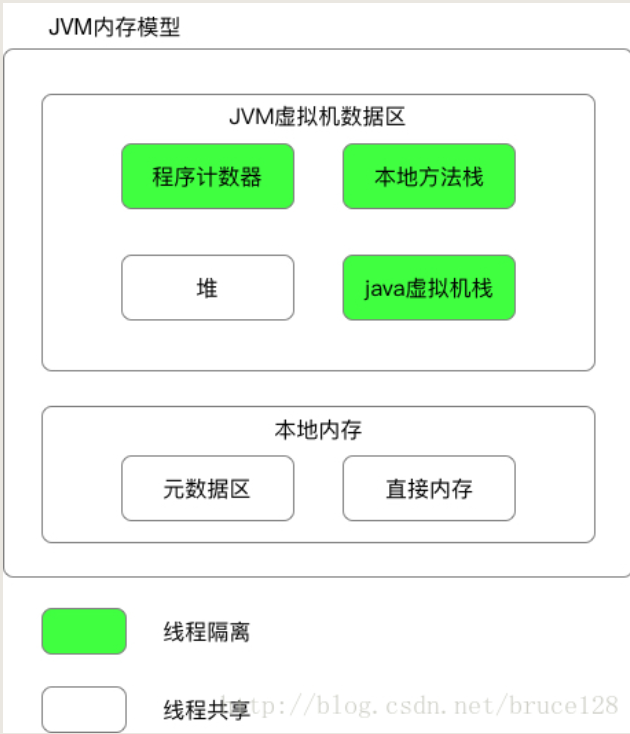

> 目录依据《Java编程思想（第四版）》

记录读书的感受和通过目录了解作者的书写思路

# 一、对象导论

计算机革命起源于机器，因此，编程语言的产生也始于对机器的模仿

面向对象程序设计（OOP，Object-oriented Programming）便是以计算机作为表达媒体的大趋势中的组成部分

## 抽象过程

所有编程语言均提供抽象机制

汇编语言是对底层机器语言的轻微抽象，接着许多“命令式”语言（BASIC，C）是在汇编的基础上做了改进，但处理问题仍然是基于计算机的结构，而不是基于所要解决的问题的结构来考虑。程序员需要建立起机器模型和实际问题模型之间的关系，这就催生了作为副产业的“编程方法”行业。

面向对象编程方式通过向程序员表达实际问题模型中的元素而更进了一步。

我们将问题空间中的元素称为“对象”

OOP允许根据问题来描述问题，而不是根据运行解决方案的计算机来解决问题

面向对象语言的基本特性（由Alan Kay创造的Smalltalk语言的特性，也是Java所基于的语言之一），表现出纯粹的面向对象的方式：

- 万物皆为对象。对象可以存储数据，也可以执行操作
- 程序是对象的集合。解决问题的方式就是让对象之间彼此发送消息来告知彼此要做的
- 每个对象都有自己的由其他对象所构成的存储。换句话说，可以通过创建包含现有对象的包的方式来创建新类型的对象
- 每个对象都拥有其类型。每个对象都是某个类（class）的一个实例
- 某一特定类型的对象都可以接收同样的消息。多态的一种表达形式，是OOP最强有力的概念之一

Booch在随后对对象提出了更简洁的概念：对象具有状态，行为和标识。也就对应着每个对象都拥有内部数据，方法和唯一标识（得以区分不同的对象，实际上就是内存地址）

## 每个对象都有一个接口

亚里士多德提出的观点：所有的对象都是唯一的，但同时也是具有相同的特性和行为的对象所归属的类的一部分

这种思想的第一个落地实现语言是Simula-67

创建抽象数据类型（类）是面向对象程序设计的基本概念之一，抽象数据类型的运行方式与内置类型基本完全一致

程序员通过定义类来适应问题，而不是被迫使用现有的用来表示机器中的存储单元的数据类型

在类型中，每一个请求都有一个方法与之相关联，当向对象发送请求时，与之相关联的方法将会被调用

## 每个对象都提供服务

最好的开发和理解一个程序设计的方法之一就是将对象想象成为一个“服务提供者”。程序本身向用户提供服务，通过调用其他对象提供的服务来实现这一目的

人们在设计对象时所面临的一个问题是：将过多的功能都塞在了一个对象中。在良好的面向对象程序设计中，每个对象都可以很好的完成某一项任务，但是他并不试图做更多的事

## 被隐藏的具体实现

将程序员分为：类创建者（类似于设计Spring等框架的程序员）和客户端开发者（使用框架的我们）是大有裨益的。客户端程序员的目的是收集各种从来实现快速应用开发的类。类创建者的目标是构建类，并且这些类只向客户端程序员暴露必须的部分，而隐藏其他部分。

隐藏部分的好处：

- 类创建者可以任意修改被隐藏的部分，而不用担心对其他人造成影响
- 隐藏部分通常是对象内部脆弱的部分，担心被客户端程序员的粗心或者是无知所破坏，隐藏可以减少BUG

类访问控制的存在原因：

- 让客户端程序员无法触及他们不应该触及的部分：这对客户端程序员来说其实是一种服务，因为他们可以轻易的看出哪些东西是重要的，哪些东西是可以忽略的
- 允许类库设计者改变类内部的工作方式而不影响客户端程序员：通过接口和实现可以轻易的进行分离并得以进行保护

通过三个关键字来实现访问控制：public，private，protected

- public：任何人都是可见的
- private：除类型创建者和类型的内部方法之外都是不可见的
- protected：和private作用相当，差别在于继承的类可以访问protected成员

还有一种默认的访问权限：包访问权限（可以被同一个包下的其他类的成员访问）

## 复用具体实现

代码复用是面向对象程序设计语言所提供的最了不起的优点之一

最简单的复用某个类的方式就是创建该类的一个对象，此外也可以将那个类的一个对象置于某个新的类中，这种概念称为组合，如果组合是动态发生的，则称为聚合

组合带来了极大的灵活性，新类的成员对象一般被声明为private（被隐藏的具体实现的好处），而继承则不具备这种灵活性，因为编译器会对继承而创建的类施加编译时的限制

由于继承在面向对象编程中具有重要地位，但不应该产生处处使用继承的错误，应该先考虑组合

## 继承

面向对象语言程序设计中，关键字class形成了编程语言中的基本单位

继承解决的问题：创建了一个类之后，即使另一个新类与其具有相似的功能，你还是得重新创建一个新类。

继承的作用：以现有的类为基础，复制他，然后通过修改和添加这个副本来创建新类

继承的局限性：当父类发生变动时，子类也会反映出这些变动

一个基类包含其所有导出类所共享的特性和行为

可以通过对象，类型层次结构来成为主要模型，可以直接从真实世界中对系统的描述过渡到用代码对系统进行描述

所有发送给基类对象的消息同时也可以发送给导出类对象（多态的基础）

使得导出类与基类有区别的方法：

- 添加新方法
- 改变现有基类的方法的行为，Overriding（覆盖或重写）

### 是一个和像似一个的关系

继承可能引发的争论：

- 继承应该只覆盖其基类的方法吗？

如果这样做就认为导出类和基类是完全相同的类型，可以使用导出类对象完全替换基类对象，即纯粹替代（或称为替代原则），导出类和基类是“is a”的关系，因为他们具有同样的方法和数据

有时在导出类中必须扩展接口，这个新的类型仍然可以替代基类，但是替代并不完美（多出了一些接口和接口的实现），导出类和基类是“is like a”的关系

两种方法的使用场合应该是相当明显的

## 伴随多态的可互换对象

在使用一个对象时，经常将其当做其基类的对象来使用，这使得人们可以不依赖于特定类型的代码（只需要于依赖即可）

可以在不影响基类的情况下轻松的扩展出新的子类类型

面向对象程序设计最重要的妙诀：

使用后期绑定的概念，给对象发送消息时，被运行的代码直到运行时候才能确定。编译器仅是通过方法的定义来确保被调用方法的存在，并对调用参数和返回值执行类型检查（无法提供此类保证的语言称为弱类型的），但是并不知道需要执行的代码

为实现后期绑定，Java使用一小段特殊的代码来替换绝对地址的调用（代码存储的是计算该方法体的地址）

插入一点点JMM的知识：

方法一般存在于方法区，而在JDK1.8中方法区的实现即使元数据区，Java即可计算方法在元数据区的地址来进行调用（动态绑定）

在C++中，需要通过virtual关键字来指定该方法来声明该方法是后期绑定的，而在Java中动态绑定是默认行为（Java通过JVM来实现强大的内存管理机制）

把导出类看做基类的过程称为向上转型（upcasing）

使用向上转型的真正意思：

你是一个Shape，我知道你可以erase（）和draw（）你自己，那么去做吧，但要注意其中细节的正确性

而不是

如果你是Circle，你就这样所，如果你是Square你就这样做

## 单根继承结构

C++面世以来就变得非常瞩目的一个问题：是否所有的类都继承自单一的基类，在Java和除C++以外所有的OOP语言答案都是YES，这个类就是Object

C++通过简化相同的基本类型来增加了额外的灵活性，即便是所有对象都共有的一些方法也直接丢弃

单根继承保证对象都具备某些功能，如在堆上初始化对象的基本操作

单根继承还是得垃圾回收变得容易，保证了所有对象都具备其类型信息

## 容器

只有在运行时才能确定某个问题需要多少个对象，或者他们将存活多久

大多数语言都对其很轻率：创建另一种数据类型，这种新的数据类型拥有对其他对象的引用，或者直接使用大多数语言都具有的数组来解决这个问题

好的OOP语言则有自己的一组容器来解决这个问题，例如Java中的List，Map，Set，队列，数，堆栈等多种构件

出现如此多种类型的原因：

- 不同的容器提供了不同类型的接口和外部行为，最明显的例子就是List的add方法和Map的put方法
- 不同的容器对某些操作具有不同的效率，如ArrayList和LinkedList，插入数据和随机读取数据效率不同

### 参数化类型

在JavaSE 5之前，容器存储的对象只能是Object（因为泛型在Java5才被引入），源于单根继承的优势，所以存储Object的容器可以存储任何东西（基本数据类型有相应的封装类）

要使用这样的容器，只需要将引用传入进去即可。但每次存储进去的数据都会向上转型成为Object的引用，在取出时会丢失身份。

这里就需要使用向下转型为更具体的类型，除非确切得知道要处理的对象的类型，否则向下转型几乎是不安全的

如果每次都需要程序员手动转型，内容是庞杂的也是重复的，无意义。可以通过参数化配置来定制一个只能接取和收纳特定类型的对象

JavaSE5引入了参数化类型，在Java中也称作泛型

为了利用泛型的优点，许多JDK5之前的代码都进行了重构（但是我们完全感受不到，这也是被隐藏的具体实现的优势）

## 对象的创建和生命期

使用对象时候，最关键的问题之一就是他们的生成和销毁的方式，因为对象会占用资源（尤其是内存）

很可能出现以下情况：当处理完某个对象之后，系统的其他部分可能还在使用它，那么何时将这个对象回收就成了一个问题

创建位置：

C++认为效率最为重要，将对象的存储空间和生命周期的选择权力交给了程序员。但如果面对上面的问题依旧很头疼，可以选择堆栈任意位置创建（:question:）

第二种程序设计思路（Java）是在堆的内存池中动态的创建对象。动态方式有一个一般性的逻辑假设——对象趋于复杂，查找和释放存储空间的开销不会对对象的创建造成重大的冲击

生命周期：

允许在堆栈上创建对象的语言，编译器可以确定对象存活的时间，并可以自动销毁他

像C++则需要通过编程方式来手动销毁（C++好像是只有编译器能在栈上分配内存创建对象，程序员通过new出来的对象一律存在于堆区）如果没有正常处理则会直接内存泄漏（常见问题）

而Java的垃圾回收机制完美解决了内存泄漏

## 异常处理

设计一个良好的错误处理机制非常困难，很多语言直接将这个问题抛给类的设计者去解决，大多数的错误机制还是依赖于程序员编程时候的警惕性，但如果哪天不谨慎了，则很容易出现错误

异常处理将错误置于编程语言中，在出错的地方被跑出

异常处理就像是与程序正常执行路径并行的，在出错时就会执行另一条路径，所以不会干扰到后续的代码

其次异常不像靠方法返回值来报错的其他编程语言一样，异常不能被忽略，一定要在某处被处理掉。

再者是现在抛出异常不仅只能结束程序，还能在可能会跑出异常的点通过编程做一些补救的处理，增加程序的健壮性

Java从一开始就内置了异常处理，并强制你使用它，如果没有处理异常的代码，就会得到一条出错消息

异常处理不是面向对象的一个特征，尽管在面向对象语言中异常常常被封装成一个对象，异常处理在OOP之前就有了

## 并发编程

在同一时刻处理多个任务

并发最常见的例子就是用户界面：用户在发布一条指令后立马回得到响应，而不用等待其他程序完成

多线程带来的优势之一就是程序员不需要再去关注电脑硬件有几个处理器

并发的隐患：资源共享

## Java与Internet

Java解决了在WWW上的问题

### Web是什么

理解Web就必须先理解客户/服务器系统

信息存储池，用于分发信息的软件以及信息与软件所驻留的机器或集群总称为服务器，驻留在用户机器上的软件与服务器进行通信，以获取信息，处理信息，然后把它们显示在被称为客户机的用户机器上。

Web就是一个巨型的客户/服务器

### 客户端编程

### 服务器端编程

