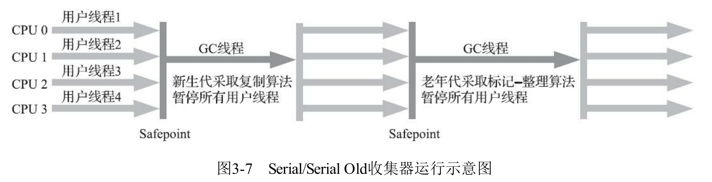

# 简介


Java技术体系主要是由：Java虚拟机，Java类库，Java编程语言以及第三方Java框架组成


因为Java的一个重要优点：Java虚拟机在各个平台上建立了统一的运行平台，使得普通的开发人员只需要了解Java常用类库，基本语法，第三方框架即可完成大部分日常工作


如果开发人员不了解虚拟机的技术特征的运行原理，就无法写出最适合虚拟机运行和自优化的代码


由于OracleJDK在OpenJDK中占据绝对优势，所以本书大多以HotSpot为例子进行讲解


由于版面原因，本书中的许多示例代码都没有遵循最优的程序编写风格，如使用的流没有关闭
流、直接使用System.out输出日志等，请读者在阅读时注意这一点。


2.网站资源
·高级语言虚拟机圈子：http://hllvm.group.iteye.com/。
里面有一些关于虚拟机的讨论，并不只限于Java虚拟机，包括了所有针对高级语言虚拟机（High-
Level Language Virtual Machine）的讨论，不过该网站针对Java虚拟机的讨论还是绝对的主流。圈主
RednaxelaFX（莫枢）的博客（http://rednaxelafx.iteye.com/）是另外一个非常有价值的虚拟机及编译原
理等资料的分享园地。
·HotSpot Internals：https://wiki.openjdk.java.net/display/HotSpot/Main。
这是一个关于OpenJDK的Wiki网站，许多文章都由JDK的开发团队编写，更新很慢，但是有很大
的参考价值。
·The HotSpot Group：http://openjdk.java.net/groups/hotspot/。
HotSpot组群，里面有关于虚拟机开发、编译器、垃圾收集和运行时四个邮件组，包含了关于
HotSpot虚拟机最新的讨论。


# 第一部分、走进Java


## 第一章、走进Java


由于Java的热点代码检测和运行时编译及优化，使得Java程序能随着运行时间的增长而获取更高的性能


Java技术体系：

从广义上讲，Kotlin、Clojure、JRuby、Groovy等运行于Java虚拟机上的编程语言及其相关的程序
都属于Java技术体系中的一员。

从传统意义上讲：Java程序设计语言，Java虚拟机实现，Class文件格式，Java类库API，第三方Java类库


在不引起歧义的地方都能 使用JDK（Java Development Kit）来代替整个Java技术体系，JDK是支持Java程序开发的最小环境，包括：Java语言，Java虚拟机，Java类库

可以把Java类库中的子集——Java SE API 和Java虚拟机两部分统称为JRE（Java Runtime Environment），JRE是支持Java程序运行的标准环境


如果按照重点业务来划分的话：

- Java Card：支持Java小程序（applets）运行在小内存设备（智能卡）上
- Java ME：支持Java程序运行在移动终端上的平台
- Java SE：支持面向桌面级应用（如Windows的应用程序）的Java平台，在JDK6之前被称为J2SE
- Java EE：支持使用多层架构的企业应用的Java平台，并在Java SE的基础上做出了拓展（Javax.*包，Java SE是Java.*包，由于历史原因，一部分javax进入到了Java SE API中），在JDK6之前被称作J2SE，在JDK10被Oracle放弃，捐赠给了Eclipse基金会，改名Jakarta EE


Java历史（书籍p25）：

1995年5月23日，Oak语言改名为Java，并且在SunWorld大会上正式发布Java 1.0版本。Java语言第
一次提出了“Write Once，Run Anywhere”的口号。

1996年1月23日，JDK 1.0发布，Java语言有了第一个正式版本的运行环境。JDK 1.0提供了一个纯
解释执行的Java虚拟机实现（Sun Classic VM）。JDK 1.0版本的代表技术包括：Java虚拟机、Applet、
AWT等。


Sun公司在JDK7研发期间股票大跌，无力推动JDK7的研发，JDK7中就包含lambda表达式等特性，最后Sun公司被Oracle公司收购，并推迟了技术 


JDK 8提供了那些曾在JDK 7中规划过，但最终未能在
JDK 7中完成的功能，主要包括：
·JEP 126：对Lambda表达式的支持，这让Java语言拥有了流畅的函数式表达能力。
·JEP 104：内置Nashorn JavaScript引擎的支持。
·JEP 150：新的时间、日期API。
·JEP 122：彻底移除HotSpot的永久代。


从此以后，每六个JDK大版本中才会被划出一个长期
支持（Long Term Support，LTS）版，只有LTS版的JDK能够获得为期三年的支持和更新，普通版的
JDK就只有短短六个月的生命周期。JDK 8和JDK 11会是LTS版，再下一个就到2021年发布的JDK 17了。


Oracle收购Sun是Java发展历史上一道明显的分界线。在Sun掌舵的前十几年里，Java获得巨大成
功，同时也渐渐显露出来语言演进的缓慢与社区决策的老朽；而在Oracle主导Java后，引起竞争的同时
也带来新的活力，Java发展的速度要显著高于Sun时代。Java的未来是继续向前、再攀高峰，还是由盛
转衰、锋芒挫缩，你我拭目以待。
Java面临的危机挑战前所未有的艰巨，属于Java的未来也从未如此充满想象与可能。


Java虚拟机家族：


虚拟机始祖：Sun  Classic/Exact VM

JDK1.0中自带的虚拟机，唯一的功能就是以纯解释器的方式来运行Java代码，如果需要及时编译的功能，就必须外挂编译器，但编译器会完全接管虚拟机的执行系统，解释器将毫无用武之地。正因为编译器与解释器不能共存，使用编译器就不得不对每一个方法每一行代码都进行编译，效率很低，解释器就更不用说了。


在JDK1.2时候，sun公司提供了另一种虚拟机来改善Classic VM的低效率问题——Exact VM，允许编译器与解释器共存，还支持热点嗅探等操作。虽然性能较Classic VM优化了很多，但立马就被外部引进的HotSpot VM淘汰（并不是技术上的原因，而是公司的内部争吵决策），反而是Classic VM，在JDK1.2之前是唯一的VM，在JDK1.2，他是默认的虚拟机选择，在JDK1.3时，HotSpot成为默认选择，Classic VM成为备选，直到JDK1.4才被淘汰。


武林盟主：HotSpot虚拟机

sun公司在1997年收购了Longview Technologies公司，从而获得了
HotSpot虚拟机，HotSpot不是用的Java语言开发

在Oracle公司收购Sun后，选择将BEA的JRockit的优秀点融入到HotSpot中并在JDK8中发布，移除到了永久代，加入了Java Mission Control 监控工具等等


小家碧玉：Mobile/Embedded VM

面向移动端和嵌入式的虚拟机产品


目前位置比较尴尬，在移动端Android和IOS二分天下

而在嵌入式设备上，Java ME Embeddad  VM面对自家的Java SE Embeddad VM的竞争，人们更愿意选用 SE的产品，Oracle基本砍掉了这一块，归入了Java SE Embeddad VM中，Java SE Embeddad VM 本质上还是HotSpot，只是为嵌入式设计进行了定制，并减少了内存消耗和资源占用


反倒是很早就应该被淘汰的更低端的Java ME VM活的更好，在国外的老人机和经济欠发达的功能手机还在广泛使用


天下第二：BEA JRockit/IBM J9 VM

曾经的三足鼎立关系，JRockit和J9都曾宣称自己是世界上最快的虚拟机，总体上三者虚拟机之间的性能是交替上升的


对未来的一种期盼：

无语言倾向的Graal VM，在后面介绍到


及时编译器

HotSpot里存在两个及时编译器用于编译热点代码，分别是：

- 编译时间短但输出代码优化程度较低的客户端编译器（简称C1）
- 编译时间长但输出代码优化程度较高的服务器编译器（简称C2）

自JDK10起，加入了一种新的即时编译器Graal（到如今仍是非常年幼，没有见过足够的实战）企图在将来取代C2。C2是Cliff Click博士在博士期间的C++作品，但睡着C2的发展就连Cliff Click本人都不愿意维护。而Graal比C2晚问世20多年，并且使用了一种名为“Sea-of-Nodes”的高级中间表示，可以很轻易的借鉴C2的优势，具有更高的可扩展性，在测试中的数据逐渐赶上C2，在有些方面还超越了。

> Graal可以作为18年Oracle提出的Graal VM的基础
>
> Graal VM被官方称为“Universal VM”和“Polyglot VM”，这是一个在HotSpot虚拟机基础上增强而成
> 的跨语言全栈虚拟机，可以作为“任何语言”的运行平台使用，这里“任何语言”包括了Java、Scala、
> Groovy、Kotlin等基于Java虚拟机之上的语言，还包括了C、C++、Rust等基于LLVM的语言，同时支
> 持其他像JavaScript、Ruby、Python和R语言等。Graal VM可以无额外开销地混合使用这些编程语言，
> 支持不同语言中混用对方的接口和对象，也能够支持这些语言使用已经编写好的本地库文件。
>
> 
>
> 


向native迈进：


由于Java的启动时间相对较长，需要预热才能达到最高性能等特点，使得对几年在从大型单体应用架构向小型微服务应用架构发展的技术潮流不太适应

已经陆续推出了跨进程的、可以面向用户程序的类型信息共享（Application Class Data
Sharing，AppCDS，允许把加载解析后的类型信息缓存起来，从而提升下次启动速度，原本CDS只支
持Java标准库，在JDK 10时的AppCDS开始支持用户的程序代码）


但提出的一个彻底的解决方案（目前正在实行）：提前编译

直接给JVM运行已经编译好的字节码，使得不用去在线编辑，避免了Java第一次运行事假慢的问题。

但坏处也非常明显：1.有悖于Java“一次编写，到处运行“的承诺，开始以来操作系统。2，显著降低Java的动态性，必须要求信息在静态编译的时候就是已知的，而不是运行时候才确定。

直到Substrate VM出现，才算是满足了人们心中对Java提前编译的全部期待。但相应地，原理上也决定了Substrate VM必须要求目标程序是
完全封闭的，即不能动态加载其他编译器不可知的代码和类库。

Substrate VM具有轻量级的特性，在运行时候不会占用过多的内存，并且速度客观


语言语法持续增强：

但一门语言的功能、语法又是影响语言生产力和效率的重要因素，很多语言特性和语法糖不论有没有，程序也照样能写，但即使只是可有可无的语法糖，也是直接影响语言使用者的幸福感程度的关键指标。

改进期盼值关注度高的项目：

- Loom：Java的线程都是直接调度本地方法，间接依赖于操作系统，对线程的操作太过重量级（早期Java也提供了一套轻量级的线程操作）Loom项目就准备提供一套与目前Thread类API非常接近的Fiber实现。
- Valhalla：提供值类型和基本类型的泛型支持，并提供明确的不可变类型和非引用类型的声明。不可变类型在并发编程中非常重要，Java只能通过将类中的全部字段声明为final来保证
- Panama：目的是消弭Java虚拟机与本地代码之间的界线，Panama项目的目
  标就是提供更好的方式让Java代码与本地代码进行调用和传输数据。


自己编译JDK

以OpenJDK为例子，在linux环境下编译


# 第二部分、自动内存管理


## 第二章、Java内存区域与内存溢出异常


C/C++ 程序员在内存管理领域拥有最高的权限，但也需要担负着每一个对象生命从开始到终结的维护者

Java程序员将内存管理权利交给了Java虚拟机，但一旦出现内存泄漏和洗出方面的问题，一旦不了解虚拟机就很难修复


根据《Java虚拟机规范》，Java虚拟机所管理的内存将会被划分成为以下几块：


组件的介绍：

- 程序计数器

较小的内存空间，可以被看成当前线程所执行的字节码的行号指示器，是用来选取下一条需要执行的字节码指令。

是程序控制流的指示器，分支，循环，跳转，异常处理，线程恢复等等都依赖于这个计数器

每个线程都会拥有一个程序计数器便于获取CPU时间片的时候恢复到正确的位置，并且计数器之间互不影响，独立存储。这类内存区域被称为“线程私有”的内存

如果执行的是Java方法，则存储的是下一条指令的地址，如果执行的是本地方法，则该计数器为null。是唯一不会出现OutOfMemoryError的地方


- 虚拟机栈

描述的是Java方法执行的线程内存模型，每个方法对应着一个栈帧，方法的调用到结束就对应着栈帧从虚拟机栈中入栈到出栈的全过程，栈帧中存放有：局部变量表（就是方法体之内定义的变量），操作数栈，动态链接，方法出口等等

线程私有的，生命周期与线程相同


不能笼统的将Java内存划分成为堆内存和栈内存，这种划分方式来源于C/C++，无法适用于Java。但这也间接说明了程序员们最关注的对象分配关系最密切的区域：堆和栈，**栈这里通常指的是虚拟机栈，或者更多情况下只是用来指虚拟机栈中的局部变量表部分**

局部变量表存放：基本数据类型，对象引用（reference类型，不同于对象本身，可能是指向对象起始地址的引用指针等）和returnAddress类型（指向字节码的地址）

局部变量表的存储空间由局部变量槽来表示，long和double（64位）会占用两个局部变量槽，其余的数据只占用一个。~~可以这样理解：一个局部变量槽可以存储32位的数据，且只能单独存放一个数值~~（有问题，后面有解释）。局部变量表的分配在编译期间就可以确定的。

> 局部变量表的大小指的是：
>
> ​	局部变量槽的数目，而不是局部变量槽的大小，他的大小由虚拟机自行决定的事情。


会抛出两种异常：

1. StackOverflowError异常：请求的栈深度大于虚拟机所允许的深度，就会抛出该异常
2. OutOfMemoryError异常：如果虚拟机能动态扩展，在需要扩展的时候却无法申请到足够的内存就会抛出该异常


- 本地方法栈

与虚拟机栈发挥相同的功效，只不过虚拟机栈服务于Java方法（分配内存，存储局部变量等等），而本地方法栈服务于本地方法

《Java虚拟机规范》对本地方法栈的使用方式和数据结构没有明确规定，有些虚拟机（例如HotSpot）因为他和虚拟机栈的功能尤其类似，直接合并到了虚拟机栈中去了

和虚拟机栈一样，也会抛出OutOfMemoryError和StackOverflowError异常


- Java堆

Java堆是虚拟机管理的内存中最大的一块，存在的唯一目的就是：存放对象实例。几乎所有的对象实例（包括数组）都在这里分配内存。

Java堆是垃圾回收器管理的内存区域，有时也被称为“GC堆”


分类：

1.从回收内存的角度看

对Java堆的一点补充：

> 从回收内存的角度看，由于现代垃圾收集器大部分都是基于分代收集理论设计的，所以Java堆中经常会出现“新生代”“老年代”“永久代”“Eden空间”“From Survivor空间”“To Survivor空间”等名词，这些概念在本书后续章节中还会反登场亮相，在这里笔者想先说明的是这些区域划分仅仅是一部分垃圾收集器的共同特性或者说设计风格而已，而非某个Java虚拟机具体实现的固有内存布局，更不是《Java虚拟机规范》里对Java堆的进一步细致划分。不少资料上经常写着类似于“Java虚拟机的堆内存分为新生代、老年代、永久代、Eden、Survivor……”这样的内容。在十年之前（以G1收集器的出现为分界），作为业界绝对主流的HotSpot虚拟机，它内部的垃圾收集器全部都基于“经典分代”[3]来设计，需要新生代、老年代收集器搭配才能工作，在这种背景下，上述说法还算是不会产生太大歧义。但是到了今天，垃圾收集器技术与十年前已不可同日而语，HotSpot里面也出现了不采用分代设计的新垃圾收集器，再按照上面的提法就有很多需要商榷的地方了。

摘自：《深入理解Java虚拟机（第三版）》


2.从内存分配的角度看：

会为每个线程划分其私有的分配缓冲区，以提升对象的分配效率。


==无论从什么角度，都不会改变堆的共性，存储的都是对象实例，将Java堆划分只是为了更好的进行垃圾回收，或者更快的分配内存==


Java堆可以固定大小，也可以动态分配（指定``-Xmx 和 -Xms`），如果内存满了，就会抛出OutofMemoryError异常


- 方法区

用于存放虚拟机已加载的类型信息，常量，静态变量，即时编译器编译出的代码缓存等等


方法区，永久代，元空间的关系：

永久代和元空间只是方法区的两种不同的实现方式

尤其在JDK8之前，HotSpot没有实现方法区，而是使用对堆划分一块名为永久代的内存在在逻辑层面上实现方法区的概念，这样就可以直接使用堆的内存回收机制来管理这一块内存，而永久代有内存上限的限制，会出现很多BUG，而BEA的JRockit和IBM的J9则没有永久代这一概念，当Sun收购BEA时候，想整合HotSpot和JRockit，就因为此出现诸多困难，因此选择逐步使用元空间来替代永久代

JDK7成功将永久代的字符串常量池，静态变量等移除

在JDK8时候废除永久代，采用元空间，并具有自己的垃圾回收算法


如果无法满足内存分配，就会抛出OutOfMemoryError异常


- 运行时常量池

运行时常量池从属于方法区。方法区对类加载文件（Class文件）会进行内存分配，Class文件包含类的版本，字段，方法，接口等描述，还有常量池表（里面存储的是各种字面量和符号引用），常量池表在类加载后存放到方法区的运行时常量池中

上面只是类的静态编译的处理方式，运行时常量池也支持对动态内存分配来支持动态编译所带来的常量，这种特性被利用的多的地方就是String类的intern（）方法

```java
//描述：调用intern方法时，如果池中包含一个equals返回true的对象，那么就直接返回这个池中对象，否则就将当前字符串加入池中，并返回引用
public native String intern();
```


因为运行时常量池从属于方法区，和方法区一样也可能抛出OutOfMemoryError异常


- 直接内存

不是虚拟机运行时数据区的一部分，也不是《Java虚拟机规范》的一部分，因为频繁的被使用，并可能==**导致**==OutOfMemoryError异常


Java1.4新加入了NIO（New Input/Output）类，可以使得Native函数直接分配堆外内存，并将这块地址的引用返回给DirectByteBuffer对象，显著提高性能，避免Java堆和Native堆来回复制数据


堆外内存没有限制大小，但是随着堆外内存的增大，其他的内存区域动态扩展时候很有可能会抛出OutOfMemoryError异常（可以通过给堆外内存设置-Xmx等参数来解决问题）


上面介绍完了内存区域，下面深入探讨一下HotSpot虚拟机在Java堆中对象分配、布局和访问的全过程。


对象的创建：

创建对象（例外：复制和反序列化）通常仅仅只需要一个new关键字，但在JVM层面，对象（不包括数组和Class对象）的创建详细详细：


当JVM遇到new指令

1.会先到常量池中检查能否定位到这条指令的参数，并且检查这个符号引用所代表的类是否被加载，解析和初始化过，如果没有，则进行类加载过程

2.为新生对象分配内存，内存大小在类加载过程中便已经确定。分配内存的任务又由Java堆内存是否工整决定的。如果是工整的，就会存在一个指针作为分界点的显示器，隔绝被使用的线程和空闲的线程，此时的分配仅仅只需要挪动指针向空闲内存方向即可分配空间，这种分配方式被称为“指针碰撞”。而如果是不工整的，虚拟机就会维护一个列表，上面记录着空闲内存和被占用内存，并从空闲内存中找到一块足够大的空间交给对象实例，这种分配方式被称为“空闲列表”。影响Java堆是否工整的因素是垃圾回收器，当使用Serial、ParNew等带压缩整理过程的收集器时，系统采用的分配算法是指针碰撞，既简单又高效；而当使用CMS这种基于清除（Sweep）算法的收集器时，理论上就只能采用较为复杂的空闲列表来分配内存。

> 需要考虑的问题：并发
>
> 可能分配内存后，指针还没来得及挪动就又开始了第二次分配内存
>
> 可选方案：
>
> 1. 内存分配的动作进行同步——实际上Java虚拟机就是采用CAS来保证内存分配操作的原子性
> 2. 在Java堆上为每个线程都分配一份私有的本地线程分配缓冲（Thread Local Allocation Buffer，TLAB），直接在自己的本地缓冲区分配，只有当本地缓冲区满了之后，在扩展本地缓冲区的时候进行同步即可，虚拟机是否使用TLAB，可以通过-XX：+/-UseTLAB参数来设定。


3.将分配到的内存空间（不包括对象头）都初始化为零，如果是TLAB分配的话就直接在分配本地线程区的时候顺便进行，这样能使得对象的实例字段在不赋初值的情况下能直接使用，对应的就是各自的零值（基本数据类型）或者NULL（引用）

4.对对象进行必要的设置，并将信息存储在对象头中，例如：类的元数据信息，对象的哈希码（实际上会延后到调用hashcode方法的时候再计算），对象的GC分代年龄信息等等

到此为止就Java虚拟机方面对象已经分配完成了，但是就程序员来说还没有，所有的字段还是零值

5.调用<Init>()方法，Java编译器在new关键字之后会紧接着调用new指令和init指令用于初始化，整个初始化工作完成


对象的内存布局：

在HotSpot，对象内存布局分配三部分：对象头（Header），实例数据（Instance Data）和对齐填充（Padding）

- 对象头

对象头包含两类信息，一类用于存储对象自身的运行时数据，被称为“Mark Word”，主要有哈希码（应该是懒加载的），GC分代信息，锁标记状态，线程持有的锁等等只启用一个标记状态记录下来，分配的比特位为虚拟机的比特位，空间极小，所以实现了高效的利用（几个比特位共同管理几种状态），状态码部分信息如下：


对象头的另一部分数据是类型指针，指向该对象的元数据类型（但也不是必须存在的，即Java虚拟机获取对象类型不一定要通过对象的元数据信息），此外，如果是一个数组，还需要存储记录数组长度的数据，这样Java虚拟机才能在类加载的时候确定该对象（把数组看成一个对象）需要分配多大的内存空间。


- 实例数据

对象真正的有效信息，存储我们定义的各种类型的字段内容，无论是从父类继承下来的，还是在子类中定义的字段，HotSpot的默认存储顺序为：longs/doubles、ints、shorts/chars、bytes/booleans、oops（Ordinary Object Pointers，OOPs），且同一层级的变量父类定义的会在子类定义之前，且相同长度的字段会被分配到一起存放（减少内存开销）。


- 对其填充

不是必须的，但由于HotSpot要求对象的起始地址是8字节的整数，所以对象的大小都必须是8字节的整数倍，不满8字节则用此来补充


对象的访问定位：

Java程序是操作栈上的reference数据来操作堆上的具体对象，《Java虚拟机规范》只是指定了该reference存储的是对象的引用，具体怎么访问没有说明，由虚拟机自己实现，主流访问方式有：

- 句柄访问

Java堆划分出一片内存作为句柄池，reference存储的就是句柄地址，在通过句柄值来找到对象的信息，示例图如下：


对象中的静态全局变量存储在方法区中，非静态全局变量存储在堆区，要同时读取两部分内容


- 直接指针访问

reference直接存储的是对象堆内存的地址，会少读取一次内存


都需要读取对象头的元数据类型来获取静态全局变量


各有优劣：

句柄存储能保存reference存储的是稳定的句柄地址，如果对象内存修改了，只需要改变句柄地址即可

直接指针能保证高速的访问速度（对HotSpot中主要是使用第二种方式，第一种也很常见，打开任务管理器即可看到句柄数量）


实战：OutOfMemoryError异常


1.模拟堆溢出：

```java
/**
 * @author Lixiang(LuckyCurve)
 * @date 2020/4/22 20:48
 * @Desc 模拟OutOfMemoryError异常
 */
public class Test {
    static class OOMObject {
    }

    public static void main(String[] args) {
        ArrayList<OOMObject> list = new ArrayList<>();

        for (; ; ) {
            list.add(new OOMObject());
        }
    }
}
```

虚拟机参数：`-Xms20m -Xmx20m -XX:+HeapDumpOnOutOfMemoryError`

通过将最大内存和最小内存置为一样保证其无法扩展，通过-XX:+HeapDumpOnOutOfMemoryError保存内存堆转换快照以便后面分析

输出：

```java
java.lang.OutOfMemoryError: Java heap space
Dumping heap to java_pid12888.hprof ...
Heap dump file created [28167387 bytes in 0.079 secs]
Exception in thread "main" java.lang.OutOfMemoryError: Java heap space
	at java.util.Arrays.copyOf(Arrays.java:3210)
	at java.util.Arrays.copyOf(Arrays.java:3181)
	at java.util.ArrayList.grow(ArrayList.java:265)
	at java.util.ArrayList.ensureExplicitCapacity(ArrayList.java:239)
	at java.util.ArrayList.ensureCapacityInternal(ArrayList.java:231)
	at java.util.ArrayList.add(ArrayList.java:462)
	at cn.luckycurve.vmdemo.Test.main(Test.java:18)
```

前三行输出为指定记录堆内存快照独有的

> 使用测试工具Jprofiler来进行分析：
>
> 1.
>
> 指定运行环境，选择最右边的按钮
>
> 2.
>
> 主要将其设置为CPU recording和Save and immediately open a snapshot
>
> 启动CPU记录和并保存一个快照，保证一开始的数据就有效，以及当虚拟机被迫中断之后数据不会丢失
>
> 3.如果是一个立马关闭的程序，或许当CPU记录还没启动起来JVM已经停止了，例如上面那个分配了20M内存的程序
>
> 
>
> 
>
> 在第二章图里面很容易看出是哪个对象造成了内存泄漏
>
> 
>
> 中间只存在0.01s，持续时间非常的短（一般不会出现这种情况，因为虚拟机有足够大的内存）
>
> 


2.模拟栈异常：

HotSpot不会单独区分虚拟机栈和本地方法栈，所以虽然-Xoss参数存在，但是设置本地方法栈大小不会有任何效果，直接使用-Xss来设定栈容量大小即可

《Java虚拟机规范》中提出栈可能出现两种异常：

- StackOverflowError：请求的栈深度大于栈的最大深度
- OutOfMemoryError：支持动态扩展的虚拟机如果请求内存扩展无效时抛出（很遗憾HotSpot不支持动态扩展，理论上是很难出现这个异常，也有可能出现：当线程申请分配栈内存的时候无法获取足够内存，也会抛出这个异常）


栈中存放的是栈帧，也叫方法帧，用于记录运行时候的方法信息，最简单的模拟栈溢出的方法就是：方法去调用自己，类似于一个递归函数但是没有递归出口，栈帧会一直记录外层方法，直到栈帧大到虚拟机栈装不下了，就报错，例子如下：

1.

```java
/**
 * @author Lixiang(LuckyCurve)
 * @date 2020/4/23 11:08
 * @Desc 模拟栈异常
 */
public class JavaVMStackSOF {
    private int stackLength = 1;

    public void stackLeak() {
        stackLength++;
        stackLeak();
    }


    public static void main(String[] args) {
        JavaVMStackSOF javaVMStackSOF = new JavaVMStackSOF();
        try {
            javaVMStackSOF.stackLeak();
        } catch (Throwable e) {
            System.out.println(javaVMStackSOF.stackLength);
            throw e;
        }
    }
}
```

虚拟机参数：`-Xss128k`，指定栈大小，快速模拟出溢出效果，并输出方法调用的次数


>  还有一种方法和上面例子达到的效果是一样的：
>
> ​		不控制栈的大小，保证每个方法的方法帧足够大（创建100个局部变量，使得方法帧足够大），目的是一样的，但第一种方式优雅些


模拟HotSpot的OutOfMemoryError异常（通过一直创建线程，并保证每个线程的栈内存大小足够大（通过-Xss参数指定分配的栈大小），就很容易出现了）

```java
/**
 * @author Lixiang(LuckyCurve)
 * @date 2020/4/23 11:40
 * @Desc 模拟HotSpot抛出OOM异常（很难见到的，不支持动态内存分配）
 */
public class JavaVMStackOOM {
    public static void main(String[] args) {
        for (; ; ) {
            new Thread(() -> {
                //    保证线程一直执行执行，占用物理内存
                for (; ; ) {

                }
            }).start();
        }
    }
}
```

虚拟机参数：`-Xss2m`

:warning:：在Windows上由于Java的线程会直接映射到操作系统的内核线程上，操作系统会有很大的压力，很可能造成假死，运行上述语句有很高风险（亲测风险很高）


通常出现StackOverflowError会有明确的信息可供你分析，容易定位到问题信息。

但如果是因为过多的线程导致的OutOfMemoryError，很有可能是线程脱离了管理，GC无法回收（类似于野指针的形式），也有可能只是单纯的线程太多，此时则需要来减少堆内存大小和栈容量（默认情况下大多数达到1000~2000是没有问题的）来换取更多的线程了。


3.方法区与运行时常量池溢出

先来测试运行时常量池的溢出（使用String.intern方法来不断添加对象到常量池里面去）。

在JDK6及以前，运行时常量池在永久代，使用`-XX：PermSize`和`-XX：MaxPermSize`限制永久代的大小，即可达到内存溢出目的。

在JDK7及以后，开始使用元空间取代了永久代，此时使用`-XX：MaxPermSize`限制永久代还是在JDK8以后使用`-XX：MaxMeta-spaceSize`限制元空间都无济于事，**因为运行时常量池移动到了堆区**，使用`-Xmx`来指定堆区的大小

```java
/**
 * @author Lixiang(LuckyCurve)
 * @date 2020/4/23 14:28
 * @Desc 运行时常量池的OOM异常
 */
public class RuntimeConstantPoolOOM {
    public static void main(String[] args) {
        //防止发生垃圾回收
        HashSet<String> set = new HashSet<>();
        int i = 0;
        for (; ; ) {
            set.add(String.valueOf(i++).intern());
        }
    }
}
```

虚拟机参数：`-Xmx6m`


> 对String的intern方法的测试：
>
> ```java
> public static void main(String[] args) {
>         String a = new StringBuilder("计算机").append("科学").toString();
>         System.out.println(a.intern() == a);
> 
>         String a2 = new StringBuilder("计算机").append("科学").toString();
>         System.out.println(a2.intern() == a2);
>     }
> ```
>
> 输出结果：`true		false`（Java8环境下）
>
> 


方法区的OOM测试：

方法区存放的是：类名，访问修饰符，常量池（不是运行时常量池），字段描述，方法描述等，产生OOM的基本思路是使用大量的类去填满方法区，可以借助反射或动态代理等等，但比较麻烦

笔者借助了CGLib直接操作字节码运行时生成了大量的动态类。

当前的很多主流框架，如Spring、Hibernate对类进行增强时，都会使用到CGLib这类字节码技术


在JDK7之前，包括JDK7使用此方法再加上限制持久代大小很容易使得方法区抛出OOM，但是在JDK8使用了元空间，上述代码很难使得虚拟机产生方法的溢出异常了（会自动进行类的卸载和装载）


4.直接内存溢出

主要是NIO操作本地内存导致的

> 由直接内存导致的内存溢出，一个明显的特征是在Heap Dump文件中不会看见有什么明显的异常情况，如果读者发现内存溢出之后产生的Dump文件很小，而程序中又直接或间接使用了DirectMemory（典型的间接使用就是NIO），那就可以考虑重点检查一下直接内存方面的原因了。


小结：

本章讲述了虚拟机内存划分以及可能导致的内存溢出异常

下一章讲解垃圾回收机制为了避免这些异常做了哪些努力


## 第三章、垃圾收集器与内存分配策略


垃圾回收（Garbage Collection，GC）并不是Java独有的，早在1960年Lisp语言就开始使用了


现在了解垃圾回收机制的必要性：排查内存溢出，内存泄漏等问题，或者当垃圾收集器称为并发性能的瓶颈时候，我们需要手动调整和监控垃圾收集器的参数


在线程私有的程序计数器，虚拟机栈和本地方法栈三部分中，与线程的生命周期相同，栈中的栈帧随着方法的进入而生成，随着方法的退出而毁灭，且每个方法需要分配的栈帧是已知的（在编译器即可知道），当方法结束时候，内存也就自然而然跟着回收了（相对来说动态性没那么强，大部分信息在编译期已经可以知道，其余的来源于编译器的优化，影响不大）


但堆和方法区则相对而言会具有显著的不确定性（动态性），任何时间任何类的任何方法都可能发出一个new指令来创建对象，无法预先确定对象生成的时间与需要销毁的时间以及对象的大小，垃圾收集器的回收重点也是这一部分


垃圾收集器需要保证堆内的对象已死（再无法被任何途径获取并使用）才进行回收，保证对象已死的方法如下：


1.引用计数算法（Java主流虚拟机都没有采取）

给每个对象添加一个引用计数器，当对象被引用就加一，引用失效了就减一，为零的时候对象就不可能再被使用了

优点：原理简单，判断效率高

缺点：占用额外的内存来计数，需要大量的额外处理才能保证可用性（例如对象之间的循环引用问题，如下）：

```java
ReferenceCountingGC objA = new ReferenceCountingGC();
ReferenceCountingGC objB = new ReferenceCountingGC();
objA.instance = objB;
objB.instance = objA;
```

假设ReferenceCountingGC有一个Object类型的instance字段，由于objA和objB相互引用，外界已经不可能访问到他了，但是计数器不为零，就是一个很好的引用计数算法不可解决的例子（需要额外处理）


2.可达性分析算法

当前主流的商业语言（Java，C#）都通过可达性分析来判断对象是否存活的

基本思路：通过一系列称为“GC Roots”的节点作为起始节点集，从这些节点开始向下搜索，搜索过程所走过的路径称为引用链，如果某个对象到GC Roots间没有任何引用链相连，或者GC Roots到这个对象不可达，那么这个对象不可能再被使用（可回收）


有效避免了相互引用的问题，Object5,6,7就是例子


可作为GC Roots的对象包括以下几种：

- 虚拟机栈中本地变量表中引用的对象（主要是入参，局部变量，临时变量）
- 方法区中静态属性引用的对象
- 方法区中常量引用的对象，如字符串常量池中的引用
- 本地方法栈引用的变量
- Java虚拟机内部的引用
- 被锁的对象（Synchronized（Obj））
- 反映Java虚拟机内部情况的对象


除了固定的GC Roots外，可能还会有其他对象临时的加入，构成完整的GC Roots。例如局部回收的GC Roots不能只由该回收部分决定，其他地方可能也存在这些待回收对象的引用，也需要加入进来。

目前最新的几款垃圾收集器无一例外使用了局部回收的特征。


上面两种垃圾回收算法和对象的引用都有关系

JDK1.2之前的引用只是代表另外一块存储地址，对象只有被引用和未被引用两种状态，譬如我们希望能描述一类对象：当内存空间还足够时，能保留在内存之中，如果内存空间在进行垃圾收集后仍然非常紧张，那就可以抛弃这些对象则显得有些无力

JDK1.2之后，对引用的定义进行了扩充：强引用，软引用，弱引用和虚引用四种，强度依次减弱：

- 强引用：传统的引用的定义，`Object obj = new Object();`，只要对象存在强引用就不会被回收
- 软引用：描述一些还有用，但非必须的对象，如果系统在垃圾回收过后还是即将发生内存溢出，会在内存溢出之前先回收所有软引用对象，使用`SoftReference`来实现软引用
- 弱引用：描述非必须的对象，比软引用更弱，会在垃圾回收过程中直接被回收，使用`WeakSoftReference`来实现
- 虚引用：最弱的一种引用存在，什么事儿都干不了，为一个对象设置虚引用的唯一目的就是在该对象被垃圾回收时收到一个系统通知，使用`PlantomReference`来实现


WeakReference构造函数和注释截图：

```java
/**
     * Creates a new weak reference that refers to the given object.  The new
     * reference is not registered with any queue.
     *
     * @param referent object the new weak reference will refer to
     */
public WeakReference(T referent) {
    super(referent);
}
```


对象在可达性算法中被判定为不可达的对象，也不会非死不可。一个对象的死亡要经历两次标记过程，如果在可达性分析中被视为不可达的对象，会被标记一次。另外，如果对象没有覆盖finalize（）方法或者finalize（）方法已经被虚拟机调用了，会被标记第二次，垃圾回收算法会直接回收两次标记了的对象。

而如果对象被判定为不可达的对象，在finalize（）方法中与某个可达对象搭上了线（例如传递this对象使得成为某个类或对象的成员变量），那么会取消第一次的标记，取消回收该对象。

finalize方法最多被执行一次，且虚拟机只保证触发该方法，不保证会执行完该方法（如果方法是死循环或者阻塞的会影响整个系统）

例如：

```
/**
 * @author Lixiang(LuckyCurve)
 * @date 2020/4/23 17:41
 * @Desc 演示方法逃逸GC
 */
public class FinalizeEscapeGC {
    public static FinalizeEscapeGC flag = null;

    public void alive() {
        System.out.println("逃脱成功！");
    }

    @Override
    protected void finalize() throws Throwable {
        System.out.println("被GC了，进入finalize方法，能逃出去吗？");
        flag = this;
    }

    public static void main(String[] args) throws InterruptedException {
        flag = new FinalizeEscapeGC();
        flag = null;
        //    建议虚拟机调用GC
        System.gc();
        //    finalize优先级低，多等一会儿，如果不等的话主线程就结束了
        TimeUnit.MILLISECONDS.sleep(500);
        if (flag == null) {
            System.out.println("哦豁，逃出失败");
        } else {
            flag.alive();
        }

    //    再来一次：
        flag = null;
        //    建议虚拟机调用GC
        System.gc();
        //    finalize优先级低，多等一会儿，如果不等的话主线程就结束了
        TimeUnit.MILLISECONDS.sleep(500);
        if (flag == null) {
            System.out.println("哦豁，逃出失败");
        } else {
            flag.alive();
        }
    }
}
```

输出：

```java
被GC了，进入finalize方法，能逃出去吗？
逃脱成功！
哦豁，逃出失败
```

**结论：同一个对象的finalize方法只能被系统调用一次**


不推荐使用，完全是为了使得C++程序员适应析构函数。因为其运行成本高昂，且不会保证运行成功，官方也不推荐，建议大家完全忘记这个方法


方法区的垃圾回收

规范中并没有指定虚拟机在方法区实现垃圾回收

在Java堆中通常进行垃圾回收可以回收到70~90%的内存，但由于方法区的回收苛刻判定条件，回收效率极低

主要回收两部分：废弃的常量和不再使用的类型


以字符串常量举例：如果常量在当前系统中没有被引用，这个常量就会被清出常量池常量池的其他类/接口/方法/字段也都是如此


不再使用的类型的判断：

- 该类所有实例已经被回收，在Java堆区不存在该类及子类的对象
- 类加载器被回收，防止可替换类加载，懒加载等操作
- 无法在任何地方通过反射访问到该类

满足这三个条件就允许被回收


垃圾收集算法：

从如何判断对象消亡的角度上出发，垃圾收集算法可以划分为“引用计数式垃圾收集”和“追踪式垃圾收集”，也被称为“直接垃圾收集”和“间接垃圾收集”两部分，对应着“引用计数式”和“可达性分析”两种判断对象是否消亡的算法。

由于Java虚拟机都是“可达性分析”算法，所以对应着的是“追踪式垃圾收集”算法，讨论的也是这个，只重点介绍分代收集理论和几种算法思想及其发展过程。


分代收集理论

对普遍的垃圾回收机制（不限于Java）

建立在两个分代假说之上（是相互补充的，不冲突）：

1.弱分代假说：绝大多数对象都是朝生夕灭的

2.强分代假说：熬过多次垃圾回收过程的对象就越难以消亡

从这个角度看，收集器应该将Java堆划分成不同的区域，一个区域存储的是朝生夕灭的对象可分配部分资源来进行（容易收集的部分，很容易就回收到了内存），另一部分区域可以选择存放难以消亡的对象，让虚拟机使用较少的资源去慢慢回收这个区域（这方面是吃力不讨好的事儿，用时间来磨）。这就保证了垃圾回收的时间开销和空间的有效利用。

在划出了不同的区域之后，就可以使用定制的GC去回收特定区域的垃圾内存了，以及对应区域的一些垃圾回收算法，如“标记-复制算法”“标记-清除算
法”“标记-整理算法”等

商用的Java虚拟机一般至少把Java堆划分成为新生代和老年代两个区域，分别对应上面的两种。

存在着明显的困难，判断新生代的对象哪些是已经凋亡的，除了遍历GC Roots，还不得不去老年代中的所有对象来确保可达性分析的正确性


为了解决上述问题，还不得不提出以下假说：

3.跨代引用假说：跨代引用相对于同代引用仅占极少数

很容易推导出，在经过垃圾回收时候，因为新生代和老年代之间存在关系，新生代不会被回收，而会进入老年代，减少了跨代的比例

根据这个假说，就应该在新生代上建立一种数据结构（记忆集，remembered Set）来记录跨代引用情况，当发生GC时候数据就会动态的改变，虽然维护数据的正确性需要开销，但对比扫描整个老年代还是值得的。


> 垃圾收集的几个专有名词：
>
> - 部分收集（Partial GC）：不完整的Java堆的垃圾收集
>   - 新生代收集（Minor GC/Young GC）
>   - 老年代收集（Major GC/Old GC）
>   - 混合收集（Mixed GC）
> - 整堆收集（Full GC）：整个堆和方法区的收集


讨论完分代收集理论，再来讨论下分代收集算法，主要分为：“标记-复制算法”“标记-清除算法”“标记-整理算法”


1.标记-清除算法

出现最早，也是最基础的算法。

标记出需要回收的对象，回收所有被标记的对象（也可以标记所有不需要回收的对象），标记过程就是我们前面讨论的两种对象标记判定算法。

主要缺点：

- 随着对象数量的增加标机效率和清除效率都会变得比较低
- 清理完之后内存空间碎片化的问题，导致可能程序无法获取足够大的内存块而提前触发一次垃圾回收（是比较消耗性能的）


2.标记-复制算法

为了解决标记-清除算法中存在大量对象时候执行效率低的问题

将内存分成两等份，每次只使用其中的一份，当当前这一份快使用完成之后，标记存活的对象，并将标记的对象复制到另外一份内存当中，并整体回收刚才一半的内存。

优点：

- 回收简单，直接移动堆顶指针，再按需分配即可
- 不会出现碎片化的内存分布

缺点：

- 可用内存缩小为原来的一半


这种算法非常适合回收新生代，IBM公司曾对新生代的朝生夕灭做了量化——98%的对象熬不过第一轮收集

后面对其进行了改进，称为Appel式回收：

将内存划分成为一块较大的Eden空间和两块较小的Survivor空间，比例为8:1，每次只使用Eden和其中一个Survivor，当空间满了，就复制存活对象到另一个Survivor中。内存利用率也变高了，非常适合新生代。当然如果当前对象实在太多不可回收，Survivor无法同时存下，会将多余的对象暂存在老年代中。


3.标记-整理算法

适用于老年代的算法，由于标记-复制算法不适用于对象存活率高的情况，且会吞50%内存，一般老年代不会采取这种算法

也是标记可存活对象，但是将存货对象移向堆的一端（移动是一种有缺并存的方法，会造成负重，但清理工作很容易做。但如果不移动，分配内存的任务会更难做）

从整体上看：移动对象回收时困难，不移动对象分配时困难

从停顿时间上看：不移动对象停顿时间会更短

从吞吐量上看：移动对象吞吐量更高

> 这里不移动的算法就是	标记-清除算法


有一种综合的处理方式：平时使用标记-清除算法，容忍碎片化，一旦由于碎片化过多而触发垃圾收集器的时候，使用标记-整理算法收集一次，保证规整


对上面举例的对象存活判定算法和垃圾收集算法介绍HotSpot的细节实现


以可达性分析算法中的GC Roots

固定可作为GC Roots的节点主要是全局性的引用（常量或类静态属性）与执行上下文（例如栈帧中的本地变量表）中，尽管目标明确，但是工作量相当大


1.根节点枚举

迄今为止，所有收集器枚举所有的根节点会“Stop thr World”，即使是号称时间可控，或者（几乎）不会发生停顿的CMS，G1，ZGC等收集器，枚举根节点都是必须要停顿的。

目前主流的Java虚拟机都是准确式垃圾收集，虚拟机在类加载完成之后会自动记录对象的引用到一个OopMap里面，而不会直接从方法区中使用GC Roots查找


2.安全点

在OopMap的帮助下，HotSpot可以快速的完成GC Roots枚举

但是OopMap的时效性非常重要（因为数据会一直变化），所以程序设置了一些安全点，让只有到达安全点上才能收集信息存储仅OopMap里面。所以安全点的选择非常 重要，如果太少，会导致收集器一直等待OopMap的数据，如果太多，则会频繁的去修改OopMap造成内存负荷过大

问题：如何在垃圾回收发生的时候让所有线程都跑向最近的安全点然后挂起呢（因为OopMap收集根节点也需要stop the world）

方案一（几乎没有虚拟机采用）：抢先式中断，直接中断所有线程，如果发现某些线程不在安全点上，再恢复这些线程一段时间，再暂停，重复操作直到全部线程都到了安全点上。

方案二：主动式中断，设置一个标志位，线程运行时候会不断检查这个标志位，一旦发现标志位为真就跑去最近的安全点上去


3.安全区域

安全点对运行的线程是非常完美的，但是对于那些没有分配到CPU时间片，处于sleep或者block的状态的线程，则无法响应，并运行到安全点了。虚拟机不可能等待线程分配到时间片再执行到安全点了，就必须引入安全区域了

安全区域可以被看成拉伸了的安全点，在这一区域上引用关系不会发生变化。每个线程都会保证在垃圾回收的时候自己处于安全区域或者安全点上。当其需要离开的时候，会先检查虚拟机是否通过OopMap完成了根节点枚举（或者其他需要暂停用户线程的阶段）如果没完成则会等待。


4.记忆集与卡集

只要涉及到部分区域收集行为的垃圾收集器（最典型的就是新生代和老年代的收集问题），就会面临别的域对现有域的对象有引用的情况。新生代建立了名为记忆集的数据结构来避免将整个老年代都直接加入到了GC Roots的扫描范围，增大负担

记忆集是一种用于记录从非收集区域指向收集区域的指针集合的抽象数据结构

在不考虑效率和成本的情况下，最简单实现记忆集的方式就是给每个非收集区域中含有跨代引用的对象分配一个对象数组来实现

成本非常高昂，而且在回收过程中虚拟机没必要了解到是哪个非收集区域对象引用了当前对象，只需要了解到该对象被引用了即可

要选择颗粒更粗的记录方式，提供了以下几种精度可选：

- 字长精度：每个记录精确到一个机器字长，该字长存储跨代指针
- 对象精度：每个记录精确到一个对象，该对象有跨代指针
- 卡精度：每个记录精确到一块内存区域，该区域内有对象含有跨代指针

第三种方式用的最多，卡表就是在卡精度层面上对记忆集的实现。

内存区域被划分成为等大小的卡页，大小为2的N次幂，HotSpot好像是2的9次幂，而卡表只需要存储卡页的首地址即可


在回收新生代的时候只需要记录老年代到新生代的引用即可，新生代到老年代的引用无所谓的。

> 卡表记录着整个堆内存，卡页是对整个堆内存的划分


5.写屏障

问题：卡页何时变脏，谁来把他变脏？

何时变脏是很明确的：有其他分代区域中对象引用了本区域对象，其对应的卡表就会变脏。问题是如何变脏，理论上只要给一个引用赋值，指向这个卡页了，该卡页就需要变脏，但如何保证呢

主要是通过写屏障技术来实现的

在给引用赋值的时候，给这个赋值操作做一个AOP切面，在赋值前进行部分操作，在赋值后进行部分操作，分别称为写前屏障和写后屏障。可以在写后屏障中完成对卡表的更新操作。

一旦对象引用发生了更新，就对卡表进行相应的操作，这个开销远比直接扫描整个堆来的划算

> 卡表还存在并发问题
>
> 在JDK 7之后，HotSpot虚拟机增加了一个新的参数-XX：+UseCondCardMark，用来决定是否开启卡表更新的条件判断。开启会增加一次额外判断的开销，但能够避免伪共享问题，两者各有性能损耗，是否打开要根据应用实际运行情况来进行测试权衡。


6.并发的可达性分析

目前主流虚拟机标记对象存活都会使用可达性分析算法，理论上需要保证全过程一致，即需要冻结用户线程的运行，在GC Roots的根节点遍历中，经过了OopMap技术的加持，随着根节点数量增多，速率已经非常短暂且相对固定了。但遍历下面的对象会随着对象的增多，Java堆内存的增大速率会逐渐降低。

先要了解为什么要冻结，可能出现原本判定为可达的对象此时不可达了（不影响程序运行，顶多是少回收一点内存而已），也可能在并发线程中被标记为不可达的对象又重新可达了，那么此时的垃圾回收机制会带来错误。

引入三色图：

- 白色：未被垃圾收集器访问过，或者是访问过后的不可达对象
- 黑色：对象呗垃圾收集器访问过，且该对象的所有字段引用都已经扫描过。表示可达的对象（不可能直接连接到白色，至少需要灰色过度）
- 灰色：被垃圾收集器访问过，这个对象上存在至少一个引用没有被扫描

> 把扫描视为一股灰流，流过GC Roots对象

当且仅当满足下列条件，会出现可达对象被回收的错误（即黑色对象被误标白色）：

- 赋值器插入了一条或多条从黑色对象到白色对象的新引用；
- 赋值器删除了全部从灰色对象到该白色对象的直接或间接引用。

破坏其中一条即可：

第一条破坏：增量更新

这可以简化理解为，黑色对象一旦新插入了指向白色对象的引用之后，它就变回灰色对象了（需要重新扫描字段，因为灰色对象字段没有扫描完全）

第二条破坏：原始快照

这也可以简化理解为，无论引用关系删除与否，都会按照刚刚开始扫描那一刻的对象图快照来进行搜索

以上对引用关系的插入还是删除都是通过写屏障来实现的。

以上两种都有各自的垃圾回收器实现


垃圾回收算法告一段落，下面介绍垃圾算法的实现——垃圾收集器

下图列出几款经典的垃圾回收器


如果存在 连线，就说明可以搭配使用。

图中也划分出了区域，用来区别几款回收器的作用域

后面将介绍垃圾回收器的作用，使用场景等等，以及重点分析CMS和G1两款复杂但广泛的收集器

上面标记的是表示即将取消支持的组合。


1.Serial收集器

非常经典，在JDK3之前是HotSpot新生代收集器的唯一选择

Serial（顺序排列的，序列号），强调必须暂停其他的工作，只由垃圾回收线程来工作



到如今，HotSpot虚拟机的开发团队仍然在为降低用户线程因垃圾回收导致的停顿而做出努力

尽管Serial看上去很古老，但仍然作为虚拟机客户端的新生代垃圾回收器，因为他简单而高效，占用内存最少，且客户机的回收体积较小，一般一两百兆的新生代最多一百毫秒就可以完成，在不需要频繁的垃圾回收的客户机这边还是非常适用的


2.ParNew收集器

实质上就是Serial收集器的并行版本，大量复用Serial的代码，除了适用多线程进行垃圾回收之外，其余和Serial完全一致。


不少HotSpot，尤其是JDK7之前的服务器端虚拟机都会使用它，因为除了Serial之外，目前只有他能和CMS配合工作了

直到CMS出现才使得PerNew出现了辉煌，CMS是第一款支持垃圾回收线程和用户线程并发的回收器，遗憾的是CMS不能组合Parallel Scavenge配合工作，但这也造就了PerNew的辉煌，在激活CMS后默认的新生代收集器。

可惜随着发展，G1收集器登上了历史的舞台，这是一个全栈收集器。

且JDK9不再维护Serial和CMS，PerNew与Serial Old之前的组合。这意味着PerNew只能和CMS搭配着使用了。可以理解为从此以后，PerNew会合并入CMS，成为CMS新生代的处理器，并成为第一款退出历史舞台的收集器。


3.Parallel Scavenge收集器

基于标记-复制算法实现的收集器，类似于PerNew收集器，有什么特别之处呢？

专注点不同，更加专注于可控的吞吐量而不是用户线程的停顿时间


Parallel Scavenge收集器提供了两个参数用于精确控制吞吐量，分别是控制最大垃圾收集停顿时间的-XX：MaxGCPauseMillis参数以及直接设置吞吐量大小的-XX：GCTimeRatio参数（都是有代价的，都服务与吞吐量）。


4.Serial Old收集器

是Serial的老年代版本，主要意义也是在客户端的老年代上使用，使用标记-整理算法。

如果在服务器端下可能有两种使用情况：

- 作为CMS的备选
- 在JDK5之前搭配Parallel Scavenge使用


5.Parallel old收集器

Parallel Scavenge的老年代实现，在JDK6才实现

导致在JDK6之前，Parallel Scavenge的位置很尴尬，只能搭配Serial Old来使用，无法发挥性能，又无法搭配CMS。

在单线程条件下不一定比CMS+Serial的组合来的优秀。

吞吐量优先的全站回收器组合就此诞生


6.CMS（Concurrent Mark Sweep）收集器

JDK5发布的

专注于获取最短的回收停顿时间的收集器，很适合搭载到BS系统的服务器上，要求较高的响应速度

基于标记清除算法，但是运作过程会更加复杂一些：

1. 初始标记
2. 并发标记
3. 重新标记
4. 并发清除

其中步骤1,3仍然需要stop the world（采用增量更新算法来实现的避免错误）

初始标记仅仅只是标记下与GC Roots直接关联的对象，速度非常快（GC Roots会经过了OopMap的优化，速度已经很快了）。进入并发标记，这个阶段需要遍历整个对象图，但是不会停止用户线程，允许用户线程并发行驶。进入重新标记阶段，会修正并发标记期间用户用户修改的对象，时间可能比初始标记稍微长一点，但比并发标记短很多，最后是并发清除，清除被标记了的对象即可

由于最费时的并发标记和并发清除实现了并发，所以整体上来说，CMS收集器的内存收集过程与用户线程是并发执行的


缺点：

- 吞吐量降低，因为垃圾回收线程会以资源来换取运行时间，导致系统吞吐量降低
- 由于浮动垃圾的堆积导致过早的产生了下一次的垃圾清理，浪费资源

如果线程在并发标记过后又产生了垃圾，CMS无法处理，只能等待下一次的清理。而CMS设置了内存阈值来保证有足够的资源去运行垃圾回收操作（`-XX：CMSInitiatingOccu-pancyFraction`可以通过这个参数设置来调整），导致可能会频繁的发生垃圾回收操作，如果设置的阈值过高，无法使用CMS，虚拟机使用备选方案Serial Old来回收老年代的垃圾，全程Stop the World，这样时间就更长了。

- CMS采用的是标记-清除算法，会存在大量的内存碎片，提前触发GC


7.Garbage First收集器

简称G1，是垃圾回收器里程碑式的发展，集成到了JDK7，认为可以商用，在JDK8中完善所有功能

JDK9成为默认的垃圾回收器，CMS沦为备用选项

> 如果对JDK 9及以上版本的HotSpot虚拟机使用参数-XX+UseConcMarkSweepGC来开启CMS收集器的话，用户会收到一个警告息，提示CMS未来将会被废弃（JDK14废弃）

因为CMS从JDK5开始到JDK9都被作为默认的垃圾回收器，与底层耦合太多，使用G1区替代的时候也困难重重，因此HotSpot决定制定统一垃圾回收接口来保证垃圾回收器更容易的变更和移除

设计人员对GC的期望就是：在指定M毫秒的时间内，大概率能在N秒内完成垃圾回收。为了完成这个目标，做出了改变

对比以前的GC，要么是回收整个新生代/老年代，要么是整体回收。GC跳出了这个牢笼，能对堆内任何部分组成回收集（Collection Set，CSet）进行回收，这就是GC独有的Mixed GC模式

G1将堆内存划分成多个大小相等的独立区域（Region）。每个Region可以扮演新生代的Eden空间，Survivor空间，或者老年代空间。G1还考虑到了大对象的问题，存在特殊的Region存储大对象（超过Region一半的对象），名为Humongous，Region的大小可以通过`-XX：G1HeapRegionSize`设置，大小在1~32M之间，且为2的N次幂，对于超过了Region的对象（少见），存储在多个连续的Humongous Region之中，G1大多数操作会将Humongous Region当做老年代来看待。

将堆内存划分成一个个Region，然后评估每个Region的价值（垃圾的多少），首先回收价值高的GC，保证GC在有效时间内收益最高

需要解决的细节问题：

- 每个Region需要维护自己的卡表，JVM会有着更大的负担。根据经验，G1大概会花费10~20%的内存来进行维持收集器的工作

- 如何保证并发标记不会出现错误？CMS使用的是第一种方法（增量更新），而G1采用了第二种方法（原始快照）来解决，前面已经讲过。

大体的执行步骤如下：

1. 初始标记
2. 并发标记
3. 最终标记
4. 筛选回收

除了2都是需要Stop The World的。并非纯粹的追求低延迟，而是在保证延迟可控的前提下保证足够的并发量，更加符合实际场景


（要关注在各个阶段是否有用户线程）

通常把期望停顿时间设置为一两百毫秒或者两三百毫秒会是比较合理的。

> 如果我们把停顿时间调得非常低，譬如设置为二十毫秒，很可能出现的结
> 果就是由于停顿目标时间太短，导致每次选出来的回收集只占堆内存很小的一部分，收集器收集的速度逐渐跟不上分配器分配的速度，导致垃圾慢慢堆积。很可能一开始收集器还能从空闲的堆内存中获得一些喘息的时间，但应用运行时间一长就不行了，最终占满堆引发Full GC反而降低性能，

缺点：

1.占用内存高，维护卡表多

2.光比速度比不过CMS

几款经典的垃圾回收器已经介绍完。


低延迟垃圾回收器

收集器最看重的三要素：内存占用，吞吐量和延迟

随着硬件资源的普及和发展，内存占用和吞吐量会愈发的更容易实现，但是延迟或许会增加（需要回收的内存增大了，有可能会花费更高的时间），延迟的关注度非常高

下图浅色是必须挂起用户线程的，深色则可以并发执行


浅色越少，stop the world操作越少，延迟越低

最后两款是还在试验的产物，延迟很低（了解即可）

ZGC在JDK14中处于建议定位阶段


Shenandoah相当于是第二代的G1，只不过开发者不是Oracle

Shenandoah的工作流程可分为九个阶段

1.初始标记：与G1一样，标记GC Roots直接关联的对象，这个过程是Stop thr world的

2.并发标记：与G1一样，遍历对象图，是Concurrent的，时间长短取决于堆内对象的数量

3.最终标记：统计出回收价值最高的Region，并将这些Region构成一组回收集Collection Set，会有stop the world的停顿

4.并发清理：清理那些一个存活对象都没有的Region（只要挪动指针即可）

5.并发回收：核心差异，将回收集Collection Set的存活对象复制到未被使用的Region里面去，Shenandoah通过读屏障和被称为Brooks Pointers的转发指针来解决用户并发操作带来的修改问题和内存中指针的一次性指向问题

6.初始引用更新：准备将堆内所有指向旧对象的引用更新指向新对象。这个阶段只是确保所有线程的并发回收都完成而已，会产生一个短暂的Stop  the  world

7.并发引用更新：真正进入指针引用的转移，Concurrent的，只需要按照内存物理地址的顺序，把旧值改变成新值即可

8.最终引用更新：修改GC Roots的引用，这个阶段是Shenandoah最后一次Stop the world了

9.并发清理：再次回收没有存活对象的Region，即Collection Set里面的Region


> Brooks Pointers的转发指针类似于前面提到的句柄定位，都是间接性的对象访问方式，区别是句柄存储在句柄池里面，而转发指针存储在对象头里面
>
> 都有间接访问带来的弊端：两次寻址过程，虽然已经优化到了只有一条汇编指令了

但指针转发会有并发问题，如果出现以下情况：

1. 收集器线程复制了对象副本
2. 用户线程修改了对象
3. 收集器更正转发指针的引用到新的地址

就会出现问题，Shenandoah是采取CAS操作来避免这个问题的

> 对象的读取、写入，对象的比较，为对象哈希值计算，用对象加锁等，这些操作都属于对象访问的范畴，它们在代码中比比皆是，要覆盖全部对象访问操作，Shenandoah不得不同时设置读、写屏障去拦截。

Shenandoah是第一款使用读屏障的收集器，由于对象读取次数会远远多于对象的写入次数，所以读屏障的设计要极其小心且高效。


使用ES对200G的维基百科进行索引时候Shenandoah的性能表现

弱项：高运行负担使得吞吐量下降

强项：低时间延迟

> 由于使用了空间去换取时间，同时存储的对象数量会急剧减少，并发量自然下降的厉害

第一款由非Oracle开发的收集器就此诞生


ZGC：（Z Garbage Collector）

由Oracle研发的低延迟垃圾收集器

目标和Shenandoah都是极其相似的，在对吞吐量影响不大的情况下，实现对任意堆内存大小下都可以把垃圾收集的停顿时间（Stop the world）限制在十毫秒以内的低延迟

> 这里的吞吐量下降不大是指相较于G1而言，性能不会下降超过15%，但在实际应用中来看，ZGC的吞吐量比G1还高，已经接近了Parallel Scavenge的成绩


给ZGC下一个这样的定义来概括它的主要特征：ZGC收集器是一款基于Region内存布局的，（暂时）不设分代的，使用了读屏障、染色指针和内存多重映射等技术来实现可并发的标记-整理算法的，以低延迟为首要目标的一款垃圾收集器。

这里的Region有特殊性，具有动态创建和销毁，以及动态的区域容量大小，主要的大小为：

- 小型Region：

固定容量为2M，用于放置小于256KB的对象

- 中型Region：

容量固定为32M，用于存放大于256KB，小于4M的对象

- 大型Region：

自定义内存容量，必须是2M的整数倍，存放4M以及以上的大对象，每个Region只存放一个大对象（有可能比中型Region还小）


ZGC回收器的核心问题，并发整理算法的实现：

Shenandoah使用转发指针和读屏障来实现并发整理

ZGC使用读屏障、染色指针和内存多重映射


染色指针技术：

主要需要解决的场景就是：需要知道对象的某些信息，但根本不需要访问对象的场景。例如前面讲到的——追踪式收集算法的标记阶段。

而其他收集器是怎么实现追踪式收集算法的标记阶段的呢？

Serial使用的是直接标记对象头的方式

G1，Shenandoah使用了相当于堆内存大小的1/64来记录信息

ZGC使用染色指针，直接把标记信息记录在引用对象的指针上。这时候，只需要遍历“引用图”来标记而取代了遍历“对象图”来标记

指针能够存储数据是来源于AMD64的架构的信息存储，会预分配指针一些位数来使得随着内存的扩展指针能够存下完整的内存地址，但实际上目前不会应用完全，染色指针技术就瞧中了这些空的位

使用染色指针来代替写屏障，需要的记录可以直接加在指针上，而不用做AOP再加到对象头上去了


内存多重映射：

主要解决的就是要操作指针的未被使用的位

而Java虚拟机作为一个普普通通的进程，是没有权利修改指针上哪些位存储标志位，哪些位存储地址。需要使用虚拟内存映射技术

操作系统提供虚拟地址和物理地址的映射关系，映射关系可以是一对一，一对多，多对多的多种关系

ZGC可以使用内存多重映射，将虚拟内存地址映射到物理内存地址，实现对内存的全面读写控制权


ZGC主要分为四个阶段，都可以并发执行，仅在两个阶段中间会存在短暂的停顿小阶段 Stop the world：

1.并发标记：也会经历初始标记，最终标记的stop the world，但仅仅需要更新的是染色指针的Marked0，Marked1标志位

2.并发预备重分配：统计出哪些Region需要重分配，并组合成为重分配集（Relocation Set），类似于G1的Collection Set，但还是有区别的，并不记录各个Region的回收价值，仅仅只是记录哪些Region是无用的，可以重新分配的

3.并发重分配：移动存活的对象，每次转发对象都会存储一张转发表，对象移动完成后立马释放原来的Region，一旦旧指针被使用，会立马指向新的内存地址上来，即具有“自愈”功能

4.并发重映射：不必迫切的去将所有旧引用更新成新引用，因为指针有自愈功能。一旦转发表里面的某一行数据被读取了（即可理解指针指向的地址发生了改变），这条记录即可被删除了。


实现了任何停顿都少于10毫秒的目标

ZGC的缺点：虽然停顿时间很短，但并发收集周期很长，会导致大量的浮动垃圾的堆积，目前最好的解决办法就是增大堆内存的大小


讲完了低延迟垃圾回收器（主要是停顿时间短，并发收集时间通常不短）

下面讲讲垃圾回收器的选择


在介绍一款不会进行垃圾回收操作的Epsilon收集器

随着微服务的发展，JVM的占用内存大，容器启动时间长，即时编译需要缓慢优化的特点，导致有一些先天不足。

但在最近的JDK版本中出现了提前编译，面向应用的类数据共享等特性的支持、

Epsilon也有着同样的目标，如果程序仅仅需要运行数分钟甚至数秒，即可以避免在Java堆内存分配完之前完成退出操作。那么负载小，无垃圾回收行为的Epsilon就非常好。


加上补充了的Epsilon，已经了解很多的收集器了，具体如何选择呢?

主要三个因素：

- 应用程序的关注点是什么，如果是数据分析等需要尽快得出结论的，吞吐量（并发收集时间）就是关注点，如果是服务应用，那么延迟（stop the world）是主要关注点，如果是客户端应用或者是嵌入式应用，那么垃圾回收的内存占用就是主要关注点
- JDK的发行厂商
- 机器的物理配置

==具体还得根据实际的性能表现而定，不可纸上谈兵==


JDK9之前，Java虚拟机没有实现统一的日志框架


178页详细介绍，要使用的时候查阅即可.


实战：内存分配与回收策略

上面已经详细介绍了内存的回收策略，而JVM的另一个重要作用：内存分配也讨论下


1.对象优先在Eden分配

代码：

```java
public static final int _1MB = 1024 * 1024;

    /**
     * 对象优先在Eden分配
     * -verbose:gc          相当于是-X:logs gc
     * -Xms20M              Java堆起始内存大小，也是最小值，设置成Xmx一样防止JVM内存扩展
     * -Xmx20M              Java堆最大可用内存为20M
     * -Xmn10M              给Java堆新生代的内存大小
     * -XX:+PrintGCDetails  详细信息
     * -XX:SurvivorRatio=8  设置Eden和Survivor比例为8:1，新生代包括一个Eden和两个Survivor
     */
    public static void testAllocation() {
        byte[] allocationw1, allocationw2, allocationw3, allocationw4;
        allocationw1 = new byte[2 * _1MB];
        allocationw2 = new byte[2 * _1MB];
        allocationw3 = new byte[2 * _1MB];
        allocationw4 = new byte[3 * _1MB];
    }
```


运行结果：


触发了GC

> 情况分析：
>
> 此时Eden占用了大约3M的内存存放allocationw4
>
> 最考试存入的allocationw1~3均无法存入到Survivor里面去，被送到了老年代，老年代此时6M，完美印证


如果最后存入的是4M的对象，则结果如下：


并没有触发垃圾回收，直接存入到了老年代里面去了，这也是下面要讨论的

如果要模拟这种情况，就加大大对象的标准，代码如下：

```java
public static final int _1MB = 1024 * 1024;

    /**
     * 对象优先在Eden分配
     * -verbose:gc          相当于是-X:logs gc
     * -Xms20M              Java堆起始内存大小，也是最小值，设置成Xmx一样防止JVM内存扩展
     * -Xmx20M              Java堆最大可用内存为20M
     * -Xmn10M              给Java堆新生代的内存大小
     * -XX:+PrintGCDetails  详细信息
     * -XX:SurvivorRatio=8  设置Eden和Survivor比例为8:1，新生代包括一个Eden和两个Survivor
     * -XX:PretenureSizeThreshold=5242880   自定义大对象为5M
     */
    public static void testAllocation() {
        byte[] allocationw1, allocationw2, allocationw3, allocationw4;
        allocationw1 = new byte[2 * _1MB];
        allocationw2 = new byte[2 * _1MB];
        allocationw3 = new byte[2 * _1MB];
        allocationw4 = new byte[3 * _1MB];
    }
```

发生GC操作，且结果合理


2.大对象直接进入老年代

写程序要避免出现大对象，特别是朝生夕灭的大对象，很容易提前触发垃圾收集操作

上面的例子已经有了，就是直接添加4M的对象，虚拟机直接将其加入到老年代当中去，没有发生垃圾回收


3.长期存活的对象将进入老年代

对象头会存储一个Age字段，新生对象一般都会加入Eden（除了大对象），并且在发生一次垃圾收集的时候能被Survivor容纳的话，该对象就进入Survivor并且Age设置为1，并在每进行一次垃圾回收的时候age就加一，默认age为15就进入了老年代，可以通过-XX:MaxTenuringThreshold自定义年龄阈值

```java
/**
     * @SuppressWarnings: 抑制编译器的变量未使用检查
     * -verbose:gc
     * -Xms20M
     * -Xmx20M
     * -Xmn10M
     * -XX:+PrintGCDetails
     * -XX:SurvivorRatio=8
     * -XX:MaxTenuringThreshold=15      老年代的年龄阈值，默认为15
     * -XX:PretenureSizeThreshold=5242880
     */
    //@SuppressWarnings("unused")
    public static void testTenuringThreshold() {
        byte[] allocationw1, allocationw2, allocationw3;
        allocationw1 = new byte[_1MB / 4];
        allocationw2 = new byte[4 * _1MB];
        allocationw3 = new byte[4 * _1MB];
        allocationw3 = null;
        allocationw3 = new byte[4 * _1MB];
    }
```

上述实验失败了，因为JDK的版本不同，8和14的都无法达到效果，各个版本对垃圾回收期的优化不同


4.如果Survivor空间中相同年龄所有对象大小的总和大于Survivor的一半，就会直接进入老年代，不用等待到达年龄阈值


5.空间分配担保

在发生Minor GC之前，虚拟机必须先检查老年代最大可用的连续空间是否大于新生代所有对象总空间，如果这个条件成立，那这一次Minor GC可以确保是安全的。如果不成立，则虚拟机会先查看-XX：HandlePromotionFailure参数的设置值是否允许担保失败（Handle Promotion Failure）；如果允许，那会继续检查老年代最大可用的连续空间是否大于历次晋升到老年代对象的平均大小，如果大于，将尝试进行一次Minor GC，尽管这次Minor GC是有风险的；如果小于，或者-XX：
HandlePromotionFailure设置不允许冒险，那这时就要改为进行一次Full GC。

==但是在jdk1.6 update 24之后-XX:-HandlePromotionFailure 不起作用了，只要老年代的连续空间大于新生代对象的总大小或者历次晋升到老年代的对象的平均大小就进行MonitorGC，否则FullGC==

==难怪之前发生的全是Full GC==

> 出现这个的原因是因为，在极端情况下，Eden空间满了，没有可回收对象，对象也无法加入到Survivor里面去，就会往老年代里面传。
>
> 可以设置HandlePromotionFailure参数的开关来避免Full GC过于频繁，但要承担一定风险


小结：

本章介绍了垃圾回收算法，各种垃圾收集器的特点与运作原理

虚拟机之所以提供多种收集器和大量的调节参数就是为了根据实际需求，根据实际情况来得出最佳的收集器，参数组合

接下来两章将会介绍内存分析工具和具体调优的案例