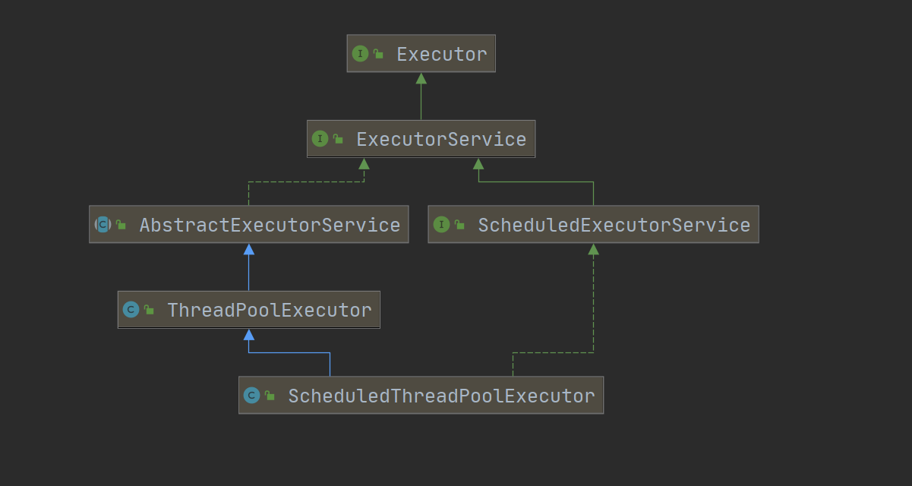
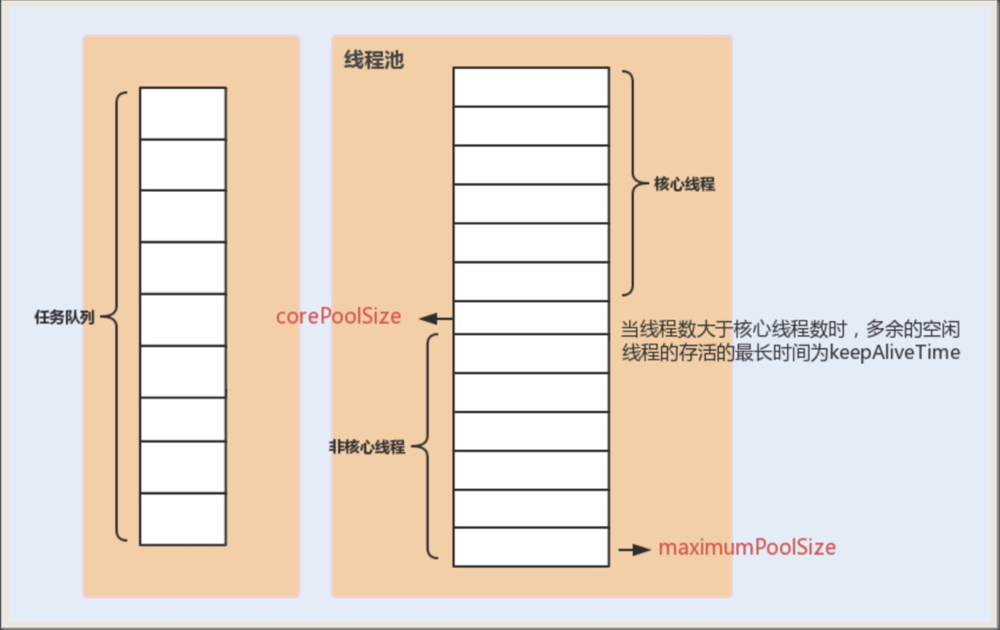
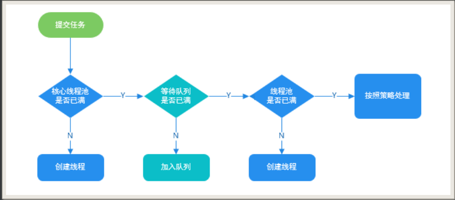

## 池化技术

池化技术有很多实现，例如线程池，数据库连接池，Http连接池等都是池化技术的具体应用，


主要思想就是减少每次获取资源的消耗，提高对资源的利用率


## 线程池简介

线程池提供了一套限制和管理资源的功能，还维护了一些基本的数据统计，例如已完成任务的数量


使用线程池的好处：

- 降低资源消耗
- 提升响应速度
- 提高线程的可管理性


Java对线程池的管理主要是由Executor来负责的


## Executor


Executor框架是在Java5之后引进的，使用Executor框架比直接使用Thread的start的方法来启用线程要好得多，除了易于管理，效率更高的优点外，还有关键的一点：有助于避免this逃逸问题

> this逃逸：
>
> ​	当一个线程在调用对象的构造方法时，另一个线程直接使用了这个还没构造好的对象引发的一系列令人迷惑的问题


Executor还提供了线程工厂，队列以及拒绝策略等


常见的实现类：ThreadPoolExecutor 和 ScheduledThreadPoolExecutor类，他们之间的继承关系如下图所示：




## ThreadPoolExecutor介绍


1.构造方法：

```java
public ThreadPoolExecutor(int corePoolSize,
                          int maximumPoolSize,
                          long keepAliveTime,
                          TimeUnit unit,
                          BlockingQueue<Runnable> workQueue,
                          ThreadFactory threadFactory,
                          RejectedExecutionHandler handler) {
    if (corePoolSize < 0 ||
        maximumPoolSize <= 0 ||
        maximumPoolSize < corePoolSize ||
        keepAliveTime < 0)
        throw new IllegalArgumentException();
    if (workQueue == null || threadFactory == null || handler == null)
        throw new NullPointerException();
    this.acc = System.getSecurityManager() == null ?
        null :
    AccessController.getContext();
    this.corePoolSize = corePoolSize;
    this.maximumPoolSize = maximumPoolSize;
    this.workQueue = workQueue;
    this.keepAliveTime = unit.toNanos(keepAliveTime);
    this.threadFactory = threadFactory;
    this.handler = handler;
}
```

其他的构造器都是直接调用的此构造器，进行了些默认配置


参数说明：

1. corePoolSize：最小可以同时运行的线程适量（核心线程的个数）
2. maximumPoolSize：最大线程数（核心线程+非核心线程）
3. keepAliveTime：当线程池的数量大于corePoolSize的时候，如果这时候没有新的任务提交，在线程池外的线程不会立即销毁，而是会等待keepAliveTime，超过时间才会被销毁（非核心线程的存在时间）
4. unit：keepAliveTime的时间单位
5. workQueue：当新任务来了之后会先判断线程池是否满，如果满了就将任务暂存到workQueue中
6. threadFactory：创建新线程的时候会调用到线程工厂
7. handler：饱和策略，后面会介绍


流程图



**将要执行的任务传进线程池中去，线程池会先用任务队列来接受任务（如果核心线程数都被占用了的话），非核心线程的存在时间为定义的keepAliveTime。**


ThreadPoolExecutor的饱和策略：

如果当前运行线程数达到最大并且任务队列已经排满了任务时候，有以下几种处理策略：

- `ThreadPoolExecutor.AbortPolicy`：直接抛出RejectedExecutionException异常
- `ThreadPoolExecutor.CallerRunsPolicy`：让传递该任务的线程调用execute（）方法来完成这个任务，但是会降低系统运行速度，如果能接受运行速度下降并且不能有任何消息丢失的话，使用这个策略
- `ThreadPoolExecutor.DiscardPolicy`：不抛出异常，直接丢弃
- `ThreadPoolExecutor.DiscardOldestPolicy`：丢弃最早的未处理的任务


>  	Spring通过ThreadPoolTaskExecutor或者我们自己创建ThreadPoolExecutor的时候默认使用的是ThreadPoolExecutor.AbortPolicy策略


推荐使用线程池代替线程的显示创建

> ​	阿里开发规范中，明确指出线程资源必须由线程池提供，不能在应用中显示的创建线程，并且使用ThreadPoolExecutor的构造函数来取代Executors的创建方式，这样更能明确线程的创建规则，避免资源耗尽的风险


## ThreadPoolExecutor小Demo

Runnable的Demo

线程池：

```java
public class ThreadPoolExecutorDemo {
    //线程池基本参数：线程池的最值，任务队列的长度，持续时间
    private static final Integer CORE_POOL_SIZE = 5;
    private static final Integer MAX_POOL_SIZE = 10;
    private static final Integer QUEUE_CAPACITY = 100;
    private static final Long KEEP_ALIVE_TIME = 1L;

    public static void main(String[] args) {
        //线程池创建
        ThreadPoolExecutor executor = new ThreadPoolExecutor(CORE_POOL_SIZE,
                MAX_POOL_SIZE, KEEP_ALIVE_TIME,
                TimeUnit.SECONDS, new ArrayBlockingQueue<>(QUEUE_CAPACITY),
                new ThreadPoolExecutor.CallerRunsPolicy());

        //任务创建
        for (int i = 0; i < 10; i++) {
            MyRunnable runnable = new MyRunnable("" + i);
            executor.execute(runnable);
        }

        //终止线程池
        executor.shutdown();

        while (!executor.isTerminated()){

        }
        System.out.println("Finish All Task");
    }
}
```


> executor.isTerminated函数：
>
> ​	当调用shudown或者shutdownNow方法后，所有任务提交完成后返回true，如果有任务没完成则返回false。while循环目的：防止有线程还在执行，而程序提前结束。


任务：

```java
public class MyRunnable implements Runnable {

    private String command;

    public MyRunnable(String command) {
        this.command = command;
    }

    @Override
    public void run() {
        System.out.println(Thread.currentThread().getName() + " Start Time : " + new Date());
        try {
            TimeUnit.SECONDS.sleep(5);
        } catch (InterruptedException e) {
            e.printStackTrace();
        }
        System.out.println(Thread.currentThread().getName() + " End Time : " + new Date());
    }
}
```


输出结果：

```
pool-1-thread-3 Start Time : Fri Mar 20 14:59:07 CST 2020
pool-1-thread-1 Start Time : Fri Mar 20 14:59:07 CST 2020
pool-1-thread-5 Start Time : Fri Mar 20 14:59:07 CST 2020
pool-1-thread-4 Start Time : Fri Mar 20 14:59:07 CST 2020
pool-1-thread-2 Start Time : Fri Mar 20 14:59:07 CST 2020
pool-1-thread-3 End Time : Fri Mar 20 14:59:12 CST 2020
pool-1-thread-1 End Time : Fri Mar 20 14:59:12 CST 2020
pool-1-thread-3 Start Time : Fri Mar 20 14:59:12 CST 2020
pool-1-thread-2 End Time : Fri Mar 20 14:59:12 CST 2020
pool-1-thread-1 Start Time : Fri Mar 20 14:59:12 CST 2020
pool-1-thread-5 End Time : Fri Mar 20 14:59:12 CST 2020
pool-1-thread-4 End Time : Fri Mar 20 14:59:12 CST 2020
pool-1-thread-5 Start Time : Fri Mar 20 14:59:12 CST 2020
pool-1-thread-4 Start Time : Fri Mar 20 14:59:12 CST 2020
pool-1-thread-2 Start Time : Fri Mar 20 14:59:12 CST 2020
pool-1-thread-1 End Time : Fri Mar 20 14:59:17 CST 2020
pool-1-thread-4 End Time : Fri Mar 20 14:59:17 CST 2020
pool-1-thread-3 End Time : Fri Mar 20 14:59:17 CST 2020
pool-1-thread-2 End Time : Fri Mar 20 14:59:17 CST 2020
pool-1-thread-5 End Time : Fri Mar 20 14:59:17 CST 2020
Finish All Task
```


简单分析：

execute（）方法执行过程




## 常见的比较


1.Runnable和Callable

Runnable自1.0起就一直存在，而Callable在1.5之后才进行了补充，目的就是为了解决Runnable无法抛出异常和无返回值的短板，如果不需要抛出异常和返回值，建议使用Runnable，迫不得已再去使用Callable

工具类Executors实现了Runnable和Callable之间的转换


2.execute（）和submit（）

execute方法用来提交不需要返回值的任务，即Runnable实现类，无法判断任务是否执行成功

submit方法用来提交需要返回值的任务，即Callable的实现类，返回一个Future对象，可以通过Future对象来判断是否执行成功，并且可以使用get方法来获取返回值【get方法是阻塞的】，可以使用get的重载方法get（long timeout，TimeUtil util）来阻塞一段时间后强制获取，有可能出现没有执行完的情况


3.shutdown（）和shutdownNow（）

shutdown：关闭线程池，线程池状态变为SHUTDOWN，不再接受任何任务，但是仍旧会执行队列中的任务

shutdownNow：关闭线程池，线程池状态变为STOP，终止当前任务和排队的任务，返回排队任务List


4.isShutdown（）和isTerminated（）

isShutdown：当调用shutdown方法后返回为true

isTerminated：调用shutdown后，所有任务提交完成即返回true，或者调用shutdownNow成功后返回true


## ThreadPoolExecutor小Demo

Callable的demo


线程池：

```java
public class ThreadPoolExecutorDemo {
    //线程池基本参数：线程池的最值，任务队列的长度，持续时间
    private static final Integer CORE_POOL_SIZE = 5;
    private static final Integer MAX_POOL_SIZE = 10;
    private static final Integer QUEUE_CAPACITY = 100;
    private static final Long KEEP_ALIVE_TIME = 1L;

    public static void main(String[] args) throws ExecutionException, InterruptedException {
        //线程池创建
        ThreadPoolExecutor executor = new ThreadPoolExecutor(CORE_POOL_SIZE,
                MAX_POOL_SIZE, KEEP_ALIVE_TIME,
                TimeUnit.SECONDS, new ArrayBlockingQueue<>(QUEUE_CAPACITY),
                new ThreadPoolExecutor.CallerRunsPolicy());

        ArrayList<Future<String>> futureList = new ArrayList<>();
        MyCallable callable = new MyCallable();
        for (int i = 0; i < 10; i++) {
            Future<String> future = executor.submit(callable);
            futureList.add(future);
        }

        //便利Future
        for (Future<String> i : futureList) {
            System.out.println(new Date() + "   " + i.get());
        }

        //关闭线程池
        executor.shutdown();

        while (!executor.isTerminated()){}

        System.out.println("Finish All Task");
    }
}
```


任务：

```java
public class MyCallable implements Callable<String> {
    @Override
    public String call() throws Exception {
        TimeUnit.SECONDS.sleep(1);
        return Thread.currentThread().getName();
    }
}
```


输出：

```
Fri Mar 20 15:28:19 CST 2020   pool-1-thread-1
Fri Mar 20 15:28:20 CST 2020   pool-1-thread-2
Fri Mar 20 15:28:20 CST 2020   pool-1-thread-3
Fri Mar 20 15:28:20 CST 2020   pool-1-thread-4
Fri Mar 20 15:28:20 CST 2020   pool-1-thread-5
Fri Mar 20 15:28:20 CST 2020   pool-1-thread-2
Fri Mar 20 15:28:21 CST 2020   pool-1-thread-4
Fri Mar 20 15:28:21 CST 2020   pool-1-thread-1
Fri Mar 20 15:28:21 CST 2020   pool-1-thread-5
Fri Mar 20 15:28:21 CST 2020   pool-1-thread-3
Finish All Task
```


## 常见的连接池比较

与其说是几个类，不如说是指定了部分参数的ThreadPoolExecutor


### 1.FixedThreadPool

通过executors工具类来创建出来的线程池，可重用固定线程数


调用public static ExecutorService newFixedThreadPool(int nThreads)或者

public static ExecutorService newFixedThreadPool(int nThreads, ThreadFactory threadFactory)来实现创建


>  参数说明：
>
> ​	nThreads：设置corePoolSize和maxinumPoolSize的值


所以FixedThreadPool的非核心线程为零。


为什么不推荐使用FixedThreadPool：

1.线程池中无非核心线程

2.FixedThreadPool的任务队列问LinkedBlockingQueue，是用链表实现的无界队列，有可能造成OOM


### 2.SingleThreadExecutor

SingleThreadExecutor也是使用Executors工具类创建的，只有单个核心线程，队列使用的也是LinkedBlockingQueue


不推荐原因：

1.只有一个核心线程，利用率低

2.和FixedThreadPool一样，可能会造成OOM


### 3.CachedThreadPool

CachedThreadPool的实现：

```java
public static ExecutorService newCachedThreadPool() {
    return new ThreadPoolExecutor(0, Integer.MAX_VALUE,
                                  60L, TimeUnit.SECONDS,
                                  new SynchronousQueue<Runnable>());
}
```

```java
public static ExecutorService newCachedThreadPool(ThreadFactory threadFactory) {
    return new ThreadPoolExecutor(0, Integer.MAX_VALUE,
                                  60L, TimeUnit.SECONDS,
                                  new SynchronousQueue<Runnable>(),
                                  threadFactory);
}
```


核心线程被设置成为0，非核心线程被设置成无穷大，如果当主线程的提交任务的速度大于CachedThreadPool的处理速度，那么会一直创建线程


不推荐使用CachedThreadPool的理由：如果处理器速度不行，就会创建大量线程，从而导致OOM


## ScheduledThreadPoolExecutor


