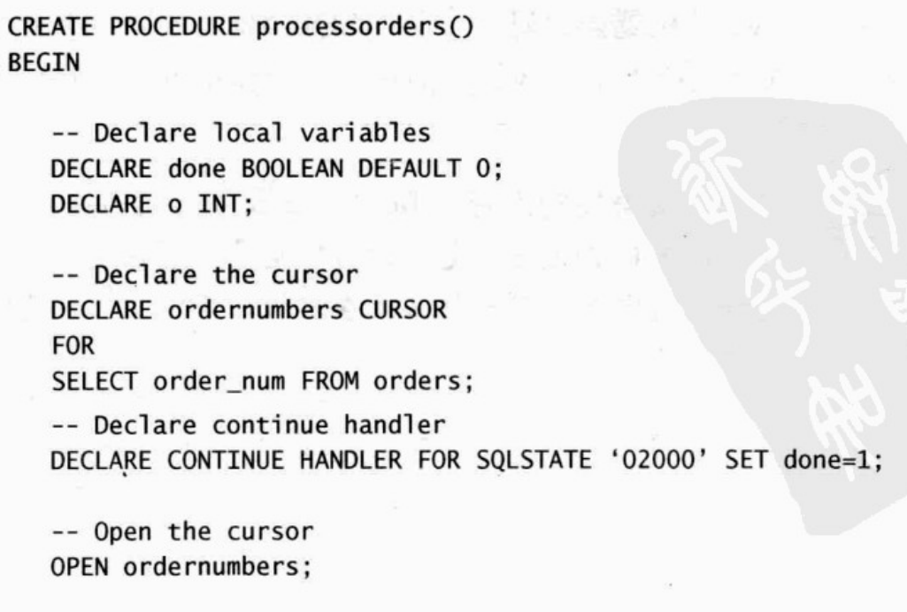

> 《mysql必知必会》读书笔记


目录完全按照mysql必知必会来


# 一、了解SQL


## 数据库基础


在深入了解MySQL之前有必要了解数据库的基础知识


### 什么是数据库

数据库是一种以某种方式有组织的方式存储的数据集合

理解数据库：将数据库想象成一个文件柜，此文件柜是一个存储文件的物理位置，不用管数据是如何存放的以及以什么方式存放的


:key:**数据库**（database）：保存有组织的数据的容器（通常是一个或者一组文件）

> :warning:：人们通常用数据库这个术语来表示他们使用的数据库软件，这是引起混淆的根源，数据库软件应该被称为DBMS（数据库管理系统），数据库是通过DBMS来操纵的容器，数据库是什么并不重要，因为你使用的是DBMS，他替你访问数据库。


### 表

表是一种结构化的文件，可以用来存储某种特定类型的数据


:key:**表**（table）：某种特定类型数据的结构化清单


存储于表中的数据应该是一种类型的数据或者是一个清单，绝不是根据业务逻辑将多个清单混合存入一个表中，这样会使得以后的检索和访问都很困难

数据库中的每个表都有一个唯一的名字

> :warning:：表名的唯一性取决于多个因素，例如数据库名，在不同的数据库中可以存在同名的表


表具有某些特性，描述表的这些信息就是所谓的模式，模式可以用来描述数据库中特定的表以及整个数据库和其中表的关系


:key:：**模式**（schema）：关于数据库和表的布局及特性的信息

> 有时候，模式用作数据库的近义词，模式的含义在上下文中不是很清晰


### 列和数据类型

表由列构成，列中存储表的各方面信息


:key:：**列**（column）：表中的一个字段，所有的表都是由一个列或多个列组成


正确得将数据分解成多个列及其重要，如果处理不好可能造成排序和过滤非常苦难


每个列都具有相应的数据类型


:key:**数据类型**（datatype）：所容许的数据类型，每个列都具有相应的数据类型，它限制（容许）该列中存储的数据


### 行


:key:**行**（row）：表中的一个记录

> 经常提到行（row）时将其称为数据库记录（record），很大程度上这两个术语是可以相互替代的，但从技术层面上来说行更规范


### 主键


表中的每一行都应该有可以唯一标识自己的一列（或一组列）


:key:**key**（primary key）：一列**（或一组列）**，其值能唯一区分表中的每一行

主键可以中来标识特定的一行，没有主键，更新和删除表中的某一特定行就很困难，因为有可能直接删除了多行

> 设计人员都应该保证他们创建的每个表都具有一个主键，以便于以后的数据操作和管理


只要满足一下条件，该列即可作为主键：

- 任意两行都不具有相同的主键值
- 每一行都必须要具有一个主键值（即主键值不能为NULL）

> 这里的规则是MYSQL本身强制施行的


主键通常作用在表的一个列上，但也可以使用多个列作为主键，使用多列作为主键时，上述条件作用于主键的所有列，但第二点有所改变，只需要列值的组合唯一即可（不需要保证单个列的值唯一）

>除以上MySQL强制要求的几点之外，应该还有以下好习惯：
>
>- 不更新主键列中的值
>- 不重用主键列的值
>- 不将可能更改的列定义为主键：例如如果使用供应商的名字作为主键，那么当供应商合并或者更改名字时，主键也要随之改变，不合理


还有一个重要的键：外键


## 什么是SQL

SQL是结构化查询语言（Structured Query Language）的缩写，SQL是一门专门永安里和数据库通信的语言，与其他的编程语言不同，SQL只有很少的关键字，这是为了提供一种从数据库中读写数据的简单有效的方法。

SQL优点：

- SQL不是某个特定数据库提供商专有的语言，几乎所有的DBMS都支持SQL
- SQL简单易学，都是用少量简单的英文单词描述
- SQL灵活性高，可以进行复杂和高级的数据库操作


> 事实上任意两个DBMS实现的SQL都不完全相同，虽然他们绝大多数语法相同，所以SQL语句不是可以完全移植的


# 二、MySQL简介


## 什么是MySQL


数据的所有存储，检索，管理和处理实际上是由数据库软件——DBMS来完成的，MySQL即是一种DBMS，他是一种数据库管理软件


MySQL的优点：

- 成本低：开源的，一般可以免费使用和免费修改
- 性能：MySQL执行非常快
- 可信赖：很多公司和站点都使用的是MySQL
- 简单：易于安装和使用


唯一缺点：不总是支持其他DBMS提供的功能和特性，这一步也在随着版本提升而改善


### 客户机-服务器软件

DBMS分为两类：

- 基于文件共享系统的DBMS
- 基于客户机-服务器的DBMS

前者包括微软的Access和FileMaker，一般用于桌面用途，不具有高可靠性

后者包括MySQL，Oracle以及SQL Server，将其分为两个部分，服务器部分是负责数据访问和处理的一个软件，运行在被称为数据库服务器的计算机上

客户机通过向服务器发送网络请求给服务器，进行数据处理并且返回数据（如果有返回值的话）

大多数网络连接都不具备对数据的访问权，甚至不具备对存储数据的驱动器的访问权，只是通过MySQL进行了交互

- 服务器软件为MySQL DBMS
- 客户机可以是MySQL提供的工具，脚本语言（Perl），web应用开发语言（JSP，PHP），程序设计语言（C，C++，Java）等


### MySQL版本


主要是DBMS版本引入的更改：

- 4：InnoDB引擎，事务处理，并，改进全文本搜索
- 4.1：函数库，子查询，集成帮助
- 5：存储过程，触发器，游标，视图


## MySQL工具


客户端工具推荐


### mysql命令行实用程序


使用注意点：

- 命令输入在>mysql之后（你也无法输入在前面）
- 命令用；或者\g结尾，不是Enter
- 输入help获取帮助（help select 获取 SELECT语句的帮助）
- 使用quit或者exit来退出命令行实用程序


> ​	即使你选择了使用后面所述的某个图形工具，也必须保证熟悉mysql命令行实用程序


### MySQL Administrator


MySQL官方提供的图形交互客户机，需要单独安装


### MySQL Query Broswer


MySQL官方提供的图形交互客户机，用来编写和执行MySQL命令


# 三、使用MySQL


## 连接


如果你使用的是本地服务器，并且试用MySQL，使用root登陆就可以了，但是在实际开发中需要用户列表，权限关联等操作来提升数据库的安全性


可以使用流行的navicat客户端来进行用户图形化操作

连接到MySQL需要以下信息：

- 主机名：本地就是localhost
- 端口，一般是3306
- 合法用户名
- 用户口令（密码）【如果需要】


以下均使用命令行工具来操作


## 连接


最初连接到MySQL，没有任何数据库打开让你使用，需要使用USE关键字来选择数据库

```mysql
USE （数据库表名）;
```

:key: 关键字（key word）：MySQL语言的保留字，不要使用mysql关键字去命名表和列


### 了解数据库和表


展示数据库和表

```mysql
SHOW DATABASES;
SHOW TABLES;
```


SHOW同样也可以用来展示列：

```mysql
SHOW COLUMNS FROM USER;
```

> SQL语句一般关键词用大写，自定义的表名或者数据库名用小写，尽管SQL是不区分大小写的，查询user表用以上语句不会报错

可以显示字段名，数据类型，是否允许为NULL，键信息，是否为auto_increment等


> 自动增量：
>
> ​	某些表需要使用唯一值来作为主键，可以代替手动分配唯一值，可以在create表格的时候b把它当作表定义的组成部分


> 上述语句可以使用DESCRIBE语句来代替，即DESCRIBE user是SHOW COLUMNS FROM user的简写


所支持的其他SHOW语句还有

- SHOW STATUS：显示服务器状态
- SHOW GRANTS：显示用户和其具有的权限
- SHOW ERRORS 和 SHOW WARNINGS：显示服务器错误或警告消息

更多SHOW语句用法可以执行HELP SHOW语句来查看


# 四、检索数据

如何使用SELECT 语句检索出一个或多个数据列


## SELECT语句


SELECT是非常常用的关键字

使用SELECT关键字必须给出两条信息：想选择什么，以及从什么地方选择


## 检索单个列


假设表的结构如图所示


检索username这一列

```mysql
 SELECT username FROM user;
```

即可，标准格式`SELECT (COLUMNS) FROM (TABLE)`

> 数据没有排序，输出的结果可能是数据被添加到表里面的顺序，也可能不是，只要返回相同的数目即是正常的

因为SQL语句（至少mysql）是遇到分号才算一条语句的结束，所以可以将一条语句拆分成多行（也是非常推荐的），这样便于阅读。


## 检索多个列


数据表还是如上图，假设要检索username和password这两个列

```mysql
SELECT username,password FROM user
```


SQL语句一般返回原始的，无格式的数据，至于数据的格式化问题，转换问题则是要在业务层中解决


## 检索所有列


使用通配符的方式来解决 *代表任意

```mysql
SELECT * FROM user
```

> :warning:：除非你要检索数据的每个列，最好别用*通配符，虽然省事儿，但是检索不需要的列通常会降低程序的性能


## 检索不同的行


如果检索单列，只需要MySQL返回不同的值

使用DISTINCT（不同的）关键字即可，如检索username，只要不重复的，用法如下

```mysql
SELECT DISTINCT username FROM user;
```

会返回不同结果的username


DISTINCT关键字直接作用于所有列，而不是他后面的那个列，如

```mysql
SELECT DISTINCT username,password FROM user;
```

唯有username和password都相同的列才会被省去


## 限制结果

限制SELECT的输出结果（只取前几行），使用LIMIT关键字

```MYSQL
SELECT * FROM user LIMIT 5;
```

至多返回5行数据，如果不足5行则直接返回


为了方便演示，使用Java插入了一些数据，便于查询

数据截图：


1~3的id已经被使用了，即使被数据被删除了也不能再次使用【主键的规则】

使用上述limit语句查询显示4~8的id数据


> :warning:： mysql的行索引是从零开始的

所以`SELECT * FROM user LIMIT 5`查询的是行索引为0~4的数据

使用`SELECT * FROM user LIMIT a,b`查询的是行下标从5开始后的五个数据


## 使用完全限定的表名


迄今为止使用的SQL例子都只是列名引用列，也可以使用完全限定的名字来限定列：

```mysql
SELECT user.id FROM user LIMIT 5;
```

也可以限定表名字

```mysql
SELECT user.id FROM test.user LIMIT 5;
```

通过 `表名.列名` 或者 `数据库名.表名` 来完全限定


# 五、排序检索数据

 

使用SELECT 的 ORDER BY 子句，根据需要排序检索出的数据


## 排序数据

使用 `SELECT * FROM user` 检索出的数据并不是纯粹的随机排列，如果不排序，数据一般都是按照它在底层表中出现的顺序显示，也就是数据插入的数据，但是如果后来对数据进行了更新或者删除的话，则此顺序会受到MySQL回收存储空间的影响，因此，如果不明确控制，不能依赖默认的排列顺序


:key:**子句**（clause）：SQL语句由子句构成，一个子句通常包括一个关键字和所提供的数据组成，有些子句是必须的，有些子句是可选的

像 `SELECT * FROM user LIMIT 5` 的SELECT语句的FROM子句就是必须的，而LIMIT子句就是可选的，此ORDER BY 子句就是可选的：

```mysql
SELECT * FROM user ORDER BY username LIMIT 10;
```

> 默认是升序排列，一般ORDER BY的字段都是检索的字段，但是ORDER BY没有检索的字段也是完全合法的


## 按多个列排序


经常会出现这种情况，如果显示雇员清单，由姓和名两列（首先按照性排列，在每个性中再按照名排列），实现此功能只需要指定列名，列名之间用逗号隔开即可


```mysql
SELECT first_name,last_name FROM user ORDER BY first_name,last_name;
```

会先按照firstname排序，再通过lastname排序firstname相同的数据

如果firstname都是唯一的，则不用对lastname进行排序


## 指定排序方向


默认是升序排序，如果要使用降序排序，则使用DESC关键字即可

按照降序排列username：

```java
SELECT * FROM user ORDER BY username DESC LIMIT 10;
```


DESC和DISTINCT关键字不同，DISTINCT关键字会作用于所有的列，让其都保持唯一，而DESC则只会保持其前面的列是降序的，其余列都是保持默认的升序


> 如果想让多个列都进行降序排列，则必须在每个列上都指定DESC关键字

默认的升序排列关键字是ASC，但是ASC用的非常的少，因为默认就是ASC的


> 区分大小写的排序设置：因为MySQL是不区分大小写的，所以A和a的排列地位是一样的，如果要进行区分，需要数据库管理员对数据库进行配置，用简单的ORDER BY是做不到的


使用ORDER BY找出id最大的值

```mysql
SELECT id FROM user ORDER BY id LIMIT 1;
```

先按照id降序排列，再取最上面一个即获取到id的最大值


> 子句会有位置的问题，例如：只有按照	FROM子句 + ORDER BY 子句 + LIMIT 子句才不会报错，否则会报错


# 六、过滤数据


使用SELECT语句的WHERE子句来指定搜索条件


## 使用WHERE子句


很少需要检索表中的所有行，往往只需要指定指定搜索条件，也叫过滤条件

```mysql
SELECT * FROM user WHERE id = 0;
```

WHERE子句不止仅能进行相等判断


> SQL过滤和应用过滤：
>
> 数据也可以再客户端这边过滤，即服务器端仅仅返回所有数据，然后再客户端这边去处理，这种实现很不令人满意，不仅会让客户机的效率大大降低，还会导致网络的数据传输量加大，造成带宽的浪费


>  子句的排列顺序为：FROM    WHERE   ORDER BY    LIMIT


## WHERE子句操作符


| 操作符  |        说明        |
| :-----: | :----------------: |
|    =    |        等于        |
|   <>    |       不等于       |
|   !=    |       不等于       |
|    <    |        小于        |
|   <=    |      小于等于      |
|    >    |        大于        |
|   >=    |      大于等于      |
| BETWEEN | 再指定的两个词中间 |


### 检查单个值


```mysql
SELECT * FROM user WHERE username = 'ECAC3';
```

>  使用单引号和双引号的效果相同


```mysql
SELECT * FROM user WHERE id < 10;
```


### 不匹配检查


```mysql
SELECT * FROM user WHERE id <> 10;
```

等价于

```mysql
SELECT * FROM user WHERE id != 10;
```


### 范围值检查


可以使用BETWEEN关键字，不过于其他WHERE子句的操作符稍有不同

```mysql
SELECT * FROM user WHERE id BETWEEN 5 AND 10;
```

> BETWEEN  a  AND  b
>
> 一定是查询大于等于a小于等于b的值


以上语句等价于：

```mysql
SELECT * FROM user WHERE id >= 5 AND id <= 10;
```


### 空值检查


设计表时候即可指定这个字段能否为NULL


:key: ：NULL	无值（no value），与包含字段0，空字符串不同


SELECT由一种特殊的WHERE子句来检查具有空值的NULL

```mysql
SELECT * FROM user WHERE password IS NULL;
```


> :warning:：在匹配过滤和不匹配过滤中都不会返回当前列为NULL的行


# 七、数据过滤

使用 WHERE 子句建立更强大的查询功能，和NOT 和 IN操作符


## 组合WHERE 子句


MySQL允许给出多个WHERE 子句，给出两种使用方式：以AND 子句或者以OR 子句的方式使用。


:key: **操作符**（operator）：用来连接或该表WHERE 子句中的子句关键字，也成为逻辑操作符


### AND 操作符

上面的那个user表不是很好用


新建一个product表，字段如下：


并在其中插入大量数据（Java操作，使用并发编程极大的提升了效率）


AND操作符：查询商品价格大于50的并且ID小于50的商品名称

```mysql
SELECT price FROM product WHERE id < 50 AND price > 50;
```

:key: **AND**：用在WHERE子句中的关键字，用来指定检索满足所有给定条件的行


> 上述条件只有两个，如果有多个，则必须都使用AND进行连接


### OR 操作符


指定MySQL检索匹配任一条件的行


如果需要检索price大于50或者ID小于50的商品名称：

```mysql
SELECT name FROM product WHERE price > 50 OR id < 50;
```


:key: OR：WHERE子句的关键字，用来检索匹配任一给定条件的行


### 计算次序


可以结合AND和OR关键字来完成复杂的查询操作


AND关键字的优先级比OR高，有可能造成操作符的错误组合

例如：查询 id在 大于两百或小于20 价格大于50的商品详细信息

```mysql
SELECT * FROM product WHERE id >200 OR id < 20 AND price >50;
```

如果不做任何其余的处理，MySQL会理解成为查询id大于200的商品或者是 id小于20且价格大于50的商品，有歧义


解决方法：使用（）来限定操作顺序


> 充分利用圆括号，不要过度的依赖于默认的计算次序，即使他确实是你想要的东西也是如此，使用圆括号没有坏处，能消除歧义


## IN 操作符


圆括号还可以结合IN 操作符，来指定条件取值

如要查询id为1，2，250的商品详细详细，可以使用IN 操作符

```mysql
SELECT * FROM product WHERE id IN (1，2，250)；
```

以上语句等价于下列语句

```mysql
SELECT * FROM product WHERE id = 1 OR id = 2 OR id = 250;
```

使用IN 操作符的优点：

- 语法清楚直观
- 操作次序易管理（减少了操作符的数量）
- 比OR操作的执行效率高
- 可以包含其他SELECT 语句


:key: **IN** ：WHERE子句的指定匹配值的关键字，功能与OR相当


### NOT操作符


:key: NOT：WHERE子句中用来否定后跟条件的关键字


例子：用来列出id除1和2以外的所有商品

```mysql
SELECT * FROM product WHERE id NOT IN (1,2);
```


> mysql中的NOT关键字只支持对IN，BETWEEN和EXISTS子句取反，与其他的DBMS有很大的差距


# 八、使用通配符进行过滤


## LIKE操作符


前面介绍的操作符都是对已知的数据进行过滤，这种过滤方法很有局限性，例如如何查找名字 中包含a的产品，可以构造一个**通配符搜索模式**来解决这个问题


:key: 通配符（wildcard）：用来匹配值的一部分的特殊字符

:key:搜索模式（search pattern）：由字面值，通配符构成的搜索条件


为在搜索模式中使用通配符，必须使用LIKE关键字


### 百分号（%）通配符

最常用的通配符就是%，他表示任意字符出现任意次数（可以出现0次）


检索a开头的商品的详细详细：

```mysql
SELECT * FROM product WHERE name LIKE 'a%';
```

> 以上SQL语句可以匹配到名字为a的商品


检索名字中包含a3的商品的详细详细

```mysql
SELECT * FROM product WHERE name LIKE '%a3%';
```


检索以2开头，以1结尾的商品的详细信息

```mysql
SELECT * FROM product WHERE name LIKE "2%1";
```


:warning:：即使通配符%可以匹配任何字段，但也没法匹配NULL


### 下划线（_）通配符


_只能匹配单个字符，不能多也不能少


```mysql
SELECT * FROM product WHERE id LIKE "23a31_";
```


## 通配符使用技巧

通配符很有用，但是有代价的，通配符花费的时间一般比其他搜索的时间更长

下面给出一些使用技巧：

- 尽量使用其他操作符，不要过分依赖通配符
- 除非真的有必要，否则不要把通配符置于搜索模式的开始处，效率会比较低
- 仔细确定通配符的位置


# 九、用正则表达式进行搜索


## 正则表达式简介

前面的通配符对于基本的过滤是够用了，但是随着过滤条件的增加，WHERE子句本身的复杂性也会增加

正则表达式（regexp）可以用来匹配文本的特殊的串，正则表达式也广泛用于程序设计，文本编辑器，操作系统等


## 使用正则表达式


MySQL可以使用正则表达式，过滤SELECT检索出的数据


> MySQL仅支持正则表达式的一个很小的子集


### 基本字符匹配


检索包含a字符的商品的详细信息

```mysql
SELECT * FROM product WHERE name REGEXP "a";
```

当然，这个例子也可以轻松使用LIKE去完成，甚至效率会更高，但是某些情况必须要用到正则表达式（例如只允许匹配到数字，通配符是不提供这个功能的）


> LIKE和REGEXP的区别：
>
> - SELECT * FROM product WHERE name LIKE "1000";
> - SELECT * FROM product WHERE name REGEX "1000";
>
> 第一条语句只会返回name为1000的数据（没有通配符）
>
> 而第二条语句会返回包含1000的name的数据，如果要第二条语句也像第一条语句一样只返回name为1000 的数据，则需要使用到^和$定位符


### 同时匹配多个字符中任意一个


为搜索两个串之一，可以使用 | 操作符，例子：

匹配name中包含d3或者23的字符

```mysql
SELECT * FROM product WHERE name REGEXP "d3|23";
```

| 为正则表达式的OR操作符，如果有多个OR条件，则使用多个| 如 WHERE name REGEXP "d3|23|33";


### 匹配几个字符之一


如果想匹配指定的几个字符之一，则使用[和]来完成

例如，想检索id 为 11，21，31的商品详细信息

```mysql
SELECT * FROM product WHERE id REGEXP "[123]1";
```

但是会检索出id为210的数据 :laughing:例子举的不好，大概这个意思把


### 匹配范围

如果要匹配数字0~9，可以使用[0123456789]去进行匹配，为简化，可以使用-，上述式子等价于[0-9]


例如：

```mysql
SELECT * FROM product WHERE id REGEXP "[1-2][5-6][7-8]"
```

即可匹配到名字中包含157，158，167，168，257，257，267，268的数据


也可以指定匹配a到z的字符，如下：[a-z]


### 匹配特殊字符

如果要匹配名字中包含.的商品，使用如下SQL语句

```mysql
SELECT * FROM product WHERE name REGEXP ".";
```

则会返回所有，因为.可以匹配任意字符

正确SQL语句为：

```mysql
SELECT * FROM product WHERE name REGEXP “\\.”
```

正则表达式里面具有特殊意义的字符都需要使用\\\来转义，有些字符转义后也会有特殊的意义，如：


> 如果是要匹配  \ 的话，则需要使用   \  \  \ 来匹配


### 匹配字符类

为简化常用的匹配规则，将其抽取出来成为字符类


:warning:：有些地方用不了，尽量少用


### 匹配多个实例

到目前为止正则表达式还只能匹配到单个的字符，如果要同时匹配99个s，你不可能写99个s到正则表达式中把，可以使用重复元字符来进行更强的控制


| 元字符 |             说明             |
| :----: | :--------------------------: |
|   *    |         0或多个字符          |
|   +    |    1或多个字符，等价{1，}    |
|   ？   |    0或1个字符，等价{0，1}    |
|  {n}   |        指定数目的匹配        |
| {n，}  |     不少于指定数目的匹配     |
| {m，n} | 匹配指定的范围（m不超过255） |


- 如果要匹配	(1 stick)  和  (5 sticks)

使用如下正则表达式

```regexp
\\([0-9] sticks?\\)
```

- 匹配连在一起的四位数字

```regexp
[0-9]{4}
```


### 定位符

指定匹配文本的位置


| 元字符  |   说明   |
| :-----: | :------: |
|    ^    | 文本开始 |
|    $    | 文本结束 |
| [[:<:]] | 词的开始 |
| [[:>:]] | 词的结束 |


如果要匹配所有以数字开头（包括小数点）的商品，SQL如下

```mysql
SELECT * FROM product WHERE name REGEXP "^[0-9\\.]";
```

> 一旦  . 放到了[] 里面去了，   .就会自动转义成  \ \ .   为了避免歧义，还是写成\ \ .  


   


# 十、创建计算字段


## 计算字段


存在很多情况，存储在表中的数据都不是应用程序所需要的，我们希望直接在数据库层面上检索，转换出需要的数据，而不是直接检索出所有数据，再传递给客户端去重新在应用程序中格式化。这就依赖于计算字段了


与前面所介绍的列不同，计算字段并不实际存在于数据库表中，计算字段是运行SELECT语句内创建的


:key: 字段（field）：基本和列的意思相同，习惯上将数据库列称为列，字段一般用在计算字段的连接上


在客户机的角度上：计算字段和普通的列是一样的


> 能在服务器端完成的操作一般也能在客户机完成，但一般来说在服务器端的运行速率比客户机的处理效率要高


## 字段拼接


:key: 拼接（concatenate）：将值连接到一起形成单个值


要将商品的名称和价格按照：名称（价格）的格式来给定

解决方法：使用Concat函数来拼接两个列

```mysql
SELECT Concat(name,"(",price,")") from product;
```

Concat 函数具有拼接字符串的作用，形成一个长串，列名为Concat(name,"(",price,")")

:warning:如果查询的name或者price其中一个是NULL的，那么整个列就是NULL


可以通过删除name右侧的空格来整理数据，通过RTrim（）函数来完成

上面的SQL可以优化为：

```mysql
SELECT Concat(RTrim(name),"(",RTrim(price),")") from product;
```

去掉了数据右侧的空格，减少了网络的带宽浪费

> RTrim去除右侧空格，LTrim去除左侧空格，Trim去除左右空格


**使用别名来优化查询结果的列名显示**，因为客户端无法识别列名Concat(RTrim(name),"(",RTrim(price),")")

优化成为去除左右两边空格

```mysql
SELECT Concat(Trim(name),"(",Trim(price),")") product_info from product;
```

> 标准格式应该为：SELECT Concat(Trim(name),"(",Trim(price),")") AS product_info from product;   不过AS关键字可以省略


## 执行算术计算


如果有一张订单表，里面存有三列，分别为订单号，单价和数量，现在算出每个订单号的总价

我们就不新建表了，直接使用product表，用id代表数量，price代表单价

计算总价：

```mysql
SELECT name,id,price,id*price AS total FROM product ORDER BY name
```

> 其他算术操作符： +  -   *   /


> 可以使用SELECT关键字来简单的访问和处理表达式，如：
>
> - 算术运算： SELECT 1*10;
> - 去除空格：SELECT Trim("  a  b  c  ");
> - 返回当前时间：SELECT Now();


# 十一、使用数据处理函数


## 函数

SQL支持函数来处理数据，前一章中处理数据左右空格的Trim（）就是一个函数


> 函数的可移植性就没有SQL的可移植性强，因为每种DBMS的SQL都是大同小异的，且都支持一些操作，只要修改一些关键词即可
>
> 而每个BDMS都实现了大量特定的函数，不易在不同的DBMS中间移植


## 使用函数


大多数的SQL都实现了以下类型的函数：

- 处理文本串的文本函数（删除填充数值，大小写转换等）
- 算术运算的数值函数（返回绝对值，进行代数运算）
- 用于日期处理的函数
- 返回System的信息的函数


### 文本处理函数

去除左右空格的Trim函数我们已经见过了，再来介绍一个常用的

让字母大写的函数Upper函数


```mysql
SELECT Upper(name) AS upper_name FROM product LIMIT 5;
```

还有一些常见的文本处理函数如下：

|     函数      |       功能        |
| :-----------: | :---------------: |
|   Left（）    | 返回串左边的字符  |
|  Length（）   |   返回串的长度    |
|  Locate（）   | 找出串的一个子串  |
|   Lower（）   |  将串转换为小写   |
|   LTrim（）   |   去除左边空格    |
|   RTrim（）   |   去除右边空格    |
|   Rigth（）   | 返回串右边的字符  |
|   Upper（）   |  将串转换出大写   |
| SubString（） |  返回子串的字符   |
|  Soundex（）  | 返回串的SOUNDEX值 |


Soundex函数将串转换出为SOUNDEX（类似的发音字符和音节）


使用的时候了解下语法就行了


### 日期和时间处理函数


我们以前只是使用WHERE关键字来过滤字符和数值的操作，也可以使用WHERE关键字来过滤时间日期操作


和Java的一样，MySQL使用的日期格式也为 yyyy-mm-dd


使用datetime的数据类型来存储时间


在Easy Code的插件的MySQL的字段和Java的类之间的转换可以看出：


datatime和timestamp会被转换成为Java的Data数据类型


设计表为：


千万别把表名设置成了order，order 是 关键字，会报错

此时数据表中的所有数据为：


如果此时要查询order_date为2000-09-01的订单，使用以下SQL语句

```mysql
SELECT * FROM orders WHERE order_date = "2000-09-01";
```

只能查询出订单号为2的数据，即如果没有指定到时分秒，默认都是补零，这与我们实际当中的用法有很大的冲突

解决方法：使用库函数将order_date的日期部分拿出来作比较即可

```mysql
SELECT * FROM orders WHERE Date(order_date) = "2000-09-01";
```


> 在你仅需知道的是日期的时候，可以直接使用Date（）函数，尽管你知道相应的列只包含日期也是如此，如果只想获取时间，同样也可以使用Time（）函数
>
> 这两个函数都是在MySQL 4.1.1 之后引入的


还有一种情况就是只要获取2000年09月的订单：


- 可以使用

```mysql
 SELECT * FROM orders WHERE Date(order_date) BETWEEN "2000-09-01" AND "2000-09-30";
```

但是如果你误将9月记成了31天，那么就会一条数据也输不出来，尽管这些数据都是满足要求的，但是MySQL会自动的检测你输入的日期是否合法，不合法也只会给你一个Warning


- （不需要记住每个月有多少天的方法）

```mysql
 SELECT * FROM orders WHERE Year(order_date) = “2000” AND Month(order_date) = ”9“;
```


最好碰上时间数据都加上引号，`Year(order_date) = 2000` 也是合法的，但是`Date(order_date) = 2000-09-01`就是违法的了


> :warning:：在数据库规范中没有双引号，一般都是单引号


### 数值处理函数


用来进行数值处理，运用的往往不如日期的函数那么频繁，但是却是各个DBMS最统一的一块


# 十二、汇总数据


## 汇集函数


我们经常只需要数据的汇总情况，而不是每一条数据的详细信息，主要的检索例子有以下几种：

- 确定行数
- 确定行组的和
- 找出列的最大值，最小值，平均值

如果将这些任务交给客户端去处理，不仅客户机要编写相应的处理函数，还会增加信息传输造成的带宽浪费（前提是你仅仅只想知道上述罗列的检索）


:key:聚集函数（aggregate function）：运行在行组上，计算和返回单个值的函数。


> MySQL还支持一些标准偏差函数，这里没有列举


### AVG（）函数


返回product的price字段的平均值

```mysql
SELECT AVG(price) FROM product;
```

或者id<50的price平均值

```mysql
 SELECT AVG(price) FROM product WHERE id < 50;
```


AVG函数只能返回单个列的平均值，如果要输出多个列的平均值，要多次使用AVG函数

> AVG函数在统计时自动忽略 NULL 值


### COUNT（）函数

返回检索出的数据的行数

COUNT的两种使用方式：

- 使用COUNT（*）直接检索行数，不去管行中是否有NULL值
- 使用COUNT（Field）会返回该字段非NULL的行数


可以通过这种方式确定列password存在一个NULL


### MAX（）函数

返回指定列的最大值，简单用法：

```mysql
SELECT MAX(price) FROM product;
```

虽然MAX函数一般是用来对数据和日期来返回最大值，但也可以返回文本列的最大值，自动返回升序的最后一行


> MAX函数自动忽略NULL的行


### MIN（）函数


返回列的最小值，用法与MAX差不多


```mysql
SELECT MIN(price) FROM product;
```


### SUM（）函数

可以直接嵌套*运算计算总金额

```mysql
SELECT SUM(id*price) FROM product;
```

一样忽略NULL


## 聚焦不同值


主要是DISTINCT的使用，DISTINCT默认直接限制后面所有的列


计算所有price的平均值（去除权重）

```mysql
 SELECT AVG(DISTINCT price) FROM product;
```

计算不同name的数量

```mysql
SELECT COUNT(DISTINCT name) FROM product;
```


name字段中重复的和为NULL的行数：

```mysql
SELECT COUNT(*)-COUNT(DISTINCT name) name_num FROM product;
```


## 组合聚集函数


就是SELECT里面包含多个函数


```mysql
SELECT COUNT(*),AVG(price),MAX(price) FROM product;
```

可以给每个字段取个别名，便于理解和复用


# 十三、分组数据


## 数据分组


会有这种情况，统计每个厂商的产品的平均价格，最大价格，最小价格等，统计其中一个厂商我们可以轻而易举的达到，但是要一次统计多个，我们还办不到，这就需要数据分组


## 创建分组


数据库表模拟（表名最好都带上s）：


```mysql
SELECT vend_id,AVG(price) FROM products GROUP BY vend_id;
```

结果如图所示


因为使用了GROUP BY 进行了分组，统计结果就是对每个组而言的，而不是对整个集进行聚集


GROUP  BY可以进行嵌套，还有很多细微规定。


一旦使用了 GROUP BY 关键字后，除了根据分组的那个变量以外，其他变量都是去了意义，只有他们的统计量有意义

例如上面的例子中，只有每一行数据的vend_id有意义，其他的字段只有他们的SUM，MAX等才有意义


## 过滤分组


使用GROUP BY 进行分组后，如何进行操作筛选掉一些不满足条件的组呢？不能使用WHERE子句，WHERE只能操作行，要使用HAVING子句


可以使用HAVING子句代替所有的WHERE子句


> HAVING和WHERE的区别：WHERE用来过滤操作行，而HAVING用来直接过滤操作一个分组


HAVING由于是站在组的基础上的，所以他只支持一些统计量如AVG，SUM，MIN，MAX的判断，不能直接指定单个值的判断


WHERE和HAVING复用的例子：

对id大于8的行根据vend_id进行分组，并且筛选出平均价格大于70的数据，并展示平均价格


关键词使用的顺序：

SELECT-->FROM-->WHERE-->GROUP BY-->HAVING-->ORDER BY-->LIMIT 


## 分组和排序


GROUP BY 和 ORDER BY 的比较


|     ORDER BY     |             GROUP BY             |
| :--------------: | :------------------------------: |
|  排列产生的顺序  |      将行分组，输出统计数据      |
| 任意列都可以使用 | 只能使用选择列和其他列的聚集函数 |
|                  |                                  |

> 一般使用GROUP BY  语句时候也应该给出ORDER  BY 语句用来排序，不要过分依赖于默认的排序序列


以products表为例子，id为数量，price为单价，输出总价格超过1000的厂商vend_id，并以总价降序排列。

```mysql
SELECT vend_id,SUM(id*price) FROM products GROUP BY vend_id HAVING SUM(id*price) > 1000 ORDER BY SUM(id*price) DESC;
```

建议给SUM（id*price）起一个别名total来使得SQL语句更易读


```mysql
SELECT vend_id,SUM(id*price) AS total FROM products GROUP BY vend_id HAVING total> 1000 ORDER BY total DESC;
```


## SELECT子句顺序


必须遵守以下顺序：

SELECT-->FROM-->WHERE-->GROUP BY-->HAVING-->ORDER BY-->LIMIT 


# 十四、使用子查询


## 子查询


至今我们见到的所有SELECT语句都是简单查询，即从单个数据库表中检索数据的单条语句


:key:查询（query）：此术语一般指SELECT 语句


SQL还允许创建子查询，即嵌套在其他查询中的查询


## 使用子查询进行过滤


直接使用《MySQL必知必会》里面的表了


现在要查询订单TNT2的所有客户，思路如下：

1. 到orderitems中查询出TNT2所对应的order_num
2. 到orders表中查询出order_num所对应的cust_id
3. 到customers表中查询出cust_id所对应的客户信息


直接使用嵌套的SELECT语句

```mysql
SELECT * FROM customers WHERE cust_id IN (SELECT cust_id
 FROM orders WHERE order_num IN (SELECT
 order_num FROM orderitems WHERE prod_id = "TNT2"));
```

SELECT子句由里向外执行


## 作为计算字段使用子查询


要显示customers表中各个客户的订单数量


1. 从customers中获取所有cust_id
2. 在orders表中检索出cust_id对应的行数，并返回给customers显示


与上面例子的区别就在于要多显示一列计算字段，而上一个例子中所有的字段都是SELECT最外层表的字段


```mysql
SELECT cust_name,cust_state,(SELECT Count(*) FROM orders WHERE orders.cust_id = customers.cust_id) AS num FROM customers ORDER BY cust_name;
```

上面的orders表中和customers表中都有cust_id字段，需要使用全限定名


> 这不是最有效的解决方案


# 十五、联结表


## 联结


SQL最强大的地方在于查询数据的时候使用联结表


### 关系表


SQL规定将数据分表存储，例如vendors表和products表，完全可以将供应商信息带在产品后面，但是SQL规定要拆开：

- 很多product的vendor都是相同的，重复存储信息造成浪费
- 如果供应商的某些信息改变了，只需要改vendors表一处即可
- 如果都带上，有可能出现录入错误的情况


关系表的设计就是要保证把信息分解成多个表，一类数据一个表，各表之间通过某些常用的值（关系）互相关联


例如上述例子，products将vendors的id以外键形式存储于表中，将vendors和products表关联


:key: 外键：外键为某个表的一列，他包含着另外一个表的主键值，定义了两个表之间的关系。


> 外键仅仅保证了当前列的值是在其他表的主键中存在的


好处如下：

- vendors信息不重复
- 如果vendor需要更新信息，只需要修改vendors的一行即可
- 数据无重复，一致性高


关系数据库的可伸缩性远比非关系型数据库好


:key: 可伸缩性（scale）：能够适应不断增加的工作量而不失败


### 为什么要使用联结


虽然数据存在于多个表中，增加了数据库的可伸缩性，但是有代价的

如何使用SELECT语句检索出数据呢？

使用联结，在一条SELECT 语句中关联表，返回我们需要的数据


## 创建联结

非常简单，指定要联结的数据表和他们之间如何关联的即可


如：联结products和vendors表，通过vend_id

```mysql
SELECT vend_name,prod_name,prod_price FROM products,vendors WHERE vendors.vend_id = products.vend_id ORDER BY vend_name,prod_name;
```

这里因为两个表都有vend_id字段，所以需要指定全限定列名


### WHERE子句的重要性

在一条SELECT语句中联结几个表时，相应的关系是在运行时构造的，在数据表的定义过程中数据库是不知道他们之间的关系的


:key: 笛卡尔积：没有联结条件（WHERE子句）的表关系返回的结果为两个表的笛卡尔积（查询出的行数是第一个表的行数乘上第二个表的行数）


> 应该保证所有联结都有WHERE子句和WHERE子句的正确性


### 内部联结

目前所用的联结都是等值联结，基于两个表的相等测试，也被称为内部联结


```mysql
SELECT vend_name,prod_name,prod_price FROM products,vendors WHERE vendors.vend_id = products.vend_id ORDER BY vend_name,prod_name;
```

上面的SQL语句可以用以下的SQL语句来替换：

```mysql
SELECT vend_name,prod_name,prod_price FROM vendors INNER JOIN products ON vendors.vend_id = products.vend_id;
```

:warning:：SQL规范推荐首选INNER  JOIN  语法，尽管WHERE语法会简单


### 联结多个表


联结orderitems，products，vendors，查询order_num为20005的prod_name,vend_name,prod_price,quantity.


多表联结使用WHERE：

```mysql
SELECT prod_name,vend_name,prod_price,quantity FROM products,vendors,orderitems WHERE order_num=20005 AND orderitems.prod_id = products.prod_id AND products.vend_id = vendors.vend_id;
```


> mysql联结的表越多，性能下降的越厉害


例子回顾：查询订购产品的TNT2的用户：

使用子查询（复杂）：

```mysql
SELECT * FROM customers WHERE cust_id IN (SELECT cust_id
 FROM orders WHERE order_num IN (SELECT
 order_num FROM orderitems WHERE prod_id = "TNT2"));
```

使用联结查询：

```mysql
SELECT customers.* FROM customers,orders,orderitems WHERE prod_id="TNT2" AND orderitems.order_num=orders.order_num AND orders.cust_id = customers.cust_id;
```

列出所有情况即可，明显使用联结查询更加的简单


:warning: ：联结是SQL中最重要最强大的特性


# 十六、创建高级联结


## 使用表别名


SQL除了可以给列起别名，还可以给表起别名：

- 缩短SQL语句
- 允许在单条SQL中使用多次相同的表


表别名与列别名不同，只有在SQL语句中有效，不会返回到客户机上，而列别名可以直接返回到客户机上【表别名似宏，而列别名类似函数】


## 使用不同类型的联结：

我们只使用到了内部联结或等值联结的简单联结，下面介绍几种其他的：


### 自联结


会有如下情况：

在products表中，有一物品【ID为DTNTR】存在问题，要查询出该厂商的其他产品是否也存在问题，子查询的解决方案：

```mysql
SELECT * FROM products WHERE vend_id = (
SELECT vend_id FROM products WHERE prod_id = "DTNTR");
```

使用联结和表别名来解决此问题：

```mysql
 SELECT p1.* FROM products AS p1,products AS p2 WHERE p2.prod_id = "DTNTR" AND p1.vend_id = p2.vend_id;
```

尽量使用联结来代替子查询


### 自然联结


我们建立的每个内部联结【等值联结】都是自然联结，很可能我们永远也不会用到除了内部链接【等值联结】之外的自然联结了


### 外部联结


内部链接与外部链接最大的区别：都是先将两个表做笛卡尔积，内部链接则会直接筛去没有关联的行，而外部链接不会这样，他会保证左边表的数据永远是齐全的，如果联结的表没有数据就填充NULL。


例如：要检索所有客户以及他们的订单：

内部链接：

```mysql
SELECT customers.cust_name,order_num FROM customers INNER JOIN orders ON customers.cust_id = orders.cust_id;
```


外部联结：

```mysql
SELECT customers.cust_name,order_num FROM customers LEFT OUTER JOIN orders ON customers.cust_id = orders.cust_id;
```


显然此时的外部链接更加的合理，因为也需要没有订单的客户信息


左外联和右外联是有区别的


图解：内部链接只包含Table A和Table B共有的那一部分

而左外连包含的是Table A的全部

而右外联包含的是Table B的全部


## 使用带聚集函数的联结


例子：检索所有客户和每个客户所下订单数

涉及到的表为orders和customers

```mysql
SELECT customers.cust_name,count(*)  FROM customers INNER JOIN orders ON customers.cust_id = orders.cust_id GROUP BY cust_name;
```


成功漏掉订单为NULL的用户信息

使用左外连：

千万不能再使用count(*)来查询商品的数量了，因为INNER JOIN会帮你自动去除NULL，所以Count（ * ）等于 order_num 的数量，要使用 Count（orders.order_num）来查询

```mysql
 SELECT customers.cust_name,count(order_num) FROM customers LEFT OUTER JOIN orders ON customers.cust_id = orders.cust_id GROUP BY cust_name;
```


## 使用联结和条件联结

联结及其使用的要点：

- 注意使用的联结类型。一般都是使用内部链接，但有时候会出现无法对应的情况也要使用外连接
- 保证正确的联结条件。
- 应该总是给出联结条件，否则就是笛卡尔积了。
- 如果有多种联结再一条语句中，建议先测通每个联结再进行合并


# 十七、组合查询


## 组合查询


多数的SQL只支持单条SELECT语句（前面的使用子查询本质上也是单条SELECT 语句的复用），而MySQL也支持执行多个查询，并将结果作为单个结果集返回，这些组合查询通常被称为并（union）或复合查询（compound query）


使用组合查询的情况：

- 从不同的表返回类似结构的数据
- 单表执行多个查询，按单个查询返回数据


组合查询可以与具有多个WHERE 子句的SELECT 语句相互转换，在两者间进行取舍的时候，要自己手动实验以测验哪种效率更高


## 创建组合查询


用UNION操作符来组合多条SQL语句


### 使用UNION

给出每条SELECT 语句，在各条SELECT 语句之间放上关键字UNION


例如：想要价格小于5的物品的所有信息，并且还包括供应商1001和1002生产的所有产品的信息，虽然可以使用WHERE子句直接完成，不过这次使用UNION


多个WHERE子句完成：

```mysql
SELECT * FROM products WHERE prod_price<5 OR vend_id IN ("1001","1002");
```

用UNION联合查询

```mysql
SELECT * FROM products WHERE prod_price<5
UNION
SELECT * FROM products WHERE vend_id IN (1001,1002);
```


UNION简单的完成数据拼接，需要列相同。

在单个表中看来UNION比较复杂，在涉及到多个表时UNION可能会比较简单


### UNION规则


- 必须由两条及以上的SELECT 语句构成
- 每个查询都必须包含相同的列，表达式，或聚集函数（不用在意次序）
- 列的数据类型必须兼容


### 包含或取消重复的行


UNION已经自动的帮我们取消了重复的行，例如上面举出的例子，价格小于5的商品有四件，为指定厂商生产的产品为5件，应该有九件才对，这是基于UNION的去重


如果不想让UNION去重（这种情况非常少见），可以使用UNION ALL 操作

```mysql
 SELECT * FROM products WHERE prod_price<5
    -> UNION ALL
    -> SELECT * FROM products WHERE vend_id IN (1001,1002);
```

此时就会返回9行数据


### 对组合查询进行排序

在UNION组合查询的时候，只允许在最后一个SELECT语句的末尾使用一次ORDER BY 语句，即全局的排序【不允许部分排序】


SQL语句如下：

```mysql
mysql>  SELECT * FROM products WHERE prod_price<5
    -> UNION
    -> SELECT * FROM products WHERE vend_id IN (1001,1002) ORDER BY vend_id;
```


> 此章的例子比较简单，UNION也可以用来组合不同的表


# 十八、全文本搜索


> 并不是所有的引擎都支持全文本搜索，MySQL支持几种基本的数据库引擎，如MyISAM和InnoDB，前者支持全文本搜索，后者不支持


## 理解全文本搜索


第八章介绍的LIKE可以运用通配符来匹配文本和部分文本

第九章介绍了使用正则表达式来进行较为复杂的匹配模式


重要限制：

- 性能不高：随着数据量的增大表现得越来越明显
- 难以明确控制：很难（甚至有时候没办法）去指定某个一定要匹配，某个词一定不能匹配
- 无法提供智能化的结果：即无法按照最好的匹配度来排序


这些限制可以使用MySQL的全文本搜索来解决


## 使用全文本搜索


为了防止每次都要扫描全部的行，必须先索引被搜索的列，而且会随着数据的改变索引也会更新


### 启用全文本搜索支持


一般在创建表格时候启用全文本搜索，使用FULLTEST子句，知道格式即可：


:warning:：如果创建一个新表，并且向表中导入数据，创建新表时就不应该指定FULLTEST子句，应该在数据导完之后再进行指定，这样会提升效率（如果先前就指定了的话那么每一次导入数据MySQL就会对数据进行一遍重新的索引）


### 进行全文本搜索


再索引之后，使用Match和Against函数来执行全文本搜索，Match指定被搜索的列，Against指定搜索表达式


索引note_text列中包含rabbit关键词的行

```mysql
mysql> SELECT * FROM productnotes WHERE Match(note_text) Against("rabbit");
```


Match函数参数指定的列必须与FULLTEXT定义中的相同，并且如果FULLTEXT指定了多个列，那么Match则必须要列出他们，并且顺序一致


> 全文本搜索不区分大小写


也可以用LIKE子句来实现

```mysql
mysql> SELECT * FROm productnotes WHERE note_text LIKE "%rabbit%";
```


使用LIKE不会以特殊的排序，而FULLTEXT则会按照匹配度由高到低来排序


因为rabbit在第一句话的第三个词，而在第二句话的第二十个词，所以排在前面


演示下FULLTEXT如何工作

```mysql
mysql> SELECT note_text,Match(note_text) Against("rabbit") AS rank FROM productnotes;
```


不包含rabbit关键词的rank为0，包含rabbit关键词的rank不为零

当Match（） Against（）在WHERE子句中进行工作时候，会自动筛选掉那些rank为0的行，并且按照rank降序排序


### 使用查询扩展


查询扩展用来放宽所返回的全文本搜索的范围

在使用查询扩展时，MySQL对数据和索引扫描两遍来完成搜索：

1. 进行基本的全文本搜索，返回满足条件的所有行，即Rank不为0
2. MySQL检查这些匹配行并选择所有有用的词
3. MySQL再次进行全文本搜索，这次不仅包含原来的词，还包含分析出来的有用的词

利用查询扩展，可能会找出相关的结果，即使他们并不精确包含所查找的词


语法：

不使用扩展查询：

```mysql
mysql> SELECT count(*) FROM productnotes WHERE Match(note_text) Against("rabbit");
```

使用扩展查询：

```mysql
mysql> SELECT count(*) FROM productnotes WHERE Match(note_text) Against("rabbit" WITH QUERY EXPANSION);
```

输出分别为 2  和  4.


《MySQL必知必会》中查询anvils的解释：


> 当表中数据行数越多，使用扩展查询返回的结果越好


### 布尔文本搜索


MySQL支持全文本搜索的另外一种形式，称为布尔搜索，以布尔方式，提供关于以下内容的细节：

- 要匹配的词
- 要排斥的词
- 排列提示【词的优先级排列】
- 表达式分组
- ……


> 布尔方式不同于普通的全文本搜索的地方在于：即使没有定义FULLTEXT索引，也可以使用，不过速度会非常缓慢

语法为：

```mysql
mysql> SELECT count(*) FROM productnotes WHERE Match(note_text) Against("rabbit" IN BOOLEAN MODE);
```

输出结果是2，和不适用 IN  BOOLEAN  MODE的结果一样


> 虽然结果一样，但是和没使用布尔搜索的行为还是由差异的


匹配：heavy但不以Item开头的行【只有布尔文本搜索可以这样用】

```mysql
mysql> SELECT note_text FROM productnotes WHERE Match(note_text) Against("heavy -Item*" IN BOOLEAN MODE);
```

为1行，如果不加上-Item*，结果为2


普通的全文本时不支持的，以免字符冲突了


EXAM：

- `"+rabbit +bait"`：同时包含rabbit和bait
- `"rabbit bait"`：至少包含rabbit和bait的其中一个
- `'"rabbit bait"'`：包含rabbit bait短语
- `">rabbit <carrot"`：增加rabbit的占比，减轻carrot的占比（不要求同时包含）


在布尔方式中，不是按照 rank降序返回行


### 全文本搜索的使用说明：

- 在索引全文本数据时候，会自动忽略三个字母及以下的单词【可改】
- MySQL自动屏蔽一些非用词，在索引的时候会自动忽略这些词【可覆盖】
- 如果一个词占比超过50%，会自动被加入非用词列表（检索这个词没什么必要），不作用于IN BOOLEAN MODE
- 行数少于三行，无法全文本搜素
- 自动忽略查询词的单引号
- 不具有词分隔符（例如日语和汉语）无法恰当的进行全文本搜素哦
- 仅在MyISAM数据库引擎中支持全文本搜素哦


# 十九、插入操作


## 数据插入

INSERT语句，用来插入行到数据库的命令


## 插入完整的数据


```mysql
INSERT INTO customers VALUES (v1,v2,v3,......);
```

INSERT语句一般没有输出。

以上写法是将v1插入到数据库的第一列，v2插入到数据库的第二列。。。

这种写法很不安全，太过于依赖表中列的定义次序


编写更安全的INSERT语句（同时也更加繁琐）：

```mysql
INSERT INTO customers (c1,c2,c3......) VALUES (v1,v2,v3......);
```

将vi插入到列c1中，将v2插入到列c2中，以此类推，可以不按照列的次序

> 尽管这种方式要繁琐很多，但是不会受到表的结构变化的影响


> 使用这种指定列名的操作可以省略一些列，但必须有以下要求：
>
> - 该列定义为允许NULL
> - 在定义列的时候给出了默认值


:warning:：INSERT操作可能很耗时（特别是有很多索引需要更新时）

一般都会是SELECT语句要求的时效性更高（更重要），可以降低INSERT语句的优先级

INSERT LOW_PRIORITY INTO

同样也适用于UPDATE和DELETE语句


## 插入多个行


语法如下：


```mysql
INSERT INTO  customers (c1,c2,c3,......) VALUES(c1,c2,c3,......),VALUES(c4,c5,c6......);
```

同时插入c123和c456两行数据

提高了MySQL性能，此插入比两条INSERT语句执行效率高


### 插入检索出的数据


INSERT可以将SELECT语句的结果插入表中

实际应用：合并两张表，将custnews表合并到customers中来（前提是他们结构一样）


```mysql
INSERT INTO customers (c1,c2,c3,......) SELECT c1,c2,c3,...... FROM custnews;
```

会用SELECT出来的数据表的第一列来填充customers的第一列，以此类推

即所谓的INSERT SEARCH指令，SEARCH语句依旧可以加上WHERE子句等过滤条件


# 二十、更新和删除数据


## 更新数据


使用UPDATE，可以采用两种方式：

- 更新特定行
- 更新所有行


> 在使用UPDATE语句的时候一定要记得WHERE语句，因为有可能一不注意就更新了很多行，甚至是所有行


语法：

更新10005客户的电子邮件地址：

```mysql
mysql> UPDATE customers SET cust_email = "luckycurvec@gmail.com" WHERE cust_id = 10005;
```


同时更新多个数据：

```mysql
mysql> UPDATE customers SET cust_email = "luckycurvec@gmail.com",cust_name = "LuckyCurve" WHERE cust_id = 10005;
```

记得一定要加上WHERE语句并且仔细分析条件（一般使用主键来作为条件，防止直接UPDATE太多行）


可以在UPDATE语句中使用子查询来将查询的数据更新到数据表中


> 如果UPDATE语句更新多行，而其中一行出现了错误，则整个更新过程将被取消，并且数据将会回滚，可以使用IGNORE关键字来忽略错误继续更新
>
> UPDATE IGNORE customers ......


如果要删除某个列的值，直接将其置为NULL即可

```mysql
mysql> UPDATE customers SET cust_email = NULL WHERE cust_id = 10005;
```


## 删除数据

使用DELETE语句即可完成删除操作：

- 删除特定的行
- 删除所有的行


> 千万要注意WHERE语句，要不然可能直接删除所有行


用法：

```mysql
mysql> DELETE FROM customers WHERE cust_id = 10006;
```

DELETE只能删除某一行，而不能删除某一列（删除某一列使用UPDATE将该列置为NULL即可）

DELETE只能删除表的内容，而不能删除表本身


## 更新和删除的指导原则

- 除非打算删除或更新每一行，否则一定不要省略WHERE子句
- 保证每个表都有主键，方便更改或删除数据时候能够直接指到某一行
- 执行DELETE和UPDATE语句前，应该先使用SELECT语句来测试WHERE子句的正确性


> 使用时候一定要非常小心，MySQL没有撤销按钮


# 二十一、创建和操纵表


## 创建表


创建表的常见方式：

- 交互式的GUI界面操作
- MySQL命令行操作

实际上使用GUI界面底层还是使用的是SQL语句，只不过是工具帮你封装好了的SQL语句


### 表创建基础


使用CREATE TABLE操作来创建表，至少要包括：

- 新表的名字
- 列的名字和定义

例如：


指定了表名，各个列，通过PRIMART KEY来指定关键字，以及表的引擎


> 查看MySQL的默认引擎：
>
> 


> 创建表时候如果表名已经存在了，MySQL不会去覆盖表，需要你手动删除表或者更改现有的表名
>
> 也可以更保险一点：在表名后面加上IF  NO  EXISTS，仅在表名不存在的时候创建他


### 使用NULL值


每个列必须是NULL列或者是NOT NULL列，在创建表时候需要指定，如果没指定默认就是NULL列


如果在插入数据时，列没有给出相应的值，则会默认置为NULL，可以插入NULL列，无法插入到NOT NULL列


### 主键再介绍


主键值必须唯一，如果是多个列，则组合值必定唯一


多个主键的SQL语句：


主键可以在创建表时定义，或者在创建表之后定义


> 允许NULL值的列不能作为唯一标识，故不能成为主键


### 使用AUTO_INCREMENT


主键每次都要保证唯一，维持主键的唯一也是个问题

会很容易想到让ID每次都+1，如何确定当前ID，可以使用SELECT语句的Max函数来查询cust_id的最大值再加一

这种办法不可靠（有可能出现类似Java并发的情况，多个INSERT语句同时执行，即无法确定了cust_id），效率也不高（每次都要执行	SELECT语句，并且调用Max函数）

解决方法：MySQL提供了AUTO_INCREMENT关键字，使得指定的列每次增加一行数据之后会自动加一


每个表只允许一个AUTO_INCREMENT列，并且该列要被索引（使他成为主键）


> 如果一个列被指定为AUTO_INCREMENT，你可以再插入数据的时候就不用考虑这一列了，但是如果你插入的时候给该列指定了一个唯一的值，那么后续的增加就会以你插入的数据为标准

以上说法并不准确：

例子：如果你当前的ID字段已经到了50，插入一个数据，指定id为500，下一个插入的数据的ID为501，没问题

但如果你删除了ID为12345的数据，再指定ID为1，下一个插入的数据的ID为502


### 指定默认值


如果在插入数据时候没有给定值，默认给的值就是NULL，也可以在创建表时候指定列的默认值


> 推荐使用默认值来代替NULL


### 引擎类型


MySQL具有多种引擎，全都能执行CREATE TABLE和SELECT命令等

为什么要使用引擎？每个引擎都具有不同的特性和功能，在不同场景使用不同引擎来提高数据库的允许速率


创建表的时候你也可以直接忽略引擎，直接使用默认引擎【默认InnoDB】


常见的引擎：

- InnoDB：可靠的事务处理引擎，不支持全文本搜素
- MEMORY：功能类似于MyISAM，速度很快（数据存储在内存中）
- MyIASM：性能极高的引擎，支持全文本搜素哦，不支持事务处理


引擎的详细详细，字段说明：

- SUPPORT：是否支持，还有DEFAULT默认引擎
- Transactions：是否支持事务


在一个数据库中引擎可以混用，即Table A使用了InnoDB，Table B使用了MyIASM


外键联结的两个表必须是相同的引擎


## 更新表


理想情况下，在表的结构确定之后，就不应该再去改变表

使用ALTER TABLE来更改表结构：

- 再ALTER TABLE后接上需要更改的表名
- 所作更改的列


例子：

```mysql
mysql> ALTER TABLE user ADD col char(20);
```

给user表增加了一个列名为col的列


删除列：

```mysql
mysql> ALTER TABLE user DROP COLUMN col;
```


复杂的表结构更改一般涉及到以下几个过程：

- 用新的布局创建一个新表
- 使用INSERT SEARCH语句将旧表数据挪到新表
- 检验包含所需数据的新表
- 重命名旧表或者删除（解决名字冲突）
- 更改新表的名字


> 小心使用ALTER TABLE，MySQL的更改无法撤回


## 删除表


```mysql
mysql> DROP TABLE user;
```


## 重命名表


```mysql
mysql> RENAME TABLE role TO roles;
```


# 二十二、使用视图


## 视图


MySQL5之后增加了视图

视图是一个虚拟的表，可以将查询结果包装成为一个视图，他包含的是一个SQL查询结果


### 为什么要使用视图

- 重用SQL
- 简化SQL
- 使用表的组成部分而不是整个表
- 保护数据
- 更改数据结构和表示


视图创建出来之后，就可以与利用基本表的方式来利用他们


使用多层嵌套视图会使得性能下降的很厉害，因为就相当于每次都执行了SQL语句并且还要将结果封装成视图	


### 视图的规则和限制


- 视图名必须唯一
- 创建的视图数目没有限制
- 需要足够的访问权限
- 视图可以嵌套
- ORDER BY也可以在视图中使用，如果外层还有一层SELECT语句，那么视图的ORDER BY会被外层的SELECT的ORDER BY覆盖
- 视图不能索引，也不能关联触发器和设置默认值
- 视图可以和表一起使用


## 使用视图


- 创建视图：CREATE VIEW
- 创建视图语句：SHOW CREATE VIEW
- 删除视图：DROP VIEW
- 更新视图：
    - 先DROP再CREATE
    - CREATE OR  REPLACE VIEW


### 利用视图简化联结


最常见的例子就是隐藏复杂的SQL


例如：要从customers，orders和orderitems查出cust_name,cust_contact,prod_id

SELECT语句为：

```mysql
mysql> SELECT cust_name,cust_contact,prod_id FROM customers,orders,orderitems WHERE customers.cust_id=orders.cust_id AND orders.order_num=orderitems.order_num ORDER BY cust_name;
```

创建一个名为productcustomers的视图，用来封装这个SELECT语句

```mysql
mysql> CREATE VIEW productcustomers AS
    -> SELECT cust_name,cust_contact,prod_id FROM customers,orders,orderitems
    -> WHERE customers.cust_id=orders.cust_id AND orders.order_num=orderitems.order_num ORDER BY cust_name;
```


然后就可以直接将productcustomers当作一张表来使用了（虚拟表，实际上不存在，只是执行的时候临时调用SELECT语句填充数据）


> 尽量产生数据量大一些的视图，以免同时维护多个功能和数据类似的视图


### 用视图重新格式化索引出的数据


例如要列出vend_name (vend_country) 格式的数据，可以使用以下SELECT语句

```mysql
mysql> SELECT Concat(Trim(vend_name)," ( ",Trim(vend_country)," ) ") AS vend_title FROM vendors ORDER BY vend_name;
```


现在创建视图vendorlocations来取代他

```mysql
mysql> CREATE VIEW vendorlocations AS
    -> SELECT Concat(Trim(vend_name)," ( ",Trim(vend_country)," ) ") AS vend_title FROM vendors ORDER BY vend_name;
```

SELECT  vendorlocations结果为：


### 用视图过滤不想要的数据


用法大同小异，将SELECT的返回值想象成一张表，起了个视图的别名，但是视图不是真实存在的即可


去除email为NULL的数据


> 关于视图里面的WHERE子句和外部使用视图时候的WHERE子句：
>
> ​	因为视图的本质就是SELECT语句，如果SELECT语句有WHERE，就会自动和视图里面的WHERE子句结合


**视图更像是另一种永久化的AS语句，不只是只在那一条SQL语句中有效**


### 使用视图和计算字段


一样的


### 更新视图


通常，视图是可更新的，如果更新视图里的字段，会直接更新到该视图的基表字段（视图是没有数据的），对视图的操作都操作了其基表。


并不是所有视图都是可更新的：

- 使用GROUP BY的视图
- 联结
- 子查询
- 并
- 聚集函数
- DISTINCT
- 导出列


> 可能会在MySQL版本提升之后或许限制会变窄


# 二十三、使用存储过程


:warning:：存储过程就是函数

## 存储过程


在MySQL5之后引进的对存储过程的支持


存储过程简单来说，就是为以后的使用而保存一条或多条MySQL语的集合，但他们的左右又不止批处理


## 为什么要使用存储过程


- 封装数据处理细节，简化复杂操作
- 保证数据完整性（屏蔽了底层的表格）
- 简化对变动的管理
- 提升性能（使用存储过程比使用单条的SQL语句要快）
- 简化SQL，使得一个简单的SQL变得更灵活

简而言之，存储过程的三个好处：简单、安全、高性能


缺点：

- 编写存储过程往往比编写SQL更难
- 可能没有权限去创建存储过程


## 使用存储过程


### 执行存储过程


MySQL称执行存储过程为调用，命令为CALL


### 创建存储过程


返回产品平均价格的存储过程


要先修改MySQL的分隔符（因为在存储对象内部会存在默认的分隔符，语句会立马得到执行）

```mysql
mysql> DELIMITER //
```


书写存储对象

```mysql
mysql> CREATE PROCEDURE productpricing()
    -> BEGIN
    -> SELECT AVG(prod_price) AS price_average
    -> FROM products;
    -> END //
```


改回默认分隔符

```mysql
mysql> DELIMITER;
```


:warning:：除了\外都能作为分隔符


调用刚刚书写的存储过程

```mysql
mysql> CALL productpricing();
```


### 删除存储过程

```mysql
mysql> DROP PROCEDURE productpricing;
```

不用使用（），直接使用存储过程名即可，说明存储过程无法重载


### 使用参数


一般存储过程都不显示结果，而是将结果返回给你指定的变量


:key:变量：内存中一块特殊的位置，用来存放临时数据


```mysql
mysql> CREATE PROCEDURE productpricing(
    -> OUT p1 DECIMAL(5,5),
    -> OUT p2 DECIMAL(5,5),
    -> OUT p3 DECIMAL(5,5)
    -> )
    -> BEGIN
    -> SELECT MIN(prod_price) INTO p1 FROM products;
    -> SELECT AVG(prod_price) INTO p2 FROM products;
    -> SELECT MAX(prod_price) INTO p3 FROM products;
    -> END //
```

> 说明：
>
> ​	P1，P2，P3是用来接受price的最值和平均值，并且指定为OUT（输出，返回给调用者） 后面的DECIMAL（a，b）指的是整数部分精度为a，小数部分精度为b的十进制数，再由后面的SELECT INTO 语句将查询到的结果传递


那么如何调用？

需要三个参数


```mysql
mysql> CALL productpricing(
    -> @price_low,
    -> @price_avg,
    -> @price_max);
```

在MySQL中变量名要以@来头

此行不会有任何输出，只是执行了存储过程里的SELECT INTO 语句将值传输到了这三个变量中来

为了获取信息，输出这三个变量即可

```mysql
mysql> SELECT @price_low;
mysql> SELECT @price_avg;
mysql> SELECT @price_max;
```


下面是一个指定传入参数为IN的例子

```mysql
mysql> DELIMITER //
mysql> CREATE PROCEDURE ordertotal(
    -> IN onumber INT,
    -> OUT ototal DECIMAL(8,5)
    -> )
    -> BEGIN
    -> SELECT SUM(item_price*quantity)
    -> FROM orderitems
    -> WHERE order_num = onumber
    -> INTO ototal;
    -> END//
```

传入订单号，返回合计


调用该函数，可直接使用以下语句

```mysql
mysql> CALL ordertotal(20005,@total);
```


### 建立智能存储过程


上面都只是封装了简单的SELECT语句，不用封装也可以轻易完成，但是随着业务量的增大，他的威力才真正发挥出来

建议在PROCEDURE头上加上注释，以便再次阅读

> MySQL注释的写法：  用 -- 开头即可


### 检查存储过程

mySQL语句为：

```mysql
mysql> SHOW CREATE PROCEDURE  ordertotal;
```


# 二十四、使用游标


## 游标


:key: 游标（cursor）：游标是一个存储在MySQL服务器上的数据库查询，他不是一条SELECT语句，而是被该语句检索出来的结果集。


> 不像大多数的DBMS，MYSQL的游标只能用于存储过程和函数


## 使用游标


- 使用游标前必须先声明他
- 一旦声明后必须使用
- 对于存有数据的游标，根据需要检索各行
- 在结束游标使用时，必须关闭游标


### 创建游标


游标仅限于存储过程

使用DECLARE语句创建

```mysql
mysql> CREATE PROCEDURE processorders()
    -> BEGIN
    -> DECLARE ordernumbers CURSOR
    -> FOR
    -> SELECT order_num FROM orders;
    -> END//
```

定义了一个存储过程，其中声明了游标，但是并没有使用他


在定义游标之后，可以打开和关闭他


### 打开和关闭游标


因为游标的操作仅限于存储过程，所以所有的操作都必须包含在存储过程当中


先删除上面声明的存储过程

```mysql
mysql> DROP PROCEDURE processorders;
```

打开和关闭游标例子


```mysql
mysql> CREATE PROCEDURE processorders()
    -> BEGIN
    -> #declare the cursor
    -> DECLARE ordernumbers CURSOR
    -> FOR
    -> SELECT order_num FROM orders;
    ->
    -> #open the cursor
    -> OPEN ordernumbers;
    ->
    -> #close the cursor
    -> CLOSE ordernumbers;
    -> END//
```

以上例子仅仅只是声明了一个游标，并且随后打开，然后关闭了他，什么都没有做

> MySQL的注释：
>
> - "-- 空格  "
> - "#"
> - "/*    */"


### 使用游标数据


使用游标，检索游标中中的数据

语句：FETCH


依旧要先删除processorders存储过程

```mysql
mysql> DROP PROCEDURE processorders;
```


使用FETCH关键字定义新的存储过程


```mysql
mysql> CREATE PROCEDURE processorders()
    -> BEGIN
    
    -> #declare a local variable
    -> DECLARE o INT;
    
    -> #declare a cursor
    -> DECLARE ordernumbers CURSOR
    -> FOR
    -> SELECT order_num FROM orders;
    
    -> #open the cursor
    -> OPEN ordernumbers;
    
    -> #get cursor info
    -> FETCH ordernumbers INTO o;
    
    -> #close cursor
    -> CLOSE ordernumbers;
    -> END//
```

将检索出的第一行的order_num列插入到一个局部变量o中


如果要将所有的数据都添加到变量o中来，使用以下语句来循环插入





FETCH   ----   UNTIL中的语句会反复执行


直到满足条件为止


> DECLARE 语句有顺序的问题，顺序是
>
> - 局部变量
> - 游标
> - 句柄
>
> 的顺序来，否则会报错


游标给存储过程带来了更加强大和灵活的功能


# 二十五、使用触发器


## 触发器


如果想要某条语句或者某些语句在某时间发生时候被执行，怎么办呢？


:key:触发器（Trigger）：是MySQL响应以下任意语句而自动执行的一条MySQL语句（或者是位于BETWEEN和END之间的一组语句）

- DELETE
- INSERT
- UPDATE

其他的MySQL语句不支持触发器


## 创建触发器


需要给出四条信息：

- 触发器名称（唯一）
- 触发器关联的表
- 触发器响应的语句（DELETE，UPDATE或INSERT）
- 触发器如何执行


> 触发器名只需要在每个表中唯一即可，但不是在每个数据库中唯一


创建触发器的语法：


MySQL5的写法：

```mysql
mysql> CREATE TRIGGER newproduct AFTER INSERT ON products
    -> FOR EACH ROW SELECT "product added";
```

会报错：

```
ERROR 1415 (0A000): Not allowed to return a result set from a trigger
```


要将结果放进一个变量里边

```mysql
mysql> CREATE TRIGGER newproduct AFTER INSERT ON products
    -> FOR EACH ROW
    -> BEGIN
    -> SELECT "product added" INTO @var;
    -> END//
```

以后再就直接查询这个变量里的值


每个表的每种事件都只存在一种触发事件，所以单个表最多存在六个触发器

INSERT，DELETE，UPDATE的BEFORE和AFTER


MySQL的触发器事务是安全的，即只要其中一个环节（BEFORE，SQL，AFTER）其中一个执行失败，没有执行的会放弃执行，已经执行了的MySQL会回滚


## 删除触发器


```mysql
mysql> DROP  TRIGGER newproduct;
```


触发器只能执行在实际存在的表中，无法执行在视图上


# 二十六、管理事务处理


## 事务处理


并非所有的引擎都支持事务（二十一章有截图，哪些引擎支持事务的）


只有InnoDB引擎支持事务管理


而InnoDB刚好是MySQL的默认引擎


事务管理用来维护数据库的完整性，他能保证成批量的SQL要么完全执行，要么完全不执行，防止因为意外的故障导致数据库内的数据杂乱不完整（可能本来要一步完成的批量SQL现在运行到了一半，导致数据不完整），在数据量小的时候你或许还能观察出错误来，但随着数据量的增大，错误的发现越来越难，维护数据库的难度也越来越高


事务的常见术语：

- :key:事务（transaction）：一组SQL语句
- :key:回退（rollback）：撤销指定SQL语句的过程
- :key:提交（commit）：将未存储的SQL语句结果写入数据库
- :key:保留点（savepoint）：事务处理中设置的临时占位符，可以对他进行单独的回退（与回退整个事务不同）


## 控制事务处理


MySQL使用以下语句来标识事务的开始

START TRANSACTION


### 使用ROLLBACK


例子：

先要改变MySQL的结束标志，才能执行批量的SQL语句

```mysql
DELIMITER //
```

具体的SQL语句

```mysql
mysql> SELECT * FROM roles;
    -> START TRANSACTION;
    -> DELETE FROM orders;
    -> SELECT * FROM orders;
    -> ROLLBACK;
    -> SELECT * FROM ordRers//
```


ROLLBACK会回到一个事务的处理开始出，即`START TRANSACTION`处


ROLLBACK只能用来回退INSERT，UPDATE，DELETE语句，无法回退CREATE和DROP语句，他们没有对数据的改变，可以理解为SELECT语句


### 使用COMMIT语句


每次执行SQL语句，都会自动的进行提交操作，即所谓的隐式提交

而在事务模块中，提交不会隐式的进行，需要你显式地声明


```mysql
mysql> START TRANSACTION;
    -> DELETE FROM roles WHERE id = 1;
    -> COMMIT;
```

可以在事务的最后面来COMMIT操作（实际上不加上COMMIT操作也能完成订单的删除，会在事务执行末尾自动COMMIT），COMMIT是对事务回滚的理解，如果没有COMMIT，则数据无效，这就导致了事务模块里面的SQL语句有可能无效


### 使用保留点


对于一个简单的事务，ROLLBACK和COMMIT就足以应付了，如果事务比较复杂，不可能每次都是直接退回到开始的SQL语句上来，因为运行每一条SQL语句都是一种对资源的开销

回退部分事务处理需要保留点来确定回退的位置，SAVEPOINT语句

```mysql
#declare savepoint
SAVEPOINT delete1

#back to savepoint
ROLLBACK TO delete1
```

> 保留点越多越好，保留点只是一种标记，不会有大量的开销，但可以使你在进行事务回滚的时候少执行很多SQL语句（如果这个事务足够复杂的话）


> 在执行完一次ROLLBACK或者是COMMIT后会自动释放


### 更改默认的提交行为


上面已经提到过，SQL会在每条语句后面都隐式的执行COMMIT操作，如何让MySQL不自动执行COMMIT操作呢？

```mysql
SET autocoming = 0;
```

>  autocoming是针对每个客户端链接的，而不是针对整个服务器的


# 二十七、全球化和本地化


## 字符集和校对顺序


MySQL中会存储大量不同的语言或者是字符，他们都需要自己的一套检索方式和排列方式，所以MySQL会适应不同的排序和检索数据的方式


常见术语：

- :key:字符集：字母和符号的集合
- :key:编码：某个字符的内部表示
- :key:校对：规定字符如何比较的指令

校对很重要，也很复杂：就拿最容易举例子的英文排序，apple和Apple就会引起常规的歧义（因为MySQL不区分大小写）都会比较复杂。


在正常的数据库活动中（SELECT，INSERT）中都不太需要担心，使用何种字符集和校对的决定在服务器，数据库和表级


## 使用字符集和校对顺序


查看所有可用的字符集及其默认的校对方式

```mysql
mysql> SHOW CHARACTER SET;
```


查看完整的校对和适用的字符集

```mysql
mysql> SHOW COLLATION;
```


给表定义字符集


甚至可以临时给表中的字段加上校对顺序


临时区分大小写。


# 二十八、安全管理


## 访问控制

MySQL数据库的安全基础是：用户不能对过多的数据具有过多的访问权


- 多数用户只需要对表进行读写，少数用户需要创建表和删除表
- 某些用户只能读表
- 某些用户可以添加用户，但是没法删除用户
- 某些用户可能需要用户管理
- 允许某些用户访问存储过程，但不允许他们访问数据
- 根据用户的地点来限制用户权限


在非现实的数据库实验MySQL时候，使用root很好（不会出现权限不够的情况），而在现实世界的日常过程中，绝不使用root，应该创建一系列账号来进行不同的操作


> 访问权还能阻止一些无意的操作


## 管理用户


MySQL的用户账号和信息存储存储在名为mysql的MySQL数据库中，一般不需要直接访问他，需要访问他的时机是获得所有用户的账号列表

```mysql
mysql> USE mysql;
		-> SELECT user FROM user;
```


​	


### 创建用户账号


```mysql
mysql> CREATE USER ben IDENTIFIED BY "222222";
```

虽然MySQL中的user表存储了用户的很多信息，但是IDENTIFIED会加密存储，即使是root也无法知晓密码


重命名一个用户

```mysql
mysql> RENAME USER ben TO bean;
```


### 删除用户账号


语法如下：

```mysql
mysql> DROP USER bean;
```


### 设置访问权限


查看用户权限：

```mysql
mysql> SHOW GRANTS FOR ben;
```


USAGE标识没有权限


> 定义用户的用户名为user@host，如果没有指定主机名，则主机名为%


设置权限，需要以下信息：

- 授予的权限
- 授予权限的数据库或表
- 用户名

赋予bean  对test数据库下的所有表的SELECT权限


```mysql
mysql> GRANT SELECT ON test.* TO "ben"@"%";
```

用户名的写法不同

再来检查权限：

```mysql
mysql> SHOW GRANTS FOR ben;
```

