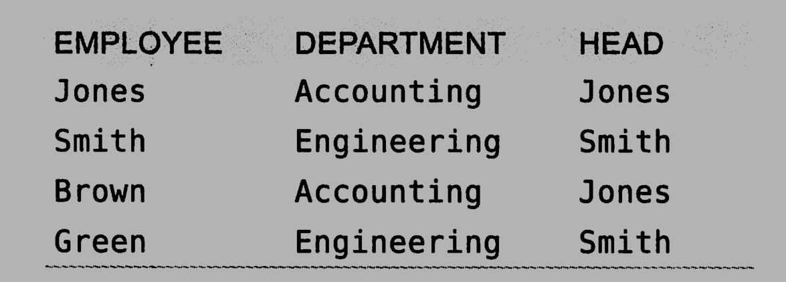

# 高性能MySQL


## 第一章、MySQL架构与历史


MySQL具有很高的灵活性，可以通过调整配置让其在不同的硬件设备上良好的运行

MySQL最不同的是他的存储索引架构，这种架构可以轻易的将查询和任务存储进行分离，也就是我们常说的读写分离，可以很轻易的提升设备的存储性能和QPS


MySQL的逻辑架构图（并不是只有简单的执行SQL然后进行数据查询）：


最上层的工具往往是第三方提供的，例如Spring提供的JDBCTemplate就属于最上层，其中往往包含连接处理，授权认证等等

第二层是所有跨存储引擎的功能的实现地方，如：存储过程，触发器，视图等等

第三层包含存储引擎，负责MySQL中数据的存储与提取。存储引擎本身并不会去解析SQL，不同引擎之间也不会相互通讯，仅仅只是简单的响应上层服务的请求


MySQL的连接管理：当一个客户端连接到MySQL上时候，会单独拥有一个线程，该线程往往只会轮流的在某个CPU核心或者是CPU中运行（为了保证缓存的高效利用率），服务器也直接负责了线程的管理，相当于缓存优化与线程管理MySQL已经帮我们实现了。


MySQL的安全性检查：可以使用账户密码或者是安全套接字（SSL）的方式连接，一旦连接成功，MySQL还会对该用户拥有的权限进行检查，如是否对该表有执行SELECT语句的权限


MySQL的优化：MySQL在解析查询的时候会进行优化，实际上就是创建解析树（一种内部数据结构）并对该结构进行优化，当然也可以提示优化器进行优化（就类似于Java中提示GC进行垃圾收集一样，但是具体执不执行没有任何保障）。优化器是独立于存储引擎的，但是存储引擎是对最后的查询速率有影响


MySQL的执行：在执行SQL语句之前，仅限于SELECT语句，如果在缓存中可以查看到相应的结果就会直接返回，服务器不会在对其进行查询（当然要避免大量SQL的传递，虽然MySQL服务器这端可以很好的优化，但是网络传输可能也会对其造成影响）


MySQL的并发控制：通过锁来避免数据被损坏。虽然这种锁的方式（这里指的应该是悲观锁）在实际工作环境中工作良好，但是不支持并发处理，因为在同一时刻只会存在一个进程去修改数据。

解决这个可以使用共享锁和排他锁，也叫读锁和写锁。

读锁是共享的，保证与其他的锁是不会相互阻塞的。写锁是排他的，写锁会阻塞其他的写锁和读锁。

当然其中也有优化的空间，可以控制锁的粒度达到写锁只需要锁定一小部分数据，而不用直接锁定全局的数据。如果仅仅只是这样那么并发问题早就不存在了，主要是操作锁也会消耗相当一部分的资源，如果实现了粒度过于细的锁，操作锁的开销可能可以与存储数据的开销成为同一个量级的。

所以所谓的锁策略是指在锁的开销和数据的安全性之间寻求一个平衡，往往是通过性能来衡量这种平衡是否合理，一般的数据库对其支持也就是行锁。而MySQL则提供了多种选择，每种MySQL的存储引擎都实现了自己的锁策略和锁粒度，于是MySQL便原生的支持了各种场景

如：表锁：直接锁定整张表，是MySQL中开销最小的锁策略，虽然各个存储索引可以管理自己的锁，但是MySQL服务器层整体还是会在使用某些语句时候如`ALTER TABLE`的时候使用表锁，而不再去依靠存储引擎的限制。


行锁：行锁可以最大程度地支持并发处理，但是同样的，也是带来最大的锁开销，行锁仅仅只是在存储索引中有实现，而在MySQL服务器层没有相应的实现


MySQL的事务支持：

事务就是一组原子性的SQL查询（不一定，只要是一组SQL语句即可），或者说是一个独立的工作单元。事务内的语句，要么全部执行，要么全部执行失败，不会出现仅仅执行一部分的情况


事务其实是依赖于数据库的ACID特性的，并不是仅仅只是依赖他的原子性的

A（atomicity，原子性）：事务必须被视为是一个不可分割的最小工作单元

C（consistency，一致性）：数据总是从一个一致性的状态转换到另一个一致性的状态

I（isolation，隔离性）：一个事务所做的提交在最终提交之前，对其他事务是不可见的

D（durability，持久性）：一旦事务提交，则其所做的修改会永久的保存到数据库中，其实也分很多级别，有一些低级别的持久化策略无法100%保障


当然，这些ACID带来的安全性也是以牺牲性能换来的，一个实现了ACID的数据库往往需要更高的硬件配置才能达到同等效果。当然MySQL并不是强制支持事务的，将对事务的支持划分到了存储索引这个级别上了。


隔离级别（隔离性的具体体现）：提供了四种隔离级别，每一种隔离级别都规定了一个事务中锁进行的修改在哪些事务内核事务间是可见的，哪些是不可见的，同样的，低隔离级别的事务可以提供更高的并发，系统的开销也更低。


四种隔离级别：

- READ UNCOMMITTED（未提交读）

事务未提交的修改对其他事务来说也是可见的，读取未提交的数据，这种情况被称为【脏读】，脏读也就是对错误数据的读取

- READ COMMITED（提交读）

大多数的MySQL的默认隔离级别，但是MySQL不是。

非常满足前面对隔离性的简单定义，事务只能看见别的已经提交的事务的更改

有时候这个级别也叫【不可重复读】（NOREPEATABLE READ），因为两次相同的查询可能会得到不一样的结果

- REPEATABLE READ（可重复读）

保证同一个事务多次读取的数据是一样的，但无法解决【幻读】的问题

InnoDB的默认隔离级别

- SERIALIZABLE（可串行化）

最高的隔离级别，强制所有事务串行执行，不存在之前的脏读，不可重复读，幻读的问题，但是这种安全性是牺牲并发容量带来的，一般很少会直接采取这种隔离级别

> 脏读，不可重复读，幻读：
>
> #### 脏读
>
> 所谓脏读是指一个事务中访问到了另外一个事务未提交的数据，如下图：
> 
> 如果会话 2 更新 age 为 10，但是在 commit 之前，会话 1 希望得到 age，那么会获得的值就是更新前的值。或者如果会话 2 更新了值但是执行了 rollback，而会话 1 拿到的仍是 10。这就是脏读。
>
> #### 幻读
>
> 一个事务读取2次，得到的记录条数不一致：
> 
> 上图很明显的表示了这个情况，由于在会话 1 之间插入了一个新的值，所以得到的两次数据就不一样了。
>
> #### 不可重复读
>
> 一个事务读取同一条记录2次，得到的结果不一致：
>
> 
> 由于在读取中间变更了数据，所以会话 1 事务查询期间的得到的结果就不一样了。


隔离级别对应的数据安全性问题：


死锁：

MySQL的事务执行过程中可能会使用到行锁，便有可能出现以下问题：事务1执行时候锁定第一行，要获取第二行，事务二执行时候锁定第二行，要获取第一行。

MySQL给出的解决办法是：提供了死锁检测和死锁超时机制。如InnoDB存储引擎，能检测死锁的循环依赖并立即返回一个错误，放碰到错误的时候将持有少量排他锁的事务进行回滚（相对简单的死锁回滚算法）。

当然死锁产生的原因并不仅仅只是数据冲突，还有可能和存储索引的实现有关。


MySQL事务日志：使用事务日志可以提高事务的效率。事务日志是在设备的内存中的，当存储引擎在修改数据表的数据时候往往只需要修改内存中的事务日志，而不用每次都直接修改磁盘上的数据。MySQL可以保证在系统崩溃的时候其中的数据不丢失。


MySQL中的事务支持：MySQL提供了两种存储引擎支持事务：InnoDB和NDB Cluster，当然，由于MySQL的开源，有很多第三方的存储引擎也支持事务。

MySQL默认采用的是默认提交机制，即每一条散着的命令都是一个事务操作

还有一些语句会强制COMMIT当前的活动事务，如ALTER TABLE和LOCK TABLES语句都会产生这种效果

可以改变当前会话的隔离级别：

`SET SESSION TRANSACTION ISOLATION LEVEL READ COMMITTED;`

InnoDB支持所有的隔离级别

事务是由存储引擎实现的，在同一个事务中使用多种存储引擎是不可靠的

InnoDB采用两阶段锁定模式，即显式锁定和隐式锁定，隐式锁定发生在事务当中，只有在COMMIT或者是ROLLBACK的时候才会释放锁。至于显式锁定则是InnoDB自己提供的语言规范，不属于SQL规范：


当然在MySQL的服务器层面也是支持显式锁的：`LOCK TABLES`和`UNLOCK TABLES`语句，不涉及到这里的事务控制

> 建议不要使用数据库服务器层面的锁，因为很容易与存储引擎的锁发生冲突从而降低性能
>
> **在任何时刻都不要显式地执行LOCK TABLES，不管使用的是什么存储引擎**


MySQL多版本并发控制：

多数MySQL存储引擎都没有使用行级锁，而是基于并发速率考虑使用了MVCC（多版本并发控制）来提升效率。

可以认为MVCC是一个行级锁，但是在很多情况下避免了加锁操作~~（个人理解：行级锁就相当于是一个悲观锁，而MVCC就相当于是乐观所）~~

> 错误的理解，MVCC实现有乐观并发控制和悲观并发控制两种实现类型


InnoDB的MVCC实现方式：通过在每行后面记录两个影藏的列来实现的，分别保存子行的创建时间和过期时间（删除时间），当然这里存储的不是真实的时间，而是系统版本号，每开启一个新的事务，系统版本号就会自动递增。分别称为行版本号和删除版本号


在REPEATABLE READ，也就是默认的情况下，MVCC是如何操作的：

SELECT：

- 查找行的系统版本号小于当前事务系统版本号的数据行
- 查找行的删除版本号要么是未定义，要么大于当前事务系统版本号

INSERT：

将当前事务系统版本号作为行版本号

DELETE：

将当前事务版本号作为行删除版本号

UPDATE：

将行版本号和删除版本号设置成当前事务的系统版本号


这样可以保证绝大多数操作都可以在不加锁的情况下安全的完成


MVCC只能在READ COMMITED和REPEATABLE READ这两个隔离级别下工作，其他的都不兼容。第一个是完全不能用，要保证读取的都是最新的数据，最后一个则是没必要用，读取的时候会对行加锁。


MySQL的存储引擎：

存储引擎对应到了每一张表上，可以通过查看表的详细信息来查看该表使用的是什么存储引擎

如：`show create table sys_user \G;`即可查看到sys_user表的详细定义：

```sql
*************************** 1. row ***************************
       Table: sys_user
Create Table: CREATE TABLE `sys_user` (
  `id` int NOT NULL AUTO_INCREMENT,
  `user_name` varchar(20) CHARACTER SET utf8 COLLATE utf8_general_ci NOT NULL COMMENT '用户账号',
  `user_password` varchar(100) CHARACTER SET utf8 COLLATE utf8_general_ci NOT NULL COMMENT '密码',
  `real_name` varchar(20) CHARACTER SET utf8 COLLATE utf8_general_ci NOT NULL COMMENT '用户真实姓名',
  `dep_id` int NOT NULL COMMENT '部门id',
  `user_code` varchar(20) CHARACTER SET utf8 COLLATE utf8_general_ci DEFAULT NULL COMMENT '员工工号',
  `user_type_id` int DEFAULT NULL COMMENT '用户类型id',
  `order_number` varchar(3) CHARACTER SET utf8 COLLATE utf8_general_ci DEFAULT NULL COMMENT '排序',
  `user_email` varchar(255) CHARACTER SET utf8 COLLATE utf8_general_ci DEFAULT NULL COMMENT 'email地址',
  `user_tel` varchar(20) CHARACTER SET utf8 COLLATE utf8_general_ci NOT NULL COMMENT '手机号',
  `current_score` int DEFAULT '0' COMMENT '积分',
  `has_approve` int DEFAULT '0' COMMENT '是否实名认证,0-未认证,1-已认证',
  `status` int NOT NULL DEFAULT '0' COMMENT '状态是否有效,0-注册,1-有效,2-离职',
  `news_scope` varchar(3) CHARACTER SET utf8 COLLATE utf8_general_ci DEFAULT NULL COMMENT '本地声音中的信息范围(0-本地，1-上级，2-下级，012-全部)',
  `create_time` datetime DEFAULT CURRENT_TIMESTAMP COMMENT '创建时间',
  `create_oper` int DEFAULT NULL COMMENT '创建用户id',
  `update_time` datetime DEFAULT CURRENT_TIMESTAMP ON UPDATE CURRENT_TIMESTAMP COMMENT '修改时间',
  `update_oper` int DEFAULT NULL COMMENT '修改用户id',
  PRIMARY KEY (`id`) USING BTREE
) ENGINE=InnoDB AUTO_INCREMENT=2 DEFAULT CHARSET=utf8 ROW_FORMAT=DYNAMIC COMMENT='用户表'
1 row in set (0.00 sec)
```

> 之所以加上了`\G`在最后面是因为要输出的时候不会带上大量的短横线

这是查询创建表的语句，当然也可以查看到表的存储引擎。

但是更多的是创建表的SQL语句，建议使用如下SQL语句：`show table status like 'sys_user'\G;`来展示，\G可以保证格式化输出，其中包含大量表统计信息。

> 包括SELECT语句都可以在后面加上\G用于格式化输出

得到的详细信息为：

```sql
*************************** 1. row ***************************
           Name: sys_user
         Engine: InnoDB
        Version: 10
     Row_format: Dynamic
           Rows: 1
 Avg_row_length: 16384
    Data_length: 16384
Max_data_length: 0
   Index_length: 0
      Data_free: 0
 Auto_increment: 2
    Create_time: 2020-09-06 15:39:40
    Update_time: 2020-09-06 15:52:14
     Check_time: NULL
      Collation: utf8_general_ci
       Checksum: NULL
 Create_options: row_format=DYNAMIC
        Comment: 用户表
```

更多的是显示当前Table的状态，而不是显示当前SQL的格式


InnoDB存储引擎：MySQL默认的存储引擎

适用于短期事务，即具有大部分事务都可以被正常提交，只有少量会发生事务回滚，

InnoDB提供了如新的大型值BLOB的存储方式

InnoDB采用MVCC来支持高并发，实现了默认的四个隔离级别，**默认是REPEATABLE READ，并且通过间隙锁的方式防止了幻读的出现**（这就意味着：InnoDB实现了不是SERIALIZABLE的条件下的所有错误发生可能）。

InnoDB是根据聚簇索引建立的，对主键索引的查询速率非常高，不过二级索引中必须包含主键列

InnoDB支持热备份，而这点对于其他的存储引擎是不支持的


MyISAM存储引擎：在5.1之前是默认的存储引擎，提供了全文索引等特性，但是不支持事务和行级锁，且崩溃后无法安全的恢复。不是非常建议使用，后期维护成本非常高。

由于不支持行级锁，所以在读取表的时候需要将涉及到的表加上共享锁，而在写入表的时候需要加上排他锁。但在查询表的过程中可以往表中查询新的记录（被称为并发插入）

MyISAM可以进行表的压缩，压缩后的表示不能进行修改的，想要修改，需要先将表解压缩然后才能进行修改，压缩过的表也支持索引，但索引仍然只是只读的，仍然需要先将数据解压再进行修改索引


MySQL内建的其他存储引擎：不是很建议使用，说不定在不久的将来就被不予支持，Archive引擎、Blackhole引擎，CSV引擎，Federated引擎，Memory引擎，Merge引擎等等。

市场上的第三方引擎：

OLTP类引擎，完全为了取代InnoDB引擎的市场地位，对InnoDB引擎进行了优化

面向列的存储引擎：因为MySQL默认是面向行的，在大数据处理时候往往需要面向列，这样才能有更高的数据处理速率。


MySQL对存储引擎的选择问题：“大部分时间选择InnoDB存储引擎，除非需要用到InnoDB不具备的特性，并且没有其他任何办法可以替代，否则都应该优先选择InnoDB引擎”。

例如需要用到全局索引，可以使用InnoDB+Sphinx的组合，而不是去使用MyISAM存储引擎。

除非迫不得已，非常不推荐混用多种存储引擎


选择存储引擎的一些例子：P61


转换表的引擎：`ALTER TABLE sys_user ENGINE = InnoDB;`

可能会执行很长时间，因为MySQL会将表数据复制一份到新的表上面去，然后通过指定新的表的存储引擎来达到修改引擎的目的。还有一个问题：如果从InnoDB表转换为MyISAM表，再转换回InnoDB表，那么这个表上的外键将会丢失。


还有一种方法是创建一个类似于当前表的表结构，然后将当前表的数据插入到新创建的表中

操作如下：

```sql
CREATE TABLE book2 LIKE book;
ALTER TABLE book2 ENGINE = MyISAM;
INSERT INTO book2 SELECT * FROM book;
```

可以达到快速更改存储引擎的目的，因为数据表是空的，修改引擎的速度非常快。

如果数据量大的话可以考虑分批次插入到book2当中去 


MySQL的历史：

最靠是MySQL公司独立研发，后来被sun公司收购，同时Oracle公司收购了InnoDB存储引擎。最后再5.5版本的时候Oracle完成对sun的收购并推出了该版本的MySQL

> 难怪Java对MySQL有这么好的支持，原来都是同一个公司出品的产品，自家的适配性当然要好了。


Oracle现在是为用户提供一些MySQL的服务器插件来赚取利润，MySQL本身还是遵循开源模式的


总结：

MySQL的分层架构：上层是服务器层的服务和查询执行引擎，下层是存储引擎。

随着Oracle对MySQL和InnoDB的收购，更加有利于MySQL的发展


## 第二章、MySQL基准测试


基准测试就是针对系统设计的一种压力测试，通常的目的是为了掌握系统的行为

特别讨论sysbench，对windows支持非常不友好：）

还是自己玩虚拟机去吧，顺便熟悉一下开发环境，别在云主机上玩，重置起来麻烦的很


基准测试可以观察系统在不同压力下的行为，评估系统的容量，掌握重要的变化

很类似于JMeter等压测工具


衡量数据库的几个指标：吞吐量、延迟、并发性、可扩展性


在测试过程中避免以下这些错误：

- 使用真实数据的子集而不是全集
- 使用错误的数据分布
- 使用不真实的分布参数
- 在多用户场景中只做单用户的测试
- 在单服务器上测试分布式应用
- 反复执行同一查询
- 忽略系统预热过程
- 测试时间过短


需要将测试得到的数据通过GUI图形化界面来得到一般的结论


基准测试工具：

- ab

Apache提供的一个工具，在Linux中有良好的支持，可以对一个URL发起多次请求并返回评估数据，但是局限性是只能针对单个URL。偏向于测试最大请求数

- http_load

与ab类似，但是比ab更加灵活，可以通过输入文件来提供多个URL，而不用直接手动输入一个URL，更偏向于时间比率而不是ab的测试最大请求能力

- JMeter

经典的Java测试工具，主要用来测试Web应用，但也可以用来测试FTP服务器，通过JDBC对数据库进行间接测试等等

> 都是有名的HTTP压测工具，并不是直接访问到数据库层面的，感觉有点怪异


以上是集成测试工具，MySQL自身以提供了诸如：mysqlslap、sql-bench等测试工具内置于MySQL当中。


测试案例：P88

http_load仅仅支持http请求，并不支持https请求，无法解析请求头

返回的是访问这些URL所用时间。


MySQL提供了自己的一套基准测试套件


涉及到过多的脚本内容了，在测试过程中需要将测试结果保存在文件当中去，然后再将文本可视化以便发现规律，从而达到数据库调优的目的。绘图工具可以使用gnuplot或者是R


小结：基准测试不仅仅是用来解决业务问题的一种实践行动，也是一种很好的学习方法。

基准测试工具仍然需要大量使用才能了解其中参数的含义


## 第三章、服务器性能剖析


通过性能剖析（profiling）来关注服务器的时间花费在哪里，包括分析服务器的堆栈，从应用服务器到数据服务器到单个查询（SQL语句执行速度）


> 个人觉得单条SQL的执行效率几乎不会改变


常见错误：性能优化并不仅仅是降低CPU利用率，而是要求CPU资源有效的利用。往往是通过查询时间来估算性能的表现。系统吞吐量的提高仅仅是性能提升带来的副产品（然而这个副产品往往是我们需要的，但是也不能为了追求性能释放一味地掠夺资源）


建议花费大量的时间再性能的测试上，而不是花费大量时间在修改数据上（往往默认的数据是在稳定性和性能之间有权衡的，不要随便进行改变）


对系统进行性能剖析还是建议自上而下得进行，不建议直接处理数据库问题（虽然大多数性能问题可以归结到对数据库的速度上来）


MySQL提供了一系列轻量的性能剖析工具，虽然会拖慢运行速度，但是当性能遇上瓶颈的时候可以更加轻易的解决


[New Relic.](https://newrelic.com/) 一款好的性能测试工具。且代价非常的低廉


对PHP的性能测试工具推荐这里跳过了


剖析MySQL性能主要有两种方式：剖析服务器负载和剖析单条查询


剖析服务器负载：

如果仅仅只是需要找出代价高的查询，可以使用慢查询日志。

是MySQL原生支持的，开销非常低，在5.0之前仅仅支持以秒为单位的响应时间记录，直到5.0之后可以手动设置时间long_query_time，甚至可以设置成0来捕获所有的查询。

慢查询日志带来的开销可以忽略不计，但是不建议长期开启，因为产生的日志会占用大量的磁盘空间


关于慢查询日志可以参考这篇文章 ：https://www.jianshu.com/p/38cbb5426bee，非常容易统计出慢速查询的情况。


可以通过慢日志查询这种手段迅速分析服务器的最近状况


单条查询：主要通过三种手段：

- SHOW STATUS
- SHOW PROFILE
- 检索慢查询日志的条目

其实是不怎么完善的方法的，但是目前咩有更好的方法了


SHOW PROFILE：

可以直接查看对当前数据库操作的耗时，需要开启：

`SET PROFILING = 1;`

然后在需要统计的数据库上使用SHOW PROFILE语句即可查看语句耗时


可以更加精细的查询每个Query的详细信息，如要查询14的详细信息：


可以看到当前语句的详细执行过程和耗时，有效优化当前语句


使用SHOW STATUS：大部分时间只是一款计数器，并不是专业的性能剖析工具。只能简单的用来计数，对执行性能分析有一定的帮助


诊断间接性问题

可以通过设置触发器来保证当时数据的准确捕捉，以此来处理数据（处理什么数据呢？尽可能收集所有的数据，包括系统状态、CPU利用率、磁盘利用率和可用空间、内存利用率等等）


案例分析：P135


小结：

定义性能最有效的方式是响应时间

尽量获取所有的测试信息


## 第四章、Schema与数据类型优化


Schema：是数据库的组织和结构，可以是表、列、数据类型、视图、存储过程、关系、主键、外键等等。


这一章关注的是MySQL数据库的设计，主要介绍的是MySQL数据库设计与其他关系型数据库管理系统的区别


选择优化的数据类型：不管你使用哪种类型的数据，下面几个简单的原则有助于你进行更好的选择：

- 更小的通常更好

占用更少的资源如CPU、磁盘和内存

- 简单就好

整型比字符操作代价更低，因为字符的校验规则比整型的更加复杂。两个例子：使用MySQL内建的Date类型而不是字符串来存储日期和时间、应该使用整型来存储IP地址而不是字符型

- 尽量避免NULL

通常情况下最好指定列为NOT NULL，除非需要存储NULL值，因为对可为NULL的列进行索引需要更多的存储空间，在MySQL中也需要特殊处理。


下一步是选择具体的数据类型，由于MySQL提供了很多相似但功能不同的数据类型，如DateTime和TimeStamp。TimeStamp只有DateTime一半的存储空间，支持根据时区变化，具有自动更新能力。但是允许的时间范围要小的多。


本章只讨论基本的数据类型：


整数类型：MySQL支持的几种整数类型：TinyInt、SmallInt、MediumInt、Int、BigInt

分别占用8、16、24、32、64位存储空间，默认是从-2<sup>(N-1)</sup> ~ -2<sup>(N-1)</sup>-1

可以勾选无符号使得存储的上限高一倍，即0 ~ 2<sup>N</sup>-1 

MySQL可以为整型类型指定宽度，如Int（11），但是对绝大多数应用是没有意义的，不会限制值得合法范围以及存储空间，仅仅只是规定了MySQL交互工具如MySQL命令行客户端来显示字符的个数


实数类型：

Float和Double支持标准的浮点运算进行近似运算

Decimal用于存储精确的小数

一般只会在对小数点进行精确计算的时候使用Decimal


字符串类型：

Varchar和Char：两种最主要的字符串类型，Varchar是变长字符串，仅仅只会占用必要的空间。但是更新时候可能需要额外的动作来完成对字符串长度的修改操作

因此建议在字符串的最大长度比需要存储的平均长度大很多，并且更新较少的时候使用Varchar非常的适用。

InnoDB对Varchar存储进行了优化，把过长的varchar存储为BLOB

Char则存储一个定长的字符串，对于短的定长的字符串，并且更改需求还是比较大的，建议使用Char类型

对Varchar来说限定长度是非常有意义的，限定更长的列会消耗更多的空间，所以对


BLOB和TEXT类型：

BLOB和TEXT都是为了存储很大的数据而设计的字符串数据类型，只是分别采用二进制和字符串存储方式


日期和时间类型：

MySQL至此的细粒度操作是秒，但是MySQL也支持使用微秒级的粒度进行临时运算

主要是DateTime和TimeStamp之间的区别，往往在某些特定的场景中一个可以工作的比另一个更好

DateTime：保存大范围的值，从1001~9999年，精度为秒，与时区无关，使用8字节存储空间

TimeStamp：从1970、1、1以来的计数，与Unix时间戳相同，只使用4字节的存储空间，只能表示从1970年到2038年的时间。

TimeStamp中保存有时区信息，如存储为0的TimeStamp在美国东部显示时间为"1969-12-31 19:00:00"，而DateTime则会直接将存储的文本值返回出来，不会根据时区信息来计算差距

> 书上推荐即使没有这些特殊情况也应该使用TimeStamp，因为比DateTime的空间效率更高。但是自我感觉不好维护，特别是2037年的程序员。也有可能直接存储未来的时间

MySQL暂时还没有提供比秒粒度更小的日期和时间值


ORM系统（以及使用他们的框架）是另一种常见的性能噩梦。对开发者非常有利，因为可以隐藏复杂性，可以直接完全的面向对象编程（例如Hibernate），但这是不好的。


MySQL中关于Schema设计的一些缺陷：

- 太多的列：太多的列会导致MySQL在服务层将数据解码，转换成列的时候的代价是非常高的
- 太多的关联：单个查询最好只在12个表以内做关联
- 全能的枚举：防止过渡使用枚举


范式和反范式：

使用第二范式的例子：

将数据表从：



拆解成两个表：


以上例子就是第二范式的使用


优点大约都知道，主要谈谈缺点

范式的主要缺点：在操作数据的时候需要进行关联操作

反范式的主要缺点：维护表数据困难


真实世界中通常混用范式和反范式化Schema


> 书上给出了提升性能的另一种方式：使用缓存表
>
> 将查询好的数据插入到缓存表当中去，当然这种情况可能会产生脏数据，需要你自己及时维护，或者将一些汇总数据也直接存储进缓存表当中去
>
> 但是不推荐这样做，除非真的是对性能有足够的需求并且是读多写少，允许脏数据存在的情况下可以这么做


Oracle和SQL Server数据库提供了固化视图功能，但是MySQL不原生支持这个功能，固化视图由以下数据组成：

- 变更数据抓取功能
- 帮助创建和管理视图的定义的存储过程

由于可以抓取数据库的变更信息，因此可以非常容易维护聚合函数如Sum等等，不必直接再从头再来计算了


计数器问题：

如果想用MySQL中的其中一列来维护类似于计数器的功能，那么在更新计数器的时候很有可能遇到并发问题，如使用类似于以下的SQL语句：

````sql
UPDATE counter SET count = count + 1;
````

解决方法：

1. 可以使用全局互斥锁锁住该列，这样在更新数据的时候可以保证串行化执行
2. 可以将数据保存在多行当中，每次随机选择一行进行数据更新，减少数据冲突，查询的时候使用聚合查询


> 为了增加读的速度（牺牲的是写的速度）
>
> 建额外索引，增加冗余列都是常见操作，可以极大提升查询速率


优化ALTER TABLE的速度，因为MySQL使用ALTER TABLE来修改表结构会新建一张新表，然后 将旧表的数据拷贝到新表当中去，尤其当表很大的时候，往往需要花费数个小时甚至数兲才能完成

ALTER TABLE操作通常会导致MySQL服务中断

书上讲了修改.frm文件来直接修改数据表的结构而不至于让MySQL停止服务，可以冒风险试一试，但是现在MySQL用idb文件存储数据，无法直接读取


建议在导入数据完成之后再建索引，这样可以极大的提升数据导入速度


小结：

尽量保持任何东西小而简单总是好的，无论是数据类型还是使用到的设计模式。

范式是好的，但反范式也是必须的，可以非常大的优化查询速度

ALTER TABLE令人头疼的性能问题


## 第五章、创建高性能的索引


索引（在MySQL中也叫Key）是存储引擎用于快速寻找记录的一种数据结构


当数据量增大时，索引对性能的影响非常大


对索引的优化应该是优化查询性能最好的手段了。索引可以轻易的将查询速率提升几个量级


索引可以包含一个或者多个列，但是MySQL只能保证醉左列索引的高效


> 我们使用的ORM框架往往只是简单的使用到了索引的技术，如果真的需要高效的查询效率，还是建议手动构建微秒的索引。


**在MySQL中，索引是存储引擎实现的而不是服务器实现的**，因此没有统一的标准


MySQL一共支持的索引类型：

- B-Tree索引

如果谈论索引没有指定类型，十有八九就是说的这种索引，使用的非常广泛。大多数的MySQL引擎都支持这种索引，当然底层的存储引擎也可能使用不同的数据结构来实现B-Tree

B-Tree通常意味着所有的值都是按照顺序存储的，并且每一个叶子页到根的距离相同。

可以利用B-Tree索引的查询类型。该索引适用于全键值、键值范围或键前缀查找。当然不只是查询，还有ORDER BY子句都会获益。


B-Tree索引的限制（一般都是创建多个索引的时候才会引发的限制）：

1. 如果不是按照索引的最左列开始查找，则无法使用索引
2. 不能跳过索引中的列
3. 如果查询中有某个列的范围查询（包括使用LIKE关键字），则其右边的列无法使用索引优化查找


- 哈希索引

哈希索引是基于哈希表实现的，只有精确匹配到所有列的查询才有效

只有存储引擎Memory支持哈希索引，也是默认的索引类型

哈希索引的限制：

- 不是按照索引值顺序进行存储的，无法用于排序
- 不支持部分匹配查找，因为是要全部内容来计算哈希值的
- 哈希冲突有很多的话（有很多相同的值），维护哈希表的代价也会非常大

InnoDB对哈希索引进行了一些优化，如：自适应哈希索引，当某些值使用非常频繁时，会自动将在B-Tree的结构上建立哈希索引


空间数据索引（R-Tree）

MyISAM表支持空间索引，可以用作地理位置存储。


全文索引

特殊类型的索引，查找的是文本中的关键字


索引的优点：

快速定位到表的指定位置不是索引的唯一作用，因为索引的存储结构不同可以带来一些附加的效益。

如B-Tree的有序性可以提速ORDER BY和GROUP BY操作的速度，因为是有序的

三大优点：

1. 大大减少了服务器需要扫描的数据量
2. 帮助服务器避免排序和临时表
3. 将随机IO变为顺序IO


索引并不总是最好的解决方案，对于一些小型表，往往简单的全表扫描更高效，对于中大型表建立索引可以增加查询速度，单建索引的开销也是非常大的


选择合适的索引列顺序：仅仅适用于B-Tree索引

将选择性最高的列放到索引最前列（在某些场景中可能有用，但不一定都适用）【当不需要考虑排序和分组时】，这时候使用了索引优化WHERE字句的优势来提升性能