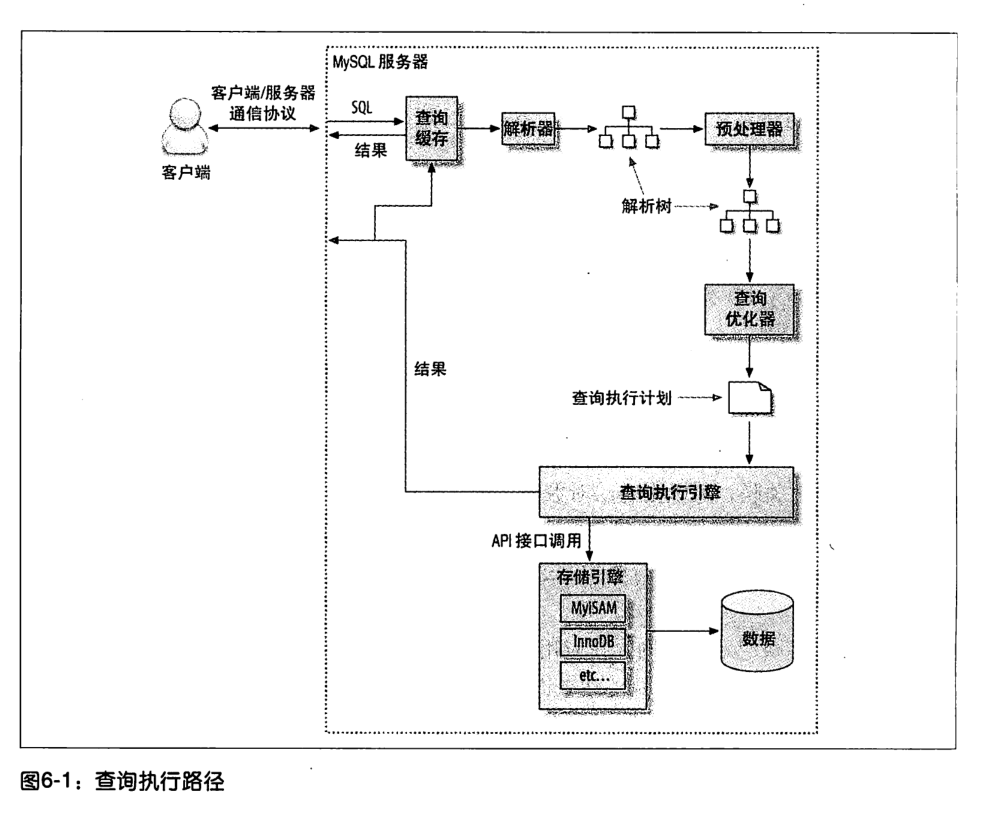
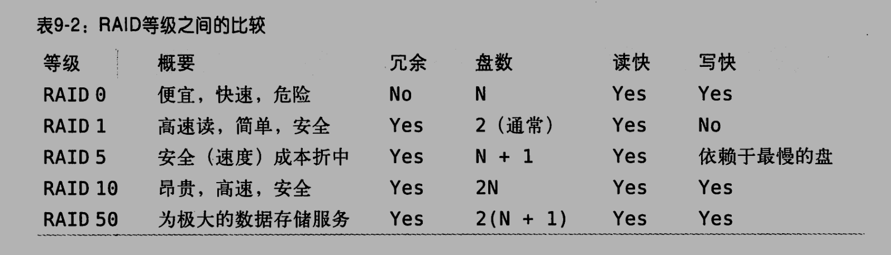

# 高性能MySQL


## 第一章、MySQL架构与历史


MySQL具有很高的灵活性，可以通过调整配置让其在不同的硬件设备上良好的运行

MySQL最不同的是他的存储索引架构，这种架构可以轻易的将查询和任务存储进行分离，也就是我们常说的读写分离，可以很轻易的提升设备的存储性能和QPS


MySQL的逻辑架构图（并不是只有简单的执行SQL然后进行数据查询）：


最上层的工具往往是第三方提供的，例如Spring提供的JDBCTemplate就属于最上层，其中往往包含连接处理，授权认证等等

第二层是所有跨存储引擎的功能的实现地方，如：存储过程，触发器，视图等等

第三层包含存储引擎，负责MySQL中数据的存储与提取。存储引擎本身并不会去解析SQL，不同引擎之间也不会相互通讯，仅仅只是简单的响应上层服务的请求


MySQL的连接管理：当一个客户端连接到MySQL上时候，会单独拥有一个线程，该线程往往只会轮流的在某个CPU核心或者是CPU中运行（为了保证缓存的高效利用率），服务器也直接负责了线程的管理，相当于缓存优化与线程管理MySQL已经帮我们实现了。


MySQL的安全性检查：可以使用账户密码或者是安全套接字（SSL）的方式连接，一旦连接成功，MySQL还会对该用户拥有的权限进行检查，如是否对该表有执行SELECT语句的权限


MySQL的优化：MySQL在解析查询的时候会进行优化，实际上就是创建解析树（一种内部数据结构）并对该结构进行优化，当然也可以提示优化器进行优化（就类似于Java中提示GC进行垃圾收集一样，但是具体执不执行没有任何保障）。优化器是独立于存储引擎的，但是存储引擎是对最后的查询速率有影响


MySQL的执行：在执行SQL语句之前，仅限于SELECT语句，如果在缓存中可以查看到相应的结果就会直接返回，服务器不会在对其进行查询（当然要避免大量SQL的传递，虽然MySQL服务器这端可以很好的优化，但是网络传输可能也会对其造成影响）


MySQL的并发控制：通过锁来避免数据被损坏。虽然这种锁的方式（这里指的应该是悲观锁）在实际工作环境中工作良好，但是不支持并发处理，因为在同一时刻只会存在一个进程去修改数据。

解决这个可以使用共享锁和排他锁，也叫读锁和写锁。

读锁是共享的，保证与其他的锁是不会相互阻塞的。写锁是排他的，写锁会阻塞其他的写锁和读锁。

当然其中也有优化的空间，可以控制锁的粒度达到写锁只需要锁定一小部分数据，而不用直接锁定全局的数据。如果仅仅只是这样那么并发问题早就不存在了，主要是操作锁也会消耗相当一部分的资源，如果实现了粒度过于细的锁，操作锁的开销可能可以与存储数据的开销成为同一个量级的。

所以所谓的锁策略是指在锁的开销和数据的安全性之间寻求一个平衡，往往是通过性能来衡量这种平衡是否合理，一般的数据库对其支持也就是行锁。而MySQL则提供了多种选择，每种MySQL的存储引擎都实现了自己的锁策略和锁粒度，于是MySQL便原生的支持了各种场景

如：表锁：直接锁定整张表，是MySQL中开销最小的锁策略，虽然各个存储索引可以管理自己的锁，但是MySQL服务器层整体还是会在使用某些语句时候如`ALTER TABLE`的时候使用表锁，而不再去依靠存储引擎的限制。


行锁：行锁可以最大程度地支持并发处理，但是同样的，也是带来最大的锁开销，行锁仅仅只是在存储索引中有实现，而在MySQL服务器层没有相应的实现


MySQL的事务支持：

事务就是一组原子性的SQL查询（不一定，只要是一组SQL语句即可），或者说是一个独立的工作单元。事务内的语句，要么全部执行，要么全部执行失败，不会出现仅仅执行一部分的情况


事务其实是依赖于数据库的ACID特性的，并不是仅仅只是依赖他的原子性的

A（atomicity，原子性）：事务必须被视为是一个不可分割的最小工作单元

C（consistency，一致性）：数据总是从一个一致性的状态转换到另一个一致性的状态

I（isolation，隔离性）：一个事务所做的提交在最终提交之前，对其他事务是不可见的

D（durability，持久性）：一旦事务提交，则其所做的修改会永久的保存到数据库中，其实也分很多级别，有一些低级别的持久化策略无法100%保障


当然，这些ACID带来的安全性也是以牺牲性能换来的，一个实现了ACID的数据库往往需要更高的硬件配置才能达到同等效果。当然MySQL并不是强制支持事务的，将对事务的支持划分到了存储索引这个级别上了。


隔离级别（隔离性的具体体现）：提供了四种隔离级别，每一种隔离级别都规定了一个事务中锁进行的修改在哪些事务内核事务间是可见的，哪些是不可见的，同样的，低隔离级别的事务可以提供更高的并发，系统的开销也更低。


四种隔离级别：

- READ UNCOMMITTED（未提交读）

事务未提交的修改对其他事务来说也是可见的，读取未提交的数据，这种情况被称为【脏读】，脏读也就是对错误数据的读取

- READ COMMITED（提交读）

大多数的MySQL的默认隔离级别，但是MySQL不是。

非常满足前面对隔离性的简单定义，事务只能看见别的已经提交的事务的更改

有时候这个级别也叫【不可重复读】（NOREPEATABLE READ），因为两次相同的查询可能会得到不一样的结果

- REPEATABLE READ（可重复读）

保证同一个事务多次读取的数据是一样的，但无法解决【幻读】的问题

InnoDB的默认隔离级别

- SERIALIZABLE（可串行化）

最高的隔离级别，强制所有事务串行执行，不存在之前的脏读，不可重复读，幻读的问题，但是这种安全性是牺牲并发容量带来的，一般很少会直接采取这种隔离级别

> 脏读，不可重复读，幻读：
>
> #### 脏读
>
> 所谓脏读是指一个事务中访问到了另外一个事务未提交的数据，如下图：
> 
> 如果会话 2 更新 age 为 10，但是在 commit 之前，会话 1 希望得到 age，那么会获得的值就是更新前的值。或者如果会话 2 更新了值但是执行了 rollback，而会话 1 拿到的仍是 10。这就是脏读。
>
> #### 幻读
>
> 一个事务读取2次，得到的记录条数不一致：
> 
> 上图很明显的表示了这个情况，由于在会话 1 之间插入了一个新的值，所以得到的两次数据就不一样了。
>
> #### 不可重复读
>
> 一个事务读取同一条记录2次，得到的结果不一致：
>
> 
> 由于在读取中间变更了数据，所以会话 1 事务查询期间的得到的结果就不一样了。


隔离级别对应的数据安全性问题：


死锁：

MySQL的事务执行过程中可能会使用到行锁，便有可能出现以下问题：事务1执行时候锁定第一行，要获取第二行，事务二执行时候锁定第二行，要获取第一行。

MySQL给出的解决办法是：提供了死锁检测和死锁超时机制。如InnoDB存储引擎，能检测死锁的循环依赖并立即返回一个错误，放碰到错误的时候将持有少量排他锁的事务进行回滚（相对简单的死锁回滚算法）。

当然死锁产生的原因并不仅仅只是数据冲突，还有可能和存储索引的实现有关。


MySQL事务日志：使用事务日志可以提高事务的效率。事务日志是在设备的内存中的，当存储引擎在修改数据表的数据时候往往只需要修改内存中的事务日志，而不用每次都直接修改磁盘上的数据。MySQL可以保证在系统崩溃的时候其中的数据不丢失。


MySQL中的事务支持：MySQL提供了两种存储引擎支持事务：InnoDB和NDB Cluster，当然，由于MySQL的开源，有很多第三方的存储引擎也支持事务。

MySQL默认采用的是默认提交机制，即每一条散着的命令都是一个事务操作

还有一些语句会强制COMMIT当前的活动事务，如ALTER TABLE和LOCK TABLES语句都会产生这种效果

可以改变当前会话的隔离级别：

`SET SESSION TRANSACTION ISOLATION LEVEL READ COMMITTED;`

InnoDB支持所有的隔离级别

事务是由存储引擎实现的，在同一个事务中使用多种存储引擎是不可靠的

InnoDB采用两阶段锁定模式，即显式锁定和隐式锁定，隐式锁定发生在事务当中，只有在COMMIT或者是ROLLBACK的时候才会释放锁。至于显式锁定则是InnoDB自己提供的语言规范，不属于SQL规范：


当然在MySQL的服务器层面也是支持显式锁的：`LOCK TABLES`和`UNLOCK TABLES`语句，不涉及到这里的事务控制

> 建议不要使用数据库服务器层面的锁，因为很容易与存储引擎的锁发生冲突从而降低性能
>
> **在任何时刻都不要显式地执行LOCK TABLES，不管使用的是什么存储引擎**


MySQL多版本并发控制：

多数MySQL存储引擎都没有使用行级锁，而是基于并发速率考虑使用了MVCC（多版本并发控制）来提升效率。

可以认为MVCC是一个行级锁，但是在很多情况下避免了加锁操作~~（个人理解：行级锁就相当于是一个悲观锁，而MVCC就相当于是乐观所）~~

> 错误的理解，MVCC实现有乐观并发控制和悲观并发控制两种实现类型


InnoDB的MVCC实现方式：通过在每行后面记录两个影藏的列来实现的，分别保存子行的创建时间和过期时间（删除时间），当然这里存储的不是真实的时间，而是系统版本号，每开启一个新的事务，系统版本号就会自动递增。分别称为行版本号和删除版本号


在REPEATABLE READ，也就是默认的情况下，MVCC是如何操作的：

SELECT：

- 查找行的系统版本号小于当前事务系统版本号的数据行
- 查找行的删除版本号要么是未定义，要么大于当前事务系统版本号

INSERT：

将当前事务系统版本号作为行版本号

DELETE：

将当前事务版本号作为行删除版本号

UPDATE：

将行版本号和删除版本号设置成当前事务的系统版本号


这样可以保证绝大多数操作都可以在不加锁的情况下安全的完成


MVCC只能在READ COMMITED和REPEATABLE READ这两个隔离级别下工作，其他的都不兼容。第一个是完全不能用，要保证读取的都是最新的数据，最后一个则是没必要用，读取的时候会对行加锁。


MySQL的存储引擎：

存储引擎对应到了每一张表上，可以通过查看表的详细信息来查看该表使用的是什么存储引擎

如：`show create table sys_user \G;`即可查看到sys_user表的详细定义：

```sql
*************************** 1. row ***************************
       Table: sys_user
Create Table: CREATE TABLE `sys_user` (
  `id` int NOT NULL AUTO_INCREMENT,
  `user_name` varchar(20) CHARACTER SET utf8 COLLATE utf8_general_ci NOT NULL COMMENT '用户账号',
  `user_password` varchar(100) CHARACTER SET utf8 COLLATE utf8_general_ci NOT NULL COMMENT '密码',
  `real_name` varchar(20) CHARACTER SET utf8 COLLATE utf8_general_ci NOT NULL COMMENT '用户真实姓名',
  `dep_id` int NOT NULL COMMENT '部门id',
  `user_code` varchar(20) CHARACTER SET utf8 COLLATE utf8_general_ci DEFAULT NULL COMMENT '员工工号',
  `user_type_id` int DEFAULT NULL COMMENT '用户类型id',
  `order_number` varchar(3) CHARACTER SET utf8 COLLATE utf8_general_ci DEFAULT NULL COMMENT '排序',
  `user_email` varchar(255) CHARACTER SET utf8 COLLATE utf8_general_ci DEFAULT NULL COMMENT 'email地址',
  `user_tel` varchar(20) CHARACTER SET utf8 COLLATE utf8_general_ci NOT NULL COMMENT '手机号',
  `current_score` int DEFAULT '0' COMMENT '积分',
  `has_approve` int DEFAULT '0' COMMENT '是否实名认证,0-未认证,1-已认证',
  `status` int NOT NULL DEFAULT '0' COMMENT '状态是否有效,0-注册,1-有效,2-离职',
  `news_scope` varchar(3) CHARACTER SET utf8 COLLATE utf8_general_ci DEFAULT NULL COMMENT '本地声音中的信息范围(0-本地，1-上级，2-下级，012-全部)',
  `create_time` datetime DEFAULT CURRENT_TIMESTAMP COMMENT '创建时间',
  `create_oper` int DEFAULT NULL COMMENT '创建用户id',
  `update_time` datetime DEFAULT CURRENT_TIMESTAMP ON UPDATE CURRENT_TIMESTAMP COMMENT '修改时间',
  `update_oper` int DEFAULT NULL COMMENT '修改用户id',
  PRIMARY KEY (`id`) USING BTREE
) ENGINE=InnoDB AUTO_INCREMENT=2 DEFAULT CHARSET=utf8 ROW_FORMAT=DYNAMIC COMMENT='用户表'
1 row in set (0.00 sec)
```

> 之所以加上了`\G`在最后面是因为要输出的时候不会带上大量的短横线

这是查询创建表的语句，当然也可以查看到表的存储引擎。

但是更多的是创建表的SQL语句，建议使用如下SQL语句：`show table status like 'sys_user'\G;`来展示，\G可以保证格式化输出，其中包含大量表统计信息。

> 包括SELECT语句都可以在后面加上\G用于格式化输出

得到的详细信息为：

```sql
*************************** 1. row ***************************
           Name: sys_user
         Engine: InnoDB
        Version: 10
     Row_format: Dynamic
           Rows: 1
 Avg_row_length: 16384
    Data_length: 16384
Max_data_length: 0
   Index_length: 0
      Data_free: 0
 Auto_increment: 2
    Create_time: 2020-09-06 15:39:40
    Update_time: 2020-09-06 15:52:14
     Check_time: NULL
      Collation: utf8_general_ci
       Checksum: NULL
 Create_options: row_format=DYNAMIC
        Comment: 用户表
```

更多的是显示当前Table的状态，而不是显示当前SQL的格式


InnoDB存储引擎：MySQL默认的存储引擎

适用于短期事务，即具有大部分事务都可以被正常提交，只有少量会发生事务回滚，

InnoDB提供了如新的大型值BLOB的存储方式

InnoDB采用MVCC来支持高并发，实现了默认的四个隔离级别，**默认是REPEATABLE READ，并且通过间隙锁的方式防止了幻读的出现**（这就意味着：InnoDB实现了不是SERIALIZABLE的条件下的所有错误发生可能）。

InnoDB是根据聚簇索引建立的，对主键索引的查询速率非常高，不过二级索引中必须包含主键列

InnoDB支持热备份，而这点对于其他的存储引擎是不支持的


MyISAM存储引擎：在5.1之前是默认的存储引擎，提供了全文索引等特性，但是不支持事务和行级锁，且崩溃后无法安全的恢复。不是非常建议使用，后期维护成本非常高。

由于不支持行级锁，所以在读取表的时候需要将涉及到的表加上共享锁，而在写入表的时候需要加上排他锁。但在查询表的过程中可以往表中查询新的记录（被称为并发插入）

MyISAM可以进行表的压缩，压缩后的表示不能进行修改的，想要修改，需要先将表解压缩然后才能进行修改，压缩过的表也支持索引，但索引仍然只是只读的，仍然需要先将数据解压再进行修改索引


MySQL内建的其他存储引擎：不是很建议使用，说不定在不久的将来就被不予支持，Archive引擎、Blackhole引擎，CSV引擎，Federated引擎，Memory引擎，Merge引擎等等。

市场上的第三方引擎：

OLTP类引擎，完全为了取代InnoDB引擎的市场地位，对InnoDB引擎进行了优化

面向列的存储引擎：因为MySQL默认是面向行的，在大数据处理时候往往需要面向列，这样才能有更高的数据处理速率。


MySQL对存储引擎的选择问题：“大部分时间选择InnoDB存储引擎，除非需要用到InnoDB不具备的特性，并且没有其他任何办法可以替代，否则都应该优先选择InnoDB引擎”。

例如需要用到全局索引，可以使用InnoDB+Sphinx的组合，而不是去使用MyISAM存储引擎。

除非迫不得已，非常不推荐混用多种存储引擎


选择存储引擎的一些例子：P61


转换表的引擎：`ALTER TABLE sys_user ENGINE = InnoDB;`

可能会执行很长时间，因为MySQL会将表数据复制一份到新的表上面去，然后通过指定新的表的存储引擎来达到修改引擎的目的。还有一个问题：如果从InnoDB表转换为MyISAM表，再转换回InnoDB表，那么这个表上的外键将会丢失。


还有一种方法是创建一个类似于当前表的表结构，然后将当前表的数据插入到新创建的表中

操作如下：

```sql
CREATE TABLE book2 LIKE book;
ALTER TABLE book2 ENGINE = MyISAM;
INSERT INTO book2 SELECT * FROM book;
```

可以达到快速更改存储引擎的目的，因为数据表是空的，修改引擎的速度非常快。

如果数据量大的话可以考虑分批次插入到book2当中去 


MySQL的历史：

最靠是MySQL公司独立研发，后来被sun公司收购，同时Oracle公司收购了InnoDB存储引擎。最后再5.5版本的时候Oracle完成对sun的收购并推出了该版本的MySQL

> 难怪Java对MySQL有这么好的支持，原来都是同一个公司出品的产品，自家的适配性当然要好了。


Oracle现在是为用户提供一些MySQL的服务器插件来赚取利润，MySQL本身还是遵循开源模式的


总结：

MySQL的分层架构：上层是服务器层的服务和查询执行引擎，下层是存储引擎。

随着Oracle对MySQL和InnoDB的收购，更加有利于MySQL的发展


## 第二章、MySQL基准测试


基准测试就是针对系统设计的一种压力测试，通常的目的是为了掌握系统的行为

特别讨论sysbench，对windows支持非常不友好：）

还是自己玩虚拟机去吧，顺便熟悉一下开发环境，别在云主机上玩，重置起来麻烦的很


基准测试可以观察系统在不同压力下的行为，评估系统的容量，掌握重要的变化

很类似于JMeter等压测工具


衡量数据库的几个指标：吞吐量、延迟、并发性、可扩展性


在测试过程中避免以下这些错误：

- 使用真实数据的子集而不是全集
- 使用错误的数据分布
- 使用不真实的分布参数
- 在多用户场景中只做单用户的测试
- 在单服务器上测试分布式应用
- 反复执行同一查询
- 忽略系统预热过程
- 测试时间过短


需要将测试得到的数据通过GUI图形化界面来得到一般的结论


基准测试工具：

- ab

Apache提供的一个工具，在Linux中有良好的支持，可以对一个URL发起多次请求并返回评估数据，但是局限性是只能针对单个URL。偏向于测试最大请求数

- http_load

与ab类似，但是比ab更加灵活，可以通过输入文件来提供多个URL，而不用直接手动输入一个URL，更偏向于时间比率而不是ab的测试最大请求能力

- JMeter

经典的Java测试工具，主要用来测试Web应用，但也可以用来测试FTP服务器，通过JDBC对数据库进行间接测试等等

> 都是有名的HTTP压测工具，并不是直接访问到数据库层面的，感觉有点怪异


以上是集成测试工具，MySQL自身以提供了诸如：mysqlslap、sql-bench等测试工具内置于MySQL当中。


测试案例：P88

http_load仅仅支持http请求，并不支持https请求，无法解析请求头

返回的是访问这些URL所用时间。


MySQL提供了自己的一套基准测试套件


涉及到过多的脚本内容了，在测试过程中需要将测试结果保存在文件当中去，然后再将文本可视化以便发现规律，从而达到数据库调优的目的。绘图工具可以使用gnuplot或者是R


小结：基准测试不仅仅是用来解决业务问题的一种实践行动，也是一种很好的学习方法。

基准测试工具仍然需要大量使用才能了解其中参数的含义


## 第三章、服务器性能剖析


通过性能剖析（profiling）来关注服务器的时间花费在哪里，包括分析服务器的堆栈，从应用服务器到数据服务器到单个查询（SQL语句执行速度）


> 个人觉得单条SQL的执行效率几乎不会改变


常见错误：性能优化并不仅仅是降低CPU利用率，而是要求CPU资源有效的利用。往往是通过查询时间来估算性能的表现。系统吞吐量的提高仅仅是性能提升带来的副产品（然而这个副产品往往是我们需要的，但是也不能为了追求性能释放一味地掠夺资源）


建议花费大量的时间再性能的测试上，而不是花费大量时间在修改数据上（往往默认的数据是在稳定性和性能之间有权衡的，不要随便进行改变）


对系统进行性能剖析还是建议自上而下得进行，不建议直接处理数据库问题（虽然大多数性能问题可以归结到对数据库的速度上来）


MySQL提供了一系列轻量的性能剖析工具，虽然会拖慢运行速度，但是当性能遇上瓶颈的时候可以更加轻易的解决


[New Relic.](https://newrelic.com/) 一款好的性能测试工具。且代价非常的低廉


对PHP的性能测试工具推荐这里跳过了


剖析MySQL性能主要有两种方式：剖析服务器负载和剖析单条查询


剖析服务器负载：

如果仅仅只是需要找出代价高的查询，可以使用慢查询日志。

是MySQL原生支持的，开销非常低，在5.0之前仅仅支持以秒为单位的响应时间记录，直到5.0之后可以手动设置时间long_query_time，甚至可以设置成0来捕获所有的查询。

慢查询日志带来的开销可以忽略不计，但是不建议长期开启，因为产生的日志会占用大量的磁盘空间


关于慢查询日志可以参考这篇文章 ：https://www.jianshu.com/p/38cbb5426bee，非常容易统计出慢速查询的情况。


可以通过慢日志查询这种手段迅速分析服务器的最近状况


单条查询：主要通过三种手段：

- SHOW STATUS
- SHOW PROFILE
- 检索慢查询日志的条目

其实是不怎么完善的方法的，但是目前咩有更好的方法了


SHOW PROFILE：

可以直接查看对当前数据库操作的耗时，需要开启：

`SET PROFILING = 1;`

然后在需要统计的数据库上使用SHOW PROFILE语句即可查看语句耗时


可以更加精细的查询每个Query的详细信息，如要查询14的详细信息：


可以看到当前语句的详细执行过程和耗时，有效优化当前语句


使用SHOW STATUS：大部分时间只是一款计数器，并不是专业的性能剖析工具。只能简单的用来计数，对执行性能分析有一定的帮助


诊断间接性问题

可以通过设置触发器来保证当时数据的准确捕捉，以此来处理数据（处理什么数据呢？尽可能收集所有的数据，包括系统状态、CPU利用率、磁盘利用率和可用空间、内存利用率等等）


案例分析：P135


小结：

定义性能最有效的方式是响应时间

尽量获取所有的测试信息


## 第四章、Schema与数据类型优化


Schema：是数据库的组织和结构，可以是表、列、数据类型、视图、存储过程、关系、主键、外键等等。


这一章关注的是MySQL数据库的设计，主要介绍的是MySQL数据库设计与其他关系型数据库管理系统的区别


选择优化的数据类型：不管你使用哪种类型的数据，下面几个简单的原则有助于你进行更好的选择：

- 更小的通常更好

占用更少的资源如CPU、磁盘和内存

- 简单就好

整型比字符操作代价更低，因为字符的校验规则比整型的更加复杂。两个例子：使用MySQL内建的Date类型而不是字符串来存储日期和时间、应该使用整型来存储IP地址而不是字符型

- 尽量避免NULL

通常情况下最好指定列为NOT NULL，除非需要存储NULL值，因为对可为NULL的列进行索引需要更多的存储空间，在MySQL中也需要特殊处理。


下一步是选择具体的数据类型，由于MySQL提供了很多相似但功能不同的数据类型，如DateTime和TimeStamp。TimeStamp只有DateTime一半的存储空间，支持根据时区变化，具有自动更新能力。但是允许的时间范围要小的多。


本章只讨论基本的数据类型：


整数类型：MySQL支持的几种整数类型：TinyInt、SmallInt、MediumInt、Int、BigInt

分别占用8、16、24、32、64位存储空间，默认是从-2<sup>(N-1)</sup> ~ -2<sup>(N-1)</sup>-1

可以勾选无符号使得存储的上限高一倍，即0 ~ 2<sup>N</sup>-1 

MySQL可以为整型类型指定宽度，如Int（11），但是对绝大多数应用是没有意义的，不会限制值得合法范围以及存储空间，仅仅只是规定了MySQL交互工具如MySQL命令行客户端来显示字符的个数


实数类型：

Float和Double支持标准的浮点运算进行近似运算

Decimal用于存储精确的小数

一般只会在对小数点进行精确计算的时候使用Decimal


字符串类型：

Varchar和Char：两种最主要的字符串类型，Varchar是变长字符串，仅仅只会占用必要的空间。但是更新时候可能需要额外的动作来完成对字符串长度的修改操作

因此建议在字符串的最大长度比需要存储的平均长度大很多，并且更新较少的时候使用Varchar非常的适用。

InnoDB对Varchar存储进行了优化，把过长的varchar存储为BLOB

Char则存储一个定长的字符串，对于短的定长的字符串，并且更改需求还是比较大的，建议使用Char类型

对Varchar来说限定长度是非常有意义的，限定更长的列会消耗更多的空间，所以对


BLOB和TEXT类型：

BLOB和TEXT都是为了存储很大的数据而设计的字符串数据类型，只是分别采用二进制和字符串存储方式


日期和时间类型：

MySQL至此的细粒度操作是秒，但是MySQL也支持使用微秒级的粒度进行临时运算

主要是DateTime和TimeStamp之间的区别，往往在某些特定的场景中一个可以工作的比另一个更好

DateTime：保存大范围的值，从1001~9999年，精度为秒，与时区无关，使用8字节存储空间

TimeStamp：从1970、1、1以来的计数，与Unix时间戳相同，只使用4字节的存储空间，只能表示从1970年到2038年的时间。

TimeStamp中保存有时区信息，如存储为0的TimeStamp在美国东部显示时间为"1969-12-31 19:00:00"，而DateTime则会直接将存储的文本值返回出来，不会根据时区信息来计算差距

> 书上推荐即使没有这些特殊情况也应该使用TimeStamp，因为比DateTime的空间效率更高。但是自我感觉不好维护，特别是2037年的程序员。也有可能直接存储未来的时间

MySQL暂时还没有提供比秒粒度更小的日期和时间值


ORM系统（以及使用他们的框架）是另一种常见的性能噩梦。对开发者非常有利，因为可以隐藏复杂性，可以直接完全的面向对象编程（例如Hibernate），但这是不好的。


MySQL中关于Schema设计的一些缺陷：

- 太多的列：太多的列会导致MySQL在服务层将数据解码，转换成列的时候的代价是非常高的
- 太多的关联：单个查询最好只在12个表以内做关联
- 全能的枚举：防止过渡使用枚举


范式和反范式：

使用第二范式的例子：

将数据表从：


拆解成两个表：


以上例子就是第二范式的使用


优点大约都知道，主要谈谈缺点

范式的主要缺点：在操作数据的时候需要进行关联操作

反范式的主要缺点：维护表数据困难


真实世界中通常混用范式和反范式化Schema


> 书上给出了提升性能的另一种方式：使用缓存表
>
> 将查询好的数据插入到缓存表当中去，当然这种情况可能会产生脏数据，需要你自己及时维护，或者将一些汇总数据也直接存储进缓存表当中去
>
> 但是不推荐这样做，除非真的是对性能有足够的需求并且是读多写少，允许脏数据存在的情况下可以这么做


Oracle和SQL Server数据库提供了固化视图功能，但是MySQL不原生支持这个功能，固化视图由以下数据组成：

- 变更数据抓取功能
- 帮助创建和管理视图的定义的存储过程

由于可以抓取数据库的变更信息，因此可以非常容易维护聚合函数如Sum等等，不必直接再从头再来计算了


计数器问题：

如果想用MySQL中的其中一列来维护类似于计数器的功能，那么在更新计数器的时候很有可能遇到并发问题，如使用类似于以下的SQL语句：

````sql
UPDATE counter SET count = count + 1;
````

解决方法：

1. 可以使用全局互斥锁锁住该列，这样在更新数据的时候可以保证串行化执行
2. 可以将数据保存在多行当中，每次随机选择一行进行数据更新，减少数据冲突，查询的时候使用聚合查询


> 为了增加读的速度（牺牲的是写的速度）
>
> 建额外索引，增加冗余列都是常见操作，可以极大提升查询速率


优化ALTER TABLE的速度，因为MySQL使用ALTER TABLE来修改表结构会新建一张新表，然后 将旧表的数据拷贝到新表当中去，尤其当表很大的时候，往往需要花费数个小时甚至数兲才能完成

ALTER TABLE操作通常会导致MySQL服务中断

书上讲了修改.frm文件来直接修改数据表的结构而不至于让MySQL停止服务，可以冒风险试一试，但是现在MySQL用idb文件存储数据，无法直接读取


建议在导入数据完成之后再建索引，这样可以极大的提升数据导入速度


小结：

尽量保持任何东西小而简单总是好的，无论是数据类型还是使用到的设计模式。

范式是好的，但反范式也是必须的，可以非常大的优化查询速度

ALTER TABLE令人头疼的性能问题


## 第五章、创建高性能的索引


索引（在MySQL中也叫Key）是存储引擎用于快速寻找记录的一种数据结构


当数据量增大时，索引对性能的影响非常大


对索引的优化应该是优化查询性能最好的手段了。索引可以轻易的将查询速率提升几个量级


索引可以包含一个或者多个列，但是MySQL只能保证醉左列索引的高效


> 我们使用的ORM框架往往只是简单的使用到了索引的技术，如果真的需要高效的查询效率，还是建议手动构建微秒的索引。


**在MySQL中，索引是存储引擎实现的而不是服务器实现的**，因此没有统一的标准


MySQL一共支持的索引类型：

- B-Tree索引

如果谈论索引没有指定类型，十有八九就是说的这种索引，使用的非常广泛。大多数的MySQL引擎都支持这种索引，当然底层的存储引擎也可能使用不同的数据结构来实现B-Tree

B-Tree通常意味着所有的值都是按照顺序存储的，并且每一个叶子页到根的距离相同。

可以利用B-Tree索引的查询类型。该索引适用于全键值、键值范围或键前缀查找。当然不只是查询，还有ORDER BY子句都会获益。


B-Tree索引的限制（一般都是创建多个索引的时候才会引发的限制）：

1. 如果不是按照索引的最左列开始查找，则无法使用索引
2. 不能跳过索引中的列
3. 如果查询中有某个列的范围查询（包括使用LIKE关键字），则其右边的列无法使用索引优化查找


- 哈希索引

哈希索引是基于哈希表实现的，只有精确匹配到所有列的查询才有效

只有存储引擎Memory支持哈希索引，也是默认的索引类型

哈希索引的限制：

- 不是按照索引值顺序进行存储的，无法用于排序
- 不支持部分匹配查找，因为是要全部内容来计算哈希值的
- 哈希冲突有很多的话（有很多相同的值），维护哈希表的代价也会非常大

InnoDB对哈希索引进行了一些优化，如：自适应哈希索引，当某些值使用非常频繁时，会自动将在B-Tree的结构上建立哈希索引


空间数据索引（R-Tree）

MyISAM表支持空间索引，可以用作地理位置存储。


全文索引

特殊类型的索引，查找的是文本中的关键字


索引的优点：

快速定位到表的指定位置不是索引的唯一作用，因为索引的存储结构不同可以带来一些附加的效益。

如B-Tree的有序性可以提速ORDER BY和GROUP BY操作的速度，因为是有序的

三大优点：

1. 大大减少了服务器需要扫描的数据量
2. 帮助服务器避免排序和临时表
3. 将随机IO变为顺序IO


索引并不总是最好的解决方案，对于一些小型表，往往简单的全表扫描更高效，对于中大型表建立索引可以增加查询速度，单建索引的开销也是非常大的


选择合适的索引列顺序：仅仅适用于B-Tree索引

将选择性最高的列放到索引最前列（在某些场景中可能有用，但不一定都适用）【当不需要考虑排序和分组时】，这时候使用了索引优化WHERE字句的优势来提升性能


聚镞索引：

并不是一种单独的索引类型，而是一种数据存储方式，具体细节依赖于存储引擎的实现方式

主要讨论InnoDB，聚镞的意思是将数据行和相邻的键值紧凑地存储在一起。

InnoDB通过主键聚集数据。如果没有定义主键，InnoDB会选择一个唯一的非空索引代替，如果还不存在这样的索引，InnoDB会隐式定义一个主键来作为聚簇索引。

InnoDB默认采用聚镞索引这种方法，直接将行数据保存在了叶子页上，而不是将地址保存在叶子页上，这样获取数据还需要再次访问磁盘来获取，所以拖慢了访问速度

重要优点：

- 把相关数据保存在一起，可以减少完整的磁盘IO次数
- 数据访问更快


缺点：

- 如果数据存储在内存中聚镞索引则没有多大的优势了，因为只是减少了磁盘IO的次数从而增快数据的查询速度
- 插入的速度严重依赖原有数据的顺序
- 更新聚镞索引的代价很高
- 聚镞索引可能导致全表扫描变慢


聚镞索引的每一个叶子结点都包含了主键值、事务ID、用于事务和MVCC的回滚指针以及所有的剩余列（为了避免IO操作次数也是够拼的）


最好是避免随机的，不连续且值得分布范围非常大的聚镞索引，所以应用一般建议直接使用一个与业务逻辑无关的且自增的Id为键


表中的索引越多，对表修改的SQL语句就会更慢，如INSERT、UPDATE、DELETE等操作。


理解索引最好的方法是结合实例：P<sub>219</sub>


可以在待执行的SQL语句前面加上EXPLAIN关键字，再在末尾加上``\G`用于格式化输出，即可获取SQL语句执行过程中的一些细节

语句并不会被真正的执行


后期对索引和表的维护

可以通过`CHECK TABLE [tablename]`命令来查看表是否损坏了，表损坏可能是由于硬件原因，MySQL本身的设计缺陷或者是操作系统的问题导致的。


找到损坏的表后，可以尝试使用`REPAIR TABLE [tablename]`命令尝试修复，不过InnoDB存储引擎好像并不支持表的修复，可以尝试通过修改表的存储引擎，然后修复过后再将表修复过来

可以通过命令`DESC [tablename]`查看表的列信息，通过`SHOW CREATE TABLE [tablename]`命令来查看详细的建表命令


InnoDB引擎之所以没提供表修复功能是因为InnoDB一般不会出现损坏，设计之初就保证了结构的稳定性，一般如果发生了就是硬件问题


更新索引统计信息也是维护索引的一个重要特点


可以使用`OPTIMIZE [tablename]`命令来优化表的存储结构，消除碎片化，增加查询速度。


## 第六章、查询性能优化


前面介绍了如何设计最优的数据库表，如何建立最好的索引，当然也离不开高效的查询操作


查询优化，索引优化，库表结构优化需要齐头并进


查询的生命周期	大致可以按照如下顺序来看：客户端到服务器，服务器上进行解析，生成执行计划，**执行**，返回结果


查询性能低下最根本的原因是访问的数据太多，可以通过简化请求数据来减轻MySQL服务器的额外负担，从而减小服务响应时间。常见的错误就是总是取出全部的列和多表关联时返回全部列，避免查询同样的数据


索引对查询数据的影响：

- 将book的id字段标注为主键，进行查询语句的解析：

```sql
EXPLAIN SELECT * FROM book WHERE id = 1\G;
```

result：

```
*************************** 1. row ***************************
           id: 1
  select_type: SIMPLE
        table: book
   partitions: NULL
         type: const
possible_keys: PRIMARY
          key: PRIMARY
      key_len: 4
          ref: const
         rows: 1
     filtered: 100.00
        Extra: NULL
1 row in set, 1 warning (0.00 sec)
```


- 取消id字段的主键标注（直接使用navicat工具来做的），同样执行查询操作：

result：

```
*************************** 1. row ***************************
           id: 1
  select_type: SIMPLE
        table: book
   partitions: NULL
         type: ALL
possible_keys: NULL
          key: NULL
      key_len: NULL
          ref: NULL
         rows: 5
     filtered: 20.00
        Extra: Using where
1 row in set, 1 warning (0.00 sec)
```


book的所有值：

```
mysql> SELECT * FROM book;
+--------------+----+
| name         | id |
+--------------+----+
| haha         |  1 |
| haha         |  2 |
| haha         |  3 |
| 人间失格     |  4 |
| 人间失格     |  5 |
+--------------+----+
```

可见失去了主键这个索引type就变成了ALL（全表扫描）


使用普通索引（Key）也可以达到类似于主键索引（Primary Key）的效果


简而言之，我们书写的SQL语句配合索引要使得EXPLAIN \G出来的filtered足够高（最好是100）这样可以达到查出多少数据到应用层就直接返回的效果


当然也可以从SQL语句本身的优化着手，是要选择一个复杂查询还是多个简单查询

放在原来当然推荐使用复杂查询，因为那时候的网络通信，查询解析和优化都是一些代价高昂的事情

但是对于MySQL而言，往往小的查询结果方面更高效

在其他条件相同的情况下，使用尽可能少的查询当然是更好的，但是有时候通过将语句拆分可以大大减少我们的工作量，别怕这样做


:zap:分解关联查询

一直都是非常疑惑的点，如是否强制使用上面模式


但是推荐使用下面这种模式，正合我们使用ORM的情况，主要是因为：

- 让缓存的效率变高，因为拆分后即使修改数据也只是会涉及到其中几个表的数据内容，下次查询更新该表即可，其他数据毫无影响，但是对于上面这种情况，每次修改都会影响几乎所有的数据。
- 查询分解后会减少锁的竞争
- 在应用层做关联，更容易对数据库进行拆分，后期更容易做到高性能和可扩展


MySQL执行一次查询的过程：



主要的过程为：

1. 客户端发送请求给服务器
2. 检查缓存，时候命中
3. 进行SQL解析，预处理，优化器生成对应的执行计划
4. 根据执行计划调用存储引擎的API执行查询
5. 返回数据给客户端


接下来就是对这五个过程的详细分析了

1、服务器客户端连接：

往往不需要我们去了解通信的内部实现细节

我们可以通过`SHOW FULL PROCESSLIST`命令来返回与MySQL有关的各个线程之间的状态

可以通过这个命令快速了解到谁在使用MySQL


2、缓存查询

MySQL缓存也和通用缓存一个逻辑，没有任何特殊的

不过可疑的是网上MySQL Server默认是把query_cache打开的，但是各大厂商提供的MySQL服务器确是手动将query_cache关掉了。按道理应该使用默认配置更加的稳定

留到第七章，第七章好像有详细解释


3、优化查询处理

将SQL转换成为执行计划，具体分为语法解析，预处理，优化器优化

语法解析成解析树，MySQL解析器在解析过程当中将使用MySQL语法规则验证和解析SQL语句

预处理则根据MySQL规则进一步检查解析数是否合法，并且完成权限认证，看用户是否有权完成该操作

优化器：选择最好的执行计划，非常复杂的部件，结合了诸多的成本考量，你可能想要执行速度快，但是优化器可能基于空间的考量使用了另外的执行策略


> MySQL的关联操作：
>
> MySQL认为任何一次查询都是一次关联
>
> 每一次关联都会创建一个或者多个栈结构以供保存上个关联表的信息，且每一次查询也会创建一个临时表用于数据的保存，查询完之后直接返回临时表的数据即可


执行计划并不是字节码形式存储的，而是以指令树的方式存储需要运行的指令，通过左侧深度优先的存储结构来保证执行顺序


如果语句中涉及到排序，如果数据量不大则会直接在内存中进行，如果数据量大则需要使用到磁盘，统一称为文件排序。

如果全部存于内存当中则使用快速排序，如果内存不够排序则会对数据进行分块，对每一块的数据进行快速排序，再对各个存储于磁盘上的块进行归并排序

> 异常合理，数据存储于内存，需要依赖于一个占用额外空间小的排序算法，排序算法成为了最优解，一旦存储在了磁盘上，就有了充足的空间可以使用，于是可以使用归并算法并且依赖归并算法的稳定性

只是优化器优化工作的冰山一角


4、返回结果给客户端

即使不需要返回数据给客户端，MySQL也会返回查询的信息如查询到的行数，影响的行数等等


很容易看出查询的核心就是查询优化器


MySQL子查询非常糟糕，提别是WHERE条件中包含IN（）的子查询语句：

```sql
EXPLAIN SELECT * FROM book WHERE name IN (SELECT name FROM book2 WHERE id = 1)\G;
```

得到的结果为：

```
*************************** 1. row ***************************
           id: 1
  select_type: SIMPLE
        table: book2
   partitions: NULL
         type: const
possible_keys: PRIMARY
          key: PRIMARY
      key_len: 4
          ref: const
         rows: 1
     filtered: 100.00
        Extra: NULL
*************************** 2. row ***************************
           id: 1
  select_type: SIMPLE
        table: book
   partitions: NULL
         type: ALL
possible_keys: NULL
          key: NULL
      key_len: NULL
          ref: NULL
         rows: 5
     filtered: 20.00
        Extra: Using where
2 rows in set, 1 warning (0.00 sec)
```

可以看到是对内表的普通索引和对外表的全表查询，所以当外表的体量增大的时候性能会非常的糟糕。（一切都要结合测量数据说话，这里都只是一些理论结论，说不定MySQL在后期版本中进行了大量的优化呢）。

子查询通常可以被关联查询代替（本书推荐使用左外连接查询方式）


UNION的限制：

如果想要UNION两个表的查询结果然后再LIMIT20条记录，MySQL的做法是使用一张临时表来存储UNION后的结果然后再取出前二十条数据

优化策略：可以在UNION的两个子查询后面分别加上LIMIT 20子句即可解决问题

> 多使用LIMIT不会有任何的负面影响，因为LIMIT只会为你截取数据，而不会为你补充数据


MySQL无法提供并行执行方法，无法利用多核性能，很多其他的关系型数据库却提供了这个功能。


MySQL无法实现松散索引扫描，即MySQL开始索引扫描定义了一个起点和终点，即会直接进行依次扫描，无法跳过


如果直接使用UPDATE语句的WHERE字句嵌套SELECT语句，既可能因为并发原因报错


需要你使用连接这种方式来保证内部的SELECT语句会新建一张表而不是直接锁定原来的表


查询优化器的提示（hint）：

如果对优化器选择的执行计划不满意，可以使用优化器提供的几个提示（hint）来控制最终的执行计划。

> 感觉这只是MySQL官方给研究任务执行的专家们提供的一种工具，生产中用的不多，可以认为MySQL的优化器是可靠的。


作者有时候也蛮谜语人的，花了十几页来讲如何优化MySQL以便将MySQL做为一个任务队列，最后给出的结论是MySQL不适合做任务队列，推荐使用Redis来实现，或者直接使用现有的RabbitMQ消息队列。


总结：

高性能MySQL主要涉及到对Schema，索引，查询语句设计，查询本身这几个方面

查询优化可以通过三个方面来解决：不做、少做、快速地做


## 第七章、MySQL高级特性


主要讲述的是MySQL5.0和5.1引入的新特性

> 建议结合这MySQL必知必会这本书来看，可以详细阅读其中介绍到的新特性


分区表

使用场景：

- 表非常大无法存放于内存中，或者表中的最后部分是热点数据，其他均是历史数据
- 分区表的数据更容易维护，可以单独处理维护、优化、检查单个分区
- 分区表的数据可以分布在不同的物理设备上（有主从数据库表的味道了）
- 可以避免许多特殊的瓶颈如索引间的互斥访问，锁竞争等


限制：

- 一个表最多有1024个分区
- 分区表达式必须是整数
- 分区表中无法使用外键约束


底层实现：分区表由多个相关的底层表实现，这些底层表也是由句柄对象表示，所以我们也可以直接访问各个分区。在存储引擎看来，普通表和分区表的一部分并没有什么区别


对分区表的CRUD操作都会进行分区层先打开并锁住所有的底层表的操作。只不过优化器可以尽力去确定对应数据的分区然后释放其他底层表的锁。如果此时存储引擎支持行锁如InnoDB，则会直接使用行锁锁定住对应的行（前面已经说过对存储引擎来说没有任何区别）


MySQL支持的分区表类型：

我们看到最多的就是根据范围进行划分

Example：


MySQL还支持Key、Hash和List分区，其中有些还支持子分区，只不过在生产环境中很少用到


当然上面划分可能不是非常合理，如果按照时区划分，很有可能今年访问量很大，我们本质上是想通过子分区来降低互斥访问的出现几率，但是并没有达到这样的目的，可以使用Hash分区来将数据切分成小片，降低竞争


使用分区分块存储数据几乎没有任何副作用，但是在分区过滤的时候可鞥会遇到一些问题：

- NULL值会使得分区过滤无效
- 选择分区的成本可能很高
- 打开并锁住所有底层表的成本可能很高
- 维护分区的成本可能很高

但这些都不是阻碍我们使用MySQL分区表的理由，上面各种情况往往出现概率极小，而分区表所带来的收益是非常可观的。


视图：

MySQL5.0之后引入的，视图是一张虚拟表，不存放任何数据，使用SQL语句访问视图的时候，数据是从其他表中生成的，视图与表使用同一个命名空间，很多地方都是将试图和表等价，但是视图无法创建触发器


这里只会介绍视图如何实现，以及优化器如何处理视图


在高并发下视图可能表现的不是很好，优化器可能会将对视图的操作转化成等价的语句来跨过视图，说明视图并不是一个非常成熟的产物


不要指望使用视图来提升性能，但可以指望他来提升编码效率


SHOW CREATE VIEW出来的构建视图语句可能充满着各种转义符号和引号，而且没有缩进，非常不利于二次修改


文中提到可以使用.frm文件来直接查看构建视图语句，但是MySQL8.0.19并没有使用.frm文件存储，而是使用其他加密格式的文件来存储表结构和数据了


外键约束：

InnoDB是目前MySQL唯一支持外键约束的内置存储引擎


使用外键是由成本的，要求在每次修改数据时候都会多执行一次查询操作，如果这个值很大，那么查询开销也就自然上去了。且外键的后期维护也是以数据行为级别的，可能消耗会非常大。


本书还是推荐在应用程序中实现该约束比较好，不建议使用外键约束


MySQL存储代码：

主要有四种方式：触发器、存储过程、函数和事件


是否提倡使用代码存储现在还争论不休，因为代码复用与艰难的开发调优环境冲突


游标：

游标是被SELECT语句检索出来的结果集（使用指向临时表的指针来实现对数据的管理），不同于大多数的DBMS，MySQL的游标只能用于存储过程和函数当中，且一旦定义必须被使用，

使用游标很可能会使得MySQL有一些额外的开销，建议使用LIMIT来限制查找行数来尽力避免


绑定变量：

MySQL支持直接从服务器端的绑定变量。

例如让你使用Java或者.Net连接MySQL的时候，可以先在SQL中使用占位符如？，然后在传值来取代这些占位符，可以保证SQL句柄和数据的独立性

难怪各种ORM框架得以兴起，使用绑定变量的时候可以更高效的执行大量的重复语句，因为：

- 服务器端不需要进行重复的SQL语句解析
- 基于第一点，MySQL会缓存执行计划，可以跨过优化器的消耗
- 后续仅仅只需要发送参数而不需要再带上SQL句柄，减小了网络开销

且绑定变量也更加安全，无需手动处理转义字符，其次是减少了SQL注入和攻击的风险（任何时候都不要信任用户输入，即使是使用绑定变量的时候）

> 可见使用绑定变量确实可以提升安全性和减少网络带宽


当优化器的优化过程与传入的参数相关时候，MySQL就无法缓存这部分的执行计划

> 不存在什么技术银弹，如果存在的话就不会存在这个问题了


优化器的具体工作时间：

- 准备阶段

解析SQL语句，移除不可能的条件，重写子查询

- 第一次执行的时候

MySQL优化器尽可能地将外关联转换成内冠联

- 每次SQL语句执行时候

过滤分区、尽量移除聚合函数、移除常数表达式、检查常量表、做必要的等值传播、优化关联顺序


绑定变量的限制：

- 绑定变量是会话级别的，一旦断开就无法重用
- 如果只执行一次SQL，会存在额外开销问题


用户自定义函数（UDF）：

使用类C语言编写，是MySQL里面少有的可以脱离SQL语言框架的功能了


> MySQL一直都是单进程、多线程的工作方式


不过处理不好往往会造成内存泄露和CPU的持续高占用问题。


全文索引：

全文索引有着自己独特的语法，没有索引也可以工作，有索引则会工作的更好。用来进行关键字匹配记录，非常类似于搜索引擎的索引，虽然索引的是超大规模的数据并且背后使用的也不是关系型数据库，但是原理是一样的。


支持各种字符的搜索如CHAR、VARCHAR、TEXT等


:warning:：8.0.19的MySQL的InnoDB存储引擎是支持全文本搜索的


分布式（XA）事务：

存储引擎的事务可以保证单个存储引擎级别的CRUD实现

而分布式事务可以保证数据库层面（即多个存储引擎之间）甚至扩展到多个数据库之前的ＣＲＵＤ实现——通过两阶段提交实现。


XA事务需要有一个事务协调器保证所有事务参与者都完成了准备工作（第一阶段），如果协调器检测到了所有的参与者都准备好了的消息，就会进入到第二阶段——事务提交。


内部XA事务（跨存储引擎层面的）：

因为MySQL中各个存储引擎是完全独立的，彼此不知道对方的存在

即使是只使用一个存储引擎也需要使用XA事务，因为需要将MySQL记录的二进制日志操作看做是一个独立的存储引擎，也存在着存储引擎提交时候将其写入到日志当中去

内部XA事务会给MySQL带来巨大的性能下降，如果不需要使用日志服务，建议不要开启（默认是关闭的）

使用`SHOW VARIABLES LIKE "general_log%";`命令来查看是否开启以及开启之后日志文件存放的位置


外部XA事务（数据库之间的XA事务）：

MySQL可以作为参与者完成一个外部的分布式事务

因为外部XA还涉及到通讯延迟和参与者本身可能会失败，因此性能消耗只会比内部的XA事务更大

很多应用程序都在避免使用分布式事务并且完全有能力去完全避免


查询缓存：

不同于其他的关系型数据库只会缓存查询的执行计划，MySQL还会缓存完整的SELECT查询结果

一旦涉及到的数据表发生了变化，那么这个表相关的缓存就会完全失效，即使数据没有被修改也会失效，虽然可能降低了查询缓存的利用率但是避免了比较操作

但是使用查询缓存可能导致服务器僵死，因此MySQL默认关闭查询缓存的

如果查询中包含任何用户自定义函数，存储函数，用户变量，临时表，MySQL数据库中的系统表，或者包含任何权限级别的表，都不会被缓存

查询缓存是完全存储于内存中的

是使用类似于JVM的G1的Region内存快模式，即使查询结果远小于Region，也会在内存中分配一个Regioin大小的内存快，但是这些Region不是等大的。

如果MySQL开启了查询缓存，就会直接使用malloc来申请一大片内存然后自己管理这块内存，而不是再由操作系统管理

缓存命中率多大很难判断，仍然需要手动开启，使用压测工具进行测试方能得出结论

可以粗略使用Qcache_hits和Qcache_inserts的比值来确定，如果这个比值大于3：1通常来说缓存是有效的，当比值大于10:1的时候查询缓存效率就非常可观了

> 在MySQL8.0中将不再支持query cache，是直接完全移除
>
> https://mysqlserverteam.com/mysql-8-0-retiring-support-for-the-query-cache/


## 第八章、优化服务器设置


> 大多数都要优化到具体的存储引擎当中去


给MySQL服务器提供一个靠谱的配置文件，最好是理解MySQL内核和行为开始，然后通过这些知识来配置MySQL，最后需要进过实际的压测来保证配置的合理性和正确性


虽然MySQL提供了大量的参数，但是不应该轻易的去修改，因为大部分的参数都是合理的，应该将更多的时间花费在Schema的优化，建立索引。这都是MySQL给予的性能提升，而不是直接去修改MySQL的默认配置


哪怕特殊的配置可以使得在特定的场合下可以提升性能，但是这种配置也不应该称为服务器的默认配置


任何打算长期使用的配置都应该直接写到全局配置当中去，而不是使用命令行的SET命令去指定，因为很多配置可能在MySQL重启之后就会无效


MySQL中的配置文件中的字母都是小写的，但是支持使用`-`或者是`_`做分隔符


在服务器运行期间可以动态指定的配置文件被称为动态配置，但是动态配置在MySQL关闭时候可能会丢失这些配置，正如前文猜测的那样。


SHOW GLOBAL VARIABLES可以输出全局变量的配置，建议在每次在MySQL运行时通过命令行界面修改的全局配置之后都要使用该语句进行查看时候修改成功。


不建议通过降低服务器的整体性能来提高MySQL数据库的性能，这样做往往得不偿失。


推荐使用从配置文件的形式，保留原有配置文件，这样可以保证轻易的完成配置文件的替换


在windows下MySQL的配置文件位于mysql的根目录，文件名为：my.ini

Linux下MySQL的配置文件通常位于/etc/mysql目录下，文件名为：my.cnf


不要追求服务器的“完美”配置，即使这个配置在早上达到了很好的平衡，但可能到了下午由于负载的增减可能导致些许问题了。


通常不建议去建立一套基准测试用于所有的情况，然后使用该评基准找到最佳的配置方案，这样的性能产出比太小。把时间花在检查备份，监控执行计划的变动可能会更加有意义。


调优不应该做的事情：

- 不要试图通过更改缓存区大小来提高缓存命中率
- 不要迷恋调优脚本
- 不要使用网上提供的调优方法，MySQL服务提供商往往比互联网更安全


创建MySQL配置文件：

创建自定义配置文件时候建议从头开始，不要使用MySQL提供的默认配置为起点，因为这些配置是不跟随你的机器配置而改变的。——基础默认配置

大多数配置都是跟随MySQL自身运行默认开始的。其实大多数配置已经是最佳配置了（仅限于动态的数据而不是指定的mysql根目录下的配置文件）——默认配置


对基础默认配置不要跟随MySQL的默认配置来更改


基础配置文件的第一件事就是更改数据存储的位置，创建的数据库默认会在该目录下创建一个文件夹，然后将详细信息存储到该文件夹当中去。

```ini
[mysqld]
# 设置3306端口
port=3306
# 设置mysql的安装目录
basedir=F:\mysql-8.0.19-winx64
# 设置mysql数据库的数据的存放目录
datadir=F:\mysql-8.0.19-winx64\data
# 允许最大连接数
max_connections=200
# 允许连接失败的次数。这是为了防止有人从该主机试图攻击数据库系统
max_connect_errors=10
# 服务端使用的字符集默认为UTF8
character-set-server=utf8
# 创建新表时将使用的默认存储引擎
default-storage-engine=INNODB
# 默认使用“mysql_native_password”插件认证
default_authentication_plugin=mysql_native_password
[mysql]
# 设置mysql客户端默认字符集
default-character-set=utf8
[client]
# 设置mysql客户端连接服务端时默认使用的端口
port=3306
default-character-set=utf8
```

可以更改默认的存储引擎，如果使用CREATE TABLE语句的时候没有指定存储引擎就会使用默认。


设置缓冲池大小的一个评估标准实例为：


不要轻易的将缓冲池设置太大，可能会导致MySQL服务器与操作系统之间出现频繁的竞争，从而影响原有的性能释放。

可以在服务器开始时候给一个较大但不是太大的数值，这样可以确定在一个时段内MySQL的内存占用量，从而再次设置，达到调整内存的标准


可以通过命令：`SELECT @@innodb_buffer_pool_size/1024/1024/1024;`来查看存储引擎InnoDB使用的缓存池的大小，单位事MB


具体网上推荐的调优过程为：

```sql
查看@@innodb_buffer_pool_size大小，单位字节
SELECT @@innodb_buffer_pool_size/1024/1024/1024; #字节转为G

在线调整InnoDB缓冲池大小，如果不设置，默认为128M
set global innodb_buffer_pool_size = 4227858432; ##单位字节

计算Innodb_buffer_pool_pages_data/Innodb_buffer_pool_pages_total*100%
当结果 > 95% 则增加 innodb_buffer_pool_size， 建议使用物理内存的 75%
当结果 < 95% 则减少 innodb_buffer_pool_size， 
建议设置大小为： Innodb_buffer_pool_pages_data * Innodb_page_size * 1.05 / (1024*1024*1024)
```

依据本书，该调优方法有点偏差，想通过调整缓冲池的大小来增加缓存命中率


文件末尾设置的Client指的是当MySQL充当客户端的时候尝试连接默认连接3306端口和使用字符集utf-8


接下来重头戏，**MySQL的内存分配**，具体步骤为：

1. 确定可用的内存上限
2. 确定每个连接MySQL需要使用多少内存
3. 确定除MySQL之外的软件（包括系统软件）需要多少内存
4. 将剩余的内存交给MySQL的缓存，如InnoDB的缓冲池


接下来就这些步骤的详细解释了


1、MySQL可以使用多少内存

主要还是考虑物理机的内存容量和操作系统能给定的单进程的最大内存容量（只有32位系统有限制）还是由于MySQL单进程多线程的架构设计导致

32位Linux系统通常限制内存分配为2.5~2.7GB之间


2、每个连接需要的内存

MySQL为每一个连接都创建一个线程。

确保每一个链接只需要少量的内存分配


3、为操作系统保留足够的内存

建议使用2GB或者总内存的5%作为基准，取较大的数字


4、为缓存分配内存

如果服务器只运行MySQL，可以将剩余内存直接分配给

MySQL中重要的缓存：

- Innodb缓冲池
- InnoDB日志文件和MyISAM数据的操作系统缓存
- MyISAM键缓存
- 查询缓存（在MySQL8版本中移除了）

如果大部分都是InnoDB表（非常常见的情况，因为不需要使用其他存储引擎独有的特性我们往往是不会轻易更换存储引擎的），InnoDB缓冲池或许比其他任何东西更需要内存，因为存储引擎InnoDB严重依赖缓冲池。如果大部分是MySIAM，则应该扩大键缓存


配置服务器的IO行为

因为磁盘IO操作是非常昂贵的，如果我们可以冒一点未持久化的风险，可以换取并发性和减少IO等待，我们可以在风险适当的情况下这样做。


可以通过InnoDB的日志文件大小来将随机IO尽量变成顺序IO，可以通过指定参数：`innodb_log_file_size`和`innodb_log_files_in_group`两个参数，默认情况下有2个大小为5MB的文件，共10M，这对于高性能的机器来说太小了，至少需要几百兆甚至是几个G的日志文件。

通常不要修改一组文件中的数量，而是修改每个日志文件的大小即可


InnoDB的持久化与全局配置项（通过SHOW GLOBAL VARIABLES查看）`innodb_flush_log_at_trx_commit`有关，取值如下：

- 0：把日志缓冲写到日志文件，并且每秒刷新一次，但是事务提交时候不作任何事情。
- 1：将日志缓冲写到日志文件，并且每次事务提交就进行刷新到持久化存储，默认设置也是最安全设置，保证了不会丢失任何已经提交的事务（因为一旦提交就意味着进行了磁盘的持久化存储）。
- 2：每次提交把日志缓冲写到日志文件，但是并不刷新。InnoDB每秒做一次刷新。（感觉和0的差距不是很大），应该是哪怕MySQL发生了故障，也可以将缓存写入到操作系统缓存（内存）当中去，因此还是不会丢失事务。


因此在理想情况下MySQL崩溃了，设置0和2通常最多只会导致一秒的数据丢失


下一个介绍的全局参数为`innodb_flush_method`，表面意思是控制InnoDB的写入数据限制

Windwos环境下默认是unbuffered，非Windows环境下默认是fsync


> 直接改变InnoDB的IO方式会显著的影响性能，建议深思熟虑之后再进行修改。


可能取值：fsync、0_DIRECT、ALL_0_DIRECT、0_DSYNC、async_unbuffered、unbuffered、normal。

底层大多直接与操作系统挂钩，使用到了操作系统的API，其中的性能表现就不是那么好衡量的了，建议直接使用默认选项就好。

书上给出的唯一建议：如果是类UNIX操作系统并且RAID控制器带有电源保护的写缓存，建议使用0_DIRECT。其余情况建议直接使用默认配置即可。


InnoDB存储引擎使用表空间的方式存储数据，在Centos上面的存储默认配置为：

`innodb_data_file_path`：ibdata1:12M:autoextend

自动扩展的，但是由于InnoDB是可以完成空间回收的，这里如果不要求MySQL的高可以用的话不建议使用自动扩展功能，而是通过增设一个合理的空间范围来实现。不能直接实现向MySIAM那样实现文件的直接移动，因为InnoDB会实现文件位置的检查，


MySQL支持使用`innodb_file_per_table`（默认开启），来决定是否为每张表创建数据字典。数据字典的格式默认为表名.ibd，并且归档在数据库库名的文件夹之下，可以轻易实现数据字典的分块，但是分块会带来大量的空间碎片，占用更多的内存空间，特别是在表的数据量还比较小的时候问题更加严重


> 自MySQL8之后，数据库表结构直接存储到了系统表空间里面去了，而不再单独创建frm文件来存储表结构了，系统表空间文件为：ibdata和mysql.ibd，都是直接以二进制形式存储的，无法使用编辑器打开


InnoDB默认使用双写缓冲来保证每一页信息的完整写入，会在每一页的最后加入校验值，当没有检查到校验值的时候就需要重新去缓冲区中去获取数据。


至于MySIAM的IO配置则可以直接参照P397的来，与上面的差不多，除非真的出现了性能问题或者是扩展性的问题，否则不要去修改默认配置，修改之后即使性能上去了，机器的稳定性也可能下降很多。


配置MySQL并发：当MySQL承受高并发压力时候可能遇到无法突破的瓶颈（可扩展性被破坏），如何改善这种情况成为了一种问题


InnoDB碰到高并发所带来的问题唯一的办法就是限制并发，通过指定参数：`innodb_thread_concurrency`，这个参数在Windows下和Centos下默认都是0？？


推荐使用的并发数为CPU核数 * 磁盘数量 * 2，当然这个具体的大小需要根据实际的性能释放来。当然是比这个值更小的好，因为一旦进入CPU内核线程数目减少，发生上下文切换的次数也会减少，性能自然就可以上升。


根据工作负载来决定优化方法。


可以通过max_connection属性（默认是200）来确保MySQL的并发控制，这是在应用层做出的控制，会直接影响到整个MySQL，如果不想在这里做限流，可以根据使用的存储引擎做出特定的定制来保证存储引擎的压力较小，而并非MySQL整体的压力较小。可以通过对状态量`Max_used_connections`的查看（Status）来保证max_connection设置的足够合理


涉及到安全和稳定的配置（非常不建议改动）：

```
expire_logs_days
max_allowed_packet
max_connect_error
skip_name_resolve
sql_mode
sysdata_is_row
```


总结：

使用InnoDB，最重要的就是下面两个：

- innodb_buffer-pool_size
- innodb_log_file_size

至于其他的则是细枝末节配置了，也可以在一定程度上提高服务器性能，但不如这两个参数来的直接和稳定。


## 第九章、操作系统和硬件优化


MySQL服务器性能受限制于整个系统最薄弱的环节，承载他的操作系统和硬件往往是限制因素


因为硬件和操作系统往往都会升级很快，也别是后者，所以这一章可能很快会过时，不过只需了解这些概念，而不必深入理解每种硬件的底层细节即可。


最常见的性能瓶颈便是CPU和IO资源的瓶颈。


当然性能表现可能并不是瓶颈出现的直接原因，例如：内存总线的瓶颈也可能表现为CPU问题。又或者是如果没有足够的内存，MySQL可能需要将缓存进行持久化操作，过了一会儿需要直接从硬盘里读取缓存，这就可能表现出IO容量的问题了。


就CPU而言， 调优服务器主要有两个目标：

- 低延时

需要告诉的CPU，因为每个查询只能使用一个CPU。

- 高吞吐

可能需要服务器具有多个CPU，但是数量和组合方式没有完美的确定下来，需要自己实测，不过现版本可以轻易扩充到16甚至24个


如果存在多路CPU，虽然SQL语句的执行被严格限制在了单个CPU当中，但是可以使用剩余的CPU做些其他的后台任务如清理InnoDB缓冲，网络操作等等

> 以上仅限于CPU密集型任务，如果是IO密集型任务升级CPU当然也可以达到优化效果但往往效果甚微


多CPU在联机事务处理系统的场景中非常有用，这些系统通常执行许多小的操作，并且是从多个连接发起请求，大多数Web应用程序属于这一类


不要盲目增加CPU数量，有些系统在更多的处理器下甚至可能降低整体性能，这是相当普遍的情况。


CPU的频率调整机制也可能导致系统出现性能波动，无法处理间接性突发的短查询。


内存资源管理


配置足够大的内存资源往往不是为了存储更多的数据，而是为了防止IO存储的发生

> 造价昂贵的存储设备（从大到小）：CPU寄存器、CPU Cache、主存、磁盘


设计良好的数据库缓存如InnoDB缓存其效率往往是超过操作系统的缓存的


数据库服务器同时使用随机IO，顺序IO。往往随机IO从缓存中获益最多，因为通过随机IO可以轻易发现哪些数据是热点数据，从而缓存起来便于下一次的高速访问。但是顺序操作读取数据会比随机IO读取数据快的多


**缓存顺序读取可以节省一些工作，但缓存随机读取可以节省更多的工作**

如果负担得起，增加内存是解决随机IO读取问题的最好办法


MySQL的内存写入方式：多次写入，一次刷新 和 IO合并

IO合并：对磁盘的多次操作可以合并成一次操作，非常类似于优化器对指令进行了优化操作


通常不建议直接把经常变化的数据放入磁盘当中，建议使用预写日志策略对处于内存中的日志文件。


大多数情况下无法将所有数据直接存储于内存当中，这时候考虑内存与磁盘之间的占比就显得十分关键了，这个比值只能通过基准测试来获得


当然也可以在以上条件上提升IO系统的速度，通过更换硬盘种类来实现


InnoDB存储引擎可以很好的扩展到多个硬盘驱动器，而由于MyISAM的表锁限制其写的扩展性，可能无法从多个硬盘驱动中获益


固态硬盘与机械硬盘的对比：

- 固态硬盘无机械结构，具有更好的随机IO性能
- 同价位段往往固态硬盘的顺序读写IO性能往往弱于机械硬盘
- 固态硬盘支持并发读取，正因为有高并发的基础，才可以轻易实现系统吞吐量的数量级提升

最重要的往往还是随机IO的提升和持久层并发量的提升


相信会在后期会出现专门对固态硬盘优化的RDBMS，现在的RDBMS往往是针对机械磁盘进行的优化。

> 任何性能上的提升都是有条件的，如使用固态硬盘后IO吞吐量的性能上涨源于固态硬盘的结构复杂性与易用性


对闪存的测试往往是复杂的，因为固态硬盘会进行预热过程和垃圾回收过程，这两个过程都会极大的影响设备的运行速度和稳定性，但是我们无法确定什么时间点各个阶段会结束，因为这通常都是不可分割的步骤。


SSD还有一个缺点就是一旦断电了，持久化这个特性就消失了。通常只有带电池或者是大电容的SSD可以在断电的情况下仍然存储数据。


建议对SSD使用RAID（磁盘冗余阵列）


PCle存储设备的互联带宽较之于SSD更高，设备延迟也低的多，因为在物理上更靠近CPU:question:

缺点就是贵，更好的性能往往需要我们付出更多其他的东西


**固态存储适合使用在任何有着大量随机IO工作负载的场景下，随机IO通常是由于数据大于服务器的内存导致的**


<<<<<<< HEAD


备库的硬件选择


如果正打算使用备库做灾容，通常需要和主库相似的硬件配置，应该需要与主库相同的数据处理能力。

但是备库往往考虑的是成本，往往可以通过使用特殊配置的方式来保证的性能，如使用在较低硬件平台下即可好工作的存储引擎，取消一些一致性的持久性的保证让备库做更少的工作（这些都是建立在只是想让备库做数据备份的情况下的）

备库通常更建议使用固态硬盘，因为更好的随机IO特性可以带来更高的收益，特别是对于复制线程占主要工作的MySQL来说


RAID性能优化

性能的提升往往都是通过修改默认配置得来的，但是修改默认配置意味着承担更高的风险

> RAID：Redundant Array of Independent Disks 独立磁盘冗余阵列，旧称**廉价磁盘冗余阵列，**简称磁盘阵列。其实就是利用多个独立的磁盘组成在一起形成一个大的磁盘系统，从而实现比单块磁盘更好的存储性能和更高的可靠性。


最重要的设置就是RAID等级了，可以通过下图简单的进行对比




但是RAID不能消除甚至减少备份的需求，因为RAID只能保证一块磁盘的损坏，如果同时出现了凉快磁盘数据的同时损坏，RAID的修复可能是基于错误数据进行的。因此需要一个RAID监控程序来保证一旦出现了一块键盘的损坏，立马停止运行就行修复。

> 但是RAID驱动程序无法保证数据修复的及时性，要是在同时出现两块硬盘同时损坏就出现了问题了


定期的硬件检查可以减少这种风险的发生（最好使用软件定时检查）


RAID控制器的最重要两个配置：条带化阵列的块大小、控制器板载缓存


RAID条带块大小：理论上讲，对随机IO来说更大的块更好

RAID缓存：物理安装在RAID控制器上的少量内存，可以用来缓冲硬盘和主机系统之间的数据，固定死了，无法调整。


使用多个磁盘卷可以保证在读取时候的高效性能，尽最大可能将如下数据分别存储于不同的此盘卷中：

- 数据和索引文件
- 事务日志文件
- 二进制日志文件
- 常规日志
- 临时文件和临时表


MySQL的性能考核指标是延时和吞吐量（这也是绝大多数应用的性能指标），受限于短板效应，例如磁盘驱动器的延时和吞吐量，以及网络的延时和带宽。

网络不仅仅指的是物理层面的网络，有可能引起网络延时和带宽下降的原因往往有：丢包率的上升（物理层面的不稳定）、DNS损坏或者解析变慢（MySQL在建立连接的时候会进行正向和反向的DNS查找以便保证安全）

如果需要非常高的吞吐量，可以通过改变操作系统的网络配置来提高性能，如TCP缓冲区大小


不要指望通过改变文件系统来提升性能，只有在Linux环境下支持多种文件系统。更应该考虑的是从文件系统中获得崩溃恢复时间。


在高竞争环境下使用公平队列往往会出现性能低下，饥饿等问题。


内存交换区的概念：当操作系统没有足够的内存而将一些虚拟内存写到磁盘就会发生内存交换。

内存交换对进程是透明的，这是操作系统提供的隔离特性，进程仅仅只会觉得数据交换变慢了而已


在特别大的内存压力下，往往会发生OOM，这时候系统就会踢掉和杀死一些进程，这是非常常见的。甚至可鞥杀死SSH，让系统无法通过外部网络连接，可以设置SSH进程的oom_adj或oom_score_adj的值来避免这种情况的发生


Linux提供vmstat命令来直接输出系统相关信息，使用方法为

```
vmstat [second]
```

来保证间隔second秒输出当前系统信息，输出格式如下：


第一行数据显示的是自系统启动以来的平均值，第二行开始展示当前情况，列的描述信息为：

- procs
  - r：多少进程正在等待CPU
  - b：多少进程正在不可中断地休眠（通常意味着他们在等待IO，如磁盘、网络、用户输入等等）
- memory
  - swpd：多少块被换出到了磁盘（页面交换）
  - free：多少块是空闲的
  - buff：多少块正在被用作缓冲
  - cache：多少块被用作操作系统的缓存
- swap：多少块被换入和换出到磁盘，往往数据比swpd列重要太多了，我们往往希望si和s0都是0
- io：有多少块从块设备读入和写出
- system
  - in：每秒中断数量
  - cs：上下文切换数量
- cpu
  - us：执行用户代码（非内核）操作花费时间百分比
  - sy：执行系统代码（内核）操作花费时间百分比
  - id：CPU空闲花费时间百分比
  - wt：等待IO花费时间百分比


iostat也与上面的vmstat命令类似，只是对io输出统计更详细


## 第十章、复制


读写分离技术实现的基础


MySQL内建的复制功能是构建基于MySQL的大规模、高性能应用的基础，这类应用使用所谓的“水平扩展”的架构。

复制功能不仅有利于构建高性能的应用，同时也是高可用性，可扩展性，灾难恢复，备份以及数据仓库等工作的基础。


复制解决的基本问题是让一台服务器的数据与其他服务器保持同步。


MySQL支持两种复制方式：基于行的复制和基于语句的复制。

实现的方式都是记录主库的日志文件，在备库上进行重放日志的方式来实现异步的数据复制。这就难免会产生延迟（异步通常会带来高延迟），一些大的语句往往会造成几分钟甚至几小时的高延迟。（不过如果我们使用ORM框架，这些数据延迟会很低，都是一些小语句）


MySQL的复制功能通常是向后兼容的，即新版本的服务器可以作为老版本的备库，但是老版本往往不能作为新版本的备库。主要还是因为二进制文件可能无法向后兼容，但是必然会向前兼容


对主库来说复制的负担通常只有记录二进制文件，和传输二进制文件的网络开销，还是比较小的。


复制解决的问题：

- 负载均衡：特别是对于读密集型应用的优化，可以让读操作均匀的散落到各个服务器上，但如果要保证数据的一致性，需要保证数据库之间网络的良好连接
- 备份：复制对于备份来说是一项很有意义的技术补充，但复制既不是备份也不能取代备份
- 高可用性和故障切换：可以避免MySQL单点失败，因为有多台MySQL机器同时运行
- MySQL升级测试：先升级一个备库看下是否会出现问题，如果不会出现问题从而实现整体的MySQL数据库版本升级


复制工作过程：

1. 在主库把数据更改记录到二进制日志中
2. 备库将主库的日志复制到自己的中断日志中
3. 备库读取中断日志的事件，将其重放在备库数据之上


配置复制功能，主要分为三步：

1. 在每台服务器上创建复制账号
2. 配置主库和备库
3. 通知备库连接到主库并从主库复制数据


1、需要在主服务器上创建一个单独的账号便于从服务器登陆并拷贝二进制文件

创建用户指令：

`CREATE USER 'username'@'host' IDENTIFIED BY 'password';`

host指定登陆的主机ip，可以使用通配符%表示任意的，如指定host为：`192.%`就是可以让以192开头的host登陆

给新创建的test用户赋予读取二进制信息权限：

`GRANT REPLICATION SLAVE,REPLICATION CLIENT ON *.* TO 'test'@'%';`

虽然该用户无法执行SELECT等操作，但是也是一个特殊用户

将REPLICATION SLAVE和REPLICATION CLIENT两个权限授予该用户


2、修改配置文件（my.cnf）

在主库中加入以下配置文件：

```
log_bin = mysql-bin
server_id = 10
```


然后重启服务器，使用命令SHOW MASTER STATUS

需要看到File列的名字为mysql-bin开头的，并将这个记下


从库配置如下：

```
log_bin = mysql-bin
server_id = 2
relay_log = /var/lib/mysql/mysql-reply-bin
log_slave_updates = 1
read_only = 1
```


3、启动复制

让从库连接到主库：

```
CHANGE MASTER TO MASTER_HOST = 'HOST',
MASTER_USER = 'test',
MASTER_PASSWORD = '123456',
MASTER_LOG_FILE = 'mysql-bin.000001',
MASTER_LOG_POS = 0;
```


可以使用SHOW SLAVE STATUS来查看当前SLAVE的状态


使用START SLAVE开启SLAVE，STOP SLAVE关闭SLAVE，关闭之后使用RESET SLAVE ALL命令来删除SLAVE


只需要Slave_IO_Running和Slave_SQL_Running都是YES即可。


这里仅限于两台MySQL服务器都是刚搭建好，上面的数据高度一致的情况下，但是这种情况并不常见，因此需要通过后面的特殊处理才能达到数据高度一致的情况

