# 第一部分、总览Spring Boot


## 第一章、初览Spring Boot


Spring Framework对传统Java EE的颠覆方式为新的概念，即两种技术IoC和DI

其实Spring Framework也是在重复造轮子，放眼JSR规范，IoC的实现方式为JNDI（Java命名和目录接口），而DI则是EJB容器注入

Spring Framework的局限性：由于自身并非容器，基本上不得不随着Java EE容器启动而装载，但SpringBoot的出现改变了这一局面

SpringBoot具备开发（Dev）和运维（Ops）双重特性


## 第二章、理解独立的Spring应用


SpringBoot采用了嵌入式容器，独立于外部容器，对应用生命周期拥有完全自主的控制，从此改变了寄人篱下的境地

> 误区：很多人都以为SpringBoot嵌入式Web容器启动时间少于传统的Servlet容器，实际上没有证据表明，只是一种更快捷的启动方式，提升了开发效率而已


口头上习惯将Spring Boot开发的应用称为SpringBoot应用，实际上是Spring应用，对应着标题。

在原来Web容器外部化的时候，Spring应用上下文是依附于Web容器，Spring应用上下文的操作执行例如初始化操作destroy操作都需要结合回掉函数来达到，但是随着SpringBoot的出现，Web容器从属于Spring应用上下文，此时驱动Spring应用上下文启动的核心组件是SpringBoot核心API SpringApplication，所以是Spring应用，也可以称为SpringBoot应用。


接下来讲述了在非图形化环境下完整开发SpringBoot的HelloWorld例子，非常厉害了

windows集成了tree命令，可以直接展示文件树

图形化界面开发SpringBoot程序


只有在创建可执行JAR的时候才需要使用到Spring-boot-maven-plugin到pom中，如果直接使用maven命令启动则无需此插件

java -jar方式运行的jar文件和mvn spring-boot:run命令基本无异，只是前者是生产环境后者是开发环境


打包后生成两个文件：

- .jar.original：Maven原始打包文件，不包含第三方依赖。
- .jar：加工后的文件，包含第三方依赖，springboot-plugin帮的忙


> JAR文件有时也被称为“Fat JAR”，采用zip压缩格式存储，可以解压zip的也可以解压JAR

其中文件的路径：

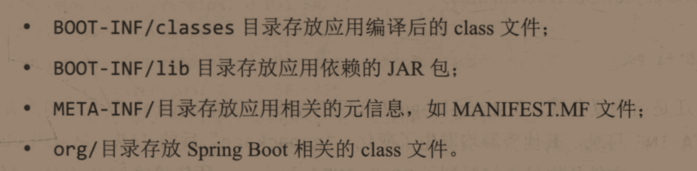


使用Java -jar命令运行JAR文件时候，就是标准的JAR执行操作了，会读取MANIFEST.MF文件作为启动引导类。

```
Manifest-Version: 1.0
Created-By: Maven Archiver 3.4.0
Build-Jdk-Spec: 11
Implementation-Title: Community Service
Implementation-Version: 0.0.1-SNAPSHOT
如果是WAR包就是WarLauncher
Main-Class: org.springframework.boot.loader.JarLauncher
Start-Class: com.applet.Application
Spring-Boot-Version: 2.2.6.RELEASE
Spring-Boot-Classes: BOOT-INF/classes/
Spring-Boot-Lib: BOOT-INF/lib/
```

使用`java -jar`命令启动程序是通过引导类JarLauncher来启动主类Start-Class


手动引入spring-boot-loader项目查看JarLauncher

```java
public class JarLauncher extends ExecutableArchiveLauncher {
    static final String BOOT_INF_CLASSES = "BOOT-INF/classes/";
    static final String BOOT_INF_LIB = "BOOT-INF/lib/";

    public JarLauncher() {
    }

    protected JarLauncher(Archive archive) {
        super(archive);
    }

    protected boolean isNestedArchive(Entry entry) {
        return entry.isDirectory() ? entry.getName().equals("BOOT-INF/classes/") : entry.getName().startsWith("BOOT-INF/lib/");
    }

    public static void main(String[] args) throws Exception {
        (new JarLauncher()).launch(args);
    }
}
```

调用Java -jar命令会执行JarLauncher中的main方法，实际上调用的方法：

```java
protected void launch(String[] args) throws Exception {
    // Spring Boot内部引入了依赖的JAR文件，默认是无法扫描到的，SpringBoot通过注册属性java.protocol.handler.pkgs到classpath中去，即扩展了JAR协议的默认内容
    JarFile.registerUrlProtocolHandler();
    // Create a classloader for the specified archives 创建指定的归档（archives）类加载器
    ClassLoader classLoader = createClassLoader(getClassPathArchives());
    // 实际上继续向下委托给了MainMethodRunner#run方法
    launch(args, getMainClass(), classLoader);
}
```

MainMethodRunner#run：

```java
public void run() throws Exception {
    Class<?> mainClass = Thread.currentThread().getContextClassLoader()
        .loadClass(this.mainClassName);
    Method mainMethod = mainClass.getDeclaredMethod("main", String[].class);
    mainMethod.invoke(null, new Object[] { this.args });
}
```

> 这里的mainClassName指的就是MANIFEST.MF中的Start-Class属性，然后通过反射调用main方法


WAR实现方式与此类似


**打包WAR文件是一种兼容措施，既能被WarLauncher启动，又能兼容Servlet容器环境，换言之，WarLauncher和JarLauncher并无本质差别，所以建议SpringBoot应用使用非传统方式部署时，尽可能地使用JAR归档方式


## 第三章、理解固化的Maven依赖


SpringBoot为我们提供的固化依赖如：spring-boot-starter-parent和spring-boot-dependencies都提供了如版本信息管理等的固化依赖，如果项目有自己的parent就需要使用到后者了

这里有介绍后者的使用：https://docs.spring.io/spring-boot/docs/2.3.2.RELEASE/maven-plugin/reference/html/#using-import


spring-boot-dependencies是spring-boot-starter-parent的parent，其中包含着大量的dependencyManagement指定的版本号信息，甚至还包含maven plugin的管理信息。


就dependency两者好像并没有实质性的差别，但是在plugin上，spring-boot-starter-parent好像对plugin进行了定制，尽量还是使用parent吧


## 第四章、理解嵌入式Web容器


SpringBoot应用直接嵌入Tomcat、Jetty 和Undertow作为核心特性，在2.0版本还嵌入了Netty来做异步请求处理。


Java对HTTP请求的处理仅有两种选择：Servlet和其他。

前者几乎垄断了Java Web的开发，Tomcat和Jetty作为Servlet的经典实现，后来的Undertow作为JBoss社区推出的新一代Servlet3.1+规范的容器（其实就是Servlet3.1规范推出的时候的实现产品），成为嵌入式Servlet容器的新选择，嵌入式容器不是Spring自家推出的功能，而是Tomcat和Jetty在很久以前就已经支持嵌入式容器了。

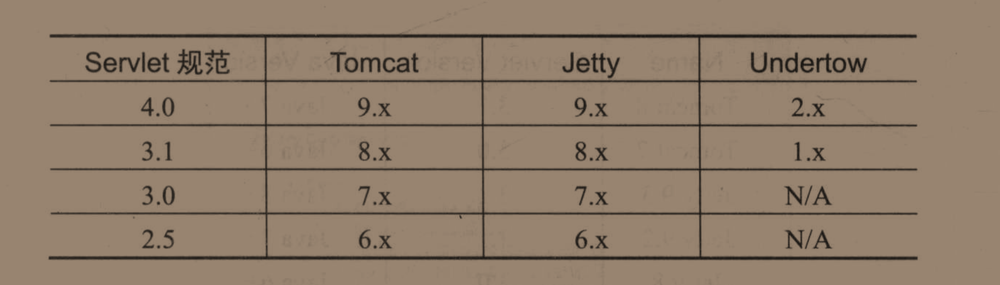

至于Reactive Web容器，默认实现为Netty Web Server，与业内其他基于Netty实现的Web Server类似，如Eclipse vert.x。在Spring Boot Webflux中也是使用前者作为默认嵌入式容器实现，也可以通过spring-boot-starter-reactive-netty引入，也支持嵌入式容器。

热门的Web容器均支持嵌入式容器，并非Spring独创


2.2.6的web-starter的Web容器默认实现是9.0.33的Tomcat


接下来是对Tomcat、Jetty和Undertow作为嵌入式Servlet Web容器的讨论


Tomcat：

点进官网选择最老的版本7，可以看到


即使是7版本也对嵌入式容器有支持

实际上Tomcat自己发行了Maven插件，可以不用部署直接打包成可运行的JAR或WAR文件，估计SpringBoot有偷哦。

但不是将Tomcat作为嵌入式容器打包进项目当中，依然是以Tomcat容器为主体，这点和SPringBoot有所不同

不过Tomcat官方只是将该插件维护到了Tomcat7


Jetty：

切换到Jetty相当简单，在Web-starter exclusion掉tomcat-starter，再引入Jetty-starter即可

undertow也是类似


嵌入式Reactive Web容器


嵌入式Reactive Web容器作为SpringBoot2.0的新特性，处于被动激活的状态，只有检测到starter-webflux之后才会激活，并且当web和webflux同时存在的情况下后者会被忽略


可以使用SpringBoot2.0引入的一种ApplicationContext实现——WebServerApplicationContext来完成获取当前WebServer类型：

```java
@Autowired
WebServerApplicationContext context;

@Override
public void run(ApplicationArguments args) throws Exception {
    System.out.println("=======================================");
    System.out.println(context.getWebServer().getClass().getName());
    System.out.println("=======================================");
}
```

上面是通过让主类来实现ApplicationRunner接口来实现的，等效于下面的代码：

```java
@Bean
public ApplicationRunner runner(WebServerApplicationContext context) {
    return args -> {
        System.out.println("=======================================");
        System.out.println(context.getWebServer().getClass().getName());
        System.out.println("=======================================");
    }
}
```

注册进IoC中的ApplicationRunner会在应用启动后回掉 


另一种查看WebServer的方法：WebServerInitializedEvent（弥补非Web应用类型的场景，感觉 没咋读懂，既然引入了WebServer就必然是Web应用类型了呀，在非web情况下注入WebServerApplicationContext会失败）

```java
@EventListener(WebServerInitializedEvent.class)
public void run(WebServerInitializedEvent event){
    System.out.println(event.getWebServer().getClass().getName());
}
```


如今的Tomcat、jetty、Undertow都支持Reactive，可以直接在webflux的starter外直接加入对应的Servlet容器依赖，而不用再去排除掉默认的实现了，估计是SpringBoot2.0推出的webflux的starter支持


一旦引入了这些依赖到classpath路径，我们就可以利用SpringBoot的自动装配特性来完成后续的配置工作。


## 第五章、理解自动装配


SpringBoot自动装配的对象是Spring Bean，比如通过XML方式和Java配置类方式组装Bean


启用自动装配的方式：在@Configuration类上标注@EnableAutoConfiguration或者是@SpringBootApplication，至于如何装配@Configuration类这里并没有说明，依赖于Spring Framework的装配规则：**XML方式、@Import注解和@ComponentScan注解都可以完成自动装配**，前者需要ClassPathXmlApplicationContext加载，后者需要AnnotationConfigApplicationContext进行注册。

由此看来，SpringBoot程序的自动装配来源于@SpringBootApplication注解的支持


SpringBoot官方给出的

@SpringBootApplication = @Configuration + @EnableAutoConfiguration + @ComponentScan注解，且他们都是用默认配置


实际上并没有这么简单，SpringBoot在1.3的文档中即是这样描述的，SpringBoot2.0的文档并没有真实的反映SpringBootApplication的全部作用

```java
@Target(ElementType.TYPE)
@Retention(RetentionPolicy.RUNTIME)
@Documented
@Inherited
@SpringBootConfiguration
@EnableAutoConfiguration
@ComponentScan(excludeFilters = {
		@Filter(type = FilterType.CUSTOM, classes = TypeExcludeFilter.class),
		@Filter(type = FilterType.CUSTOM, classes = AutoConfigurationExcludeFilter.class) })
public @interface SpringBootApplication {
    // ...
}
```

上述文档中描述的ComponentScan使用默认值，不准确，这里排除了FilterType的两个实现：

- TypeExcludeFilter：在SpringBoot1.4中引入，用于查找BeanFactory中已经注册的TypeExcludeFilter Bean作为代理执行对象
- AutoConfigurationExcludeFilter：在1.5的时候引入，用于排除其他同时标注@Configuration和@EnableAutoConfiguration的类

而在SpringBootApplication注解中使用了这两个Filter

不过还有一个不是很大的区别：SpringBootApplication标注的不是@Configuration而是@SpringBootConfiguration，不过在运行上的行为没有差异，这种类似于对象之间的继承关系好似Component和Configuration，Controller，Service之间的关系一样。


官方还提到了SpringBootApplication上面使用了EnableAutoConfiguration和ComponentScan的属性别名来实现定制化

这里跟着源码走就行了，实践通过

具体是通过Spring Framework4.2，SpringBoot1.2引入的注解@AliasFor


从这里可以看到SpringBootApplication是一个聚合注解，类似于@RestController


如果SpringBootApplication标注于非引导类之上，仍然可以通过SpringApplication的run方法来指定到被SpringBootApplication标注的类上，被run方法指定的类需要具有自动装配的特性，即至少需要@EnableAutoConfiguration注解标注才可执行。

对于Configuration则不强制要求，发现即使run指定的类没有指定@Configuration注解也可以将内部声明的bean加载到容器当中去，就相当于是SpringBoot自动将EnableAutoConfiguration类注册到容器当中去了吧。


@SpringBootApplication作为@Configuration的继承注解的特性：

 

在普通的Component中声明的@Bean对象被称为“轻量模式”的Bean，而在@Configuration 中声明的Bean是“完全模式”的Bean，后者会执行CGLIB提升的操作，前者只是简单的将对象注册到IoC容器当中来。

> 可以通过查看容器中Bean的ClassName来得出结论

这里的CGLIB的提升并非是@Bean对象提供的，而是为@Configuration类准备的

实例代码：

```java
//@Configuration
@EnableAutoConfiguration
public class FirstAppByGuiApplication {

	public static void main(String[] args) {
		SpringApplication.run(FirstAppByGuiApplication.class, args);
	}

	@Bean
	public String hello() {
		return "hello";
	}

	@Bean
	public ApplicationRunner runner1(ApplicationContext context) {
		return args -> {
			System.out.println(context.getBean(String.class).getClass().getName());
			System.out.println(context.getBean(FirstAppByGuiApplication.class).getClass().getName());
		};
	}
}
```

> EnableAutoConfiguration千万不能省略掉，要不然项目启动会出现问题

没有加@Configuration的输出：

```
java.lang.String
thinking.in.spring.boot.firstappbygui.FirstAppByGuiApplication
```

加了@Configuration的输出：

```
java.lang.String
thinking.in.spring.boot.firstappbygui.FirstAppByGuiApplication$$EnhancerBySpringCGLIB$$d72d5601
```

明显的看出代理，Configuration类是被CGLIB增强了的。


自动装配机制

SpringBoot的自动装配机制是依赖于Spring Framework的Bean生命周期管理和Spring编程模型，单Spring Framework自身是不支持@Configuration的自动装配了，SpringBoot1.0便添加了约定配置化导入@Configuration类的方式

实现自动导入配置类的条件判断是依赖于注解：@ConditionalOnClass和@ConditionalOnMissingBean（标注于@Configuration之上），可以指定在特定条件下（当依赖的类找到了，但没有声明配置类）的时候起效。进而实现配置类上@Import注解的导入到更多的依赖类和其他的自动配置


那么最初始的一批配置该如何导入呢？不可能一个个去Import吧，实际上在spring-boot-autoconfigure项目的spring.factories文件中都写着了初始化容器时候加载的Configuration

每个starter都会提供一个autoconfigure包来，可以查看这个包中的spring.factories文件来实现该starter自己的自动装配


实践：创建自己的starter：

实现环境搭建：

非常简单，让引导类处于三级包下，让另一个配置类也处于三级包下，由于默认只会加载引导类的目录下的所有类，因此配置类不会被加载到，我们通过自动配置类来实现自动加载配置类的功能：

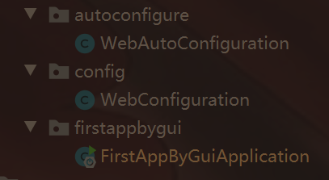

在resources目录下创建META-INF/spring.factories文件，其中应该指定EnableAutoConfiguration注解作为配置类的key，因为自动配置一定会开启（引导类必须指定@EnableAutoConfiguration）也就相当于我们指定的配置类一定会被加载到，

```
org.springframework.boot.autoconfigure.EnableAutoConfiguration=\
thinking.in.spring.boot.autoconfigure.WebAutoConfiguration
```

/只是换行符，如果有多个类需要加载，中间用逗号隔开，如下

```
org.springframework.boot.autoconfigure.EnableAutoConfiguration=\
thinking.in.spring.boot.autoconfigure.WebAutoConfiguration,\
thinking.in.spring.boot.autoconfigure.WebAutoConfiguration
```

> 需要注意的一点：类命名均要以AutoConfiguration作为后缀

从而加载到WebAutoConfiguration配置类（只是写着是AutoConfiguration而已）：

```java
/**
 * Web 自动装配类
 */
@ConditionalOnWebApplication
@Configuration
@Import(WebConfiguration.class)
public class WebAutoConfiguration {
}
```

这里又是Web环境，因此会引入WebConfiguration类，可以在WebConfiguration中做一些输出来验证是否自动配置成功。

从而可以完全实现基于注解的Bean组装。


不可否认的是，随着 越来越多starter的引入，大量的Spring Boot装配变成黑盒，并且搭配条件注解之后显得更加复杂，为了支持以配置化的方式调整应用行为，如Web服务器端口等，Spring Boot提供了Production-Ready特性


## 第六章、理解Production-Ready特性


官方的解释为：Provide production-ready features such as metrics,health check and externalized configuration

production-ready 的一般性定义：

https://github.com/mitodl/handbook/blob/master/production-ready.md


主要是通过Spring-Boot-actuator来实现的

提供HTTP和JMX两种方式来监控和管理Spring


需要手动添加依赖到pom文件，通过暴露的endpoint来实现对程序情况的访问，默认情况下仅仅暴露health和info，要想增加其他，得使用management.endpoints.web.exposure.include=*配置到配置文件或者启动参数当中，这类配置被称为外部化配置


现在只剩下Production-Ready的最后 一个特性——externalized Configuration

官方给出的解释：

> Spring Boot allows you to externalize your configuration so you can work with the same application code in different environments,You cna use properties file,YAML files,environment variables and command-line arguments to externalize configuration


外部化配置的三个用途：

- Bean的@Value注入
- Spring Environment读取
- @ConfigurationProperties绑定到结构化对象


PropertySource之间存在顺序，顺序高的配置可以覆盖掉顺序低的配置（就相当于是配置覆盖了）

https://docs.spring.io/spring-boot/docs/current/reference/html/spring-boot-features.html#boot-features-external-config

感觉SpringBoot的核心文档在Spring Boot Features中


外部化配置的概念：与外部化配置相对应的是内部化配置，如各种set方法就是内部化配置的典型代表，配置数据是来源于应用内部实现的，缺少相应的弹性

SpringBoot采取的外部化配置类似于使用properties文件，命令行参数，系统参数来达到不干预内部代码的情况下实现定制化。


理解约定大于配置：

结合SpringBoot官方给出的最后一个特性：

> - Absolutely no code generation and no requirement for XML configuration

前半句话说明绝无中间代码生成，从而影响SpringBoot应用运行时行为，后半句则是耳熟能详的约定大于配置了。

从技术的角度看，大多数人以为注解驱动是SpringBoot提供的，其实是Spring Framework自身提供的，因此SpringBoot依赖于Spring Framework

Spring Framework的注解在2.5版本时候便开始推广，那时候推荐的是在XML中配置Componentscan，然后在Java代码中使用一系列DI注解实现，依然依赖于XML

到了Spring3.0提供了@Configuration来代替XML，Bean标签也可以被@Bean注解代替，框架还提供了@Import注解来导入@Configuration class并将其注册为Spring Bean，尽管在Bean的装配上有所提升，但仍然需要以硬编码的方式指定范围

Spring3.1发布了@ComponentScan注解来取代了XML的ComponentScan标签，实现了XML的完全可替代性，还提供了部分激活注解@EnableXXX来将指定类装配的 方法，但是被@EnableXXX标注的类需要自己被IoC容器感知到，这就成为了一个先有鸡还是先有蛋的问题了。

> 例如你声明了一个@ComponentScan注解到一个类上，但是在当时脱离了XML后IoC是加载不到该类的，自然无法扫描到@ComponentScan注解了，仍然无法实现自动配置

Spring4.0提出的Conditional注解使得自动配置成为可能，因为官方给出的描述——**“whenever possible”**。


SpringBoot官方给出的六大特征如第三点是maven提供的，第六点是Spring Framework3.1就已经完全支持的，综上 ，Spring Boot的主要五大特征为：

- SpringApplication
- 自动装配
- 外部化配置
- Spring Boot Actuator
- 嵌入式Web容器

这五大特征构成了SpringBoot作为微服务中间件的基础，又提供了SpringCloud的基础设施


其实微服务开发完全没有技术的限制，传统的Java EE容器也可以实现微服务

只不过由于Spring社区十几年的开源策略和技术演进使得Spring Boot在微服务的世界中独占鳌头


虽然Spring Boot提供了丰富的功能特性，但是其天生缺少快速构建分布式系统的能力，为此，Spring官方在SpringBoot的基础上开发出Spring Cloud，致力于为开发人员提供一些快速的通道构建通用的分布式系统，核心特性包含：

- Distributed/versioned Configuration（分布式配置）
- Service registration and discovery（服务注册与发现）
- Routing（路由）
- Service-to-service calls（服务调用）
- Load Balancing（负载均衡）
- Circuit Breaker（熔断机制 ）
- Distributed messaging（分布式消息）

Spring Cloud想提供的这些特性被大多数互联网公司所实现了，Spring官方的最大优势在于其强大的API设计能力（统一抽象，屏蔽技术实现细节），在 云平台Java语言（及其派生语言）处于垄断地位，Spring Cloud高度抽象的接口对于开发人员而言，底层实现是透明的，当需要更换底层时候只需要更换一个starter即可，就类似于Tomcat换Jetty，无需过多的业务回归测试。


Spring Cloud的第二大优势在于Spring Cloud Stream的整合，通过Stream编程模式达到数据传输的目的，感觉是有偷Java语言层面设计的。


SpringBoot的成功使得Spring社区焕发出了第二春，主要是因为SpringBoot的自动装配机制，但自动装配底层依赖的是Spring Framework的注解支持。


# 第二部分、走向自动装配


随着微服务的发展，开发人员开始更加重视SpringBoot了

殊不知Spring Framework是SpringBoot的核心，Java规范才是他们的基石

对Java EE来说，SpringBoot这种优秀的技术架构遵从着“兼容并包，继往开来”的原则，兼容旧的技术实现，发展新的技术理念


## 第七章、走向注解驱动编程（Annotation-Driven）


在Spring Framework第一个版本时候，Java Annotation尚未发布，结合J2EE（Java EE的前身，当时称之为J2EE）的传统，通过XML文件的方式管理Bean之间的依赖关系


注解驱动发展史


2003年发布了Spring Framework1.0版本

Spring1.2.0版本开启了Spring Framework对Annotation的支持

主要也是当时注解的流行导致Java在语言层面开启了对Annotation的支持，随后Spring也做出了相应的支持。

框架层面已经支持了@ManagedResource和@Transactional注解，但是被注解标注的SpringBean对象仍然需要以XML的方式进行装配，对于Spring Framework1.0来说，XML是唯一的选择


2006年Spring2.0正式发布

完全兼容1.0框架，且添加了如数据相关的Repository和AOP相关的Aspect注解，同时支持扩展XML编写，这为XML配置的价值提升了一个阶段

重要版本还是2.5，引入了骨架式的Annotation ：

- 依赖注入Annotation：@Autowired
- 依赖查找Annotation：@Qualifier
- 组件声明Annotation：@Component，@Service
- Spring  MVC Annotation：@Controller，@RequestMapping，@ModelAttribute

>  @Autowired支持注入SpringBean集合

不建议使用Qualifier，建议使用Resource注解


@Qualifier还可以用于“逻辑类型”限定，例如以下的两个注解都被@Qualifier标注

@LoadBalanced和@ConfigurationPropertiesBinding，可以先经过@Qualifier筛选

支持JSR-250的@Resource注入，当然还支持JSR250的生命周期回掉函数@PostConstruct和@PreDestroy，可以被XML替换掉

尽管2.5版本提供的注解不少，但是仍然摆脱不了XML，主要是因为仍然需要在XML中使用如下标签：<context:annotation-config >用于注册Annotation处理器，还需要使用< context:component-scan>用于寻求需要注册成Spring Bean的类

且在2.0的时候提供了@order注解代替Ordered接口来进行对多个Spring Bean进行排序

虽然Spring2.0时期被称为注解的过渡时代，但是在这个版本Spring MVC却完成了蜕变，官方推荐使用注解的方式代替XML的 方式完成编码


2009年Spring Framework3.0正式发布

被称为注解驱动的黄金时代，Spring Annotation雨后春笋般的出现，体现了Spring官方对替换XML配置的决心

> 就我感觉这是非常伟大的，因为Spring在XML配置的PropertyEditor上是花了大心思的，并且Spring为了提供与产品的整合刚开始也都是使用的XML配置方式，现在却自己要推倒自己最强势的地方了，有远见的公司


这个阶段引入了@Configuration注解，@Component的另一个“派生”注解

遗憾的是这时候并未直接替代XML元素ComponentScan而是采用了过度注解的方式——@ImportResource和@Import，前者允许导入遗留的XML配置文件，后者允许导入类作为Spring Bean，通常这些类无需标注Spring模式注解如Service等等。

通常@Import和@ImportResource需要和@Configuration注解一起使用

但是被标注的类有谁来引导呢？提出了定制的ApplicationContext——AnnotationConfigApplicationContext注册@Configuration class，然后通过这个@Configuration class上面标注的Inport注解来实现对依赖的导入。

用起来还是感觉非常的别扭


于是在Spring 3.1提出了@ComponentScan注解实现了对XML元素的替换，且这时候就出现了初步的条件注解@profile，如以下用法：

```java
@Profile("!production")  //非生产环境
@Configuration
public class Configuration {
    // ...
}
```

实现对非生产环境下Configuration的注册


在Web方面更是开启了全面的支持，请求处理注解@RequestHeader、@CookieValue和@RequestPart。但是更重要的是开启了REST开发，提供@PathVariable，@RequestBody反序列化请求体，@ResponseBody将处理方法返回对象序列化为REST主体内容，并且@ResponseStattus补充HTTP响应状态

主要还抽象了一套全新并统一的配置属性API，包括配置属性存储接口Environment，配置源抽象PropertySources，奠定了Spring外部化配置的基础，Spring为了简化获取外部化配置 ，提供了@PropertySource简化实现。

其次还支持了缓存抽象，异步支持，检验方面的支持。

即使是这样，Spring作者仍然继续添加“@Enable模块驱动”来实现模块化的Bean装配，例如@EnableWebMVC被标注在Spring Bean上后，RequestMappingHandlerMapping、RequestMappingHandlerAdaptor，HandlerExceptionResolver等Bean就被装配上了，当然这需要手动声明在配置类上，只能算作手动配置，也离自动配置更近了一步

仍然存在缺陷如：@Profile条件注解仍然功能单一太过简单等等


2013年的Spring4.0

注解驱动完善时代

不像Spring3.0版本中注解的大爆发侵入，有的只是完善的注解体系补充

提升装配能力的条件判断，引入了@Conditional注解，以至于曾经的@Profile注解都以Conditional注解的方式实现了一遍

从条件判断注解的完善标志着SpringBoot项目的基础正式打牢

Spring在4.2提出了EventListener作为ApplicationListener的备选方案

使用注解@AliasFor使得注解属性可以使用别名


2017年的Spring5.0

已经作为SpringBoot2.0的核心框架了，还没发行完，万一后面引入了什么新的特性了呢


Spring Framework个个版本引入的核心注解可以查看7.2节


深度展开：

- 元注解
- Spring模式注解
- Spring组合注解
- Spring注解属性别名和覆盖

元注解：能声明在其他注解上的注解，如@Documented注解可以成为任何注解的元注解，

在Spring世界中@Component就是标准的元注解


Spring注解模式就是特定场景下的注解，如Service之于 Component，因为Java语言层面是不允许注解之间的继承，因此需要通过给元注解特殊化的方式实现注解之间的派生


使用Spring Version模拟自定义@Component派生类：

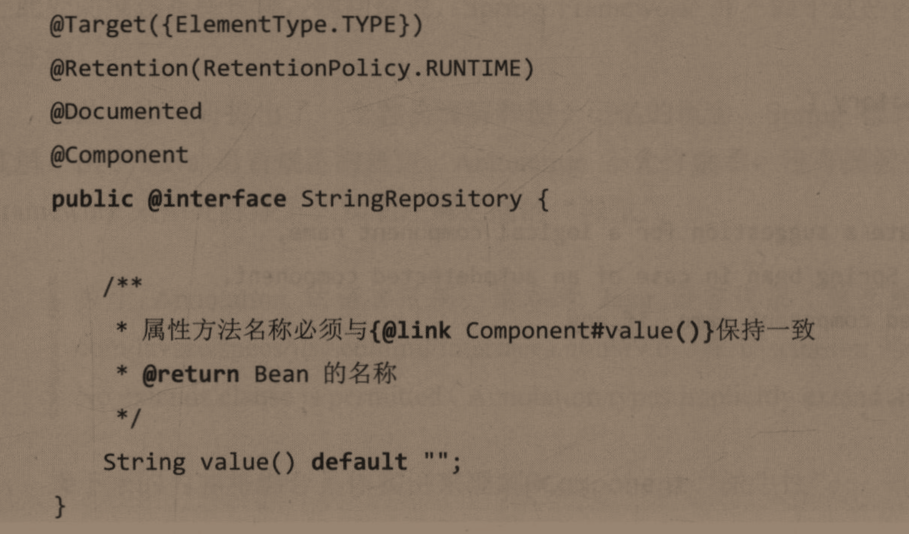

剩下的就是简单的验证过程了，单有一个地方非常有趣：

在引导类 中出现了如下代码：

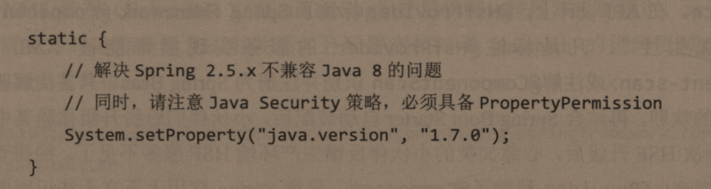

来实现Spring对Java8的兼容，测试用例：

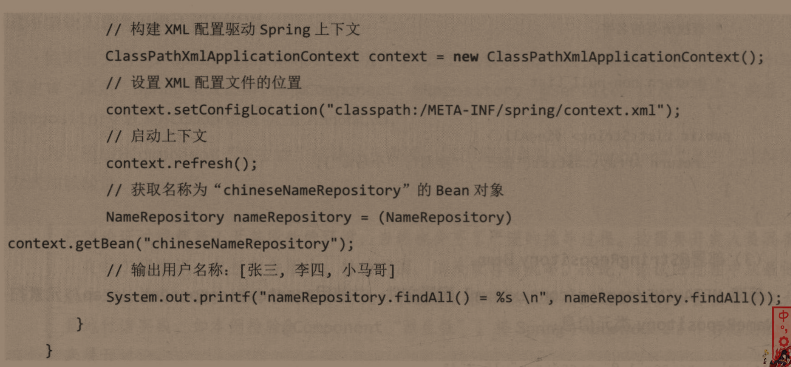

主要为了证明派生注解也拥有元注解的作用。


派生性原理：初始化一个Bean定义解析器

componentScan标签的Bean定义解析器为：ComponentScanBeanDefinitionParser

于是开始解析出需要装配的BeanDefinitionHolder，方法摘要如下：

```java
public BeanDefinition parse(Element element, ParserContext parserContext) {
    String basePackage = element.getAttribute(BASE_PACKAGE_ATTRIBUTE);
    basePackage = parserContext.getReaderContext().getEnvironment().resolvePlaceholders(basePackage);
    String[] basePackages = StringUtils.tokenizeToStringArray(basePackage,
                                                              ConfigurableApplicationContext.CONFIG_LOCATION_DELIMITERS);

    // Actually scan for bean definitions and register them.
    ClassPathBeanDefinitionScanner scanner = configureScanner(parserContext, element);
    Set<BeanDefinitionHolder> beanDefinitions = scanner.doScan(basePackages);
    registerComponents(parserContext.getReaderContext(), beanDefinitions, element);

    return null;
}
```

于是对BeanDefinition的加载还要归属到ClassPathBeanDefinitionScanner#doScan方法上去：

```java
protected Set<BeanDefinitionHolder> doScan(String... basePackages) {
   Assert.notEmpty(basePackages, "At least one base package must be specified");
   Set<BeanDefinitionHolder> beanDefinitions = new LinkedHashSet<>();
   for (String basePackage : basePackages) {
      Set<BeanDefinition> candidates = findCandidateComponents(basePackage);
      for (BeanDefinition candidate : candidates) {
         ScopeMetadata scopeMetadata = this.scopeMetadataResolver.resolveScopeMetadata(candidate);
         candidate.setScope(scopeMetadata.getScopeName());
         String beanName = this.beanNameGenerator.generateBeanName(candidate, this.registry);
         if (candidate instanceof AbstractBeanDefinition) {
            postProcessBeanDefinition((AbstractBeanDefinition) candidate, beanName);
         }
         if (candidate instanceof AnnotatedBeanDefinition) {
            AnnotationConfigUtils.processCommonDefinitionAnnotations((AnnotatedBeanDefinition) candidate);
         }
         if (checkCandidate(beanName, candidate)) {
            BeanDefinitionHolder definitionHolder = new BeanDefinitionHolder(candidate, beanName);
            definitionHolder =
                  AnnotationConfigUtils.applyScopedProxyMode(scopeMetadata, definitionHolder, this.registry);
            beanDefinitions.add(definitionHolder);
            registerBeanDefinition(definitionHolder, this.registry);
         }
      }
   }
   return beanDefinitions;
}
```

还有一次调用：findCandidateComponents的调用栈

然后归结到方法：PathMatchingResourcePatternResolver#getResources方法得到资源集合，这个类在Spring揭秘中见过 ，是Spring提供的资源操作类，解析出Resource[]对象

```java
public Resource[] getResources(String locationPattern)
```

根据传入的basepackage，获取到所有的Resource然后进行candidate进行筛选

至于筛选的标准，则需要看最开始的ComponentScanBeanDefinitionParser#parse的第八行

关注ClassPathBeanDefinitionScanner对象，其中是含有includeFilters和excludeFilters的

查看他父类的方法ClassPathScanningCandidateComponentProvider：

```java
protected void registerDefaultFilters() {
    this.includeFilters.add(new AnnotationTypeFilter(Component.class));
    ClassLoader cl = ClassPathScanningCandidateComponentProvider.class.getClassLoader();
    try {
        this.includeFilters.add(new AnnotationTypeFilter(
            ((Class<? extends Annotation>) ClassUtils.forName("javax.annotation.ManagedBean", cl)), false));
        logger.trace("JSR-250 'javax.annotation.ManagedBean' found and supported for component scanning");
    }
    catch (ClassNotFoundException ex) {
        // JSR-250 1.1 API (as included in Java EE 6) not available - simply skip.
    }
    try {
        this.includeFilters.add(new AnnotationTypeFilter(
            ((Class<? extends Annotation>) ClassUtils.forName("javax.inject.Named", cl)), false));
        logger.trace("JSR-330 'javax.inject.Named' annotation found and supported for component scanning");
    }
    catch (ClassNotFoundException ex) {
        // JSR-330 API not available - simply skip.
    }
}
```

只需要关注第一行即可，后面是对JSR的支持，默认通过AnnotationTypeFilter指定添加包含@Component的AnnotationTypeFilter实例，而excludeFilters字段为空。

归根结底还是由AnnotationTypeFilter的识别功能来判断是否注册此BeanDefinition到容器中

ClassPathBeanDefinitionScanner允许我们自定义过滤规则，从而实现与Spring的解耦

~~只需要注入ClassPathBeanDefinitionScanner~~，他的父类中实现了addIncludeFilter、addExcludeFilter等方法可以直接使用，达到指定注解添加到IoC的目的

> Spring并没有将ClassPathBeanDefinitionScanner注入到IoC当中去

自己尝试了下，最新版本的Spring并未使用ClassPathBeanDefinitionScanner

可以参考SpringBootApplication中的ComponentScan注解使用，如下：

```java
@EnableAutoConfiguration
@SpringBootConfiguration
@ComponentScan(excludeFilters = { @ComponentScan.Filter(type = FilterType.CUSTOM, classes = TypeExcludeFilter.class),
        @ComponentScan.Filter(type = FilterType.CUSTOM, classes = AutoConfigurationExcludeFilter.class) },
includeFilters = {@ComponentScan.Filter(type = FilterType.ANNOTATION,classes = Candidate.class)})
public class ThinkingInSpringBootSamplesApplication {

    public static void main(String[] args) {
        SpringApplication.run(ThinkingInSpringBootSamplesApplication.class, args);
    }

    @Bean
    public ApplicationRunner runner(TestBean testBean) {
        return args -> {
            testBean.sayHello();
        };
    }
}
```

因为SpringBootApplication没有提供includeFilter这一属性，我们需要手动代替掉SpringBootApplication注解，然后通过给@ComponentScan加上一个includeFilter属性即可


IDEA也会给出提示的，只要你注入到容器当中就不会报错了。


Spring对多重派生的支持：从3开始支持两层结构的派生，到4支持任意深度的派生，因为SpringBoot1.0是基于Spring4.0的，因此SpringBoot完美继承Spring的多重派生


Spring组合注解：

Spring组合注解中的元注解允许是Spring模式注解与其他Spring功能性注解的任意结合

常见的如：@RestController就是由元注解@Controller和功能注解@ResponseBody组合而成，~~又如@TransactionService就是由元注解@Service和功能注解@Transactional组合而来~~

书上举的例子，但是在引入MyBatis的starter的时候并未发现存在该注解


Class对象是类的元信息载体，承载着其成员的元信息对象，包括：字段、方法、构造器以及注解等，于是提供了获取当前类标记的注解 的方法：AnnotationMetadata#getAnnotationAttributes（String）

该方法的底层实现是由Java的反射编程模型作为基础，Java语言默认所有注解实现Annotation接口，被标注的对象用AnnotatedElement表示，通过AnnotatedElement#getAnnotation（Class）方法返回指定类型的注解对象

使用方法：

```java
@SpringBootApplication(scanBasePackages = {"cn.luckycurve.thinkinginspringbootsamples"})
public class ThinkingInSpringBootSamplesApplication {

    public static void main(String[] args) {
        AnnotatedElement element = ThinkingInSpringBootSamplesApplication.class;
        SpringBootApplication springBootApplication = element.getAnnotation(SpringBootApplication.class);
        System.out.println(Arrays.toString(springBootApplication.scanBasePackages()));
    }
}
```

别想着直接通过ThinkingInSpringBootSamplesApplication去获取@@ComponentScan注解，会找不到的，注解之间不仅仅是相互堆叠的关系，一个注解标注在另一个注解上在语法层面是没有任何意义的，但是Spring的类加载器会递归所有的注解这才导致了内层注解会生效。

上面终归还是指定了获取SpringBootApplication中的哪个属性，完全的反射使用如下：

```java
public static void main(String[] args) {
    AnnotatedElement element = ThinkingInSpringBootSamplesApplication.class;
    SpringBootApplication springBootApplication = element.getAnnotation(SpringBootApplication.class);
    // 可以学习一下
    ReflectionUtils.doWithMethods(SpringBootApplication.class,
                                  method -> System.out.printf("@TransactionalService.%s() = %s\n",
                                                              method.getName(),
                                                              ReflectionUtils.invokeMethod(method, springBootApplication)),
                                  method -> method.getParameterCount() == 0);
}
```

以上方法调用了所有无参method，但因为其中混杂着Annotation的方法，需要将这些方法排除方可看到SpringBootApplication的方法，将最后一个筛选方法的条件替换掉。


使用Spring提供的注解递归实现：

```java
/**
     * 使用Spring提供的Annotation操作递归获取所有派生Annotation信息
     * 只能输出String和boolean等基本数据类型，碰到Class就直接输出了
     */
public static void baseSpringAnnotation() {
    // 获取AnnotationMetadata信息
    AnnotationMetadata annotationMetadata = AnnotationMetadata.introspect(ThinkingInSpringBootSamplesApplication.class);

    // 获取所有的元注解类型集合
    Set<String> types = annotationMetadata.getAnnotationTypes()
        // 如果不这样处理就只能看到一个SpringBootApplication注解，其他都没有
        .stream()
        // 读取单注解的所有元注解集合
        .map(annotationMetadata::getMetaAnnotationTypes)
        // 合并元注解
        .collect(LinkedHashSet::new, Set::addAll, Set::addAll);

    System.out.println(types);

    // 逐条获取属性输出
    types.forEach(metaAnnotation -> {
        // 读取元注解的属性
        Map<String, Object> annotationAttributes = annotationMetadata.getAnnotationAttributes(metaAnnotation);
        if (!CollectionUtils.isEmpty(annotationAttributes)) {
            annotationAttributes.forEach((key, value) -> {
                System.out.printf("注解 %s 属性 %s = %s\n", ClassUtils.getShortName(metaAnnotation), key, value);
            });
        }
    });
}
```


详细看下第三种方法，使用Spring提供的Utils来进行的操作：

```java
/**
     * 使用Spring提供的Utils来直接输出当前注解的属性，比第一种方便许多
     * 但是无法做到第二种对该注解的派生注解的属性输出
     * 使用这个方法有个直接的好处就是可以直接查看到元注解的属性
     */
public static void useSpringUtil() {
    AnnotationAttributes attributes = AnnotatedElementUtils.getMergedAnnotationAttributes(ThinkingInSpringBootSamplesApplication.class,
                                                                                          ComponentScan.class);
    System.out.println(attributes);
}
```

将注解属性抽象成为了AnnotationAttributes，通过这种方式可以直接获取到元注解的AnnotationAttributes，Spring提供的最大便利了。

AnnotationAttributes直接扩展子：`LinkedHashMap<String,Object>`


获取AnnotationAttributes的时候存在一个覆盖问题，因为使用了@AliasFor注解，那么如果对于RestController来说，是Controller的value属性作数，还是Component的Value属性作数呢 ？因为都有默认值“”，结果发现是派生注解的属性作数，可以覆盖元注解的字段。

存在着显性覆盖和隐性覆盖两种原则：

- 隐性覆盖：派生注解能够覆盖元注解的同名属性
- 显性覆盖：标注@AliasFor注解的字段有权利进行覆盖

这都是Spring提供的特性，在Java语言层级是不会出现派生注解，元注解的关系，元注解在Java语言层面是无效的。


当然也会存在同一注解中两个属性相互的AliasFor 情况，要求这两个值必须相等，只要别同时赋值就行了。另外，如果Value属性显式得使用了AliasFor注解去别名其他注解，他的隐式覆盖规则仍然 生效。


## 第八章、Spring注解驱动设计模式


前面主要集中讨论在单一Annotation例如Component和少数组件上，这一章讲解“@Enable模块驱动”部分，系统地介绍这部分内容


Spring Framework在3.1开始支持@Enable模块驱动

这里的模块是指具备相同领域的功能组件集合，所形成的一个独立的单元，比如Web MVC模块，AspectJ代理模块，Cache模块，JMX模块，Async模块等等

Spring提供的@Enable模块驱动这种设计模式有别于传统的23种设计模式

提供的@Enable注解模块如下图：

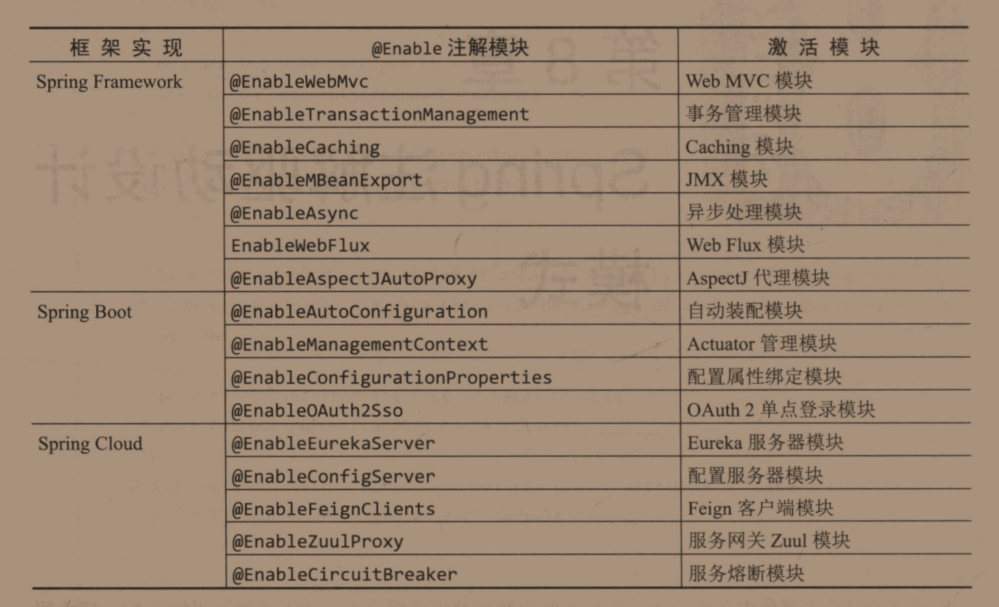

这样使用就可以屏蔽组件中集合装配的细节，开发者只需要将Annotation标注在某个Bean上，即可实现装配过程，但是实现该模式的成本较高，也就是用起来爽，但是实现和理解这个功能费劲


依赖于Spring Framework提供的注解@Import，该注解在3.1的时候做出了调整，在3.0的时候仅限导入一个被@Configuration标注的类，但是在3.1及以后增加了导入@Bean方法的类，以及ImportSelector或ImportBeanDefinitionRegistrar

> 实际测试中直接导入一个普通的类也是可以的

于是将@Configuration类和@Bean方法（如果按照我测试的，应该是任意被Import的类，除去ImportSelector和ImportBeanDefinitionRegistrar）归类为“注解驱动”，而ImportSelector和ImportBeanDefinitionRegistrar的实现类则归类于”接口编程“


注解驱动可以观察@EnableWebMvc注解，模仿他我写一个类似的（以下是基于注解驱动的Spring，感觉那时候老师交Spring都是用XML，反倒忽略了Spring注解驱动带来的便利）：

1、@Enable模块：

```java
@Retention(RetentionPolicy.RUNTIME)
@Target(ElementType.TYPE)
@Documented
@Import(HelloWorldConfiguration.class)
public @interface EnableHelloWorld {
}
```

全部搬运@EnableWebMvc，除了Import，来看看Import

```java
public class HelloWorldConfiguration {

    @Bean
    public HelloWorld helloWorld() {
        return new HelloWorld();
    }
}
```

具体的HelloWorld代码：

```java
public class HelloWorld {
    public void sayHello() {
        System.out.println("hello Spring");
    }
}
```

主测试代码，使用Spring启动的：

```java
@EnableHelloWorld
public class ThinkingInSpringBootSamplesApplication {

    public static void main(String[] args) {
        // 使用Spring Annotation方式启动项目
        AnnotationConfigApplicationContext context = new AnnotationConfigApplicationContext();
        // 注册当前引导类
        context.register(ThinkingInSpringBootSamplesApplication.class);
        // 启动上下文
        context.refresh();
        HelloWorld bean = context.getBean(HelloWorld.class);
        bean.sayHello();
        // 关闭上下文
        context.close();
    }
}
```

> 这种启动方式即使引入了starter他们的自动配置也无法生效


上面展示的注解驱动，下面的接口编程可能比较复杂

ImportSelector比ImportBeanDefinitionRegistrar容易

使用ImportSelector可以参考@EnableCaching，具体就是要实现：

```java
String[] selectImports(AnnotationMetadata importingClassMetadata);
```

这个方法，弹性较注解驱动较大，但是Spring实现较少


至于ImportBeanDefinitionRegistrar和ImportSelector类似

实现这个方法即可：

```java
default void registerBeanDefinitions(AnnotationMetadata importingClassMetadata, BeanDefinitionRegistry registry);
```


这全部都要依赖于Spring的@Import的自动装配功能

注解驱动模式下的实现：使用XML方式的`<Context:component-scan/>`开启的基于注解的自动配置还是使用AnnotationConfigApplicationContext开启的基于注解的配置都会帮我们向容器中注入一个对象——ConfigurationClassPostProcessor帮助我们装载@Configuration和@Bean，他是最高优先级的BeanFactoryPostProcessor实现

在postProcessBeanFactory中的processConfigBeanDefinitions进行了检查

@Component也可以被视为是@Configuration，只是在筛选的时候排除去@Order注解默认的排序是在@Configuration后面的


基于注解的@ImportSelector和@BeanDefinitionRegistrar也是在这个类当中


模块装配类似于汽车的手动挡，自动装配类似于汽车的自动档，两者并未完全排除，而是相互兼容，当然自动装配是简历在模块装配之上的。


来看看Spring Framework提供的自动装配

> 很多人都以为自动装配是SpringBoot独有的功能

Spring3.1提供了Web自动装配的功能


在3.1引入了WebApplicationInitializer接口用于实现Servlet3.0中的Initializer，后者可用于替换web.xml文件的，这是Servlet3.0所提供的特性，然而Spring在3.1版本将该特性使用Spring的方式进行了封装，使得开发人员更容易去实现，直接实现该接口即可。

当然如果直接使用WebApplicationInitializer接口较为困难，那么可以使用他的抽象实现类：AbstractDispatcherServletInitializer，或者可以再具体一点，去实现AbstractDispatcherServletInitializer的抽象子类：AbstractAnnotationConfigDispatcherServletInitializer。

一般都不会直接使用到WebApplicationInitializer接口，而是使用两个抽象实现类：

具体用例：

AbstractAnnotationConfigDispatcherServletInitializer:

```java
public class MyWebAppInitializer extends AbstractAnnotationConfigDispatcherServletInitializer {

    @Override
    protected Class<?>[] getRootConfigClasses() {
        return null;
    }

    @Override
    protected Class<?>[] getServletConfigClasses() {
        return new Class<?>[] { MyWebConfig.class };
    }

    @Override
    protected String[] getServletMappings() {
        return new String[] { "/" };
    }
}
```

这种配置类似于基于Java Config配置驱动

AbstractDispatcherServletInitializer：

```java
public class MyWebAppInitializer extends AbstractDispatcherServletInitializer {

    @Override
    protected WebApplicationContext createRootApplicationContext() {
        return null;
    }

    @Override
    protected WebApplicationContext createServletApplicationContext() {
        XmlWebApplicationContext cxt = new XmlWebApplicationContext();
        cxt.setConfigLocation("/WEB-INF/spring/dispatcher-config.xml");
        return cxt;
    }

    @Override
    protected String[] getServletMappings() {
        return new String[] { "/" };
    }
}
```

基于XML的配置驱动


全都是向DispatcherServlet中注册信息

基于对Spring Configuration的配置驱动，深入研究这个即可


完全可以在AbstractAnnotationConfigDispatcherServletInitializer#getServletConfigClasses方法中注册进一个包含了@EnableWebMvc和@ComponentScan（Basepackages）的配置类，从而实现自动开启WebMvc和自动开启扫描的功能，从而实现自动装配。


当然单独依靠Spring Framework3.2（两个抽象子类是3.2提出的）是不足以Web自动装配的能力，因为Spring Framework3.1中提出的接口是基于Servlet3.0的规范，从而达到在开启Servlet容器的时候自动配置进我们的配置类


Servlet3.0打破了原来的各种Servlet，filter，listener必须注册进web.xml文件的传统，实现了更高的灵活性，因为web.xml不支持占位符也不支持条件运算，绝对的静态文件。

在Servlet3.0支持以编程的方式配置Servlet，Filter，Listener，通过操作ServletContext对象来完成，且方法摘要非常简单：

```java
public ServletRegistration.Dynamic addServlet(String servletName, String className);

public ServletRegistration.Dynamic addServlet(String servletName, Servlet servlet);

public ServletRegistration.Dynamic addServlet(String servletName,
                                              Class<? extends Servlet> servletClass);
```

当然这还远远达不到自动装配的目的，但是给了第三方框架例如Spring MVC的很大机会，Spring MVC允许通过注解的方式标识Servlet，Filter，Listener，然后通过反射获取类信息，调用ServletContext的add方法将其注册进Servlet中。这些方法只会在容器初始化时候被调用，Spring实现了Servlet提供的Initialization接口。


Spring的条件装配，在前面已经提到过，有3.1开始逐步引入的@Profile和@Conditional注解

在没有这个注解之前，XML也是没有提出使用Profile属性的，那么那时候是如何对不同的生产环境实现配置的单独处理的呢？

就好似现在的SpringBoot项目，默认是读取application.properties，也可以读取appliation-{env}.properties，从而实现不同环境下的配置文件需求，只不过当时是XML文件而不是properties文件

而在Profile注解出来之后，容器会根据Profile注解来决定该配置类（也有可能是Component的其他派生注解标注的类）是否会加载到IoC中来，判断条件也是十分简单，只要实现简单的Profile比对即可。


已知的Bean注册方式有两大类：注解驱动和传统XML配置驱动，对应的配置进行方式分别是@Profile和`<beans profile="">`

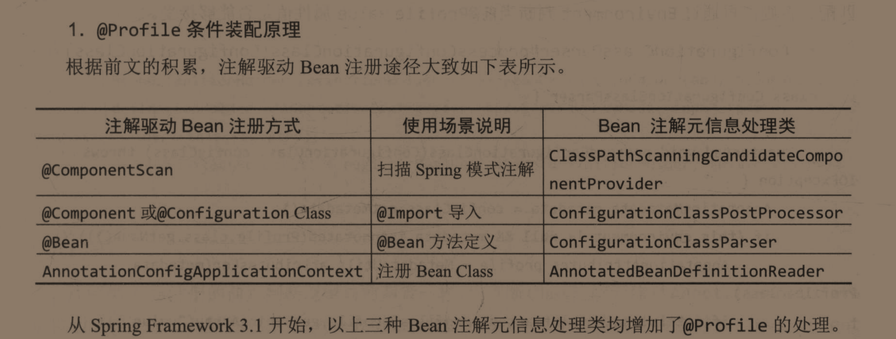


具体的加载方式在8.3.3，P277

里面有全程的预加载BeanDefinition过程，有多种处理方式

XML的Profile判断则相对单一


Spring4.0提出的@Candidational具有更大的弹性，前面的Profile像是静态的激活，而Conditional更倾向于运行时候的动态选择

其中允许指定一个或者多个Condition，当所有condition都满足的时候才会匹配成功


可以自定义实现Conditional注解，参照283页，也可以参照Profile的实现

在Spring4.0也就是Conditional注解出来的时候使用了@Conditional作为其元注解来实现的。


具体的内部实现使用过ConditionEvaluator#shouldSkip方法来判断是否应该跳过当前被标注的类，返回true表示遇到了不匹配的实例，应该跳过


然后再去覆盖原来Profile的判断逻辑，改变成对这个方法的调用，实现条件判断的统一


当然尽管Spring Framework付出了如此多的努力，但是仍然不是特别理想，如存在以下问题：

- 需要将@Enable注解标注在配置类上，并且配置类需要注册进容器中去
- Web自动装配是依赖于外部Servlet3.0+容器中，如果换了容器就失去了该功能

正因为这些原因，驱动着SpringBoot项目的出现，最终被SpringBoot的自动装配和嵌入式Web容器所解决。

虽然自动装配是SpringBoot的特性，但是其在Spring Framework中的部分场景中还是有用的。


## 第九章、Spring Boot自动装配


当然其中可能还有一系列问题如：需要整合 Spring注解编程模型，@Enable模块驱动手动配置 及条件装配等**Spring Framework原生特性**，这种技术即是Spring Boot自动装配。

Spring  Boot的自动装配可以从@SpringBootApplication注解说起：

通过该注解可以激活@EnableAutoConfiguration，该类应该是使用 了Spring的@Enable特性，但是这个注解绝对是Spring Boot独有的

另外还激活了@SpringBootConfiguration，相当于就是一个@Configuration的简单派生类

至于@ComponentScan，则是Spring Framework4.0所提供的注解，没有什么区别


理解@EnableAutoConfiguration

Spring Boot项目会根据你 应用的依赖来尝试自动配置，如果要开启这种尝试，可以在配置类上面加上@EnableAutoConfiguration

实际上完全可以使用@EnableAutoConfiguration在启动类上就可以开启自动配置了，完全不依赖于 @Configuration，至于为什么推荐 使用@SpringBootApplication，估计是因为免得再去指定一个ComponentScan注解，尽量减轻 开发人员的记忆负担。

并且在随后官方文档指出Spring Boot自动装配不是侵入式的，开发人员可以定义自己的配置类来覆盖掉自动配置，可以理解为自定义的配置优先级高

> 实际上会使用@Conditional来判断你是否进行了配置，如果没有进行配置则Conditiona为true，自动配置生效，否则自动配置失效


排除自动配置：

内部配置：@EnableAutoConfiguration.exclude()或者excludeName（使用场景：If the class is not on the classpath）

外部配置：spring.autoconfigure.exclude


可以简单猜测下实现原理：@EnableAutoConfiguration通过ImportSelector实现选择性的导入，通过@Value注解可以获取到外部配置的exclude，内部配置可以通过AnnotationMetadada获取

内部实现就得看@EnableAutoConfiguration所Import的AutoConfigurationImportSelector了

ImportSelector的核心方法：

```java
@Override
public String[] selectImports(AnnotationMetadata annotationMetadata) {
   if (!isEnabled(annotationMetadata)) {
      return NO_IMPORTS;
   }
   AutoConfigurationEntry autoConfigurationEntry = getAutoConfigurationEntry(annotationMetadata);
   return StringUtils.toStringArray(autoConfigurationEntry.getConfigurations());
}
```

将核心代码都封装到了getAutoConfigurationEntry方法中，再进去：

```java
protected AutoConfigurationEntry getAutoConfigurationEntry(AnnotationMetadata annotationMetadata) {
    if (!isEnabled(annotationMetadata)) {
        return EMPTY_ENTRY;
    }
    AnnotationAttributes attributes = getAttributes(annotationMetadata);
    List<String> configurations = getCandidateConfigurations(annotationMetadata, attributes);
    configurations = removeDuplicates(configurations);
    Set<String> exclusions = getExclusions(annotationMetadata, attributes);
    checkExcludedClasses(configurations, exclusions);
    configurations.removeAll(exclusions);
    configurations = getConfigurationClassFilter().filter(configurations);
    fireAutoConfigurationImportEvents(configurations, exclusions);
    return new AutoConfigurationEntry(configurations, exclusions);
}
```

可以根据方法名猜个大概了

装配哪些组件可以查看：getCandidateConfigurations方法

排除哪些组件的自动配置：getExclusions方法


getCandidateConfigurations内部最终依赖的是SpringFactoriesLoader#loadFactoryNames方法，该方法内部的加载逻辑：

1、搜索ClassLoader下所有的META-INF/spring.factories资源内容

2、读取spring.factories文件，以Map方式格式化

3、解析2中返回的Map，将Value，也就是权限定类名所确定的类注册进IoC容器当中去

在官方文档的4.29.2. Locating Auto-configuration Candidates当中


至于getExclusions就非常简单的，结合AnnotationMetadata来实现

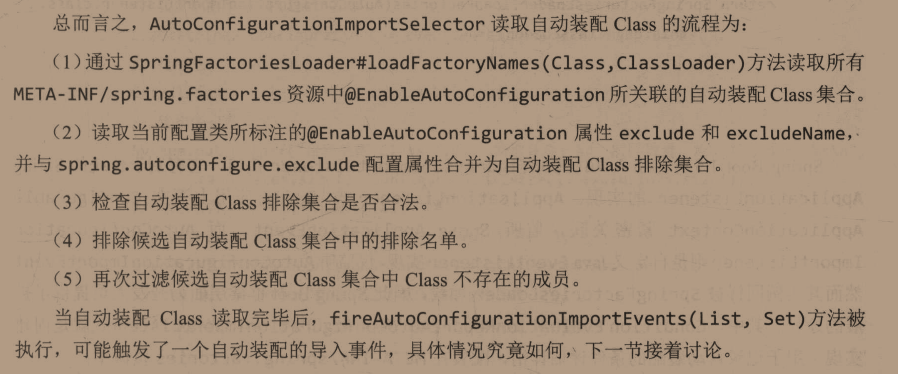


继续探讨AutoConfigurationImportSelector的筛选后续，在读取完所有的Class之后，调用了fireAutoConfigurationImportEvents方法用于事件的自动装配


剩下的@EnableAutoConfiguration 也是讲的排序等的组件装配

排序分为绝对排序和相对排序，绝对排序提供了AutoConfigureOrder（注意：并不是Order的派生注解），相对排序提供AutoConfigureBefore和AutoConfigureAfter注解，都是元注解。


在使用注解的时候尽量不要使用Value属性，而是使用其更加具体的属性，因为Value太过于通用，说不定以后就指定成别的属性的别名了。


自定义SpringBoot自动装配

其中有很多不成文的规则，无论 是Spring还是第三方如Mybatis都在共同遵守着：

自动装配Class命名 均以 AutoConfiguration结尾

包命名规则均以：

```
${root-package}
	autoconfigure
		${module-package}
			*AutoConfiguration.java
			${sub-module-package}
				类似module-package这一级来了
```

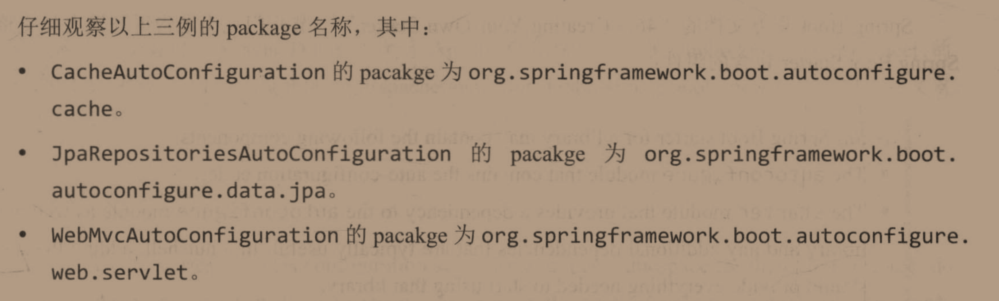


知道了命名规则后便可以开始自定义starter

4.29.5. Creating Your Own Starter可以 参考

项目命名：

建议民间使用

Spring官方则采用以下命名方法：

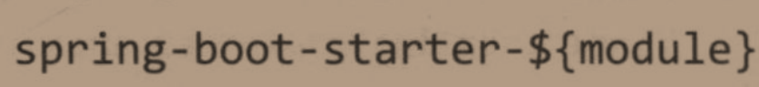


当然使用starter很简单，但是专业性较强的starter却要求Configuration类需要标注一系列的@Conditional用来保证运行环境的正确，Spring官方提供的条件注解有：

> 可以查看4.29.3. Condition Annotations
>
> 条件注解不仅可以标注在类上，还可以标注在@Bean方法上用于判断是否将该值注册IoC当中去

- Class Conditions
- Bean Conditions
- Property Conditions
- Resource Conditions
- Web Application Conditions
- SpEL Expression Conditions


Class Conditions：

主要有一对反义注解——@ConditionalOnClass和@ConditionalOnMissingClass，分别表述在指定类存在时和在指定类缺失时的语义

> 前面推荐不要使用注解中的Value属性，这里就出现了，@ConditionalOnMissingClass的Value属性变化多样，在SpringBoot版本 升级的过程当中，且存在破坏性升级

主要是避免这种情况的发生： 因为SpringBoot中间铲平的Maven依赖都有可能声明成optional为true的形式，这样是为了避免冲突，也进一步减少包的体积，然而这就会的熬制一个问题，如果SpringBoot最终产品没有包含这个Jar包，就会出现Class找不到的情况，这个注解就是用于判断Class是否存在，从在给指定场景来自动配置的。

非常容易理解，autoconfig项目中在原编码中肯定都包含了各种starter的AutoConfiguration，最后他会根据我们SpringBoot最终产品来决定执行哪些自动配置

难怪有时候看依赖的第三方库里面好多红色的，原来是通过指定optional为true来实现的


Bean Conditions：

也是成对出现的——@ConditionalOnBean和@ConditionalOnMissingBean

仅仅匹配BeanDefinition中的Bean种类和名称

底层依旧是基于@Conditional+SpringBootCondition实现类OnBeanCondition

这里主要是防止自动配置覆盖了由开发人员主导的外部化配置

当外部化配置存在的时候，该自动配置就不应该生效了。

也等价于当外部配置不存在的时候自动配置才会生效

完美契合@ConditionalOnMissingBean的语义，当然这里还需要结合@ConditionalOnClass来实现，避免因为依赖的关系导致运行过程中报错。

只整合这两个注解就会成倍地增加项目的复杂度，当引入更多注解时候只会更加复杂，当然是先的功能也会更加丰富


Property Conditions：

主要就是@CoditionalOnProperty注解，配置来源于Java系统变量，环境变量和application.properties都是PropertySource的来源，也是该注解基于的环境配置

该注解摘要：

```java
@Retention(RetentionPolicy.RUNTIME)
@Target({ ElementType.TYPE, ElementType.METHOD })
@Documented
@Conditional(OnPropertyCondition.class)
public @interface ConditionalOnProperty {

   String[] value() default {};

   String prefix() default "";

   String[] name() default {};

   String havingValue() default "";

   boolean matchIfMissing() default false;

}
```

对应的配置：


这样就可以根据application.properties来决定是否要开启自动配置了，如：`@ConditionalOnProperty(prefix="git-config",name="enabled",havingValue="true")`

这样只有在声明git-config.enabled=true 的时候才会满足配置条件

当然这样就会非常麻烦，每次都要去手动开启，如何省略掉这一步骤呢？使用其提供的matchIfMissing属性，将其设置成true，这样当只要该PropertySource不存在时候即可开启自动配置，需要关闭的时候也只需要手动声明enabled=false即可，然后提供自己的配置，这也正是很多框架所使用的方法。

最常见的例子就是Spring AutoConfiguration包下提供的：

```java
@Configuration(proxyBeanMethods = false)
@ConditionalOnClass({ MBeanExporter.class })
@ConditionalOnProperty(prefix = "spring.jmx", name = "enabled", havingValue = "true")
public class JmxAutoConfiguration {
 	...   
}
```


Resource Conditions：

核心租借@ConditionalOnResource，该注解摘要：

```java
@Target({ ElementType.TYPE, ElementType.METHOD })
@Retention(RetentionPolicy.RUNTIME)
@Documented
@Conditional(OnResourceCondition.class)
public @interface ConditionalOnResource {

	String[] resources() default {};
}
```

这部分实现的Condition接口还是比较复杂的，先跳过了

默认使用的ResourceLoader就是ApplicationContext，如果传入了的话就是用传入的ResourceLoader

这里需要扩展Resource用来对classpath路径下的资源扫描，即 Spring提供的ClassPathContextResource

我们使用的时候就可以这样使用该注解`@ConditionalOnResource(resource="META-INF/spring.factories")`，当这个资源存在的时候，被标注的 类才会生效


Web Application Conditions：

提供一对注解：@ConditionalOnWebApplication和@ConditionalOnNotWebApplication

由于Spring5.0对Web Flux的支持，@ConditionalOnWebApplication增加了TYPE字段用于对Web容器的筛选，有：ANY、SERVLET、REACTIVE。默认选择ANY

内部的判断逻辑实现就跳过了


SpEL Expression Conditions：

Spring默认提供的@Conditional注解还是相对单一，虽然实现Condition接口可以实现在自定义的@Conditional注解，非常的实用，但是成本有点高，Spring为了降低使用成本，整合了SpELl表达式的Conditional方式，SpELL适用于Spring旗下的所有产品

具体的文档需要在Spring Framework的Core章节中

核心注解：@ConditionalOnExpression注解中的Value字段，该字段支持使用SpEL表达式并进行真伪的评判 ，默认是true

由于刚开始并不支持，所以 SpringBoot内部大部分都是使用的是@ConditionalOnProperty来代替了@ConditionalOnExpression，但是我们在实际使用情况中往往可能是SpEL表达式更加的 便利。例如前面的jmx的enabled属性，可以使用如下注解来表示：`@ConditionalOnExpression("${spring.jmx.enabled:true}")`但是也间接的存在一个问题：无法达到不指定enabled默认是启用的情况，然而却支持复杂条件的交并补运算，扩展性不强，不怎么建议使用。


总结

在本部分花了大量时间讲解了 Spring Framework对自动装配所做出的努力，尤其是注解驱动方面的努力。是Spring Boot自动装配的基石。

Spring Framework框架的兼容性比SpringBoot框架优秀太多，主要是因为SpringBoot框架在2.0版本额API破坏性升级导致很多原来的项目无法复用，降低了对Spring社区的信任度，当然这样做都是有有原因的，仍然无法否认SpringBoot是一款优秀的框架，AutoConfiguration的特性更是使得开发变得简单。

Spring Framework启动时将当前应用通过将ClassPathXmlApplicationContext装配到Servlet容器中进而完成Servlet的启动，在Spring Boot时代使用SpringApplication#run()或者是SpringApplicationBuilder#run()来启动，（通过后者启动可以夹带一些配置进去，但通常不建议这么做）配合@SpringBootApplication或者EnableAutoConfiguration注解完成。

那么SpringApplication和SpringApplicationBuilder底层的实现原理是什么呢？这就是第三部分理解SpringApplication的重点。


# 第三部分、理解SpringApplication


在Spring Boot中使用的SpringApplication是全新的Spring应用API

因此从本章开始才算是对Spring Boot的功能特性的讨论。

本部分抛开官方文档中SpringApplication部分（4.1），因为里面都是使用方法的介绍，完全没有深入到如何启动，于是本章采用：

- Spring Application初始化阶段
- SpringApplication运行阶段
- SpringApplication结束阶段
- SpringBoot应用退出

的逻辑展开


## 第十章、SpringApplication初始化阶段


初始化阶段属于运行前的准备阶段，可以在run方法之前指定该容器是web容器还是非web容器，还可以进行Banner输出的调整，配置默认属性的方式。

大体上的准备阶段由两部分组成：构造阶段和配置阶段。


Spring Application构造阶段：

当然一般开发者都不会与构造器打交道，一般使用SpringApplication.run方法来启动程序

```java
public static ConfigurableApplicationContext run(Class<?> primarySource, String... args) {
    return run(new Class[]{primarySource}, args);
}

public static ConfigurableApplicationContext run(Class<?>[] primarySources, String[] args) {
    // 核心代码
    return (new SpringApplication(primarySources)).run(args);
}
```

实际上是在内部构建了一个SpringApplication对象，然后调用了该对象的run方法


primarySource（主配置类），在Spring Boot2.0引入的，通常这些类不是被标注@SpringBootApplication就是标注@EnableAutoConfiguration


**先分析核心代码的构造阶段**


再继续看SpringApplication的初始化过程：

```java
public SpringApplication(Class<?>... primarySources) {
    this(null, primarySources);
}

public SpringApplication(ResourceLoader resourceLoader, Class<?>... primarySources) {
    this.resourceLoader = resourceLoader;
    Assert.notNull(primarySources, "PrimarySources must not be null");
    // 存储primary source配置项
    this.primarySources = new LinkedHashSet<>(Arrays.asList(primarySources));
    // 存储推断出的web应用类型
    this.webApplicationType = WebApplicationType.deduceFromClasspath();
    // 加载Spring应用上下文初始化器
    setInitializers((Collection) getSpringFactoriesInstances(ApplicationContextInitializer.class));
    // 加载Spring应用事件监听
    setListeners((Collection) getSpringFactoriesInstances(ApplicationListener.class));
    // 存储推断出的应用引导类
    this.mainApplicationClass = deduceMainApplicationClass();
}
```


然后就是对上述方法的底层描述展开：

存储推断出的Web类型方法实现：

```java
private static final String[] SERVLET_INDICATOR_CLASSES = { "javax.servlet.Servlet",
                                                           "org.springframework.web.context.ConfigurableWebApplicationContext" };

private static final String WEBMVC_INDICATOR_CLASS = "org.springframework.web.servlet.DispatcherServlet";

private static final String WEBFLUX_INDICATOR_CLASS = "org.springframework.web.reactive.DispatcherHandler";

private static final String JERSEY_INDICATOR_CLASS = "org.glassfish.jersey.servlet.ServletContainer";

static WebApplicationType deduceFromClasspath() {
    // 先判断出Reactive的满足情况
    if (ClassUtils.isPresent(WEBFLUX_INDICATOR_CLASS, null) && !ClassUtils.isPresent(WEBMVC_INDICATOR_CLASS, null)
        && !ClassUtils.isPresent(JERSEY_INDICATOR_CLASS, null)) {
        return WebApplicationType.REACTIVE;
    }
    // 排除Servlet的情况
    for (String className : SERVLET_INDICATOR_CLASSES) {
        if (!ClassUtils.isPresent(className, null)) {
            return WebApplicationType.NONE;
        }
    }
    // 只剩下了Servlet的情况
    return WebApplicationType.SERVLET;
}
```

通过ClassUtils#isPresent方法判断类的存在性情况从而判断出Web应用类型


加载Spring应用上下文初始化器：

其中先委派给了方法getSpringFactoriesInstances：

```java
setInitializers((Collection) getSpringFactoriesInstances(ApplicationContextInitializer.class));

// 委派方法
private <T> Collection<T> getSpringFactoriesInstances(Class<T> type) {
    return getSpringFactoriesInstances(type, new Class<?>[] {});
}

// 继续委派
private <T> Collection<T> getSpringFactoriesInstances(Class<T> type, Class<?>[] parameterTypes, Object... args) {
    ClassLoader classLoader = getClassLoader();
    // Use names and ensure unique to protect against duplicates
    Set<String> names = new LinkedHashSet<>(SpringFactoriesLoader.loadFactoryNames(type, classLoader));
    List<T> instances = createSpringFactoriesInstances(type, parameterTypes, classLoader, args, names);
    AnnotationAwareOrderComparator.sort(instances);
    retun instances;
}
```

其中SpringFactoriesLoader.loadFactoryNames会读取META-INF中的以ApplicationContextInitializer为key的内容：

如在spring-boot-2.3.3中

```
# Application Context Initializers
org.springframework.context.ApplicationContextInitializer=\
org.springframework.boot.context.ConfigurationWarningsApplicationContextInitializer,\
org.springframework.boot.context.ContextIdApplicationContextInitializer,\
org.springframework.boot.context.config.DelegatingApplicationContextInitializer,\
org.springframework.boot.rsocket.context.RSocketPortInfoApplicationContextInitializer,\
org.springframework.boot.web.context.ServerPortInfoApplicationContextInitializer
```

根据Order排序后返回

最终在装配上下文初始化器的时候：

```java
public void setInitializers(Collection<? extends ApplicationContextInitializer<?>> initializers) {
    this.initializers = new ArrayList<>(initializers);
}
```

是直接实现的覆盖性装配，意思是在Application.run方法之前装配的上下文初始化器会直接被覆盖掉


然后就是：

```java
setListeners((Collection) getSpringFactoriesInstances(ApplicationListener.class));
```

装配应用程序监听器Listener

装载逻辑与上面的Initializer十分类似，也是获取spring.factories中的Listener：

```
# Application Listeners
org.springframework.context.ApplicationListener=\
org.springframework.boot.ClearCachesApplicationListener,\
org.springframework.boot.builder.ParentContextCloserApplicationListener,\
org.springframework.boot.cloud.CloudFoundryVcapEnvironmentPostProcessor,\
org.springframework.boot.context.FileEncodingApplicationListener,\
org.springframework.boot.context.config.AnsiOutputApplicationListener,\
org.springframework.boot.context.config.ConfigFileApplicationListener,\
org.springframework.boot.context.config.DelegatingApplicationListener,\
org.springframework.boot.context.logging.ClasspathLoggingApplicationListener,\
org.springframework.boot.context.logging.LoggingApplicationListener,\
org.springframework.boot.liquibase.LiquibaseServiceLocatorApplicationListener
```

并也实行覆盖性装配：

```java
public void setListeners(Collection<? extends ApplicationListener<?>> listeners) {
    this.listeners = new ArrayList<>(listeners);
}
```


于是到了SpringApplication构造的最后一步：

```java
this.mainApplicationClass = deduceMainApplicationClass();
```

推断应用的引导类。

我们传入的类仅仅是作为参数primarySource，并不是引导类，引导类是SpringBoot内部代码实现判断的

```java
private Class<?> deduceMainApplicationClass() {
    try {
        StackTraceElement[] stackTrace = new RuntimeException().getStackTrace();
        for (StackTraceElement stackTraceElement : stackTrace) {
            if ("main".equals(stackTraceElement.getMethodName())) {
                return Class.forName(stackTraceElement.getClassName());
            }
        }
    }
    catch (ClassNotFoundException ex) {
        // Swallow and continue
    }
    return null;
}
```

实现起来非常简单，是对当前线程执行栈进行递归调用，看哪个类包含main方法便返回该类。

这样我们就可以在run的时候不用传递引导类了，可以传入核心配置类。


<hr>

再来回顾下核心代码摘要：`return new SpringApplication(primarySources).run(args);`


既然构造阶段加载完成了，那么该进入运行阶段了，但是这个逻辑是建立在我们使用如下代码：

```java
SpringApplication.run(Class,String...);
```

的情况下的。

如果我们也是这样在main函数中使用：

```java
public static void main(String[] args) {
    SpringApplication springApplication = new SpringApplication(GitConfigurationApplication.class);
    springApplication.run(args);
}
```

于是在创建SpringApplication和启动SpringApplication中间便可以多了很多步对SpringApplication的定制，这是Spring提供给我们的。

具体的定制内容可以看4.1.4

或许new SpringApplication过于繁琐，Spring在4.1.5中提供了SpringApplicationBuilder来提升API的便携性


对SpringApplication的简单定制：

```java
public static void main(String[] args) {
    SpringApplication springApplication = new SpringApplication(GitConfigurationApplication.class);
    // 关闭Banner
    springApplication.setBannerMode(Banner.Mode.OFF);
    springApplication.run(args);
}
```

使用SpringApplicationBuilder来完成：

```java
public static void main(String[] args) {
    new SpringApplicationBuilder(GitConfigurationApplication.class)
        .bannerMode(Banner.Mode.OFF)
        .run(args);
}
```

使用：

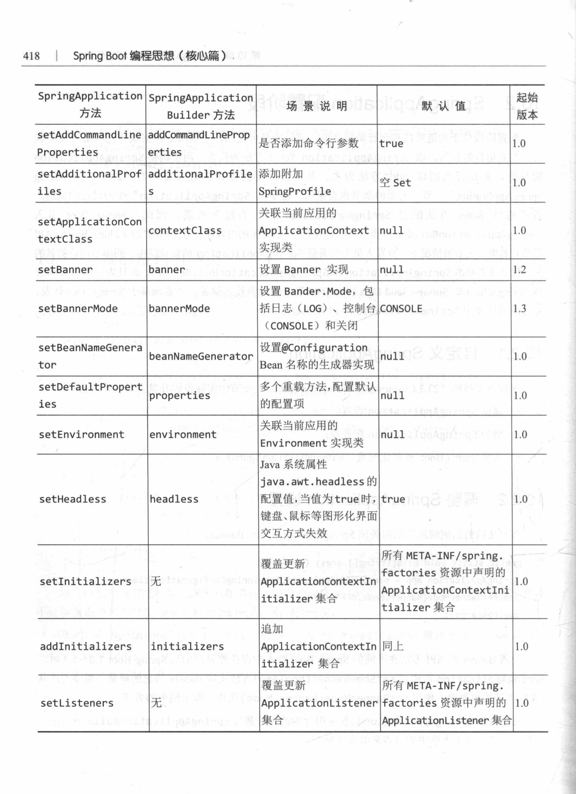

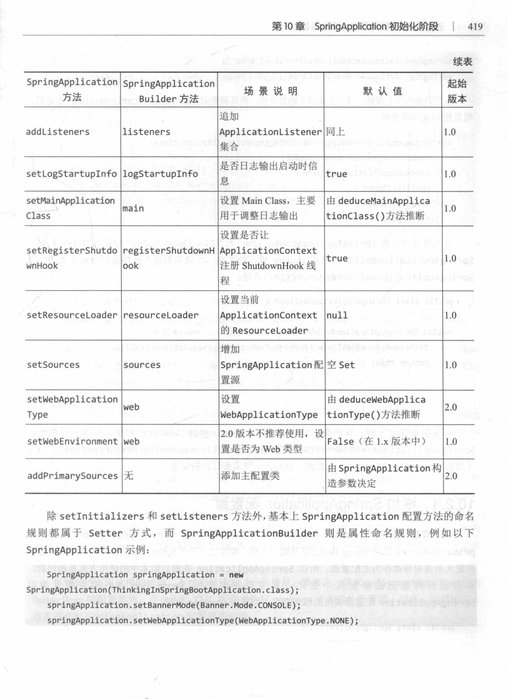


定制Spring Boot提供的配置源：主要是@Configuration class，XML配置文件和package

摘要：

```java
public void setSources(Set<String> sources) {
    Assert.notNull(sources, "Sources must not be null");
    this.sources = new LinkedHashSet<>(sources);
}
```

至于source的解析过程以后再看


调整外部化配置：实际上就是通过方法：

```java
public void setDefaultProperties(Properties defaultProperties) {
    this.defaultProperties = new HashMap<>();
    for (Object key : Collections.list(defaultProperties.propertyNames())) {
        this.defaultProperties.put((String) key, defaultProperties.get(key));
    }
}
```

来添加 application.properties之外的配置


当这些配置完成后，Spring Boot应用进入下一阶段


## 第十一章、SpringApplication运行阶段


依旧围绕着核心代码：

```java
public static ConfigurableApplicationContext run(Class<?>[] primarySources, String[] args) {
    return new SpringApplication(primarySources).run(args);
}
```

上一章已经说了SpringApplication的初始化阶段和Spring提供给我们的自定义配置阶段。

现在来看SpringApplication的运行阶段


属于Spring Boot的绝对核心，该过程是结合这SpringApplication初始化完成的状态，进一步完善运行时候需要准备的资源，随后启动Spring应用上下文，在此期间伴随着Spring Boot和Spring事件的触发，形成完整的SpringApplication生命周期。


于是又可以粗略的划分成三个阶段：

- SpringApplication准备阶段
- ApplicationContext启动阶段
- ApplicationContext启动后阶段


先展示完整的运行代码：

```java
public ConfigurableApplicationContext run(String... args) {
    StopWatch stopWatch = new StopWatch();
    stopWatch.start();
    ConfigurableApplicationContext context = null;
    Collection<SpringBootExceptionReporter> exceptionReporters = new ArrayList<>();
    configureHeadlessProperty();
    SpringApplicationRunListeners listeners = getRunListeners(args);
    listeners.starting();
    try {
        ApplicationArguments applicationArguments = new DefaultApplicationArguments(args);
        ConfigurableEnvironment environment = prepareEnvironment(listeners, applicationArguments);
        configureIgnoreBeanInfo(environment);
        Banner printedBanner = printBanner(environment);
        context = createApplicationContext();
        exceptionReporters = getSpringFactoriesInstances(SpringBootExceptionReporter.class,
                                                         new Class[] { ConfigurableApplicationContext.class }, context);
        prepareContext(context, environment, listeners, applicationArguments, printedBanner);
        refreshContext(context);
        afterRefresh(context, applicationArguments);
        stopWatch.stop();
        if (this.logStartupInfo) {
            new StartupInfoLogger(this.mainApplicationClass).logStarted(getApplicationLog(), stopWatch);
        }
        listeners.started(context);
        callRunners(context, applicationArguments);
    }
    catch (Throwable ex) {
        handleRunFailure(context, ex, exceptionReporters, listeners);
        throw new IllegalStateException(ex);
    }

    try {
        listeners.running(context);
    }
    catch (Throwable ex) {
        handleRunFailure(context, ex, exceptionReporters, null);
        throw new IllegalStateException(ex);
    }
    return context;
}
```

SpringApplication准备阶段从第一行开始，到第十八行refreshContext方法调用的前

> 看前面书上的例子都是使用context.refresh方法来启动容器的


可以先从SpringApplicationRunListeners开始，其中持有很多个SpringApplicationRunListener的引用，从而实现对一系列的SpringApplicationRunnerListener的管理，对SpringApplicationRunListeners的理解于是递归到了SpringApplicationRunListener的理解

可以简单得理解为Spring Boot的运行时监听器，内部方法说明（监听方法的返回值都是void，因为不可能靠返回参数记录信息）：

|                         监听方法摘要                         |                       方法运行阶段说明                       |
| :----------------------------------------------------------: | :----------------------------------------------------------: |
|                          starting()                          |                       Spring应用刚启动                       |
|   environmentPrepared(ConfigurableEnvironment environment)   |       Configuration Environment准备妥当，允许将其调整        |
|   contextPrepared(ConfigurableApplicationContext context)    |     ConfigurableApplicationContext准备妥当，允许将其调整     |
|    contextLoaded(ConfigurableApplicationContext context)     |      ConfigurableApplicationContext已经装载，但尚未启动      |
|       started(ConfigurableApplicationContext context)        | ConfigurableApplicationContext已经启动，此时SpringBoot已经初始化完成 |
|       running(ConfigurableApplicationContext context)        |                      Spring应用正在运行                      |
| failed(ConfigurableApplicationContext context, Throwable exception) |                      Spring应用运行失败                      |


至于注册进这些SpringApplicationRunListeners的SpringApplicationRunListener来源于哪里，则可以进入方法getRunListeners：

```java
private SpringApplicationRunListeners getRunListeners(String[] args) {
    Class<?>[] types = new Class<?>[] { SpringApplication.class, String[].class };
    return new SpringApplicationRunListeners(logger,
                                             getSpringFactoriesInstances(SpringApplicationRunListener.class, types, this, args));
}
```

方法getSpringFactoriesInstances结合SpringFactoriesLoader机制，SpringApplicationRunListener内建实现可以轻松被定为到：

```
# Run Listeners
org.springframework.boot.SpringApplicationRunListener=\
org.springframework.boot.context.event.EventPublishingRunListener
```

确实，SpringApplicationRunListener接口只有唯一实现类EventPublishingRunListener


这里的SpringApplicationRunListener是SpringBoot提供的事件监听机制，与Spring提供的ApplicationListener有所区别


Spring底层依赖的事件/监听机制在JDK1.0中就已经实现了，也可以视为是观察者模式的一种特例，观察者模式允许Observable和Observer收发消息，但是现在已经不支持使用了，允许携带对象Object，但是事件监听模式只允许携带EventObject实现类，于是ApplicationEvent可以扩展EventObject接口，同时事件的监听者也必须是EventListener实例，当然其中使用非常不方便，于是Spring提供了ApplicationListener来对特性的Event进行监听（通过泛型的方式指定），但是通过泛型监听事件就会出现一个局限——无法同时对两种事件进行监听。

于是Spring3.0提出了SmartApplicationListener接口，通过supportsEventType方法过滤出满足条件的Event了。

如：监听application.properties的事件监听器ConfigFileApplicationListener就实现了SmartApplicationListener接口。

然而目前讨论的范围仅限于ApplicationEvent和ApplicationListener。


就目前来讲使用ApplicationEventPublisher和使用SimpleApplicationEventMulticaster来发布ApplicationEvent没有发现任何的区别，且在使用后者时候IDEA还会自动报错【误报】。

但是后者有一个前者没有的特性：增删ApplicationListener

当然不怎么好用，增加进的Listener好多Event都没有扫描出来，建议还是使用@EventListener注解。

实际上ApplicationContext就实现了ApplicationEventPublisher接口。

还为编程式Spring提供了ApplicationEventPublisherAware接口用于对ApplicationEventPublisher实现在生命周期回掉时候的赋值操作。

实际上ApplicationContext内部的事件发布就是由依赖于ApplicationEventMulticaster的multicastEvent方法

实际上前面提到的ApplicationEventMulticaster的注册ApplicationListener实例的方式也被ConfigurableApplicationContext中的addApplicationListener方法复用。

这个ConfigurableApplicationContext是ApplicationContext的子类，于是我分别注入ApplicationContext和ConfigurableApplicationContext，发现他们两个是一个东西。

最后为了弄清楚程序中使用的ApplicationContext的继承关系，我获取了使用的是AnnotationConfigApplicationContext类，其类继承图如下所示：

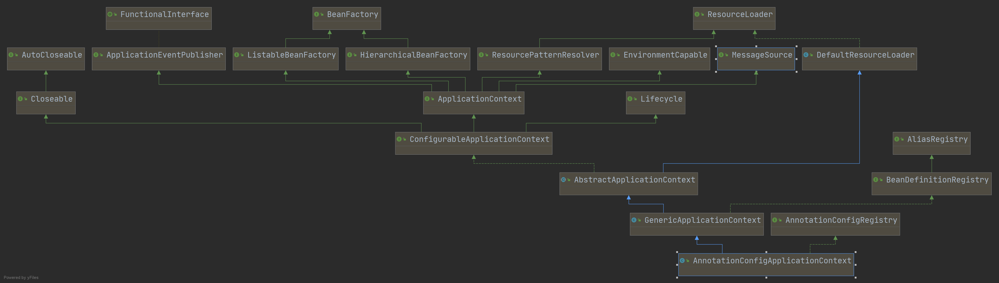


所以到此为止完全可以使用该ApplicationContext去代替SimpleApplicationEventMulticaster。


于是我们可以仅关注ApplicationListener和ApplicationEvent即可（当然要注意顺序问题，需要保证事件Listener注册操作在事件发布操作之前）。但是这样做比使用@EventListener注解监听来的事件要少一些：

这么做的监听结果：

```java
org.springframework.boot.context.event.ApplicationReadyEvent[source=org.springframework.boot.SpringApplication@7c51782d]
org.springframework.boot.availability.AvailabilityChangeEvent[source=org.springframework.context.annotation.AnnotationConfigApplicationContext@2dd80673, started on Tue Aug 18 23:34:56 CST 2020]
org.springframework.context.event.ContextClosedEvent[source=org.springframework.context.annotation.AnnotationConfigApplicationContext@2dd80673, started on Tue Aug 18 23:34:56 CST 2020]
```

@EventListener监听结果：

```
org.springframework.context.event.ContextRefreshedEvent[source=org.springframework.context.annotation.AnnotationConfigApplicationContext@fc258b1, started on Tue Aug 18 23:36:38 CST 2020]
2020-08-18 23:36:39.862  INFO 26824 --- [           main] c.l.s.SpringCloudStreamApplication       : Started SpringCloudStreamApplication in 1.34 seconds (JVM running for 2.084)
org.springframework.boot.context.event.ApplicationStartedEvent[source=org.springframework.boot.SpringApplication@15f35bc3]
org.springframework.boot.availability.AvailabilityChangeEvent[source=org.springframework.context.annotation.AnnotationConfigApplicationContext@fc258b1, started on Tue Aug 18 23:36:38 CST 2020]
org.springframework.boot.context.event.ApplicationReadyEvent[source=org.springframework.boot.SpringApplication@15f35bc3]
org.springframework.boot.availability.AvailabilityChangeEvent[source=org.springframework.context.annotation.AnnotationConfigApplicationContext@fc258b1, started on Tue Aug 18 23:36:38 CST 2020]
org.springframework.context.event.ContextClosedEvent[source=org.springframework.context.annotation.AnnotationConfigApplicationContext@fc258b1, started on Tue Aug 18 23:36:38 CST 2020]
```

第二行是输出的INFO日志信息。

建议以第二个为准，至于发布信息可以与ApplicationContext打交道

> 应该是ApplicationRunner的调用时机是需要容器完全准备好才能执行的

其实第二个输出也不全面，因为被EventListener标注的方法也不是在容器启动之初就作为Listener就注册到IoC当中的，最全面的方法应该是这样：

```java
new SpringApplicationBuilder(GitConfigurationApplication.class)
    .listeners(System.out::println)
    .run(args);
```

明确指定在run之前就加载进Listener，也就是在初始化阶段进行配置


Spring内建事件：

- ContextRefreshedEvent：Spring ApplicationContext就绪事件
- ContextStartedEvent：Spring ApplicationContext启动事件
- ContextStoppedEvent：Spring ApplicationContext停止事件
- ContextClosedEvent：Spring ApplicationContext关闭事件


最常见的就是Spring ApplicationContext就绪事件

下面开始逐一分析：


ContextRefreshedEvent：

具体的发布时间需要追溯到AnnotationConfigApplicationContext的refresh方法，而此方法是由其父类AbstractApplicationContext默认实现的：

```java
@Override
public void refresh() throws BeansException, IllegalStateException {
    synchronized (this.startupShutdownMonitor) {
        // Prepare this context for refreshing.
        prepareRefresh();

        // Tell the subclass to refresh the internal bean factory.
        ConfigurableListableBeanFactory beanFactory = obtainFreshBeanFactory();

        // Prepare the bean factory for use in this context.
        prepareBeanFactory(beanFactory);

        try {
            // Allows post-processing of the bean factory in context subclasses.
            postProcessBeanFactory(beanFactory);

            // Invoke factory processors registered as beans in the context.
            invokeBeanFactoryPostProcessors(beanFactory);

            // Register bean processors that intercept bean creation.
            registerBeanPostProcessors(beanFactory);

            // Initialize message source for this context.
            initMessageSource();

            // Initialize event multicaster for this context.
            initApplicationEventMulticaster();

            // Initialize other special beans in specific context subclasses.
            onRefresh();

            // Check for listener beans and register them.
            registerListeners();

            // Instantiate all remaining (non-lazy-init) singletons.
            finishBeanFactoryInitialization(beanFactory);

            // Last step: publish corresponding event.
            finishRefresh();
        }

        catch (BeansException ex) {
            if (logger.isWarnEnabled()) {
                logger.warn("Exception encountered during context initialization - " +
                            "cancelling refresh attempt: " + ex);
            }

            // Destroy already created singletons to avoid dangling resources.
            destroyBeans();

            // Reset 'active' flag.
            cancelRefresh(ex);

            // Propagate exception to caller.
            throw ex;
        }

        finally {
            // Reset common introspection caches in Spring's core, since we
            // might not ever need metadata for singleton beans anymore...
            resetCommonCaches();
        }
    }
}
```

随着容器的启动，到达第39行的时候，会在里面调用publishEvent方法来发布一个ContextRefreshedEvent事件，并把自身作为 Source传入进去。

```java
protected void finishRefresh() {
    // Clear context-level resource caches (such as ASM metadata from scanning).
    clearResourceCaches();

    // Initialize lifecycle processor for this context.
    initLifecycleProcessor();

    // Propagate refresh to lifecycle processor first.
    getLifecycleProcessor().onRefresh();

    // Publish the final event.
    publishEvent(new ContextRefreshedEvent(this));

    // Participate in LiveBeansView MBean, if active.
    LiveBeansView.registerApplicationContext(this);
}
```

到此时Spring ApplicationContext中的Bean已经完成了初始化，并能够投入使用。


ContextStartedEvent和ContextStopedEvent：Spring应用上下文的启动停止事件

非常罕见，只会在AbstractApplicationContext中的start方法和stop方法中发布

> 出现了问题，在Spring-framework-5.2.8中我在start方法第一行打上了端点，然而程序并没有执行到那儿去，反倒是输出了对应的ContextStartedEvent，先按照书上的来。（后面给了解释）


假设当start方法被调用后，其关联的LifeCycleProcessor实例将触发所有LifeCycle Bean的start方法调用，stop方法同理。这两个方法不仅仅是简单的发布Event那么简单，这里面涉及到LifeCycle Bean方法的回调。

书上继续说道：AbstractApplicationContext尽管是LifeCycle实现类，但其并不是LifeCycle Bean，因此他的start和stop方法不会被调用。

并且ContextStartedEvent和ContextStoppedEvent的传播必然在ContextRefreshedEvent之后


最后一个事件：ContextClosedEvent

与refresh正好相反，他对应的是AbstractApplicationContext的close方法，内部调用了被protected修饰的doClose方法：

```java
protected void doClose() {
    // Check whether an actual close attempt is necessary...
    if (this.active.get() && this.closed.compareAndSet(false, true)) {
        if (logger.isDebugEnabled()) {
            logger.debug("Closing " + this);
        }

        LiveBeansView.unregisterApplicationContext(this);

        try {
            // Publish shutdown event.
            publishEvent(new ContextClosedEvent(this));
        }
        catch (Throwable ex) {
            logger.warn("Exception thrown from ApplicationListener handling ContextClosedEvent", ex);
        }

        // Stop all Lifecycle beans, to avoid delays during individual destruction.
        if (this.lifecycleProcessor != null) {
            try {
                this.lifecycleProcessor.onClose();
            }
            catch (Throwable ex) {
                logger.warn("Exception thrown from LifecycleProcessor on context close", ex);
            }
        }

        // Destroy all cached singletons in the context's BeanFactory.
        destroyBeans();

        // Close the state of this context itself.
        closeBeanFactory();

        // Let subclasses do some final clean-up if they wish...
        onClose();

        // Reset local application listeners to pre-refresh state.
        if (this.earlyApplicationListeners != null) {
            this.applicationListeners.clear();
            this.applicationListeners.addAll(this.earlyApplicationListeners);
        }

        // Switch to inactive.
        this.active.set(false);
    }
}
```

可以明显的看到事件的发布是在destroyBeans之前的，destroyBeans会回掉LifeCycle的onClose方法，并销毁当前Spring ApplicationContext。


这四个Spring提供的内购事件都是ApplicationContextEvent的子类，更是ApplicationEvent的子类ApplicationEvent


构建自己的事件非常简单，实现ApplicationEvent接口，将该类交给ApplicationEventPublisher即可，其实AbstractApplicationContext就是ApplicationEventPublisher的直接子类，于是可以直接和ApplicationContext打交道了


接下来讲述了Spring Framework在4.2引入的@EventListener注解实现对Event的监听功能。


@EventListener官方没有非常详细的在文档给出说明，以下直接给结论：@EventListener方法必须是Spring Boot中的public方法，并支持返回类型为非void的情况（价值几乎为零），当他监听一个或者多个ApplicationEvent的时候，其参数可以为零个或者是一个ApplicationEvent。


@EventListener方法异步化的支持：只需要在当前注解上再加入一个@Async注解即可。

> 记得要开启Async

验证方法非常简单：

```java
public void listener(ApplicationEvent event) {
    System.out.println(Thread.currentThread().getName());
}
```


基于注解监听和基于编程监听的对比：

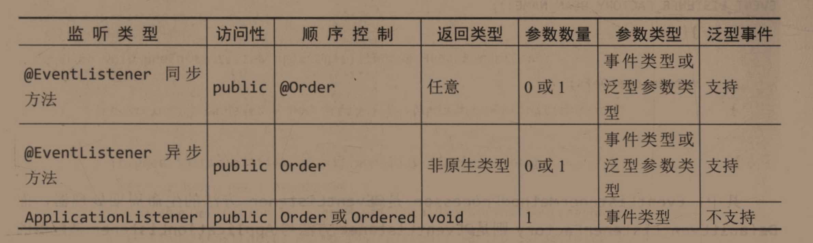


接下来讲述@EventListener方法的实现原理。

在AnnotationConfigUtils#registerAnnotationConfigProcessors(BeanDefinitionRegistry,Object)方法中存在着@EventListener方法处理的相关Bean注册


完整的EventListener的装载过程：

1、使用AnnotatedElementUtils.findMergedAnnotation(method,EventListener,class)方法筛选出所有被@EventListener标注的方法，当然@Async标注是被AOP增强的，于是可以进行异步增强

2、随后EventListenerMethodProcessor完成对所有扫描出来的@EventListener的装配，是将@EventListener转换成为ApplicationListener然后完成注册


Spring部分事件发布完结

<hr>


Spring Boot事件部分。


在1.4版本Spring Boot事件处理机制发生了改变

在这之前是依赖的Spring Framework的事件处理机制


浏览一遍吧，现在还没有达到熟练使用Spring Boot的地步，就开始要分析Spring Boot事件原理了


讲着讲着又讲到了Spring中去了，有点晕，到底有多少个阶段呢？有点没有理清楚


执行CommandLineRunner和ApplicationRunner

在4.1.10中有详细的介绍

他们两的run方法会在SpringApplication.run方法完成之前执行

当出现多个ApplicationRunner或者CommandLineRunner时候，需要手动通过@Order注解来控制他们的执行顺序，默认应该是最后执行的（仅仅是猜测，取值为Integer.MAX_VALUE）

就形式上来看，两者除了核心方法的传入参数不同其他都基本相同，那有什么引进的必要呢？

其实也就是时代产物吧，CommandLineRunner在Spring Boot1.0的时候就引入了，然而在SpringBoot2.0ApplicationRunner才引入，为了尽可能向前兼容就没有移除CommandLineRunner


## 第十二章、Spring Application结束阶段


SpringApplication的结束阶段在SpringBoot1.0和2.0的版本的实现逻辑是相对稳定的


再次回到SpringApplication中的run方法：

```java
public ConfigurableApplicationContext run(String... args) {
    StopWatch stopWatch = new StopWatch();
    stopWatch.start();
    ConfigurableApplicationContext context = null;
    Collection<SpringBootExceptionReporter> exceptionReporters = new ArrayList<>();
    configureHeadlessProperty();
    SpringApplicationRunListeners listeners = getRunListeners(args);
    listeners.starting();
    try {
        ApplicationArguments applicationArguments = new DefaultApplicationArguments(args);
        ConfigurableEnvironment environment = prepareEnvironment(listeners, applicationArguments);
        configureIgnoreBeanInfo(environment);
        Banner printedBanner = printBanner(environment);
        context = createApplicationContext();
        exceptionReporters = getSpringFactoriesInstances(SpringBootExceptionReporter.class,
                                                         new Class[] { ConfigurableApplicationContext.class }, context);
        prepareContext(context, environment, listeners, applicationArguments, printedBanner);
        refreshContext(context);
        afterRefresh(context, applicationArguments);
        stopWatch.stop();
        if (this.logStartupInfo) {
            new StartupInfoLogger(this.mainApplicationClass).logStarted(getApplicationLog(), stopWatch);
        }
        listeners.started(context);
        callRunners(context, applicationArguments);
    }
    catch (Throwable ex) {
        handleRunFailure(context, ex, exceptionReporters, listeners);
        throw new IllegalStateException(ex);
    }

    try {
        listeners.running(context);
    }
    catch (Throwable ex) {
        handleRunFailure(context, ex, exceptionReporters, null);
        throw new IllegalStateException(ex);
    }
    return context;
}
```

在第33行进入结束阶段，如在执行running方法的时候抛出异常便会异常结束


至于异常分析，主要是依靠FailureAnalyzer和FailureAnalysisReporter


当SpringApplication执行完成后便进入了退出阶段，该阶段还是依赖于JVM提供的特性


## 第十四章、SpringBoot应用退出


对应文档章节：4.1.11. Application Exit


主要是通过JVM的shutdown hook去关闭ApplicationContext，并且保证Bean生命周期正确执行销毁操作，如标注的@PreDestroy或者是实现了DisposableBean接口的Bean


主要是借助着AbstractApplicationContext的registerShutdownHook方法来完成的


可以定制退出码，如以下程序所示：

```java
public static void main(String[] args) {
    int exitCode = SpringApplication.exit(new SpringApplicationBuilder(GitConfigurationApplication.class)
                                          .run(args));
    System.exit(exitCode);
}

@Bean
public ExitCodeGenerator exitCodeGenerator() {
    return () -> {
        logger.info("返回码88生成 ");
        return 88;
    };
}
```

但是在实践中几乎用不到，因为不会手动调用Context的exit方法，从而得到返回码


本小节可以作为ApplicationContext的一个LifeCycle来看待


本部分（第三部分）是围绕着SpringApplication来展开论述的，主要分为：“初始化”，“运行”和“结束”三个阶段，主要包括的核心特性为SpringApplicationRunnerListener，Spring Boot事件和Spring应用上下文的生命周期管理等


还有一个疑问：为什么要提出SpringApplication，直接使AnnotationConfigApplicationContext启动ApplicationContext不好吗？

小马哥给出的解释是对Spring Framework的应用上下文的补充。


传统的Spring应用上下文起源于ConfigurableApplicationContext对象的创建，运行则由refresh方法，终止于close方法，在refresh方法调用过程中伴随着BeanFactory，Environment，ApplicationEventMulticaster（事件广播使用底层）和ApplicationListener的创建，不过在SpringBoot中SpringApplication让其在refresh方法执行之前就执行了


完结~