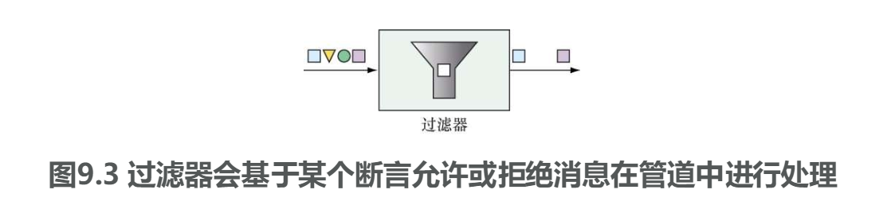
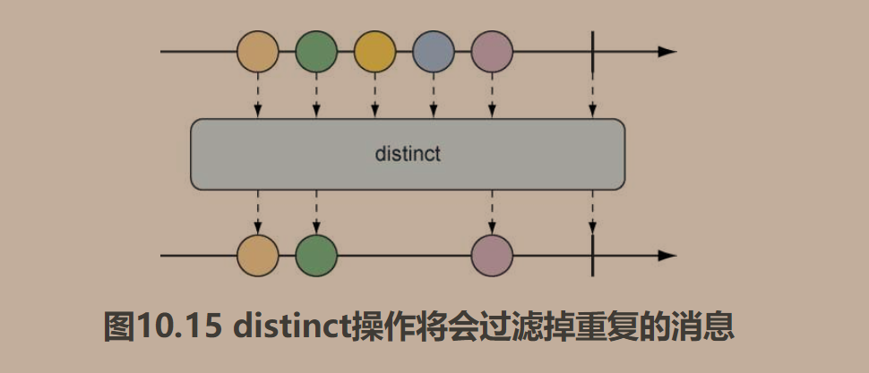

# 第一部分、Spring基础


## 第一章、Spring起步


Spring的发展历程：

最常见的应用形式是基于浏览器的Web应用，后端由关系型数据库作为支撑。尽管这种形式的开发依然有它的价值，Spring也为这种应用提供了良好的支持，但是我们现在感兴趣的还包括如何开发面向云的由微服务组成的应用，这些应用会将数据保存到各种类型的数据库中。另外一个崭新的关注点是反应式编程，它致力于通过非阻塞操作提供更好的扩展性并提升性能。


Spring的核心是一个容器，也被称为应用上下文（Application Context），它们会创建和管理应用组件。这些组件也可以称为bean，会在Spring应用上下文中装配在一起，从而形成一个完整的应用程序。


配置类中：默认情况下，这些bean所对应的bean ID与定义它们的方法名称是相同的


创建第一个项目：

启动类：

```
@SpringBootApplication包含：
    @Target({ElementType.TYPE})
    @Retention(RetentionPolicy.RUNTIME)
    @Documented
    @Inherited
    @SpringBootConfiguration
    @EnableAutoConfiguration
    @ComponentScan(
        excludeFilters = {@Filter(
        type = FilterType.CUSTOM,
        classes = {TypeExcludeFilter.class}
    ), @Filter(
        type = FilterType.CUSTOM,
        classes = {AutoConfigurationExcludeFilter.class}
    )}
    )
```

> 实际上有用的：
>
> - SpringBootConfiguration：@Configuration注解的特殊形式
> - EnableAutoConfiguration：启动SpringBoot的自动装配
> - ComponentScan：启用组件扫描。扫描@Component、@Service这种注解声明的其他类，并将他们注册到Spring应用上下文中


```
SpringApplication.run(TacoCloudApplication.class, args);
```

创建Spring应用上下文，一个是配置类，一个是启动参数（尽管传递的配置类不一定要和引导类相同，但这是最便利和最经典的做法，尽管也可以在引导类中配置一两个组件，但是还是建议单独创建一个配置类）


测试类：

主要就是@SpringBootTest注解了，提供SpringBoot的测试环境，相当于调用了引导类的SpringApplication.run（）方法

也可以在测试类上面加上@Runwith注解（Junit提供的）以前的测试类头上会带上这个注解@Runwith(SpringRunner.class)，现在好像都没有这个注解了（SpringBoot 2.3.0）

可以跑空的测试类来判断是否能启动应用上下文


编写一个控制类：

```java
@Controller
public class HomeController {
    @GetMapping("/")
    public String home() {
        return "home";
    }
}
```

@Controller注解：并没有做太多事情，仅仅只是让当前类被扫描，装载到容器中

@GetMapping注解：针对"/"发送的HTTP GET请求，那么这个方法将会处理请求

返回值会交给thymeleaf去进行视图解析，加上前缀“/templates/”和后缀".html"。拼接成"/templates/home.html"


编写一个视图页面：

```html
<!DOCTYPE html>
<html lang="en" xmlns:th="https://www.thymeleaf.org/">
<head>
    <meta charset="UTF-8">
    <title>Taco Cloud</title>
</head>
<body>
    <h1>Welcome to</h1>
    
</body>
</html>
```

要手动引入th标签，要不然报错

唯一需要注意的是`th:src="@{/images/Logo.png}"`，这里的意思是读取"/static/images/Logo.png"这张图片


测试器：对HTML页面的内容断言是很困难的，SpringMVC提供了强大的测试。感觉蛮不好用的，浏览器测试更好


Spring Boot DevTools

作用：

- 代码变更后自动重启（依赖更新后无效，需要重启，配置文件修改了之后有效）
- 面向浏览器的资源（HTML，JS）发生变化时候自动刷新浏览器（需要安装LiveReload插件）
- 自动禁用模板缓存
- 如果使用H2数据库，内置了H2的控制台

```xml
<dependency>
    <groupId>org.springframework.boot</groupId>
    <artifactId>spring-boot-devtools</artifactId>
    <scope>runtime</scope>
    <optional>true</optional>
</dependency>
```

默认指定打包之后就没用了（只在生产环境有效）

实现了两个类加载器，一个加载Java代码，属性和项目中基本所有的内容，另一个去加载依赖的库，每次发生改变的时候，只需要重启一个类加载器即可，另一个相对稳定的类加载器（加载依赖的那一个）就不会动了。

如果使用了H2数据库，会生成一个URL为http://localhost:8080/h2-console的控制台


## 第二章、开发Web应用


>  主要是MVC层的数据绑定
>
> 章节概括：
>
> - 在浏览器中展现模型数据
> - 处理和校验表单输入
> - 选择视图模板库


REST API：是指控制器直接返回Model对象，不进行页面渲染。


Demo：

实体类

```java
@RequiredArgsConstructor
@Data
public class Ingredient {
    private final Integer id;
    private final String name;
    private final Type type;
    public static enum Type{
        /**
         * 字段注释
         */
        WRAP,PROTEIN,VEGGIES,CHEESE,SAUCE
    }

}
```


Controller层：

```java
@Slf4j
@Controller
@RequestMapping("/design")
public class DesignTacoController {
    /**
     * 默认就是@GetMapping("")
     */
    @GetMapping
    public String showDesignForm(Model model) {
        List<Ingredient> list = Arrays.asList(
                new Ingredient(1, "Lettuce", Ingredient.Type.PROTEIN),
                new Ingredient(2, "Lettuces", Ingredient.Type.SAUCE),
                new Ingredient(3, "Lettuces", Ingredient.Type.CHEESE),
                new Ingredient(4, "Lettuces", Ingredient.Type.WRAP)
        );
        Ingredient.Type[] types = Ingredient.Type.values();
        for (Ingredient.Type type : types) {
            model.addAttribute(type.toString().toLowerCase(),filterByType(list,type));
        }
        return "design";

    }

    private List<Ingredient> filterByType(List<Ingredient> ingredients, Ingredient.Type type) {
        return ingredients.stream().filter(x->x.getType().equals(type)).collect(Collectors.toList());
    }

}
```

> 作者的编码太厉害了


Thymeleaf这种视图解析器很明显是和特定的Web框架解耦的，那么是如何获取数据的呢？显然无法直接访问到Model对象，是在到达控制器的时候就将数据从Model复制到了request里面，就可以访问到了。


在HTML中使用th：each标签去遍历结果集即可。一般都是`${}`访问request，如果取到的是一个对象，则直接使用对象的toString方法变成字符串展示在页面上。


数据校验

Spring支持Java的Bean校验API（Bean Validation API，JSR-303）

具体支持注解看[常见错误&基础结论](../常见错误&基础结论.md)


如果要写视图控制器，去继承WebMvcConfigurer，重写addViewControllers方法。也就是取代那些需要直接返回view的controller，感觉没啥用。


本章学习了强大的Web框架——Spring MVC

基于注解的，支持校验，支持视图解析


## 第三章、使用数据

使用Spring对JDBC的支持（Java DataBase Connectivity）消除样式代码（什么Class.forName（）这种代码），最后使用JPA（Java Presistence API）重写数据，消除更多冗杂代码


JDBCTemplate仅仅只是省去了大量的模板创建，依然需要自定义SQL，但是可以帮你把返回值按照字段名称自动注入到对象中去，占位符依旧使用？，跟原来的JDBC一模一样。


在插入的时候可以使用Spring提供的封装性较高的SimpleJdbcInsert


Spring Data有很多子项目支持不同的数据库：

- Spring Data JPA：基于关系型数据库进行JPA持久化（直接屏蔽掉了底层关系型数据库的类型，让开发人员不用和数据库打交道了）
- Spring Data MongoDB
- Spring Data Neo4j
- Spring Data Redis...


JPA底层的默认实现就是Hibernate，可以改变（在jpa里面排除hibernate）引入你需要的即可。


创建的Repository中的方法会根据方法名来自动实现（如果条件复杂可以使用@Query注解，然后自定义方法名）


Demo：


application.yml

```java
spring:
  datasource:
    url: jdbc:mysql://localhost:3306/test?serverTimezone=UTC
    driver-class-name: com.mysql.cj.jdbc.Driver
    username: root
    password: 123456
  jpa:
    hibernate:
      ddl-auto: update
    open-in-view: false
```

这里需要设置ddl，默认不会创建表的，会报错


实体类：

```java
@Entity
@Data
public class TechStack {
    @Id
    @GeneratedValue(strategy = GenerationType.AUTO)
    private Integer id;

    private String techName;
}
```


repo：

```java
public interface TechStackRepo extends CrudRepository<TechStack,Integer> {

    List<TechStack> findByTechNameLike(String name);
}
```


这里的方法都会根据方法名自动实现


## 第四章、保护Spring


启动Spring Security来保护Spring

引入这个配置之后，会自动进行安全的基本配置

访问网站需要输入用户名和密码：用户名默认为user，密码为控制台输出的一个字符串，也是通过浏览器的JSESSIONID来匹配到服务器中的Session域的，如果清除了Cookie就需要重新登录。

默认安全信息：

- 所有HTTP请求都需要认证
- 不需要特定的角色和权限
- 没有登录页面（默认页面是HTTP basic认证的框）
- 默认只有一个用户user


增加用户：

1.用户数据量不大，修改次数少。直接存内存：

```java
@Configuration
@EnableWebSecurity
public class SecurityConfig extends WebSecurityConfigurerAdapter {
    @Override
    protected void configure(AuthenticationManagerBuilder auth) throws Exception {
        //需要加密方式
        auth.inMemoryAuthentication().passwordEncoder(new BCryptPasswordEncoder())
                .withUser("buzz").password(new BCryptPasswordEncoder().encode("222")).roles("USER");
    }

}
```

要指定密码加密方式


具体的加密方式：

•BCryptPasswordEncoder：使用bcrypt强哈希加密。

•NoOpPasswordEncoder：不进行任何转码。

•Pbkdf2PasswordEncoder：使用PBKDF2加密。

•SCryptPasswordEncoder：使用scrypt哈希加密。

•StandardPasswordEncoder：使用SHA-256哈希加密。


2.存储到数据库中，是使用JDBC来存储的，可以百度下


都是指定好的，用起来极其不方便


自定义用户认证：

依靠Spring Data JPA

对比了下Mybatis+Shiro，突然知道为什么大多数国内的厂商都倾向于Shiro了，Spring Security提供了太多的功能了（然而这些功能大多数情况下都用不上）。


## 第五章、使用配置属性


细粒度的自动配置

配置类中的@Bean方法，将返回值注入，很容易测试：

```java
@Bean
public String hello(){
    String a = "hello world";
    System.out.println(a);
    return a;
}
```

在配置类中加入这一行即可，会明显的看到hello world的输出


Spring完成的自动属性注入

例如Server.port=8080可以在任何一个阶段设置（JVM参数，命令行参数，操作系统环境变量（命名格式需要改变，Spring会自动适配））


接下来讲述了一些常规的可配置项，

数据库配置：例如spring.datasource

嵌入式服务器配置：例如：Server.port=0（随便选择一个可用端口）在不关心应用在哪个端口启动的情况非常重要，如成为一个服务注册到注册中心去

指定配置文件（在主配置文件里面指定）:

```yaml
spring:
  profiles:
    active: dev
```

配置文件命名：application-{profiles}.yaml

这是设置的最糟糕的一种方式，会直接使用指定的配置文件（无论是在开发环境还是在生产环境都是一样）。无法享受到生产环境和开发环境不同所带来的便利

可以在IDE中手动指定：


或者使用命令行的方式：


日志的级别设置：

```log
logging:
  level:
    root: debug
  file:
#    好像路径没用，都直接输出到项目的根目录下面了
    path: D://
    name: Test.log
```

必须使用到root上面去，要不然报错


配置类的写法：

```java
@Configuration
@ConfigurationProperties("greeting")
@Setter
public class HelloConfig {
    private String hello;

    @Bean
    public String bean() {
        System.out.println(hello);
        return hello;
    }
}

```

一定要setter注解，要不然属性注入不进去


只要是被扫描到的，无论是使用Copeonent系列的还是Configuration，里面被标注了bean方法都会被加载，返回值进入到IOC容器中。因为COnfiguration也就相当于是Component的变种（标注在配置类上面）


可以根据当前profiles的不同来选择配置（如果指定的是dev，但dev配置没有这个属性，就会再回去读取默认的配置）和指定是否创建bean

```java
@Configuration
@ConfigurationProperties("greeting")
@Data
@Profile("!dev")
public class HelloConfig {
    private String hello;
    
    @Bean
    @Profile("!dev")
    public String hello() {
        System.out.println(hello);
        return hello;
    }
}
```

如果是以下配置`@Profile({"!dev","!dev2"})`，是表示只要满足其中一个条件即可


# 第二部分、Spring集成


Spring应用与其他应用集成的话题


## 第六章、创建REST服务


REST API就是如今常说的前后端分离的后端API，只进行数据传输，而不去管页面的事情。


PUT和Patch的区别（语义层面）：

- PUT应该是对资源的整体覆盖，哪怕是有空字段，也是采取直接覆盖的态度
- Patch是完成资源的局部更新，更新非null字段


@RestController：

- 能够使得组件被扫描发现
- 控制器中处理方法的返回值要被直接写入响应体（Response Body）中，而不是将值放入模型（Request）中传递给视图进行渲染


@RequestMapping有个produces属性，指定产生的消息头，可以使用consumes指定接收的消息头


待验证：Spring提供`@CrossOrigin`注解来突破域限制，加在需要被消费的类上即可


直接弹出这个错误消息的方法：


```java
@ResponseBody
@GetMapping("/{id}")
public ResponseEntity<String> findById(@PathVariable("id") Integer id) {
    if (id == 2) {
        //是直接跳ERROR界面了，不是返回的数据
        return new ResponseEntity<>(HttpStatus.NOT_FOUND);
    }
    return new ResponseEntity<>("hello",HttpStatus.ACCEPTED);

}
```

使用ResponseEntity这个实体类即可。

不过不推荐在REST客户端上这样做，建议统一消息回复即可。


指定消息返回的Code（默认是200 OK）：

使用@RequestStatus注解

```java
@GetMapping("/")
@ResponseStatus(HttpStatus.ACCEPTED)
public String hello() {
    return "hello world";
}
```


映射到业务层的String对象一般不会为null（无论是从数据库来的还是从前端来的），一般都是empty。


后面就是：在请求体中动态的插入超链接，如查询所有商品的时候顺便在每个商品后面带上修改商品的URL。Spring提供了这个功能，感觉对于现在实际意义不大。


小结：

主要就是RestController，ResponseBody，RequestBody的使用。


## 第七章、消费REST服务


前面学会了创建REST API提供给客户端去调用，但Spring对另外一个API发起请求并不罕见，特别是在微服务领域的热度的增加。

主要方式：

- RestTemplate：Spring提供的简单的、同步的REST客户端
- Traversion：对上一章结尾讲述的动态生成的超链接的调用，依旧感觉意义不大
- WebClient：Spring 5提供的反应式、异步REST客户端（先推迟下，因为反应式的Web框架都没讲）


主要就关注RestTemplate即可

RestTemplate可以直接new就行了，但麻烦且资源利用率低，建议写个bean方法直接创建一个RestTemplate注入到容器中

发送一个HTTP请求会有太多的样板代码，于是Spring简化了这些代码，就像JDBCTemplate一样


表7.1中的大多数操作都以3种方法的形式进行了重载。

•使用String作为URL格式，并使用可变参数列表指明URL参数。

•使用String作为URL格式，并使用Map<String,String>指明URL参数。

•使用java.net.URI作为URL格式，不支持参数化URL。


1.Get请求：

主要有两个方法可以调用：

- getForObject
- getForEntity

两者区别：getForEntity会包含响应头，响应体的全部信息，即整个RequestEntity对象

而getForObject只会包含响应体里面的信息，在你比较关注响应体的信息的时候建议使用这个


测试如下：

> 测试环境是因为：在启动项目时候指定使用dev环境，在运行时候无法指定参数，默认使用8080端口，不会产生端口冲突，完美解决。

被调用代码：

```java
@RestController
@RequestMapping("/test")
public class TestController {
    @GetMapping("/get")
    @ResponseStatus(HttpStatus.ACCEPTED)
    public String hello() {
        return "hello world";
    }
}
```


调用代码：

```java
@Test
void contextLoads() {
    String s = restTemplate.getForObject("http://localhost:8090/test/get", String.class);
    System.out.println(s);
}
```

调用成功


2.post请求：

有三个：

postForObejct

postForEntity

postForLocation

关系：postForEntity =|= postForObejct（响应数据）+postForLocation（响应地址）+xx


被调用代码：

```java
@RestController
@RequestMapping("/test")
public class TestController {    
	@PostMapping("/post")
    public String hello2(@RequestBody Data hello) {
        System.out.println(hello);
        return hello.getName();
    }
```


调用代码：

```java
@Test
void test() {
    TestController.Data data = new TestController.Data();
    data.setId(1);
    data.setName("hello fuben");
    String s = restTemplate.postForObject("http://localhost:8090/test/post", data, String.class);
    System.out.println(s);
}
```

> 一定要将POST的参数加上RequestBody注解才能有效，如果不加的话就是null了，好像使用了POST就必然会使用RequestBody域了。


其他就非常类似了。


小结：

客户端使用RestTemplate针对REST API发送HTTP请求


## 第八章、发送异步消息


前面提到的REST等类似的同步通信并不是唯一的方式。异步消息就是另一种方式。

主要的三种方式：

- JMS（Java Message Service）
- RabbitMQ
- kafka

就相当于是增加了中间件嘛


JMS：

JMS是一个Java的标准，消息代理的通用API，类似于JDBC为数据库提供了通用的接口一样

Spring再次帮我们做了封装——JMSTemplate

默认实现：Apache ActiveMQ，但由于ActiveMQ快被淘汰了，Apache推出了ActiveMQ Artemis方案来作为下一代的ActiveMQ。（好像社区是真的不活跃，Docker Hub都没有对应的镜像，而RabbitMQ的镜像更新时间为37min前）

就了解下，通读下书

主要是对JMSTemplate的使用

在听雷丰阳老师讲SpringBoot的时候就说到了JMS是要不如AMQP的，因为平台相关性太强


使用RabbitMQ和AMQP

RabbitMQ可以说是AMQP最杰出的实现了


RabbitMQ的原理：

直接看我的这篇博客就好了：

https://blog.csdn.net/LuckyCurve/article/details/104534265

实践：引入amqp依赖


一个最简洁的Demo：

可以登录15672管理界面来查看Exchange，Binding，Queue是否创建成功以及消息发送情况

```java
@SpringBootTest
public class RabbitMQTest {
    @Autowired
    AmqpAdmin amqpAdmin;

    @Autowired
    RabbitTemplate rabbitTemplate;

    @Test
    void test() {
        //创建Exchange
        DirectExchange exchange = new DirectExchange("admin.exchange");
        amqpAdmin.declareExchange(exchange);
        //创建Queue
        Queue queue = new Queue("admin.queue");
        amqpAdmin.declareQueue(queue);
        //创建Binding
        Binding binding = new Binding("admin.queue", Binding.DestinationType.QUEUE,"admin.exchange","amqp.haha",null);
        amqpAdmin.declareBinding(binding);
    }

    @Test
    void test2() {
        String info = "hello";
        rabbitTemplate.convertAndSend("admin.exchange","amqp.haha",info);
    }

    @Test
    void test3() {
        String info = (String) rabbitTemplate.receiveAndConvert("admin.queue");
        System.out.println(info);
    }

}
```

上面是手动接收，下面是监听功能，要使用`@EnableRabbit`注解：

```java
@Component
public class MessageHandler {
    @RabbitListener(queues = "admin.queue")
    public void handler(Message message) {
        byte[] body = message.getBody();
        System.out.println(new String(body));
    }
}
```


kafka：

仅仅只支持主题形式的发送订阅模型，看似比RabbitMQ的功能要少，但是由于其天生涉及出来就支持集群部署，每个节点都负责一个主题（存在多个节点负责一个主题的情况）。每个节点可划分为多个分区。【即单个节点被划分成多个分区，这些分区又被分配到各个代理去处理各个主题的事务】


由于完整的kafka集群需要搭建Zookeeper，且KafkaTemplate的操作与大多数Template大同小异，就不做过多的赘述了。


小结：

异步消息需要中间件的支持，能解耦和增大应用的扩展性


## 第九章、Spring集成


使用Spring Integration创建集成流。应用程序可能需要读取或发送Email、与外部API交互或者对写入数据库的数据做出反应。


使用Spring Integration，要明确需要接收和发送哪些数据到应用程序之外的资源。


一种常见的资源就是文件系统：

通用集成的依赖

```xml
<dependency>
    <groupId>org.springframework.boot</groupId>
    <artifactId>spring-boot-starter-integration</artifactId>
    </dependency>
```

集成文件资源的一个插件：

```xml
<dependency>
    <groupId>org.springframework.integration</groupId>
    <artifactId>spring-integration-file</artifactId>
</dependency>
```

有能力与文件系统进行交互（读取和写入）


1.声明一个网关：

```java
/**
 * @author LuckyCurve
 * @date 2020/5/23 10:51
 * 为了能够接收到数据并写入集成流中
 */
//声明消息网关，告诉Spring Integration在运行时候自动生成接口的实现
//指定发送到textInChannel的消息通道中
@MessagingGateway(defaultRequestChannel = "textInChannel")
public interface FileWriterGateway {
    /**
     * @param fileName 用Header注解修饰，表示传递给当前对象的值在消息头中
     * @param data
     */
    void writeToFile(@Header(FileHeaders.FILENAME) String fileName, String data);
}
```


2.集成流

声明集成流有三种方式：

- XML
- Java配置
- DSL的Java配置


因为Integration有很长时间的使用XML的历史。

Spring引入一个XML文件的最简单的方式：在某个注解类的头上加上`@ImportResources("classpath:/filewriter-config.xml")`


使用Java配置

```java
/**
 * @author LuckyCurve
 * @date 2020/5/23 11:12
 * 定义一个集成流
 */
@Configuration
public class FileWriterIntegrationConfig {

    //声明一个转换器，用来转换输入的消息
    @Bean
    @Transformer(inputChannel = "textInChannel",outputChannel = "fileWriterChannel")
    public GenericTransformer<String,String> transformer(){
        return String::toUpperCase;
    }

    //声明一个文件写入的消息处理器
    @Bean
    @ServiceActivator(inputChannel = "fileWriterChannel")
    public FileWritingMessageHandler filewriter() {
        FileWritingMessageHandler handler = new FileWritingMessageHandler(new File("D:/files"));
        //不要期望有答复通道
        handler.setExpectReply(false);
        handler.setFileExistsMode(FileExistsMode.APPEND);
        handler.setAppendNewLine(true);
        return handler;

    }
}
```

没有必要显式的声明通道，如果不存在会自动创建，当然也可以显式声明，使用如下格式

```java
@Bean
public MessageChannel channel() {
    return new DirectChannel();
}
```


3.使用Spring Integration的DSL配置（逐渐喜欢上了这种方式）

仍然还是要网关信息的，网关相当于是入口函数

不用单独创建多个Bean，而是使用一个bean来创建整个流

使用Spring Integration的DSL：

```java
/**
 * @author LuckyCurve
 * @date 2020/5/23 11:12
 * 定义一个集成流
 */
@Configuration
public class FileWriterIntegrationConfig {

    @Bean
    public IntegrationFlow flow() {
        return IntegrationFlows.from(MessageChannels.direct("textInChannel"))
                .<String, String>transform(new GenericTransformer<String, String>() {
                    @Override
                    public String transform(String s) {
                        return s.toUpperCase();
                    }
                }).handle(Files.outboundAdapter(
                        new File("D:/files")).fileExistsMode(FileExistsMode.APPEND).appendNewLine(true)
                ).get();
    }
}
```

这里的File指的是文件夹。

甚至不需要显示的声明channel。


> 目前还不知道咋用，哈哈。项目运行起来的时候会创建指定的D：/files文件夹
>
> 目前猜测的工作逻辑：通过网关传入数据，流入一个名为textInChannel的channel中，再由一个转换器从textInChannel取出数据，将其中的数据大写，再经过一个文件消息写入处理器（如果用传统的Java配置类，还在这之间加入了一个filewriterchannel的channel）写入到指定路径中

会用了，在测试方法中调用那个网关即可，（我们银河系真的太厉害了：玩梗）报错是无所谓的

```java
@Autowired
FileWriterGateway fileWriterGateway;

@Test
void test() {
    fileWriterGateway.writeToFile("haha.txt","happy birthday Java");
}
```

~~应该是生产者消费者者模式了，通过网关发布消息到集成流，再就不管了。~~收回这这句话，看到后面channel的时候就知道了，有些channel是执行同步调用的，不是异步调用的。


接下来告一段落，看一下Integration的整体的功能概述

因为Spring Integration继承了大量的使用场景，无法面面俱到。只能对其进行了解如何运行的


集成流是由一个或多个如下介绍的组件构成的：

- 通道（channel）：将消息从一个元素传递到另一个元素
- 过滤器（filter）：基于某些断言，条件化地允许某些消息通过流
- 转换器（transformer）：改变消息的值或者是将消息载荷（body）从一种类型转换成另一种类型
- 路由器（router）：将消息路由至一个或多个通道，通常会基于消息的头消息进行路由
- 切分器（splitter）：将传入的消息切分成两个或者多个消息，再将每个消息发送至不同的信道
- 聚合器（aggregator）：切分器的逆操作，将多个来自不同通道的多个消息合并成一个消息
- 服务激活器（service activator）：将消息传递给某个Java方法来进行处理，并将返回值发布到输出通道上
- 通道适配器（channel adaptor）：将通道接收到某些外部系统或传输方式，可以接受输入，也可以写入到外部系统
- 网关（gateway）：通过接口将数据传递到集成流中


在上面的文件写入集成流中，我们已经见到了一些组件，如：

FileWriterGateway是一个网关，通过他，我们可以提交需要写入文件的文本


组件介绍：


channel、在RabbitMQ中被翻译成了信道，尽量关注英文名把

是消息流动的一种方式，是链接其他组成部分的通道


Spring Integration提供的channel实现：

> 直接参照使用DSL配置创建Channel的MessageChannels里面的方法来讲了

- direct：消息只会发送到一个消费者，它会在与发送者相同的线程中调用消费者。允许事务跨通道
- queue：会存储到一个FIFO的队列中，如果有多个消费者，只能有一个消费者接收到消息
- executor：类似于direct，但是通过TaskExecutor实现，即实现了异步调用。不支持事务跨通道
- rendezvous：类似于queue，但是发送者会一直阻塞通道，直到消费者接受到消息为止，即同步发送者和消费者
- priority：类似于queue，但是不是基于FIFO的，消息会存在优先级的
- publishSubscribe：发送到所有消费者中（如果存在多个消费者，他们都会接收到消息）
- flux：反应式流的发布者消息通道，基于Reactor项目的Flux（第十章详细讨论）


因为Java配置和DSL的channel都是自动创建的，为direct，如果要使用其他的实现，创建并注入到IOC容器当中来即可，channel名字即为bean的名字即为方法名字（如果没指定的话）。

然后可以在Java配置类和DSL配置中使用如下方法指定：


特殊的：使用queue，在消费的时候要配置一个poller


表示每秒轮询orderChannel的这条channel。


filter、过滤器，位于channel的连接处，可以根据断言决定允许或拒绝进入流程的下一步



只允许偶数继续向前走：


transformer、转换器，简单的将String转换为对应的Integer，复杂的根据ISBN转书籍的详细信息


都是DSL配置，上面一个是简单的转换，下面是一个稍微复杂的转换

简单：


复杂：


转换器实现这个接口：

```java
@FunctionalInterface
public interface GenericTransformer<S, T> {
    T transform(S var1);
}
```


router、路由器，根据路由断言，实现集成流的分支


在DSL风格编程中，要使用lambda表达式，可以看下route方法


> 突然知道为什么那么多人喜欢DSL方式了，因为直接定义流程的，上图的route中后续不同的流程都可以自己去定义，非常的贴合开发者，比自己去理复杂的bean关系方便太多了


splitter、切分器，将一个消息切分成多个消息


两种基本的使用场景：

- 消息载荷中包含相同类型条目的一个列表，我们希望将它们作为单独的消息载荷来进行处理。例如：消息中携带了一个商品列表，我们可以将其切分成多个消息，每个消息的载荷分别对应一个商品
- 消息载荷所携带的信息尽管有所关联，但是可以拆分成两个或者更多不同类型的消息。以交给不同的子流程去处理


只能将切分出来的消息传输到一条channel上，如果需要分到多条channel上，还需要在该channel结尾处加上一个router

DSL配置：split配合route，中间就可以忽略掉channel了，因为会自动生成channel，不用我们管


service activator、服务激活器

突然感觉到了这个组件一般不是我们来写的，一般都是Spring 直接整合好的我们用就行了


将channel里的消息传递给一个MessageHandler的实现

Spring Integration提供了多个开箱即用的MessageHandler

例如我们前面使用的File Integration就是一个例子


使雍Java配置的最简单的一个打印Handler：


DEL：


如果不想让Handler成为终点，可以使用GenericHandler代替MessageHandler


尽量不要使用GenericHandler作为流的终点，如果迫不得已的话，就需要返回null


gateway、通过网关，用户完成和数据流的交互（从集成流中读取和写入数据）

网关会被声明为接口，借助Spring Integration的实现即可（或许注入的时候会报错，不用管）


例如一个简单的网关：传入String到集成流中，并从集成流中返回全大写的形式


简单的网关使用（返回传入的大写的String）：

网关信息：

```java
@MessagingGateway(defaultRequestChannel = "inChannel",defaultReplyChannel = "outChannel")
@Component
public interface UpperCaseGateway {
    /**
     * 返回大写String
     * @param in 传入参数
     * @return 返回upper String
     */
    String upper(String in);

}
```

集成流定义信息：

```java
@Configuration
public class FileWriterIntegrationConfig {

    @Bean
    public IntegrationFlow flow2() {
        return IntegrationFlows.from(MessageChannels.direct("inChannel"))
                .transform(new GenericTransformer<String, String>() {
                    @Override
                    public String transform(String s) {
                        return s.toUpperCase();
                    }
                })
                .channel(MessageChannels.direct("outChannel"))
                .get();
    }
}
```


非常简单的一个使用，调用的时候注入网关，调用方法即可


channel adaptor、通道适配器，代表着集成流的入口和出口

感觉网关也有相同的左右哦，暂时还没搞明白

感觉网关像是向一个写好的集成流里面插入和读取数据，而适配器更像是集成流的一部分


通常会使用服务激活器去作为通道适配器，Spring一般都是集成了端点模块，用来作为通道适配器的入口和出口（而不是我们手动编写，当然也支持手动编写）


如果自定义的话建议将自定义的通道适配器注入到IOC中，然后再通过DSL配置的方式引入。


开始时候已经看到了File集成流，现在我们看一下Email集成流，即使用Email作为端点

简而言之，入站通道适配器会使用Email端点模块


好像实践有点问题，大体上搞明白了


小结：

借助Spring Integration定义流，在进入和离开应用的时候对流进行处理

消息网关和通道适配器会作为集成流的入口和出口

消息通道连接流的各个组件


# 第三部分、反应式Spring


将讨论Spring对反应式的全新支持

第十章：Reactor的基础支持，是支撑Spring5反应式特征的反应式编程库

第十一章：重新介绍REST API，使用Spring WebFlux

第十二章：总结第三部分，实现反应式数据持久化


## 第十章、理解反应式编程


开发应用程序时候，可以编写两种风格的代码（反正没读懂）：

- 命令式代码

由一组任务组成，每次只运行一项任务，每项任务又都依赖于前面的任务，数据会按批次进行处理，在前一项任务还没有完成对当前数据批次的处理时，不能将这些数据交给下一项处理任务

- 反应式代码

定义了一组用来处理数据的任务，但是这些任务可以并行的执行。每项任务处理数据的一部分子集，并将结果交给处理流程中的下一项任务，同时继续处理数据的另一部分子集


> 反应式编程对于某些场景来说的确是完美的，但在其他场景中可能不是那么适用


绝大多数开发者都是接触的命令式编程入行的，即顺序批量执行


直到遇到一个问题：执行任务的时候，特别是IO任务，发生了阻塞，在IO完成之前任何事情都做不了。坦白来说，阻塞线程是一种浪费.

当然，Java支持并发，但管理多线程中的并发极具挑战，而更多线程意味着更多的复杂度

==感觉这里更好理解反应式编程==

相比之下，反应式编程相较于描述一组任务将依次执行的步骤，反应式编程描述了数据将会流经的管道或者流。相对于要求将数据作为一个整体进行处理，反应式流可以在数据可用时候立即进行处理。实际上，传入的数据可能是无限的。


反应式流：有Netflix于2013年底开始制定的一种规范，反应式流旨在提供无阻塞回压的异步流处理标准

特征：

- 异步：并发执行任务，从而实现更高的可伸缩性
- 回压：限制想要处理的数据数量，避免被过快的数据源所淹没


> Java流与反应式流
>
> 相同点：都提供处理数据的函数式API
>
> 不同点：
>
> Java流通常是同步的，并且只能处理优先的数据集，从本质上来说，只是使用函数来对集合进行迭代的一种方式
>
> 反应式流支持异步处理任意大小的数据集，同样也包括无限数据集，通过回压来保证数据传输的速率的控制


反应式流规范总结为四个接口：Publisher、Subscribe、Subscription和Processor。

相当于Subscription是消息


Publisher：


Subscriber通过这个方法订阅Publisher


Subscriber：


Publisher通过第一个方法将Subscription传递给Subscriber


Subscription可以调用request去请求Publisher发送数据，并带参数n表示愿意接收多少数据。

或者调用cancel方法表明不再对数据感兴趣并取消订阅


一旦Subscriber请求数据，数据就会开始流经反应式流，Publisher开始调用onNext方法提交个subscriber，如果有错误，就调用onError方法，如果数据传输完成，调用onComplete犯法告知Subscriber结束了


至于processor，是Publisher和Subscriber的组合


当作为Subscriber时候，会接收数据并做处理。然后角色转变为Publisher，并将处理的结果发送给订阅了他的Subscriber上。


上述的就是反应式流的规范，非常简单

Publisher->Processor->Processor->Processor->Subscriber

下面来看看反应式流的实现——Reactor项目


<hr>

真真切切感受到了不一样的编程模型带来的乐趣了，只需要构建好数据流经的管道，而不用去描述每一步的步骤了。


使用反应式编程，我们无法判断数据会在哪个线程上执行。可能在同一个线程，也可能在不同的线程上执行


转换人名为大写

命令式编译模型


使用反应式编程


> Mono是Reactor两种核心类型之一，另一个类型是Flux。都实现了反应流的Publisher接口
>
> Flux 代表零个，一个或者多个（无限个）数据项的通道
>
> Mono代表一种特殊的反应式类型，针对数据项不超过一项的场景进行了优化


实际上创建了三个Mono，Just创建了一个，发送到转大写的map，又创建了一个，进行字符串拼接，创建了第三个。

而结果调用第三个Mono上的subscribe方法输出。


环境搭建：

依赖引入

Reactor是Spring的基础框架，单独封装了

核心框架：

```xml
<dependency>
    <groupId>io.projectreactor</groupId>
    <artifactId>reactor-core</artifactId>
</dependency>
```

测试框架：

```xml
<dependency>
    <groupId>io.projectreactor</groupId>
    <artifactId>reactor-test</artifactId>
    <scope>test</scope>
</dependency>
```


> 当然，需要SpringBoot来做依赖管理


Mono和Flux的探索：

是Reactor提供的最基础的构建块，而这两种类型所提供的操作符则是组合使用他们以构建数据流动管线的粘合剂，共有500多个操作，可以分类为：

- 创建操作
- 组合操作
- 转换操作
- 逻辑操作

大多以Flux操作为主，Mono也会有对应的操作


1.创建操作

提供了很多种。

调用Flux或Mono的静态just()方法即可创建Flux，使用subscribe()方法即可消费传入的数据


简单测试（输出1000个 hello world）：

```java
@Test
    void contextLoads() {
        LinkedList<String> list = new LinkedList<>();
        for (int i = 0; i < 10000; i++) {
            list.add("hello world");
        }
        //创建Flux
        Flux<String> flux = Flux.just(list.toArray(new String[0]));
        //给Flux添加一个订阅者
        flux.subscribe(new Consumer<String>() {
            @Override
            public void accept(String s) {
                System.out.println(s);
            }
        });
        System.out.println("主线程操作完成");
    }
```

即可查看控制台输出了1000行helloworld

:point_right:注意点：list.toArray默认会返回Object数组，不满足需求。使用`list.toArray(new T[0])`即可获取`T[]`。


这样的测试不太美观，最好的办法是使用Reactor提供的StepVerifier。对于给定的Flux或者Mono，StepVerifier会订阅该反应式类型，在数据流过时候对数据进行断言，从而更准确的判断是否达到了预期


```java
@Test
void test2() {
    Flux<String> flux = Flux.just("hello", "world", "java");
    flux.subscribe(System.out::println);
    StepVerifier.create(flux)
        .expectNext("hello")
        .expectNext("world")
        .expectNext("java")
        .verifyComplete();
}
```

如果与预期不相符（多了或是少了）都会报错，且不会影响后续输出等操作


如果是上面输出helloworld的断言，如下：

```java
@Test
void contextLoads() {
    LinkedList<String> list = new LinkedList<>();
    for (int i = 0; i < 10000; i++) {
        list.add("hello world");
    }
    //创建Flux
    Flux<String> flux = Flux.just(list.toArray(new String[0]));
    //给Flux添加一个订阅者
    flux.subscribe(new Consumer<String>() {
        @Override
        public void accept(String s) {
            System.out.println(s);
        }
    });
    System.out.println("主线程操作完成");
    StepVerifier.create(flux).expectNext(list.toArray(new String[0])).verifyComplete();
}
```


还可以根据数组创建Flux，实际上也就是我们第一种输出一千个helloworld的办法：


即直接显式的使用fromArray()去代替just()方法


如果是要根据List、Set或者其他Iterator的实现来创建Flux，可以直接使用

```java
public static <T> Flux<T> fromIterable(Iterable<? extends T> it) {
    return onAssembly((Flux)(new FluxIterable(it)));
}
```

来，如输出1000行Hello world的版本：

```java
//输出1000行helloworld的简化版本
@Test
void test3() {
    LinkedList<String> list = new LinkedList<>();
    for (int i = 0; i < 1000; i++) {
        list.add("hello world");
    }
    Flux.fromIterable(list).subscribe(System.out::println);
}
```


如果是Java Stream，也可以使用Flux.fromStream(javaStream)来实现，一样的。


如果要在Flux中存储n到m的连续整数，如12345，可以使用`Flux.range(1,5)`，可以自己去测试下


如果需要创建一个每隔固定时间发送一个递增数据的Flux


```java
@Test
void test5() {
    Flux<Long> flux = Flux.interval(Duration.ofSeconds(1)).take(5);
    flux.subscribe(System.out::println);
    StepVerifier.create(flux)
        .expectNext(0L)
        .expectNext(1L)
        .expectNext(2L)
        .expectNext(3L)
        .expectNext(4L)
        .verifyComplete();
}
```

可以很明显的从控制台看到01234的输出，隔着一秒输出一个，如果interval没有使用take指定最大值，会一直运行下去


<hr>
==关于Flux和Mono的任何操作都会创建一个新的Flux出来==

上面研究完对单个Flux和Mono的操作。

下面了解下如何组合和拆分Flux和Mono


```java
@Test
void test6() {
    String[] flux1_ = {"霞","卡莎","金克斯"};
    String[] flux2_ = {"卡特","卡萨丁","维克托"};
    Flux<String> flux1 = Flux.just(flux1_)
        .delayElements(Duration.ofMillis(500));
    Flux<String> flux2 = Flux.just(flux2_)
        .delaySubscription(Duration.ofMillis(250))
        .delayElements(Duration.ofMillis(500));


    //合并操作
    Flux<String> flux = flux1.mergeWith(flux2);
    //这里就是异步操作了，使用反应式编程就别去管同步异步了
    flux.subscribe(System.out::println);

    StepVerifier.create(flux)
        .expectNext("霞")
        .expectNext("卡特")
        .expectNext("卡莎")
        .expectNext("卡萨丁")
        .expectNext("金克斯")
        .expectNext("维克托")
        .verifyComplete();
}
```

delayElements：每隔多少时间发布一个条目

delaySubscription：在被订阅后经过多少时间开始发布条目


将两个Flux中的对象压缩在一起（按照位置压缩，不会考虑发布时间的，如果A发布了对象，就会等B发布对象），形成一个条目，发送到新的Flux中


```java
@Test
void test7() {
    String[] flux1_ = {"霞","卡莎","金克斯"};
    String[] flux2_ = {"卡特","卡萨丁","维克托"};
    Flux<String> flux1 = Flux.just(flux1_);
    Flux<String> flux2 = Flux.just(flux2_);

    //压缩操作
    Flux<Tuple2<String, String>> flux = Flux.zip(flux1, flux2);
    flux.subscribe(System.out::println);

    StepVerifier.create(flux)
        .expectNextMatches(p-> Objects.equals("霞",p.getT1()) && Objects.equals("卡特",p.getT2()))
        .expectNextMatches(p-> Objects.equals("卡莎",p.getT1()) && Objects.equals("卡萨丁",p.getT2()))
        .expectNextMatches(p-> Objects.equals("金克斯",p.getT1()) && Objects.equals("维克托",p.getT2()))
        .verifyComplete();
}
```


也可以使用zip方法提供的一个合并函数


```java
@Test
void test8() {
    String[] flux1_ = {"霞", "卡莎", "金克斯"};
    String[] flux2_ = {"卡特", "卡萨丁", "维克托"};
    Flux<String> flux1 = Flux.just(flux1_);
    Flux<String> flux2 = Flux.just(flux2_);

    //压缩操作，使用合并函数来处理
    Flux<String> flux = Flux.zip(flux1, flux2, (a1, a2) -> a1 + " vs " + a2);

    StepVerifier.create(flux)
        .expectNext("霞 vs 卡特")
        .expectNext("卡莎 vs 卡萨丁")
        .expectNext("金克斯 vs 维克托")
        .verifyComplete();
}
```

也可以使用显式声明内部类来代替lambda表达式


如果有两个flux需要合并（根据发布时间来合并，不是压缩），有这样的需求：选定发布第一个条目的Flux，并一直发布此Flux的后续条目，忽略另一个Flux

```java
@Test
void test9() {
    String[] flux1_ = {"霞", "卡莎", "金克斯"};
    String[] flux2_ = {"卡特", "卡萨丁", "维克托"};
    Flux<String> flux1 = Flux.just(flux1_);
    Flux<String> flux2 = Flux.just(flux2_)
        .delayElements(Duration.ofSeconds(1));

    //选定第一个发布条目的Flux，忽略另一个Flux
    Flux<String> flux = Flux.first(flux1, flux2);

    StepVerifier.create(flux)
        .expectNext("霞")
        .expectNext("卡莎")
        .expectNext("金克斯")
        .verifyComplete();
}
```

真的就直接忽略了Flux2，项目秒运行完，都没等flux2发布完


转换和过滤反应式流


过滤反应式流：


```java
@Test
void test10() {
    String[] flux_ = {"霞", "卡莎", "金克斯","卡特", "卡萨丁", "维克托"};
    Flux<String> flux = Flux.just(flux_);
    Flux<String> skip = flux.skip(3);
    StepVerifier.create(skip)
        .expectNext("卡特")
        .expectNext("卡萨丁")
        .expectNext("维克托")
        .verifyComplete();
}
```


指定时间过滤


```java
@Test
void test11() {
    String[] flux_ = {"霞", "卡莎", "金克斯","卡特", "卡萨丁", "维克托"};
    Flux<String> flux = Flux.just(flux_).delayElements(Duration.ofSeconds(1));
    Flux<String> skip = flux.skip(Duration.ofSeconds(4));
    StepVerifier.create(skip)
        .expectNext("卡特")
        .expectNext("卡萨丁")
        .expectNext("维克托")
        .verifyComplete();
}
```


与Skip相反的操作——take，发布指定数量的条目，然后取消订阅，用法基本和Skip一样

```java
@Test
void test12() {
    String[] flux_ = {"霞", "卡莎", "金克斯","卡特", "卡萨丁", "维克托"};
    Flux<String> flux = Flux.just(flux_).take(3);
    StepVerifier.create(flux)
        .expectNext("霞")
        .expectNext("卡莎")
        .expectNext("金克斯")
        .verifyComplete();
}

@Test
void test13() {
    String[] flux_ = {"霞", "卡莎", "金克斯","卡特", "卡萨丁", "维克托"};
    Flux<String> flux = Flux.just(flux_).delayElements(Duration.ofSeconds(1)).take(Duration.ofMillis(3500));
    StepVerifier.create(flux)
        .expectNext("霞")
        .expectNext("卡莎")
        .expectNext("金克斯")
        .verifyComplete();
}
```

Skip和take都是基于时间或者数量的过滤器。

Flux更通用的过滤操作是filter操作，使用起来也很简单

```java
@Test
void test14() {
    String[] flux_ = {"霞", "卡莎", "金克斯","卡特", "卡萨丁", "维克托"};
    Flux<String> flux = Flux.just(flux_).filter(new Predicate<String>() {
        @Override
        public boolean test(String s) {
            return s.length() > 2;
        }
    });
    StepVerifier.create(flux)
        .expectNext("金克斯")
        .expectNext("卡萨丁")
        .expectNext("维克托")
        .verifyComplete();
}
```

distinct操作过滤重复的消息



```java
    @Test
    void test15() {
        String[] flux_ = {"霞", "霞", "卡莎", "金克斯", "卡特", "卡萨丁", "维克托"};
        String[] flux2_ = {"霞", "卡莎", "金克斯", "卡特", "卡萨丁", "维克托"};
        Flux<String> flux = Flux.just(flux_).distinct();
        StepVerifier.create(flux)
                .expectNext(flux2_)
                .verifyComplete();
    }
```


映射反应式数据

主要通过map和flatmap


```java
@Test
void test16() {
    String[] flux_ = {"1", "2", "3", "4", "5", "6", "7"};
    Flux<Integer> flux = Flux.just(flux_).distinct().map(s -> Integer.parseInt(s));
    StepVerifier.FirstStep<Integer> step = StepVerifier.create(flux);
    for (int i = 1; i < 8; i++) {
        step.expectNext(i);
    }
    step.verifyComplete();

}
```

map操作是同步执行的


如果想要异步的转换，使用flatmap（使用有门槛），转换过程中会形成Flux


使用异步调用

```java
@Test
void test17() {
    String[] flux_ = {"1", "2", "3", "4", "5", "6", "7"};
    Flux<Integer> flux = Flux.just(flux_)
        .flatMap(new Function<String, Publisher<Integer>>() {
            @Override
            public Publisher<Integer> apply(String s) {
                Mono<Integer> mono = Mono.just(s).map(s1 -> Integer.parseInt(s1)).subscribeOn(Schedulers.parallel());
                return mono;
            }
        });
    StepVerifier.FirstStep<Integer> step = StepVerifier.create(flux);
    List<Integer> integers = Arrays.asList(1, 2, 3, 4, 5, 6, 7);
    for (int i = 1; i < 8; i++) {
        step.expectNextMatches(integer -> integers.contains(integer));
    }
    step.verifyComplete();
}
```

重点代码：第八行的subscribeOn(Schedulers.parallel()声明可以并行运行，要不然和直接调用map没区别了。Schedulers可以指定的并发模型：


使用异步调用测试的时候一定注意，不会按照顺序返回的，直接使用集合的contains方法来验证就好了。


在流上缓存数据，将缓存的数据打包成一组发布到新的Flux上面去


```java
@Test
void test18() {
    String[] flux_ = {"霞", "卡莎", "金克斯", "卡特", "卡萨丁", "维克托"};
    Flux<List<String>> flux = Flux.just(flux_).buffer(3);
    StepVerifier.create(flux)
        .expectNext(Arrays.asList("霞", "卡莎", "金克斯"))
        .expectNext(Arrays.asList("卡特", "卡萨丁", "维克托"))
        .verifyComplete();
}
```


如果需要将Flux发布的所有数据项收集到一个List中，可以使用不指定参数的buffer。

当然也可以使用CollectList操作实现相同的功能，不过此时会返回一个Mono，效率应该高一点。


```java
@Test
void test19() {
    String[] flux_ = {"霞", "卡莎", "金克斯", "卡特", "卡萨丁", "维克托"};
    Mono<List<String>> list = Flux.just(flux_).collectList();
    StepVerifier.create(list)
        .expectNext(Arrays.asList(flux_))
        .verifyComplete();
}
```


更有趣的是，使用collectMap来产生一个key由Function计算出来的，value为原来条目

```java
@Test
void test20() {
    String[] flux_ = {"霞", "卡莎", "金克斯"};
    Mono<Map<Integer, String>> mono = Flux.just(flux_).collectMap(s -> s.length());
    StepVerifier.create(mono)
        .expectNextMatches(map -> map.size()==3 && map.get(1).equals("霞"))
        .verifyComplete();

}
```


有时候我们需要知道Flux上的条目是否满足要求（无论是全部满足还是部分满足），不可能使用filter全部过滤出来吧，消耗太大了


使用all或者any来保证满足条件

```java
@Test
void test21() {
    String[] flux_ = {"霞", "卡莎", "金克斯"};
    Flux<String> flux = Flux.just(flux_);
    Mono<Boolean> mono1 = flux.all(s -> s.contains("霞"));
    Mono<Boolean> mono2 = flux.any(s -> s.contains("霞"));
    StepVerifier.create(mono1).expectNext(false).verifyComplete();
    StepVerifier.create(mono2).expectNext(true).verifyComplete();
}
```


==数据是不会因为被消费而消除的，例如Flux被拿走了3个条目，订阅Flux的仍然可以获取到全部的条目==


小结：

反应式流的基本概念和规范

Reactor对反应流的规范的抽象