# Spring揭秘


了解如何使用Spring框架所提供的各种解决方案固然重要，但从Spring框架中汲取更多的营养才是我们应该进一步关注的。


技术是发展的，但思想却是延续的，当我们借助Spring之船飞渡波澜不惊的水面异或是闯入惊涛骇浪之后，不要忘记，或许某天我们会踏上另一条更好的船，但Spring之船带给我们的那些理念和思想，却始终陪伴着我们

> 不得不感慨作者的超前思想，从J2EE的泥沼中走出，感受过强大技术的落幕，重新投入到Spring框架当中来，也并没有盲目的崇信Spring，仅仅只是支持着它的思想。
>
> 而且作者写这本书的时候国内仍然有很多人选择使用J2EE平台推出的EJB，作者拥有这种超前的意识和技术并没有盲目的自信，不得不让人肃然起敬


## 第一部分、掀起Spring的头盖来


### 第一章、Spring框架的由来


Spring是于2003年兴起的一个轻量级的Java开发框架，而不是过去时代EJB重量级的企业开发


EJB架构在分布式上确实有着天然的优势（默认支持分布式架构），但是由于被过分吹捧，导致被滥用，且性能低下（往往在大规模的机器上面可以忽略这些性能，但是中小公司往往会受其困扰），于是轻量级的Spring终于有机会诞生了

> Spring并不是要取代EJB，而是给出了EJB之外的另一种J2EE平台的一种解决方案而已。还是存在着某些情况J2EE更加适用的

往往刚开始都不会有分布式的要求，Spring所倡导的基于POJO（Plain Old Java Object，简单Java对象）的轻量级开发理念更加贴近于现实，再说Spring到后期的Cloud的项目也对分布式有了良好的支持，可以配合着SpringBoot轻易的进行业务拓展，当然这都是后话了


Spring框架的整体架构：

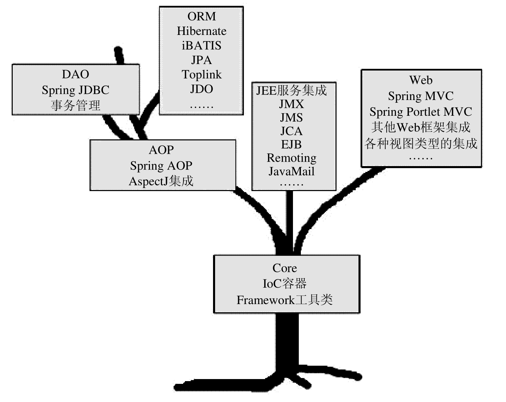

可能其中的一些技术已经被取代了，但是大体上依然还是这样的，作者的Spring的版本2.x


也就是本书的行文思路了


核心模块：Core，提供了IOC容器实现，帮助我们以依赖注入的方式管理对象之间的依赖关系，还有各种工具类，比如Spring的基础IO工具类等等。

左上遍历，AOP模块：提供一个轻量但功能强大的AOP框架，让我们可以以AOP的方式增强各POJO的能力，可以与IOC容器很好的结合，发挥强大的威力。

再往上，在IOC和AOP的基础上提供了完备的数据访问和事务管理的抽象和集成服务：对JDBC的最佳实践Spring JDBC极大地简化了该API的使用（感觉最佳实践这个词用得有点多，例如J2EE的最佳实践——EJB，理解成产品的意思吧），另外也为业内流行的ORM框架提供了形式统一的集成支持。Spring框架中的事务管理抽象层是Spring AOP的最佳实践，对编程式事务和声明式事务都有完备的支持。

Spring对Java EE服务（JNDI，JMS以及JavaMail等）的支持，使其不再杂乱无章，可以轻松地使用。

最后是Web模块，Spring提供了一套自己的WebMVC框架Spring MVC，但也对其他Web框架例如Struts，WebWork以及JSF等，在Spring的Web框架都有为他们提供集成支持。


上层的模块需要依赖于下层的模块才能正常工作，模块之间的依赖性

同层级的模块之间是相互独立的，模块之间的独立性

> 不要只将Spring看做是一个IOC容器，也不要只将Spring与AOP挂钩
>
> 它不仅仅是一个简化J2EE开发的轻量级框架，也应该是一个简化任何Java应用的开发框架


# 第二部分、Spring的IoC容器


### 第二章、IoC的基本概念


IoC的全称是：Inversion of Control，中文常翻译为“控制反转”，还有一个别名叫做依赖注入DI（Dependency Injection）


通常类中有其他的对象（称为依赖类），往往会需要一个构造函数来对这些成员变量赋值。往往都需要我们自己去手动获取依赖的对象。

而IoC就是为了我们直接将对象送到我们面前来，不需要我们自己去处理依赖的关系。就好像置办一间屋子，以前都是什么都需要自己去购买（new对象，类似于自己管理依赖），现在可以直接送货上门（依赖于IoC容器的自动注入）。

> 其实IoC就这么简单，原来是需要什么东西自己去拿，现在是需要什么东西就让别人送过来


在IoC模式中，被注入对象又是通过哪些方式来通知IoC Service Provider来为其提供服务的呢？

三种依赖注入方式：

- 构造方法注入

```java
Class A{
    private B b;
    private C c;
    public A(B b,C c) {
        this.b = b;
        this.c = c;
    }
}
```

使用这种方法，被注入的对象的构造乃至其整个生命周期，应该是由IoC Service Provider来管理的


- Setter方法注入

当前对象只需要为其依赖对象的对应属性添加Setter方法，就可以通过setter方法将对应的属性设置到被注入对象当中

```java
Class A{
    private B b;
    private C c;
    public setB(B b) {
        this.b = b;
    }
    public setC(C c) {
        this.c = c;
    }
}
```

并不会在完成对象的构造后就可以使用了，而是需要后置


- 接口注入

不是非常的简单明了，被注入对象如果想要IoC自动注入就必须实现某个接口，IoC最终通过这些接口来了解应该为被注入对象注入什么依赖对象，接口不是固定的，需要自己声明，甚至接口名字和方法名字都不是固定的，只要保证接口的唯一方法是一个() -> Void的即可

接口注入相对于前两种相对死板和繁琐。


> ~~现在常用的基于Annotation的依赖注入是Spring 3.0的新特性，在以前版本的Spring当中无法实现~~      误人子弟，是存在以注解方式进行注入的


比较：

- 构造方法注入：
  - 优点：对象在构造完成之后就进入就绪状态，可以马上使用
  - 缺点：构造方法的参数会比较长，并且在Java中构造函数无法被继承，无法设置默认值。对于非必须的依赖管理，可能需要引入多个构造方法
- Setter注入：
  - 对象可以继承，可以设置默认值
  - 对象在构造完成后无法立马进入继续状态

- 接口注入不提倡，带有侵入性的代码

简单的模拟：

```java
@Component
public class A {
    private B b;

    /**
     * 构造器注入
     */
    public A(B b) {
        this.b = b;
    }

    /**
     * Setter注入
     */
    @Autowired
    public void setB(B b) {
        this.b = b;
    }
}
```

现在当然没必要这么干了（除了static字段还是得这么做），可以直接使用Autowired注解直接提供属性注入，因为以前都是XML的配置时代，容器中会有很多bean，这么做还是有必要的（但是这里的setter方法还是有依赖于Autowired注解的，不知道以前是怎么解决的【找到解决办法了，是通过XML来指定对象之间的依赖关系来解决的，bean里面的property属性】）

去掉上面的所有注解，加入如下xml文件，并使用ImportResource注解读取配置文件即可

> 书上好像直接讲的意思是将代码的抽象程度提高，和IOC的观点好像没啥联系，有点迷幻
>
> 估计是这一章讲解IoC的思想吧，还完全没使用到容器这一层面来，后面讲BeanFactory的时候讲到了注解方式的依赖绑定方式


SpringBoot1.0版本对应着Spring的4.0.3。所以那时候自动配置这些功能完全没有，都需要人工手动编辑配置文件。


### 第三章、掌管大局的IoC Service Provider


IoC Service Provider提供的职责就是：将这些相互依赖的对象绑定到一起

IoC Service Provider是一个抽象出来的概念，可以是任何一种将业务对象绑定到一起的一种实现方式，可以是各种IoC框架或者容器，例如最简单的`Object obj = new Object()`也可以算是一个。但是单单只有这种绑定代码也会是一种非常糟糕的体验。

Spring的IoC容器就是提供依赖注入服务的IoC Service Provider


主要职责：

- 业务对象的构建管理：IoC Service Provider将需要的对象的构造逻辑从客户端对象中玻璃出来，以免这部分污染业务逻辑对象的实现
- 业务对象间的依赖绑定：最艰难也是最重要的，识别各个业务对象之间的依赖关系，将这些依赖关系的对象进行绑定


IoC Service Provider记录对象之间依赖信息的方式主要有以下几种：

- 直接编码方式

大部分IoC容器都是支持以编码方式来操作容器的比如PicoContainer、Spring、Avalon等

书上一个例子：

```java
IoContainer container = ...;
container.register(FXNewsProvider.class,new FXNewsProvider());
container.register(IFXNewsListener.class,new DowJonesNewsListener());
...
FXNewsProvider newsProvider = (FXNewsProvider)container.get(FXNewsProvider.class);
newProvider.getAndPersistNews();
```

这种通过编程的方式让IoC Services Provider得以知晓对象间的依赖关系，是管理依赖关系的最基本方式


- 配置文件方式

普通文本文件，properties文件，XML文件等等都可以成为管理依赖关系的载体

最为常见的还是XML格式，使用ImportResources注解引入，一般都是直接标注在主类上，SpringBoot用得少了，都是推荐使用JavaConfig类


- 元数据方式

代表就是Google Guiee，在Java5注解基础上开发的一套IoC框架

正是我们现在常用的这一套，原来Spring是从这儿偷的

直接在类中使用注解来标注各个对象之间的依赖关系，然后Guiee框架根据这些注解的信息将这些对象进行组装

真的，要多像有多像，只不过注解名字不是autowired而是Inject，更体现出是注入的意思


### 第四章、Spring的IoC容器之BeanFactory


上面提到的IoC Services Provider都是泛指，这里来看下Spring的IoC。

Spring的IoC容器是一个提供IoC支持的轻量级容器，不要只是想着IoC Services Provider的作用，那只是IoC组成的一个部分，他本身还是一个轻量级容器用于对象的存储支持。

当然，Spring的IoC有它独到的优势，并不是他比别家的IoC容器做得好，甚至还没有Google的Guiee做得好，但是奈何他提供的对其自家容器之上的集成，即我们在第一章看到的树状知识图，后面发展起来的技术栈成功奠定了Spring IoC的地位。

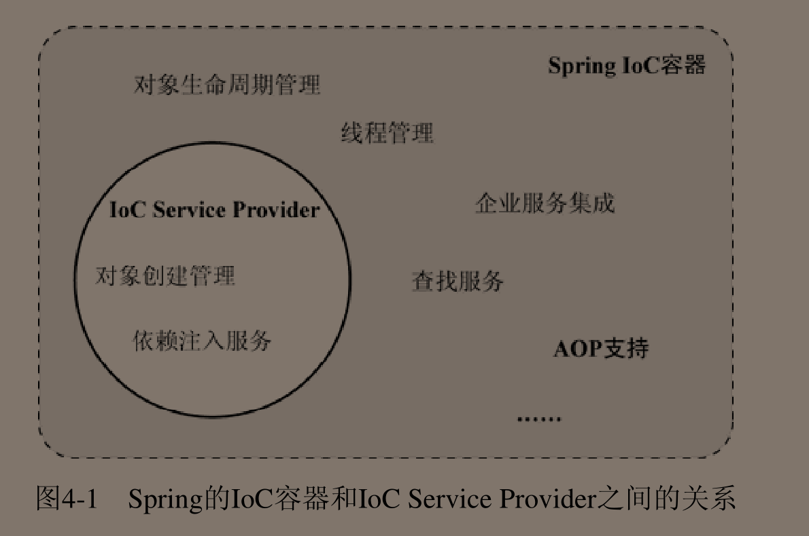

后面的这些技术栈都直接集成在了Spring IoC容器当中，因为都是要依赖于IoC容器的


Spring默认提供两种容器类型（都是接口）：

- BeanFactory

基础类型IoC容器，提供完整的IoC服务支持，默认采用延迟初始化策略。只有当客户端对象需要访问容器中某个受到管理对象时候才会对该对象进行初始化以及依赖注入操作。

特点：启动快，所需资源少，功能也相对较少

- ApplicationContext

在BeanFactory基础之上构建的，相对高级的容器实现，基本继承了BeanFactory的所有特性（也有小部分作了修改），还额外提供了一些高级特性如：事件发布，国际化支持等等。ApplicationContext所管理的对象默认是启动之后全部初始化并绑定完成的

特点：要求更多资源，容器启动时间较长，功能强大


> 在Spring Boot 2.3.1当中使用的是ApplicationContext，可以尝试着在构造函数中输出一行，会发现在容器启动时候就输出了

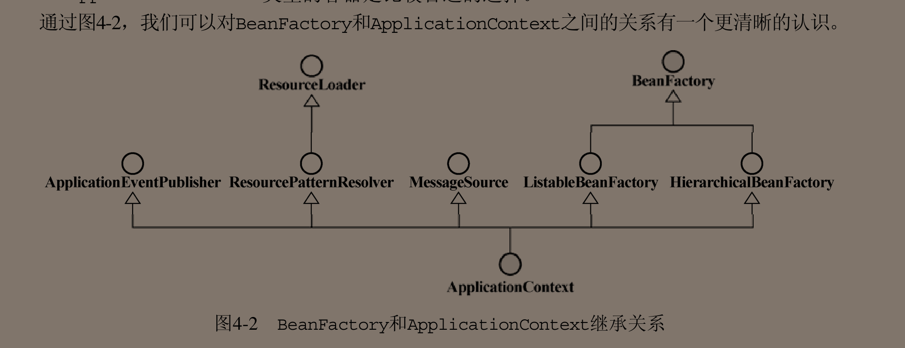


玩转Spring全家桶里的：

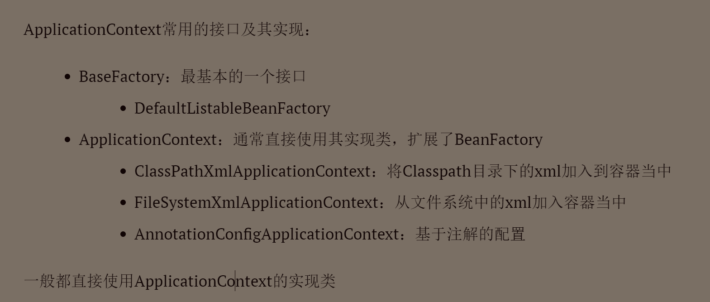

还讲述了不同的ApplicationContext之间对象的AOP关系


BeanFactory可以完成IoC Services Provider的所有职责，包括对象的创建和对象依赖关系的绑定（也就是这两个最主要了）。Spring认为一切都是POJO对象，可以把每个对象看做一个JavaBean对象，BeanFactory就是生产这些Bean的工厂，并完成对对象的组装，返回给我们一个可用的JavaBean对象

可以看下提供的几个方法，重载的就不算了

getBean方法：取得某个被Factory加工好的对象

getBeanProvider方法：获取某个指定bean的提供者

containsBean方法：是否存在于容器中

isPrototype方法：会访问父工厂并且保证查询的name是单例的

还有几个就是关于Type的检查了。基本上都是查询，获取Bean的方法


感觉说白了IoC Services Provider很像是一个拥有一些特殊功能的Map


BeanFactory对IoC Service Provider的完美支持，试下管理绑定信息的三种方式：

- 直接编码方式

还是比较好玩儿的，具体测试代码如下：

两个注入类型：

```java
public class A {
    private B b;

    /**
     * 构造函数注入
     */
    public A(B b) {
        this.b = b;
    }

    /**
     * 提供无参构造，如果不提供的话
     * 使用setter注入会报错找不到init
     */
    public A() {
    }

    /**
     * Setter注入
     */
    public void setB(B b) {
        this.b = b;
    }

    public void sayHello() {
        System.out.println("A hello");
        b.sayHello();
    }
}
```

```java
public class B {

    public void sayHello() {
        System.out.println("B hello");
    }
}
```

主函数：

```java
/**
     * 尝试以编码方式使用BeanFactory
     */
public void testCoding() {
    DefaultListableBeanFactory container = new DefaultListableBeanFactory();
    //向IOC中注入的是BeanDefinition而不是Bean，并绑定依赖关系
    RootBeanDefinition aDefinition = new RootBeanDefinition(A.class);
    RootBeanDefinition bDefinition = new RootBeanDefinition(B.class);

    //1、可以通过构造函数指定依赖关系
    ConstructorArgumentValues argValues = new ConstructorArgumentValues();
    argValues.addIndexedArgumentValue(0,bDefinition);
    aDefinition.setConstructorArgumentValues(argValues);

    //2、或者通过setter方式注入
    MutablePropertyValues propertyValues = new MutablePropertyValues();
    //这里要指定成字段名字
    propertyValues.addPropertyValue(new PropertyValue("b",bDefinition));
    aDefinition.setPropertyValues(propertyValues);

    //将BeanDefinition注册到Container中去
    container.registerBeanDefinition("aDefinition",aDefinition);
    container.registerBeanDefinition("bDefinition",bDefinition);

    //获取A并测试
    A a = container.getBean(A.class);
    a.sayHello();
}
```


这里使用的DefaultListableBeanFactory是BeanFactory的一个实现类，还实现了BeanDefinitionRegistry接口，这个BeanDefinitionRegister才是在BeanFactory的实现中担当Bean注册管理的角色。

BeanFactory只定义了如何访问容器内Bean的方法，各个Bean之间的具体实现类负责具体Bean的注册以及管理工作，BeanDefinitionRegistry接口只抽象了Bean的注册逻辑，主要负责对BeanDefinition的操作

打个比方：BeanFactory类似于图书馆，BeanDefinitionRegistry就好似图书馆的书架

每个受管理的对象，容器中都会有一个受管理的BeanDefinition实例保存对象的必要信息。例如：对象的class类型，构造方法参数及其他属性等等，当我们从BeanFactory中发送请求的时候Factory就会从BeanDefinition中抽取有用的信息来返回一个完备可用的对象实例。

BeanDefinition的实例化对象：RootBeanDefinition


- 外部配置文件

主要也就是XML配置文件，前面已经尝试过了，展示代码：

```xml
<bean class="cn.luckycurve.dependencyinjection.A">
    <property name="b" ref="b"/>
</bean>
<bean id="b" class="cn.luckycurve.dependencyinjection.B">
</bean>
```

这里可以new一个ClassPathXmlApplicationContext来新建一个container（这里也可以直接使用BeanFactory接口的实现类来实现ReadXMLFile），这里没有，直接使用@ImportResource注解将XML文件注册到了当前容器当中，并进行了以下测试：

```java
@Autowired
ApplicationContext container;

@Override
public void run(ApplicationArguments args) throws InterruptedException {
    A a = container.getBean(A.class);
    a.sayHello();
}
```

是在没想明白怎么注入ApplicationContext了，就直接使用Autowired注解进行验证了

成功~


- 注解方式

终于回归到现代化了

使用@ComponentScan来指定扫描的范围，之所以在SpringBoot中不用使用是因为@SpringBootApplication是包含了该注解的，默认扫描当前路径及所有的子路径


Google Guiee是完全基于注解实现的，轻量级依赖注入框架，后来SpringBoot就学去了呗


> 终于明白书上为啥一直使用ApplicationContext或者BeanFactory去创建容器了，因为 Spring项目不会自动的帮你开启一个容器，而SpringBoot会，所以可以不用完成IoC容器的创建工作了


XML格式标签详解：以前是Spring提供的最为强大的，支持最为全面的配置方式，到如今的SpringBoot项目当中来，完全不提倡使用配置文件的方式，更加提倡使用配置类的方式

看下几个标签把，毕竟都是过往的一段历史：

bean：注册到容器的业务对象，包含属性字段：id，class

构造方法注入的XML方式：

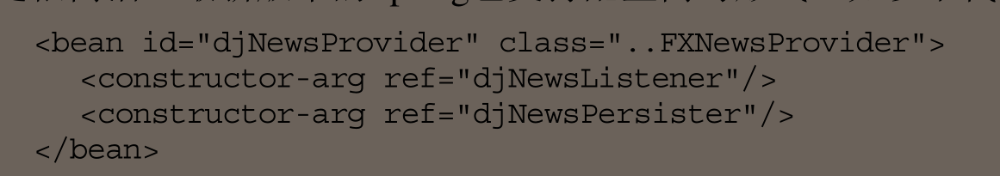

类似于以上的格式


Setter 注入的XML方式：

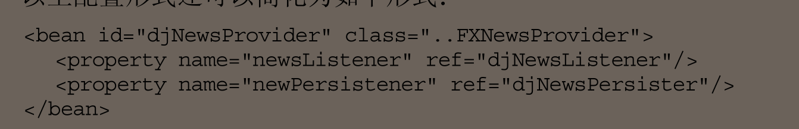

类似于以上的格式


bean字段里面提供了autowire字段用于自动绑定 ，当然现在用的很少了


scope字段：用于声明容器中的对象所应该处的限定场景或者说该对象的存活时间

在现在使用@Bean注解中都没有这个属性了，只存在以下这些属性：

```java
String[] value() default {};
@AliasFor("value")
String[] name() default {};
boolean autowireCandidate() default true;
String initMethod() default "";
String destroyMethod() default "(inferred)";
```

好像还没有限定对象生命周期的属性


官方文档逛了一圈也没有找到，好像对象的生命周期管理在SpringBoot中对用户透明了

但是在Spring的官方文档中有对这段的详细描述，一共提供了五个Scope

- singleton：单例，在IoC容器中只存在一个对象，该对象在第一次被请求而初始化后（这里仅针对BeanFactory，ApplicationContext不会进行懒加载而是直接完成初始化了）将一直存活到容器退出，与IoC容器基本有相同的寿命。

不要与单例模式混淆了，这里只是保证在同一个容器中只存在一个共享实例，而单例模式保证的是在同一个ClassLoader中只存在一个这种类型的实例


- prototype：容器在收到获取对象的请求的时候，会重新生成一个新的对象实例给请求方，并当对象返回之后，容器就不再拥有当前对象的引用，即后续的生命周期的管理工作需要用户自己进行。


后面三个都要基于Web ApplicationCOntext环境

- request：给每个request都创建一份对象实例，并当请求结束后，这些对象的生命周期也随之结束
- session：与request极其类似，只是为每个session创建一份对象实例而已
- global session：只有应用在基于portlet的Web应用程序中才有意义，在普遍的基于Servlet的Web应用中使用就相当于是使用了session


以前将接口和实现类解耦的方式就是通过工厂方法来实现的，工厂方法可以屏蔽实现类，只需要我们操作接口中的方法即可达到对应的目的

Spring IoC对工厂类也提供了支持，可以通过XML方式直接指定工厂方法并将工厂方法的返回值直接放进IoC容器当中


FactoryBean：不要与BeanFactory搞混淆了。其主语是Bean，定语是Factory，本身也只是一个bean，不过这个bean本身就是创建对象的工厂

该接口主要是为了避免因为XML配置类编写的注册bean的逻辑太过复杂导致的，例如有太多的参数，往往还不如直接使用Java类来书写，实现该接口即可实现将一个bean添加到IoC容器当中来的逻辑，只不过是通过编码的方式，摘要方法如下：

```java
public interface FactoryBean<T> {
	@Nullable
	T getObject() throws Exception;
	@Nullable
	Class<?> getObjectType();
	default boolean isSingleton() {
		return true;
	}
}
```

通过编码的方式将bean加入到IoC容器中来，不过在SpringBoot环境下就毫无用武之地了，因为其依赖注解，完全可以实现依赖注解注入或者是构造函数注入或者是setter注入（配上Autowired注解）。


BeanFactoryAware接口：容器在实例化实现了该接口的bean定义的过程中，会将容器自身注入进该bean中，于是该bean对象就可以获得一个BeanFactory的实例对象，于是就可以在获取bean的时候偷梁换柱了（**其实感觉也没啥用，提供了一种获取当前容器的方法吧，用起来还是可以的**）。

例如：获取C的实例化对象，可以在A中这样做：

```java
public class A implements BeanFactoryAware {

    private BeanFactory beanFactory;

    @Override
    public void setBeanFactory(BeanFactory beanFactory) throws BeansException {
        this.beanFactory = beanFactory;
    }
    
    public C getC() {
        return beanFactory.getBean("c",C.class);
    }
}
```

这样看起来好像是有点蠢，哈哈，基于注解的DI太方便了，如果真要获取当前容器Autowired一个ApplicationContext即可，使用BeanFactoryAware更像是在没有注解的情况下使用

> 到后面可以看到会有一系列的类似于这种接口去实现，感觉在SpringBoot中就不是很有必要了


这里其实就蕴涵着AOP的思想了，操作BeanFactory使用方法的实现类来替换掉原来的对象，对其中的一些方法进行增强，在当用户使用的时候自然就可以享受到增强后的代码，并且完全没有任何代码的侵入。

> 当然这里只是演示替换的逻辑，真正还是不要这么做了，安全性啥的都没有保证


容器背后的秘密：


IoC的大体功能实现可以分为两个阶段：

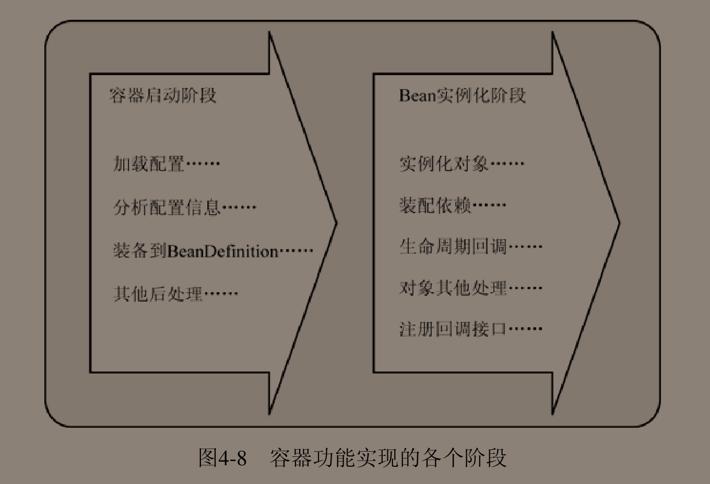


1、容器启动阶段


加载配置文件，如果不是Java语言编写的配置文件，需要借助BeanDefinitionReader工具来进行解析，将其组织为BeanDefinition，注册到相应的BeanDefinitionRegistry

该阶段可以被认为是准备性的，侧重点是对象管理信息的收集和验证。


2、Bean实例化阶段


BeanFactory默认延迟Bean实例化，ApplicationContext就地实例化

这里以BeanFactory为例子，ApplicationContext在下一章会进行讨论

先会查看所请求的对象在之前是否已经被初始化，如果初始化了就可以直接返回了（默认Bean是Singleton的），如果没有进行初始化，就会根据当前的BeanDefinition信息实例化被请求对象，并为其进行依赖注入。

第二阶段就好似与使用第一阶段提供的图纸来生产出具体的产品


Spring提供了BeanFactoryPostProcessor接口的容器拓展机制，允许我们在容器实例化相应的对象之前，对注册到容器中的BeanDefinition进行修改，修改的时间为第一阶段的最后

大多时候我们不会直接和BeanFactoryPostProcessor接口打交道，而是两个实现类：

- PropertyPlaceholderConfigurer：已经不建议使用了，被：Environment和PropertySource所取代

主要就是为了将数据库的账号密码抽取到一个单独的properties配置文件当中，再使用占位符的方式在XML配置文件中对值进行引用。PropertyPlaceholderConfigurer就是起到解析占位符的作用`${}`，不过随着时代的更替，被取代了

- PropertyOverrideConfigurer这个倒还是没有废弃

感觉功能和上面那个差不多，也是通过占位符来标明bean定义中的Property与properties文件中的各项配置之间的关系。

例如在XML中bean的配置的DataSource中的maxActive为200，我觉得太小了，想换成500。可以不用更改源代码，直接通过PropertyOverrideConfigurer指定的properties文件来修改即可，对bean是透明的（感觉这也就是日后SpringBoot约定大于配置中自定义配置的修改源码了）。

具体需要的properties配置文件的文件格式为：beanName.PropertyName = value

这不就是@PropertySource注解的底层实现嘛，添加一个properties文件到IoC中来。

更可怕的是上面一项就是被PropertySource所取代的。

果然，Spring还是逐渐抛弃了XML格式，宁愿选用properties格式


还有一个附加的BeanFactoryPostProcessor实现类CustomEditorConfigurer

与上面两个不同的是，这个附加的实现类并不会去单独更改已经注册到容器中的BeanDefinition，而是只会辅助性地添加BeanDefinition到IoC容器当中去


在BeanFactory中使用BeanFactoryPostProcessor还需要自己进行配置，而使用ApplicationContext可以直接将BeanFactoryPostProcessor注册到IoC容器中，即可自动生效


Spring是如何解析XML，properties等一系列的的媒介文件的呢？因为里面存储的都是String类型，所以需要一个类来完成由字符串到具体对象的类型转换，这个类就是PropertyEditor接口的一系列实现，PropertyEditor是Java.beans包下的，从而继承了原生类型和类似于Color和Font等类型的类型转换，当然Spring也对其进行了扩充。如果有时候没有提供PropertyEditor，或者需要转换成为的对象时我们自定义的，就需要我们自定义PropertyEditor来完成String到对象之间的转换。


一般都是直接使用PropertyEditor的子类PropertyEditorSupport来简化实现，这时候如果我需要实现yyyy/MM/dd的日期转换支持，我还可以实现更具体的

试了半天也没有成功，都试到Convertor加上@ConfigurationPropertiesBinding注解去了，还是没有解决，结果最后是这样解决的

配置文件：

```properties
date.info=2000-09-01
```

Java类：

```java
@Configuration
@ConfigurationProperties(value = "date")
public class Config {
    @DateTimeFormat(pattern = "yyyy-MM-dd")
    private LocalDate info;
    //getter & setter
}
```


了解完容器启动阶段后，开始了解bean实例化阶段，开启bean的一生

BeanFactory的getBean方法的隐式调度的两种情况：

- 初始化A对象，对A对象调用getBean方法时，会先实例化A所依赖的B对象，当A所有依赖的对象都被隐式的创建完成之后才会创建A对象
- ApplicationContext启动时候的就地初始化，就是隐式调用的最好佐证


当getBean方法发现该beanDefinition之前还没有被实例化之后，会通过createBean方法来进行具体的对象实例化，完整的实例化过程：

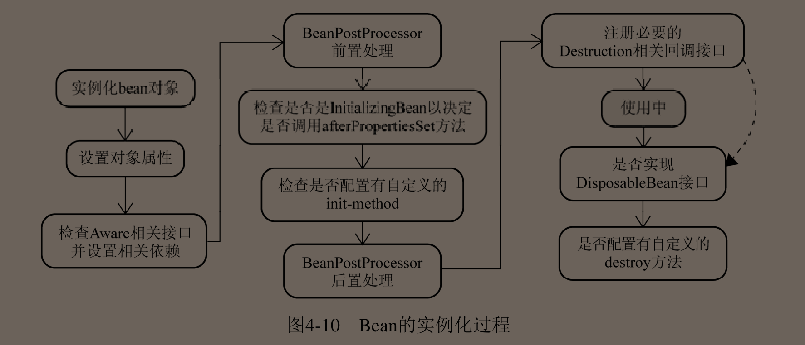

getBean的具体实现可以查看抽象类AbstractBeanFactory

createBean的具体实现可以查看抽象类AbstractAutowireCapableBeanFactory

直接看BeanFactory的实现类DefaultListableBeanFactory会有点绕


Spring为其管理的对象赋予了统一的生命周期管理，让对象拍拖了“new完之后被使用，脱离作用域后被回收”的命运，当然最后的对象回收还是依赖于JVM的垃圾收集机制的，Spring只是不会让对象过早的被回收，避免了对象的重复创建和繁琐的对象传递过程。


Bean的一生：

1、Bean的实例化与BeanWrapper

Spring IoC内部采用策略模式（Strategy Pattern）的方式来初始化bean，具体有两套解决方案：反射和CGLIB字节码动态代理生成bean实例或动态生成其子类


实例化策略的抽象接口是InstantiationStrategy，具体的两个实现（也只有这两个实现）：

- SimpleInstantiationStrategy：通过反射机制来创建对象，但不支持方法注入方式的实例化对象（只能创建原有对象，不能默认支持创建其匿名实现类）
- CglibSubclassingInstantiationStrategy：继承SimpleInstantiationStrategy以及其以反射创建实例化对象的功能，并融入CGLIB的动态字节码生成功能，可以动态的生成某个类的子类，容器默认情况下采用这种

容器通过BeanDefinition传入进CglibSubclassingInstantiationStrategy中，根据传入信息完成实例化工作，但不是直接返回构造完成的对象，而是用BeanWrapper对构造好的对象进行一个封装

第一阶段结束

Spring之所以使用BeanWrapper对创建完成对象进行包裹，是因为只完成第一阶段后，对象还没有完成赋值操作，还需要进行第二阶段：设置对象属性

BeanWrapper定义直接继承了PropertyEditorRegistry和TypeConverter接口，同时也将前面说的PropertyEditor传递给BeanWrapperImpl实现类，可以直接完成对XML配置属性的解析

主要是因为BeanWrapper可以很方便的完成对象属性的赋值而不用去直接使用繁琐的Java反射API，省去了大量的代码空间


2、各色的Aware接口

当对象完成实例化并且相关的属性以及依赖都完成了设置之后，就会检查是否实现了一系列的Aware接口，如果是，则将这些Aware接口定义中的规定的依赖注入进当前对象实例

详细Aware接口：

- BeanNameAware：将beanName设置到当前实例当中

```java
void setBeanName(String name);
```

- BeanClassLoaderAware：将加载当前Bean的ClassLoader注入到当前对象实例当中

```java
void setBeanClassLoader(ClassLoader classLoader);
```

- BeanFactoryAware：让当前对象具有一个BeanFactory的实例

```java
void setBeanFactory(BeanFactory beanFactory) throws BeansException;
```


上面都是BeanFactory需要扫描的Aware，最后几个是ApplicationContext独有的，都是基于BeanPostProcessor（~~在最后一个阶段修改BeanDefinition的方式~~，不是的，这里都完全进入了对象实例化阶段，很显然修改BeanDefinition没有用了，那个接口是BeanFactoryPostProcessor）

- ResourceLoaderAware：ApplicationContext实现了ResourceLoader接口，让实例对象拥有其所在的ApplicationContext容器的一个引用

```java
void setResourceLoader(ResourceLoader var1);
```

- ApplicationEventPublisherAware：ApplicationContext实现了ApplicationEventPublisher接口，和上面的一样，也是将ApplicationContext注入到当前实例化对象中去

```java
void setApplicationEventPublisher(ApplicationEventPublisher var1);
```

- MessageSourceAware：ApplicationContext实现了MessageSource接口支持国际化（i18n）支持，将自身注入进实例化对象当中去

```java
void setMessageSource(MessageSource var1);
```

- ApplicationContextAware：将自身注入到实例化对象当中去


3、BeanPostProcessor

非常容易和BeanFactoryPostProcessor概念混淆了，只需要记得BeanFactoryPostProcessor是存在于容器启动阶段最后修改BeanDefinition的，BeanPostProcessor是存在于创建对象实例化阶段的。

其实这两个接口非常类似，BeanFactoryPostProcessor会处理符合条件的BeanDefinition，BeanPostProcessor会处理容器内所有符合条件的实例化后的实例对象

接口摘要：

```java
public interface BeanPostProcessor {
	@Nullable
	default Object postProcessBeforeInitialization(Object bean, String beanName) throws BeansException {
		return bean;
	}
	@Nullable
	default Object postProcessAfterInitialization(Object bean, String beanName) throws BeansException {
		return bean;
	}

}
```


具体执行：


前置处理和后置处理，传入实例化对象，经过我们处理之后传出，逻辑非常清楚明白


实际上前面已经提到过ApplicationContext那几个Aware是依赖于BeanPostProcessor来实现的，就是通过在前置处理中默认处理相对应的Aware所对应的语义


在这里还可以轻松实现替换当前对象实例或者字节码增强当前对象实例等等，AOP的绝佳位置，Spring AOP也大量的使用BeanPostProcessor作为对象生成相应的代理对象。


小实践：自定义一个BeanPostProcessor实现AOP功能：

代码逻辑：

```java
public class A {
    @autowired
    private B b;
    
    public void sayhello() {
        System.out.println("A hello");
        b.sayHello();
    }
}

public class B {
    public void sayHello() {
        System.out.println("B hello");
    }
}
```

替换A中的sayHello方法的代码：

```java
@Component
public class MyBeanPostProcessor implements BeanPostProcessor {

    @Override
    public Object postProcessBeforeInitialization(Object bean, String beanName) throws BeansException {
        if (bean instanceof A) {
            bean = new A(){

                @Override
                public void sayHello() {
                    System.out.println("A hello power by AOP");
                    //super.sayHello();
                }
            };
        }
        return bean;
    }

    @Override
    public Object postProcessAfterInitialization(Object bean, String beanName) throws BeansException {
        return bean;
    }
}
```

12行的代码无法打开，本来是想实现在方法调用之前增加输出一行的，但是我是直接新建了一个A的匿名内部类来替代A，匿名内部类中的字段B没有被IoC依赖注入，B一直为null，调用会报错。


4、InitializingBean和init-method

InitializingBean接口是容器内部广泛使用的一个对象生命周期标识接口

在对象实例化过程BeanPostProcessor前置处理之后会进行bean判断是否实现了InitializingBean接口，如果实现了接口，会直接调用接口里的afterPropertiesSet方法对对象进行进一步的调整

```java
public interface InitializingBean {
	void afterPropertiesSet() throws Exception;
}
```

这种方法会带来代码的侵入性，会给bean带来冗余的代码，因此可以在XML配置文件中使用init-method来指定 这一init方法

一般很少使用到，在构造函数里面指定初始化操作感觉就足够了


5、DisposableBean与destory-method

根据图片4-10可以看出，这一步已经到了对象使用完毕后，准备销毁的阶段了，和第四块的init操作基本上是一样的。在销毁时候会检查是否实现DisposableBean接口或者是XML中的destory-method属性

这个方法的执行是在对象不再使用的时候，这时候往往也是容器即将关闭的时候（因为即使现在对象没有使用了，但不代表等下没有别的函数会来请求该对象，所以一般都是不能销毁注册进去的bean的）

ApplicationContext可以保证在JVM关闭之前可以完成容器中所有bean的destory方法的调用和整个容器的关闭。而BeanFactory则无法保证，往往bean的destory都是形同虚设


至此，Bean走完它光荣的一生


小结：

Spring IoC的两种主要容器：BeanFactory和ApplicationContext。本章开头讲述两者的总体介绍，然后着重讲解BeanFactory

最后我们不满足于只知道BeanFactory，对BeanFactory的背后原理进行了探索（同样适用于ApplicationContext，不适用的地方已经指出来了）

主要讲解了：BeanFactory对象注册（3种）和依赖绑定（两种）的几种方式、

BeanFactory的XML标签、

IoC的功能实现：容器启动和Bean实例化（即Bean的生命周期，大体上分为5个阶段）


###  第五章、Spring IoC容器ApplicationContext


拓展了BeanFactory，拥有BeanFactory的全部功能

ApplicationContext的实现（与Spring全家桶里的差不多）：

- FileSystemXMLApplicationContext
- ClassPathXMLApplicationContext
- XMLWebApplicationContext（已经找不到了，估计被剔除了）
- AnnotationConfigApplicationContext

都是将BeanDefinition加载到ApplicationContext中


本章主要围绕ApplicationContext的一些特性来展开（较之于BeanFactory）：国际化i18n、统一资源加载策略、容器内事件发布等

这些附加功能全部都是对JavaSE的扩展，使我们可以更轻易的摆脱JDK类库的设计缺陷，但是好像没有太多的新理念了，不如BeanFactory里面的惊艳


- 统一资源加载策略

之所以出现这一项特性，还得从需求了解

URL（统一资源定位符）是Java SE提供的标准类，但多少有些名副其实了。基本上只限于网络形式发布的资源的查找和定位工作，使用起来不够方便（和Java的Date类差不多，只不过在Java8中Oracle对其进行了调整，整合了joda-time，这里是Spring自己对资源的加载策略的重新定义）


Spring提出一套基于Resource和ResourceLoader接口的资源抽象和加载策略


- Resource接口

Spring使用此接口作为所有资源的抽象和访问接口，根据不同类型的资源，提供了不同的实现：

- ByteArrayResource：对字节数组提供的数据作为一种资源进行封装，可以构造特定的ByteArrayInputStream访问该资源
- ClassPathResource：从Java应用程序的CLassPath中加载具体资源并进行封装，可以使用指定的ClassLoader对资源进行加载
- FileSystemResource：对File类型进行封装，以文件或者URL的方式对资源进行访问
- UrlResource：URL的实现类，内部委托URL进行具体的资源操作
- InputStreamResource：使用较少，将InputStream视为资源的Resource实现类，一般可以通过ByteArrayResource或者其他Resource代替

有好些类都是直接在上面加上Context的，那些是他们的子类


也可以自己去实现抽象类AbstractResource来实现Resource，但估计不会用到了，Spring提供的Resource已经足够强大


- ResourceLoader接口

职责在于：查找和定位这些资源。该接口是资源查找定位策略的统一抽象。可以看做是更广义的URL

接口内部也十分简洁：

```java
public interface ResourceLoader {
	//CLASSPATH_URL_PREFIX = "classpath:";
	String CLASSPATH_URL_PREFIX = ResourceUtils.CLASSPATH_URL_PREFIX;
	//核心方法
	Resource getResource(String location);

	@Nullable
	ClassLoader getClassLoader();

}
```


默认提供的ResourceLoader实现类

- DefaultResourceLoader

内部的getResource方法也非常的简单：

```java
@Override
public Resource getResource(String location) {
    Assert.notNull(location, "Location must not be null");
    //使用内置的协议解析器先尝试对location进行解析
    for (ProtocolResolver protocolResolver : getProtocolResolvers()) {
        Resource resource = protocolResolver.resolve(location, this);
        if (resource != null) {
            return resource;
        }
    }

    if (location.startsWith("/")) {
        //内部直接尝试构建ClassPathContextResource，文末
        return getResourceByPath(location);
    }
    else if (location.startsWith(CLASSPATH_URL_PREFIX)) {
        //直接构建ClassPathResource
        return new ClassPathResource(location.substring(CLASSPATH_URL_PREFIX.length()), getClassLoader());
    }
    else {
        try {
            // Try to parse the location as a URL...
            URL url = new URL(location);
            return (ResourceUtils.isFileURL(url) ? new FileUrlResource(url) : new UrlResource(url));
        }
        catch (MalformedURLException ex) {
            // No URL -> resolve as resource path.
            return getResourceByPath(location);
        }
    }
}

//两次出现了
protected Resource getResourceByPath(String path) {
    return new ClassPathContextResource(path, getClassLoader());
}
```


可以尝试在项目中使用类似于24行的代码，非常的高效与简洁


可以发现上面的getResource方法永远都会返回一个非null的对象，即使是抛出异常了，也会调用getResourceByPath方法构建一个ClassPathContextResource对象返回，有可能该资源不存在

处理的其实不是很恰当


- FileSystemResourceLoader

拓展了DefaultResourceLoader，主要是重写了getResourceByPath方法，让他不会无脑的返回一个ClassPathContextResource对象，逻辑如下：

```java
protected Resource getResourceByPath(String path) {
    if (path.startsWith("/")) {
        path = path.substring(1);
    }
    return new FileSystemContextResource(path);
}
```

这样碰到文件类型就可以直接返回一个FileSystemContextResource对象而不是笼统的ClassPathContextResource对象

实际体验并没有什么差别，反正都是直接返回Resource对象

简单使用：

```java
@Test
void resourceGet() {
    FileSystemResourceLoader loader = new FileSystemResourceLoader();
    Resource resource = loader.getResource("E:\\Entertainment\\Game\\英雄联盟\\TCLS\\Client.exe");
    assertTrue(resource instanceof FileSystemResource);
    assertTrue(resource.exists());
    System.out.println(resource.getFilename());
}
```


Spring框架也提供了批量查找的ResourceLoader：ResourcePatternResolver接口

是对ResourceLoader接口的扩展。可以根据资源的路径匹配模式匹配到多个Resource实例

定义和ResourceLoader基本如出一辙：

```java
public interface ResourcePatternResolver extends ResourceLoader {
	String CLASSPATH_ALL_URL_PREFIX = "classpath*:";

	Resource[] getResources(String locationPattern) throws IOException;
}
```

引入新的前缀classpath*:

最常用的实现类：PathMatchingResourcePatternResolver，支持基于Ant风格的路径匹配模式（即我们常用的：**/ *.suffer匹配所有以suffer结尾的路径）

内部默认使用DefaultResourceLoader来进行资源查找和定位，出来的资源也都是ClassPathResourceLoader或者更详细一点ClassPathContextResourceLoader的子类

简单使用：

```java
PathMatchingResourcePatternResolver loader = new PathMatchingResourcePatternResolver(new FileSystemResourceLoader());
Resource[] resources = loader.getResources("E:/temp/**");
for (Resource resource : resources) {
    assertTrue(resource instanceof FileSystemResource);
    System.out.println(resource.getFilename());
}
```


现在已知的Spring的统一资源管理配置：

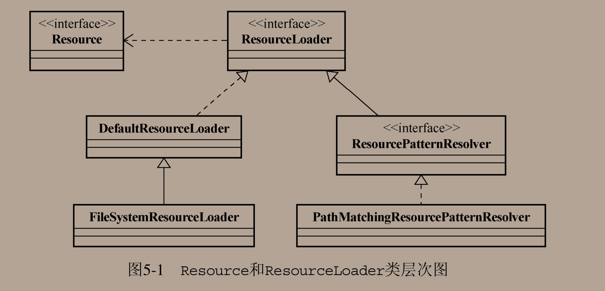


现在再回到本章的主角，ApplicationContext，你会发现他实现了ResourcePatternResolver接口，直接本身就支持对资源的批量定位和查找了

于是就可以直接通过对ApplicationContext的注入来将ApplicationContext当做一个ResourcePatternResolver来使用

但是会存在一个问题：我们在SpringBoot项目中使用Autowired注入的是AnnotationConfigApplicationContext类，只会负责去查询ClassPath路径下的，和ClassPathXmlApplicationContext类一样，不会也无法去查看文件系统的其他位置，如果需要的话估计得使用FileSystemXmlApplicationContext来，试了下是可以的

无论使用哪个ApplicationContext，读取来的结果都是FileSystemResource

ApplicationContext可以自动的将String转换到Resource类型而不用我们自己去实现PropertyEditor来完成，还是没有成功，麻烦


Spring提供了classpath:资源路径协议，类似的还有原来就在的file、http、ftp等

现在只有FileSystemXMLApplicationContext是默认从系统文件中加载了。


讲完统一资源加载策略，下面是：

国际化信息支持（i18n MessageSource）


为不同国家和地区的人提供他们各自的语言文字信息


JavaSE也提供了国际化支持

每个国家和地区在Locale类中都有相对应的简写代码表示可以去查看

例如中国的代码表示为zh_CN，美国的代码表示为en_US

例如美国和英国都属于英文地区，因此可以用Locale.ENGLISH来统一表示

构造方法摘要：


Spring对JavaSE的国际化抽象出接口：MessageSource，摘要如下：

```java
public interface MessageSource {
	@Nullable
	String getMessage(String code, @Nullable Object[] args, @Nullable String defaultMessage, Locale locale);

	String getMessage(String code, @Nullable Object[] args, Locale locale) throws NoSuchMessageException;
    
	String getMessage(MessageSourceResolvable resolvable, Locale locale) throws NoSuchMessageException;

}
```

> 参数解释：
>
> - code：传入的资源条目的键
> - args：信息参数
> - Locale：位置信息
> - defaultMessage：默认值
> - MessageSourceResolvable：封装code参数和args参数


ApplicationContext实现了MessageSource接口。表示其提供国际化支持

默认会委托一个名为messageSource的bean来完成MessageSource应该完成的职责

如果没有配置的话，会由MessageSourceAutoConfiguration自动配置一个DelegatingMessageSource类进来

Spring提供的几个MessageSource实现：

- StaticMessageSource

实现简单，常用于测试

- ResourceBundleMessageSource

最常用

- ReloadableResourceBundleMessageSource

可以定期的刷新properties文件并对其变化做出响应

简单使用Demo：

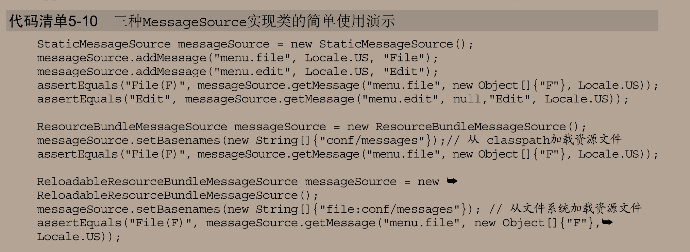

感觉除了结合前端使用Thymeleaf会使用到国际化之外，如果是REST服务就完全不会处理了，这部分的任务交给前端去处理


最后一个特性：自定义事件发布

也是对Java的事件发布机制的扩展

Java事件发布主要依靠的两个接口为：EventObject和EventListener

可以通过实现EventObject接口来自定义事件类型

实现EventListener来实现对指定事件的监听，并修改两个方法的参数为需要监听的事件

事件从发布源Publisher发布出去，监听者也需要注册在Publisher里面

大体关系如图所示：

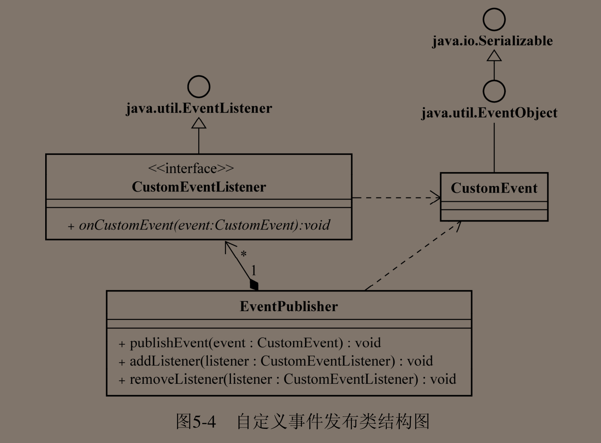


Spring对其封装：

将ApplicationListener注册进容器中，当有ApplicationEvent发布到容器当中来的时候，ApplicationListener就会对这些事件进行处理

ApplicationEvent的具体实现

- ContextClosedEvent：在ApplicationContext即将关闭时候触发的事件类型
- ContextRefreshedEvent：在ApplicationContext初始化或者刷新的时候发布的事件类型

没有什么实际的作用，只是起到标识的作用而已


ApplicationListener：用于自定义的事件监听器定义接口


ApplicationContext实现了ApplicationEventPublisher接口，可以担当事件发布者的角色，主要的功能就是注册管理以及事件发布的方法

Spring的ApplicationContext的事件默认是顺序发布的，通过SyncTaskExecutor来进行的，当然，我们也可以提供额外的TaskExecutor的实现类来提高事件发布性能

ApplicationContext的事件发布功能直接委派给ApplicationEventMulticaster来做的


Spring的事件发布机制只能完成简单的通知和处理功能，并不适用与分布式、多进程、多容器之间的事件通知


> Spring之所以提供了大量的Aware接口就是为了我们注入所需要的，例如ApplicationContext，BeanFactory，还有 这里的ApplicationEventPublisher实例


简单实现：

注册一个指定事件的Listener到容器当中去： 

```java
@Bean
ApplicationListener<ContextRefreshedEvent> applicationListener() {
    return event -> System.out.println("收到一个事件：" + event);
}
```

因为ApplicationContext本身也是一个Publisher，直接使用ApplicationContext发布一个ContextRefreshEvent对象。

```java
    @Autowired
    ApplicationContext context;

    @Test
    void contextLoads() {
        //发布一个Event，触发Listener
        context.publishEvent(new ContextRefreshedEvent(context));
    }
```

启动容器时候完成事件的触发


小结

本章讲述ApplicationContext的额外特性：资源统一加载策略、i18n支持、容器内事件发布。都是ApplicationContext独有的一些特性，可以直接使用


### 第六章、Spring IoC容器之扩展篇


Spring2.5提供的基于注解方式的依赖注入，这也是日后的趋势所在了


@Autowired注解可以标注于类的属性上，也是我们最常用的方式

也可以标注于构造器或者setter方法之上，还可以标注于任意名称的方法定义之上，只要该方法定义了需要被注入的参数

自动注入的阶段可以根据Bean实例化的阶段来判断出来


是使用BeanPostProcessor实现的，会检查是否有被@Autowired注解标注的当前对象需要完成依赖注入，且提供了实现类AutowiredAnnotationBeanPostProcessor


当IoC容器中有多个Bean的时候，可以使用@Qualifier注解或者是@Resource注解来指定当前对象需要注入哪一个，也可以直接指定在方法入参之上

我自身建议：使用后者，不知道为啥使用前者总会出现各种各样奇怪的问题，我更宁愿相信JSR250标准的Resource注解，Resource是默认需要ByName的

JSR250还带来的两个注解：@PostConstruct和@PreDestroy

在Bean创建和销毁的时候都会执行，事例代码如下：

```java
@Component
public class LifeCycleBean {

    @PostConstruct
    public void init() {
        System.out.println("LifeCycleBean Init");
    }

    @PreDestroy
    public void destroy() {
        System.out.println("LifeCycleBean Destroy");
    }
}

```

在直接启动主项目，输出日志如下：

```
LifeCycleBean Init
LifeCycleBean Destroy
```

其实本质上就是使用了Spring的InitializingBean和DisposableBean接口

JSR250是需要CommonAnnotationBeanPostProcessor实现类的支持的，~~现在在SpringBoot中自动配置都直接帮我们将需要的BeanPostProcessor装配好了，如果在以前，所有的BeanPostProcessor都需要用户自己去装配，要不然就无法实现了。~~这里不是SpringBoot的功劳，而是ComponentScan注解的功劳

所以现在混合使用这两个系列的注解没有任何问题，依赖都由SpringBoot项目管理好了


避免使用XML繁琐的Bean定义，Spring在2.5的时候就提供了@ComponentScan注解（那时候只能在XML中配置标签`<component-scan>`来指定扫描的包路径）用于扫描当前路径下被@Component注解标注的类，并将这些类加入到容器当中去，非常的简单与实用。

@Component注解根据语义细化成了Controller+Service+Repository

完全省去了使用XML配置的苦恼


小结

对注解支持的引入，Spring对整个框架带来的冲击做了权衡

最终还是选择引入，带来了高效，但是就当时情况而言不可能完全使用基于注解的Spring，因为当时XML还是Spring最为强大的表达方式，许多第三方库的集成都是通过XML方式的，还没有提供基于注解的方式，但是到现在则完全提供了，所以可以很轻易的面向注解编程，也是Spring官方提倡的，摆脱繁琐的XML配置，使用Configuration配置类来代替，虽然XML这一块也是Spring曾经的强项，但是Spring在看到起复杂性之后能果断的舍弃，不得不佩服，成功似乎也就是理所当然的了。


