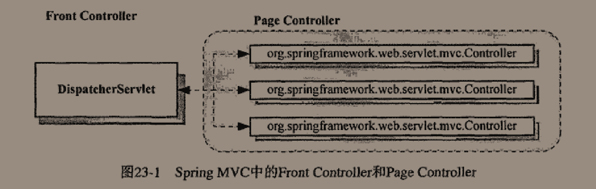

# Spring揭秘


了解如何使用Spring框架所提供的各种解决方案固然重要，但从Spring框架中汲取更多的营养才是我们应该进一步关注的。


技术是发展的，但思想却是延续的，当我们借助Spring之船飞渡波澜不惊的水面异或是闯入惊涛骇浪之后，不要忘记，或许某天我们会踏上另一条更好的船，但Spring之船带给我们的那些理念和思想，却始终陪伴着我们

> 不得不感慨作者的超前思想，从J2EE的泥沼中走出，感受过强大技术的落幕，重新投入到Spring框架当中来，也并没有盲目的崇信Spring，仅仅只是支持着它的思想。
>
> 而且作者写这本书的时候国内仍然有很多人选择使用J2EE平台推出的EJB，作者拥有这种超前的意识和技术并没有盲目的自信，不得不让人肃然起敬


## 第一部分、掀起Spring的头盖来


### 第一章、Spring框架的由来


Spring是于2003年兴起的一个轻量级的Java开发框架，而不是过去时代EJB重量级的企业开发


EJB架构在分布式上确实有着天然的优势（默认支持分布式架构），但是由于被过分吹捧，导致被滥用，且性能低下（往往在大规模的机器上面可以忽略这些性能，但是中小公司往往会受其困扰），于是轻量级的Spring终于有机会诞生了

> Spring并不是要取代EJB，而是给出了EJB之外的另一种J2EE平台的一种解决方案而已。还是存在着某些情况J2EE更加适用的

往往刚开始都不会有分布式的要求，Spring所倡导的基于POJO（Plain Old Java Object，简单Java对象）的轻量级开发理念更加贴近于现实，再说Spring到后期的Cloud的项目也对分布式有了良好的支持，可以配合着SpringBoot轻易的进行业务拓展，当然这都是后话了


Spring框架的整体架构：


可能其中的一些技术已经被取代了，但是大体上依然还是这样的，作者的Spring的版本2.x


也就是本书的行文思路了


核心模块：Core，提供了IOC容器实现，帮助我们以依赖注入的方式管理对象之间的依赖关系，还有各种工具类，比如Spring的基础IO工具类等等。

左上遍历，AOP模块：提供一个轻量但功能强大的AOP框架，让我们可以以AOP的方式增强各POJO的能力，可以与IOC容器很好的结合，发挥强大的威力。

再往上，在IOC和AOP的基础上提供了完备的数据访问和事务管理的抽象和集成服务：对JDBC的最佳实践Spring JDBC极大地简化了该API的使用（感觉最佳实践这个词用得有点多，例如J2EE的最佳实践——EJB，理解成产品的意思吧），另外也为业内流行的ORM框架提供了形式统一的集成支持。Spring框架中的事务管理抽象层是Spring AOP的最佳实践，对编程式事务和声明式事务都有完备的支持。

Spring对Java EE服务（JNDI，JMS以及JavaMail等）的支持，使其不再杂乱无章，可以轻松地使用。

最后是Web模块，Spring提供了一套自己的WebMVC框架Spring MVC，但也对其他Web框架例如Struts，WebWork以及JSF等，在Spring的Web框架都有为他们提供集成支持。


上层的模块需要依赖于下层的模块才能正常工作，模块之间的依赖性

同层级的模块之间是相互独立的，模块之间的独立性

> 不要只将Spring看做是一个IOC容器，也不要只将Spring与AOP挂钩
>
> 它不仅仅是一个简化J2EE开发的轻量级框架，也应该是一个简化任何Java应用的开发框架


## 第二部分、Spring的IoC容器


### 第二章、IoC的基本概念


IoC的全称是：Inversion of Control，中文常翻译为“控制反转”，还有一个别名叫做依赖注入DI（Dependency Injection）


通常类中有其他的对象（称为依赖类），往往会需要一个构造函数来对这些成员变量赋值。往往都需要我们自己去手动获取依赖的对象。

而IoC就是为了我们直接将对象送到我们面前来，不需要我们自己去处理依赖的关系。就好像置办一间屋子，以前都是什么都需要自己去购买（new对象，类似于自己管理依赖），现在可以直接送货上门（依赖于IoC容器的自动注入）。

> 其实IoC就这么简单，原来是需要什么东西自己去拿，现在是需要什么东西就让别人送过来


在IoC模式中，被注入对象又是通过哪些方式来通知IoC Service Provider来为其提供服务的呢？

三种依赖注入方式：

- 构造方法注入

```java
Class A{
    private B b;
    private C c;
    public A(B b,C c) {
        this.b = b;
        this.c = c;
    }
}
```

使用这种方法，被注入的对象的构造乃至其整个生命周期，应该是由IoC Service Provider来管理的


- Setter方法注入

当前对象只需要为其依赖对象的对应属性添加Setter方法，就可以通过setter方法将对应的属性设置到被注入对象当中

```java
Class A{
    private B b;
    private C c;
    public setB(B b) {
        this.b = b;
    }
    public setC(C c) {
        this.c = c;
    }
}
```

并不会在完成对象的构造后就可以使用了，而是需要后置


- 接口注入

不是非常的简单明了，被注入对象如果想要IoC自动注入就必须实现某个接口，IoC最终通过这些接口来了解应该为被注入对象注入什么依赖对象，接口不是固定的，需要自己声明，甚至接口名字和方法名字都不是固定的，只要保证接口的唯一方法是一个() -> Void的即可

接口注入相对于前两种相对死板和繁琐。


> ~~现在常用的基于Annotation的依赖注入是Spring 3.0的新特性，在以前版本的Spring当中无法实现~~      误人子弟，是存在以注解方式进行注入的


比较：

- 构造方法注入：
  - 优点：对象在构造完成之后就进入就绪状态，可以马上使用
  - 缺点：构造方法的参数会比较长，并且在Java中构造函数无法被继承，无法设置默认值。对于非必须的依赖管理，可能需要引入多个构造方法
- Setter注入：
  - 对象可以继承，可以设置默认值
  - 对象在构造完成后无法立马进入继续状态

- 接口注入不提倡，带有侵入性的代码

简单的模拟：

```java
@Component
public class A {
    private B b;

    /**
     * 构造器注入
     */
    public A(B b) {
        this.b = b;
    }

    /**
     * Setter注入
     */
    @Autowired
    public void setB(B b) {
        this.b = b;
    }
}
```

现在当然没必要这么干了（除了static字段还是得这么做），可以直接使用Autowired注解直接提供属性注入，因为以前都是XML的配置时代，容器中会有很多bean，这么做还是有必要的（但是这里的setter方法还是有依赖于Autowired注解的，不知道以前是怎么解决的【找到解决办法了，是通过XML来指定对象之间的依赖关系来解决的，bean里面的property属性】）

去掉上面的所有注解，加入如下xml文件，并使用ImportResource注解读取配置文件即可

> 书上好像直接讲的意思是将代码的抽象程度提高，和IOC的观点好像没啥联系，有点迷幻
>
> 估计是这一章讲解IoC的思想吧，还完全没使用到容器这一层面来，后面讲BeanFactory的时候讲到了注解方式的依赖绑定方式


SpringBoot1.0版本对应着Spring的4.0.3。所以那时候自动配置这些功能完全没有，都需要人工手动编辑配置文件。


### 第三章、掌管大局的IoC Service Provider


IoC Service Provider提供的职责就是：将这些相互依赖的对象绑定到一起

IoC Service Provider是一个抽象出来的概念，可以是任何一种将业务对象绑定到一起的一种实现方式，可以是各种IoC框架或者容器，例如最简单的`Object obj = new Object()`也可以算是一个。但是单单只有这种绑定代码也会是一种非常糟糕的体验。

Spring的IoC容器就是提供依赖注入服务的IoC Service Provider


主要职责：

- 业务对象的构建管理：IoC Service Provider将需要的对象的构造逻辑从客户端对象中玻璃出来，以免这部分污染业务逻辑对象的实现
- 业务对象间的依赖绑定：最艰难也是最重要的，识别各个业务对象之间的依赖关系，将这些依赖关系的对象进行绑定


IoC Service Provider记录对象之间依赖信息的方式主要有以下几种：

- 直接编码方式

大部分IoC容器都是支持以编码方式来操作容器的比如PicoContainer、Spring、Avalon等

书上一个例子：

```java
IoContainer container = ...;
container.register(FXNewsProvider.class,new FXNewsProvider());
container.register(IFXNewsListener.class,new DowJonesNewsListener());
...
FXNewsProvider newsProvider = (FXNewsProvider)container.get(FXNewsProvider.class);
newProvider.getAndPersistNews();
```

这种通过编程的方式让IoC Services Provider得以知晓对象间的依赖关系，是管理依赖关系的最基本方式


- 配置文件方式

普通文本文件，properties文件，XML文件等等都可以成为管理依赖关系的载体

最为常见的还是XML格式，使用ImportResources注解引入，一般都是直接标注在主类上，SpringBoot用得少了，都是推荐使用JavaConfig类


- 元数据方式

代表就是Google Guiee，在Java5注解基础上开发的一套IoC框架

正是我们现在常用的这一套，原来Spring是从这儿偷的

直接在类中使用注解来标注各个对象之间的依赖关系，然后Guiee框架根据这些注解的信息将这些对象进行组装

真的，要多像有多像，只不过注解名字不是autowired而是Inject，更体现出是注入的意思


### 第四章、Spring的IoC容器之BeanFactory


上面提到的IoC Services Provider都是泛指，这里来看下Spring的IoC。

Spring的IoC容器是一个提供IoC支持的轻量级容器，不要只是想着IoC Services Provider的作用，那只是IoC组成的一个部分，他本身还是一个轻量级容器用于对象的存储支持。

当然，Spring的IoC有它独到的优势，并不是他比别家的IoC容器做得好，甚至还没有Google的Guiee做得好，但是奈何他提供的对其自家容器之上的集成，即我们在第一章看到的树状知识图，后面发展起来的技术栈成功奠定了Spring IoC的地位。


后面的这些技术栈都直接集成在了Spring IoC容器当中，因为都是要依赖于IoC容器的


Spring默认提供两种容器类型（都是接口）：

- BeanFactory

基础类型IoC容器，提供完整的IoC服务支持，默认采用延迟初始化策略。只有当客户端对象需要访问容器中某个受到管理对象时候才会对该对象进行初始化以及依赖注入操作。

特点：启动快，所需资源少，功能也相对较少

- ApplicationContext

在BeanFactory基础之上构建的，相对高级的容器实现，基本继承了BeanFactory的所有特性（也有小部分作了修改），还额外提供了一些高级特性如：事件发布，国际化支持等等。ApplicationContext所管理的对象默认是启动之后全部初始化并绑定完成的

特点：要求更多资源，容器启动时间较长，功能强大


> 在Spring Boot 2.3.1当中使用的是ApplicationContext，可以尝试着在构造函数中输出一行，会发现在容器启动时候就输出了


玩转Spring全家桶里的：


还讲述了不同的ApplicationContext之间对象的AOP关系


BeanFactory可以完成IoC Services Provider的所有职责，包括对象的创建和对象依赖关系的绑定（也就是这两个最主要了）。Spring认为一切都是POJO对象，可以把每个对象看做一个JavaBean对象，BeanFactory就是生产这些Bean的工厂，并完成对对象的组装，返回给我们一个可用的JavaBean对象

可以看下提供的几个方法，重载的就不算了

getBean方法：取得某个被Factory加工好的对象

getBeanProvider方法：获取某个指定bean的提供者

containsBean方法：是否存在于容器中

isPrototype方法：会访问父工厂并且保证查询的name是单例的

还有几个就是关于Type的检查了。基本上都是查询，获取Bean的方法


感觉说白了IoC Services Provider很像是一个拥有一些特殊功能的Map


BeanFactory对IoC Service Provider的完美支持，试下管理绑定信息的三种方式：

- 直接编码方式

还是比较好玩儿的，具体测试代码如下：

两个注入类型：

```java
public class A {
    private B b;

    /**
     * 构造函数注入
     */
    public A(B b) {
        this.b = b;
    }

    /**
     * 提供无参构造，如果不提供的话
     * 使用setter注入会报错找不到init
     */
    public A() {
    }

    /**
     * Setter注入
     */
    public void setB(B b) {
        this.b = b;
    }

    public void sayHello() {
        System.out.println("A hello");
        b.sayHello();
    }
}
```

```java
public class B {

    public void sayHello() {
        System.out.println("B hello");
    }
}
```

主函数：

```java
/**
     * 尝试以编码方式使用BeanFactory
     */
public void testCoding() {
    DefaultListableBeanFactory container = new DefaultListableBeanFactory();
    //向IOC中注入的是BeanDefinition而不是Bean，并绑定依赖关系
    RootBeanDefinition aDefinition = new RootBeanDefinition(A.class);
    RootBeanDefinition bDefinition = new RootBeanDefinition(B.class);

    //1、可以通过构造函数指定依赖关系
    ConstructorArgumentValues argValues = new ConstructorArgumentValues();
    argValues.addIndexedArgumentValue(0,bDefinition);
    aDefinition.setConstructorArgumentValues(argValues);

    //2、或者通过setter方式注入
    MutablePropertyValues propertyValues = new MutablePropertyValues();
    //这里要指定成字段名字
    propertyValues.addPropertyValue(new PropertyValue("b",bDefinition));
    aDefinition.setPropertyValues(propertyValues);

    //将BeanDefinition注册到Container中去
    container.registerBeanDefinition("aDefinition",aDefinition);
    container.registerBeanDefinition("bDefinition",bDefinition);

    //获取A并测试
    A a = container.getBean(A.class);
    a.sayHello();
}
```


这里使用的DefaultListableBeanFactory是BeanFactory的一个实现类，还实现了BeanDefinitionRegistry接口，这个BeanDefinitionRegister才是在BeanFactory的实现中担当Bean注册管理的角色。

BeanFactory只定义了如何访问容器内Bean的方法，各个Bean之间的具体实现类负责具体Bean的注册以及管理工作，BeanDefinitionRegistry接口只抽象了Bean的注册逻辑，主要负责对BeanDefinition的操作

打个比方：BeanFactory类似于图书馆，BeanDefinitionRegistry就好似图书馆的书架

每个受管理的对象，容器中都会有一个受管理的BeanDefinition实例保存对象的必要信息。例如：对象的class类型，构造方法参数及其他属性等等，当我们从BeanFactory中发送请求的时候Factory就会从BeanDefinition中抽取有用的信息来返回一个完备可用的对象实例。

BeanDefinition的实例化对象：RootBeanDefinition


- 外部配置文件

主要也就是XML配置文件，前面已经尝试过了，展示代码：

```xml
<bean class="cn.luckycurve.dependencyinjection.A">
    <property name="b" ref="b"/>
</bean>
<bean id="b" class="cn.luckycurve.dependencyinjection.B">
</bean>
```

这里可以new一个ClassPathXmlApplicationContext来新建一个container（这里也可以直接使用BeanFactory接口的实现类来实现ReadXMLFile），这里没有，直接使用@ImportResource注解将XML文件注册到了当前容器当中，并进行了以下测试：

```java
@Autowired
ApplicationContext container;

@Override
public void run(ApplicationArguments args) throws InterruptedException {
    A a = container.getBean(A.class);
    a.sayHello();
}
```

是在没想明白怎么注入ApplicationContext了，就直接使用Autowired注解进行验证了

成功~


- 注解方式

终于回归到现代化了

使用@ComponentScan来指定扫描的范围，之所以在SpringBoot中不用使用是因为@SpringBootApplication是包含了该注解的，默认扫描当前路径及所有的子路径


Google Guiee是完全基于注解实现的，轻量级依赖注入框架，后来SpringBoot就学去了呗


> 终于明白书上为啥一直使用ApplicationContext或者BeanFactory去创建容器了，因为 Spring项目不会自动的帮你开启一个容器，而SpringBoot会，所以可以不用完成IoC容器的创建工作了


XML格式标签详解：以前是Spring提供的最为强大的，支持最为全面的配置方式，到如今的SpringBoot项目当中来，完全不提倡使用配置文件的方式，更加提倡使用配置类的方式

看下几个标签把，毕竟都是过往的一段历史：

bean：注册到容器的业务对象，包含属性字段：id，class

构造方法注入的XML方式：


类似于以上的格式


Setter 注入的XML方式：


类似于以上的格式


bean字段里面提供了autowire字段用于自动绑定 ，当然现在用的很少了


scope字段：用于声明容器中的对象所应该处的限定场景或者说该对象的存活时间

在现在使用@Bean注解中都没有这个属性了，只存在以下这些属性：

```java
String[] value() default {};
@AliasFor("value")
String[] name() default {};
boolean autowireCandidate() default true;
String initMethod() default "";
String destroyMethod() default "(inferred)";
```

好像还没有限定对象生命周期的属性


官方文档逛了一圈也没有找到，好像对象的生命周期管理在SpringBoot中对用户透明了

但是在Spring的官方文档中有对这段的详细描述，一共提供了五个Scope

- singleton：单例，在IoC容器中只存在一个对象，该对象在第一次被请求而初始化后（这里仅针对BeanFactory，ApplicationContext不会进行懒加载而是直接完成初始化了）将一直存活到容器退出，与IoC容器基本有相同的寿命。

不要与单例模式混淆了，这里只是保证在同一个容器中只存在一个共享实例，而单例模式保证的是在同一个ClassLoader中只存在一个这种类型的实例


- prototype：容器在收到获取对象的请求的时候，会重新生成一个新的对象实例给请求方，并当对象返回之后，容器就不再拥有当前对象的引用，即后续的生命周期的管理工作需要用户自己进行。


后面三个都要基于Web ApplicationCOntext环境

- request：给每个request都创建一份对象实例，并当请求结束后，这些对象的生命周期也随之结束
- session：与request极其类似，只是为每个session创建一份对象实例而已
- global session：只有应用在基于portlet的Web应用程序中才有意义，在普遍的基于Servlet的Web应用中使用就相当于是使用了session


以前将接口和实现类解耦的方式就是通过工厂方法来实现的，工厂方法可以屏蔽实现类，只需要我们操作接口中的方法即可达到对应的目的

Spring IoC对工厂类也提供了支持，可以通过XML方式直接指定工厂方法并将工厂方法的返回值直接放进IoC容器当中


FactoryBean：不要与BeanFactory搞混淆了。其主语是Bean，定语是Factory，本身也只是一个bean，不过这个bean本身就是创建对象的工厂

该接口主要是为了避免因为XML配置类编写的注册bean的逻辑太过复杂导致的，例如有太多的参数，往往还不如直接使用Java类来书写，实现该接口即可实现将一个bean添加到IoC容器当中来的逻辑，只不过是通过编码的方式，摘要方法如下：

```java
public interface FactoryBean<T> {
	@Nullable
	T getObject() throws Exception;
	@Nullable
	Class<?> getObjectType();
	default boolean isSingleton() {
		return true;
	}
}
```

通过编码的方式将bean加入到IoC容器中来，不过在SpringBoot环境下就毫无用武之地了，因为其依赖注解，完全可以实现依赖注解注入或者是构造函数注入或者是setter注入（配上Autowired注解）。


BeanFactoryAware接口：容器在实例化实现了该接口的bean定义的过程中，会将容器自身注入进该bean中，于是该bean对象就可以获得一个BeanFactory的实例对象，于是就可以在获取bean的时候偷梁换柱了（**其实感觉也没啥用，提供了一种获取当前容器的方法吧，用起来还是可以的**）。

例如：获取C的实例化对象，可以在A中这样做：

```java
public class A implements BeanFactoryAware {

    private BeanFactory beanFactory;

    @Override
    public void setBeanFactory(BeanFactory beanFactory) throws BeansException {
        this.beanFactory = beanFactory;
    }
    
    public C getC() {
        return beanFactory.getBean("c",C.class);
    }
}
```

这样看起来好像是有点蠢，哈哈，基于注解的DI太方便了，如果真要获取当前容器Autowired一个ApplicationContext即可，使用BeanFactoryAware更像是在没有注解的情况下使用

> 到后面可以看到会有一系列的类似于这种接口去实现，感觉在SpringBoot中就不是很有必要了


这里其实就蕴涵着AOP的思想了，操作BeanFactory使用方法的实现类来替换掉原来的对象，对其中的一些方法进行增强，在当用户使用的时候自然就可以享受到增强后的代码，并且完全没有任何代码的侵入。

> 当然这里只是演示替换的逻辑，真正还是不要这么做了，安全性啥的都没有保证


容器背后的秘密：


IoC的大体功能实现可以分为两个阶段：


1、容器启动阶段


加载配置文件，如果不是Java语言编写的配置文件，需要借助BeanDefinitionReader工具来进行解析，将其组织为BeanDefinition，注册到相应的BeanDefinitionRegistry

该阶段可以被认为是准备性的，侧重点是对象管理信息的收集和验证。


2、Bean实例化阶段


BeanFactory默认延迟Bean实例化，ApplicationContext就地实例化

这里以BeanFactory为例子，ApplicationContext在下一章会进行讨论

先会查看所请求的对象在之前是否已经被初始化，如果初始化了就可以直接返回了（默认Bean是Singleton的），如果没有进行初始化，就会根据当前的BeanDefinition信息实例化被请求对象，并为其进行依赖注入。

第二阶段就好似与使用第一阶段提供的图纸来生产出具体的产品


Spring提供了BeanFactoryPostProcessor接口的容器拓展机制，允许我们在容器实例化相应的对象之前，对注册到容器中的BeanDefinition进行修改，修改的时间为第一阶段的最后

大多时候我们不会直接和BeanFactoryPostProcessor接口打交道，而是两个实现类：

- PropertyPlaceholderConfigurer：已经不建议使用了，被：Environment和PropertySource所取代

主要就是为了将数据库的账号密码抽取到一个单独的properties配置文件当中，再使用占位符的方式在XML配置文件中对值进行引用。PropertyPlaceholderConfigurer就是起到解析占位符的作用`${}`，不过随着时代的更替，被取代了

- PropertyOverrideConfigurer这个倒还是没有废弃

感觉功能和上面那个差不多，也是通过占位符来标明bean定义中的Property与properties文件中的各项配置之间的关系。

例如在XML中bean的配置的DataSource中的maxActive为200，我觉得太小了，想换成500。可以不用更改源代码，直接通过PropertyOverrideConfigurer指定的properties文件来修改即可，对bean是透明的（感觉这也就是日后SpringBoot约定大于配置中自定义配置的修改源码了）。

具体需要的properties配置文件的文件格式为：beanName.PropertyName = value

这不就是@PropertySource注解的底层实现嘛，添加一个properties文件到IoC中来。

更可怕的是上面一项就是被PropertySource所取代的。

果然，Spring还是逐渐抛弃了XML格式，宁愿选用properties格式


还有一个附加的BeanFactoryPostProcessor实现类CustomEditorConfigurer

与上面两个不同的是，这个附加的实现类并不会去单独更改已经注册到容器中的BeanDefinition，而是只会辅助性地添加BeanDefinition到IoC容器当中去


在BeanFactory中使用BeanFactoryPostProcessor还需要自己进行配置，而使用ApplicationContext可以直接将BeanFactoryPostProcessor注册到IoC容器中，即可自动生效


Spring是如何解析XML，properties等一系列的的媒介文件的呢？因为里面存储的都是String类型，所以需要一个类来完成由字符串到具体对象的类型转换，这个类就是PropertyEditor接口的一系列实现，PropertyEditor是Java.beans包下的，从而继承了原生类型和类似于Color和Font等类型的类型转换，当然Spring也对其进行了扩充。如果有时候没有提供PropertyEditor，或者需要转换成为的对象时我们自定义的，就需要我们自定义PropertyEditor来完成String到对象之间的转换。


一般都是直接使用PropertyEditor的子类PropertyEditorSupport来简化实现，这时候如果我需要实现yyyy/MM/dd的日期转换支持，我还可以实现更具体的

试了半天也没有成功，都试到Convertor加上@ConfigurationPropertiesBinding注解去了，还是没有解决，结果最后是这样解决的

配置文件：

```properties
date.info=2000-09-01
```

Java类：

```java
@Configuration
@ConfigurationProperties(value = "date")
public class Config {
    @DateTimeFormat(pattern = "yyyy-MM-dd")
    private LocalDate info;
    //getter & setter
}
```


了解完容器启动阶段后，开始了解bean实例化阶段，开启bean的一生

BeanFactory的getBean方法的隐式调度的两种情况：

- 初始化A对象，对A对象调用getBean方法时，会先实例化A所依赖的B对象，当A所有依赖的对象都被隐式的创建完成之后才会创建A对象
- ApplicationContext启动时候的就地初始化，就是隐式调用的最好佐证


当getBean方法发现该beanDefinition之前还没有被实例化之后，会通过createBean方法来进行具体的对象实例化，完整的实例化过程：


getBean的具体实现可以查看抽象类AbstractBeanFactory

createBean的具体实现可以查看抽象类AbstractAutowireCapableBeanFactory

直接看BeanFactory的实现类DefaultListableBeanFactory会有点绕


Spring为其管理的对象赋予了统一的生命周期管理，让对象拍拖了“new完之后被使用，脱离作用域后被回收”的命运，当然最后的对象回收还是依赖于JVM的垃圾收集机制的，Spring只是不会让对象过早的被回收，避免了对象的重复创建和繁琐的对象传递过程。


Bean的一生：

1、Bean的实例化与BeanWrapper

Spring IoC内部采用策略模式（Strategy Pattern）的方式来初始化bean，具体有两套解决方案：反射和CGLIB字节码动态代理生成bean实例或动态生成其子类


实例化策略的抽象接口是InstantiationStrategy，具体的两个实现（也只有这两个实现）：

- SimpleInstantiationStrategy：通过反射机制来创建对象，但不支持方法注入方式的实例化对象（只能创建原有对象，不能默认支持创建其匿名实现类）
- CglibSubclassingInstantiationStrategy：继承SimpleInstantiationStrategy以及其以反射创建实例化对象的功能，并融入CGLIB的动态字节码生成功能，可以动态的生成某个类的子类，容器默认情况下采用这种

容器通过BeanDefinition传入进CglibSubclassingInstantiationStrategy中，根据传入信息完成实例化工作，但不是直接返回构造完成的对象，而是用BeanWrapper对构造好的对象进行一个封装

第一阶段结束

Spring之所以使用BeanWrapper对创建完成对象进行包裹，是因为只完成第一阶段后，对象还没有完成赋值操作，还需要进行第二阶段：设置对象属性

BeanWrapper定义直接继承了PropertyEditorRegistry和TypeConverter接口，同时也将前面说的PropertyEditor传递给BeanWrapperImpl实现类，可以直接完成对XML配置属性的解析

主要是因为BeanWrapper可以很方便的完成对象属性的赋值而不用去直接使用繁琐的Java反射API，省去了大量的代码空间


2、各色的Aware接口

当对象完成实例化并且相关的属性以及依赖都完成了设置之后，就会检查是否实现了一系列的Aware接口，如果是，则将这些Aware接口定义中的规定的依赖注入进当前对象实例

详细Aware接口：

- BeanNameAware：将beanName设置到当前实例当中

```java
void setBeanName(String name);
```

- BeanClassLoaderAware：将加载当前Bean的ClassLoader注入到当前对象实例当中

```java
void setBeanClassLoader(ClassLoader classLoader);
```

- BeanFactoryAware：让当前对象具有一个BeanFactory的实例

```java
void setBeanFactory(BeanFactory beanFactory) throws BeansException;
```


上面都是BeanFactory需要扫描的Aware，最后几个是ApplicationContext独有的，都是基于BeanPostProcessor（~~在最后一个阶段修改BeanDefinition的方式~~，不是的，这里都完全进入了对象实例化阶段，很显然修改BeanDefinition没有用了，那个接口是BeanFactoryPostProcessor）

- ResourceLoaderAware：ApplicationContext实现了ResourceLoader接口，让实例对象拥有其所在的ApplicationContext容器的一个引用

```java
void setResourceLoader(ResourceLoader var1);
```

- ApplicationEventPublisherAware：ApplicationContext实现了ApplicationEventPublisher接口，和上面的一样，也是将ApplicationContext注入到当前实例化对象中去

```java
void setApplicationEventPublisher(ApplicationEventPublisher var1);
```

- MessageSourceAware：ApplicationContext实现了MessageSource接口支持国际化（i18n）支持，将自身注入进实例化对象当中去

```java
void setMessageSource(MessageSource var1);
```

- ApplicationContextAware：将自身注入到实例化对象当中去


3、BeanPostProcessor

非常容易和BeanFactoryPostProcessor概念混淆了，只需要记得BeanFactoryPostProcessor是存在于容器启动阶段最后修改BeanDefinition的，BeanPostProcessor是存在于创建对象实例化阶段的。

其实这两个接口非常类似，BeanFactoryPostProcessor会处理符合条件的BeanDefinition，BeanPostProcessor会处理容器内所有符合条件的实例化后的实例对象

接口摘要：

```java
public interface BeanPostProcessor {
	@Nullable
	default Object postProcessBeforeInitialization(Object bean, String beanName) throws BeansException {
		return bean;
	}
	@Nullable
	default Object postProcessAfterInitialization(Object bean, String beanName) throws BeansException {
		return bean;
	}

}
```


具体执行：


前置处理和后置处理，传入实例化对象，经过我们处理之后传出，逻辑非常清楚明白


实际上前面已经提到过ApplicationContext那几个Aware是依赖于BeanPostProcessor来实现的，就是通过在前置处理中默认处理相对应的Aware所对应的语义


在这里还可以轻松实现替换当前对象实例或者字节码增强当前对象实例等等，AOP的绝佳位置，Spring AOP也大量的使用BeanPostProcessor作为对象生成相应的代理对象。


小实践：自定义一个BeanPostProcessor实现AOP功能：

代码逻辑：

```java
public class A {
    @autowired
    private B b;
    
    public void sayhello() {
        System.out.println("A hello");
        b.sayHello();
    }
}

public class B {
    public void sayHello() {
        System.out.println("B hello");
    }
}
```

替换A中的sayHello方法的代码：

```java
@Component
public class MyBeanPostProcessor implements BeanPostProcessor {

    @Override
    public Object postProcessBeforeInitialization(Object bean, String beanName) throws BeansException {
        if (bean instanceof A) {
            bean = new A(){

                @Override
                public void sayHello() {
                    System.out.println("A hello power by AOP");
                    //super.sayHello();
                }
            };
        }
        return bean;
    }

    @Override
    public Object postProcessAfterInitialization(Object bean, String beanName) throws BeansException {
        return bean;
    }
}
```

12行的代码无法打开，本来是想实现在方法调用之前增加输出一行的，但是我是直接新建了一个A的匿名内部类来替代A，匿名内部类中的字段B没有被IoC依赖注入，B一直为null，调用会报错。


4、InitializingBean和init-method

InitializingBean接口是容器内部广泛使用的一个对象生命周期标识接口

在对象实例化过程BeanPostProcessor前置处理之后会进行bean判断是否实现了InitializingBean接口，如果实现了接口，会直接调用接口里的afterPropertiesSet方法对对象进行进一步的调整

```java
public interface InitializingBean {
	void afterPropertiesSet() throws Exception;
}
```

这种方法会带来代码的侵入性，会给bean带来冗余的代码，因此可以在XML配置文件中使用init-method来指定 这一init方法

一般很少使用到，在构造函数里面指定初始化操作感觉就足够了


5、DisposableBean与destory-method

根据图片4-10可以看出，这一步已经到了对象使用完毕后，准备销毁的阶段了，和第四块的init操作基本上是一样的。在销毁时候会检查是否实现DisposableBean接口或者是XML中的destory-method属性

这个方法的执行是在对象不再使用的时候，这时候往往也是容器即将关闭的时候（因为即使现在对象没有使用了，但不代表等下没有别的函数会来请求该对象，所以一般都是不能销毁注册进去的bean的）

ApplicationContext可以保证在JVM关闭之前可以完成容器中所有bean的destory方法的调用和整个容器的关闭。而BeanFactory则无法保证，往往bean的destory都是形同虚设


至此，Bean走完它光荣的一生


小结：

Spring IoC的两种主要容器：BeanFactory和ApplicationContext。本章开头讲述两者的总体介绍，然后着重讲解BeanFactory

最后我们不满足于只知道BeanFactory，对BeanFactory的背后原理进行了探索（同样适用于ApplicationContext，不适用的地方已经指出来了）

主要讲解了：BeanFactory对象注册（3种）和依赖绑定（两种）的几种方式、

BeanFactory的XML标签、

IoC的功能实现：容器启动和Bean实例化（即Bean的生命周期，大体上分为5个阶段）


###  第五章、Spring IoC容器ApplicationContext


拓展了BeanFactory，拥有BeanFactory的全部功能

ApplicationContext的实现（与Spring全家桶里的差不多）：

- FileSystemXMLApplicationContext
- ClassPathXMLApplicationContext
- XMLWebApplicationContext（已经找不到了，估计被剔除了）
- AnnotationConfigApplicationContext

都是将BeanDefinition加载到ApplicationContext中


本章主要围绕ApplicationContext的一些特性来展开（较之于BeanFactory）：国际化i18n、统一资源加载策略、容器内事件发布等

这些附加功能全部都是对JavaSE的扩展，使我们可以更轻易的摆脱JDK类库的设计缺陷，但是好像没有太多的新理念了，不如BeanFactory里面的惊艳


- 统一资源加载策略

之所以出现这一项特性，还得从需求了解

URL（统一资源定位符）是Java SE提供的标准类，但多少有些名副其实了。基本上只限于网络形式发布的资源的查找和定位工作，使用起来不够方便（和Java的Date类差不多，只不过在Java8中Oracle对其进行了调整，整合了joda-time，这里是Spring自己对资源的加载策略的重新定义）


Spring提出一套基于Resource和ResourceLoader接口的资源抽象和加载策略


- Resource接口

Spring使用此接口作为所有资源的抽象和访问接口，根据不同类型的资源，提供了不同的实现：

- ByteArrayResource：对字节数组提供的数据作为一种资源进行封装，可以构造特定的ByteArrayInputStream访问该资源
- ClassPathResource：从Java应用程序的CLassPath中加载具体资源并进行封装，可以使用指定的ClassLoader对资源进行加载
- FileSystemResource：对File类型进行封装，以文件或者URL的方式对资源进行访问
- UrlResource：URL的实现类，内部委托URL进行具体的资源操作
- InputStreamResource：使用较少，将InputStream视为资源的Resource实现类，一般可以通过ByteArrayResource或者其他Resource代替

有好些类都是直接在上面加上Context的，那些是他们的子类


也可以自己去实现抽象类AbstractResource来实现Resource，但估计不会用到了，Spring提供的Resource已经足够强大


- ResourceLoader接口

职责在于：查找和定位这些资源。该接口是资源查找定位策略的统一抽象。可以看做是更广义的URL

接口内部也十分简洁：

```java
public interface ResourceLoader {
	//CLASSPATH_URL_PREFIX = "classpath:";
	String CLASSPATH_URL_PREFIX = ResourceUtils.CLASSPATH_URL_PREFIX;
	//核心方法
	Resource getResource(String location);

	@Nullable
	ClassLoader getClassLoader();

}
```


默认提供的ResourceLoader实现类

- DefaultResourceLoader

内部的getResource方法也非常的简单：

```java
@Override
public Resource getResource(String location) {
    Assert.notNull(location, "Location must not be null");
    //使用内置的协议解析器先尝试对location进行解析
    for (ProtocolResolver protocolResolver : getProtocolResolvers()) {
        Resource resource = protocolResolver.resolve(location, this);
        if (resource != null) {
            return resource;
        }
    }

    if (location.startsWith("/")) {
        //内部直接尝试构建ClassPathContextResource，文末
        return getResourceByPath(location);
    }
    else if (location.startsWith(CLASSPATH_URL_PREFIX)) {
        //直接构建ClassPathResource
        return new ClassPathResource(location.substring(CLASSPATH_URL_PREFIX.length()), getClassLoader());
    }
    else {
        try {
            // Try to parse the location as a URL...
            URL url = new URL(location);
            return (ResourceUtils.isFileURL(url) ? new FileUrlResource(url) : new UrlResource(url));
        }
        catch (MalformedURLException ex) {
            // No URL -> resolve as resource path.
            return getResourceByPath(location);
        }
    }
}

//两次出现了
protected Resource getResourceByPath(String path) {
    return new ClassPathContextResource(path, getClassLoader());
}
```


可以尝试在项目中使用类似于24行的代码，非常的高效与简洁


可以发现上面的getResource方法永远都会返回一个非null的对象，即使是抛出异常了，也会调用getResourceByPath方法构建一个ClassPathContextResource对象返回，有可能该资源不存在

处理的其实不是很恰当


- FileSystemResourceLoader

拓展了DefaultResourceLoader，主要是重写了getResourceByPath方法，让他不会无脑的返回一个ClassPathContextResource对象，逻辑如下：

```java
protected Resource getResourceByPath(String path) {
    if (path.startsWith("/")) {
        path = path.substring(1);
    }
    return new FileSystemContextResource(path);
}
```

这样碰到文件类型就可以直接返回一个FileSystemContextResource对象而不是笼统的ClassPathContextResource对象

实际体验并没有什么差别，反正都是直接返回Resource对象

简单使用：

```java
@Test
void resourceGet() {
    FileSystemResourceLoader loader = new FileSystemResourceLoader();
    Resource resource = loader.getResource("E:\\Entertainment\\Game\\英雄联盟\\TCLS\\Client.exe");
    assertTrue(resource instanceof FileSystemResource);
    assertTrue(resource.exists());
    System.out.println(resource.getFilename());
}
```


Spring框架也提供了批量查找的ResourceLoader：ResourcePatternResolver接口

是对ResourceLoader接口的扩展。可以根据资源的路径匹配模式匹配到多个Resource实例

定义和ResourceLoader基本如出一辙：

```java
public interface ResourcePatternResolver extends ResourceLoader {
	String CLASSPATH_ALL_URL_PREFIX = "classpath*:";

	Resource[] getResources(String locationPattern) throws IOException;
}
```

引入新的前缀classpath*:

最常用的实现类：PathMatchingResourcePatternResolver，支持基于Ant风格的路径匹配模式（即我们常用的：**/ *.suffer匹配所有以suffer结尾的路径）

内部默认使用DefaultResourceLoader来进行资源查找和定位，出来的资源也都是ClassPathResourceLoader或者更详细一点ClassPathContextResourceLoader的子类

简单使用：

```java
PathMatchingResourcePatternResolver loader = new PathMatchingResourcePatternResolver(new FileSystemResourceLoader());
Resource[] resources = loader.getResources("E:/temp/**");
for (Resource resource : resources) {
    assertTrue(resource instanceof FileSystemResource);
    System.out.println(resource.getFilename());
}
```


现在已知的Spring的统一资源管理配置：


现在再回到本章的主角，ApplicationContext，你会发现他实现了ResourcePatternResolver接口，直接本身就支持对资源的批量定位和查找了

于是就可以直接通过对ApplicationContext的注入来将ApplicationContext当做一个ResourcePatternResolver来使用

但是会存在一个问题：我们在SpringBoot项目中使用Autowired注入的是AnnotationConfigApplicationContext类，只会负责去查询ClassPath路径下的，和ClassPathXmlApplicationContext类一样，不会也无法去查看文件系统的其他位置，如果需要的话估计得使用FileSystemXmlApplicationContext来，试了下是可以的

无论使用哪个ApplicationContext，读取来的结果都是FileSystemResource

ApplicationContext可以自动的将String转换到Resource类型而不用我们自己去实现PropertyEditor来完成，还是没有成功，麻烦


Spring提供了classpath:资源路径协议，类似的还有原来就在的file、http、ftp等

现在只有FileSystemXMLApplicationContext是默认从系统文件中加载了。


讲完统一资源加载策略，下面是：

国际化信息支持（i18n MessageSource）


为不同国家和地区的人提供他们各自的语言文字信息


JavaSE也提供了国际化支持

每个国家和地区在Locale类中都有相对应的简写代码表示可以去查看

例如中国的代码表示为zh_CN，美国的代码表示为en_US

例如美国和英国都属于英文地区，因此可以用Locale.ENGLISH来统一表示

构造方法摘要：


Spring对JavaSE的国际化抽象出接口：MessageSource，摘要如下：

```java
public interface MessageSource {
	@Nullable
	String getMessage(String code, @Nullable Object[] args, @Nullable String defaultMessage, Locale locale);

	String getMessage(String code, @Nullable Object[] args, Locale locale) throws NoSuchMessageException;
    
	String getMessage(MessageSourceResolvable resolvable, Locale locale) throws NoSuchMessageException;

}
```

> 参数解释：
>
> - code：传入的资源条目的键
> - args：信息参数
> - Locale：位置信息
> - defaultMessage：默认值
> - MessageSourceResolvable：封装code参数和args参数


ApplicationContext实现了MessageSource接口。表示其提供国际化支持

默认会委托一个名为messageSource的bean来完成MessageSource应该完成的职责

如果没有配置的话，会由MessageSourceAutoConfiguration自动配置一个DelegatingMessageSource类进来

Spring提供的几个MessageSource实现：

- StaticMessageSource

实现简单，常用于测试

- ResourceBundleMessageSource

最常用

- ReloadableResourceBundleMessageSource

可以定期的刷新properties文件并对其变化做出响应

简单使用Demo：


感觉除了结合前端使用Thymeleaf会使用到国际化之外，如果是REST服务就完全不会处理了，这部分的任务交给前端去处理


最后一个特性：自定义事件发布

也是对Java的事件发布机制的扩展

Java事件发布主要依靠的两个接口为：EventObject和EventListener

可以通过实现EventObject接口来自定义事件类型

实现EventListener来实现对指定事件的监听，并修改两个方法的参数为需要监听的事件

事件从发布源Publisher发布出去，监听者也需要注册在Publisher里面

大体关系如图所示：


Spring对其封装：

将ApplicationListener注册进容器中，当有ApplicationEvent发布到容器当中来的时候，ApplicationListener就会对这些事件进行处理

ApplicationEvent的具体实现

- ContextClosedEvent：在ApplicationContext即将关闭时候触发的事件类型
- ContextRefreshedEvent：在ApplicationContext初始化或者刷新的时候发布的事件类型

没有什么实际的作用，只是起到标识的作用而已


ApplicationListener：用于自定义的事件监听器定义接口


ApplicationContext实现了ApplicationEventPublisher接口，可以担当事件发布者的角色，主要的功能就是注册管理以及事件发布的方法

Spring的ApplicationContext的事件默认是顺序发布的，通过SyncTaskExecutor来进行的，当然，我们也可以提供额外的TaskExecutor的实现类来提高事件发布性能

ApplicationContext的事件发布功能直接委派给ApplicationEventMulticaster来做的


Spring的事件发布机制只能完成简单的通知和处理功能，并不适用与分布式、多进程、多容器之间的事件通知


> Spring之所以提供了大量的Aware接口就是为了我们注入所需要的，例如ApplicationContext，BeanFactory，还有 这里的ApplicationEventPublisher实例


简单实现：

注册一个指定事件的Listener到容器当中去： 

```java
@Bean
ApplicationListener<ContextRefreshedEvent> applicationListener() {
    return event -> System.out.println("收到一个事件：" + event);
}
```

因为ApplicationContext本身也是一个Publisher，直接使用ApplicationContext发布一个ContextRefreshEvent对象。

```java
    @Autowired
    ApplicationContext context;

    @Test
    void contextLoads() {
        //发布一个Event，触发Listener
        context.publishEvent(new ContextRefreshedEvent(context));
    }
```

启动容器时候完成事件的触发


小结

本章讲述ApplicationContext的额外特性：资源统一加载策略、i18n支持、容器内事件发布。都是ApplicationContext独有的一些特性，可以直接使用


### 第六章、Spring IoC容器之扩展篇


Spring2.5提供的基于注解方式的依赖注入，这也是日后的趋势所在了


@Autowired注解可以标注于类的属性上，也是我们最常用的方式

也可以标注于构造器或者setter方法之上，还可以标注于任意名称的方法定义之上，只要该方法定义了需要被注入的参数

自动注入的阶段可以根据Bean实例化的阶段来判断出来


是使用BeanPostProcessor实现的，会检查是否有被@Autowired注解标注的当前对象需要完成依赖注入，且提供了实现类AutowiredAnnotationBeanPostProcessor


当IoC容器中有多个Bean的时候，可以使用@Qualifier注解或者是@Resource注解来指定当前对象需要注入哪一个，也可以直接指定在方法入参之上

我自身建议：使用后者，不知道为啥使用前者总会出现各种各样奇怪的问题，我更宁愿相信JSR250标准的Resource注解，Resource是默认需要ByName的

JSR250还带来的两个注解：@PostConstruct和@PreDestroy

在Bean创建和销毁的时候都会执行，事例代码如下：

```java
@Component
public class LifeCycleBean {

    @PostConstruct
    public void init() {
        System.out.println("LifeCycleBean Init");
    }

    @PreDestroy
    public void destroy() {
        System.out.println("LifeCycleBean Destroy");
    }
}

```

在直接启动主项目，输出日志如下：

```
LifeCycleBean Init
LifeCycleBean Destroy
```

其实本质上就是使用了Spring的InitializingBean和DisposableBean接口

JSR250是需要CommonAnnotationBeanPostProcessor实现类的支持的，~~现在在SpringBoot中自动配置都直接帮我们将需要的BeanPostProcessor装配好了，如果在以前，所有的BeanPostProcessor都需要用户自己去装配，要不然就无法实现了。~~这里不是SpringBoot的功劳，而是ComponentScan注解的功劳

所以现在混合使用这两个系列的注解没有任何问题，依赖都由SpringBoot项目管理好了


避免使用XML繁琐的Bean定义，Spring在2.5的时候就提供了@ComponentScan注解（那时候只能在XML中配置标签`<component-scan>`来指定扫描的包路径）用于扫描当前路径下被@Component注解标注的类，并将这些类加入到容器当中去，非常的简单与实用。

@Component注解根据语义细化成了Controller+Service+Repository

完全省去了使用XML配置的苦恼


小结

对注解支持的引入，Spring对整个框架带来的冲击做了权衡

最终还是选择引入，带来了高效，但是就当时情况而言不可能完全使用基于注解的Spring，因为当时XML还是Spring最为强大的表达方式，许多第三方库的集成都是通过XML方式的，还没有提供基于注解的方式，但是到现在则完全提供了，所以可以很轻易的面向注解编程，也是Spring官方提倡的，摆脱繁琐的XML配置，使用Configuration配置类来代替，虽然XML这一块也是Spring曾经的强项，但是Spring在看到起复杂性之后能果断的舍弃，不得不佩服，成功似乎也就是理所当然的了。


## 第三部分、Spring AOP 框架


### 第七章、一起来看AOP


其实AOP解决的就是编程效率的问题

例如运维人员需要对所有的业务对象的操作在最开始进行安全检查和日志记录，那么则需要在非常多的方法开头加入这两个方法的调用，且随着对象数目的增多，你的系统开发和维护的难度会逐渐增大。也会使得系统显得很乱


在OOP（Object-Oriented Programming，面向对象编程）的基础之上寻找出一种方案来结局上述问题，就是我们说的AOP（Aspect-Oriented Programming，面向切面编程）

AOP引入了Aspect的概念，用来以模块化的形式对系统中的横切关注点进行封装，Aspect之于AOP，就类似于Class之于OOP，AOP仅仅只是对OOP的一种补充，无法脱离OOP单独生活，这就意味着AOP无法适用于面向过程语言


AOP的具体实现语言被称为AOL（Aspect-Oriented Language），如果系统语言为Java，相应的AOL可以为Java，但不一定要是系统语言，例如AspectJ是扩展自Java的一种AOL

系统语言通常称为系统中使用AOL的寄生语言，将AOL组件集成到OOP组件的过程，在AOP中被称之为织入（Weave）过程，织入过程是处于AOP和OOP的开发过程之外的，并且对整个系统是透明的


静态AOP时代，以AspectJ为杰出代表，通过ajc编译器将各个Aspect以Java字节码的形式编译到系统的各个功能模块当中

优点：Java虚拟机可以直接执行字节码，对整个系统不会有任何的负担

缺点：灵活性不够，每次作出修改后都需要重新编译，重新织入到系统中


动态AOP时代，大多还是以Java语言提供的动态特性来实现的，如JBoss AOP，Spring AOP，AspectJ在后来融合了AspectWerkz框架之后也可以支持动态织入的行为，成为了Java界唯一一个同时支持静态和动态AOP特性的AOP实现产品

与静态代理最大的不同就是：会在系统开始运行之后进行织入，而不是在编译阶段 就进行了织入

优点：灵活性非常高，在修改Aspect代码以后可以直接运行，无需再次编译

缺点：对JVM的启动压力增加，造成延迟 ，但随着JVM的优化，这种延迟一般是可接受的


下面是Java平台AOP的一些实现，所有的实现都遵循上面的两条理念


Java平台自身的AOP实现：动态代理

默认会将切面逻辑织入到相应的代理类中，以动态代理类为载体的横切逻辑。

局限性：只针对接口有效，需要抽象出相应的接口才能使用。动态代理期间性能的稍逊一筹

Spring默认情况下采用这种机制实现AOP机能


动态字节码增强：

JVM会运行任何符合规范的class文件，不一定是javac编译出来的class文件，因此ASM和CGLIB等工具库就可以在程序运行期间动态的构建字节码的class文件，就是动态AOP的一种。

实现的逻辑也非常简单：在运行期间通过动态字节码增强技术为这些模块类生成相应的子类，将横切逻辑加入到这些子类当中，让应用程序在执行期间使用的是动态代理生成的子类，即可摆脱 通过接口的方式来增强了。

也存在局限性，局限性来源于Java语言层面的阻碍，final关键字的影响，会使得子类无法重写到所有父类的final方法

Spring AOP在无法采用动态代理进行AOP功能拓展的时候（没有抽象出接口），会使用CGLIB库的动态字节码增强技术来实现AOP的扩展功能


自定义类加载器实现：

通过类加载器的方式来实现AOP，自定义类加载器，读取class文件的时候织入我们声明出的Aspect，然后将修改的文件交给Java虚拟机运行

局限：有些框架会对类加载器进行限制，或许会出现一些问题

目前已经采用类加载器实现AOP的AOL有：JBoss AOP、AspectJ的AspectWerka


AOL扩展：

最复杂，也是最强大的一种方式，代表是AspectJ。

强大的功能在于：静态编译提升运行性能、对AOL有强有力的掌控强度、Java虚拟机压力小

代价：重新学习旧有语言的AOL或者是全新的AOL，非常复杂，作者都在这儿劝退了


AOP的概念：以AspectJ为准，可能在各个框架中的叫法有所不同


- Joinpoint

我们将要在其之上进行织入操作的系统执行点称为Joinpoint

基本上只要允许，程序执行过程中的任何时刻都可以作为横切逻辑的织入点，而所有这些执行时点都是Joinpoint


- Pointcut

Pointcut概念代表的是Joinpoint的表述方式。将横切逻辑织入当前系统的过程中，需要参照Pointcut规定的Joinpoint信息，才可以知道应该往哪些系统的哪些Joinpoint上织入横切逻辑

pointcut就是出现指定这个横切逻辑到织入到哪些Joinpoint中去的一个组件，一般都是直接指定一组Joinpoint

pointcut指定Joinpoint的几种表达方式：

- 直接指定Joinpoint所在的方法名称，功能单一，且只能限于支持方法级别的Joinpoint的AOP框架
- 正则表达式，非常常见，通过正则表达式来指定一系列的Joinpoint，最普遍的Pointcut的方式了
- 特定的pointcut表述语言，强大但复杂，和自定义AOL是一样的


pointcut的运算

通过逻辑运算的方式来得到比较复杂的pointcut，各个AOP的实现都给出了自己的实现，只是表述形式不同罢了


- Advice

Advice代表着会织入到Joinpoint的横切逻辑

如果将Aspect比作OOP的class，那么Advice就相当于OOP的method

advice的分类：

- before advice

在Joinpoint指定位置之前执行的Advice类型，如果当前before advice将被织入到方法执行类型的Joinpoint，那么会在方法执行之前执行

通常只是会做一些如设置系统初始值，获取必要资源的操作，当然做安全检查也是可以，但通常情况会使用另一种advice

- after advice

和上面的before advice对应，具体又可以分为以下三个：

- after returning advice
- after throwing advice
- after finally advice


- around advice

上面两个advice的结合，不过通常情况下会使用更加具体的around

Servlet的Filter就是使用这个advice来实现的，可以在这里完成资源初始化，安全检查之类的事儿


- Introduction

不是根据advice在Joinpoint的执行时机来分的，而是根据他可以完成的功能区分与其他advice

Introduction可以为原有的对象添加新的特征或者行为。


- Aspect

对以上概念封装成的一个AOP概念实体，通常情况包含多个pointcut以及相关的advice定义


Spring2.0集成了AspectJ，可以通过使用`@AspectJ`注解并结合普通的POJO来声明Aspect


完成织入工作的“人”被称为织入器（Weaver）


AspectJ的织入器为专门的编译器，即ajc，Spring AOP使用一组类来完成最终的织入操作，ProxyFactory就是Spring AOP最通用的织入器，一般AOP的实现都提供了自己的织入器


目标对象：复合 pointcut指定条件，被织入的对象，称为目标对象


小结

AOP终究只是一种软件开发模式，是从面向过程到面向对象编程的转换过程中，人们发现面向对象编程的一些缺陷，而AOP正是为了解决这些缺陷而存在的。本章还讲述了AOP的基础组件。


### 第八章、Spring AOP概述及其实现机制


上一章了解了AOP的总体概述，这一章来了解下Spring AOP


通常认为Spring的IOC容器和Spring AOP以及Spring框架对其他JavaEE服务的集成共同组成了Spring框架的质量三角。

Spring AOP以对AOP尽量的支持而不是全部的支持换取了学习曲线的平滑，当然如果Spring AOP无法满足你的需求，也可以直接使用AspectJ，Spring对其有很好的支持


Spring AOP对普通的AOP概念进行了抽象和实现

Spring AOP属于第二代AOP，采用动态代理和字节码生成技术实现。


代理模式的问题：

创建Proxy代理Interface接口，就可以代替接口的所有实现类了，但如果随着接口数目的增多，Proxy对象也会增多，完全无法实施


动态代理：动态的生成代理对象，为指定接口在系统运行期间动态的生成代理对象，从而帮助我们走出静态代理实现AOP的窘境，避免手动创建Proxy

主要依靠的类库就是：Proxy类和InvocationHandler接口

Proxy就包含着我们需要代理的对象，InvocationHandler就是我们实现横切逻辑的地方，Java提供的动态代理只能对接口有效，如果一个类没有实现任何的Interface就无法使用动态代理机制为其生成相应的动态代理对象，具体的代码示例看知识点总结中的动态代理篇章。


Spring AOP发现目标对象实现了相应的interface，就会采用动态代理机制为其生成代理对象实例，如果目标对象没有实现任何的Interface，Spring AOP就会尝试使用CGLIB的动态字节码生成类库，为目标对象生成动态的代理对象实例


动态字节码生成技术前面已经提到过，就是对目标对象生成相应的子类，重写父类的方法，在系统运行期间进行


### 第九章、Spring AOP一世


在动态代理和CGLIB的支持下，Spring AOP的实现经过了两代

- 从Spring的AOP框架发布，到Spring2.0发布之前的AOP实现，是Spring第一代AOP实现
- 从Spring2.0发布之后的AOP实现，是Spring AOP第二代

底层实现机制一直没有改变，改变的只是AOP的概念实体的表现形式以及Spring AOP的使用方式


Spring AOP一代的概念实体：

Joinpoint部分

Spring AOP只支持方法级别的Joinpoint，不支持例如构造方法调用，字段的设置以及获取，方法执行等的Joinpoint，但基本够用了，可以满足80%的需求仅需要付出20%的努力


Pointcut部分

提供了Pointcut接口作为AOP框架中所有Pointcut的顶层抽象，摘要如下

```java
public interface Pointcut {
    Pointcut TRUE = TruePointcut.INSTANCE;
	//匹配被织入的对象
    ClassFilter getClassFilter();
	//匹配被织入的方法
    MethodMatcher getMethodMatcher();
}
```

- ClassFilter

对所指定的Joinpoint进行Class级别的类型匹配，如果对Class无限制的话，可以直接使用如下代码：`ClassFilter TRUE = TrueClassFilter.INSTANCE()`方法，可以点进去看一下其实就是返回了一个TRUEClassFilter对象，只是构造函数没有对外公开

摘要如下：

```java
@FunctionalInterface
public interface ClassFilter {
    ClassFilter TRUE = TrueClassFilter.INSTANCE;

    boolean matches(Class<?> var1);
}
```


- MethodMatcher

摘要如下：

```java
public interface MethodMatcher {
    MethodMatcher TRUE = TrueMethodMatcher.INSTANCE;
	//忽略方法参数，被称为StaticMethodMatcher，效率较高
    boolean matches(Method var1, Class<?> var2);
	//返回true表示方法入参需要检查，false则表示不需要检查
    boolean isRuntime();
	//需要方法参数，被称为DynamicMethodMatcher，效率较差，尽量避免
    boolean matches(Method var1, Class<?> var2, Object... var3);
}
```

StaticMethodMatcher和DynamicMethodMatcher都只是MethodMatcher的两个子接口，具体的继承关系如下图，Spring对StaticMethodMatcher有着更多的支持


Spring提供的常见Pointcut实现：

- NameMatchMethodPointcut
- JdkRegexpMethodPointcut
- AnnotationMatchingPointcut
- ComposablePointcut
- ControlFlowPointcut

下面就是分解了：


1、NameMatchMethodPointcut

最简单的pointCut实现，StaticMethodMatcher的实现类，根据方法名字来匹配，但无法对重载的方法进行匹配，因为他只能根据方法名来，而不能根据方法参数来匹配

可以使用通配符（“*”）进行简单的方法名匹配

```java
NameMatchMethodPointcut pointcut = new NameMatchMethodPointcut();
pointcut.setMappedName("user*Opt");
//或者使用setMappedNames方法匹配多个
pointcut.setMappedNames(new String[]{"matches","user*Opt"});
```

如果通配符*还是无法满足需求，继续往下面看


2、JdkRegexpMethodPointcut

基于正则表达式的，需要JDK4

与NameMatchMethodPointcut类似，支持正则表达式

使用正则表达式的方式来匹配JoinPoint则需要匹配整个方法签名，会带上方法的类名和包名

简单使用：

```java
JdkRegexpMethodPointcut pointcut = new JdkRegexpMethodPointcut();
pointcut.setPattern(".*match.*");
//可以使用setPatterns匹配到多个正则表达式
```


3、AnnotationMatchingPointcut

基于注解的，需要JDK5

会根据目标对象是否存在指定类型的注解来匹配Joinpoint

一般配合自定义注解，方法如下

```java
/**
 * @author LuckyCurve
 * @date 2020/7/21 15:42
 * 类级别的Annotation
 */
@Documented
@Target(ElementType.TYPE)
@Retention(RetentionPolicy.RUNTIME)
public @interface ClassLevelAnnotation {
}
```

```java
/**
 * @author LuckyCurve
 * @date 2020/7/21 15:42
 * 方法级别的Annotation
 */
@Documented
@Target(ElementType.METHOD)
@Retention(RetentionPolicy.RUNTIME)
public @interface MethodLevelAnnotation {
}

```

可以这样创建AnnotationMatchingPointcut，返回值就省了

```java
//直接匹配指定注解类的所有方法
new AnnotationMatchingPointcut(ClassLevelAnnotation.class);
//等价于
AnnotationMatchingPointcut.forClassAnnotation(ClassLevelAnnotation.class);

//指定了标注指定注解的方法
AnnotationMatchingPointcut.forMethodAnnotation(MethodLevelAnnotation,class);

//要求同时标注类和方法的注解
new AnnotationMatchingPointcut(ClassLevelAnnotation.class,MethodLevelAnnotation.class);
```


书中作者说道注解已经愈发的受到人们的青睐，真的是这样。


4、ComposablePointcut

支持交并运算的pointcut，需要用ClassFilter和MethodFilter进行初始化


如果 想要进行Pointcut与Pointcut之间的逻辑组合运算，可以使用Pointcuts工具类来实现


5、ControlFlowPointcut

最特殊的Pointcut类型，不常用

ControlFlowPointcut匹配程序的调用流程，而不是某一个Joinpoint

可以指定只有当在特定的方法中被调用时候，被调用方法才会发生织入

通过检查调用栈的方式，性能比较低下，不建议使用


绝大多数情况下Spring AOP提供的Pointcut已经足够了，但也存在扩展pointcut的可能

可以去实现PointCut的两个子接口——StaticMethodMatcherPointcut和DynamicMethodMatcherPointcut


StaticMethodMatcherPointcut这个抽象类实现了MethodFilter，且已经提供了默认实现：

- 内部的ClassFilter默认是TRUE，当然也可以指定
- isRuntime方法会返回false，且第三个参数的matches会直接抛出UnsupportOperationException异常（在父接口中可以看到）

最终我们只需要实现两个参数的matches方法了

```java
boolean matches(Method var1, Class<?> var2);
```


DynamicMethodMatcherPointcut抽象类也为子类提供了部分实现，实现了MethodFilter：

- ClassFilter默认也是TRUE
- isRuntime方法返回的默认值总是true，且对于两个参数的Method直接返回true（父接口中查看）


通常不会直接将Pointcut注入到IoC容器当中去


Advice部分

Spring AOP完美遵守我们前面介绍的通用AOP概念

在Spring中，Advice按照其自身实例（instance）能否在目标对象类的所有实例中共享这一标准，可以划分为两大类，即pre-class类型的Advice和pre-instance类型的advice


pre-class类型的Advice

pre-class类型的advice类型是指：该类型的Advice是可以在目标对象类的所有实例之间共享，

这类的Advice通常只是提供方法拦截的功能，不会为目标对象类保存任何状态或者添加新的特性

使我们最常接触的Advice类型，包含如下几种类型：

- Before Advice

通常不会打断程序的执行，除非抛出异常

在Spring AOP的表达形式为实现MethodBeforeAdvice接口

- Throw Advice

Spring AOP的实现为ThrowsAdvice接口，虽然该接口没有抽象出任何的方法，但我们实现该接口的时候方法定义需要满足如下规则：


要么全部省略，要么全部都不要省略，Demo：

```java
public class HelloThrowsAdvice implements ThrowsAdvice {

    public void afterThrowing(Throwable throwable) {
        System.out.println("Throwable");
    }

    public void afterThrowing(RuntimeException exception) {
        System.out.println("RuntimeException");
    }

    public void afterThrowing(Method method, Object[] args, Object target, ApplicationContextException exception) {
        System.out.println("ApplicationContextException");
    }
}

```

- AfterReturningAdvice

在方法返回之后执行，可以访问到方法的返回值，但无法修改，所以使用场景非常受限制，如果真想要修改，AroundAdvice可以做到

- Around Advice

Spring AOP没有提供单独的AFTER（Finally）Advice。不过有了AroundAdvice这些问题都解决了

提供了接口MethodInterceptor，使用例子：

```java
/**
 * @author LuckyCurve
 * @date 2020/7/21 22:31
 * 时间记录
 */
public class HelloMethodInterceptor implements MethodInterceptor {
    @Override
    public Object invoke(MethodInvocation methodInvocation) throws Throwable {
        StopWatch watch = new StopWatch();
        try {
            watch.start();
            return methodInvocation.proceed();
        } finally {
            watch.stop();
            System.out.println("Consume: " + watch.getLastTaskTimeMillis() + " ms");
        }
    }
}
```


per-instance类型的Advice

该类型的advice不会再目标类实例对象 中共享，而是会为不同的实例对象保存他们各自的转台以及相关逻辑，感觉用的比较少

实际上就是在不改动目标类的前提下，为目标类对象增加新的属性以及行为

Spring AOP提供的这个Introduction接口就是拓展自MethodInterceptor接口的IntroductionInterceptor接口

大多数情况使用Spring提供的两个实现类就好了

- DelegatingIntroductionInterceptor
- DelegatePerTargetObjectIntroductionInterceptor

且因为Introduction的性能问题，这一部分使用的非常少


使用Aspect组装pointcut和advice

Spring提供了一种局限性的Aspect实现——Advisor，局限性在于只能持有一个pointcut和一个advice，而理论上Aspect可以持有多个。

估计以为是需要支持两种形式的Advice，Advisor有两个子接口：PointcutAdvisor和IntroductionAdvisor

1、PointcutAdvisor：

大部分的Advisor实现都是PointcutAdvisor的子类，得益于per-class的使用多场景

常用的实现：

- DefaultPointcutAdvisor

最通用的PointCutAdvisor实现，除了Introduction的Advisor无法使用，适用于其他一切的场景

使用起来非常简单，通过构造函数或者是set方法将一个Pointcut和一个Advice注册进来即可


- NameMatchMethodPointcutAdvisor

细化后的DefaultPointcut，内部持有NameMatchMethodPointcut的Pointcut，只能通过匹配Name来完成（使用DefaultPointcutAdvisor配合NameMatchMethodPointcut一样完成）

使用起来也非常方便：

```java
NameMatchMethodPointcutAdvisor advisor = new NameMatchMethodPointcutAdvisor();

advisor.setMappedName("sayHello");
//或者
advisor.setMappedNames(new String[]("sayHello1","sayHello2"));
```


- RegexpMethodPointcutAdvisor

和上面的NameMatchMethodPointcutAdvisor类似，内部持有AbstractRegexpMethodPointcut，默认使用其实现类JdkRegexpMethodPointcut，使用和上面的差不多


- DefaultBeanFactoryPointcutAdvisor

使用较少，自身绑定到另一个BeanFactory中


2、IntroductionAdvisor分支

introductionAdvisor只是为了Introduction型的Advice，而不能像PointCutAdvisor可以使用任意类型的Advisor

个人感觉使用较少，接口只有唯一的实现类


Ordered的作用

当同一个Joinpoint需要执行多个Advice时候就有可能存在着执行逻辑的先后了，这时候就需要我们来干预了。

很有可能出现这种情况，例如我设置了ThrowsAdvice检查指定的异常，最后应用抛出了异常我的Advice却没有捕捉到，很有可能就是因为其他的advice在这之前执行了并且拿到了我的异常

Spring AOP会默认按照指定的序号来确定优先级，序号越小，优先级越高，越先被执行，序号只能指定大于等于0的，因为小于零的是Spring内部的序号，如果没有指明则会按照声明的顺序来（这里估计指的是在XML文件中声明的顺序，但是如果以注解方式进行注入就需要手动配置了）

可以通过注解或者使用set方法（实现了Ordered接口）来指定序列号


Spring AOP的织入

已经将Pointcut和Advice组合成了Aspect（Spring当中叫做Advisor），那么如何将Advice织入到Pointcut指定的Joinpoint当中去呢？

在AspectJ中使用ajc编译器作为织入器，而Spring AOP使用类ProxyFactory作为织入器

示例代码：

```java
@Resource(name = "pointcut")
Hello hello;

/**
 * @return 注册一个Advisor进来
 */
@Bean
public Hello pointcut(Hello hello) {
    AnnotationMatchingPointcut pointcut = AnnotationMatchingPointcut.forMethodAnnotation(MethodLevelAnnotation.class);
    HelloMethodInterceptor advice = new HelloMethodInterceptor();

    DefaultPointcutAdvisor advisor = new DefaultPointcutAdvisor(pointcut, advice);

    ProxyFactory weaver = new ProxyFactory();
    weaver.setTarget(hello);
    weaver.addAdvisor(advisor);
    //也可以直接指定到Advice，应该直接作用于所有方法上了，因为没有指定pointcut
    //weaver.addAdvice(advice);
    return (Hello) weaver.getProxy();
}
```

> 突然感觉是如此的混乱，到织入这一步，明明在Advisor中已经指定了Pointcut和Advice，应该可以直接将Advice织入到相应的Joinpoint当中去，可是这里还要限制织入的目标对象，直接织入容器中所有对象不好吗

**在后面讲其他的Weaver的时候终于提出来了，之所以使用ProxyFactory难受，主要是因为他脱离了Spring IoC容器，所以用起来非常的不顺手，从这里僵硬的对象注入就可见一斑**

织入过程会有两种选择：基于接口的代理和基于类的代理

前者是使用Java在JDK3中提供的动态代理机制来实现的，后者是通过CGLIB字节码生成技术自动生成代理类的子类来完成的。默认情况下都是优先选择前者

如果满足以下三种情况的任意一种才会使用后者：

- 目标类没有实现任何的接口
- ProxyFactory的ProxyTargetClass属性被设置成true
- Optimize属性被设置成true


ProxyFactory的使用到此为止，反正我感觉是没有什么使用体验的，感觉完全限制了Joinpoint的使用范围了，只能在单个对象里面，使用之前还得一个个去增强


ProxyFactory的本质

主要是依赖于AopProxy的两个实现类JdkDynamicAopProxy和CglibAopProxy来实现两种代理的实现

与ProxyFactory的联系主要在于在构建ProxyBean的时候会调用AopProxyFactory接口（工厂模式）来创建出AopProxy，AopProxyFactory的唯一实现类DefaultAopProxyFactory承担了创建AopProxy的实现逻辑


这里正是我们判断是使用JDK动态代理还是使用CGLIB的条件所在

整体函数如下：

```java
public AopProxy createAopProxy(AdvisedSupport config) throws AopConfigException {
    if (!config.isOptimize() && !config.isProxyTargetClass() && !this.hasNoUserSuppliedProxyInterfaces(config)) {
        return new JdkDynamicAopProxy(config);
    } else {
        Class<?> targetClass = config.getTargetClass();
        if (targetClass == null) {
            throw new AopConfigException("TargetSource cannot determine target class: Either an interface or a target is required for proxy creation.");
        } else {
            return (AopProxy)(!targetClass.isInterface() && !Proxy.isProxyClass(targetClass) ? new ObjenesisCglibAopProxy(config) : new JdkDynamicAopProxy(config));
        }
    }
}
```

这里传入的AdvisedSupport就是ProxyFactory本身，可以通过ProxyFactory对这个方法的调用看出来`return this.getAopProxyFactory().createAopProxy(this);`

记录着需要创建的代理对象的信息，需要增强的对象，Advice，Advisor等等

之所以在中间设计这么多层是要防止过多的逻辑代码堆积到一个类上面去，增加代码的重用性

ProxyFactory并不是唯一的织入器，可以查看他的父类ProxyCreatorSupport的实现类，都是一些weaver


容器中的Weaver——ProxyFactoryBean

独立于IoC容器之外的Weaver，例如前面的ProxyFactory，完全发挥不出AOP该有的效果，这里其实也没实际解决啥问题 。。。

这里的ProxyFactoryBean应该会有很好的表现，作者先让我们了解ProxyFactoryBean的本质

ProxyFactoryBean应该理解成为Proxy+FactoryBean。生产Proxy的FactoryBean，是一个Bean，用来生产Proxy的Bean

因为涉及到IoC容器，可以查看他的getObject方法，提供了两套返回Bean的代码示例：

```java
@Nullable
public Object getObject() throws BeansException {
    this.initializeAdvisorChain();
    if (this.isSingleton()) {
        return this.getSingletonInstance();
    } else {
        if (this.targetName == null) {
            this.logger.info("Using non-singleton proxies with singleton targets is often undesirable. Enable prototype proxies by setting the 'targetName' property.");
        }

        return this.newPrototypeInstance();
    }
}
```

singleton或者是PrototypeInstance，默认是singleton，主要是性能上的提升


使用部分：

使用起来并没有任何的改观，还是需要我们去指定Target Object，仅仅只是允许我们通过使用通配符匹配Interceptor的形式可以 一次给一个TargetObject添加多个Interceptor，根据注册到IoC容器中的Interceptor的Name来的


终于到了解决问题的时候了，作者提出来了：一两个需要增强的对象还好，如果需要增强的对象成百上千那么怎么办呢？为每个对象都去创建一个ProxyFactoryBean？显然不可能的

Spring提供了自动代理的机制来帮助我们完成ProxyFactoryBean实现的原理

自动代理机制建立与IoC容器的BeanPostProcessor概念之上的，即实例化Bean的时候，其实前面也讲过，在实例化bean的时候直接返回代理对象而不是原来的对象已达到效果 

至于返回的对象，则可以直接使用ProxyFactoryBean或者是ProxyFactory

这只是实现的原理，需要检查指定的bean是否需要拦截进行织入


可用的AutoProxyCreator，实际上就是：AbstractAdvisorAutoProxyCreator抽象接口

最常见的两个实现类：DefaultAdvisorAutoProxyCreator和BeanNameAutoProxyCreator

- BeanNameAutoProxyCreator

可以指定一个BeanName列表 和其对应的Interceptor列表，为指定的一系列BeanName织入，也支持使用通配符的方式来指定beanName和Interceptor

- DefaultAdvisorAutoProxyCreator

终于等到了，全自动配置，会自动搜寻容器中所有的Advisor，然后会根据Advisor提供的拦截信息对容器中符合条件的所有对象生成相应的代理对象

但是注入之后毫无反应，这就是我寻找了半天的答案了，还好Spring AOP出了二代


TargetSource：

在Weaver绑定对象的时候，都是使用BeanName或者是Target去匹配的，还有第三种方法去指定对象——TargetSource

TargetASource是对对象的一种封装，当请求到达对象时候会先接触到TargetSource尝试获取目标对象，然后调用从TargetSource获取的目标对象的方法。涉及到AOP的方面基本上都有TargetSource对象的封装


小结：

讲述了Spring AOP的概念和实现原理，是Spring AOP自发布起就一直秉承的理念

可以帮助我们更好的理解Spring2.0


### 第十章、Spring AOP二世


主要感觉是Spring AOP对注解的支持吧


主要是增加了一套新的使用方式

支持AspectJ的@AspectJ形式的注解的支持，可以直接通过注解的方式标注在POJO对象上，使得这些对象可以包含Aspect信息

在使用过程中最直观的感受就是不用像以前一样要做切面还要去实现特定的advice，另外指定Pointcut的方式也有所改变，不用像以前一样通过指定方法名或者使用通配符进行匹配

虽说是引入的AspectJ的概念，但底层还是Spring AOP的这一套，估计是想让从AspectJ转到Spring AOP的人更多一点，实现代码在AspectJ和SPring AOP之间的通用

尽量使用注解方式的AOP，编程方式的底层操作可能和注解方式的不一致


最原始的方式增强：

```java
@Aspect
@Component
@EnableAspectJAutoProxy
public class HelloTestOpt2 implements CommandLineRunner {
	@Autowired
    Hello hello;

    @Pointcut("execution(public void cn.luckycurve.aspectorientedprogramming.test.Hello.sayHello(..)) || execution(* say*(..))")
    public void pointcutName(){}


    @Around("pointcutName()")
    public Object methodTimeStatic(ProceedingJoinPoint joinPoint) throws Throwable {
        StopWatch watch = new StopWatch();
        try {
            watch.start();
            return joinPoint.proceed();
        } finally {
            watch.stop();
            System.out.println(joinPoint.getTarget()+" : "+watch.getLastTaskTimeMillis());
        }
    }
}
```

增强Hello的sayHello方法，增加一个计时

> 后来可以直接将pointcut和around注解结合起来了
>
> 记得导入aop的starter，不然会报错的


AspectJ中的Pointcut的声明方式（毕竟Spring AOP是偷AspectJ的）

即Pointcut Expression，如果有具体的方法载体，例如上面的`public void pointcutName()`方法，被称作Pointcut Signature，具体的方法定义，该方法承载着其注解的Pointcut信息，要求返回值为void，方法入参为空。需要的时候直接使用方法引用即可

可以存在Pointcut注解引入承载了别的Pointcut注解的方法，即以下情况

```java
@Pointcut("execution(public void cn.luckycurve.aspectorientedprogramming.test.Hello.sayHello(..)) || execution(* say*(..))")
public void pointcutName(){}

@Pointcut("execution(* *(..))")
public void pointcutName1(){}

@Pointcut("pointcutName() ||  pointcutName1()")
public void pointcutName2(){}
```

可以避免重复定义Pointcut，并且支持对Pointcut进行基本的运算

用起来确实还是比较方便的


PointcutExpression的写法非常丰富，基本支持所有的Joinpoint，但是由于Spring AOP基本只支持方法级别的AOP，有所限制，只能使用其中少部分标志符

一、execution

使用最多的标志符，匹配方法签名的Joinpoint，格式如下：

```asp
execution(modifiers-pattern? ret-type-pattern declaring-type-pattern? name-pattern(param-pattern) throws-pattern?)
```

上面标注？的可以省略，就拿上面Hello类的sayHello方法举例，Pointcut表达式为：

`execution(public void cn.luckycurve.aspectorientedprogramming.test.Hello.sayHello())`

可以简写为：

`execution(void sayHello())`

如上面所说，只保留了方法返回值，方法名，方法参数

另外还支持两种通配符：`*`和`..`

- `*`匹配多个相邻的字符，即一个word，例如以下：`execution(* *(*))`即匹配所有只调用了一个参数的方法
- `..`只能在两个位置使用declaring-type-pattern和param-pattern

`execution(void cn.luckycurve.*.sayHello())`只能匹配到cn.luckycurve包这一层级下的所有类，而`execution(void cn.luckycurve..*.sayHello())`可以匹配到包下所有的类，不限于当前层级，类似于Ant中的**


二、within

直接增强整个类中的所有方法

`@Pointcut("within(cn.luckycurve.aspectorientedprogramming.test.Hello)")`

 Hello中的所有方法都会被当做Joinpoint并进行织入

感觉还是蛮有用的


三、this和target

一起讲可以更好了解标志符之间的语义

this指调用一方所在的对象，target指被调用一方所在的对象

基于代理方式的不同（JDK和CGLIB）会有不同的表现，以此来更加细致的划分JoinPoint


四、args

根据方法的参数和数量来决定是否需要对方法进行织入

通常需要使用`&&`操作符与其他的pointcut进行操作，不然很有可能会去尝试重写一些被声明为final的方法或者是class，从而报错

`Cannot subclass final class org.springframework.boot.autoconfigure.AutoConfigurationPackages$BasePackages`

且支持的是动态的类型检查式捕捉

例如我们有一个方法`Long hash(Object obj)`

我这里使用了`@pointcut("args(User)")`，如果传入的参数是User依旧可以完成方法的增强，而如果使用的是`@Pointcut("execution(* *(User))")`则不会对方法进行增强


五、@within

会接收一个标注于类之上的注解，直接增强标注类中的所有方法

`@Pointcut("@within(cn.luckycurve.aspectorientedprogramming.annotation.ClassLevelAnnotation)")`

增强成功

> 舒服了，完全摆脱了基于编程的AOP


六、@Target

书上说与@within没有什么区别，只不过是一个是静态匹配，后面是动态匹配，让被匹配上的类的所有方法都直接被加强


七、@args

拦截那些方法参数上标注了特定注解的方法，对其进行织入


八、@Annotation

检测方法上是否会标注指定注解，如果 标注了的话就加强该方法

感觉使用会非常的广泛，哪怕是某些方法在做事务控制的时候，被标注了@Transactional注解，我们也可以通过这种方式来增强需要制定事务控制的处理流程


到这里就结束了，虽然AspectJ还支持其他的Pointcut表达式，但Spring AOP只是支持方法级别的AOP增强，所以底层的实现还是Spring AOP自己的那一套，只是Pointcut Expression偷学了AspectJ的。


实现的原理是：Spring AOP在内部实现了对AspectJ支持的Pointcut——AspectJExpressionPointcut，只是外表遵循着AspectJ，内部实现完全是按照Spring AOP的概念来的，依据原有的处理Spring AOP的逻辑，最后对需要织入的方法进行织入


前面都是对Pointcut的注解支持，下面是对Advice的注解支持，主要包括：

- @Before
- @AfterReturningAdvice
- @AfterThrowing
- @After：相当于After Finally Advice了
- @Around

都是直接对应于Advice的概念了

在使用注解Advice的时候可以直接指定pointcut，可以通过对现有pointcut函数的调度或者是使用Expression直接定义都是可以的

往往只有Around方法可以指定参数也需要指定参数`ProceedingJoinPoint`，其他的方法往往都不会需要，如果需要获取入参，例如如下情况：

```java
@MethodLevelAnnotation
public void hello(String name) {
}
```

对hello方法进行了AOP增强，需要在BEFORE中输出name的值

```java
@Before("@annotation(cn.luckycurve.aspectorientedprogramming.annotation.MethodLevelAnnotation) && args(hello)")
public void before(String hello) {
    System.out.println("before : " + hello);
}
```

可以通过指定args参数来进行校验和参数的绑定，一定要使用&&通配符，且args的参数名需要与方法的入参的参数名一致。

在任何地方需要获取参数都可以这么做，如果是AfterThrowing注解可以这样做：

```java
@AfterThrowing(value = "pointcutName() && args(hello)",throwing = "e")
public void before(Exception e,String hello) {
}
```

通过指定throwing的方式来绑定抛出的异常


@Aspect的补充说明：

- 优先级：
  - 如果是同一个POJO对象中声明的，那么优先级按照声明次序来，越早声明的Before方法越早执行，越早声明的AFTER方法越晚执行
  - 如果不是在同一个对象中声明的，那么顺序是随机的，需要通过@Order来指定优先级
- Aspect的IoC实例化模式——singleton


上面是整个Spring AOP 2.0对AspectJ的整合，下面是Spring2.0基于Schema的AOP

其实就是1.0版本的支持XML配置模式的一种演进，并且是对JDK版本没有到5（没有注解）又想使用基于POJO的Aspect声明方式的折中方案，感觉使用频率不是很高。

完全基于XML配置，全是XML配置的语法，因为没有注解嘛，但是现在XML配置基本上已经不复存在了，这部分了解即可，完全是重复造轮子，在当时注解还没有流行起来的版本或许有一定的作用，但是现在毫无用处。


小结：

目前已经学过的AOP使用方式：

- 基于接口定义的Advice声明方式，也就是编程式。我们将其称为第一代Spring AOP
- 基于注解的Spring AOP使用方式。我们将其称为第二代Spring AOP

作者在这部分也推崇使用基于注解的AOP格式


下一节关注使用AOP的最佳实践


### 第十一章、AOP应用案例


适合做AOP的几个场景：异常处理、安全检查、缓存


异常处理

Java的异常类型可以分为两类：

- unchecked exception：无需在编译器检查的异常，主要包含Error和RuntimeException及其子类。通常代表系统的严重异常情况，如数据库挂掉，网络连接中断，服务器崩溃等等，通常无法修复，所以该异常是为人工准备的
- checked exception：Exception子类除去RuntimeException，需要在程序中对这些异常进行处理。通常代表系统中罕见的非正常状态，系统往往能通过对这些非正常状态的处理得到正常状态，通常是可恢复的

在AOP的异常处理中药处理的异常往往是unchecked exception，因为checked exception系统往往有自己的解决策略，而对于unchecked exception则需要人工进行干涉。通常遇到unchecked exception也就是记录日志等待人工修复，而对于程序中每一处的unchecked exception日志输出逻辑没有必要分散开来，完全可以使用AOP将处理逻辑聚集为一处。

使用@AfterThrowing注解配合args参数绑定RuntimeException到相应的方法上并进行对这些异常的处理，例如发送邮件到工作人员，并记录日志等等


安全检查

其实Filter就是Servlet规范提供的一种AOP支持，为我们的程序提供基于请求过滤的安全检查策略。通过AOP，可以为任意类型的应用添加相应的安全检查。

就使用Around注解拦截住所有的方法，对所有方法的执行进行安全检查

通常不建议这么用，重复造轮子不说，性能还不一定好，往往会有特定的框架来进行安全检查，例如Spring Security


缓存

提升系统性能的一个重要方向

同样适用aspect，在方法进入的时候使用类似于如下的调用逻辑：

```java
if(cache.containskey(key)) {
    return cache.get(key);
} else {
    //do something
    cache.put(key,value);
}
```

当然也不建议这么做，有轮子了，还是上好的轮子


小结：

给出了常见的AOP最佳实践，但完全不局限于这里面几种

> 在使用任何技术之前要记得先去google一下是否已经有了好的框架实现。


### 第十二章、Spring AOP之扩展篇


本章围绕着：有关公开当前调用的代理对象的讨论

问题描述：

```java
public class Hello {
    public void sayHello(String name) {
        sayHelloImpl(name);
        //do something
    }
    public void sayHelloImpl(String name) {
        //do something
    }
}
```

这时候增强sayHelloImpl方法，会发现从外部调用sayHelloImpl方法有增强，但是sayHello方法调用的sayHelloImpl并没有增强

当其方法内部依赖于别的对象需要增强的方法没有任何问题，但依赖于自身定义的方法的时候问题就来了，还是源自于Spring AOP的代理模式，在我们注入对象并且调用方法的时候，Spring AOP会让我们去调用proxy的方法，而封装了target的方法，流程如下所述：

```java
proxy.sayHello{
    //do something
    target.sayHello;
    //do something
}
```

现在进入到了target的sayHello方法中，内部调用sayHelloImpl，其实就是调用this.sayHelloImpl，即直接调用target.sayHelloImpl，而不是proxy.sayHelloImpl，故sayHelloImpl方法没有增强

但如果是调用别的对象里的方法，就不会有这种问题了。


解决方法：不就是this关键字的限定问题嘛，我显式指定不用this不就好了

通过ApplicationContext的getBean方法获取到增强之后的对象，在调用对应的方法即可

例如如下代码：

```java
@Component
public class SpringDefectObj {

    @Autowired
    ApplicationContext context;

    public void sayHello() {
        System.out.println("In method sayHello");
        SpringDefectObj obj = context.getBean(this.getClass());
        obj.sayHelloImpl();
    }

    public void sayHelloImpl() {
        System.out.println("In method sayHelloImpl");
    }
}
```

第九十行体现了这个概念，不要直接使用this，限定死了，要使用IoC注入Proxy

> 也可以使用如下方法：
>
> ```java
> @EnableAspectJAutoProxy(exposeProxy = true,proxyTargetClass = true)
> //配上
> SpringDefectObj obj = (SpringDefectObj) AopContext.currentProxy();
> obj.sayHelloImpl();
> ```
>
> 也是一种解决策略，不过感觉没有直接从IoC中取出对象来的直接


可以在内部声明一个getThis方法来获取当前已经封装好了的当前对象，避免上述代码的重复，或者声明一个类的成员变量让其指向有已经代理的当前对象


小结：

展示了Spring AOP实现机制导致的一个小小的缺陷，并通过问题产生了解决方案

Spring AOP在简单与好用之间做出了权衡，这也正是Spring 整个技术栈的伟大，不会直接集成全部的功能，只会给你大部分可能会用到的，让你能够轻松地完成工作


## 第四部分、使用Spring访问数据


Spring为了简化开发，抽象出了数据访问层，主要可以划分为三个部分：

- 统一的数据访问异常层次体系：统一抽象出了异常层次体系，使得我们在使用任何数据访问技术可以完全搬用一套代码的异常处理机制
- JDBC API最佳实践：JDBC在某些方面是非常成功的，成功统一了各个数据库厂商的数据访问接口，单数在设计层面而言存在缺陷：
  - SQLException异常太过抽象，完全交给厂商自己构建有可能会抛出的异常，这就导致了一个问题，抛出的SQLException我们需要去进行判断可能是哪些情况抛出的异常。
  - 使用起来非常繁琐，接近底层，最常见的例子就是资源释放。
- 以统一的形式对各种ORM方案的集成：集成了现代ORM框架，也将这些ORM框架的异常统一封装，纳入他的异常层次体系当中

> 也就是本部分的目录了

总的来说：Spring的数据访问层实际上就是以统一的数据访问异常层次体系为核心，以JDBC API的最佳实践和统一集成各种ORM方案为两翼，为Java平台的数据访问进行了极大地简化


### 第十三章、统一的数据访问异常层次体系


了解Spring为什么提供这个体系之前，首先得了解DAO模式


还是为了简化对数据访问操作，J2EE提出了DAO（Data Access Object，数据访问对象）模式，屏蔽底层数据存储的差异，例如对于数据存储在本地文件、csv文件、关系型数据库等等都可以完全忽视这种差距

主要就是我们现代设计的三层，DAO层使用接口的方式，在Service层需要使用的时候使用IoC的 自动注入，将容器中定义了的DAOImpl注入进来，可能最开始是基于MySQL的，只需要向容器中提供一个基于MySQL的DAOImpl即可，后续可能基于MongoDB，只需要提供基于该技术的DAOImpl就可以了。

这样设计的好处就是客户端代码（这里指的是Service层代码）完全不需要改动。这就是DAO层屏蔽不同数据访问机制所带来的好处。


当然想法是美好的，但是忽略了一个问题，DAOImpl的代码。最要命的是DAOImpl的异常处理，通常都是直接抛出SQLException（cheched exception）到Service层/客户端层，避免生吞异常

但是这样就出现了问题：

- 数据访问接口对于客户端来说通用性降低了，对于各个DAOImpl的实现所抛出的异常往往都需要特定的逻辑代码去实现，无法统一
- DAO层的方法声明出现了问题，因为需要指定抛出了什么异常，随着DAOImpl的增多，需要指定抛出的异常也在增多

实现起来简直天方夜谭


解决问题：

应该将SQLException封装成unchecked exception再抛出，因为SQLException通常是系统无法处理的，还带来了一个好处：unchecked exception无需编译器进行检查，DAO方法声明的时候不用带上throws了。

当然仅仅只有这是不够的，各个厂商对SQLException都有不同的定义，有的使用vendorCode来存储错误信息，有的采用SQLState来存储信息。解决起来也非常简单，提供各个数据库厂商的SQLException处理即可，并将其封装成细小的unchecked异常抛出。

这样对于开发和运维的人员都非常的友好，完全可以实现看到异常名字就大概知道是什么问题了。

因此，我们只需要一套unchecked exception类型的面向数据访问领域的异常层次体系


Spring已经提供了，需要导入一个Spring Data的starter即可看到`DataAccessException`


具体的异常类型职责：

- CleanupFailureDataAccessException：对数据访问资源进行清理却失败的时候抛出的异常
- DataAccessResourceFailureException：无法访问相应的数据资源的情况下抛出，通常是因为数据库服务器挂掉的情况
- DataSourceLookupFailureException：尝试对JNDI（Java Naming and Directory Interface，Java命名和目录接口）服务上或者其他位置上的DataSource进行查找，而查找失败的时候抛出异常
- ConcurrencyFailureException：并发进行数据库操作失败的时候抛出异常，主要是锁的冲突
- InvalidDataAccessApiUsageException：以错误的方式使用了数据访问层的API，例如封装的SQL语句查询出多个结果，接收的对象是单个对象
- InvalidDataAccessResourceUsageException：以错误方式访问资源
- DataIntegrityViolationException：数据一致性冲突，通常是主键Id重复

种种，比较完善


小结：

本章讲了数据访问层的异常抽象体系及其出现的必要


### 第十四章、JDBC API的最佳实践


Spring提供两种JDBC API的最佳实践，一种是基于JDBCTemplate为核心的基于Template的JDBC使用方式，另一种是在JDBCTemplate基础之上构建的基于操作对象的JDBC使用方式（感觉描述的有点像Hibernate）


先来看基于Template操作的JBDC使用


作者也明着说了，很有可能出现JDBC编码不规范的情况，例如Statement不关闭等等

并且将所有异常都封装进SQLException更要命的是将SQLException设置成为了checked exception，然而数据库操作大部分错误是系统无法修正的。除此之外SQLException没有具体的子类化，而仅仅是通过errorCode的方式来标识错误类型和信息，并且各个数据库供应商的errorcode都有可能不同。导致在获取errorcode进行判断之前还必须先判断SQLException是哪个厂商的，更加降低了开发效率。

当然后面JDBC规范有所改善，吸收了Spring的JDBC Template

Spring提出了JDBC Template，其他框架大部分都依赖与Template所带来的遍历

主要是通过模板方法对数据库操作进行封装，这样就能保证我们每一次执行的JDBC代码都是规范的了，并且对返回的异常进行了统一的转译，使用起来方便快捷，完全可以摆脱JDBC的底层细节。


JdbcTemplate类的继承结构非常简单，拓展了抽象类JdbcAccessor，实现了接口JdbcOperations


先来看他的父类JdbcAccessor

抽象类，具有属性：

DataSource：可以被看做是JDBC的连接工厂，具体实现可以引入对数据库连接的缓冲池以及分布式事务支持，基本上可以看做是获取数据库资源的统一接口。

 SQLExceptionTranslator：直译：SQL异常转换器，完成对SQLException进行转译这一工作，是一个函数式接口


另一个接口JdbcOperations：规定了一系列的标准执行方法，JDBCTemplate需要去实现这些方法，在父类JdbcAccess的支持下，这些方法通常被称为模板方法，可以分为四组：

- 面向Connection的模板方法：自由度大，除非必要条件没必要使用
- 面向Statement的模板方法：对比Connection具有更高的安全性
- 面向PreparedStatement的模板方法：避免SQL攻击
- 面向CallableStatement的模板方法

以上都是基于callable的参数进行传递的


可以发现JDBCTemplate获取Connection不是直接使用DataSource的getConnection方法，而是通过Spring自身提供的DataSourceUtils中的静态方法来获取Connection的，具体代码如下：

```java
public static Connection getConnection(DataSource dataSource) throws CannotGetJdbcConnectionException {
    try {
        return doGetConnection(dataSource);
    } catch (SQLException var2) {
        throw new CannotGetJdbcConnectionException("Failed to obtain JDBC Connection", var2);
    } catch (IllegalStateException var3) {
        throw new CannotGetJdbcConnectionException("Failed to obtain JDBC Connection: " + var3.getMessage());
    }
}
```

主要如果直接使用DataSource的getConnection需要与抛出的SQLException打交道，因为DataSource是J2EE的标准，还是直接兼容大部分数据厂商的。另外使用DataSourceUtils还有一个好处就是会将获取到的Connection绑定到当前线程，所以可以实现一个线程对同一个Connection的重用，另外也方便了使用Spring的统一事务抽象层进行事务管理的时候使用。


Spring还默认提供了数据库连接池的JDBCTemplate实现类，使得我们可以非常简单的使用


JDBCTemplate将SQLException的转译工作交给了SQLExceptionTranslator对象来完成，该对象在JDBCAccessor中定义，其主要的实现类有三个：SQLErrorCodeSQLExceptionTranslator、SQLStateSQLExceptionTranslator、SQLExceptionSubclassTranslator

最后一个是处理随Java6版本发布的JDBC4中新增的异常（已经说过了JDBC已经开始借鉴Spring JDBC的异常细化）

SQLErrorCodeSQLExceptionTranslator是JDBC默认采取的判断方法，会根据各个厂商的SQLErrorcode来判断异常，只有当判断不出来，条件不足时，才会使用SQLStateSQLExceptionTranslator来帮助转译。通常转译结果Code比State更具有准确性。


当Code转译不成功时，我们可以扩展SQLErrorCodeSQLExceptionTranslator或者在classpath路径下添加固定的配置文件，在GeekTime中有提到

SQLErrorCodeSQLExceptionTranslator的转译流程大致如下：

1. 使用其定义的转译方法对SQLException进行转译，如果成功了返回结果，否则返回null表示转译失败
2. 如果处于Java6之上，就尝试使用SQLExceptionSubclassTranslator进行转译，如果失败返回null继续进行
3. 通过SQLErrorCodesFactory所加载的SQLErrorcode进行转译，加载SQLErrorCode的流程为
   1. 首先记载位于\org\springframework\jdbc\support\sql-error-codes.xml的配置文件，这里在玩转Spring全家桶里面有提到
   2. 其次加载ClassPath的根路径下名为sql-error-codes.xml的配置文件，如果有冲突则会进行覆盖操作
4. 最后迫不得已才尝试使用SQLStateSQLExceptionTranslator去进行解析


这里仅仅演示基于代码的实现，基于XML配置的（使用较多）去Spring全家桶里面看

```java
@Component
public class ErrorCodeExtension extends SQLErrorCodeSQLExceptionTranslator {
    @Override
    public DataAccessException customTranslate(String task, String sql, SQLException ex) {
        // 判断222异常
        if (ex.getErrorCode() == 222) {
            return new CannotSerializeTransactionException("Serialize Error Occurs");
        }
        return null;
    }
}
```

别直接重写了SQLExceptionTranslator的translate方法，而是建议重写SQLErrorCodeSQLExceptionTranslator的customTranslate方法

最后需要将DataSource和ExceptionTranslator相互绑定

```java
translator.setDataSource(dataSaource);
dataSource.setExceptionTranslator(translator);
```

达到目的，不过作者也推荐使用基于XML的方式

记得到复制Bean信息，因为bean会直接替换的，如果没有复制就替换了默认的ErrorCode，得不偿失


作者也很真实，摘自原文：

> 说了这么多JDBCTemplate的实现细节和原理，无非是想让读者们知道如果需要这一个轮子需要怎么造出来，但是我们往往不会耗费人力物力财力去造一个出来


使用JdbcTemplate，默认配置的DataSource是HikariDataSource，估计是Hikari连接池对DataSource的定制化

JDBC的操作我就直接跳过了，用的时候去网上找best practice

可以使用占位符`？`来占位，避免String的大量拼接

涉及到的主要操作就是CRUD，更包括批量的CRUD，接收`String[] Sql`

甚至还支持存储过程的调用（不是所有的DBMS都支持存储过程的）


Spring中的DataSource

DataSOurce的基本功能是ConnectionFactory，根据功能的强弱可以划分为以下三类

- 简单的DataSource

通常只提供DataSource的基本功能ConnectionFactory，**只建议在开发或者测试环境中使用，不建议在生产环境中使用**。

包括：DriverManagerDataSource和SingleConnectionDataSource

DriverManagerDataSource只是简化我们使用过程中的一个步骤：从DriverManagement中请求一个Connection的时候。每次我们向该DataSource时候，他就会去请求DriverManagement尝试获取一个新的链接

SingleConnectionDataSource是基于DriverManagerDataSource构建的一个DataSource，从名字可以看出每次向他发送请求尝试获取Connection的时候他会维持Connection的单例模式，即他本身是一个单例的ConnectionFactory，内部实现逻辑也非常简单：

```java
synchronized(this.connectionMonitor) {
    if (this.connection == null) {
        this.initConnection();
    }

    if (this.connection.isClosed()) {
        throw new SQLException("Connection was closed in SingleConnectionDataSource. Check that user code checks shouldClose() before closing Connections, or set 'suppressClose' to 'true'");
    } else {
        return this.connection;
    }
}
```

更有趣的是他的构造方法，他可以接收一个Connection作为单例

```java
public SingleConnectionDataSource(Connection target, boolean suppressClose) {
    Assert.notNull(target, "Connection must not be null");
    this.target = target;
    this.suppressClose = suppressClose;
    this.connection = suppressClose ? this.getCloseSuppressingConnectionProxy(target) : target;
}
```


- 拥有连接缓冲池的DataSource实现

除了ConnectionFactory的基本功能，内部还会通过连接池对数据库连接进行管理

获取到的Connection的close方法是直接将该连接返回到DataSource中去，实现Connection的重用

至于实现就不是Spring做的事儿了，需要自己去第三方集成，例如C3P0，DBCP，Druid等等，Spring自动帮我们集成了HikariDataSource


- 支持分布式事务的DataSource实现类

XADataSource接口的实现类，默认也支持连接缓冲池。如果应用不需要分布式事务的支持，完全没有必要使用这一类DataSource


访问远程的DataSource通常使用JNDI来进行实现

自定义DataSource（只是提供思路，不会真有人认为可以实现的比那些厂商的好吧）

去实现抽象类AbstractDataSource或者是他的子抽象类AbstractRoutingDataSource（实现一组DataSource）。只有当现有的DataSource无法满足需求时候再去尝试。


为现有的DataSource添加新的行为，可以使用接口DelegatingDataSource类，这个类在内部持有一个DataSource，默认在获取Connection会直接委托到内部的DataSource，我们可以重写getConnection方法在获取Connection之前做一些事情，很像是AOP的一个Advice。

Spring提供了几个具有实际价值的DelegatingDataSource，分别是：

- UserCredentialsDataSourceAdapter

对内部的DataSource调用getConnection时候优先使用`getConnection(String username,String password);`的重载方法

- TransactionAwareDataSourceProxy

对取出的Connection将自动加入事务管理，内部实际上是依赖于DataSourceUtils工具类来进行事务管理的，也可以不用这个DataSource去获取，直接使用DataSourceUtils的getConnection方法获取到的Connection自动加入来事务管理的功能。

- LazyConnectionDataSourceProxy

保证当前DataSource获取的Connection只有在被使用时候才会进行初始化


上面大部分都是直接使用JDK的动态代理技术来对方法进行了增强，而没有依赖于Spring AOP的语法。


到此JdbcTemplate的部分告一段落了，进入下一部分——基于操作对象的JDBC使用方式

> 暂时还没搞懂是什么意思，能和Hibernate的概念类比吗


Spring对各种数据库操作以面向对象的形式进行建模，类体系如图：


实际上，基于对象操作的JDBC使用方式和基于JdbcTemplate的JDBC使用方式是统一的，只不过 看待的角度有所不同而已。

根据操作分为三个分支：查询，更新，存储，对应着上图最下面的三个部分。


接下来就是具体的操作细节了，浏览一遍就好了，基本上不会打交道了。P303


底层同样是使用JdbcTemplate来进行数据访问，只不过对操作的结果进行了基于对象的封装使得在外部看起来是面向对象的JDBC操作，当然，需要我们对入参进行检查

确实比JdbcTemplate的操作进了一步，在查询中会有类似于如下方法的声明：

```java
Object mapRow(ResultSet rs,int row);
```

可以重写这个方法，完成ResultSet到Object之间的转换。


小结：

JDBC是作为Java对数据访问的标准模式 ，各个厂商也做了适配

但是JDBC的糟糕最佳实践使得开发过程繁琐且复杂

Spring对JDBC进行了封装，提供了JdbcTemplate和基于对象操作的实践方式

不过访问数据层，JDBC并不是唯一的选择，ORM在Java平台上格外盛行，接下来看看Spring框架是如何为现有的各种ORM解决方案提供封装和集成的。


### 第十五章、Spring对各种ORM的集成


主要就是对Hibernate、Mybatis的集成


Spring 对ORM框架的集成主要体现在如下方面：

- 统一的资源管理方式：确保在整个Spring中，JDBC和ORM它们的使用方式和资源管理方式是统一的
- ORM的数据访问异常到Spring的统一异常体系的转译
- 统一的数据访问事务管理以及控制方式：准确的说是对整个Spring Data体系都有这样的一层事务管理，通过这层事务管理抽象层，可以进行统一的管理

其实这就是Spring对整个Spring Data体系的支持。

> 书上此时的MyBatis仍然是寄存在Apache基金会下的一个顶级项目IBatis，后来脱离Apache去到了Google Code蜕变成为MyBatis

其实集成的策略都大同小异，前两点的集成策略在前面Spring集成JDBC的时候就有提到过。


侧重Spring对ORM框架的集成而不是框架的自身使用


Hibernate也存在和JDBC一样的问题需要与大量复杂的数据访问API打交道，捕获各种异常，关闭资源，Spring以JDBCTemplate的封装思路来对Hibernate进行了类似的封装。对Hibernate默认提供的事务管理，Spring也通过AOP的方式剥夺了出去，避免代码的复杂性


Hibernate的数据操作好像都和Session挂钩，提供了org.hibernate.Session接口

Spring帮我们做了Session的获取和释放，让我们可以集中精力在使用Session上，提供给了开发者HibernateTemplate简化开发，也JdbcTemplate一样定义了大量的模板方法。


Hibernate也没学好，抛出的异常全是checked exception，如果直接使用hibernate会存在大量try/catch代码，当然在后期还是改成了unchecked的，Spring都将这些异常转换为Spring异常体系中去。


和Jdbc一样抽象出了XXXOperations接口来预定义可以使用的方法，XXXTemplate即实现这些接口实现指定的方法。


这都是以前编码式的Hibernate使用方法使用Template中的模板方法，到后来配合注解封装程度更高。


初始化HibernateTemplate可以通过构造函数：

```java
public HibernateTemplate(SessionFactory sessionFactory) {
    this.setSessionFactory(sessionFactory);
    this.afterPropertiesSet();
}
```

而SessionFactory好似Jdbc的DataSource

一般不直接和SessionFactory或者其实现类打交道，而是和SessionFactoryBean打交道，可以传入一个DataSource进行初始化。


ORM框架都默认支持事务管理特性


Spring对MyBatis的支持

很形象的比喻：如果把Hibernate比作自动步枪，将JDBC比作手枪的话，那么MyBatis就得算作是半自动步枪了


没有像Hibernate一样提供ORM的完整解决方案，例如对象查询语言，透明持久化等等。但是仍然能占有一席之地，就因为其平滑的学习曲线，只要精通SQL就没有太大的问题，就像是更加灵活的JDBC。


MyBatis的原本面貌

书上讲的类都不存在了，应该是项目迁移的时候重写了

依旧是老毛病：冗杂的事务管理和异常检查

都是讲的集成过程和基本的使用


在最后讲到Spring对JPA的集成时候JPA的概念

JPA（Java Persistence API，Java持久化API）是Sun于Java EE 5之后提出的ORM解决方案的统一标准，具体实现由不同的提供商提供，包括：Hibernate、Toplink等，就好似当年的JDBc一样，只不过JPA是面向ORM的统一


小结：

Spring框架为ORM结局方案提供了统一的集成支持：

- 数据访问资源的模块化管理
- 特定的数据访问异常到Spring的异常层次体系的转译
- Spring事务管理支持


### 第十六章、Spring数据访问之扩展篇


主要三个方面：

- 活用模板方法模式以及Callback
- 数据访问中的多数据源
- Spring 3.0展望


使用模板方法主要还是为了避免资源的释放问题，有效地避免了资源泄漏问题


可以利用这种思想去封装对FTP服务器的请求，使用Common Net的API就类似于使用JDBC的API一样尴尬，于是我们可以自己去封装一套FTPTemplate来

我们应该直接封装从资源的获取到资源的释放整个过程，而不仅仅是对资源的执行过程，这样将会毫无意义，没有起到管理资源的效果。


可以定义execute方法接收一个Supplier参数，在Template内部进行资源的获取与释放。


还举了一个基于RestClient的例子，思路与上面类似，但是已经有实现了，估计上面的也有实现了，只要看个思路就行。


数据访问的多数据源

通常都会有多数据源的情况（感觉这是以前单体应用时代常有的设计，确保数据的稳定性）


以下全是理论部分，可以查看https://juejin.im/post/5d773babe51d4561ba48fe68使用事例


可以从如下两个角度看应用程序中如何对多个数据源进行管理


- “主权独立”的多数据源

指的是系统中每个数据源都对外独立承担公开数据库资源的职能


可能会有的应用场景：

每个数据库存储的数据性质不同，例如A存储重要的交易信息，B存储次要的交易信息（分库分表）

每个数据库承担不同的数据访问请求形式，如A只允许数据的更新操作不允许查询操作，B只允许查询不允许更新（读写分离）

都是很常见的例子，指的是每个DataSource对于客户端来说都是完全独立的

- “合纵连横”的多数据源

有些数据源已经丧失了“独立自主”的地位，需要依靠别的数据源的支持，如以下形式


有可能的使用场景：

设置多台地位相当的数据源，防止一台挂掉出现问题

通过head的DataSource做负载均衡，并解除客户端与某一DataSource的耦合

不过始终提倡：（KISS，Keep It Simple，Stupid）


对Spring3.0的展望

Spring3.0将全面支持Java5的语法，泛型，注解的支持务必会改变Template的使用方式，我们依旧可以很轻易的使用

JDBC基于操作对象的实践方式并不受欢迎，将在Spring3.0中变更为不推荐使用

随着JPA规范的推广，ORM之间的差异将逐渐缩小，Spring会更好的适配和支持ORM


## 第五部分、事务管理


本部分的目的是阐述Spring事务管理抽象层的理念以及内容


### 第十七章、有关事务的楔子


认识事务本身，得从事务存在的目的说起


对于软件系统来说，往往需要数据资源（数据库、文件系统）来保存相应的状态，对这些数据资源访问的过程中，为了保证正确的状态，必须对这些访问加一些必要的限定，以此来保证系统的完整性。

**事务就是以可控的方式对数据资源进行访问的一组操作。**

事务有四个特性：ACID：原子性（Atomicity）、一致性（Consistency）、隔离霜（Isolation）和持久性（Durability）

原子性：事务包含的全部操作是一个不可分割的整体

一致性：在事务执行前后数据资源的一致性状态

隔离性：可以通过指定事务的隔离级别来做到各个事务对该数据资源访问的不同行为，预设有四种隔离级别：

- Read Uncommitted：最低的隔离级别，一个事务可以读取未提交事务的更新结果，以较低的隔离度来换取较高的性能，无法避免几个问题（都是由于并发访问导致的）：

1、脏读：如果被读取的事务发生了回滚，那么读取的结果必然是错误的，是一笔脏数据

2、不可重复读：在同一事务的整个事务过程当中对同一笔数据进行读取，每次读取的结果不同，可能出现这种情况，在被读取数据更新操作之前读取和被读取数据更新操作之后读取就是不一致的数据

3、幻读：幻读是指在同样一个查询在整个事务过程中多次执行后，查询所得到的的结果集是不一样的。幻读针对的是多笔记录。例如第一次事件A进行了查询操作，统计数据总量为100条，事务B新增了100条数据，事务A再次统计数据，发现此时有200条，平白无故增加了100条数据，称为幻读

> 不可重复读和幻读的区别：不可重复读是由update操作引起的、幻读是由insert和delete操作引起的

- Read Committed：大部分数据库默认的隔离级别，只能读取已经提交事务的结果。于是可以避免脏读问题，但无法避免不可重复读和幻读的问题（应该是事务的并发性造成的）
- Repeatable Read：保证在整个事务的过程中，对同一笔数据的读取结果是相同的，可以避免脏读和不可重复读，但无法避免幻读

- Serializable：最严格的隔离级别。所有的事务操作都是串行执行，感觉毫无卵用，这就是最原始的事务执行方式，效率极低。很少会使用它，通常都是使用前三种加上并发锁的机制来保证安全和吞吐量

Oracle仅仅支持Read Committed和Serializable

EJB、Spring、JDBC等数据访问方式，都允许我们为事务指定以上提到的4种隔离级别，但最终事务是否以指定的隔离级别执行，则由底层的数据资源来决定

通常来说：事务隔离级别与系统并发性成反比，与数据一致性成正比

持久性：一旦整个事务操作完成提交，对数据所做的变更将被记载并不可逆转


事务家族成员：

- Resources Manager。RM、负责存储并管理系统数据资源的状态，比如数据库服务器，JMS消息服务器都是RM
- Transaction Processing Monitor。简称TPM或者TP Monitor。职责在于分布式事务场景中协调包括多个RM的事务处理。通常对应特定的软件中间件（Middleware）
- Transaction Manager。简称TM。可以认为是TP Monitor的核心组件，直接负责多RM之间的事务处理的协同工作，并提供事务界定、事务上下文传播等功能接口
- Application。以独立形式存在的或者运行于容器中的应用程序，可以被认为是事务边界的触发点

并非所有事务的场景中都有上面的全部。


根据RM的多寡来分，可以将事务分为以下两类：

- 全局事务

存在多个RM参与者，需要引入TP Monitor来协同多个RM之间的事务处理

TP Monitor会采用两阶段提交协议来保证整个事件的ACID特性，这种场景下的事务被称为全局事务或者是分布式事务


Application只与TP Monitor打交道，由TP Monitor中的TM统一管理协调。

>  两阶段事务的提交最形象的比喻：
>
> 西方婚礼的过程，婚礼的主持是TM，会询问两位新人（RM）是否愿意，如果都是"I do"，那么结为夫妻（事务提交成功），如果一方不是I do，婚礼无法继续进行（事务回滚）


- 局部事务

只有一个RM参与其中，就被称为是局部事务


> 局部事务与全局事务的区别是：当前事务所涉及到的RM而不是系统中所有的RM，在多RM的系统中也很有可能存在局部事件


以上是概念支持，具体实现各个厂商有所不同，下一章看看Java平台的事务解决方案如何


### 第十八掌、逐鹿群雄下的Java事务管理


Java平台对事务的支持，包括：局部事务、全局事务（分布式事务）的支持


局部事务支持

Java对局部事务的支持是直接在Connection（不单只Connection接口，指所有连接资源）的API上的，而不是去新创建事务的API

往往都可以在相应的资源获取API上（Connection）找到对应的API，这是Java平台或者是框架为我们提供好了的。


分布式事务支持事

https://xiaomi-info.github.io/2020/01/02/distributed-transaction/

> 好像这些技术都已经过时了，这本书是零几年的，现在普遍用的分布式事务架构也是那时候提出的
>
> 主要也就是上面小米的那篇文章里面谈到的：两阶段提交/XA、TCC、可靠消息最终一致性、本地消息表、最大努力通知的概念模型

书中提到的概念模型有：JTA和JCA。

当然存在着许多的瑕疵，但Spring的事务抽象框架正是我们要了解的解决方案

JTA和CMT在如今的Spring文档的Transaction中仍有介绍，虽然被作为反面教材


### 第二十章、使用Spring进行事务管理


使用方式和AOP差不多，编程式事务和声明式事务


编程式事务

需要我们引入一个Data系列的starter，里面才会包含项目spring-tx

毕竟是事务是数据层的操作

可以使用两个接口：TransactionTemplate和PlatformTransactionManager

建议使用前者

和其他的Template一样，提供一个Callback入参`TransactionCallback<T>`，我们只需要将需要处理的逻辑传入即可

```java
@FunctionalInterface
public interface TransactionCallback<T> {
    @Nullable
    T doInTransaction(TransactionStatus var1);
}
```

传入的TransactionCallback内部方法抛出的异常TransactionTemplate会将其封装成一个TransactionException并抛出并回滚方法，而不是像后者需要全部在内部处理。

也可以在方法内部使用`TransactionStatus的setRollBackOnly()`方法仅仅只是回滚方法而不用抛出TransactionException异常，这里需要记录日志，要不然就是生吞异常了。


可以这样设置Savepoint让TransactionStatus回滚到指定的SavePoint上而不是直接回滚到整个事务执行之前（感觉用的不是很多，了解即可）

```java
Object savePoint = transactionStatus.createSavepoint();
try{
	//do something。。。
} catch(Exception e) {
    transactionStatus.rollbackToSavepoint(savePoint);
} finally{
    transactionStatus.releaseSavepoint(savePoint);
}
```


声明式事务管理（推荐）

和以前一样，编程式的事务管理方式极大的侵入了业务代码，使得代码不够简洁

并且声明式代码非常的方便书写和阅读

配合基于注解检查的Spring AOP，为加上特定注解（驱动事务的元数据）的方法织入事务处理

估计是为了对老版本的AOP的支持，采用了编码方式的AOP实现的，实现类为`TransactionInterceptor`


然后就是应用了：XML和注解形式都提供了

官网上目前也提供了这两种，感觉差不多，没有明显的感情倾向


XML元数据驱动的声明式事务，直接跳过了，看起来蛮痛苦，SpringBoot也不推荐使用XML配置了，而是推荐使用Java配置类的形式


注解元数据驱动的声明式事务

可以直接将`@Transactional`注解标注在业务方法或者业务方法所处的对象上

如果直接标注 在对象上的话，在对象方法没有标注Transactional，就默认使用对象头上的Transactional注解

在此之前必须开启TransactionManagement支持，否则这个注解只起到了标注作用，IoC不会对其进行扫描，使用注解`@EnableTransactionManagement`开启事务管理

具体使用看Spring全家桶，这里作者直接跳过了


小结

分别就如何对Spring进行编程式事务管理和声明式事务管理进行了描述

> Spring的事务支持仅仅只是JTA标准实现的技术细节，非常依赖于自身Spring AOP提供的特性


### 第二十一章、Spring事务管理之扩展篇


理解并使用ThreadLoacl


ThreadLocal可以保证每个线程都有独一份的数据

ThreadLocal的实现：自身完全不会保存每个线程应该持有的对象状态，而是直接将对象交给各个线程自身去管理

可以看下Thread的内部结构：

```java
/* ThreadLocal values pertaining to this thread. This map is maintained
     * by the ThreadLocal class. */
ThreadLocal.ThreadLocalMap threadLocals = null;

/*
     * InheritableThreadLocal values pertaining to this thread. This map is
     * maintained by the InheritableThreadLocal class.
     */
ThreadLocal.ThreadLocalMap inheritableThreadLocals = null;
```

内部持有threadLocals对象用来存储通过ThreadLocal设置给该线程的变量资源的地方

具体实现代码可以查看ThreadLocal类中的方法描述：

```java
public void set(T value) {
    Thread t = Thread.currentThread();
    ThreadLocalMap map = getMap(t);
    if (map != null) {
        map.set(this, value);
    } else {
        createMap(t, value);
    }
}
```

会直接将this（这里是ThreadLocal对象）作为key，需要存储的数值为value存储到当前线程的ThreadLocalMap中

取出的话也是直接用this作为key去Map中取出Value


ThreadLocal像是一个窗口，我们通过ThreadLocal窗口操作


ThreadLocal的应用场景：

- 管理应用程序实现中的线程安全

Spring的事务管理对Connection进行管理的时候采取的就是使用ThreadLocal保证每个线程都有独一个的Connection从而达到线程安全的目的。

- 实现当前程序执行流程内的数据传递

这通常都是框架在后面帮我们做的事儿，将有可能使用到的资源存入到ThreadLocal中去，在需要的时候可以直接取出，框架帮我们管理资源的创建，获取，销毁等操作。

- 性能优化

对每个线程没有必要共享的变量设置成ThreadLocal减少程序的串行率。


ThreadLocal管理多数据源切换的条件里面好像没有太多的细节，直接将数据源以Map方式存储到ThreadLocal中去，再将ThreadLocal存储到了IoC容器当中去，在需要的时候从IoC中取得ThreadLocal再通过Key（指定的几个枚举类型）来获取Map中对应的Value。


Strategy模式在开发过程中的应用


Strategy的本意是：封装一系列可以相互替换的算法逻辑，使得具体计算的演化独立于使用它们的客户端代码

但是我们可以不用局限于算法，只要希望有效地剥离客户端代码与特定关注点之间的东西，使用Strategy模式就可以很好地解决

策略模式来Spring源码中也大量使用：

- Spring AOP动态代理的时候，会根据情况是使用java反射还是CGLIB来进行对象的实例化操作，默认有两种操作策略供选择
- Spring的Validation框架中也根据不同的验证场景，提供了差异性的验证试验


可见，只要针对同一件事情有多种选择的时候，我们都可以考虑使用Strategy模式来进行统一抽象接口，为客户端代码造福

> 能否这样理解，在Web的MVC层的Spring和Struct都是可供选择的策略实现，而MVC的概念就是抽象接口呢？


在客户端代码的使用过程中又可以分为两类：客户端整个生命周期内只依赖于单一的策略、客户端整个生命周期内可能动态依赖多个策略

后者的常规客户端代码：

```java
public Object func() {
    Strategy strategy;
    if() {
        strategy = ...;
    } else {
        strategy = ...;
    }
}
```


如果上述代码大量出现，可以抽象成一个单独方法来解决，并不推崇与书上将其结果转换成一个Map，然后将此时的判断条件转换为Map的Key然后进行查找Value


事实上，Strategy模式是多态（Polymorphism）的完美体现


Spring中有对JtaTransactionManager进行分布式管理的支持，可以使用JNDI远程获取DataSource，而不是直接使用本地配置的普通DataSource

正常情况下我们只需要使用DataSourceTransactionManager来对DataSource进行事务控制，可以为什么会出现JTATransactionManager呢？还是Spring直接对JTA规范的支持

使用JtaTransactionManager是为了与JTA概念中的TP组件直接进行通信，TP中包含一个或者多个RM，至于最后JTATransactionManager能与哪个RM进行通讯则是由TP Monitor决定

客户端即可直接获取某个RM（由TP Monitor所分配）的Connection，通过Connection来建立连接信息并在关闭Connection的时候RM完成事务的提交（其中包括对其他RM的扫描）

当然这个过程不是JTA规范强制要求的，只是基于JNDI的实现是这样做的而已，有可能其他家的产品不按照这个实现。


小结

挖掘了事务抽象框架中有关ThreadLocal的实践，策略模式的实践，分布式事务的简单应用（基于JNDI，可能用的不是很多了，Spring现在应该提出了自己的分布式事务支持，不必依赖与传统的Java EE框架）。


## 第六部分、Spring的Web MVC框架


### 第二十二章、迈向Spring MVC的旅程


回顾Java平台的Web开发历程：Servlet-> JSP -> MVC框架


Servlet在那个年代是超前的代表，但是或许是利用不当，Servlet被赋予了过多的使命，开发人员直接将各种逻辑混杂在doGet/doPost方法中，包括：流程控制逻辑、视图显示逻辑、业务逻辑、数据访问逻辑等，造成了难以维护的问题。

以上问题都可以通过学习Spring将代码逻辑抽象出来使用，例如SQL的执行需要抽象出一个工具类提供方法直接执行SQL，从而简化Servlet子类的代码复杂度。

最要命的是

```java
PrintWriter out = response.getWriter();
out.println("<...>");
out.println("<...>");
out.println("<...>");
out.println("<...>");
```

繁琐的页面显示，需要以HTML格式呈现出来，非常的麻烦，随着网站规模的增大，标签数量也会指数级提升。

问题在于Java的后端代码无法与前端开发者的HTML页面美化代码分开来，且每次修改页面代码Servlet还是需要重新编译的


于是JSP出现了，为了将Servlet中的视图渲染逻辑以独立的单元抽取出来。

于是可以摆脱Java文件中的out.println方法，将HTML等前端代码统一放置到.jsp后缀的模板文件中

但是人们过度依赖于JSP文件，因为其为转换成为Servlet运行，所以人们直接将业务代码，数据库连接代码一股脑的塞进JSP文件当中去，JSP的初衷是为了剥离显示层的业务逻辑，但是人们却将JSP仅仅只看做是简化out.println方法的工具。于是大量项目内部几乎全部都是.jsp的文件，自身被赋予了视图模板之外的太多功能了。


完全可以将JSP作为视图端，Servlet作为业务逻辑处理端，良好的程序架构就被这么破坏了。前端人员只需要与jsp打交道，后端通过Servlet向前端传输数据，分离了Java开发人员与视图开发人员。所幸后面J2EE开始推广这种规范化的使用，正是这种标准的推广促进了MVC设计模式的广泛应用。


但是当前架构还不是严格意义上的MVC


最初意义上的是由Controller将数据从Model push到View，但是现在我们使用的往往都是Controller从Model中pull数据发送给View，这种意义上的MVC被称为Web MVC。


上述J2EE推广的架构非常类似于Web MVC的概念了，但是还是存在一些问题的。

- 最初都是一个Servlet（类似于Controller）对应一个请求，然后导致可能出现多个Controller的情况，且需要在Web.xml中指定URL映射关系，渐渐淡出我们视野
- Web应用程序中使用单一的Servlet作为集中控制器，不会带来web.xml的文件膨胀，但是Servlet本省就会非常大了，需要分析请求URL做出不同的响应，且早期这种URL是硬编码的，往往无法满足灵活性和可扩展性。

当然后期Servlet通过引入设计模式都解决了这些问题。


制约Servlet的到后期就成了Servlet中的大量URL分析，流程控制，视图页面等等，没有重用性

在这种架构下发展起来的Web MVC应用框架，恰好顺应了历史的需求


Web框架的两种形式：

- 请求驱动的Web框架：基于Servlet的request/response的模型建立的，大都是上面框架进化而来，以Web MVC模式为指导，如Struts，Spring MVC等
- 事件驱动Web开发框架/基于组件的Web开发框架：类似于Swing GUI框架的思想，为每个组件绑定事件，一旦组件触发，事务执行，例如现在的JSF（Java Server Faces）框架


着重了解请求驱动的Web框架，不会直接使用一个Controller（Servlet）一次性处理所有请求，而是一级一级的依赖于下一级的控制器


作者在当初Struts没有爆出安全问题的时候便看好了Spring MVC，看来一个框架的成功不仅仅需要一个契机，更需要的是其背后的强大实力。


### 第二十三章、Spring MVC初体验


开头讲述了Spring MVC的组件优势，都是对比其他框架，没啥经验，看看热闹


Spring MVC通过引入ViewResolver和View，分离了视图的选择和渲染与具体控制器之间的耦合，使得视图技术可以轻易的集成到Spring MVC框架中，常见的视图技术如：JSP、FreeMarker、甚至是二进制格式的视图形式都可以。


可以轻松得到Spring中间层如IoC、AOP、数据访问、事务管理的支持。


Spring MVC的实践则略：与其他的Web框架大体表现相同，通过引入Front Controller和Page Controller的概念来分离流程控制逻辑与具体的Web请求处理逻辑

在Spring MVC中，DispatcherServlet就是Front Controller，负责接收和处理所有Web请求，只不过针对各种URL会委派个下一级的Controller去实现，也就是我们自己实现的Page Controller



只有上面两个Controller还远不能称之为Web MVC框架，还需要其他的组件来进行协助，但都是围绕DispatcherServlet来展开，开始DispatcherServlet之旅


建议先参考最原始的控制器Servlet会处理那些步骤：

- 获取请求信息，如路径、各种参数值
- 调用具体的服务对象处理具体的Web请求
- 处理完成后，将要在视图中显示的模型数据通过request进行传递，最后通过RequestDispatcher选择具体的JSP视图并显示


再来看看DispatcherServlet的处理流程：

- HandlerMapping：完成Web请求与对应的处理类之间的映射关系，避免这种映射关系直接在DispatcherServlet中写死
- Controller：Web请求的具体处理者，返回ModelAndView对象，其中包含视图的逻辑名称和数据模型（这里是前后端不分离的架构）
- ViewResolver和View：Web视图处理抽象层，由Spring MVC提供对各个视图处理的支持，包括文本形式和二进制形式的视图输出。通过引入View接口来统一抽象视图的生成策略。有时候我们传入的是viewname而不是直接传入View对象，这时候就需要我们使用ViewResolver来找到相应的view实现类


这时候的一次请求就完成了，然后书本上开始讲解起了web.xml文件配置路径映射关系、Filter、Listener的几个步骤，然而现在都不需要了，WebMvcAutoConfiguration帮我们完成了。

真的非常麻烦了，我反正是有点受不了了，还要制定外置Tomcat的配置文件


小结

Spring  MVC的设计和实现流程进行了简单的介绍。


### 第二十四章、近距离接触Spring MVC主要角色


主要角色包括：

- HandlerMapping
- Controller
- ModelAndView
- ViewResolver
- View


想避免Web开发中的重复工作，就去了解这些组件


HandlerMapping

进行Web请求的URL到具体处理类之间的匹配

之所以这里是处理类而不是Controller是因为Controller不是唯一的次级控制器，Spring内部还提供了其他的次级控制器，另外第三方也可以提供自己的次级控制器。这些次级控制器在Spring MVC中统称为Handler，这就是HandlerMapping的名字由来了

于是HandlerMapping的具体定义为：Web请求到具体的Handler之间的映射关系


接口摘要：

```java
public interface HandlerMapping {
    String BEST_MATCHING_HANDLER_ATTRIBUTE = HandlerMapping.class.getName() + ".bestMatchingHandler";
    String LOOKUP_PATH = HandlerMapping.class.getName() + ".lookupPath";
    String PATH_WITHIN_HANDLER_MAPPING_ATTRIBUTE = HandlerMapping.class.getName() + ".pathWithinHandlerMapping";
    String BEST_MATCHING_PATTERN_ATTRIBUTE = HandlerMapping.class.getName() + ".bestMatchingPattern";
    String INTROSPECT_TYPE_LEVEL_MAPPING = HandlerMapping.class.getName() + ".introspectTypeLevelMapping";
    String URI_TEMPLATE_VARIABLES_ATTRIBUTE = HandlerMapping.class.getName() + ".uriTemplateVariables";
    String MATRIX_VARIABLES_ATTRIBUTE = HandlerMapping.class.getName() + ".matrixVariables";
    String PRODUCIBLE_MEDIA_TYPES_ATTRIBUTE = HandlerMapping.class.getName() + ".producibleMediaTypes";

    @Nullable
    HandlerExecutionChain getHandler(HttpServletRequest var1) throws Exception;
}
```

HandlerExecutionChain中确实包含了用于处理具体Web请求的Handler


默认提供的Handler：Debug一次请求出来的

RequestMappingHandlerMapping

BeanNameUrlHandlerMapping

RouterFunctionMapping

SimpleUrlHandlerMapping

WelcomePageHandlerMapping


BeanNameUrlHandlerMapping：最早接触的HandlerMapping

进行Web请求到具体的Handler之间的映射管理，保证视图模板的请求路径与容器中对应的Handler的beanName一致即可通过BeanNameURLHandlerMapping映射到Handler上，限制蛮大的


SimpleUrlHandlerMapping

不像BeanNameURLHandlerMapping那么呆板，允许视图一方和handler一方自由活动，当然映射关系还是统计在SimpleUrlHandlerMapping中

这里就开始支持基于Ant路径的匹配规则了，可以将前缀一样的请求直接映射到同一Handler上


其他的书本上就没有提到了


HandlerMapping执行序列（Chain Of HandlerMapping）

DispatcherServlet按照内部定义的HandlerMapping优先级进行排序，优先选择优先级在前的HandlerMapping，如果当前HandlerMapping可以返回Handler则使用当前Handler，并不再询问后续的HandlerMapping，否则继续执行

这是Debug出来的Handler优先级排序


可以使用Order注解来指定

HandlerMapping部分完结


Controller部分 

Controller是Spring MVC提出的用于处理Web请求的handler

Spring以前的编程方式（没有对注解有很好的支持）

```java
@FunctionalInterface
public interface Controller {
    @Nullable
    ModelAndView handleRequest(HttpServletRequest var1, HttpServletResponse var2) throws Exception;
}
```

但是不常用，因为参数写死了，无法实现一些细节如：请求参数获取、请求编码设定、国际化信息处理、Session管理等。

好像AbstractController更加实用一点

于是需要关注Controller的实现，Spring官方文档里面只提供了Annotation-based Controller，完全没有编码方式的Controller，书中提到了但是许多类都已经无效了。

Controller部分跳过了，只是讲述了几个Controller实现类的使用场景，然而现在根本不用区分了

掺杂着大量视图和XML配置处理

基于代码形式的Validator认证实现

可以查看官方代码：https://docs.spring.io/spring/docs/5.2.8.RELEASE/spring-framework-reference/web.html#mvc-config-validation


ModelAndView

以前前后端没有分离时候Controller的推荐返回对象，字段摘要：

```java
public class ModelAndView {

	/** View instance or view name String. */
	@Nullable
	private Object view;

	/** Model Map. */
	@Nullable
	private ModelMap model;

	/** Optional HTTP status for the response. */
	@Nullable
	private HttpStatus status;
}
```

大体上两部分组成：

视图相关内容，可以是逻辑视图名称，也可以是具体的View实例

模型数据，视图渲染过程中会将这些模型数据合并最终的视图输出

其中可能出现`public ModelAndView(String viewName, String modelName, Object modelObject)`构造函数，这种构造函数适用于数据只有一条的情况下

除非必要，不推荐使用View，使用View Name的形式可以实现视图的解耦，保证视图选择的灵活性


ViewResolver

主要职责：根据ModelAndView中的逻辑视图名，为DispatcherServlet返回一个有效的View实例

接口摘要非常简单：

```java
public interface ViewResolver {
	@Nullable
	View resolveViewName(String viewName, Locale locale) throws Exception;
}
```

除了BeanNameViewResolver直接实现接口，一般都是直接和AbstractCachingViewResolver抽象类打交道的。

因为AbstractCachingViewResolver的自带缓存功能，在生产环境中极为有用，但是在开发环境中可能使得我们的修改得不到及时的响应


Spring对ViewResolver的描述

The following table provides more details on the `ViewResolver` hierarchy:

| ViewResolver                     | Description                                                  |
| :------------------------------- | :----------------------------------------------------------- |
| `AbstractCachingViewResolver`    | Sub-classes of `AbstractCachingViewResolver` cache view instances that they resolve. Caching improves performance of certain view technologies. You can turn off the cache by setting the `cache` property to `false`. Furthermore, if you must refresh a certain view at runtime (for example, when a FreeMarker template is modified), you can use the `removeFromCache(String viewName, Locale loc)` method. |
| `XmlViewResolver`                | Implementation of `ViewResolver` that accepts a configuration file written in XML with the same DTD as Spring’s XML bean factories. The default configuration file is `/WEB-INF/views.xml`. |
| `ResourceBundleViewResolver`     | Implementation of `ViewResolver` that uses bean definitions in a `ResourceBundle`, specified by the bundle base name. For each view it is supposed to resolve, it uses the value of the property `[viewname].(class)` as the view class and the value of the property `[viewname].url` as the view URL. You can find examples in the chapter on [View Technologies](https://docs.spring.io/spring/docs/5.2.8.RELEASE/spring-framework-reference/web.html#mvc-view). |
| `UrlBasedViewResolver`           | Simple implementation of the `ViewResolver` interface that affects the direct resolution of logical view names to URLs without an explicit mapping definition. This is appropriate if your logical names match the names of your view resources in a straightforward manner, without the need for arbitrary mappings. |
| `InternalResourceViewResolver`   | Convenient subclass of `UrlBasedViewResolver` that supports `InternalResourceView` (in effect, Servlets and JSPs) and subclasses such as `JstlView` and `TilesView`. You can specify the view class for all views generated by this resolver by using `setViewClass(..)`. See the [`UrlBasedViewResolver`](https://docs.spring.io/spring-framework/docs/5.2.8.RELEASE/javadoc-api/org/springframework/web/reactive/result/view/UrlBasedViewResolver.html) javadoc for details. |
| `FreeMarkerViewResolver`         | Convenient subclass of `UrlBasedViewResolver` that supports `FreeMarkerView` and custom subclasses of them. |
| `ContentNegotiatingViewResolver` | Implementation of the `ViewResolver` interface that resolves a view based on the request file name or `Accept` header. See [Content Negotiation](https://docs.spring.io/spring/docs/5.2.8.RELEASE/spring-framework-reference/web.html#mvc-multiple-representations). |


SpringBoot默认提供的ViewResolvor序列：


原来需要自己手动注入到IoC容器并加上order标识顺序


各司其职的View

剥离视图层和控制层的关键

将数据渲染成表现层的模板代码

可用的ViewSpringBoot都已经给我们进行了集成，没必要再去纠结到底是哪一个View了，需要的时候Debug一下就出来了。当然View还有面向二进制的View

View接口的方法摘要：

```java
void render(@Nullable Map<String, ?> model, HttpServletRequest request, HttpServletResponse response) throws Exception;
```

直接将model写入到response中，非常像原生的Servlet操作。


小结

本章介绍了Spring MVC中几个重要的组成部分：HandlerMapping、Controller、ModelAndView、ViewResolver和View。但这并非Spring MVC的全部。


