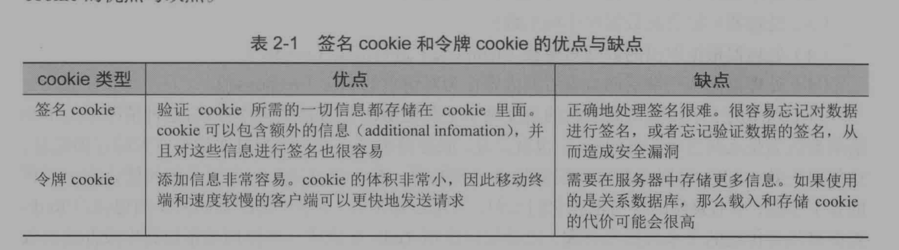
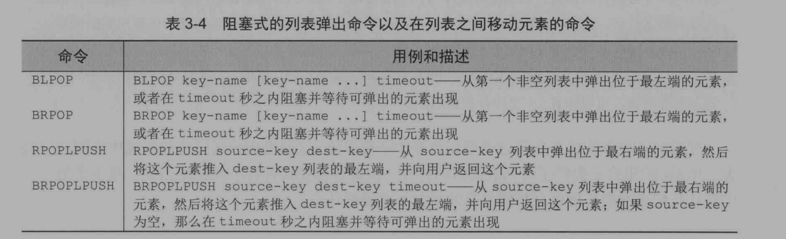
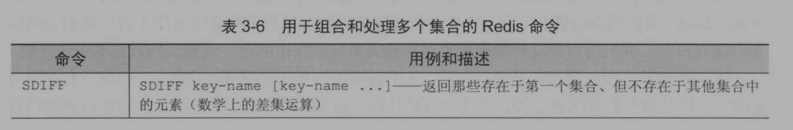
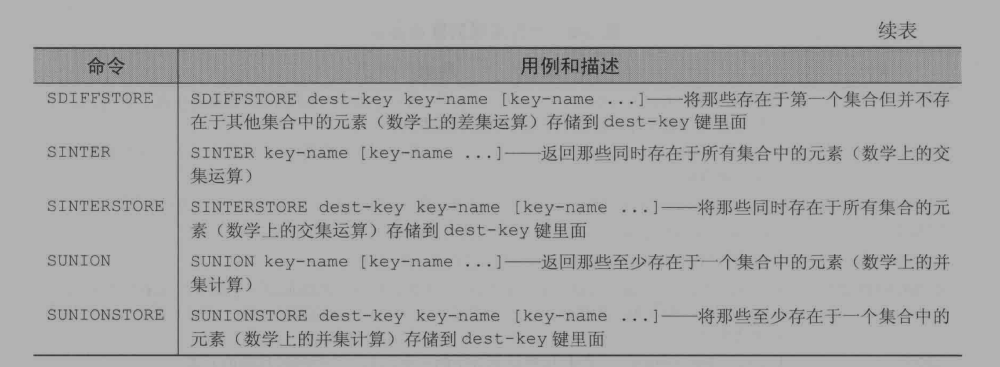
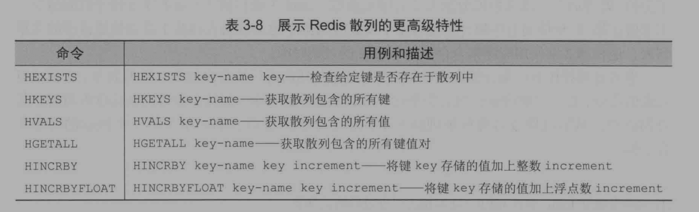

# 第一部分、入门


## 第一章、初识Redis


Redis提供了5种不同类型的数据结构：字符串（STRING），列表（LIST），集合（SET），散列表（HASH），有序集合（ZSET）

结构特征：

| 结构类型 |                         结构存储的值                         |
| :------: | :----------------------------------------------------------: |
|  STRING  |                   字符串，整数或者是浮点数                   |
|   LIST   |          一个链表，链表上的每个节点都存储一个STRING          |
|   SET    |            包含STRING的无序收集器，且是独一无二的            |
|   HASH   |                    包含键值对的无序散列表                    |
|   ZSET   | 字符串成员（num）与浮点数分值（score）之间的有序映射，排列顺序由分值大小决定 |


>  使用redis-cli来连接redis命令行界面
>
> `redis-cli -h localhost -p 6379`连接到Redis命令行中去
>
> 如果设置了密码需要使用`auth <密码>`的方式来实现登陆，不然会报AUTH错误


STRING使用示例

```redis
127.0.0.1:6379> set hello world
OK
127.0.0.1:6379> get hello
"world"
127.0.0.1:6379> get Hello
(nil)
127.0.0.1:6379> del hello
(integer) 1
127.0.0.1:6379> get hello
(nil)
```


LIST使用示例：

```redis
127.0.0.1:6379> rpush list-key item
(integer) 1
127.0.0.1:6379> rpush list-key item2
(integer) 2
127.0.0.1:6379> rpush list-key item
(integer) 3
127.0.0.1:6379> 
// -1为范围内的结束索引，即直接查看全部
127.0.0.1:6379> lrange list-key 0 -1
1) "item"
2) "item2"
3) "item"
127.0.0.1:6379> lindex list-key 1
"item2"
127.0.0.1:6379> lpop list-key
"item"
127.0.0.1:6379> lrange list-key 0 -1
1) "item2"
2) "item"
```

> redis中的LIST操作远不止此


SET使用示例：

```redis
127.0.0.1:6379> sadd set-key item
(integer) 1
127.0.0.1:6379> sadd set-key item2
(integer) 1
127.0.0.1:6379> sadd set-key item3
(integer) 1
127.0.0.1:6379> smembers set-key
1) "item"
2) "item2"
3) "item3"
127.0.0.1:6379> sismember set-key item4
(integer) 0
127.0.0.1:6379> sismember set-key item1
(integer) 0
127.0.0.1:6379> sismember set-key item
(integer) 1
127.0.0.1:6379> srem set-key item2
(integer) 1
127.0.0.1:6379> sismember set-key item2
(integer) 0
127.0.0.1:6379> smembers set-key
1) "item"
2) "item3"
```


HASH使用示例：

```redis
127.0.0.1:6379> hset hash-key sub-key1 value1
(integer) 1
127.0.0.1:6379> hset hash-key sub-key2 value2
(integer) 1
127.0.0.1:6379> hset hash-key sub-key3 value3
(integer) 1
127.0.0.1:6379> hgetall hash-key
1) "sub-key1"
2) "value1"
3) "sub-key2"
4) "value2"
5) "sub-key3"
6) "value3"
127.0.0.1:6379> hset hash-key sub-key3 value1
(integer) 0
127.0.0.1:6379> hgetall hash-key
1) "sub-key1"
2) "value1"
3) "sub-key2"
4) "value2"
5) "sub-key3"
6) "value1"
127.0.0.1:6379> hget hash-key sub-key1
"value1"
127.0.0.1:6379> hdel hash-key sub-key1
(integer) 1
127.0.0.1:6379> hgetall hash-key
1) "sub-key2"
2) "value2"
3) "sub-key3"
4) "value1"
```


ZSET使用示例：

```redis
127.0.0.1:6379> zadd zset-key 200 member1
(integer) 1
127.0.0.1:6379> zadd zset-key 400 member2
(integer) 1
127.0.0.1:6379> zadd zset-key 400 member3
(integer) 1
127.0.0.1:6379> zadd zset-key 100 member2
(integer) 0
127.0.0.1:6379> zrange zset-key 0 -1 withscores
1) "member2"
2) "100"
3) "member1"
4) "200"
5) "member3"
6) "400"
127.0.0.1:6379> zrangebyscore zset-key 0 200 withscores
1) "member2"
2) "100"
3) "member1"
4) "200"
127.0.0.1:6379> zrem zset-key member1
(integer) 1
127.0.0.1:6379> zrange zset-key 0 -1
1) "member2"
2) "member3"
127.0.0.1:6379> zrange zset-key 0 -1 withscores
1) "member2"
2) "100"
3) "member3"
4) "400"
```

> 有序集合的键被称为成员（number），每个成员的值则被称为分值（score），需要根据分值来进行排


## 第二章、使用Redis构建Web应用


对Web请求进行优化：

经典的Web请求处理过程：

1. 解析客户端发来的Request请求
2. 找到相应的Handler
3. 可能从数据库中取出数据
4. 根据数据对模板进行渲染
5. 将渲染后的内容作为Response返回给客户端

当然 ，现在提倡的REST编程风格里就没有第四步的位置了。

这种情况的Web请求被认为是无状态的，即服务器本身是不会去记录与过往请求有关的任何信息。


在Web请求处理过程中我们可以尝试使用Redis来代替传统关系型数据库的查询，以此来对请求速度进行优化。（书上说道：以下提出的解决方法都在生产环境中使用到过）


1、使用Redis来管理用户登录会话

常见的两种用于登录的Cookie，一种是签名（signed）Cookie，另一种是令牌（token）Cookie



我们现在使用的应该就是第二种令牌Cookie了，通过该Cookie可以做到与服务器上的Session相绑定的功能


可以使用Cookie来非常轻易的实现购物车功能，但是如果直接将购物车中的数据存储到Cookie当中，会导致Cookie非常的大，会影响速率

可以使用Redis存储


使用Redis来降低数据库负载和Web服务器负载

> 在为应用程序创建新构件时候，不要害怕回过头去重构已有的构件。因为在重构已有的构件的时候往往可以重用当时的构造思想和所用的知识


# 第二部分、核心概念


开始探讨标准的Redis命令，在最后并使用Redis构建一个简单的社交网站


### 第三章、Redis命令


> Redis使用各种数据结构是不需要提前创建的，直接当成是默认存在的即可，至于del操作可以认为是对数据的清空


对Redis支持的5种数据结构的CRUD操作


字符串操作


Redis字符串与编程语言中的字符串并无不同，不过支持存储以下三种结构的值：

- 字节串
- 整数
- 浮点数

还可以对存储在字符串中的整数和浮点数进行自增或者自减操作，支持将整数转换成浮点数


自增自减命令演示（仅限于整数和浮点数）：

```
localhost:6379> set int 1
OK
localhost:6379> incr int
(integer) 2
localhost:6379> decr int
(integer) 1
localhost:6379> incrby int 2
(integer) 3
localhost:6379> decrby int 2
(integer) 1
// 只有这个命令可以操作浮点数
localhost:6379> incrbyfloat int 1.1
"2.1"
localhost:6379> get int
"2.1"
localhost:6379> incr int
(error) ERR value is not an integer or out of range
```


Redis处理子串和二进制位的命令演示：

```
localhost:6379> set string hello
OK
localhost:6379> append string " world"
(integer) 11
localhost:6379> get string
"hello world"
localhost:6379> getrange string 0 4
"hello"
```


列表操作


Redis允许用户从列表两端推入或者弹出元素，获取列表元素，以及执行各种常见的列表操作

基本操作演示：

```
localhost:6379> lpush intList 2 1 0
(integer) 3
localhost:6379> rpush intList 3 4 5
(integer) 6
localhost:6379> lrange intList 0 -1
1) "0"
2) "1"
3) "2"
4) "3"
5) "4"
6) "5"
localhost:6379> rpop intList
"5"
localhost:6379> lpop intList
"0"
localhost:6379> lrange intList 0 -1
1) "1"
2) "2"
3) "3"
4) "4"
localhost:6379> ltrim intList 1 2
OK
localhost:6379> lrange intList 0 -1
1) "2"
2) "3"
```


> 下标-1在Redis中表示最后一个元素，如`lrange intList 0 -1`会展示下标为0的元素到最后一个元素，也可以使用ltrim命令配合-1直接实现从当前元素到最后元素的截断。


阻塞式的列表弹出命令以及列表中移动的命令：



可以很轻易的使用Redis的列表数据类型实现栈等数据结构


集合操作

集合以无序的方式存储多个各不相同的元素，用户可以实现向集合中添加，删除，查找元素是否在集合中等基本操作，且Redis可以保证其高效


```
127.0.0.1:6379> sadd key-set hello
(integer) 1
127.0.0.1:6379> sadd key-set 1
(integer) 1
127.0.0.1:6379> sadd key-set 1 2 3
(integer) 2
127.0.0.1:6379> smembers key-set
1) "2"
2) "1"
3) "3"
4) "hello"
127.0.0.1:6379> srem 1 2
(integer) 0
127.0.0.1:6379> srem key-set 1 2
(integer) 2
127.0.0.1:6379> smembers key-set
1) "3"
2) "hello"
127.0.0.1:6379> srandmember key-set 2
1) "hello"
2) "3"
127.0.0.1:6379> srandmember key-set -1
1) "3"
127.0.0.1:6379> srandmember key-set -2
1) "3"
2) "hello"
127.0.0.1:6379> spop key-set
"hello"
127.0.0.1:6379> smembers key-set
1) "3"
127.0.0.1:6379> clear
127.0.0.1:6379> smembers key-set
1) "3"
```


多个集合之间的运算：






> Redis铁定是一个Key-Value型数据库，这里提供的五个数据结构都只是Value的。


散列操作

```
127.0.0.1:6379> hmset hash-key key1 1 key2 2
OK
127.0.0.1:6379> hgetall hash-key
1) "key1"
2) "1"
3) "key2"
4) "2"
127.0.0.1:6379> hmget hash-key key1 key2
1) "1"
2) "2"
127.0.0.1:6379> hlen hash-key
(integer) 2
127.0.0.1:6379> hdel hash-key key1
(integer) 1
127.0.0.1:6379> hlen hash-key
(integer) 1
127.0.0.1:6379> hgetall hash-key
1) "key2"
2) "2"
127.0.0.1:6379> 
```

HASH的高级特性：

 