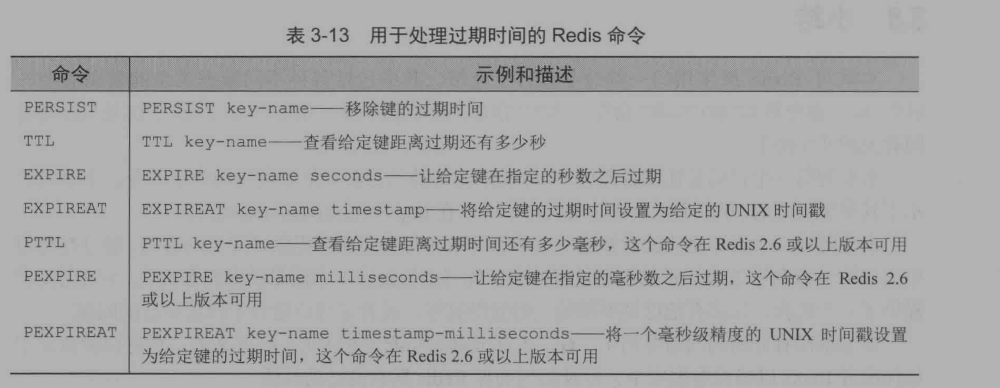

# 第一部分、入门


## 第一章、初识Redis


Redis提供了5种不同类型的数据结构：字符串（STRING），列表（LIST），集合（SET），散列表（HASH），有序集合（ZSET）

结构特征：

| 结构类型 |                         结构存储的值                         |
| :------: | :----------------------------------------------------------: |
|  STRING  |                   字符串，整数或者是浮点数                   |
|   LIST   |          一个链表，链表上的每个节点都存储一个STRING          |
|   SET    |            包含STRING的无序收集器，且是独一无二的            |
|   HASH   |                    包含键值对的无序散列表                    |
|   ZSET   | 字符串成员（num）与浮点数分值（score）之间的有序映射，排列顺序由分值大小决定 |


>  使用redis-cli来连接redis命令行界面
>
> `redis-cli -h localhost -p 6379`连接到Redis命令行中去
>
> 如果设置了密码需要使用`auth <密码>`的方式来实现登陆，不然会报AUTH错误


STRING使用示例

```redis
127.0.0.1:6379> set hello world
OK
127.0.0.1:6379> get hello
"world"
127.0.0.1:6379> get Hello
(nil)
127.0.0.1:6379> del hello
(integer) 1
127.0.0.1:6379> get hello
(nil)
```


LIST使用示例：

```redis
127.0.0.1:6379> rpush list-key item
(integer) 1
127.0.0.1:6379> rpush list-key item2
(integer) 2
127.0.0.1:6379> rpush list-key item
(integer) 3
127.0.0.1:6379> 
// -1为范围内的结束索引，即直接查看全部
127.0.0.1:6379> lrange list-key 0 -1
1) "item"
2) "item2"
3) "item"
127.0.0.1:6379> lindex list-key 1
"item2"
127.0.0.1:6379> lpop list-key
"item"
127.0.0.1:6379> lrange list-key 0 -1
1) "item2"
2) "item"
```

> redis中的LIST操作远不止此


SET使用示例：

```redis
127.0.0.1:6379> sadd set-key item
(integer) 1
127.0.0.1:6379> sadd set-key item2
(integer) 1
127.0.0.1:6379> sadd set-key item3
(integer) 1
127.0.0.1:6379> smembers set-key
1) "item"
2) "item2"
3) "item3"
127.0.0.1:6379> sismember set-key item4
(integer) 0
127.0.0.1:6379> sismember set-key item1
(integer) 0
127.0.0.1:6379> sismember set-key item
(integer) 1
127.0.0.1:6379> srem set-key item2
(integer) 1
127.0.0.1:6379> sismember set-key item2
(integer) 0
127.0.0.1:6379> smembers set-key
1) "item"
2) "item3"
```


HASH使用示例：

```redis
127.0.0.1:6379> hset hash-key sub-key1 value1
(integer) 1
127.0.0.1:6379> hset hash-key sub-key2 value2
(integer) 1
127.0.0.1:6379> hset hash-key sub-key3 value3
(integer) 1
127.0.0.1:6379> hgetall hash-key
1) "sub-key1"
2) "value1"
3) "sub-key2"
4) "value2"
5) "sub-key3"
6) "value3"
127.0.0.1:6379> hset hash-key sub-key3 value1
(integer) 0
127.0.0.1:6379> hgetall hash-key
1) "sub-key1"
2) "value1"
3) "sub-key2"
4) "value2"
5) "sub-key3"
6) "value1"
127.0.0.1:6379> hget hash-key sub-key1
"value1"
127.0.0.1:6379> hdel hash-key sub-key1
(integer) 1
127.0.0.1:6379> hgetall hash-key
1) "sub-key2"
2) "value2"
3) "sub-key3"
4) "value1"
```


ZSET使用示例：

```redis
127.0.0.1:6379> zadd zset-key 200 member1
(integer) 1
127.0.0.1:6379> zadd zset-key 400 member2
(integer) 1
127.0.0.1:6379> zadd zset-key 400 member3
(integer) 1
127.0.0.1:6379> zadd zset-key 100 member2
(integer) 0
127.0.0.1:6379> zrange zset-key 0 -1 withscores
1) "member2"
2) "100"
3) "member1"
4) "200"
5) "member3"
6) "400"
127.0.0.1:6379> zrangebyscore zset-key 0 200 withscores
1) "member2"
2) "100"
3) "member1"
4) "200"
127.0.0.1:6379> zrem zset-key member1
(integer) 1
127.0.0.1:6379> zrange zset-key 0 -1
1) "member2"
2) "member3"
127.0.0.1:6379> zrange zset-key 0 -1 withscores
1) "member2"
2) "100"
3) "member3"
4) "400"
```

> 有序集合的键被称为成员（number），每个成员的值则被称为分值（score），需要根据分值来进行排


## 第二章、使用Redis构建Web应用


对Web请求进行优化：

经典的Web请求处理过程：

1. 解析客户端发来的Request请求
2. 找到相应的Handler
3. 可能从数据库中取出数据
4. 根据数据对模板进行渲染
5. 将渲染后的内容作为Response返回给客户端

当然 ，现在提倡的REST编程风格里就没有第四步的位置了。

这种情况的Web请求被认为是无状态的，即服务器本身是不会去记录与过往请求有关的任何信息。


在Web请求处理过程中我们可以尝试使用Redis来代替传统关系型数据库的查询，以此来对请求速度进行优化。（书上说道：以下提出的解决方法都在生产环境中使用到过）


1、使用Redis来管理用户登录会话

常见的两种用于登录的Cookie，一种是签名（signed）Cookie，另一种是令牌（token）Cookie


我们现在使用的应该就是第二种令牌Cookie了，通过该Cookie可以做到与服务器上的Session相绑定的功能


可以使用Cookie来非常轻易的实现购物车功能，但是如果直接将购物车中的数据存储到Cookie当中，会导致Cookie非常的大，会影响速率

可以使用Redis存储


使用Redis来降低数据库负载和Web服务器负载

> 在为应用程序创建新构件时候，不要害怕回过头去重构已有的构件。因为在重构已有的构件的时候往往可以重用当时的构造思想和所用的知识


# 第二部分、核心概念


开始探讨标准的Redis命令，在最后并使用Redis构建一个简单的社交网站


### 第三章、Redis命令


> Redis使用各种数据结构是不需要提前创建的，直接当成是默认存在的即可，至于del操作可以认为是对数据的清空


对Redis支持的5种数据结构的CRUD操作


字符串操作


Redis字符串与编程语言中的字符串并无不同，不过支持存储以下三种结构的值：

- 字节串
- 整数
- 浮点数

还可以对存储在字符串中的整数和浮点数进行自增或者自减操作，支持将整数转换成浮点数


自增自减命令演示（仅限于整数和浮点数）：

```
localhost:6379> set int 1
OK
localhost:6379> incr int
(integer) 2
localhost:6379> decr int
(integer) 1
localhost:6379> incrby int 2
(integer) 3
localhost:6379> decrby int 2
(integer) 1
// 只有这个命令可以操作浮点数
localhost:6379> incrbyfloat int 1.1
"2.1"
localhost:6379> get int
"2.1"
localhost:6379> incr int
(error) ERR value is not an integer or out of range
```


Redis处理子串和二进制位的命令演示：

```
localhost:6379> set string hello
OK
localhost:6379> append string " world"
(integer) 11
localhost:6379> get string
"hello world"
localhost:6379> getrange string 0 4
"hello"
```


列表操作


Redis允许用户从列表两端推入或者弹出元素，获取列表元素，以及执行各种常见的列表操作

基本操作演示：

```
localhost:6379> lpush intList 2 1 0
(integer) 3
localhost:6379> rpush intList 3 4 5
(integer) 6
localhost:6379> lrange intList 0 -1
1) "0"
2) "1"
3) "2"
4) "3"
5) "4"
6) "5"
localhost:6379> rpop intList
"5"
localhost:6379> lpop intList
"0"
localhost:6379> lrange intList 0 -1
1) "1"
2) "2"
3) "3"
4) "4"
localhost:6379> ltrim intList 1 2
OK
localhost:6379> lrange intList 0 -1
1) "2"
2) "3"
```


> 下标-1在Redis中表示最后一个元素，如`lrange intList 0 -1`会展示下标为0的元素到最后一个元素，也可以使用ltrim命令配合-1直接实现从当前元素到最后元素的截断。


阻塞式的列表弹出命令以及列表中移动的命令：


可以很轻易的使用Redis的列表数据类型实现栈等数据结构


集合操作

集合以无序的方式存储多个各不相同的元素，用户可以实现向集合中添加，删除，查找元素是否在集合中等基本操作，且Redis可以保证其高效


```
127.0.0.1:6379> sadd key-set hello
(integer) 1
127.0.0.1:6379> sadd key-set 1
(integer) 1
127.0.0.1:6379> sadd key-set 1 2 3
(integer) 2
127.0.0.1:6379> smembers key-set
1) "2"
2) "1"
3) "3"
4) "hello"
127.0.0.1:6379> srem 1 2
(integer) 0
127.0.0.1:6379> srem key-set 1 2
(integer) 2
127.0.0.1:6379> smembers key-set
1) "3"
2) "hello"
127.0.0.1:6379> srandmember key-set 2
1) "hello"
2) "3"
127.0.0.1:6379> srandmember key-set -1
1) "3"
127.0.0.1:6379> srandmember key-set -2
1) "3"
2) "hello"
127.0.0.1:6379> spop key-set
"hello"
127.0.0.1:6379> smembers key-set
1) "3"
127.0.0.1:6379> clear
127.0.0.1:6379> smembers key-set
1) "3"
```


多个集合之间的运算：


> Redis铁定是一个Key-Value型数据库，这里提供的五个数据结构都只是Value的。


散列操作

```
127.0.0.1:6379> hmset hash-key key1 1 key2 2
OK
127.0.0.1:6379> hgetall hash-key
1) "key1"
2) "1"
3) "key2"
4) "2"
127.0.0.1:6379> hmget hash-key key1 key2
1) "1"
2) "2"
127.0.0.1:6379> hlen hash-key
(integer) 2
127.0.0.1:6379> hdel hash-key key1
(integer) 1
127.0.0.1:6379> hlen hash-key
(integer) 1
127.0.0.1:6379> hgetall hash-key
1) "key2"
2) "2"
127.0.0.1:6379> 
```

HASH的高级特性：

 


有序集合操作：

有序集合存储的是分值与成员之间的情况

```
127.0.0.1:6379> zadd zset-key 1 a 2 b 3 c
(integer) 3
127.0.0.1:6379> zrem zset-key a
(integer) 1
127.0.0.1:6379> zrange zset-key 0 -1
1) "b"
2) "c"
127.0.0.1:6379> zscore zset-key b
"2"
127.0.0.1:6379> zcard zset-key
(integer) 2
127.0.0.1:6379> zincrby zset-key 10 b
"12"
127.0.0.1:6379> zscore zset-key b
"12"
127.0.0.1:6379> zcount zset-key 0 20
(integer) 2
127.0.0.1:6379> zrank zset-key b
(integer) 1
127.0.0.1:6379> zrank zset-key c
(integer) 0
127.0.0.1:6379> zrank zset-key a
(nil)
```


其中包含了很多Redis的逆序排序操作


Redis支持发布订阅模式，难怪有那么多的人喜欢把Redis作为消息中间件来使用，但是直接使用Redis作为消息中间件是不可取的，消息补偿机制都没有，很有可能在生产环境中出现问题。还有可能产生数据积压导致的操作系统杀死Redis的情况存在


依然是Sub订阅Channel，然后Pub通过Channel给订阅该频道的Sub发送消息


一般使用的比较少，毕竟只是Redis提供的一个边缘特性


以上讲述了Redis的五种数据结构和发布订阅模式，接下来介绍通用命令：

- 可以同时处理字符串，集合，列表和散列的SORT命令
- 实现基本事务特征的multi命令和exec命令
- 自动过期命令


可以将SORT命令看成是关系型数据库的Order By字句，默认只能排序有序的数据结构如：列表，集合以及有序集合。


排序操作是无副作用的，不会对被排序的队列造成影响，仅仅只是会返回排序后的值

难怪允许对集合这种无序的数据结构进行排序了，原来仅仅只是将排序结果显示在命令行中，并不会直接去修改被排序的数据结构的值


在Redis中想要执行任务需要使用Multi命令，将需要我们在事务中执行的操作，最后再执行EXEC命令


可以通过设置Redis的键过期时间来完成对数据的回收




Redis的基本操作到此告一段落

下一章将讲述如何配置Redis以确保数据安全，以及如何确保Redis拥有良好的性能。


### 第四章、数据安全与性能保障


本章介绍Redis持久化选项：

- 快照：将某一时刻的所有数据写入磁盘当中。RDB文件
- 只追加文件：将被执行的写命令写入到磁盘当中。AOF文件

两种方法是共存的，都可以选择。


使用快照持久化如果系统发生崩溃时候，用户将会丢失最后一次的更改。

如果不能接受数据损失的应用可以使用AOF文件的方式进行存储


创建快照的方式：

- 使用BGSAVE命令立即启动一个子线程去创建快照，父线程会继续处理命令请求
- 可以直接使用不带参数的SAVE命令来创建一个快照，并不常用，因为他会直接使用父线程去做快照而不会去处理请求了。一般只有在内存不够的情况下才会使用这个方法
- 使用带参数的SAVE命令，例如SAVE 60 10000，则需要满足条件在60s内有10000次的写入，这个条件才会满足，Redis才会自动触发BGSAVE命令，如果存在多个条件，只要一个条件满足就会触发持久化


使用场景：

- 个人开发

在个人服务器上可以使用SAVE 900 1命令来做持久化，当每隔900s，如果存在至少一次写入操作就会做持久化处理


存在矛盾：同步过于频繁会导致资源过度浪费，过于稀少则会导致大量数据的丢失


如果对时间有严格的要求，不想要丢失任何数据，可以使用AOF方式


可选的appendonly为：


如果设置成always可能会造成硬盘的频繁读写，固态硬盘的寿命也有可能极速下降

所以一般不建议使用always，建议使用everysec

一般也不推荐no这个值，因为当缓冲区被数据填满的时候，Redis的写入操作将被阻塞，导致Redis的请求处理速度变慢


AOF对比于RDB文件的缺点：AOF文件占用空间非常大，从而导致的问题是磁盘空间的浪费和Redis执行还原操作时候耗时增长

Redis提供了BGREWRITEAOF命令来对AOF文件进行重写，执行这个操作Redis通常是开启一个子进程，然后让其去执行压缩操作，在执行过程中会存在Redis执行性能问题和内存占用问题，导致Redis的响应速度降低

和使用SAVE命令让其定期调用BGSAVE操作一样，对AOF文件也可以有相同的处理命令

当然快照和AOF持久化无法在系统崩溃时候生效，如果用户数据相当重要则需要进行复制操作


复制操作并不罕见，在关系型数据库中通常会使用主从服务器的形式来提升系统的并发量，Redis也提供了类似的特性。

当主从服务器部署好之后，从客户端会接收主客户端收集到的数据副本。就此可以让请求随机的发送到哪一个客户端，都会进行数据的同步，从而避免请求全部堆积到单一服务器上的问题了。


随着Redis被用于读多写少的场景，一般会通过增设从服务器的方式来做负载均衡，这样一旦主服务器发生了数据更新，从服务器无法立即收到修改的内容。为了解决这个问题，可以使用如下的Redis架构服务器


减少主服务器的数据同步压力，将其分摊给一级从服务器


Redis处理系统故障：Redis与传统的支持ACID的关系型数据库不同，使用Redis存储数据需要用户多做一点工作才能保证数据的一致性：接下来就是一些异常错误的处理方法了，暂且跳过


Redis的事务也和传统关系型数据库不一样，具有延后执行的特性，这是为了Redis极致的性能考虑，但是往往也会带来问题，就是事务提交上去之后数据没有第一时间更新，通常程序此时会对Redis进行二次提交。`MULTI ~ EXEC` 与传统关系型数据库的`BEGIN ~ END`不同


Redis使用乐观锁机制来保证其高效性


### 第五章、使用Redis构建支持程序


使用Redis来记录日志


操作系统常见的日志记录方法：

- 直接将日志记录到磁盘上，然后在下次运行的时候继续跟着添加或者是当文件达到一定大小的时候新建文件继续记录
- 开启系统指定端口号，在端口号监听其他应用发来的日志并进行处理，如网络转发或者是本地记录


可以使用Redis来模拟一个日志记录的功能，基本上就是新建一个List，然后再进行RPUSH和LTRIM操作了


> 感觉讲的都好虚哦，而且是用Python实现的，直接使用命令行实现不好吗


对于Java程序来说，JVM缓存（即JVM中的对象）永远是获取最快的，不会被网络带宽所连累，但是由于缓存一般都会一直保留，存储到了JVM的老年代，所以随着缓存的增大往往会造成FULL GC问题，这时候就可以牺牲一部分的延迟来换取到Redis数据库上获取数据。


Redis可以做配置中心，Spring对此做了支持，先前使用了Git方式配置的配置中心


随着应用规模的增大，可以引入多台Redis各司其职（不是主从配置）


Python提供的装饰器语法是否有点和AOP过于相像了。


