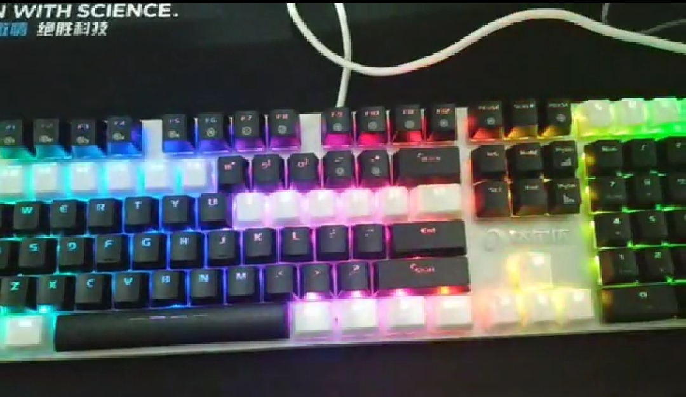
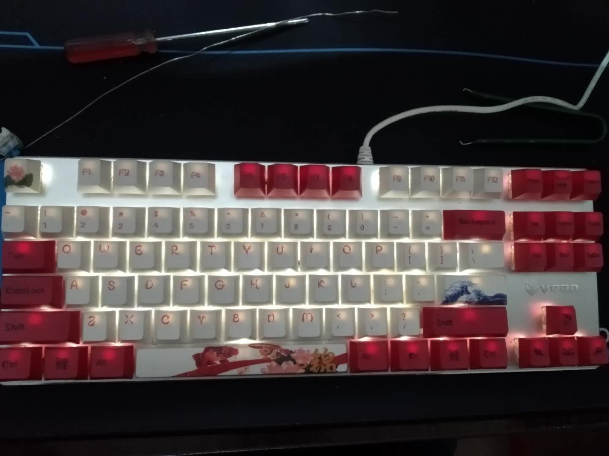
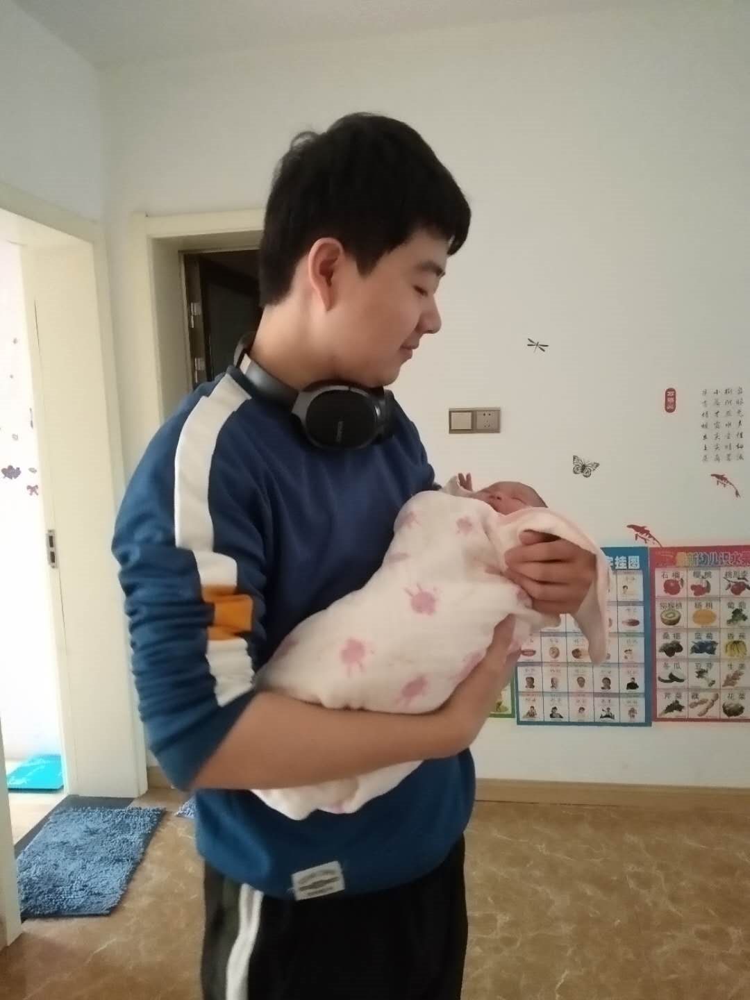

# 栽种朝花、以供夕拾

## 贰零贰零卷

### 6、19

还有几门考试大二下就结束了，大学生活正式过半，不得不说还是由蛮多感慨的

我也本就是这样的人，愈是到达了考试，便玩心越重，越是不想复习。最近沉迷玩键盘，从各种DIY中找乐趣，从刚开始的怀疑人生，到后来的信手拈来，愈发的感觉到了，世上无难事，只怕有心人这句话的含量了，只要坚持下去似乎真的没有什么困难，就比如大学这条道路，诚然，学习是跨越社会阶级最好的办法，尽管中国的阶级分化不是那么的严重，毕竟 有历史原因的，只是表现得不明显罢了，父母努力一辈子，付出和收获真的难以对比了。

就这样坚持下去呗，该学学，该玩玩，这是妈妈常对我说的，最近真的非常开心，分享下我自己DIY的两把键盘吧~

随遇而安的生活态度，一鼓作气的学习精神，LuckyCurve，冲冲冲。

### 7、20

无意间看到蛮喜欢的一档综艺节目《这就是街舞》开启了新的一季，怀着满腔期待去追，看完之后还是稍有感触的。里面选手有早已功成名就的老将，也有初出茅庐的新兵。老将们凭借着自己Dancing的经验往往都能引人注意，新兵们也能通过初生牛犊的锐气赢得满堂喝彩。

突然想到前几天郑强教授发表的一次演讲，是关于大学生的，“落后就要挨打，大大挫伤了我们年轻人的锐气，你要反问一句，为什么别人要打我，我为什么要任别人打”。突然发现我们身上好像少了一股子年轻人该有的锐气，我们更倾向于老将们的闲庭信步，可是我们又不具备老将们的经验和遭遇到的挫折，于是只会开始故作清高，活脱脱的像个小丑。反倒这样做我们还丧失了牛肚的最大的优势——无畏的优势。

愈发感到梁启超先生《少年中国说》里的意义了，年轻人不仅朝气蓬勃，更比老将们带有一种不畏强权，无所畏惧的锐气，这才能让年轻人们做事儿没有那么多的顾忌，放手去干，正像毛主席他们那一代人，最随着自己认可的方向。可是如今呢？中国“安定”下来了，国家更想要的是稳定，而年轻人的这股锐气，虽说是成就了这个国家的这股锐气，为了一时的安定，人们宁愿去挫伤他，到如今，年轻人纷纷开始拼比家势，路子来寻找优越感，在社会上，到医院里不去找个熟人心里都不舒服，处处都彰显着迂腐和饭圈文化，哪有年轻人施展自己拳脚的一片舞台呢？年轻人又哪有精力去施展自己的抱负呢？

但即使是这样的环境下，我们仍然不能放下，不能放下一股锐气，无论是为了让这个我们先辈泼洒无限献血的国家，又或者只是为了减轻家里的一点压力，让父母们成天乐呵一下，唯有努力和奋斗才能上我们更有底气的上战场，成为这个时代最耀眼的新兵，进而去影响这个时代，无论是好的影响还是坏的影响，最起码你尝试过了，不是吗？

LuckyCurve，冲冲冲。

### 8、7

记我第一次遇到的大规模服务熔断。

凌晨左右，开心看着炫神直播的我突然发现直播间卡了，还以为是被超管制裁了，结果发现是虎牙大部分直播间都无法访问，无论是网页端还是app，看来用的是同一套后端服务器了，感觉服务器错误降级处理的不是非常的好，直接导致大规模的直播间无法进入，个别能进入的直播间弹幕也是非常的卡顿，当然也有可能是通讯公司中间出了问题，不过可能性极小。

就到我写下这篇心路历程已经过去了十多分钟了，还是没有得到妥善的解决，先不论主播们受到的影响，光是观众们刷的弹幕：“虎牙不行了”，再不济在内心也会留下：虎牙技术团队不行了的感觉，蛮影响公司的整体形象的。看了下微博，虎牙怕是被冲烂了。

仅以此为戒，切莫将错误处理降级不合格的产品上线，当然这里也可能包括别的平台的攻击那就另说了，还不知道今晚要有多少程序员出来加班挨打呢，哈哈，看一乐呵~

~但愿自己以后可以进到一个项目架构，项目错误处理更加严谨的公司吧，也不至于直接导致大规模的服务中断了，说不定半夜还得起来加班挨打。~

### 8、13

与这么多个优秀的人同处一个世界的感觉真好。

既然如此，又有什么理由不去努力呢？

### 8、17

没事儿刷了篇文章，一句话总结来说就是过强的自尊心和自卑感正在成为农村孩子们的心魔。

确实也有点感同身受，但又何限于在农村的孩子们呢？身边大部分的人都是一样，对声势显赫，家里经济条件较好的人，往往都是那么的卑躬屈膝，而对那些城市的基础建设者却显得那么的冷漠，对这个世界，即过分自卑，又过分自傲。

自认为目前还达不到对待任何人任何事都能平心而论的状态，但要以此为鉴，切莫在这世间丢了 傲骨。

### 8、29

随着年龄的增长，愈发的觉得寻求内心的平静是那么的困难。

似乎很难通过树立一个目标，来达到平复内心的目的。正如曹操所言，忧从中来，不可断绝，就连志在一统天下的伟人都有如此多的忧愁，无法平复内心的情绪，我又怎么能轻易做到呢？

到目前为止平复内心的方式好像就两种，一是将精力置于艺术创作当中，让自己与美为伴，确实能够使得心灵更加的平静，二是学习别人创建到了的编程模型，而不是自己编码，因为欣赏编程模型相当于是爱好，而一旦开始编码，就相当于是工作了，而这偏偏也是我选择的工作。

最初写这段话的时候也只是想记载一下此时的心路历程，但是在文字录入额时候往往会令我回忆良多，莫名其妙的蒙田的一篇《热爱生命》在我的脑海里挥之不去，似乎只有真正的热爱生命才能无所忧虑吧，但是这也难免会失去很多东西，而这些东西往往是我不愿意失去的，纵使是换来一辈子的平静。

### 9、12

回望了下自己的心路历程，似乎忧虑消极的情绪有点过了。

可这也怨不得我，身边能倾诉的人寥寥无几，能懂我倾诉的人更是寥寥无几。无非都是故作哀叹，前路迷茫，然后各行其是去了。反倒是这篇心路成了我最好的情感发泄口了。

知心的人不同道，同道的人不知心。这大概就是世上最大的遗憾了吧。

前路迷茫，可指不定我命中的水镜先生就在不远处呢？暂且静下心来，各行其是吧。

### 9、20

最近几天开始了对《培根随笔》的誊抄，愈发觉得我的这点忧愁是这么的渺小，在誊抄的过程中愈发觉得其弹指可灭，而这其中的关键就是对待这个世界的态度。

愈发觉得之前自己所崇尚的自由的意志是如此的可笑，我只看到了它无所拘束的潇洒，却往往容易陷入到无根的困顿与迷茫当中，反倒这些困顿与迷茫还能反过来摧毁掉原本所追求的潇洒。

附上第一篇 论真理 中的一小段：

> 有人怀疑过吗，如果将虚荣的观点，谄媚的愿望，错误的评价以及虚无的想象等诸如此类的东西从人们的思想中抽离，那么，很多人将沦为乏味的可怜虫，内心除了郁郁寡欢和无所知从之外空洞无物，甚至自我讨厌，自我嫌弃。

### 9、27

技术透支大概就是对手艺人来说最大的悲哀了吧。

向来信奉编码是一门手艺活的我，结合着最近的际遇，愈发觉得这是门体力活了。

我向来是瞧不起鲁迅的，认为这个人不过是文采卓绝的愤青。但最近慕读先生的《呐喊》，明白了先生离开绍兴的缘由，感同身受，我便也效仿着先生，回到了教室当中去，愈发的觉得身边的事物变得亲切可爱了起来。

我不反感资本这种商业模式，但是俗话说得好，拿人手短吃人嘴短。可如今我没拿也没想过要拿，何至于像使唤工具人来被使唤呢？更可笑的是让我们自己排解忧虑和压力，也不问问这些负面情绪从何而来，排解之后继续给您赚米吗？

技术沉淀少的可怜，只有几个工具类且大部分是被Spring实现过了的。从不修改系统架构，万年的老模板谓之稳定，系统并发量拿嘴上去啊？每当提出一点优化意见，立马就是框架做了优化，而一旦谈论到框架的实现底层，这点是Java自己提供的语言特性，那点是框架提供的特新，草草收尾，很喜欢Linus说的一句话："Talk is cheat,show me the code"，可我又为之奈何呢？好比画了个圈，只想让我们在里面起舞，可一旦当我们觉得这个圈小了，没有兴趣接着舞时，就会归咎为这是我们的负面情绪，克服过去就好了，要是想通过扩充这个圈，来保持自己的热情，立马就会遭到义正言辞的拒绝，这如何能留得住善舞之人呢？

项目的开发难度不及我平时Demo的二三，常规的CRUD，多变的业务逻辑，无不消磨着我的技术热情，可越是这样，越不能沉寂下去，以鲁迅先生的话做结吧：

> 愿中国青年都摆脱冷气，只是向上走，
> 不必听自暴自弃者流的话。
> 能做事的做事，能发声的发声。
> 有一分热，发一分光。
> 就令萤火一般，也可以在黑暗里发一点光，
> 不必等候炬火。

谨以此记录最近的学习热情，让日后深处冷气时能看到一丝微秒的光。

### 10、11

说不出为什么，突然莫名的想看傍晚的火烧云和深夜的星空了。

可惜在这都市的中心，这样的场景是极为难得的。

### 10、30

无意间看到的一句话：“年幼时词不达意，长大后言不由衷”。

没有任何贬义，在我看来每个努力生活的人都值得尊重，哪怕是委曲求全的方式也好，说不定这委屈求全的背后就有着一个个深刻的故事呢。不过很庆幸我还处于大学这个时期，不用刻意掩盖自己的情绪，做任何事儿都可以全凭内心好恶，没有那么多的故事需要我努力往前走。仅仅只需享受生活，积累知识。

### 11、5

生命好似大自然的四季，总是那般周转不止。

一转眼，我就当舅舅了。新的生命往往会给一个家庭带来希望与憧憬，就好似往平静的湖面里掷入一颗石子，给湖面添入几分韵味与波澜。

### 12、15

仿佛又回到了二零二零第一篇心路的时间点，又到了邻接考试的时候，我的玩心也愈发的重了起来，自己买客制化轴体，画PCB，选择底壳，焊接轴体，选择键帽......好似这种事儿比考试有趣的多。

细细想来，引起我玩心大作的还是这可笑的考试制度，似乎现在的考试只有及格，优秀的简单划分了，前人一次次的奇思妙想，灵光一现的问题解决方案，到考试里却变成了干巴巴的知识点，也不知前人是否会感觉到悲哀。

而这光怪陆离的现象的始作俑者，确是我们学生自己。仅是考试前刷几套往届的卷子，获得一个心安理得的分数，假期自然也就能心安理得的玩耍了。殊不知更重要的是知晓问题的前因后果，了解问题的解决思路，从而面对当下存在的问题时候，效仿先辈或者是加以创新，提出自己的一套解决方案。而现在的我们，却难免落得了下乘。

或许这就是我逃避考试复习的原因吧，往往还没有通读一遍书本来的有意思。而我往往是厌恶没意思的事儿的，这就是我落得下乘中的下乘的原因吧。

## 贰零贰壹卷

### 1、7

十几个小时的车程，让我回到了这个试图将人划分成三六九等的深圳。

在这十几个小时里，想起了很多事儿，想到了世上的生老病死、想到了我理想中的为官之道、当然，也想到了我这篇记录我成长历程的文章。

本文题为《心路》，可回望二零二零，我更着重了路而轻了心，这却是有违我的初心的。可转念一想，这也是人之常情，人们似乎总是将沉重的事儿埋藏在心底，而不是轻易展露，更何况我这展露的对象是有记忆的互联网。可如今，我就要打破这层隔阂，算是对我二零二零年的收官。

好像在文章中还不曾提起，我患有先天性眼疾，即使三岁那年做过一场手术，仍然是五米开外人人不分，难以看清他们的脸颊，这伴随我二十年的病无时不刻的掣肘着我的行动，乃至我的求学生涯中看清老师黑板上的板书次数屈指可数，即使是坐在教室的前排。喏，这不，与我同处二十年的病魔又给我出了个难题。

去年里加入了一个实验室，接触到了一位以前未曾接触过的女生，我从未想过在深夜，还会想起她的那双眼眸，如此的富有灵气，能感觉到，这是一个有趣的人，值得我去了解。可越是有这种悸动，反倒越是惶恐，似乎没有哪个女孩子该糟蹋在我这块硬石头上，更何况是她呢。眼疾使我往往无法在两步之外寻人，而当走到两步之内，往往又是擦肩而过，在我的眼中，认出谁来仅只能靠他们常穿的衣物，这无疑成为了一股非常大的阻力。至于内心的那股悸动何处安置，暂且搁置一旁，相信随着时间的推移，终将会烟消云散。

这件事儿在二零二零年回忆里显得格外耀眼，至于该年的其他事儿，大概就是经历了许多事儿，学会了苦中作乐，随遇而安吧。

### 4、10

似是真的，在父母面前报喜不报忧，在这里报忧不报喜，哈哈~

半个月前春招实习上岸，拿到了阿里的意向书和小米的offer，字节和腾讯还在面试，相信很快也会有结果~

即是报喜，自是要附上一些感慨的，但是从刚开始拿到意向书的感慨良多（毕竟和我竞争的都是些南京大学硕、电子科大硕，以我双非的身份四面技术面两面笔试一面HR面拿到意向还是足以自傲一下的）到后来的平淡无常，似是有很多要写的，又似是没有什么要写了，既已如此，就以我最喜欢的话作结吧："知道的越多，不知道的越多"。

> 捋了一晚上思路，我去阿里的消息还是最有可能是从这篇心路当中传出去的
>
> 你好呀，熟悉的陌生人，如果您真能看到这段话，希望您能帮我守住去阿里的这个小秘密，身边的人暂时都还不知道这件事情，知道这件事情之后，功利心便越重，功利越重，真情自然也就越少。相信您也是看过我过往文章的，自是知道我对功利是何等厌恶的，若连我身边的人也如此，那自当是烈日入冰河，水火难容了。所以在这里非常郑重的请求您帮我保守秘密，守口如瓶，在日常交流中不要说漏嘴了，谢谢你~
>
> 至于该篇心路的其他文章，我在上一篇文章中也提到了嘛，互联网自是有它的记忆的，但是没想到这段大学的记忆能够在这时候被人挖掘出来了，或许这就是缘分吧，倘若有幸也能听到您的故事，自当是激动莫名的。
>
> 最后再次请求您帮我保守这个秘密，这对我真的很重要。

