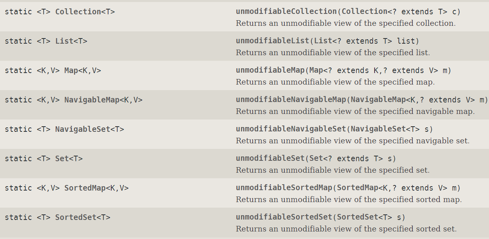
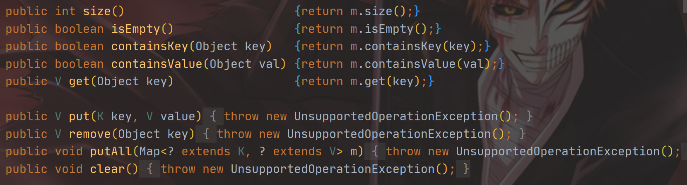
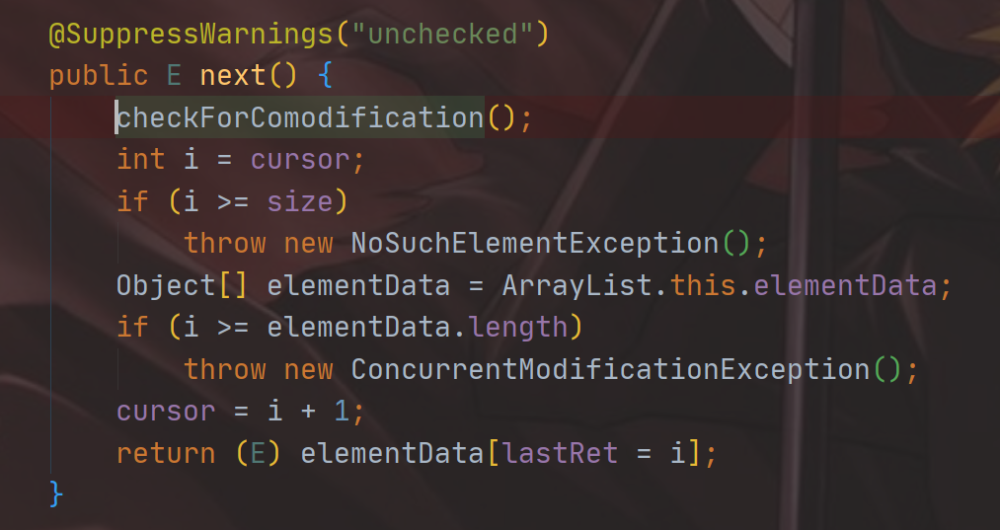
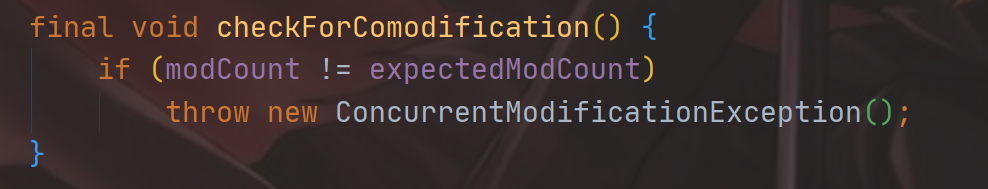
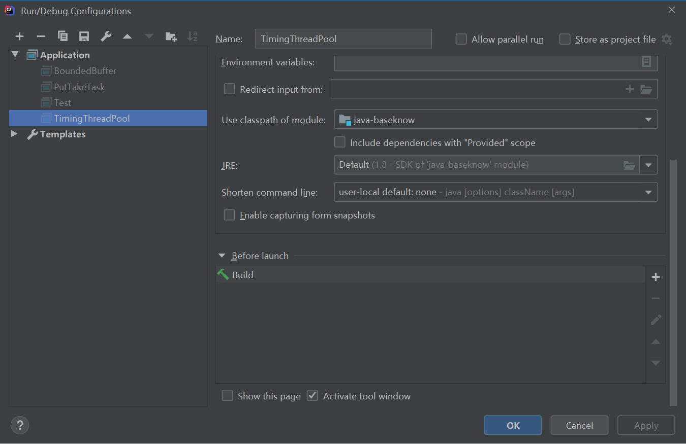
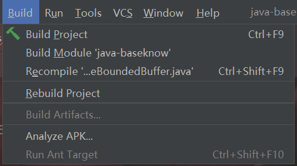
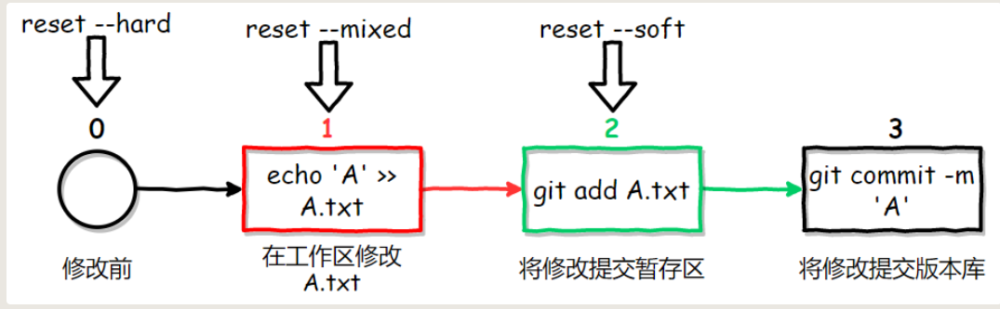

# 常见错误&结论

​																				C：结论，Q：问题，F：有趣的事儿

## C：如何读取当前类路径下的properties


简单例子

配置sso.properties：

```properties
url="hello world"
```


配置文件的读取：

```java
Properties properties = new Properties();
properties.load(this.getClass().getClassLoader().getResourceAsStream("sso.properties"));
String url = (String) properties.get("url");
System.out.println(url);
```

一定要读取到classLoader里面去，估计与类的运行机制有关


## Q：读取application配置文件

引入configuration-processer依赖

```properties
<dependency>
      <groupId>org.springframework.boot</groupId>
      <artifactId>spring-boot-configuration-processor</artifactId>
</dependency>
```

如此时的配置类里面为：

```properties
hello.value=111
```

读取的两种方式：

```java
@ConfigurationProperties("hello")
@Component
@Data
public class ConfigReader {
    Integer value;

    @Value("${hello.value}")
    Integer values;
}

```

第一种将configurationProperties标注在类上，里面的字段是prefix，然后根据字段名自动注入（如果使用这一种方法，写配置文件的时候就会有对应字段的提示（需要先编译一下））（记得要加入Component注解，要不然无法自动注入）

第二种是@Value注解，直接注入相关配置

如果没有这里面的字段就会报错


## Q：拦截器不生效的原因

写好的拦截器（实现HandlerInterceptor接口）一定要进行配置，才能起作用

拦截器：

```java
@Component
public class HelloHandler implements HandlerInterceptor {

    /**
     *  true：放行
     *  false：拦截在当前中（如果是要实现跳转的话就要拦截）
     */
    @Override
    public boolean preHandle(HttpServletRequest request, HttpServletResponse response, Object handler) throws Exception {
        System.out.println("拦截生效");
        return false;
    }
}
```

配置类：

```java
@Configuration
public class InterruptConfig implements WebMvcConfigurer {

    @Autowired
    HelloHandler helloHandler;

    @Override
    public void addInterceptors(InterceptorRegistry registry) {
        registry.addInterceptor(helloHandler).addPathPatterns("/**");
    }
}
```


## C：Java基本类型所占字节数

​	

|  类型   | 存储需求 |
| :-----: | :------: |
|  short  |    2     |
|   int   |    4     |
|  long   |    8     |
|  byte   |    1     |
|  float  |    4     |
| double  |    8     |
|  char   |    2     |
| boolean |    1     |
|         |          |


## C：JDBC的url书写规范

在MySQL8.0之后都要加上时区信息，否则会报错

```
jdbc:mysql://localhost:3306?serverTimezone=UTC
```


## C；数据库中的命名问题

数据库中命名表最好在后面加个s，避免一些不必要的麻烦，比如订单表order，就和MySQL的关键字冲突


## F：套娃式创建对象

在研究JUC的延迟初始化带来的问题的时候想到的

```java
public class Demo4 {

    Demo4 demo4;

    public static void main(String[] args) {
        Demo4 demo4 = new Demo4();
        System.out.println(ObjectSizeCalculator.getObjectSize(demo4));
    }
}
```

就是输出对象占的字节数，刚开始的时候代码是像上面那样写的，没报错，输出为16，删除成员变量之后输出还是16（对象头4字节，Class对象指针4字节，还有对其填充）

把上面代码修改了下，第三行改成`Demo4 demo4 = new Demo4();`

直接报错：

```java
Exception in thread "main" java.lang.StackOverflowError
	at cn.luckycurve.threadsecurity.Demo4.<init>(Demo4.java:7)
	at cn.luckycurve.threadsecurity.Demo4.<init>(Demo4.java:7)
	at cn.luckycurve.threadsecurity.Demo4.<init>(Demo4.java:7)
```

堆栈溢出错误（还蛮有意思的）

**C：仅仅在类中存在一个引用是不占内存的，初始外围对象的时候不会初始里面的对象，需要你手动去new**


## C：SpringBoot的并发性

SpringBoot默认实现了线程池，我们的异步调用就是通过启动线程池中的线程来完成的，具体体验如下

```java
    @GetMapping("/sleep")
    public String sleep() throws InterruptedException {
        System.out.println(Thread.currentThread().getName()+"：开始执行");
        TimeUnit.SECONDS.sleep(100);
        System.out.println(Thread.currentThread().getName()+"：执行完成");
        return "执行完成";
    }
```

同时开了五个窗口：

```java
http-nio-8080-exec-1：开始执行
http-nio-8080-exec-3：开始执行
http-nio-8080-exec-5：开始执行
http-nio-8080-exec-4：开始执行
http-nio-8080-exec-6：开始执行
http-nio-8080-exec-1：执行完成
http-nio-8080-exec-3：执行完成
http-nio-8080-exec-5：执行完成
http-nio-8080-exec-4：执行完成
http-nio-8080-exec-6：执行完成
```

明显的多线程任务


## C：Java数据传输

只有在基本数据类型和其封装类的是传值，在对象和基本数据类型数组都是传输的地址，所以只有基本数据类型需要get和set方法，对象只需要get方法


## C：谨慎操作数组

操作传入进来的数组默认就是操作原数据（传的是地址）

使用Arrays.copyOf()进行复制操作


## C：final修饰全局变量

final修饰全局变量不仅使得基本数据类型和其封装类无法改变数值，数组和类无法改变引用的对象，~~还保证了被修饰的变量的全局可见性~~（原文是只能保证一定的可见性，只能对final对象赋值的时候可以保证其可见性(在生命周期中只有一次机会)），因此就有很多结论：

因为保证类的线程安全性只需要保证：1.操作的原子性，2.可见性

所以当类有如下关系，如果此时类B恰好还是线程安全的，则A可以将他的线程安全性交付给B

```java
Class A {
  private final Class B;
}
```

假设是如下的情况：则需要B，C线程安全并且BC之间没有耦合，可以推而广之

:warning:：这里的耦合关系不是指B，C的物理关系，而是逻辑关系，就像我们做缓存的时候用B做Key，C做Value，BC之间会相互依赖，即不满足这种条件

```java
Class A {
  private final Class B;
  private final Class C;
}
```

不用太纠结final变量的性能，final对性能的影响微乎其微，更何况我们编写程序的时候还是要以安全性优先的


## C：Collections工具类



Collections这几个方法可以返回对应集合的“只读”对象，如果强行修改就会爆`java.lang.UnsupportedOperationException` 错误

使用场景：设计线程安全类时候发布内部非线程安全的对象（前提是这个对象外界不需要修改，如果需要修改就老老实实使用JUC包下的对象）


实现原理（以Map为例子）：返回一个Collections的内部类UnmodefiableMap，里面包含了被private final修饰的刚传入的对象（保证对象可见性，同时避免对象逸出）



方法简单实现是通过将读方法直接调用内部封装的数据的方法，如果涉及到写，则直接抛出异常


## C：ConcurrentModificationException异常

ConcurrentModificationException（同时修改异常）


单线程条件下，以下代码很容易抛出这个异常（Javac会将for-each语法转换成为下面这个类）：

```java
Iterator<String> iterator = list.iterator();
while (iterator.hasNext()) {
  String next = iterator.next();
  if (Objects.equals(next, "hello")) {
    list.remove(next);
  }
}
System.out.println(list);
```

以List为例子，这些类会抛异常或出现一些奇怪的问题：`ArrayList，LinkedList，Collections.synchronizedList` （奇怪的问题就像：如果list里面存储的是`["hello","world"]`就不会报错，`["world","hello","hello"]`不会报错，但是下标为2的hello不会移除（最麻烦的情况，出了问题又不报错）），但使用`CopyOnWriteArrayList` 就不会报错，且情况正常。

> 《Java并发编程实战》中隐式的提出了上述问题的解决方案：替代方法就是“克隆”容器，并在副本上进行迭代，每个线程持有一个独立不发布的副本，也就是CopyOnWriteArrayList的实现思路


ConcurrentModificationException的抛出：



再进去




每次做next判断，都会进行比较，如果不一致则抛出这个异常

但是在多线程环境下可能没有保证List对象的可视性，导致数据滞留不同步


:question: 待续


## C：获取Java虚拟机的可并发线程数


```java
Runtime.getRuntime().availableProcessors();
```

Java文档描述：* Returns the number of processors available to the Java virtual machine.

在写并发程序的时候非常有用，可以最大的利用系统性能（保证同时运行的线程数= 并发线程数+1），让所有线程同时跑起来


## C：包装一个类的写法

新建包装类，让包装类继承被包装类的通用接口，并且把被包装类的实例化对象传入到包装类中称为一个普通字段（如果不是基本数据类型，可以直接声明为private final 保证了对象的不变性和可见性），重写通用接口里的方法（通过调用内部的类来实现）


## C：对FutureTask的理解

FutureTask是Future接口的继承类，需要传入一个Callable的实现类

FutureTask需要手动调用run方法，否则不会运行

调用FutureTask的get方法，如果没有运行过，那么就会阻塞直当线程直到该方法run执行完（如果在此时其他线程没有执行run方法则会一直阻塞）


## C：Map的key和value能否为null

HashMap的Key和Value均可以为null

但是ConcurrentHashMap的Key和value都不能为null


map的put或者是putIfAbsent（如果有的话），都是调用的putVal这个方法，会有一个返回值，返回的是执行操作之前这个key所对应的值。


## C：Try/Catch和throw的区别

在Try/Catch语句结束后，后面的代码仍然会运行，而在throw后面的代码则不会继续运行。


## C：PrintWriter类及注意事项

通常作为日志文件写入类，通过构造方法传入一个File对象即是输出的日志文件的路径，里面有print和println以及write都可以向其中写入字符流，建议使用print和println，因为封装了write方法

> 特别注意：一定要记得关闭流，要不然写入都等于白写，全部都写入到了缓存区


## C：方法调用时的注意事项


最可能碰到的异常便是RuntimeException异常，任何代码都可能抛出该异常

**不要盲目的认为一个方法一定正常返回，或者是抛出一个在方法中已经声明了的异常，对调用的代码越不熟悉，越要保持这种怀疑**


## C：execute和submit方法的区别


- execute只能提交Runnable类型的任务，而submit既可以提交Runnable也可以提交Callable
- execute方法会直接抛出异常，submit方法会将异常封装到返回的future对象里面，使用future的get方法的时候抛出
- execute的顶层接口是Executor，submit的顶层接口是ExecutorService


## C：原子类的默认值

JUC包下的原子类的默认值与基本数据类型的默认值一致

当然，要new，不然就是NULL了

（封装类型new的时候必须赋初值，不new的话默认也是NULL）


## C：Java使用泛型数组

在java中使用泛型数组，需要格外的注意

即使所有的类都能通过向上转型成为Object，但所有类的数组都无法转型到Object（包括基本数据类型封装类数组也是一样）

```java
public class Test<E> {
    //这里因为要做并发，所以使用了final保证可见性
    private final E[] obj;
    private Integer index =0;

    public Test(int length) {
        obj = (E[]) new Object[length];
    }

    public E get() {
        return obj[index++];
    }

    public void put(E e) {
        obj[index] = e;
    }

    //测试
    public static void main(String[] args) {
        Test<Integer> test = new Test<>(10);
        test.put(1);
        System.out.println(test.get());
    }
}
```

错误的使用方法是将obj声明为public，直接让外界使用obj[1] = 1这种方式来存储：

- 不符合封装原则
- 会出现对象转换错误


## C：Java的位移运算

java中有三种移位运算符

<<    :   左移运算符，num << 1,相当于num乘以2

\>>    :   右移运算符，num >> 1,相当于num除以2

\>>>   :   无符号右移，忽略符号位，空位都以0补齐


## C：对系统吞吐量的度量


先要简单的理解几个概念：

- TPS（Transaction Per Second） 每秒的事务数，计算一秒钟（接收到的请求和返回请求）这整个过程（也就称为事务）的个数
- QPS（Query Per Second） 每秒的请求数，每一秒能进行查询的次数

两者之间的区别：

> 例如访问一次网页，该网页可能会进行三次查询（例如查询员id，对应的部门id，对应的企业id），那么在这个过程中就产生了一个T（只有一次返回）和三次Q（三次对系统的查询请求）
>
> QPS类似于TPS
>
> 通常用TPS或者QPS来衡量系统的吞吐量

- 并发数：系统同时处理的事务数目
- 响应时间：一般取平均响应时间


他们之间的关系如下：

TPS(QPS)  =  并发数 /   响应时间

> 对公式的具体分析：
>
> ​	当并发数较小时候，可以通过增加并发数来提升TPS（QPS）
>
> ​	而当并发数上来之后，在提升并发数，会引起激烈的竞争，导致CPU大量的时间处于线程切换中，响应时间必然降低。具体能到达某个数目，就需要看系统的可伸缩性了，如果可伸缩性好，并发数自然上的来，TPS就能增加。

​    ==普遍结论：平均响应时间越短，系统的吞吐量越高==


## Q：for(;;)和while(true)的区别


阅读JDK源码的时候总是看到for(;;)来进行死循环

网上说是执行时候for会少占用一个寄存器，所以源码中大量使用了for（;;）


但自己尝试了下，也许是循环体过于简单，IDEA直接给转换成while语句了，学习源码，使用for(;;)


## C：IDEA单独运行一个类


当执行测试的时候，很有可能其他的类还没有编写完全，而IDEA会同时编译整个项目，导致无法单独运行测试类，解决方法：



在运行配置中删掉BEFORE Launch的Build选项，但在执行之前需要手动Compile以下该类



然后在运行即可


## C：使用封装类型注意事项


一定要手动赋初值，别去相信Java的默认赋初值的机制（虽然很可靠），但是对包装类来说默认的初值是null，一定要避免发生空指针异常。


​	

## C：Git的版本回退



在git的命令行操作中，mixed模式和soft模式需要区别的特别清楚（因为会直接Commit已经add了的文件，取消add文件的唯一方式也就是重置到上一个版本的mixed模式了，add起到了一个选取commit文件的作用）

然而在IDEA里面，即使我add了所有的文件，在commit的时候仍然要勾选需要commit的文件（换句话说，可以直接去掉add这个步骤了，因为使用了GUI交互界面来代替了add操作），所以对于IDEA等GUI来说，重置到mixed和soft版本是一样的，不受add的约束


当出现冲突的时候，会有Merge和Rebase选项

- Merge：新建一个分支存储你的推送版本
- Rebase：合并远程到你的本地来