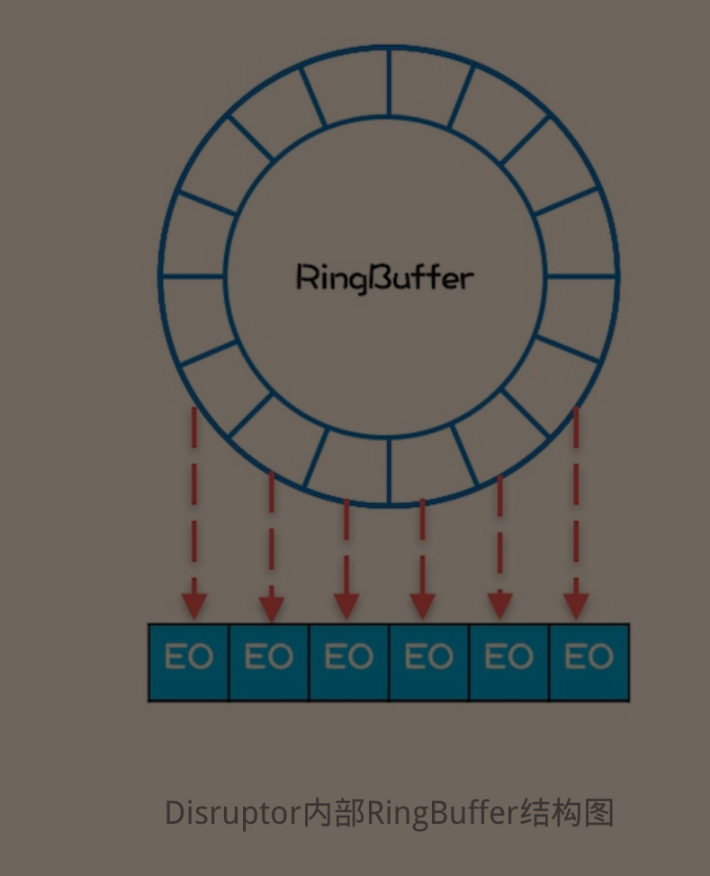

# 常见错误&结论

​																				C：结论，Q：问题，F：有趣的事儿

## C：如何读取当前类路径下的properties


简单例子

配置sso.properties：

```properties
url="hello world"
```


配置文件的读取：

```java
Properties properties = new Properties();
properties.load(this.getClass().getClassLoader().getResourceAsStream("sso.properties"));
String url = (String) properties.get("url");
System.out.println(url);
```

一定要读取到classLoader里面去，估计与类的运行机制有关

> 更好用的一种方式（Spring项目）：参考玩转Spring全家桶的SpringBoot部分


## Q：读取application配置文件

引入configuration-processer依赖

```properties
<dependency>
      <groupId>org.springframework.boot</groupId>
      <artifactId>spring-boot-configuration-processor</artifactId>
</dependency>
```

如此时的配置类里面为：

```properties
hello.value=111
```

读取的两种方式：

```java
@ConfigurationProperties("hello")
@Component
@Data
public class ConfigReader {
    Integer value;

    @Value("${hello.value}")
    Integer values;
}

```

第一种将configurationProperties标注在类上，里面的字段是prefix，然后根据字段名自动注入（如果使用这一种方法，写配置文件的时候就会有对应字段的提示（需要先编译一下））（记得要加入Component注解，要不然无法自动注入）

第二种是@Value注解，直接注入相关配置

如果没有这里面的字段就会报错


## Q：拦截器不生效的原因

写好的拦截器（实现HandlerInterceptor接口）一定要进行配置，才能起作用

拦截器：

```java
@Component
public class HelloHandler implements HandlerInterceptor {

    /**
     *  true：放行
     *  false：拦截在当前中（如果是要实现跳转的话就要拦截）
     */
    @Override
    public boolean preHandle(HttpServletRequest request, HttpServletResponse response, Object handler) throws Exception {
        System.out.println("拦截生效");
        return false;
    }
}
```

配置类：

```java
@Configuration
public class InterruptConfig implements WebMvcConfigurer {

    @Autowired
    HelloHandler helloHandler;

    @Override
    public void addInterceptors(InterceptorRegistry registry) {
        registry.addInterceptor(helloHandler).addPathPatterns("/**");
    }
}
```


小结论：拦截器是在参数校验之前完成的


## C：Java基本类型所占字节数

​	

|   类型    |              存储需求              |
| :-------: | :--------------------------------: |
|   short   |                 2                  |
|    int    |                 4                  |
|   long    |                 8                  |
|   byte    |                 1                  |
|   float   |                 4                  |
|  double   |                 8                  |
|   char    |                 2                  |
|  boolean  |                 1                  |
| Reference | 开启指针压缩为4（默认），不开启为8 |
|           |                                    |


## C：JDBC的url书写规范

在MySQL8.0之后都要加上时区信息，否则会报错

```
jdbc:mysql://localhost:3306/test?serverTimezone=UTC
```


## C；数据库中的命名问题

数据库中命名表最好在后面加个s，避免一些不必要的麻烦，比如订单表order，就和MySQL的关键字冲突


## F：套娃式创建对象

在研究JUC的延迟初始化带来的问题的时候想到的

```java
public class Demo4 {

    Demo4 demo4;

    public static void main(String[] args) {
        Demo4 demo4 = new Demo4();
        System.out.println(ObjectSizeCalculator.getObjectSize(demo4));
    }
}
```

就是输出对象占的字节数，刚开始的时候代码是像上面那样写的，没报错，输出为16，删除成员变量之后输出还是16（对象头4字节，Class对象指针4字节，还有对其填充）

把上面代码修改了下，第三行改成`Demo4 demo4 = new Demo4();`

直接报错：

```java
Exception in thread "main" java.lang.StackOverflowError
	at cn.luckycurve.threadsecurity.Demo4.<init>(Demo4.java:7)
	at cn.luckycurve.threadsecurity.Demo4.<init>(Demo4.java:7)
	at cn.luckycurve.threadsecurity.Demo4.<init>(Demo4.java:7)
```

堆栈溢出错误（还蛮有意思的）

**C：仅仅在类中存在一个引用是不占内存的，初始外围对象的时候不会初始里面的对象，需要你手动去new**


## C：SpringBoot的并发性

实际上是依赖于Tomcat的线程池

SpringBoot默认实现了线程池，我们的异步调用就是通过启动线程池中的线程来完成的，具体体验如下

```java
    @GetMapping("/sleep")
    public String sleep() throws InterruptedException {
        System.out.println(Thread.currentThread().getName()+"：开始执行");
        TimeUnit.SECONDS.sleep(100);
        System.out.println(Thread.currentThread().getName()+"：执行完成");
        return "执行完成";
    }
```

同时开了五个窗口：

```java
http-nio-8080-exec-1：开始执行
http-nio-8080-exec-3：开始执行
http-nio-8080-exec-5：开始执行
http-nio-8080-exec-4：开始执行
http-nio-8080-exec-6：开始执行
http-nio-8080-exec-1：执行完成
http-nio-8080-exec-3：执行完成
http-nio-8080-exec-5：执行完成
http-nio-8080-exec-4：执行完成
http-nio-8080-exec-6：执行完成
```

明显的多线程任务


## C：Java数据传输

只有在基本数据类型和其封装类的是传值，在对象和基本数据类型数组都是传输的地址，所以只有基本数据类型需要get和set方法，对象只需要get方法


## C：谨慎操作数组

操作传入进来的数组默认就是操作原数据（传的是地址）

使用Arrays.copyOf()进行复制操作


## C：final修饰全局变量

final修饰全局变量不仅使得基本数据类型和其封装类无法改变数值，数组和类无法改变引用的对象，~~还保证了被修饰的变量的全局可见性~~（原文是只能保证一定的可见性，只能对final对象赋值的时候可以保证其可见性(在生命周期中只有一次机会)），因此就有很多结论：

因为保证类的线程安全性只需要保证：1.操作的原子性，2.可见性

所以当类有如下关系，如果此时类B恰好还是线程安全的，则A可以将他的线程安全性交付给B

```java
Class A {
  private final Class B;
}
```

假设是如下的情况：则需要B，C线程安全并且BC之间没有耦合，可以推而广之

:warning:：这里的耦合关系不是指B，C的物理关系，而是逻辑关系，就像我们做缓存的时候用B做Key，C做Value，BC之间会相互依赖，即不满足这种条件

```java
Class A {
  private final Class B;
  private final Class C;
}
```

不用太纠结final变量的性能，final对性能的影响微乎其微，更何况我们编写程序的时候还是要以安全性优先的


## C：Collections工具类


Collections这几个方法可以返回对应集合的“只读”对象，如果强行修改就会爆`java.lang.UnsupportedOperationException` 错误

使用场景：设计线程安全类时候发布内部非线程安全的对象（前提是这个对象外界不需要修改，如果需要修改就老老实实使用JUC包下的对象）


实现原理（以Map为例子）：返回一个Collections的内部类UnmodefiableMap，里面包含了被private final修饰的刚传入的对象（保证对象可见性，同时避免对象逸出）


方法简单实现是通过将读方法直接调用内部封装的数据的方法，如果涉及到写，则直接抛出异常


## C：ConcurrentModificationException异常

ConcurrentModificationException（同时修改异常）


单线程条件下，以下代码很容易抛出这个异常（Javac会将for-each语法转换成为下面这个类）：

```java
Iterator<String> iterator = list.iterator();
while (iterator.hasNext()) {
  String next = iterator.next();
  if (Objects.equals(next, "hello")) {
    list.remove(next);
  }
}
System.out.println(list);
```

以List为例子，这些类会抛异常或出现一些奇怪的问题：`ArrayList，LinkedList，Collections.synchronizedList` （奇怪的问题就像：如果list里面存储的是`["hello","world"]`就不会报错，`["world","hello","hello"]`不会报错，但是下标为2的hello不会移除（最麻烦的情况，出了问题又不报错）），但使用`CopyOnWriteArrayList` 就不会报错，且情况正常。

> 《Java并发编程实战》中隐式的提出了上述问题的解决方案：替代方法就是“克隆”容器，并在副本上进行迭代，每个线程持有一个独立不发布的副本，也就是CopyOnWriteArrayList的实现思路


ConcurrentModificationException的抛出：


再进去


每次做next判断，都会进行比较，如果不一致则抛出这个异常

但是在多线程环境下可能没有保证List对象的可视性，导致数据滞留不同步


:question: 待续


## C：获取Java虚拟机的可并发线程数


```java
Runtime.getRuntime().availableProcessors();
```

Java文档描述：* Returns the number of processors available to the Java virtual machine.

在写并发程序的时候非常有用，可以最大的利用系统性能（保证同时运行的线程数= 并发线程数+1），让所有线程同时跑起来


## C：包装一个类的写法

新建包装类，让包装类继承被包装类的通用接口，并且把被包装类的实例化对象传入到包装类中称为一个普通字段（如果不是基本数据类型，可以直接声明为private final 保证了对象的不变性和可见性），重写通用接口里的方法（通过调用内部的类来实现）


## C：对FutureTask的理解

FutureTask是Future接口的继承类，需要传入一个Callable的实现类

FutureTask需要手动调用run方法，否则不会运行

调用FutureTask的get方法，如果没有运行过，那么就会阻塞直当线程直到该方法run执行完（如果在此时其他线程没有执行run方法则会一直阻塞）


## C：Map的key和value能否为null

HashMap的Key和Value均可以为null

但是ConcurrentHashMap的Key和value都不能为null

HashTable的key可以为null，value不能

其余的Map都不能为null

在知识点汇总的并发容器中有详细的总结

map的put或者是putIfAbsent（如果有的话），都是调用的putVal这个方法，会有一个返回值，返回的是执行操作之前这个key所对应的值。


## C：Try/Catch和throw的区别

在Try/Catch语句结束后，后面的代码仍然会运行，而在throw后面的代码则不会继续运行。


## C：PrintWriter类及注意事项

通常作为日志文件写入类，通过构造方法传入一个File对象即是输出的日志文件的路径，里面有print和println以及write都可以向其中写入字符流，建议使用print和println，因为封装了write方法

> 特别注意：一定要记得关闭流，要不然写入都等于白写，全部都写入到了缓存区


## C：方法调用时的注意事项


最可能碰到的异常便是RuntimeException异常，任何代码都可能抛出该异常

**不要盲目的认为一个方法一定正常返回，或者是抛出一个在方法中已经声明了的异常，对调用的代码越不熟悉，越要保持这种怀疑**


## C：execute和submit方法的区别


- execute只能提交Runnable类型的任务，而submit既可以提交Runnable也可以提交Callable
- execute方法会直接抛出异常，submit方法会将异常封装到返回的future对象里面，使用future的get方法的时候抛出
- execute的顶层接口是Executor，submit的顶层接口是ExecutorService


## C：原子类的默认值

JUC包下的原子类的默认值与基本数据类型的默认值一致

当然，要new，不然就是NULL了

（封装类型new的时候必须赋初值，不new的话默认也是NULL）


## C：Java使用泛型数组

在java中使用泛型数组，需要格外的注意

即使所有的类都能通过向上转型成为Object，但所有类的数组都无法转型到Object（包括基本数据类型封装类数组也是一样）

```java
public class Test<E> {
    //这里因为要做并发，所以使用了final保证可见性
    private final E[] obj;
    private Integer index =0;

    public Test(int length) {
        obj = (E[]) new Object[length];
    }

    public E get() {
        return obj[index++];
    }

    public void put(E e) {
        obj[index] = e;
    }

    //测试
    public static void main(String[] args) {
        Test<Integer> test = new Test<>(10);
        test.put(1);
        System.out.println(test.get());
    }
}
```

错误的使用方法是将obj声明为public，直接让外界使用obj[1] = 1这种方式来存储：

- 不符合封装原则
- 会出现对象转换错误


## C：Java的位移运算

java中有三种移位运算符

<<    :   左移运算符，num << 1,相当于num乘以2

\>>    :   右移运算符，num >> 1,相当于num除以2

\>>>   :   无符号右移，忽略符号位，空位都以0补齐


## C：对系统吞吐量的度量


先要简单的理解几个概念：

- TPS（Transaction Per Second） 每秒的事务数，计算一秒钟（接收到的请求和返回请求）这整个过程（也就称为事务）的个数
- QPS（Query Per Second） 每秒的请求数，每一秒能进行查询的次数

两者之间的区别：

> 例如访问一次网页，该网页可能会进行三次查询（例如查询员id，对应的部门id，对应的企业id），那么在这个过程中就产生了一个T（只有一次返回）和三次Q（三次对系统的查询请求）
>
> QPS类似于TPS
>
> 通常用TPS或者QPS来衡量系统的吞吐量

- 并发数：系统同时处理的事务数目
- 响应时间：一般取平均响应时间


他们之间的关系如下：

TPS(QPS)  =  并发数 /   响应时间

> 对公式的具体分析：
>
> ​	当并发数较小时候，可以通过增加并发数来提升TPS（QPS）
>
> ​	而当并发数上来之后，在提升并发数，会引起激烈的竞争，导致CPU大量的时间处于线程切换中，响应时间必然降低。具体能到达某个数目，就需要看系统的可伸缩性了，如果可伸缩性好，并发数自然上的来，TPS就能增加。

​    ==普遍结论：平均响应时间越短，系统的吞吐量越高==


## Q：for(;;)和while(true)的区别


阅读JDK源码的时候总是看到for(;;)来进行死循环

网上说是执行时候for会少占用一个寄存器，所以源码中大量使用了for（;;）


但自己尝试了下，也许是循环体过于简单，IDEA直接给转换成while语句了，学习源码，使用for(;;)


## C：使用封装类型注意事项


一定要手动赋初值，别去相信Java的默认赋初值的机制（虽然很可靠），但是对包装类来说默认的初值是null，一定要避免发生空指针异常。


​	

## C：Git的版本回退


在git的命令行操作中，mixed模式和soft模式需要区别的特别清楚（因为会直接Commit已经add了的文件，取消add文件的唯一方式也就是重置到上一个版本的mixed模式了，add起到了一个选取commit文件的作用）

然而在IDEA里面，即使我add了所有的文件，在commit的时候仍然要勾选需要commit的文件（换句话说，可以直接去掉add这个步骤了，因为使用了GUI交互界面来代替了add操作），所以对于IDEA等GUI来说，重置到mixed和soft版本是一样的，不受add的约束


当出现冲突的时候，会有Merge和Rebase选项

- Merge：新建一个分支存储你的推送版本
- Rebase：合并远程到你的本地来


## C：Spring静态变量注入

Demo：

```java
@component
class UserServiceTest {

    static UserService userService;

    @Autowired
    public void setUserService(UserService userService) {
        UserServiceTest.userService = userService;
    }
}
```

Set注入：要加上Component注解，让SpringBoot扫描到该类，并通过Set方法注入，直接注入无效


## C：Eden：Survivor=8:1

我们知道，默认情况下Eden：Survivor=8:1，我们也知道

基于前面的标记，复制算法的改良版，新生代里面有两个Survivor

Eden：两个Survivor = 4:1

同一时间新生代只会存在一个Eden和一个Survivor，所以用JConsole统计出的Survivor只是一个。


## C：ReentrantLock的tryLock方法


tryLock方法获取锁与Synchronized获取锁最大的区别就是：tryLock是一个瞬间的动作，如果无法获取，就直接返回false，不会像Synchronized一样阻塞

锁的标准用法（==不是tryLock的，这里的lock类似于Synchronized获取锁，也会阻塞==）

```java
lock.lock();
try{
    //do something
} finally {
    lock.unlock();
}
```

使用tryLock不会造成死锁问题：因为不会造成线程阻塞。

但是会造成活锁问题：两个线程，都持有对方需要获取的资源，同时请求，一直失败，一直重试。


## C：axios发送请求默认不携带cookie


## C：MySQL里的varchar默认是“”，不是NULL


## C：传输二进制文件（如MultipartFile）使用POST


## C：JSR-303 Valid的几个常用注解区别


```
String name = null;
@NotNull: false
@NotEmpty: false
@NotBlank: false

String name = "";
@NotNull: true
@NotEmpty: false
@NotBlank: false

String name = " ";
@NotNull: true
@NotEmpty: true
@NotBlank: false

String name = "Great answer!";
@NotNull: true
@NotEmpty: true
@NotBlank: true
```

```
一、常用的校验注解
（1）常用标签
@Null  被注释的元素必须为null
@NotNull  被注释的元素不能为null
@AssertTrue  被注释的元素必须为true
@AssertFalse  被注释的元素必须为false
@Min(value)  被注释的元素必须是一个数字，其值必须大于等于指定的最小值
@Max(value)  被注释的元素必须是一个数字，其值必须小于等于指定的最大值
@DecimalMin(value)  被注释的元素必须是一个数字，其值必须大于等于指定的最小值
@DecimalMax(value)  被注释的元素必须是一个数字，其值必须小于等于指定的最大值
@Size(max,min)  被注释的元素的大小必须在指定的范围内。
@Digits(integer,fraction)  被注释的元素必须是一个数字，其值必须在可接受的范围内
@Past  被注释的元素必须是一个过去的日期
@Future  被注释的元素必须是一个将来的日期
@Pattern(value) 被注释的元素必须符合指定的正则表达式。
@Email 被注释的元素必须是电子邮件地址
@Length 被注释的字符串的大小必须在指定的范围内
@NotEmpty  被注释的字符串必须非空
@Range  被注释的元素必须在合适的范围内
```


## C：Lombok注解


@RequiredArgsConstructor：会为被@NotNull和被final标注的字段生成构造函数

@Data = @Getter + @Setter + @Equals + @EqualsAndHashCode + @ToString + @RequiredArgsConstructor


## C:：Spring Boot项目导入一个XML配置文件


最简单的办法就是在配置类头上加上`@ImportResources("classpath:/filewriter-config.xml")`即可。

在使用mybatis的时候一定要指定`spring.mapper-location`，没有默认值的

并且如果使用到注解的话一定要开启驼峰命名规则


## Q：为什么Java接口中的方法都没有声明成public


因为Java接口中的方法默认被public abstract修饰，所以不用显式的声明方法为public的，如果都需要显式的声明反而还很容易出错。


## C：线程中如果没有处理Interrupt标志位的代码，则线程不会响应Interrupt方法


Interrupt方法也是将线程从阻塞中唤醒的方法，**如果仅仅只是为了做到控制线程的执行，建议设置自己的标志位，不要去与默认的Interrupt标志位重合了**


## C：Spring Boot Configuration Processor的作用


在书写完对应的@ConfigurationProperties注解类，并将项目编译后

可以在target/classes/META-INF下面发现一个JSON文件，以供书写application配置文件的时候自动补全使用


## C：当考虑到BlockingQueue的效率问题

Java SDK提供的两个BlockingQueue——ArrayBlockingQueue和LinkedBlockingQueue，都是基于ReentrantLock来实现了，在高并发场景下效率不高，可以使用替代品Disruptor项目

Disruptor主要是尽量将数据存储在一起，以便最大限度的利用CPU的Cache组件（在读取的时候会将附近的数据也读取进Cache以减少内存的访问次数，从而提升）




RingBuffer可以复用

Disruptor在优化并发性能方面可谓是做到了极致，优化的思路大体是两个方面，一个是利用无锁算法避免锁的争用，另外一个则是将硬件（CPU）的性能发挥到极致。尤其是后者，在Java领域基本上属于经典之作了。


## C：SpringBoot的日志格式

默认格式为：

```yaml
logging:
  pattern:
    console: '%d{yyyy-MMM-dd HH:mm:ss.SSS} %-5level [%thread] %logger{15} - %msg%n'
```

可以直接修改，但是命令行输出的日志颜色好像就没了


## C：线程与协程


协程可以简单地理解为一种轻量级的线程

从操作系统的角度看，线程是在内核态中调度的，而协程是在用户态调度的，因此协程的成本更低，但Java不支持协程，或许后期会支持，Loom项目正在支持协程。

协程可以非常好的支持ThreadPreMessage模式，为每个Message都分配一个协程，源于协程的低成本。

为什么Java中大部分都需要设计出异步非阻塞模型呢？因为同步处理意味着等待，而线程级别的等待本身就是一种很大的浪费，但是协程级别的等待则显得无足轻重了，协程的第二个应用场景：同步非阻塞模型

支持协程的语言有：GoLang，Python，Lua，Koltin等等

> 《Java并发编程实战》这个专栏中作者说道：每次写完Golang代码，就再也不想写Java代码了，可以了解下Golang的语法格式：


## C：使用Redis做Cache缓存结果想要JSON格式

困扰了很久的一个问题，尝试了几次：


先直接给最终配置：

```java
@EnableCaching
@Configuration
public class SerializableConfiguration extends CachingConfigurerSupport {

    @Bean
    public RedisTemplate<String, Object> redisTemplate(RedisConnectionFactory redisConnectionFactory) {
        Jackson2JsonRedisSerializer serializer = new Jackson2JsonRedisSerializer(Object.class);

        RedisTemplate<String, Object> redisTemplate = new RedisTemplate<>();
        //就直接全部都使用Jackson2JSON了
        redisTemplate.setDefaultSerializer(serializer);
        redisTemplate.setConnectionFactory(redisConnectionFactory);
        return redisTemplate;
    }

    @Bean
    public RedisCacheManager redisCacheManager(RedisTemplate redisTemplate) {
        RedisCacheWriter redisCacheWriter = RedisCacheWriter.nonLockingRedisCacheWriter(redisTemplate.getConnectionFactory());
        RedisCacheConfiguration redisCacheConfiguration = RedisCacheConfiguration.defaultCacheConfig()
                .serializeValuesWith(RedisSerializationContext.SerializationPair.fromSerializer(redisTemplate.getValueSerializer()));
        return new RedisCacheManager(redisCacheWriter, redisCacheConfiguration);
    }


    /**
     * 与上面的RedisCacheManager二选一，都可以实现序列化的功能
     * 但是反序列化可能会失败，如Money对象，Jackson2JsonRedisSerializer就不知道怎么反序列化了
     */
    //@Bean
    //public RedisCacheConfiguration redisCacheConfiguration() {
    //    Jackson2JsonRedisSerializer serializer = new Jackson2JsonRedisSerializer(Object.class);
    //    ObjectMapper objectMapper = new ObjectMapper();
    //    objectMapper.setVisibility(PropertyAccessor.ALL, JsonAutoDetect.Visibility.ANY);
    //    objectMapper.enableDefaultTyping(ObjectMapper.DefaultTyping.NON_FINAL);
    //    serializer.setObjectMapper(objectMapper);
    //    return RedisCacheConfiguration.defaultCacheConfig().serializeValuesWith(RedisSerializationContext.SerializationPair.fromSerializer(serializer));
    //}
}
 
```


先前一直在尝试根据autoconfig包中的data/redis的RedisAutoConfiguration这个类，模仿这个类的redisTemplate和stringRedisTemplate方法，返回特定的Template，也测试了，Template存储的是JSON数据，但是使用注解标注的cache存储始终都是二进制码，最后还是百度去了~

可以参考autoconfig包下的cache的RedisCacheConfiguration类来实现

最开始就不应该跑到data包下面去的，毕竟是使用Spring的缓存抽象而不是直接操作Redis

还存在大量的类型转换错误需要处理，毕竟使用了Jackson2JSON的序列化工具代替了JDK默认的序列化工具，JDK默认的序列化工具则提供了完整的规则，无论是类库中存在的类还是自定义类都是一样的。


## C：Spring的Banner的玩法


配置文件：

```yaml
#是否关闭，关闭则为off
spring:
  main:
    banner-mode: console

#指定banner代替默认banner
  banner:
    location: classpath:/banner.txt

```


## C：数组之间的类型转换直接使用Arrays工具类

示例代码如下：

```java
Object[] array = IntStream.range(0, 20).boxed().toArray();
Integer[] integers = Arrays.copyOf(array, array.length, Integer[].class);
```


## C：关于Java8对Lambda表达式的支持


函数式库：java.util.function下的所有接口都是支持FunctionalInterface


## F：Java8的默认方法

如果一个类继承两个接口，两个接口都定义了相同的签名的默认方法实现，即以下这种情况，会怎么样呢？

```java
public interface Interface1 {
    default String hello() {
        return "Interface1:hello";
    }
}

public interface Interface2 {
    default String hello() {
        return "Interface2:hello";
    }
}

/**
*	指定ImplTest继承的是Interface1的方法
*/
public class ImplTest implements Interface1,Interface2 {

    public static void main(String[] args) {
        new ImplTest().hello();
    }

    @Override
    public String hello() {
        return Interface1.super.hello();
    }
}
```

编译器会强制要求ImplTest手动实现hello方法

如果修改其中一个接口的方法签名，例如在Interface1接口中的方法中增加一个参数，就会使得其可进行编译。


## C：如何让线程池不会阻塞主线程的关闭


前提是在主线程结尾处不用去调用线程池的shutdown方法：

在创建线程池的时候指定ThreadFactory，让每个线程都使用守护线程，使得不会阻止程序的关闭，使用如下：

```java
public static Executor getExecutor(Integer number) {
    return Executors.newFixedThreadPool(Math.min(number, THREAD_MAX), r -> {
        Thread thread = new Thread(r);
        //使用守护线程，防止线程池阻止主线程关闭
        thread.setDaemon(true);
        return thread;
    }
                                       );
}
```


## C：@Qualifier注解注入失败


默认值就变成null了，可以使用JSR标准的注解@Resource就可以解决了。@Qualifier是由Spring提供的一个注解

也有可能只是个例，反正注入`String[]`属性的时候没有成功


小技巧：可以直接使用如下代码查看IoC容器中的所有bean

```java
@Autowired
ApplicationContext container;

String[] names = container.getBeanDefinitionNames();
for (String name : names) {
    System.out.println(name);
}
```


# IDEA问题&结论


## C：IDEA快捷键


|           操作           |   快捷键   |
| :----------------------: | :--------: |
|     查找当前类的方法     |  Ctrl+F12  |
| 查看源码时候，返回上一级 | Ctrl+Alt+← |
|     清除无效的import     | Ctrl+Alt+O |
|    查看方法的doc文档     |   Ctrl+Q   |
|                          |            |
|                          |            |
|                          |            |
|                          |            |
|                          |            |


## C：IDEA单独运行一个类


当执行测试的时候，很有可能其他的类还没有编写完全，而IDEA会同时编译整个项目，导致无法单独运行测试类，解决方法：


在运行配置中删掉BEFORE Launch的Build选项，但在执行之前需要手动Compile以下该类


然后在运行即可


## C：Spring Initialize Timeout Error


在IDEA里面使用spring initialize创建项目时候报错创建超时/连接失败


改HTTP Proxy的链接方式为Auto-detect proxy settings，再点击下面的check Connection测试能否连到spring的start io


## C：同时启动一个Spring项目多次


在Spring Cloud的测试过程中会非常的有用。

主要是利用IDEA提供的允许类并行启动（右上角按钮）：


和Spring指定运行时候的配置类（防止端口冲突）


单独创建一个配置类application-dev.yaml并修改默认的运行端口。


先启动一个类，不指定运行参数

在指定运行参数，第二次启动当前类即可。

弊端：有一个启动类的动态加载无法使用，即spring-devtools无效了

~~但是启动测试类就不会有这个问题，因为启动类默认无法指定应用参数~~

==测试类是不会占用端口号的==

且配置文件之间的关系只是：如果你指定了运行环境为dev，那么会以application-dev.yaml为主（即两处地方都出现，就以dev为准，如果application-dev.yml没出现的，依然会使用application.yaml。即不会忽视application.yaml，只是降低了优先级而已）


# 项目问题


## Q：MVC 的类型转换


解决办法：

第一步，增加一个转换器将String转换成LocalDateTime，规定转换格式：

```java
public class DateConverter implements Converter<String, LocalDateTime> {

    @Override
    public LocalDateTime convert(String s) {
        if ("".equals(s)) {
            return null;
        }
        LocalDate parse = LocalDate.parse(s, DateTimeFormatter.ofPattern("yyyy-MM-dd"));
        return parse.atStartOfDay();
    }
}
```

第二步

一、被坑了，少用，在MVC中配置（继承WebMvcConfigurationSupport会导致自动配置失效，很多静态页面无法访问，例如访问Swagger的doc.html，就需要大量配置）：

```java
@Configuration
public class WebMvcConfig extends WebMvcConfigurationSupport {

    //取代默认配置，不得不带上大量配置
    @Override
    public void addResourceHandlers(ResourceHandlerRegistry registry) {
        registry.addResourceHandler("/**").addResourceLocations(
                "classpath:/static/");
        registry.addResourceHandler("doc.html").addResourceLocations(
                "classpath:/META-INF/resources/");
        registry.addResourceHandler("/webjars/**").addResourceLocations(
                "classpath:/META-INF/resources/webjars/");
        super.addResourceHandlers(registry);
    }

    @Override
    protected void addFormatters(FormatterRegistry registry) {
        registry.addConverter(new DateConverter());
        super.addFormatters(registry);
    }
}
```

二、实现WebMvcConfigurer，不会去覆盖默认配置

```java
@Configuration
public class WebMvcConfig implements WebMvcConfigurer {

    @Override
    public void addFormatters(FormatterRegistry registry) {
        registry.addConverter(new DateConverter());
    }
}

```


即可完成


原文链接：https://blog.csdn.net/QuedYin/article/details/90547444


## Q：需要接收一个List，Swagger无法显示


在参数前面使用@RequestBody进行标识即可。默认是@RequestParam


## Q：检查注解@NotNull显示找不到了


解决办法：

应该是Spring Boot 2.3.0的时候单独拿出来了，需要新导入：

```xml
<dependency>
    <groupId>org.springframework.boot</groupId>
    <artifactId>spring-boot-starter-validation</artifactId>
</dependency>
```

上面也标注了需要引入这个Starter去支持JSR-303


## Q：Git新建分支


指令如下：

```
1) 切换到基础分支，如主干

git checkout master

2）创建并切换到新分支

git checkout -b panda

git branch可以看到已经在panda分支上

3)更新分支代码并提交

git add *

git commit -m "init panda"

git push origin panda

4)在git代码管理界面经可以看到panda分支了，成功~~
```


## Q：MVC参数映射问题

问题描述

```java
public JsonWrapper<Boolean> annoMessageUnit(List<Integer> unitId, AnnoMessageInfo info);
```

unitId始终不能从请求中映射不到值

解决方案（在前面加上`@RequestParam注解即可`）：

```java
public JsonWrapper<Boolean> annoMessageUnit(@RequestParam(name = "unitId") List<Integer> unitId, AnnoMessageInfo info) {

```

测试时候直接写`1,2,3`就可以了，写成`[1,2,3]`会出错。


## C：Mybatis Plus的or具有短路性


如使用`wrapper.eq("column1",1).or.eq("column2",2).eq("column3".3)`

实际的查询效果是：`where (column1=1 or column2 = 2) and column3 = 3`

仅仅只会作用于紧接着的下一个方法

如果想要进行这种查询 `where column1 = 1 or (column2 = 2 and column3 = 3)`

这种情况下默认先进行的是and操作，然后才进行or操作，但由于Mybatis Plus的短路性导致了操作的畸形，解决办法：

`wrapper.eq("column1",1).or(i -> i.eq("column2",2).eq("column3",3))`

> 直接这样理解，MyBatis Plus不会去管and 和 or的运算顺序，他只会从左到右进行简单的逻辑拼接并消除SQL的优先关系（估计是使用了括号）


> 使用QueryWrapper的时候尽量使用它的Lambda模式，避免硬编码


Mybatis Plus 的几个好Demo：

掘金（想当于是helloworld）：https://juejin.im/post/5d35359c5188257f3850d763

GitHub（整合各种场景）：https://github.com/baomidou/mybatis-plus-samples


## C：可以直接监控项目了


引入Admin Client starter

写入如下配置文件：

```yaml
management:
  endpoint:
    health:
      show-details: always
  endpoints:
    web:
      exposure:
        include: "*"
spring:
  application:
    name: test-client

  boot:
    admin:
      client:
        url: http://www.luckycurve.cn:8090

hello:
  test: "health2"


#自定义一些INFO信息
info:
  app:
    author: LuckyCurve
    # 这个高级
    encoding: @project.build.sourceEncoding@
```

要保证当前实例可以在公网上访问到，因为云端的Admin Server会一直发送请求来获取服务器的运行状态


扩展：

在其中引入Security模块防止Admin被随意访问

这样裸奔是不太安全，可以在服务端引入spring-boot-starter-security组件并制定用户名密码才能访问

> 如果有页面呈现的话就建议引入web组件了，因为现在默认会使用netty，而大量的框架包括Spring自身对netty的支持都不是太好，会报一些错误


总的流程如下：

服务端：

- 依赖

```xml
<dependency>
    <groupId>de.codecentric</groupId>
    <artifactId>spring-boot-admin-starter-server</artifactId>
</dependency>
<dependency>
    <groupId>org.springframework.boot</groupId>
    <artifactId>spring-boot-starter-web</artifactId>
</dependency>
<dependency>
    <groupId>org.springframework.boot</groupId>
    <artifactId>spring-boot-starter-security</artifactId>
</dependency>
```

- 配置文件application.yaml

```yaml
server:
  port: 8090

spring:
  security:
    user:
      name: luckycurve
      password: 123456
```

- 配置类（集成在了主程序上，顺带展示EnableAdminServer注解）

```java
@SpringBootApplication
@EnableAdminServer
public class ActuatorAdminApplication extends WebSecurityConfigurerAdapter {

    @Autowired
    AdminServerProperties adminServerProperties;

    public static void main(String[] args) {
        SpringApplication.run(ActuatorAdminApplication.class, args);
    }


    /**
     * 安全设置，暴露一些端口给Client
     */
    @Override
    protected void configure(HttpSecurity http) throws Exception {
        String adminContextPath = adminServerProperties.getContextPath();

        SavedRequestAwareAuthenticationSuccessHandler successHandler = new SavedRequestAwareAuthenticationSuccessHandler();
        successHandler.setTargetUrlParameter("redirectTo");
        successHandler.setDefaultTargetUrl(adminContextPath + "/");

        http.authorizeRequests()
                .antMatchers(adminContextPath + "/assets/**").permitAll()
                .antMatchers(adminContextPath + "/login").permitAll()
                .anyRequest().authenticated()
                .and()
                .formLogin().loginPage(adminContextPath + "/login").successHandler(successHandler).and()
                .logout().logoutUrl(adminContextPath + "/logout").and()
                .httpBasic().and()
                .csrf()
                .csrfTokenRepository(CookieCsrfTokenRepository.withHttpOnlyFalse())
                .ignoringAntMatchers(
                        adminContextPath + "/instances",
                        adminContextPath + "/actuator/**"
                );
    }
}

```


客户端：

- 依赖

```xml
<dependency>
    <groupId>de.codecentric</groupId>
    <artifactId>spring-boot-admin-starter-client</artifactId>
    <version>2.2.3</version>
</dependency>
<dependency>
    <groupId>org.springframework.boot</groupId>
    <artifactId>spring-boot-starter-web</artifactId>
</dependency>
```

- 配置文件

```yaml
management:
  endpoint:
    health:
      show-details: always
  endpoints:
    web:
      exposure:
        include: "*"
spring:
  application:
    name: test-client

  boot:
    admin:
      client:
#        url: http://www.luckycurve.cn:8090
        url: http://localhost:8090
        username: luckycurve
        password: 123456


hello:
  test: "health"


#自定义一些INFO信息
info:
  app:
    author: LuckyCurve
    # 这个高级
    encoding: @project.build.sourceEncoding@
```

- 主类：没什么需要加的
- 自定义指标监视器（在health中可以看到）

```java
/**
 * @author LuckyCurve
 * @date 2020/7/14 15:47
 * 自定义检查
 */
@Component
public class MyIndicator implements HealthIndicator {

    @Value("${hello.test}")
    private String test;

    @Override
    public Health health() {
        Health health;
        if (Objects.equals("health",test)) {
            health = Health.up()
                    .withDetail("Info",test)
                    .withDetail("message","this part is health")
                    .build();
        } else {
            health = Health.down()
                    .withDetail("info",test)
                    .withDetail("message","this part is down")
                    .build();
        }
        return health;
    }
}
```


> 不建议在生产环境上使用Admin：因为有专门的运维来进行技术监控和业务监控，如果没有的话就直接使用吧，还是比较舒服的


## C：Spring对引入配置文件的支持注解


- @ImportResource

引入xml类型的配置文件，直接加载到IoC当中去，在SpringBoot中已经被配置类所代替，一般标注在启动类上

- @PropertySource

引入properties或者yml文件，一般标注在指定的javabean上，给javabean注入值


# 设计模式


基本概念及Java8对其实现的精简


## 策略模式


代表了解决一类算法的通用解决方案，你可以在运行时候选择哪种方案

> 感觉有Collect()方法味儿了，可以传入Collectors.toList/Collectors.toSet等方法将数据收集起来转换成一个集合

当初也举了例子，使用不同的条件对苹果进行分类（比如根据苹果的重量，苹果的颜色等不同的标准，并将这些标准抽象出一个个的方法）来对苹果进行筛选

```java
package cn.luckycurve.demo.character8;

/**
 * @author LuckyCurve
 * @date 2020/7/7 10:31
 * 演示策略模式。直接使用Java8，对字符串的验证
 */
public class StrategyMode {

    /**
     * 策略模式接口
     */
    @FunctionalInterface
    interface ValidationStrategy {
        Boolean execute(String s);
    }

    //策略模式算法的多种实现
    public static Boolean isLowerCase(String s) {
        return s.matches("[a-z]+");
    }

    public static Boolean isNumber(String s) {
        return s.matches("\\d+");
    }

    //模拟策略对象的客户
    public static void main(String[] args) {
        ValidationStrategy strategy1 = StrategyMode::isLowerCase;
        ValidationStrategy strategy2 = StrategyMode::isNumber;

        System.out.println(strategy1.execute("aaa"));
        System.out.println(strategy2.execute("aaa"));
    }
}

```

使用Java8的Lambda表达式可以避免创建很多类，从而简单的达到效果。更加展示了设计模式的思想，而不是语言的约束


## 模板方法


如果需要采用某个计算的框架，同时又需要其具有一定的灵活度，能让他的部分进行该井，那么采用模板方法设计模式是比较通用的方案


感觉实现代码和上面的策略模式差不多，只是想要表达的内容截然不同


这里是在函数当中预留一个执行过程，供外部调用的时候可以直接传入需要的动作，而不用去CV整个代码了，增强了代码的灵活性


## 观察者模式


某件事情发生时候，如果一个对象（通常称之为主题）需要自动的通知其他多个对象（通常称之为观察者），就会采用这一套方案。在GUI页面中通常会使用到

例如为每个按钮都注册一个观察者，如果按钮被点击了，观察者会受到通知并执行一系列的操作

常规代码实现：

```java
//观察者接口，去实现自己的观察者
interface Observer {
	void notify(String tweet);
}

//主题
interface Subject {
    void registerObserver(Observer o);
    void nitifyObservers(String info);
}
```

使用时候只需要实现自己的主题，将观察者注册进来，然后即可发布通告了。


使用Lambda表达式来简化：

```java
//可以简化观察者的创建，Observer是一个非常好的@FunctionalInterface，只需要在Observer接口上标注此注解即可
```

但是在复杂的情况下你仍然要去创建实例化类，不能过度依赖于Lambda的简化，可能会造成逻辑上的混乱，一切都是为了代码的可读性和编码效率让步的，包括性能


## 责任链模式


创建处理对象序列（比如操作序列）的通用方案，如：一个处理对象可能需要在完成一些工作之后将结果传递给下一个对象，这个对象接着做另一些事情，再进行传递。


通常代码实现会通过定义一个代表处理对象的抽象类来实现的：

```java
/**
 * @author LuckyCurve
 * @date 2020/7/7 15:48
 * 责任链模式的中间处理对象
 */
public abstract class ProcessingObject<T> {
    protected ProcessingObject<T> successor;

    public void setSuccessor(ProcessingObject<T> successor) {
        this.successor = successor;
    }

    public T handle(T input) {
        //执行这一阶段的业务逻辑
        T t = handleWork(input);
        if (successor != null) {
            successor.handle(t);
        }
        return t;
    }

    /**
     * 业务逻辑代码
     */
    protected abstract T handleWork(T input);
}
```

使用：

```java
ProcessingObject<String> p1 = new HeaderTextProcessing();
ProcessingObject<String> p2 = new SpellCheckerProcessing();
p1.setSuccessor(p2);
String result = p1.handle("Aren't labdas really sexy?!!");
System.out.println(result);
```


Lambda表达式：需要构建UnaryOperator<T>接口，他是Function<T,R>的一种特殊形式，即Function<T,T>，为了方便书写单独拿出来了，可以通过以下方式来避免接口的创建：

```java
UnaryOperator<String> headerProcessing =
(String text) -> "From Raoul, Mario and Alan: " + text;
UnaryOperator<String> spellCheckerProcessing =
(String text) -> text.replaceAll("labda", "lambda");
Function<String, String> pipeline = headerProcessing.andThen(spellCheckerProcessing);
String result = pipeline.apply("Aren't labdas really sexy?!!");
```

本质上是通过Function方法的andThen连接起来


## 工厂模式


无需暴露对象的实例化逻辑即可完成对对象的创建

Lambda表达式的改进：传入构造函数，如Long::new，感觉没有什么实际的效用。


使用工厂模式好像更多的是对传入的参数的一种校验，因为参数一旦传入到构造函数里面去，必然会返回一个对象，很可能这个对象不符合要求，因此，可以将构造函数私有化，对外提供静态的工厂方法来确保传入构造函数中的参数的正确性

可以查看LocalDateTime的of方法，就是这种设计思路


工厂方法的作用是实现接口与实现类之间的解耦，使用工厂模式可以完全屏蔽实现类，类库使用者只需要面向接口，在后期维护过程当中也可以直接修改工厂方法的实现类


# 编码规范


## 基本数据类型和包装类


【强制】所有POJO类属性必须使用包装数据类型

【强制】RPC方法的返回值和参数必须使用包装数据类型

【推荐】所有的局部变量使用基本数据类型

说明：可以很好的避免本来该是null的地方变成了基本数据类型的默认值