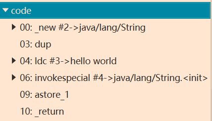

# 问题汇总


## 1、

不算是问题，只是看着好玩，加进来

关于Java重载方法的选择问题（结论：如果有多个方法满足需求，选择最合适的重载方法即可）。

Demo：

```java
/**
 * @author LuckyCurve
 * @date 2020/5/10 21:41
 * 对Java重载的测试案例
 * 往往只能确定一个相对适合的方法
 */
public class OverLoadPro {

    public static void sayHello(Object arg) {
        System.out.println("hello Object");
    }

    public static void sayHello(int arg) {
        System.out.println("hello int");
    }

    public static void sayHello(long arg) {
        System.out.println("hello long");
    }

    public static void sayHello(Character arg) {
        System.out.println("hello Character");
    }

    public static void sayHello(char arg) {
        System.out.println("hello char");
    }

    public static void sayHello(char... arg) {
        System.out.println("hello char ...");
    }

    public static void sayHello(Serializable arg) {
        System.out.println("hello Serializable");
    }

    public static void main(String[] args) {
        sayHello('a');
    }
}

```

使用IDEA即可看出来调用的是哪个方法，然后把调用的方法注释掉，看下一个调用的又是哪个方法：

结论：char>int>long>Character>Serializable>Object>char...

《深入理解Java虚拟机：第三版》的418页有详细分析，图一乐就好。


 

## 2、

`String flag = new String("hello world");`到底会创建多少个对象

网上答案（有可信度）：1个或者2个（如果hello world字符串之前出现过，常量池中就已经存在了，就只创建了1个对象）

查看class文件字节码，如下：



（常量池中对象的创建发生在编译过程中，这里不会涉及到，这里是编译好的方法）

发生了如下几件事儿：

1. 为String对象在堆中分配内存，完成置零操作，并使其引用进栈
2. 复制栈顶元素（1中创建的String对象的引用），并重新压入栈
3. 把常量池中的"hello world"压入栈
4. 调用String的init函数，对String对象进行赋值（猜测：两次出栈操作，第一次出栈获取String的值，第二次出栈获取String的引用）
5. 将栈顶数值取出存入局部变量表下标为1的位置
6. 当前方法返回void，还有ireturn返回int等等。

没有问题。

==都只是理论模型，《Java虚拟机规范》中并没有规定虚拟机的实现，只要求预期的结果一致即可，但仍能让我们深刻的了解Java虚拟机的运行思想和逻辑==

> 上面的栈多指的是操作数栈，一般讨论的入栈出栈都指的是操作数栈，如果进出的对象是栈帧的话那就是虚拟机栈了

参考资料：[Class伪指令集网站](https://blog.csdn.net/weixin_40234548/article/details/81533673)

