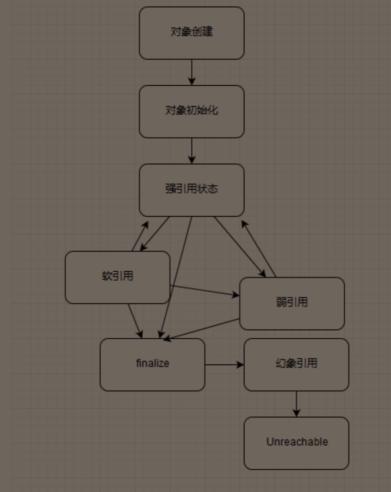

# Java核心技术36讲


主要是站在整体的角度来审视Java语言


## 谈谈你对Java平台的理解

- 语言特性
- 基础类库
- JVM
- JDK提供的工具


JIT（即时编译器）中的C1对应着虚拟机的Client模式，适用于启动速度敏感的应用。C2对应着Server模式，他的优化是为了长期运行的程序设定的，默认采用所谓的分层编译


Java9提供了平台相关性更强的编译性工具AOT，直接将某个类或者模块编译成AOT库，避免虚拟机启动时候过长时间的预热（适应微服务的一种体现吧）

提供的工具，JDK里面就有了：jaotc，但是使用起来感觉一般，估计还得需要时间普及


## JVM的参数及其作用


|               参数               |                     意义                     |
| :------------------------------: | :------------------------------------------: |
|              -Xint               |            告诉JVM只进行解释执行             |
|              -Xcomp              |       告诉JVM关闭解释器，启动会非常慢        |
| -XX:SoftRefLRUPolicyMSPerMB=3000 | 设置软引用在最后一次引用过后的3000ms后被回收 |
|                                  |                                              |
|                                  |                                              |
|                                  |                                              |
|                                  |                                              |
|                                  |                                              |
|                                  |                                              |
|                                  |                                              |
|                                  |                                              |
|                                  |                                              |
|                                  |                                              |
|                                  |                                              |
|                                  |                                              |
|                                  |                                              |
|                                  |                                              |
|                                  |                                              |
|                                  |                                              |


## Java的异常处理


主要讨论的是Throwable类的两个实现：Exception和Error、以及运行时异常和一般异常有什么区别

Exception是在程序运行情况下可以预料到的意外情况，应该捕获并进行处理

Error是正常情况下不大可能出现的情况，会导致程序（JVM）处于非正常的，不可恢复状态，例如OutOfMemoryError类


Exception可以分为检查check异常和不检查uncheck异常，检查异常需要在编译器强制要求处理，不检查异常就是所谓的运行时异常，例如NullPointException、ArrayIndexOutOfBoundsException之类，不会在编译器强制要求处理

简单类图：


Java对异常处理的支持（应该是Java7之后的）：主要就是Try-with-resources和Multiple catch两个语法糖的加入

```java
try (BuferedReader br = new BuferedReader(…);
	BuferedWriter writer = new BuferedWriter(…)) {
    // Try-with-resources
	// do something
catch ( IOException | XEception e) {// Multiple catch
	// Handle it
}
```


几个常见的使用误区：

- 尽量不要捕获Exception这样的通用异常，而是需要将捕获异常具体化
- 不要生吞异常，就例如catch不作任何异常处理，诊断起来非常难
- e.printStackTrace();   不要在产品代码中使用如下代码，很难判断出到底输出到哪里去了，特别是对于分布式架构的系统更为如此
- 尽量遵循Throw early，Catch late原则

throw early：也就是对参数进行检查，避免最常规的空指针异常问题，例如以下的两段代码：

```java
public void readPreferences(String fleName){
    //...perform operations...
    InputStream in = new FileInputStream(fleName);
    //...read the preferences fle...
}
```

```java
public void readPreferences(String flename) {
    Objects. requireNonNull(flename);
    //...perform other operations...
    InputStream in = new FileInputStream(flename);
    //...read the preferences fle...
}
```

new FileInputStream都可能会因为传入的filename为null而报错，而1中生成的异常堆栈信息就不是很适合读取了，而2中可以直接定位到第二行代码报错，非常容易解决

catch late：中庸的办法：保存原有的cause信息，直接再抛出或者是构建新的异常再抛出


自定义异常：

- 自定义异常是否需要声明成checked Exception

几点不需要声明成checked Exception的例子：

1. Checked Exception的初衷就是为了从异常情况恢复，但是绝大多数情况不支持
2. 不兼容functional编程，lambda和Stream无法使用

> Spring、Hibernate就基本抛弃了Checked Exception，例如新的编程语言Scale就直接抛弃掉了Checked Exception

当然也不是绝对，在少数环境下异常是可以恢复的，如IO，网络的重复连接等等。

- 在保证诊断信息足够的前提下，避免敏感信息存储到了异常中去了，例如Java中的Connection refused异常就不会包含用户的IP，端口号，机器名的输出。


异常处理的性能开销：

1. try-catch会产生额外的性能开销，并往往会影响JVM对代码的优化，因此try代码块不要过大
2. 实例化Exception会生成一个栈的快照，重量级操作

第二点也是优势的地方，可以大大减少代码诊断的难度，尤其是在分布式项目和大型项目中


课后问题：对于反应式编程，因为其本身是异步，基于事件处理的，所以出现异常决不能简单的抛出去，另外，因为代码堆栈不是垂直调用形式，生成的异常和日志往往都是特定executor的堆栈，而不是业务方法调用关系，对此你有什么想法呢？

优质回答：

> 先说问题外的话，Java的checked exception总是被诟病，可我是从C#转到Java开发上来的，中间经历了go，体验过scala。我觉得Java这种机制并没有什么不好，不同的语言体验下来，错误与异常机制真是各有各的好处和槽点，而Java我觉得处在中间，不极端。当然老师提到lambda这确实是个问题...
> 至于响应式编程，我可以泛化为异步编程的概念嘛？一般各种异步编程框架都会对异常的传递和堆栈信息做处理吧？比如promise/future风格的。本质上大致就是把lambda中的异常捕获并封装，再进一步延续异步上下文，或者转同步处理时拿到原始的错误和堆栈信息
>
> 作者回复：
>
> > 是的，非常棒的总结，归根结底我们需要一堆人合作构建各种规模的程序，Java异常处理有槽点，但实践证明了其能力；
> > 类似第二点，我个人也觉得可以泛化为异步编程的概念，比如Future Stage之类使用ExecutionException的思路


## final，finally，finalize有什么不同


final可以修饰类，变量，方法。被final修饰的方法默认是不可重写的

final!=immutable：只能约束引用不被另外赋值，无法保证添加元素等操作是正常的，如被final修饰的List依然可以执行add操作，如果要保证绝对的immutable，可以借助List.of()方法等相应的类和方法来进行支持，Java没有提供原生的支持

如果要实现immutable的类，需要注意以下几点：

- 将class自身声明成final，避免别人使用扩展类来绕开限制
- 向所有成员变量定义成private和final的，不实现setter方法
- 构造函数进行赋值时候要使用深拷贝来代替浅拷贝，避免被final修饰的内部对象改变了的问题
- 如果需要实现getter方法，使用copy-on-write原则，复制出一个副本


finally保证重点代码一定会被执行，如资源的关闭，锁的unlock动作等

不过现在更加推荐Java7的try-with-resources语句

也有特例：如以下代码就不会产生输出：

```java
try {
    System.exit(1);
} finally {
    System.out.println("hello world");
}
```


finalize是Object的一个方法，保证在对象被垃圾回收前完成特定的动作，从JDK9开始不推荐使用

会导致对象回收变慢，大约是四十到五十倍的速率变慢

Java平台正在使用Cleaner来逐步替换掉原有的finalize实现，比finalize更加轻量和可靠。仍然是有缺陷的，要避免所有对对象的强引用，否则很容易造成内存泄漏


## 常见的引用类型

强引用，软引用，弱引用，虚引用（幻象引用）


不同的引用类型，主要影响的就是对象的可达性状态和垃圾收集的影响


强引用：无论如何都不会被回收

软引用：JVM会在确保抛出OutOfMemoryError之前清理软引用对象，常用于实现内存敏感的缓存

弱引用：无法使得对象豁免垃圾收集，仅仅提供对象的一种访问途径。例如维护一组非强制性的映射关系，如果对象还在就使用，否则就重新实例化，也是很多缓存的实现

虚引用：无法通过虚引用来访问对象，虚引用仅仅提供了确保对象被finalize以后，做某些事情的机制


对象引用的转换关系：




## String,StringBuffer,StringBuilder之间的区别

String：是一个经典的Immutable类，被声明成final class，所有属性也都是final的，导致字符串拼接，裁减等操作都会产生一个新的String对象，会对性能有明显的影响

StringBuffer：提供线程安全的方式来修改字符序列，也正是由于其线程安全，导致其效率不高，所以除非有线程安全的需要，还是建议使用StringBuilder（因为大部分的对象都可以是线程私有的，绝对的线程安全）

StringBuffer是直接将修改数据的方法加上Synchronized来实现的，非常直白，不必纠结于Synchronized性能之类的，有人说：“过早优化是万恶之源”，考虑可靠性，正确性和代码可读性才是大多数应用开发最重要的因素

StringBuilder：1.5以后新增的一个类，相当于去掉了线程安全的StringBuffer，是绝大多数情况下字符串拼接的首选


通常不用使用到以上这些类，在JDK8之前Javac操作会直接将其转换为StringBuilder的实现，在Java8之后则不会再Javac时期执行优化了，而是直接使用JVM的InvokeDynamic来进行优化


String的存储方式从JDK9之前的使用char数组变成使用一个byte数组加上一个标识编码的coder以减少Char占用两个字符所带来的额外的内存开销