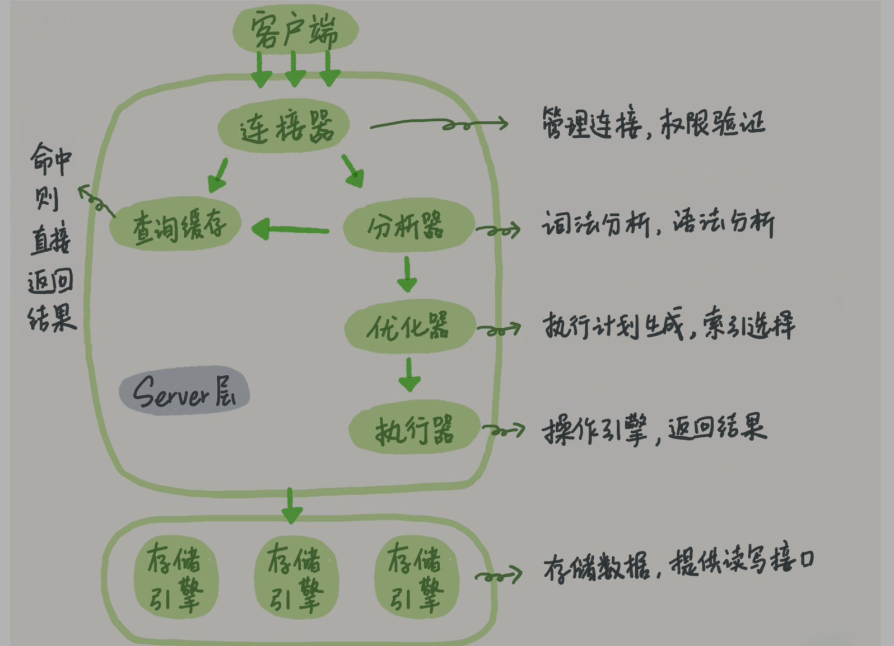
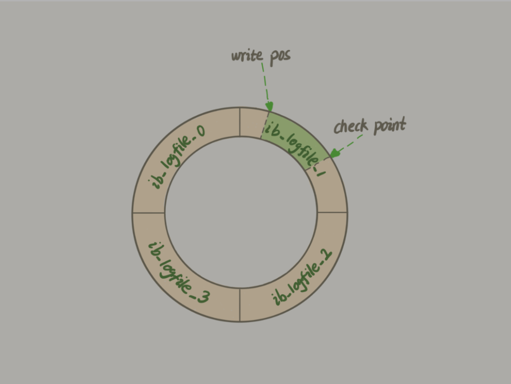
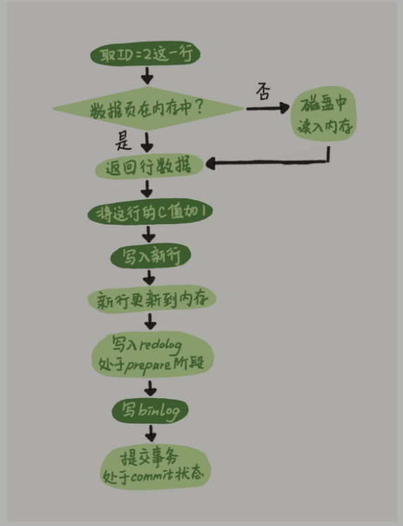
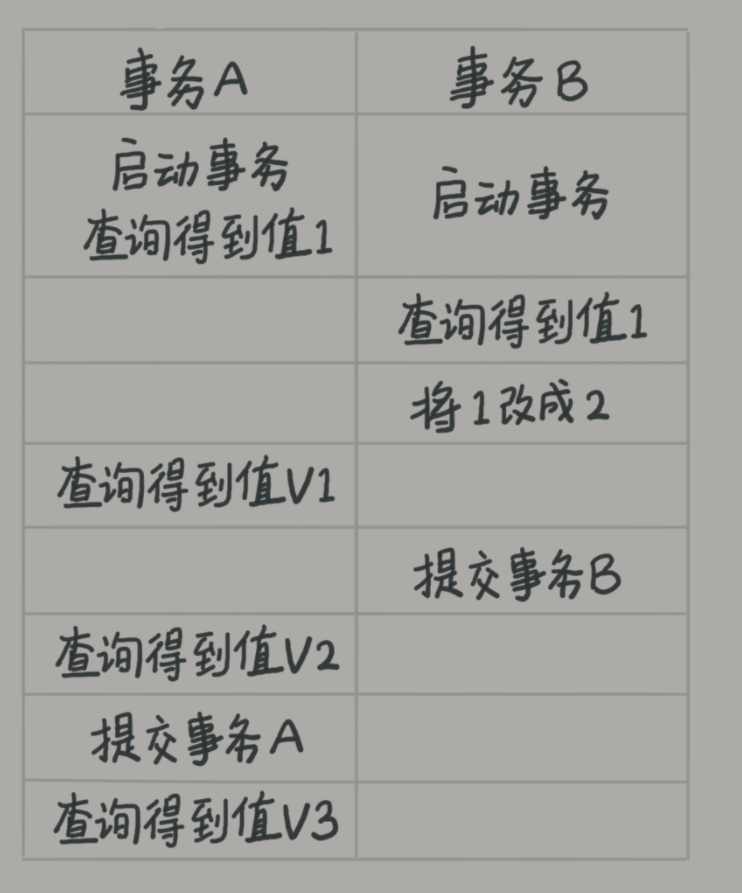
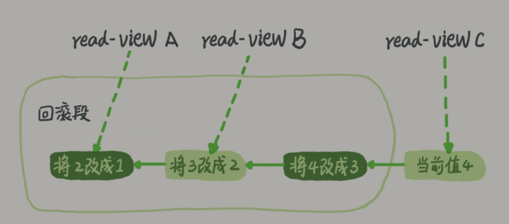
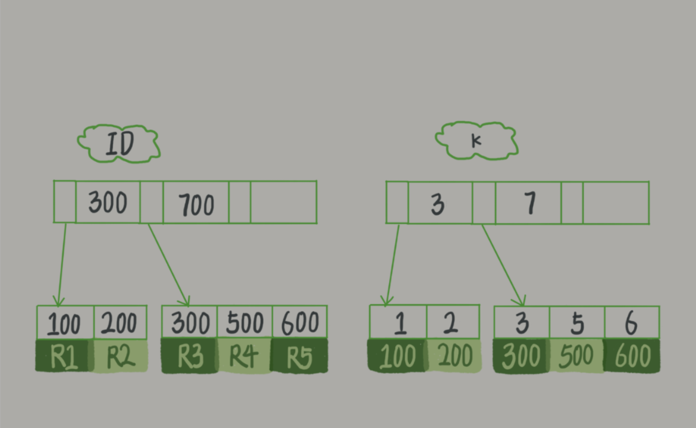
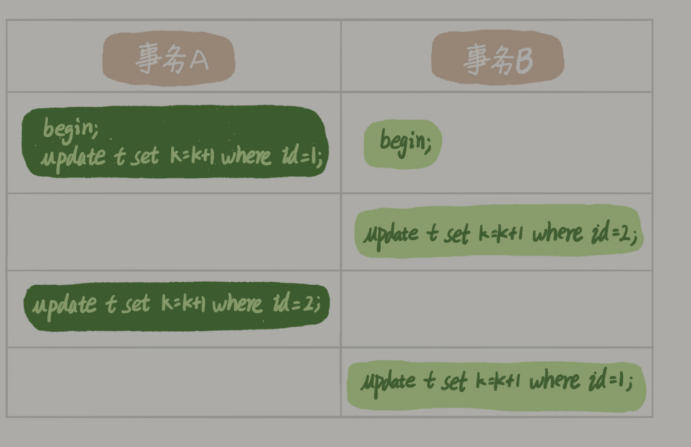

# MySQL实战四十五讲


## MySQl基础架构





大致可以分为server层和存储引擎层


Server层包括：连接器、查询缓存、分析器、优化器、执行器等，以及所有的内置函数，跨存储引擎的功能都是在这里实现，如存储过程，触发器，视图等

存储引擎负责数据的存储与提取，架构是插件式的


不同的存储引擎共用一个Server层


一条查询SQL语句执行的全过程：

- 连接器：负责和客户端建立连接、获取权限、维持和管理连接

```
mysql -h$ip -P$port -u$user -p
```

一旦连接成功，连接器就会去权限表里查看拥有的权限，之后都是直接依赖于这里获取到的权限来进行判断

连接时间是由参数wait_timeout控制的


- 查询缓存

在查询之前会先到查询缓存中判断是否有这条数据，查询缓存就是一组KV对，K是查询的语句，VALUE是结果，如果不在则继续进行查询操作，然后将结果缓存到查询缓存中


**但是大多数情况下我会建议你不要使用查询缓存，为什么呢？因为查询缓存往往弊大于利。**


主要是缓存失效频繁导致的，每一次对数据表的更新都会导致缓存的失效


MySQL8.0直接删除了查询缓存功能


- 分析器

先做词法分析，然后再做语法分析


- 优化器

优化器是在表里面有多个索引，决定使用哪个索引，或者是多表关联的时候决定表的连接顺序

优化器对语句执行方案的选择


- 执行器

开始执行语句，进行权限判断，调用引擎接口。


## MySQL日志系统


MySQL可以恢复到半个月内任意一秒的状态，具体的原因还得从表的更新语句说起

如要将id为1的count加一

`UPDATE T SET count=count+1 WHERE id=1`


查询语句的那一套流程，更新语句同样也会走一遍

如果表存在查询缓存，那么更新语句会直接将表上的所有查询缓存清空。


更新语句较之于查询语句还涉及到**两个重要的日志模块**的更新：redo log和binlog


redo log：

如果MySQL每一次更新操作都需要写入到磁盘，然后磁盘也需要找到对应的那条记录，然后再更新，那么IO成本会相当高，为了解决这个办法，MySQL使用了WAL技术

WAL全称为Write Ahead Logging，关键点在先写日志，再写磁盘


具体来说，InnoDB会先将记录写到redo log里面并更新内存，这个时候更新就完成了，InnoDB会在合适的时候将操作记录写到磁盘里面，而这个操作往往是在比较空闲的时候做


redo log是固定大小的，如果占满了redo log上的部分数据就会强制写入磁盘



write pos是当前写的位置，checkpoint是当前要擦除的位置。

write pos和checkpoint之间就是空着的位置，当write pos追上了checkpoint，就无法执行更新操作，需要将checkpoint向前推进一下


InnoDB通过redo log保证即使数据库发生异常重启，之前提交的记录都不会丢失，这个能力被称为crash-safe


binlog：

上面说的MySQL分为Server层和存储引擎层，上面的redo log是InnodB引擎持有的日志（存储引擎层面的日志，InnoDB独有的）。Server层也有自己的日志，也就是binlog（归档日志）


为什么需要设计两份日志呢？

因为最初的MySQL自带的MySIAM没有crash-safe能力，而Server层面的binlog只有归档能力，所以后期加入的InnoDB引入了具有crash-safe能力的redo log日志

区别点：

- redo log是InnoDB独有的，binlog是Server层通用的
- redo log是物理日志，记录在某个数据页做了什么修改，binlog是逻辑日志，记录某个日志的原始逻辑，比如“给id为1的这行count字段加一”
- redo log是循环写的，空间固定会用完，binlog是可追加写的，追加写指的是文件大小到达一定后会切换到下一个，不会覆盖以前的日志


回到执行过程：

1. 执行器找到id为1的这一行、如果id为1的数据页在内存中则直接返回给执行器，否则由存储引擎读入内存
2. 执行器将count字段加一，并调用存储引擎的接口存入数据
3. 存储引擎将数据更新到内存当中，同时将数据记录到redo log当中，此时redo log处于prepare状态，然后告知执行器执行完成，可以进行事务提交
4. 执行器生成这个操作的binlog，并将binlog写入磁盘
5. 执行器调入存储引擎的提交事务接口，将redo log的状态改成commit，完成更新




这里redo log的prepare和commit两个状态变换，被称为两阶段提交


两阶段提交：为了让两份日志之间的逻辑保持一致

先回到前面的问题：MySQL可以恢复到半个月内任意一秒的状态

至少需要半个月内的所有binlog，同时需要做整库备份

需要回退时候，找到最近的一个整库备份，恢复到临时库，然后从这个时间点开始取出binlog并执行，即可完成数据恢复。


回到两阶段提交，如果没有两阶段提交，那么要么redo log先记录完，要么binlog先记录完，始终不能保持两个日志文件一致，就会导致恢复文件的时候出问题


这种场景是非常常见的，例如最常见的主从复制，如果这两个日志不一样就会导致主从数据库不一致的情况发生。


那么什么时候完成持久化呢，有两个选项（默认都是开启的）：

- innodb_flush_log_at_trx_commit每次事务的redo log都会持久化到磁盘
- sync_binlog每次事务的binlog都持久化到磁盘


## MySQL事务隔离


事务就是要保证一组操作要么全部成功，要么全部失败

MySQL的事务是在存储引擎层面实现的，但是源于MySQL插件式的存储引擎，并不是所有的存储引擎都支持事务，如MySQL原生的MyISAM就不支持事务，这也是InnoDB取代MyISAM的重要原因。


事务的基础特性即为ACID：原子性、一致性、隔离性、持久性

今天来谈谈其中的I，即隔离性

当数据库上有多个事务共同执行的时候，可能出现脏读，不可重复读，幻读等问题，为了解决这些问题，事务的隔离级别就产生了。

隔离级别越高，效率越低

MySQL支持的事务隔离级别有：

- 读未提交：一个事务还未提交时候，它做的变更就可以被别的事务看到
- 读提交：一个事务提交以后，它做的变更才会被其他事务看到
- 可重复读（默认）：一个事务执行过程中看到的数据，与这个事务启动时候看到的数据是一致的
- 串行化：对同一行记录，写会加写锁，读会加读锁


例子：



隔离级别：

- 读未提交

|  K   |  V   |
| :--: | :--: |
|  V1  |  2   |
|  V2  |  2   |
|  V3  |  2   |

- 读提交

|  K   |  V   |
| :--: | :--: |
|  V1  |  1   |
|  V2  |  2   |
|  V3  |  2   |

- 可重复读

|  K   |  V   |
| :--: | :--: |
|  V1  |  1   |
|  V2  |  1   |
|  V3  |  2   |

- 串行化

|  K   |  V   |
| :--: | :--: |
|  V1  |  1   |
|  V2  |  1   |
|  V3  |  2   |

说明：在B进行将1改成2的时候会被阻塞住，直到A执行完成才能


读提交和可重复读的实现方式是MySQL在内部实现并维护了一个视图

读未提交直接返回记录上的最新值，没有使用到视图

串行化则直接使用加锁的方式避免并行访问


可以通过查看参数`transaction_isolation`的值来查看当前的隔离级别


事务隔离级别的具体实现：

每次数据进行更新的时候都会在回滚日志中记录一条回滚操作，可以通过执行回滚操作来完成状态的回滚



这就是将值从1分别改成2,3,4后，回滚日志记录的操作。

同一条记录在数据库中有不同的read_view，也就是有不同的版本（不同事务之间），这就是数据库的多版本并发控制（MVCC）。

read_view仅仅只是起到了标志的作用，想要获取标记的值，需要执行回滚操作到标记处。

只有在事务执行完成之后回滚日志才会被删除，因此不建议使用长事务，不仅会占用大量的存储空间，还可能占用锁资源，非常不建议使用。


事务启动方式：

1. 显式的事务语句，begin或start transaction开启事务，commit提交事务，rollback回滚事务
2. 使用set语句将autocommit设置成0，即`SET autocommit=0`，因为每一个语句其实是一个事务，通过设置关闭自动提交会导致所有语句事务不会自动提交，也就是执行一个SQL语句即开始了事务，需要显式地使用commit主动提交或者是rollback

因为不建议使用长事务，因此建议总是将autocommit设置成1


可以通过以下语句查询超过60s的事务：

```sql
select * from information_schema.innodb_trx where TIME_TO_SEC(timediff(now(),trx_started))>60;
```


## MySQL索引


索引就是为了提高数据查询效率，类似于书的目录。

但是实现索引的方式有非常多种，实现高效查询的数据结构有很多，先举例三种简单的数据结构：哈希表、有序数组和搜索数。

哈希表是以KV存储的数据结构，实现非常简单，内部维持一个数组，使用hash函数计算出对应的下标，将Value值存储到这个下标当中去。自然就会出现冲突，这时候的常用解决方法有：拉链法。比较适用于等值查找的场景。

有序数组在等值查询和范围查询都相当优秀，但是这里的效率是由插入数据换来的，插入成本相当高，因此仅仅适用于静态存储引擎，如要保存的数据是省份信息这类不需要修改的数据。

二叉搜索树，保证查询和插入数据的时间复杂度都为O(log(N))。二叉树是搜索效率最高的，但是大多数数据库并没有使用二叉树，主要是数据要存储到硬盘上去，而硬盘的随机寻址效率是极其低的，无法接收这种代价。为了使得查询尽量少地读磁盘，应该使用尽量少地数据块，可以通过使用N叉数来解决访问数据块过多这个问题，这里的N取决于数据块大小。且树根往往可以直接存储于内存当中。

N叉数由于性能优点和适配磁盘访问模式，广泛使用于数据库存储引擎当中了。


InnoDB的索引模型：

每一个索引在InnoDB中对应一颗B+树


建立数据表（id、k）字段，并在k上建立索引

设其中R1~R5的值分别为(100,1)、(200,2)、(300,3)、(500,5) 和 (600,6)，此时两个索引树的示意图如下：



根据叶子结点不难看出：

- 主键索引的叶子结点存放的是整行数据，因此在InnoDB中主键索引也被称为聚镞索引
- 非主键索引的叶子结点存放的是主键的值，因此在InnoDB中非主键索引也被称为二级索引

因此基于普通索引的查询会进行回表操作，因为会先得到ID再通过对id进行查询，因此应该尽量使用主键查询。

往往推荐使用自增主键，因为自增主键可以让数据顺序插入，不涉及到挪动其他的记录，这也就不会造成页分裂

> 页分裂：根据 B+ 树的算法，这时候需要申请一个新的数据页，然后挪动部分数据过去。这个过程称为页分裂。在这种情况下，性能自然会受影响。
>
> 除了性能外，页分裂操作还影响数据页的利用率。原本放在一个页的数据，现在分到两个页中，整体空间利用率降低大约 50%。

即使存在有如身份证号这种唯一的数据，也不应该拿来做主键，而是建议使用自增主键避免乱序


就如上一个例子，执行以下SQL语句：

`SELECT * FROM T WHERE k BETWEEN 3 AND 5;`

的执行过程为：

1. 在 k 索引树上找到 k=3 的记录，取得 ID = 300；
2. 再到 ID 索引树查到 ID=300 对应的 R3；
3. 在 k 索引树取下一个值 k=5，取得 ID=500；
4. 再回到 ID 索引树查到 ID=500 对应的 R4；
5. 在 k 索引树取下一个值 k=6，不满足条件，循环结束。

在这个过程中回到主键索引搜索数的过程，我们称之为回表。这个例子读了k索引树的三条记录，回表了两次，如何避免回表呢？

使用覆盖索引，也就是以下的SQL语句：

`SELECT id FROM T WHERE k BETWEEN 3 AND 5`

这里就不会发生回表操作。


可以使用联合索引来保证查询的高效性，如使用`(k,name)`索引，这里借由B+树的性质，可以利用到最左前缀，也就是在单独查询k的时候可以利用到。


MySQL5.6提出了索引下推这个概念来直接减少了MySQL的回表次数

如进行以下查询：`SELECT * FROM T WHERE name LIKE '张%' AND age = 10;`

存在索引（name，age），默认只有name存在于搜索树当中，但由于下推索引的存在，age也会存在于搜索树中，这就减少了回表的次数


## MySQL全局锁与表锁


数据锁的设计初衷是处理并发问题

根据加锁的范围，MySQL里面的锁大致可以分为全局锁、表级锁和行锁三类


顾名思义，全局锁就是怼整个数据库实现加锁，MySQL提供了一种加全局读锁的方法：`FLUSH TABLES WITH READ LOCK;`，当需要使得整个数据库处于只读状态的时候可以使用这个命令

典型使用场景：全局数据备份，防止其他线程对数据进行更新

如果不加锁的化，备份得到的库不是一个逻辑时间点，这个视图是逻辑不一致的

但是获取到逻辑视图并不一定需要给数据库加全局锁，因为在可重复读这个隔离级别下，MySQL内部会在事务开始的时候就进行了数据到逻辑视图的备份工作了。MySQL官方提供的mysqldump工具正是使用了这一特性，加上参数`–single-transaction`，可以保证逻辑视图的一致性

那么全局锁存在的意义何在呢？因为有些引擎如MyISAM不支持事务，任何写操作都会直接写入到数据表当中去，这时候就需要使用全局锁了。

因此只有所有数据表均使用了支持事务的存储引擎才可以使用mysqldump


为什么不使用：`SET GLOBAL read_only = true;`这种方式呢？

- read_only可能被用作业务逻辑判断如该库是主库还是备库
- 异常处理机制上的差别：如果使用全局锁，客户端发生异常断开，那么这时候MySQL就会自动释放这些全局锁（会话级别的），但是read only方式会一直持续，会导致整个库长期处于不可写状态


表级别的锁有两种：表锁和元数据锁

表锁的语法为：`LOCK TABLES [表名] READ/WRITE;`

如：`LOCK TABLES t1 READ,t2 WRITE;`

，与全局锁一样使用：`UNLOCK TABLES`主动释放锁


MDL（metadata lock）：元数据锁，不需要显式使用，在访问一个表的时候会被自动加上，保证读写的正确性。5.5引入。主要是保证表结构的完整性，对一个表进行CRUD的时候加MDL读锁，对一个表进行表结构变更的时候加MDL死锁


## MySQL行锁


MySQL行锁是在存储引擎层由各个存储引擎自己实现的

并不是所有存储引擎（如MyISAM）都支持行锁，不支持行锁的存储引擎对于并发控制只能使用表锁，影响并发度。InnoDB支持行锁


两阶段锁：

行锁是在需要的时候才加上的，但并不是不需要了就立刻释放了，而是要等待事务结束时候才会释放，这就是两阶段协议。

因此需要将最可能出现冲突的锁往后放，就最大程度减少了事务间的锁等待，提升了并发度


MySQL很有可能出现死锁，只要出现了资源相互依赖的情况，如下面行锁这个例子：




出现死锁之后可以有两种策略：

- 直接等待直到超时，可以通过设置参数`innodb_lock_wait_timeout`来改变，默认值50s
- 发起死锁检测，通过设置参数`innodb_deadlock_detect`来决定是否开启（默认开启），出现死锁后主动回滚其中某一个事务

不要想着将`innodb_lock_wait_timeout`设置太短如1s来解决锁等待问题，虽然可以很快解开死锁，但有可能误伤情况如只有简单的锁等待。

因此还是推荐第二种 ，但是有额外负担。

判断死锁的思路：要看当前锁依赖的线程有没有被别人锁住，如此循环，最后看是否出现了循环等待。但是当并发量上来以后如1000个并发事务，且100个并发事务访问到了同一行，因为时间复杂度为O（n），每个事务都会进行判断，那么就会判断100w次，因此你就会看到CPU利用率很高，却执行不了几个事务。


解决方法：

- 如果确保不会出现死锁，临时关掉死锁检测，但是风险非常高
- 做并发控制避免同一行出现太多线程来竞争，对MySQL服务端做并发控制，但是这涉及到了修改MySQL源代码的工作的
- 可能的解决方法：将一行分作多行，减少每一行的冲突，如要解决总金额问题，则事先先将金额分成多个行，然后每次只添加上其中一行，最后再求总和即可

第三种方案虽然看似无损，但是MySQL处理事务逻辑会变得更加复杂。


## MySQL事务间数据的可见性


主要源于InnoDB的MVCC多版本并发控制，在更新数据的时候会保留undo log来保证可以按照原路访问到以前的数据

**InnoDB 利用了“所有数据都有多个版本”的这个特性，实现了“秒级创建快照”的能力。**


一个数据版本，对于一个事务视图来说，除了自己的更新总是可见以外，有三种情况：

1. 版本未提交，不可见；
2. 版本已提交，但是是在视图创建后提交的，不可见；
3. 版本已提交，而且是在视图创建前提交的，可见。

还有一条规则：**更新数据都是先读后写的，而这个读，只能读当前的值，称为“当前读”（current read）。**主要是防止已经提交的事务被覆盖


InnoDB 的行数据有多个版本，每个数据版本有自己的 row trx_id，每个事务或者语句有自己的一致性视图。普通查询语句是一致性读，一致性读会根据 row trx_id 和一致性视图确定数据版本的可见性。

- 对于可重复读，查询只承认在事务启动前就已经提交完成的数据；
- 对于读提交，查询只承认在语句启动前就已经提交完成的数据；

而当前读，总是读取已经提交完成的最新版本。


## MySQL普通索引和唯一索引的选择


