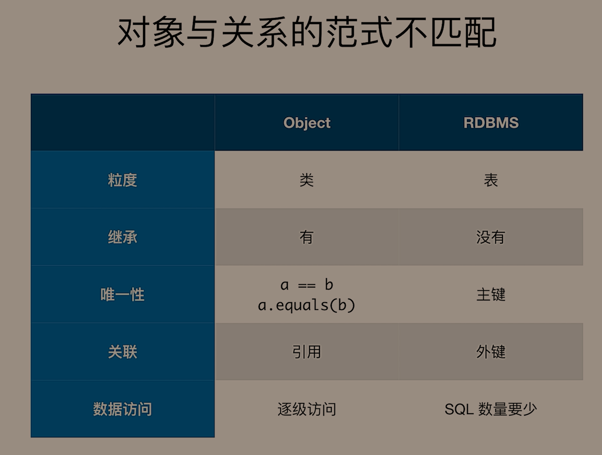
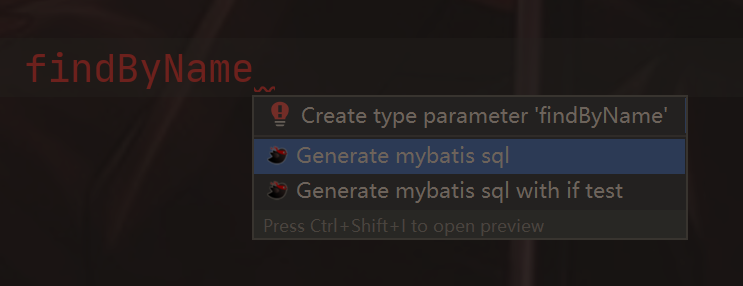
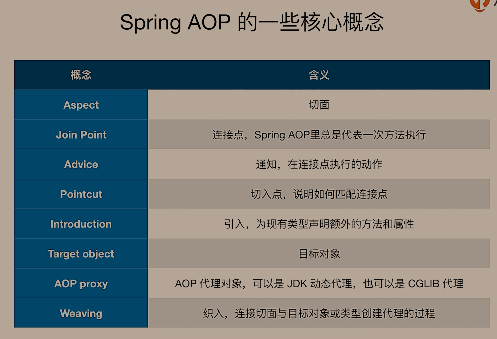
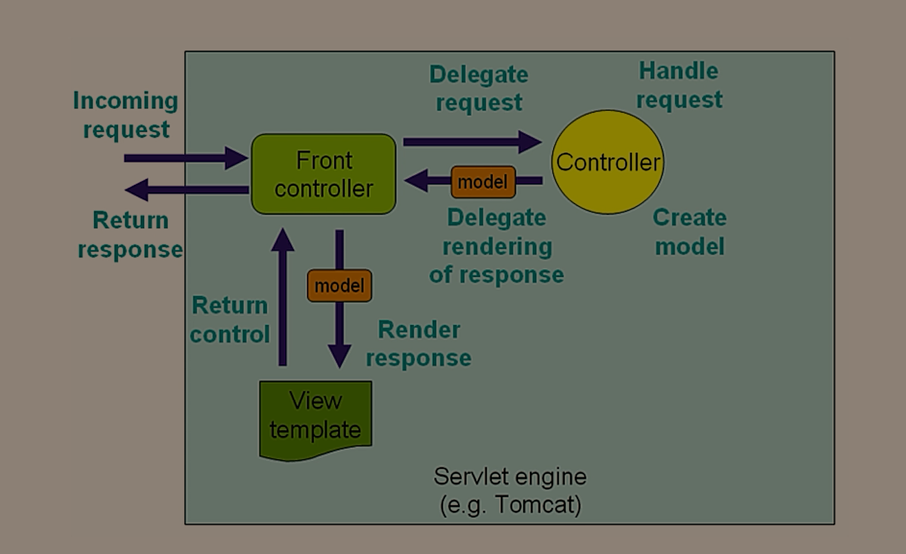
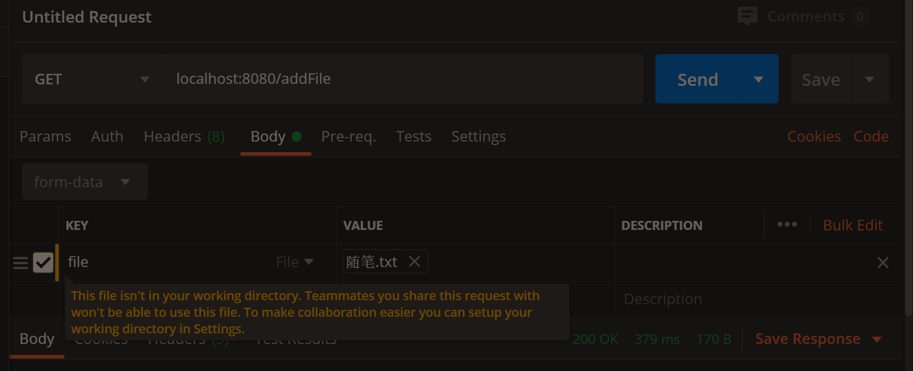
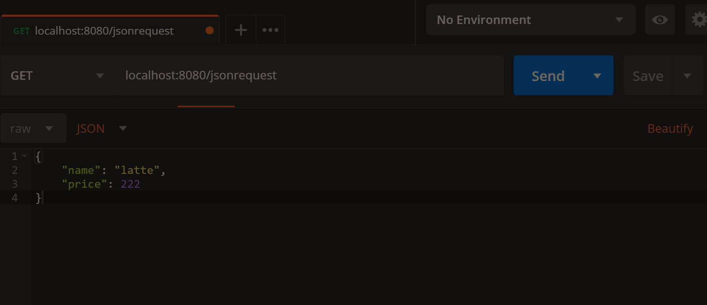
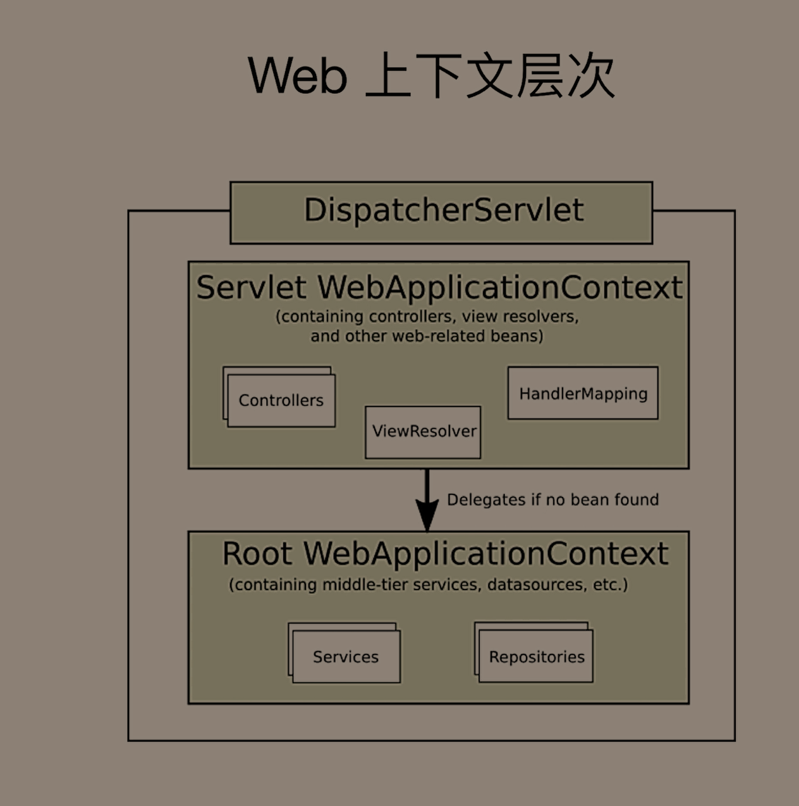
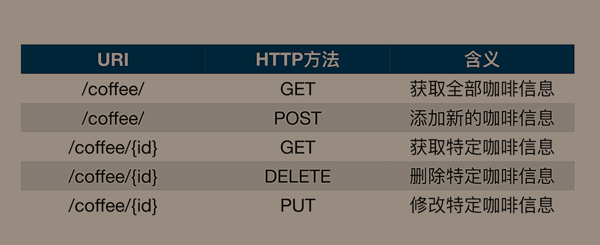
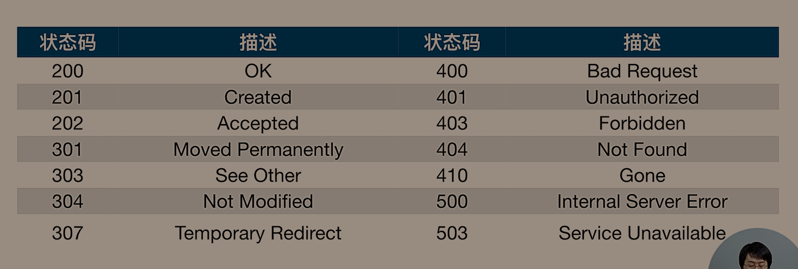

# 知识点总结


## 1、

使用Spring Initialize生成的项目会自动的带上一个spring-boot-starter-parent做依赖管理：

```xml
<parent>
    <groupId>org.springframework.boot</groupId>
    <artifactId>spring-boot-starter-parent</artifactId>
    <version>2.3.0.RELEASE</version>
    <relativePath/> <!-- lookup parent from repository -->
</parent>
```

如果这时候我们项目想要依赖于另一个已有的项目，该怎么办呢？Spring替我们找到了解决的办法，只需要加入如下的dependencyManagement即可

```xml
<dependencyManagement>
    <dependencies>
        <dependency>
            <groupId>org.springframework.boot</groupId>
            <artifactId>spring-boot-dependencies</artifactId>
            <version>2.3.0.RELEASE</version>
            <type>pom</type>
            <scope>import</scope>
        </dependency>
    </dependencies>
</dependencyManagement>
```

dependencyManagement的位置往往是放在所有dependencies前面，properties标签的后面

如果没有指定的话，就会尝试导入版本号为Unknown的包，报错。

还要在Plugin里面指定在repackage时候介入进来：

```xml
<build>
    <plugins>
        <plugin>
            <groupId>org.springframework.boot</groupId>
            <artifactId>spring-boot-maven-plugin</artifactId>
            <executions>
                <execution>
                    <goals>
                        <goal>repackage</goal>
                    </goals>
                </execution>
            </executions>
        </plugin>
    </plugins>
</build>
```

如果不加这个，就不会生成.jar.original这个文件，只有jar这个文件，且这个jar文件无法执行

还需要手动写入如下配置：

```xml
<properties>
    <java.version>1.8</java.version>
    <maven.compiler.encoding>UTF-8</maven.compiler.encoding>
    <project.build.sourceEncoding>UTF-8</project.build.sourceEncoding>
    <maven.compiler.source>1.8</maven.compiler.source>
    <maven.compiler.target>1.8</maven.compiler.target>
</properties>
```

完成~！

> 有时候需要手动去Project Structure和Java Compiler里面手动指定Java Version信息


还是有点麻烦的，Spring帮我们做了很多自动配置了


## 2、

在创建Spring容器的时候执行指定方法：

```java
/**
 * @author LuckyCurve
 * @date 2020/6/6 11:33
 * 将其加入Spring上下文中执行run方法，可以存在多个，执行顺序由order注解控制
 */
@Order(1)
@Component
public class StartReport implements CommandLineRunner {

    @Override
    public void run(String... args) throws Exception {
        System.out.println("hello Spring");
    }
}

```

不过最好不要使用System.out.println，建议使用如下格式：

```java
/**
 * @author LuckyCurve
 * @date 2020/6/6 11:33
 * SpringBoot会在应用程序启动后遍历CommandLineRunner方法
 * 可以通过Order注解指定遍历顺序
 */
@Order(1)
@Component
@Slf4j
public class StartReport implements CommandLineRunner {

    @Override
    public void run(String... args) throws Exception {
        log.info("hello world");
    }
}
```


## 3、

使用Maven Helper插件可以很容易的查看到依赖树


左下角的Dependency Analyzer进入UI页面，比默认的Diagrams好用一些


## 4、

可以通过application.properties来指定数据表的结构和数据（常用于H2数据库等内存数据库，如果使用MySQL，他不会去判断表是否存在，而是直接执行SQL语句）

```properties
#指定创建数据表结构的SQL文件的Classpath位置
spring.datasource.schema=sql/schema.sql
#指定创建数据表数据的SQL文件的Classpath位置
spring.datasource.data=sql/data.sql
```

数据类型是List<String>类型的，通过逗号隔开就好了，自动映射规则就是使用逗号隔开的（包括MVC的String映射到List上面来也是一样的）


## 5、SpringBoot配置多数据源


整了半天，差点放弃了，还好坚持了下来：）


导入依赖：MyBatis Starter、MySQL Connect Java


配置文件：

```yaml
foo:
  datasource:
    username: root
    password: 123456
    driver-class-name: com.mysql.cj.jdbc.Driver
    jdbc-url: jdbc:mysql://localhost:3306/test?serverTimezone=UTC


bar:
  datasource:
    driver-class-name: com.mysql.cj.jdbc.Driver
    username: root
    password: 123456
    jdbc-url: jdbc:mysql://localhost:3306/test2?serverTimezone=UTC

```

> 如果是引入的MyBatis就必须使用jdbc-url
>
> 如果引入的是Tomcat-jdbc就可以是url
>
> 如果两个都没有引入、就会报错`java.lang.IllegalStateException: No supported DataSource type found`


可以排除SpringBoot的自动配置，并且建议排除，不知道为啥使用Actuator还是能看到DataSourceAutoConfiguration


配置类：

```java
@Bean("foo")
@ConfigurationProperties(prefix = "foo.datasource")
public DataSource fooDataSourceProperties() {
    return DataSourceBuilder.create().build();
}
```

注入一个foo测试，处理两个数据源之间的关系，交给MyBatis，我们仅仅只是需要使用@Primary来标记出主数据源即可

> 感觉这里的ConfigurationProperties注解用的还是挺奇妙的，只用过标注在类上来代替Value注解注入属性的，还没有这样用过
>
> 好像是工厂方法的用法：
>
> 


结果测试：使用2中提到的CommandLineRunner即可

```java
@Component
@Slf4j
public class StartReport implements CommandLineRunner {

    @Autowired
    DataSource dataSource;

    @Override
    public void run(String... args) throws Exception {
        log.warn(dataSource.toString());
    }
}
```

为了醒目输出了warn提示，不建议这样做

MyBatis底层使用的是HikariDataSource数据源，toString的输出为：

```
HikariDataSource (null)
```

> 因为SpringBoot2.0默认帮我们配置了HikariCP这个连接池，所以自动使用了他的数据源
>
> 在SpringBoot1.0还是用的是Tomcat的数据源，名字就是tomcat，存在于Tomcat-jdbc中
>
> 

可以在log这一行打上断点来查看DataSource的值来验证结果即可，发现注入成功。


如果指定的数据库的表不存在命令行还会报错，但不会终止项目运行，只是当前线程挂掉了


## 6、使用Druid整合多数据源、


其实和上面差不多

可以不用排除AutoCOnfiguration

引入Druid的starter依赖，排除默认的HikariCP依赖（一般在Mybatis或者是Spring-jdbc里面）可以使用Maven Helper搜索一下然后排除。

特别注意的点：

注入数据源的时候，使用的是DruidDataSource而不是DataSource了

```java
@Bean("foo")
@Primary
@ConfigurationProperties(prefix = "foo.datasource")
public DataSource fooDataSourceProperties() {
    return DruidDataSourceBuilder.create().build();
}

@Bean("bar")
@ConfigurationProperties(prefix = "bar.datasource")
public DataSource barDataSourceProperties() {
    return DruidDataSourceBuilder.create().build();
}
```

搞定了


## 7、Spring的事务抽象


Spring提供了对数据访问层的抽象，可以在不同的框架当中使用一样的数据操作，最重要的几块抽象：事务抽象和异常抽象


最主要接口：

```java
public interface PlatformTransactionManager extends TransactionManager {
    TransactionStatus getTransaction(@Nullable TransactionDefinition var1) throws TransactionException;

    void commit(TransactionStatus var1) throws TransactionException;

    void rollback(TransactionStatus var1) throws TransactionException;
}
```

他的父接口TransactionManager是空的，只起到了标记的作用

然后就是Spring对各种框架的适配的PlatformTransactionManager实现了

还有就是TransactionDefinition这个接口（事务的定义），包含事务传播特性，隔离性等等

可以获取到TransactionStatus，事务的状态，主要有是否是新创建的，是否回滚了等等


事务的传播特性（定义事务的时候会用到）：


默认值是0

在官方文档中只出现了036，其余的在代码里面有体现

> REQUIRES_NEW和NESTED的区别：
>
> 前者是声明一个单独的事务，两者之间没有任何关系
>
> 后者是在里面声明一个事务，如果里面事务已经提交了，外部事务发生了回滚，那么里面的事务依然会发生回滚
>
> 可以通过Translation的properties来指定
>
> 事务传播特性指的是创建当前事务的，而不是lolocal当前事务去创建新事务的过程


事务隔离特性：


默认值是-1，完全取决于数据库的默认隔离级别


整了半天Mybatis，几个坑回顾一下：

- 配置文件中扫描mapper.xml文件
- 开启驼峰命名，要不然自己写的注解返回对象可能注入不进来，返回值为null，但是使用Mybatis插件生成的xml依旧可以注入进去，在配置文件中指定了数据表列和实体类的对应关系了

编程式事务：

注入对象：

```java
@Autowired
TransactionTemplate transactionTemplate;
```

事务测试：

```java
@Test
void test2() {
    log.info("Before Transaction Count:"+userMapper.count());
    transactionTemplate.execute(status -> {
        userMapper.insert(User.builder().userName("222").build());
        log.info("In Transaction:"+ userMapper.count());
        //确保事务回滚
        status.setRollbackOnly();
        return null;
    });
    log.info("After Transaction Count:"+userMapper.count());
}
```

可以给execute传入一个抽象类：`TransactionCallbackWithoutResult`，就可以没有返回值了。

但是不支持函数式编程，支持函数式编程的接口是有返回值的。


可以很清晰的看到事务发生了回滚


声明式事务

主要是Spring使用了AOP将需要调用的方法进行封装

AOP很好的封装了AspectJ和Java提供的反射


使用注解方式：

`@EnableTransactionManagement`开启事务注解

然后就可以在需要的方法或者是类上去添加`@Transactional`注解


会有默认的设置


对这三个方法进行测试：

```java
@Transactional
public void insert() {
    User user = User.builder().userName("LuckyCurve").build();
    userMapper.insert(user);
}

@Transactional(rollbackFor = UnexpectedRollbackException.class)
public void insertWithExp() {
    User user = User.builder().userName("LuckyCurve").build();
    userMapper.insert(user);
    throw new UnexpectedRollbackException("触发回滚");
}

public void invoke() {
    insertWithExp();
}
```

直接继承CommandLineRunner即可，测试代码：

```java
    @Override
    public void run(String... args) {
        //显式的将int转换成String
        log.info(String.valueOf(userMapper.count()));
        userService.insert();
        //第二种显式转换的方法
        log.info(Integer.toString(userMapper.count()));
        try {
            userService.insertWithExp();
        } catch (Exception ignored) {
        }
        //隐式转换
        log.info(userMapper.count() + "");
        try {
            userService.invoke();
        } catch (Exception ignored) {
        }
        log.info(userMapper.count() + "");
    }
```

由于后两个方法会抛出异常，所以要Catch，不然项目会被中断

输出结果分别为0——>1——>1——>2

只有第二个方法触发了回滚，并且如果一个没有事务支持的方法调用了一个有事务支持的方法，那么本次调用即是没有事务支持的了。

> 之所以第三个方法没有触发事务回滚，是因为他直接调用了ServiceImpl里面的方法，Spring的AOP实际上就是增加了一个代理类，并将你的请求重定向到代理类上，但如果直接指定对象来调用就不行了，得使用Service的Interface中的方法，这时候不会调用到Impl上面去，而是会到代理类上面去，从而实现事务控制。

如果要第三个方法需要支持事务，只需要注入当前类的抽象接口，并调用抽象接口的insertWithExp方法即可。

如果没有指定异常，则所有异常都会触发回滚，回滚过程中会捕获异常并将此异常重新抛出


## 8、实现持久层错误的定制

Spring对数据操作的异常进行了抽象，无论使用哪一种框架都会将异常转换到以DataAccessException为父类的抽象异常族当中。

即可以保证无论使用什么持久层框架，编写异常处理的逻辑是一样的

应该是直接基于数据库的错误码来的，对每个数据库都有适配

错误码位于spring-jdbc包下的org.springframework.jdbc.support.sql-error-codes.xml

也可以自定义到classpath:/sql-error-codes.xml，会默认覆盖官方的

```xml
<bean id="MySQL" class="org.springframework.jdbc.support.SQLErrorCodes">
    <property name="databaseProductNames">
        <list>
            <value>MySQL</value>
            <value>MariaDB</value>
        </list>
    </property>
    <property name="badSqlGrammarCodes">
        <value>1054,1064,1146</value>
    </property>
    <property name="duplicateKeyCodes">
        <value>1062</value>
    </property>
    <property name="dataIntegrityViolationCodes">
        <value>630,839,840,893,1169,1215,1216,1217,1364,1451,1452,1557</value>
    </property>
    <property name="dataAccessResourceFailureCodes">
        <value>1</value>
    </property>
    <property name="cannotAcquireLockCodes">
        <value>1205,3572</value>
    </property>
    <property name="deadlockLoserCodes">
        <value>1213</value>
    </property>
</bean>

```

可以直接定义即可


模拟错误（主键重复错误）：

插入语句：

```java
@Insert("insert into user values(#{userId} ,#{userName})")
void insertWithPrimaryKey(User user);
```

> 默认使用MyBatisToolHelper会自动屏蔽掉自增的主键信息


在Classpath下创建sql-error-codes.xml文件，最好直接复制官方的然后修改：

```xml
<?xml version="1.0" encoding="UTF-8"?>
<!DOCTYPE beans PUBLIC "-//SPRING//DTD BEAN 2.0//EN" "https://www.springframework.org/dtd/spring-beans-2.0.dtd">

<!--
	- Default SQL error codes for well-known databases.
	- Can be overridden by definitions in a "sql-error-codes.xml" file
	- in the root of the class path.
	-
	- If the Database Product Name contains characters that are invalid
	- to use in the id attribute (like a space) then we need to add a property
	- named "databaseProductName"/"databaseProductNames" that holds this value.
	- If this property is present, then it will be used instead of the id for
	- looking up the error codes based on the current database.
	-->
<beans>
    <bean id="MySQL" class="org.springframework.jdbc.support.SQLErrorCodes">
        <property name="databaseProductNames">
            <list>
                <value>MySQL</value>
                <value>MariaDB</value>
            </list>
        </property>
        <property name="badSqlGrammarCodes">
            <value>1054,1064,1146</value>
        </property>
        <property name="duplicateKeyCodes">
            <value>1062</value>
        </property>
        <property name="dataIntegrityViolationCodes">
            <value>630,839,840,893,1169,1215,1216,1217,1364,1451,1452,1557</value>
        </property>
        <property name="dataAccessResourceFailureCodes">
            <value>1</value>
        </property>
        <property name="cannotAcquireLockCodes">
            <value>1205,3572</value>
        </property>
        <property name="deadlockLoserCodes">
            <value>1213</value>
        </property>

        <property name="customTranslations">
            <bean class="org.springframework.jdbc.support.CustomSQLErrorCodesTranslation">
                <property name="errorCodes" value="1062"/>
                <property name="exceptionClass"
                          value="cn.luckycurve.springhello.exception.MyCustomException"/>
            </bean>
        </property>
    </bean>
</beans>

```

主要就是42~48行，定义了一个CustomSQLErrorCodesTranslation对象，并制定将1062错误，即原来会抛出duplicateKeyCodes的错误的code，改成抛出自定义错误MyCustomException

MyCustomException只需要继承DataAccessException即可，成为Spring抽象异常族的一员，不过最好更加明确一点，集成原有的DuplicateKeyException表示是对原来的重复主键异常的扩展即可

```java
public class MyCustomException extends DuplicateKeyException {
    public MyCustomException(String msg) {
        super(msg);
    }

    public MyCustomException(String msg, Throwable cause) {
        super(msg, cause);
    }
}
```


实验测试：

```java
@Test
void test() {
    User user = User.builder().userId(1).userName("LuckyCurve").build();
    try {
        userMapper.insertWithPrimaryKey(user);
        userMapper.insertWithPrimaryKey(user);
    } catch (Exception e) {
        Assertions.assertEquals(e.getClass(),MyCustomException.class);
    }
}
```

成功。


## 9、Spring Data JPA

为什么要使用到ORM框架



Hibernate默认成为JPA的实现


屏蔽底层SQL的实现


整体例子：


涉及到金额相关的操作，不可以直接使用浮点数，使用下列依赖中的库：

核心依赖：

```xml
<dependency>
    <groupId>org.springframework.boot</groupId>
    <artifactId>spring-boot-starter-data-jpa</artifactId>
</dependency>

<!--确保金额的准确性，浮点数无法保证-->
<dependency>
    <groupId>org.joda</groupId>
    <artifactId>joda-money</artifactId>
    <version>1.0.1</version>
</dependency>

<!--使用了金额操作，映入下列库来映射到数据库表上去-->
<dependency>
    <groupId>org.jadira.usertype</groupId>
    <artifactId>usertype.core</artifactId>
    <version>6.0.1.GA</version>
</dependency>

<dependency>
    <groupId>mysql</groupId>
    <artifactId>mysql-connector-java</artifactId>
    <scope>runtime</scope>
</dependency>
<dependency>
    <groupId>org.projectlombok</groupId>
    <artifactId>lombok</artifactId>
    <optional>true</optional>
</dependency>
```

> 涉及到金额的操作，一定要小心

定义实体类：

咖啡类：

```java
//标明是一个实体
@Entity
//标明表的名字，可以不指定，默认类名
@Table(name = "t_menu")
@Data
@AllArgsConstructor
@NoArgsConstructor
@Builder
public class Coffee implements Serializable {

    //标明主键和生成策略
    @Id
    //提供主键生成策略，如果不指定主键生成策略，默认为AUTO，默认提供四种，id生成交个生成策略，随机选择上面三种中的一种
    @GeneratedValue
    private Long id;


    /**
     * Jado money 提供的
     */
    //声明成一个列
    @Column
    //指定数据库列与实体类字段之间的映射关系
    @Type(type = "org.jadira.usertype.moneyandcurrency.joda.PersistentMoneyAmount",
            parameters = {@org.hibernate.annotations.Parameter(name = "currencyCode",value = "CNY")})
    private Money price;

    //创建时间，并且无法修改
    @Column(updatable = false)
    @CreationTimestamp
    private LocalDateTime createTime;

    //修改时间戳
    @UpdateTimestamp
    private LocalDateTime updateTime;
}
```

订单类：

```java
@Entity
@Table(name = "t_order")
@Data
@AllArgsConstructor
@NoArgsConstructor
@Builder
public class CoffeeOrder implements Serializable {
    @Id
    @GeneratedValue
    private Long id;

    //这里好像没有映射到表上去
    private String customer;

    //标注是多对多的关系
    @ManyToMany
    //指明这种存储关系应该存放于哪一张关系表当中
    @JoinTable(name = "t_order_coffee")
    private List<Coffee> items;

    @Column(nullable = false)
    private Integer state;

    //照带时间戳
    @Column(updatable = false)
    @CreationTimestamp
    private LocalDateTime createTime;
    @UpdateTimestamp
    private LocalDateTime updateTime;
}
```

配置文件：

```yaml
spring:
  datasource:
    driver-class-name: com.mysql.cj.jdbc.Driver
    username: root
    password: 123456
    url: jdbc:mysql://localhost:3306/coffee?serverTimezone=UTC
  jpa:
    #    展示SQL
    show-sql: true
    hibernate:
    #  create：先删除上一次生成的表，然后在生成表，无论表结构是否改变
    #  create-drop：加载Hibernate时候创建表，一旦SessionFactory关闭，表结构就删除了
    #  update：最常见的，第一次加载会根据model建立表结构，后面不会再次修改，除非model也改变了（好像没用，得手动清除表在运行项目），【只会检查表是否存在，不存在就创建，如果存在就不管了，哪怕列发生了变化】
    #  validate：只是验证表，验证不成功就项目启动失败
      ddl-auto: update


```

> 一个优化的地方：数据库存储小数也不是很准确，使用PersistentMoneyMinorAmount来替代PersistentMoneyAmount，会以BigInt类型存储，自动转换为最小单位为分

> 指定了执行策略为AUTO，一般都会直接选用到了SEQUENCE的主键生成策略上去了，会多生成一张SEQUENCE表，如果不想要这张表，指定成IDENTITY表示自增即可。


优化一下，Coffee和Order都包含id和创建时间修改时间，抽象出来

```java
@MappedSuperclass
@Data
@NoArgsConstructor
@AllArgsConstructor
public class BaseEntity implements Serializable {
    @Id
    @GeneratedValue(strategy = GenerationType.IDENTITY)
    private Long id;

    @Column(updatable = false)
    @CreationTimestamp
    private LocalDateTime createTime;

    @UpdateTimestamp
    private LocalDateTime updateTime;
}
```


然后后面两个精简的：

```java
@Table(name = "t_menu")
@Data
@ToString(callSuper = true)
@AllArgsConstructor
@NoArgsConstructor
@Builder
public class Coffee extends BaseEntity implements Serializable {

    /**
     * Jado money 提供的
     */
    //声明成一个列
    @Column
    //指定数据库列与实体类字段之间的映射关系
    @Type(type = "org.jadira.usertype.moneyandcurrency.joda.PersistentMoneyMinorAmount",
            parameters = {@org.hibernate.annotations.Parameter(name = "currencyCode",value = "CNY")})
    private Money price;
}
```

```java
@Entity
@Table(name = "t_order")
@Data
@ToString(callSuper = true)
@AllArgsConstructor
@NoArgsConstructor
@Builder
public class CoffeeOrder extends BaseEntity implements Serializable {

    //这里好像没有映射到表上去
    private String customer;

    //标注是多对多的关系
    @ManyToMany
    //指明这种存储关系应该存放于哪一张关系表当中
    @JoinTable(name = "t_order_coffee")
    private List<Coffee> items;

    @Column(nullable = false)
    private Integer state;
}
```

ToString方法会调用父类的toString方法


可以status用Integer标注不太好，使用Enum来

```java
public enum OrderStatus {
    INIT,PAID,BREWING,BREWED,TAKEN,CANCELLED
}
```

```
@Enumerated
@Column(nullable = false)
private OrderStatus status;
```

数据库存储自动为Integer了


> 被Table标注的所有字段默认都是@Column的，如果需要排除得去单独加注解


对实体类进行CRUD操作，直接定义Repository继承CRUDRepository（自带了一些增删改查的方法，如果需要分页，需要指定的Repository），可以自己声明一些方法，会帮你实现的


在主类中继承CommandRunner，在执行完run方法后，就会自动停止了，不会继续停留下去（并不是这样的，而是由于没有web的starter，项目没有阻塞）

> 也可以继承ApplicationRunner，两者区别：
>
> - ApplicationRunner默认先于CommandLineRunner执行
> - ApplicationRunner默认唯一
> - CommandLineRunner的执行顺序可以通过Order注解指定

就相当于一个测试类的效果了。

代码结构（主类）：

```java
@SpringBootApplication
@EnableJpaRepositories("cn.luckycurve.springdatahello.mapper")
@Slf4j
public class SpringDataHelloApplication implements CommandLineRunner {

    @Autowired
    CoffeeRepository coffeeRepository;

    @Autowired
    CoffeeOrderRepository orderRepository;

    public static void main(String[] args) {
        SpringApplication.run(SpringDataHelloApplication.class, args);
    }

    @Override
    public void run(String... args) throws Exception {
        initOrder();
    }

    private void initOrder() {

        Coffee latte = Coffee.builder().name("latte")
                .price(Money.of(CurrencyUnit.of("CNY"), 20.0))
                .build();
        coffeeRepository.save(latte);

        log.info("latte: {}",latte);

        Coffee espresso = Coffee.builder().name("espresso")
                .price(Money.of(CurrencyUnit.of("CNY"), 20.0))
                .build();
        coffeeRepository.save(espresso);

        log.info("espresso: {}",espresso);

        CoffeeOrder order1 = CoffeeOrder.builder().customer("无名鼠辈")
                .items(Collections.singletonList(latte))
                .status(OrderStatus.BREWED)
                .build();
        orderRepository.save(order1);

        log.info("Order1：{}",order1);

        CoffeeOrder order2 = CoffeeOrder.builder().customer("LuckyCurve")
                .items(Arrays.asList(latte,espresso))
                .status(OrderStatus.BREWED)
                .build();
        orderRepository.save(order2);

        log.info("Order2：{}",order2);
    }
}
```

> 可以注意下slf4j的写法，使用`{}`占位符

两个常规Mapper类（因为使用了EnableJpaRepositories指定了BasePackage，可以不用指定Repository注解了）：

```java
public interface CoffeeOrderRepository extends CrudRepository<CoffeeOrder,Long> {
}
```

```java
public interface CoffeeRepository extends CrudRepository<Coffee,Long> {
}
```


再次抽象通用Repository（前面抽取了Entity对象，都是抽象程度逐步增加）

```java
//告诉Spring无需将该Bean注入Application中
@NoRepositoryBean
public interface BaseRepository<T, ID> extends PagingAndSortingRepository<T, ID> {
    //写起来没有提示，感觉有点难受，也可以直接继承BaseRepository，不过还是优先选择继承功能强大的Repository
    List<T> findTop3ByOrderByUpdateTimeDescIdAsc();
}
```

CoffeeOrderRepository自定义方法：

```java
public interface CoffeeOrderRepository extends BaseRepository<CoffeeOrder,Long> {
    List<CoffeeOrder> findByCustomerOrderById(String customer);

    List<CoffeeOrder> findByItems_Name(String name);
}
```

CoffeeRepository（没变，只是改了父接口而已）：

```java
public interface CoffeeRepository extends BaseRepository<Coffee,Long> {

}
```


==实验代码（认真看，编码格式和Java8的语法都用到了）==：

```java
/**
  * 查找
  */
private void findOrders() {
    //打印全部Coffee
    coffeeRepository
        .findAll(Sort.by(Sort.Direction.DESC, "id"))
        .forEach(c -> log.info("Loading {}", c));

    //打印前三Coffee Order
    List<CoffeeOrder> list = orderRepository.findTop3ByOrderByUpdateTimeDescIdAsc();
    log.info("查找前三的订单Id：{}", getOrderId(list));


    //查找LuckyCurve的订单
    list = orderRepository.findByCustomerOrderById("LuckyCurve");
    log.info("查找LuckyCurve的订单Id：{}", getOrderId(list));

    //打印LuckyCurve订单的详细信息
    list.forEach(o -> {
        log.info("Order：{}",o.getId());
        o.getItems().forEach(i -> log.info("Items：{}",i));
    });

    //来尝试findByItems_Name来查询订单
    list = orderRepository.findByItems_Name("latte");
    log.info("findByItems_Name:{}",getOrderId(list));
}

//获取订单Id通用方法
private String getOrderId(List<CoffeeOrder> list) {
    return list.stream().map(i -> i.getId().toString())
        //指定分隔符
        .collect(Collectors.joining("."));
}
```

```
Loading Coffee(super=BaseEntity(id=2, createTime=2020-06-12T18:08:34.277514, updateTime=2020-06-12T18:08:34.277514), name=espresso, price=CNY 20.00)
Loading Coffee(super=BaseEntity(id=1, createTime=2020-06-12T18:08:34.186757, updateTime=2020-06-12T18:08:34.186757), name=latte, price=CNY 20.00)
查找前三的订单Id：2.1
查找LuckyCurve的订单Id：2
Order：2
Items：Coffee(super=BaseEntity(id=1, createTime=2020-06-12T18:08:34.186757, updateTime=2020-06-12T18:08:34.186757), name=latte, price=CNY 20.00)
Items：Coffee(super=BaseEntity(id=2, createTime=2020-06-12T18:08:34.277514, updateTime=2020-06-12T18:08:34.277514), name=espresso, price=CNY 20.00)
findByItems_Name:1.2
```

> - 很多List如果以后不需要可以复用
> - 如果遍历一个集合不需要处理的话可以使用forEach来代替使用Stream转换成流再来处理

> 运行过程中在
>
> ```java
>     @Override
>     @Transactional
>     public void run(String... args) throws Exception {
>         findOrders();
>     }
> ```
>
> 方法上要加上Transactional注解，不然会报：LazyInitializationException错误


Repository的实现：

没有源码和注释：右键pom.xml的maven选项，有download Source And Document选项

源码一直都在，只是有些starter只是简单集成了几个其他的项目，所以才显示空的

具体代码位于：


所有语法解析（根据方法名来看方法做了什么）：


## 10、MyBatis

如果是数据库的简单的映射处理，就使用JPA，如果SQL本身比较复杂，建议使用MyBatis

大厂里面有专门的DBA（DataBase Admin，数据库管理员）需要优化SQL，就需要使用MyBatis了（需要审核SQL）


常见配置：


特别是第二条，写XML的时候就可以不用写前缀了


Demo：

dependency：

```xml
<dependency>
    <groupId>org.mybatis.spring.boot</groupId>
    <artifactId>mybatis-spring-boot-starter</artifactId>
    <version>2.1.3</version>
</dependency>

<dependency>
    <groupId>mysql</groupId>
    <artifactId>mysql-connector-java</artifactId>
    <scope>runtime</scope>
</dependency>
<dependency>
    <groupId>org.projectlombok</groupId>
    <artifactId>lombok</artifactId>
    <optional>true</optional>
</dependency>

<!-- https://mvnrepository.com/artifact/org.joda/joda-money -->
<dependency>
    <groupId>org.joda</groupId>
    <artifactId>joda-money</artifactId>
    <version>1.0.1</version>
</dependency>
```

数据表：


> timestamp与datetime的区别：
>
> - 存储格式一样，前者4字节后者8字节，只是表示范围不同，前者1970~2038 后者1000~9999
> - 时间计算前者支持较好，直接运算，后者需要调用函数
> - 前者自动检索当前时区并自行转换，后者不会进行时区的检索
> - 前者轻量，索引速度快


配置文件：

```yaml
mybatis:
  configuration:
    map-underscore-to-camel-case: true
#    指定配置映射的类所在的包
  type-handlers-package: cn.luckycurve.mybatishello.handler

spring:
  datasource:
    driver-class-name: com.mysql.cj.jdbc.Driver
    url: jdbc:mysql://localhost:3306/coffee2?serverTimezone=UTC
    username: root
    password: 123456
```


实体类：

```java
@Data
@AllArgsConstructor
@NoArgsConstructor
@Builder
public class Coffee {
    private Long id;
    private String name;
    private Money price;
    private Date createTime;
    private Date updateTime;
}
```


实体类的price的Money与数据库中Long的转换关系：

```java
public class MoneyTypeHandler extends BaseTypeHandler<Money> {

    @Override
    public void setNonNullParameter(PreparedStatement preparedStatement, int i, Money money, JdbcType jdbcType) throws SQLException {
        //转换成Long存储，精确到分
        preparedStatement.setLong(i, money.getAmountMinorLong());
    }

    @Override
    public Money getNullableResult(ResultSet resultSet, String s) throws SQLException {
        //根据列名s获取列的值
        return parseMoney(resultSet.getLong(s));
    }

    @Override
    public Money getNullableResult(ResultSet resultSet, int i) throws SQLException {
        //根据列下标获取结果
        return parseMoney(resultSet.getLong(i));
    }

    @Override
    public Money getNullableResult(CallableStatement callableStatement, int i) throws SQLException {
        return null;
    }

    /**
     * 将Long转换成Money
     */
    private Money parseMoney(Long value) {
        //因为存储的是以分为单位的，使用ofMinor
        return Money.ofMinor(CurrencyUnit.of("CNY"),value);
    }
}
```


Mapper接口：

```java
public interface CoffeeMapper {

    @Insert("insert into t_coffee (name,price,create_time,update_time)" +
            "values(#{name},#{price},now(),now())")
    @Options(useGeneratedKeys = true,keyProperty = "id")
    Integer save(Coffee coffee);


    @Select("select * from t_coffee where id = #{id}")
    Coffee getById(Long id);
}
```


主类（顺带测试，由于没有继承Web模块，会自动的停止，不会阻塞）

```java
@SpringBootApplication
@Slf4j
@MapperScan("cn.luckycurve.mybatishello.mapper")
public class MybatisHelloApplication implements ApplicationRunner {

    @Autowired
    CoffeeMapper coffeeMapper;

    public static void main(String[] args) {
        SpringApplication.run(MybatisHelloApplication.class, args);
    }

    @Override
    public void run(ApplicationArguments args) throws Exception {
        Coffee coffee = Coffee.builder().name("latte").price(Money.of(CurrencyUnit.of("CNY"), 20.0))
                .build();
        Integer save = coffeeMapper.save(coffee);
        log.info("插入数目：{},插入内容：{}",save,coffee);

        Coffee coffee1 = coffeeMapper.getById(coffee.getId());
        log.info("根据Id获取到刚插入的Coffee值：{}",coffee1);
    }
}
```


输出日志：

```
插入数目：1,插入内容：Coffee(id=10, name=latte, price=CNY 20.00, createTime=null, updateTime=null)
根据Id获取到刚插入的Coffee值：Coffee(id=10, name=latte, price=CNY 20.00, createTime=Sat Jun 13 20:07:51 CST 2020, updateTime=Sat Jun 13 20:07:51 CST 2020)
```


不使用Mybatis Generator了，直接使用MyBatisCodeHelperPro了


可以在里面定制列：


异常好用，舒服~

> 记得使用完之后指定mapper-locations：
>
> ```yaml
> mybatis:
>   configuration:
>     map-underscore-to-camel-case: true
>   mapper-locations: classpath:/mapper/*.xml
> #  type-handlers-package: cn.luckycurve.mybatisgeneratorhello.handler
> 
> ```
>
> type-handler-Package可以不用配置的，开启驼峰转换是防止自己写SQL的时候报错


可以看下XML中的Handler是怎么配置的

```xml
<update id="updateByPrimaryKey" parameterType="cn.luckycurve.mybatisgeneratorhello.entity.Coffee">
    <!--@mbg.generated-->
    update t_coffee
    set `name` = #{name,jdbcType=VARCHAR},
    price = #{price,jdbcType=BIGINT,typeHandler=cn.luckycurve.mybatisgeneratorhello.handler.MoneyTypeHandler},
    create_time = #{createTime,jdbcType=TIMESTAMP},
    update_time = #{updateTime,jdbcType=TIMESTAMP}
    where id = #{id,jdbcType=BIGINT}
</update>
```


Mybatis Code Helper的使用：

非常方便，还支持根据方法名生成SQL和分页插件（要引入PageHelper的starter一定要是starter，不然无效）


上面一只鸟是单表，下面是多表

里面的常规配置前面有提到过

支持根据方法名补全方法，直接在mapper里面写方法名（不写返回值）



下面一个是有判空的，即if！=null的xml注解


如果要进行分页，直接在mapper层在相应方法上使用：


只支持在Service层面的分页，但也非常实用了


使用类似操作可以直接生成service方法对此方法的调用


支持直接在xml中测试SQL的正确性了


11、Redis

Spring对Redis的支持：

- 客户端：Jedis/Lettuce
- RedisTemplate
- Repository支持


Jedis注意事项：

- Jedis实例不是线程安全的
- 一般都是使用JedisPool取出Jedis实例


使用SpringBoot整合Jedis被坑惨了（Redis可能没有Username不要设置，要不然会报错的）：

配置文件：

```yaml
redis:
  host: www.luckycurve.cn
```

主要这两个方法：

```java
@Bean
@ConfigurationProperties("redis")
public JedisPoolConfig config() {
    return new JedisPoolConfig();
}

//在bean注销的时候执行方法
@Bean(destroyMethod = "close")
public JedisPool pool(@Value("${redis.host}") String host) {
    return new JedisPool(config, host, 6379, 5000, "123456");
}
```

在JedisPoolConfig中指定host即可，其他的常规池化配置一般都是8.

:warning:大坑：配置Jedis的时候不要指定用户名为root，设置Redis登录的时候就没有设置用户名，直接使用带PASSWORD不带Username的JedisPool构造函数就可以了。

> 在JedisPool中的bean注解中指定了destoryMethod属性，可以在被容器清理的时候自动调用close方法，还是比较实用的


操作：

```java
@Override
public void run(ApplicationArguments args) {
    log.info(config.toString());

    //模拟一个Coffee
    Coffee coffee = Coffee.builder().id(1).price(Money.of(CurrencyUnit.of("CNY"), 20.0))
        .name("latte").build();
    try (Jedis jedis = pool.getResource()) {

        //存储到一个名为menu的Hash里面 Hash的Key为name，money为金额
        jedis.hset("menu", coffee.getName(),
                   Long.toString(coffee.getPrice().getAmountMinorLong()));

        Map<String, String> menu = jedis.hgetAll("menu");
        log.info("menu:{}", menu);

        //查看latte的价格
        String price = jedis.hget("menu", "latte");
        log.info("latte:{}",Money.ofMinor(CurrencyUnit.of("CNY"),Long.parseLong(price)));
    }
}
```


Redis的部署方式：

- 哨兵

一般是两个哨兵监控一个master，当两个哨兵同时发现master宕机之后就可以进行master的故障迁移

在Jedis中使用JedisSentinelPool来处理的Redis哨兵

- 集群

使用到的是RedisCluster

Jedis对其提供了支持——JedisCluster


Spring的缓存抽象：

什么时候需要缓存，应该缓存在哪儿呢：

- 如果长久不变的（大概一天），并且能够接受变化带来的延迟：直接缓存在JVM内部，设置一个过期时间
- 具备一致性，读写比大于1:10：分布式Redis缓存
- 数据存在频繁的写操作（例如读写比为1:1）：不缓存


常用注解：

- @EnableCaching：开启缓存
- @Cacheable：从缓存取出数据，如果不存在则查询并将数据存储到缓存内部
- @CacheEvict：缓存清理
- @CachePut：直接覆盖
- @Caching：打包以上多个操作
- @CacheConfig：设置操作，如设置缓存名字

用起来很简单：主类上标记`@EnableCaching`注解，在需要加载的ServiceImp上加上注解：

```java
@Service
@Slf4j
@CacheConfig(cacheNames = "coffee")
public class CoffeeServiceImpl implements CoffeeService {

    @Resource
    private CoffeeMapper coffeeMapper;

    @CachePut(key = "#record.id")
    @Override
    public int updateByPrimaryKeySelective(Coffee record) {
        return coffeeMapper.updateByPrimaryKeySelective(record);
    }
    
    @CachePut(key = "#id")
    @Override
    public Coffee selectByPrimaryKey(Long id) {
        log.info("into function Coffee's selectByPrimaryKey");
        return coffeeMapper.selectByPrimaryKey(id);
    }
}
```

> ==要指定成相同的key，这样在缓存更新的时候才能更新到对应的==
>
> 有些说要在`@EnableCaching(proxyTargetClass = true)`
>
> 目前不指定为true也没有出什么问题


但是这样的默认缓存的TTL（生存时间）都是-1，即永久存在的

可以使用如下配置：

```yaml
spring:
  cache:
    redis:
#      单位：毫秒
      time-to-live: 50000
#      不缓存null
      cache-null-values: false
```


总配置如下：

```yaml
mybatis:
  mapper-locations: classpath:/mapper/*.xml
  configuration:
    map-underscore-to-camel-case: true


spring:
  cache:
    redis:
#      单位：毫秒
      time-to-live: 50000
#      不缓存null
      cache-null-values: false
  redis:
    host: www.luckycurve.cn
    port: 6379
    password: 123456
  datasource:
    password: 123456
    username: root
    driver-class-name: com.mysql.cj.jdbc.Driver
    url: jdbc:mysql://localhost:3306/coffee2?serverTimezone=UTC

#debug: true
```


其他用法：

Spring Boot Redis使用了Lettuce来代替了Jedis作为底层客户端的实现，并提供了三个配置：

- RedisStandaloneConfiguration
- RedisSentinelConfiguration
- RedisClusterConfiguration

三个配置类来作为单机的，哨兵的，集群的配置


一般在配置文件项后面加上Properties就可以找到对应的文件配置类

例如redis的配置类为RedisProperty等等


类型转换的普遍运用还是使用实现Convertor<Class1,Class2>的接口来实现从Class1转换到Class2的实现，一般都是成对的实现。然后通过Web的配置或者是ConfigurationExtension来使用。


## 11、Reactor


简单使用：

```java
Flux.range(1, 6)
    .doOnRequest(i -> log.info("Request num:{}", i))
    .doOnComplete(() -> log.info("publisher complete 1"))
    .map(i -> {
        log.info("Publisher:{},{}", Thread.currentThread(), i);
        return i;
    })
    .doOnComplete(() -> log.info("publisher complete 2"))
    .subscribe(i -> log.info("Subscribe:{},{}", Thread.currentThread(), i),
               e -> log.error("error:{}", Thread.currentThread(), e),
               () -> log.info("Subscribe Complete"));

TimeUnit.SECONDS.sleep(5);
```

输出结果：

```log
Request num:9223372036854775807
Publisher:Thread[main,5,main],1
Subscribe:Thread[main,5,main],1
Publisher:Thread[main,5,main],2
Subscribe:Thread[main,5,main],2
Publisher:Thread[main,5,main],3
Subscribe:Thread[main,5,main],3
Publisher:Thread[main,5,main],4
Subscribe:Thread[main,5,main],4
Publisher:Thread[main,5,main],5
Subscribe:Thread[main,5,main],5
Publisher:Thread[main,5,main],6
Subscribe:Thread[main,5,main],6
publisher complete 1
publisher complete 2
Subscribe Complete

Process finished with exit code 0

```

结果分析：

doOnRequest方法会在开始时候执行Lambda表达式，会直接请求到整型的最大值以拉取所有的数

doOnComplete会在完成时候执行指定的lambda表达式


Reactor的错误处理：

代码如下：

```java
public void errorReturn() {
    Flux.range(0, 6)
        .doOnRequest(i -> log.info("Request num:{}", i))
        .doOnComplete(() -> log.info("publisher complete 1"))
        .map(i -> {
            log.info("Publisher:{},{}", Thread.currentThread(), i);
            return 10 / (i - 3);
        })
        .onErrorReturn(-1)
        .doOnComplete(() -> log.info("publisher complete 2"))
        .subscribe(i -> log.info("Subscribe:{},{}", Thread.currentThread(), i),
                   e -> log.error("error:{}", e.toString()),
                   () -> log.info("Subscribe Complete"));
}
```

主要是模拟除零错误，输出结果为：

```
Request num:9223372036854775807
Publisher:Thread[main,5,main],0
Subscribe:Thread[main,5,main],-3
Publisher:Thread[main,5,main],1
Subscribe:Thread[main,5,main],-5
Publisher:Thread[main,5,main],2
Subscribe:Thread[main,5,main],-10
Publisher:Thread[main,5,main],3
Subscribe:Thread[main,5,main],-1
publisher complete 2
Subscribe Complete
```

会发现到3的时候出现异常，直接返回我们指定的-1，而后就没有再继续做下去了

因为没有publish完，所以没有publisher complete 1输出。


加上异常捕获：

```java
public void errorResume() {
    Flux.range(0, 6)
        .doOnRequest(i -> log.info("Request num:{}", i))
        .doOnComplete(() -> log.info("publisher complete 1"))
        .map(i -> {
            log.info("Publisher:{},{}", Thread.currentThread(), i);
            return 10 / (i - 3);
        })
        .onErrorResume(e -> {
            log.error("Exception:{}",e.toString());
            return Mono.just(-1);
        })
        .doOnComplete(() -> log.info("publisher complete 2"))
        .subscribe(i -> log.info("Subscribe:{},{}", Thread.currentThread(), i),
                   e -> log.error("error:{}", e.toString()),
                   () -> log.info("Subscribe Complete"));
}
```

日志打印：

```
Request num:9223372036854775807
Publisher:Thread[main,5,main],0
Subscribe:Thread[main,5,main],-3
Publisher:Thread[main,5,main],1
Subscribe:Thread[main,5,main],-5
Publisher:Thread[main,5,main],2
Subscribe:Thread[main,5,main],-10
Publisher:Thread[main,5,main],3
Exception:java.lang.ArithmeticException: / by zero
Subscribe:Thread[main,5,main],-1
publisher complete 2
Subscribe Complete
```

会因为onErrorResume去处理异常并可选的返回一个值，并终止程序


限制Request的Number，不要全取（这就实现了下游数据对上游数据的反压）

```java
public void limit() {
    Flux.range(0, 6)
        .doOnRequest(i -> log.info("Request num:{}", i))
        .doOnComplete(() -> log.info("publisher complete 1"))
        .map(i -> {
            log.info("Publisher:{},{}", Thread.currentThread(), i);
            return i;
        })
        .doOnComplete(() -> log.info("publisher complete 2"))
        .subscribe(i -> log.info("Subscribe:{},{}", Thread.currentThread(), i),
                   e -> log.error("error:{}", e.toString()),
                   () -> log.info("Subscribe Complete"),
                   s -> s.request(4));
}
```

当然，先干掉所有异常，要不然就中断了

```
Request num:4
Publisher:Thread[main,5,main],0
Subscribe:Thread[main,5,main],0
Publisher:Thread[main,5,main],1
Subscribe:Thread[main,5,main],1
Publisher:Thread[main,5,main],2
Subscribe:Thread[main,5,main],2
Publisher:Thread[main,5,main],3
Subscribe:Thread[main,5,main],3
```

发布和订阅都没有完成。


就上述代码实现并发（本来全部在主线程上执行的）：

```
	public void limit() throws InterruptedException {
        Flux.range(0, 6)
                .publishOn(Schedulers.parallel())
                .doOnRequest(i -> log.info("Request num:{}", i))
                .doOnComplete(() -> log.info("publisher complete 1"))
                .map(i -> {
                    log.info("Publisher:{},{}", Thread.currentThread(), i);
                    return i;
                })
                .doOnComplete(() -> log.info("publisher complete 2"))
                .subscribe(i -> log.info("Subscribe:{},{}", Thread.currentThread(), i),
                        e -> log.error("error:{}", e.toString()),
                        () -> log.info("Subscribe Complete"),
                        s -> s.request(4));
    }
```

最主要的就是第4行，也非常简单

> publishOn要放在最前面，要不然会出现一些诡异的事情

只有最后的Subscribe方法才会导致动作的发生


通过Reactive方式操作Redis

主要还是Spring Data Redis的底层框架实现Lettuce支持Reactive方式

引入这个依赖：

```xml
<dependency>
    <groupId>org.springframework.boot</groupId>
    <artifactId>spring-boot-starter-data-redis-reactive</artifactId>
</dependency>
```

配置文件：

```yaml
logging:
  pattern:
    #    console: '%d{yyyy-MMM-dd HH:mm:ss.SSS} %-5level [%thread] %logger{15} - %msg%n'
    console: '%msg%n'
spring:
  redis:
    host: www.luckycurve.cn
    password: 123456
` # 如果不加上就会报如下错误
  data:
    redis:
      repositories:
        enabled: false


```

错误：

```
Error creating bean with name 'redisReferenceResolver': Unsatisfied dependency expressed through constructor parameter 0: Could not convert argument value of type [org.springframework.data.redis.core.ReactiveStringRedisTemplate] to required type [org.springframework.data.redis.core.RedisOperations]: Failed to convert value of type 'org.springframework.data.redis.core.ReactiveStringRedisTemplate' to required type 'org.springframework.data.redis.core.RedisOperations'; nested exception is java.lang.IllegalStateException: Cannot convert value of type 'org.springframework.data.redis.core.ReactiveStringRedisTemplate' to required type 'org.springframework.data.redis.core.RedisOperations': no matching editors or conversion strategy found
```


具体操作：

1.存储String类型，但Starter没有提供ReactiveStringRedisTemplate，需要我们自己注入：

```java
/**
     * Spring没有提供ReactiveStringRedisTemplate，只是提供了
     * ReactiveObjectRedisTemplate，使用起来不方便
     */
@Bean
ReactiveStringRedisTemplate redisTemplate(ReactiveRedisConnectionFactory factory) {
    return new ReactiveStringRedisTemplate(factory);
}
```


2.使用ReactiveStringRedisTemplate：

```java
    @Autowired
    ReactiveStringRedisTemplate redisTemplate;

    public static final String KEY = "Coffee Menu";
```


3.核心代码：

```java
public void reactiveRedis() throws InterruptedException {
    ReactiveHashOperations<String, Object, Object> hashOps = redisTemplate.opsForHash();
    CountDownLatch latch = new CountDownLatch(1);

    //模拟Coffee
    List<Coffee> list = Arrays.asList(Coffee.builder().id(1).name("latte").price(20L).build(),
                                      Coffee.builder().id(2).name("DIY").price(99999999L).build());

    //使用Reactive形式操作数据
    Flux.fromIterable(list)
        //默认就是单线程形式
        .publishOn(Schedulers.single())
        .doOnComplete(() -> log.info("list publish ok"))
        .flatMap(i -> {
            log.info("KEY:{},name:{},price:{}", KEY, i.getName(), i.getPrice());
            return hashOps.put(KEY, i.getName(), i.getPrice().toString());
        })
        //设置KEY的超时时间
        .concatWith(redisTemplate.expire(KEY, Duration.ofMinutes(10)))
        .doOnComplete(() -> log.info("list save ok"))
        //Error处理过程
        .onErrorResume(e -> {
            log.info("Exception:{}", e.toString());
            return Mono.just(false);
        })
        .subscribe(r -> log.info("Boolean:{}", r),
                   e -> log.error("Exception:{}", e.toString()),
                   latch::countDown);
    log.info("Writing");
    //    变异步为同步
    latch.await();
}
```

使用了single单独创建了一个线程去运行以下代码，为了防止程序过早结束，需要转异步为同步，等待。

> 如果使用了ReactiveStringRedisTemplate，里面存储的两个Object：
>
> ```
> ReactiveHashOperations<String, Object, Object>
> ```
>


目前Reactor还不支持传统关系型数据库，不过Spring官方孵化项目R2DBC

支持以下数据库：

- Postgres
- H2
- Microsoft SQL Server

不支持MySQL和Oracle。

只能通过WebFlux实现在Web层面上使用Reactor，但在数据库层面上往往都是只能进行传统的编程式模型的操作了。


## 12、使用AOP打印数据访问层摘要




Introduction用的非常少

AOP的代理：

- JDK的动态代理：一般是基于接口的代理，最常见的就是Service层接口
- CGLIB代理：没有接口，例如Controller层或者是因为Service只有唯一的实现，没有写Service接口的情况


Spring的事务逻辑就是基于AOP实现的，在方法执行开始时候通过AOP实现事务的开启，在方法执行结束之后就进行事务的commit或者rollback

如果@Transactional没有指定rollbackFor，则所有的异常都会触发回滚，触发回滚会重新抛出此异常。


自己实现AOP拦截

声明式常用注解：

- @EnableAspectJAutoProxy：开启AspectJ的支持
- @Aspect：声明当前这个类是一个切面，但是当前这个类不会变成一个Bean
- @PointCut：与上述PointCut概念一致
- @Before：
- @After/@AfterReturning/@AfterThrowing：这里完美契合事务的提交和回滚
- @Around：直接封装方法的前后执行
- @Order：指定切面的执行顺序，和CommandLineRunner的@Order一致


重点就在于PointCut

官方给的一些Example：

The following examples show some common pointcut expressions:

- The execution of any public method:

  ```
  execution(public * *(..))
  ```

- The execution of any method with a name that begins with `set`:

  ```
  execution(* set*(..))
  ```

- The execution of any method defined by the `AccountService` interface:

  ```
  execution(* com.xyz.service.AccountService.*(..))
  ```

- The execution of any method defined in the `service` package:

  ```
  execution(* com.xyz.service.*.*(..))
  ```

- The execution of any method defined in the service package or one of its sub-packages:

  ```
  execution(* com.xyz.service..*.*(..))
  ```


> 感觉如果使用MyBatis的话可以直接使用如下配置来打印SQL到控制台：
>
> ```yaml
> logging:
>   level:
>     cn:
>       luckycurve:
>         mybatisgeneratorhello:
>           mapper.*: debug
> ```


简单使用AOP：计算Mapper层面上各个方法的耗时

要引入aop的starter，要不然找不到@Aspect注解

开启AOP：`@EnableAspectJAutoProxy`

切面方法：

```java
@Aspect
@Component
@Slf4j
public class MapperAspect {


    //使用Around做切面增强
    @Around("mapperOps()")
    public Object logTime(ProceedingJoinPoint point) throws Throwable {
        long startTime = System.currentTimeMillis();
        String name = "-";

        try {
            //获取方法名字
            name = point.getSignature().toShortString();
            //让方法继续执行
            return point.proceed();
        } finally {
            long endTime = System.currentTimeMillis();
            log.info("{}:{}ms", name, endTime - startTime);
        }
    }

    //拦截所有这个包下的方法
    @Pointcut("execution(* cn.luckycurve.mybatisgeneratorhello.mapper..*(..))")
    public void mapperOps() {

    }
}
```

即可对所有的mapper包下的类的方法打印执行时间。

打印结果：

```
CoffeeMapper.count():60ms
CoffeeMapper.insertSelective(..):20ms
CoffeeMapper.count():2ms
CoffeeMapper.count():3ms
```

如果要详细一点可以在15行指定成toLongString方法


## 13、Spring对Web的支持


SpringMVC的核心：DIspatcherServlet，核心组件：

- Controller
- xxxResolve：各种解析器
  - ViewResolve：视图解析器
  - HandlerExceptionResolve：异常解析器
  - MultipartResolve：主要用于上传文件的解析
- HandlerMapping：请求映射处理URL->Controller的逻辑


几个关于请求的注解：

- @RequestBody：指定从请求头的报文体中获取对象
- @ResponseBody：将返回的对象写入到响应头的报文体中
- @ResponseStatus：指定HTTP请求的响应码


MVC的总体处理流程：



这里的Front Controller就是我们说的DispatcherServlet


DispatcherServlet的核心方法：doService，内部调用doDispatch方法进行Handler前的预处理，Handler的执行，Handler后的处理解析视图等操作了。


主要请求映射关系：

DispatcherServlet的doService方法：

doDispatch方法：

mappedHandler = this.getHandler(processedRequest)方法：

HandlerExecutionChain handler = mapping.getHandler(request)：

Object handler = this.getHandlerInternal(request)：实际上是调用了AbstractHandlerMethodMapping类的protected HandlerMethod getHandlerInternal(HttpServletRequest request) throws Exception方法获取到映射到的方法

获取到对应的HandlerMethod方法，完成


SpringMVC的controller的参数和返回对象可以是：1.3.6节

https://docs.spring.io/spring/docs/current/spring-framework-reference/web.html#mvc-ann-modelattrib-methods


### MVC层面自定义类型转换和验证

依赖：

```xml
<dependency>
    <groupId>org.springframework.boot</groupId>
    <artifactId>spring-boot-starter-web</artifactId>
</dependency>

<!--        做校验用的-->
<dependency>
    <groupId>org.apache.commons</groupId>
    <artifactId>commons-lang3</artifactId>
</dependency>

<dependency>
    <groupId>org.springframework.boot</groupId>
    <artifactId>spring-boot-starter-validation</artifactId>
</dependency>

<dependency>
    <groupId>org.joda</groupId>
    <artifactId>joda-money</artifactId>
    <version>1.0.1</version>
</dependency>

<dependency>
    <groupId>org.projectlombok</groupId>
    <artifactId>lombok</artifactId>
    <optional>true</optional>
</dependency>
```

转换就没使用Convertor了，也可以使用

> Spring MVC框架的 Formatter<T> 与 Converter<S，T> 一样，也是一个可以将一种数据类型转换成另一种数据类型的接口。不同的是，Formatter<T> 的源数据类型必须是 String 类型，而 Converter<S，T> 的源数据类型是任意数据类型。
>
> 在 Web 应用中由 HTTP 发送的请求数据到控制器中都是以 String 类型获取，因此在 Web 应用中选择 Formatter<T> 比选择 Converter<S，T> 更加合理

```java
/**
 * @author LuckyCurve
 * @date 2020/6/26 22:13
 * MVC层面的类型转换
 */
@Component
public class MoneyFormatter implements Formatter<Money> {
    /**
     * 默认处理CNY金额
     * 可以处理的格式为：CNY 20.0 或者是20.0
     * 简单的校验
     */
    @Override
    public Money parse(String s, Locale locale) throws ParseException {
        if (NumberUtils.isParsable(s)) {
            return Money.of(CurrencyUnit.of("CNY"), NumberUtils.createBigDecimal(s));
        } else if (StringUtils.isNotBlank(s)) {
            String[] split = StringUtils.split(s, " ");
            if (split.length == 2 && NumberUtils.isParsable(split[1])) {
                return Money.of(CurrencyUnit.of(split[0]), NumberUtils.createBigDecimal(split[1]));
            } else {
                throw new ParseException(s, 0);
            }
        }
        throw new ParseException(s, 0);
    }

    @Override
    public String print(Money money, Locale locale) {
        return money.getCurrencyUnit().getCode() + " " + money.getAmount();
    }
}

```

只要将其注册到ApplicationContext中即可，自动配置会完成的

Controller的简单演示

注意嗷，没有加上RequestBody注解，也可以行得通

```java
/**
     * 这里是要求表单的处理，没有使用@RequestBody注解
     * 是通过RequestParam一个个取出并绑定到request中去的
     */
@GetMapping("/addRequest")
public Money getMoney(@Valid MoneyRequest request) {
    return request.getPrice();
}
```

DTO对象MoneyRequest：

```java
@Data
public class MoneyRequest {
    @NotBlank
    private String name;
    @NotNull
    private Money price;
}
```

请求生效，验证完成

例如我们要介入MVC的Binding步骤，可以使用如下Controller层代码：

```java
@GetMapping("/addRequest")
public Money getMoney(@Valid MoneyRequest request, BindingResult result) {
    if (result.hasErrors()) {
        //直接打印日志，返回一个null
        log.warn("Binding Errors:{}",result);
        return null;
    }
    return request.getPrice();
}
```


SpringMVC的MultiportFile例子(Controller层）：

```java
@GetMapping("/addFile")
public String uploadFile(MultipartFile file) {
    if (!file.isEmpty()) {
        return "success";
    }
    return "fail";
}
```

使用PostMan测试：



需要注意的几个点：

- 选择Body里的form-data表单格式，并将key指定成file格式
- 注意key的命名


DispatcherServlet中的视图解析逻辑：

- initStrategies()
  - initViewResolvers()默认加载所有ViewResolver，是否加载所有由DispatcherServlet的detectAllViewResolvers决定
- doDispatcher()
  - processDispatchResult()
    - 没有view，使用RequestToViewNameTranslator
    - resolveViewName()解析View对象


@ResponseBody注解的请求是如何将结果输出到Response中去的？

doDispatch方法中：

- 在HandlerAdapter.handle()中完成Response的输出
  - RequestMappingHandlerAdapter.invokeHandlerMethod()
    - HandlerMethodReturnValueHandlerComposite.handleReturnValue()
      - RequestResponseBodyMethodProcessor.handleReturnValue()


### JSON序列化和反序列化的配置

MVC对默认的序列化和反序列化的支持：上面的Formatter是对传入表单数据的支持，之所以回写不显示，是因为回写的是JSON数据，需要使用序列化定制格式：

```java
/**
 * @author LuckyCurve
 * @date 2020/6/27 20:30
 * 将该类作为Money的序列化器
 */
@JsonComponent
public class MoneySerializer extends StdSerializer<Money> {

    protected MoneySerializer() {
        super(Money.class);
    }

    @Override
    public void serialize(Money money, JsonGenerator jsonGenerator, SerializerProvider serializerProvider) throws IOException {
        jsonGenerator.writeNumber(money.getAmount());
    }
} 
```

```java
/**
 * @author LuckyCurve
 * @date 2020/6/27 20:35
 */
@JsonComponent
public class MoneyDeserializer extends StdDeserializer<Money> {

    protected MoneyDeserializer() {
        super(Money.class);
    }

    @Override
    public Money deserialize(JsonParser jsonParser, DeserializationContext deserializationContext) throws IOException, JsonProcessingException {
        return Money.of(CurrencyUnit.of("CNY"),jsonParser.getDecimalValue());
    }
}
```

即可完成对Money对象的序列化和反序列化操作的定制，简单测试：

Controller:

```java
@GetMapping("/jsonrequest")
public Money jsonrequest(@RequestBody @Valid MoneyRequest request) {
    return request.getPrice();
}
```

MoneyRequest依旧：

```java
@Data
public class MoneyRequest {
    @NotBlank
    private String name;
    @NotNull
    private Money price;
}
```

启用Postman测试：



成功~


模板引擎的使用技巧：将对象添加进ModelAttribute中去

不用在MVC层面的方法中指定接收ModelMap然后使用add方法，而是直接在需要将返回值加入ModelAttribute的方法头上使用@ModelAttribute

 


### SpringMVC的异常处理

感觉已经掌握很多了，很多底层的运行轨迹都有


内部的调用逻辑：

- DispatcherServlet.doservice
  - DispatcherServlet.doDispatch
    - DispatcherServlet.processDispatchResult


书写异常处理方法：

- @ExceptionHandler：标注在方法上，表示这个方法是用来处理异常的

添加的位置：

- @Controller/@RestController：只是当前Controller的异常处理
- @ControllerAdvice/@RestControllerAdvice：类似于AOP的动作，会对所有的Controller都会做一个拦截


主要是代码中的实现：

在MVC层面直接获取BingingResult，如果存在异常，则直接抛出自定义异常类，再到全局异常处理类中处理，代码如下：

- 自定义异常类：

```java
@Getter
@AllArgsConstructor
public class FormValidationException extends RuntimeException  {
    private final BindingResult result;
}
```

- Controller层：

```java
@GetMapping("/")
public String hello(@Valid HelloInfo info, BindingResult result) {
    if (result.hasErrors()) {
        throw new FormValidationException(result);
    }
    return info.getInfo();
}
```

- 全局异常处理类：

```java
@ResponseStatus(HttpStatus.BAD_REQUEST)
@ExceptionHandler(FormValidationException.class)
public Map<String, String> formValidationExceptionHandler(FormValidationException e) {
    HashMap<String, String> map = new HashMap<>();
    FieldError error = e.getResult().getFieldError();
    map.put("ErrorField:",error.getField());
    map.put("ErrorInfo:",error.getDefaultMessage());
    return map;
}
```


上面的写法有点繁琐，每次都需要获取BindingResult并抛出异常，其实可以直接不在MVC层面获取BindingResult，MVC就会直接BindException异常，我们在全局异常处理类中可以通过BindException获取到BindingResult并依据上面的异常处理逻辑进行处理：

```java
@ResponseStatus(HttpStatus.BAD_REQUEST)
@ExceptionHandler(BindException.class)
public Map<String, String> validationExceptionHandler(BindException e) {
    HashMap<String, String> map = new HashMap<>();
    BindingResult bindingResult = e.getBindingResult();
    FieldError error = bindingResult.getFieldError();
    map.put("ErrorField:",error.getField());
    map.put("ErrorInfo:",error.getDefaultMessage());
    return map;
}
```

大同小异把，写起来还是蛮舒服的。


### SpringMVC的拦截器

拦截器也类似于上面的ControllerAdvice，都是框架提供的原生的AOP切面

主要是HandlerInteceptor接口，里面的几个方法为：

- boolean preHandle（）	返回值为true则继续进行后续步骤，返回值为false则直接拒绝该请求继续执行，即终止方法处理。常用于权限认证
- void postHandle（）        方法执行之后调用的，视图呈现前做的
- void afterCompletion（）   方法执行之后调用，视图呈现之后执行


如果是异步请求的话可以使用AsyncHandlerInterceptor接口


直接可以在DispatcherServlet的doDispatch里面找到Handler，（每个请求进来都是通过doService方法来走的，不过大头都是在doService中调用的doDispatch中）

核心代码也就这几行把：

```java
if (!mappedHandler.applyPreHandle(processedRequest, response)) {
    return;
}
//进去：
boolean applyPreHandle(HttpServletRequest request, HttpServletResponse response) throws Exception {
    HandlerInterceptor[] interceptors = getInterceptors();
    if (!ObjectUtils.isEmpty(interceptors)) {
        for (int i = 0; i < interceptors.length; i++) {
            HandlerInterceptor interceptor = interceptors[i];
            if (!interceptor.preHandle(request, response, this.handler)) {
                triggerAfterCompletion(request, response, null);
                return false;
            }
            this.interceptorIndex = i;
        }
    }
    return true;
}
//这里的代码逻辑：遍历所有Handler，并调用preHandle，一旦返回为false，这个方法也返回false
```

上面是preHandle的逻辑，后面的两个Handle调用逻辑差不多，其中也包含一些对异步请求的单独处理


拦截器的配置：基础结论里面有

拦截器的preHandler是在参数校验之前完成的


欣赏一下优秀的拦截器（起到Web层的日志摘要的作用）：

```java
@Slf4j
@Component
public class StopWatchInterceptor implements HandlerInterceptor {

    /**
     * stopWatch是Spring提供的一个记录时间的工具
     * 这是使用ThreadLocal是为了保证其线程安全
     */
    private final ThreadLocal<StopWatch> stopWatch = new ThreadLocal<>();

    @Override
    public boolean preHandle(HttpServletRequest request, HttpServletResponse response, Object handler) throws Exception {
        StopWatch sw = new StopWatch();
        stopWatch.set(sw);
        sw.start();
        return true;
    }

    @Override
    public void postHandle(HttpServletRequest request, HttpServletResponse response, Object handler, ModelAndView modelAndView) throws Exception {
        stopWatch.get().stop();
        stopWatch.get().start();
    }

    @Override
    public void afterCompletion(HttpServletRequest request, HttpServletResponse response, Object handler, Exception ex) throws Exception {
        StopWatch sw = this.stopWatch.get();
        sw.stop();

        String method = handler.getClass().getSimpleName();
        if (handler instanceof HandlerMethod) {
            String beanType = ((HandlerMethod) handler).getBeanType().getName();
            String methodName = ((HandlerMethod) handler).getMethod().getName();
            method = beanType + "." + methodName;
        }
        //三个时间段的耗时
        log.info("{};{};{};{};{}ms;{}ms;{}ms", request.getRequestURI(), method,
                response.getStatus(), ex == null ? "-" : ex.getClass().getSimpleName(),
                sw.getTotalTimeMillis(), sw.getTotalTimeMillis() - sw.getLastTaskTimeMillis(),
                sw.getLastTaskTimeMillis());

        stopWatch.remove();
    }
}
```

运行结果：

```
2020-07-01 11:29:38.506  INFO 13752 --- [nio-8080-exec-1] c.l.s.c.StopWatchInterceptor             : /;cn.luckycurve.springmvcexceptionhandler.controller.HelloExceptionController.hello;400;-;80ms;0ms;80ms
2020-07-01 11:30:29.283  INFO 13752 --- [nio-8080-exec-3] c.l.s.c.StopWatchInterceptor             : /;cn.luckycurve.springmvcexceptionhandler.controller.HelloExceptionController.hello;400;-;2ms;0ms;2ms
2020-07-01 11:30:36.713  INFO 13752 --- [nio-8080-exec-4] c.l.s.c.StopWatchInterceptor             : /;cn.luckycurve.springmvcexceptionhandler.controller.HelloExceptionController.hello;200;-;7ms;7ms;0ms
2020-07-01 11:30:43.407  INFO 13752 --- [nio-8080-exec-5] c.l.s.c.StopWatchInterceptor             : /;cn.luckycurve.springmvcexceptionhandler.controller.HelloExceptionController.hello;200;-;2ms;2ms;0ms
2020-07-01 11:30:43.652  INFO 13752 --- [nio-8080-exec-6] c.l.s.c.StopWatchInterceptor             : /;cn.luckycurve.springmvcexceptionhandler.controller.HelloExceptionController.hello;200;-;1ms;1ms;0ms
2020-07-01 11:30:43.843  INFO 13752 --- [nio-8080-exec-7] c.l.s.c.StopWatchInterceptor             : /;cn.luckycurve.springmvcexceptionhandler.controller.HelloExceptionController.hello;200;-;1ms;1ms;0ms 
```

也可以看出JVM调优的强大，运行起来越来越快，在JVM层尽量解决平台无关性所带来的劣势，突然感觉到非常优秀的一个语言，总有那么多人在为我们负重前行使得我们可以很轻易的编写优质的代码。


##  14、理解Spring ApplicationContext


ApplicationContext也就是我们说的容器Container

其中包含POJO对象，配置信息

并同时管理了所有组件的生命周期

实现IOC功能的关键，在标注需要注入的对象头上SpringApplicationContext会将对象注入进去


ApplicationContext常用的接口及其实现：

- BaseFactory：最基本的一个接口
  - DefaultListableBeanFactory
- ApplicationContext：通常直接使用其实现类，扩展了BeanFactory
  - ClassPathXmlApplicationContext：将Classpath目录下的xml加入到容器当中
  - FileSystemXmlApplicationContext：从文件系统中的xml加入容器当中
  - AnnotationConfigApplicationContext：基于注解的配置

一般都直接使用ApplicationContext的实现类


Web的上下文有点不同，关系图谱如下：



> 这里会出现一个关于AOP的问题，对Web层面的AOP（直接增加到了Servlet WebApplicationContext）是无法干涉到Root WebApplicationContext中的组件的，很有可能导致增强无法生效


对Spring AOP在ApplicationContext的理解：

- 测试Bean，很普通：

```java
@AllArgsConstructor
@Slf4j
public class TestBean {
    private String context;

    public void hello() {
        log.info("Hello:{}", context);
    }
}
```

- 切面配置（对默认Aspect不会加入到Container中有理解了）：

```java
@Aspect
@Slf4j
public class TestAspect {
    /**
     * 拦截所有以testBean开头的bean
     */
    @AfterReturning("bean(testBean*)")
    public void printAfter() {
        log.info("after hello()");
    }
}
```

- 配置类：

```java
@Configuration
//开启AspectJ的支持
@EnableAspectJAutoProxy
public class TestConfig {
    @Bean
    public TestBean testBeanX() {
        return new TestBean("X");
    }

    @Bean
    public TestBean testBeanY() {
        return new TestBean("Y");
    }

    @Bean
    public TestAspect testAspect() {
        return new TestAspect();
    }
}
```

- XML配置文件：

```xml
<?xml version="1.0" encoding="UTF-8"?>
<beans xmlns="http://www.springframework.org/schema/beans"
       xmlns:xsi="http://www.w3.org/2001/XMLSchema-instance" xmlns:aop="http://www.springframework.org/schema/aop"
       xsi:schemaLocation="http://www.springframework.org/schema/beans http://www.springframework.org/schema/beans/spring-beans.xsd http://www.springframework.org/schema/aop https://www.springframework.org/schema/aop/spring-aop.xsd">

<!--    开启AOP切面增强-->
    <aop:aspectj-autoproxy/>

<!--    加入一个Bean-->
    <bean id="testBeanZ" class="cn.luckycurve.contexthierarchydemo.context.TestBean">
        <constructor-arg name="context" value="Z"/>
    </bean>

    <bean id="testAspect" class="cn.luckycurve.contexthierarchydemo.aspect.TestAspect"/>
</beans>
```


测试类：

```java
@Override
public void run(ApplicationArguments args) throws Exception {
    AnnotationConfigApplicationContext context1 = new AnnotationConfigApplicationContext(TestConfig.class);
    ClassPathXmlApplicationContext context2 = new ClassPathXmlApplicationContext(new String[]{"applicationContext.xml"}, context1);


    //测试context1中是否有被增强
    log.info("-----------------AnnotationConfig---------------------------------------");
    context1.getBean("testBeanX", TestBean.class).hello();


    context1.getBean("testBeanY", TestBean.class).hello();

    log.info("-------------------ClassPathXml-----------------------------------------");

    context2.getBean("testBeanX", TestBean.class).hello();


    context2.getBean("testBeanY", TestBean.class).hello();

    context2.getBean("testBeanZ", TestBean.class).hello();

}
```

主要是看看AOP增强对两个容器：

主要有三个点：

- 配置类的15行的bean注解
- 配置文件第七行的AOP增强
- 配置文件14行的切面配置


主要是为了验证父容器的切面对子容器中Bean的影响

也就是开启1，关闭23，结果如下：

```
-----------------AnnotationConfig---------------------------------------
Hello:X
after hello()
Hello:Y
after hello()
-------------------ClassPathXml-----------------------------------------
Hello:X
after hello()
Hello:Y
after hello()
Hello:Z
```

发现从父容器里面继承的bean依旧会增强，但是子容器无法使用父容器的增强


如果要子容器使用父容器的增强又该怎么办呢？开启2即可。

```
-----------------AnnotationConfig---------------------------------------
Hello:X
after hello()
Hello:Y
after hello()
-------------------ClassPathXml-----------------------------------------
Hello:X
after hello()
Hello:Y
after hello()
Hello:Z
after hello()
```

就都可以增强了


至于3，为了验证子容器的增强对父容器中继承的bean有无影响，则开启23，结果如下：

```
-----------------AnnotationConfig---------------------------------------
Hello:X
Hello:Y
-------------------ClassPathXml-----------------------------------------
Hello:X
Hello:Y
Hello:Z
after hello()
```

尽管父容器中的bean也满足增强的要求（以testBean开头），但是不会进行增强。


这就是底层AOP为什么时而生效，时而不生效的原因了


## 15、访问Web资源


主要是两种途径：

- RestTemplate
- WebClient


SpringBoot没有提供自动配置的RestTemplate：

- 自己new一个
- SpringBoot提供了RestTemplateBuilder，使用这个Builder去Build一个就好了


主要就是两个方法：ForObject和ForEntity

Object是将响应体中的内容映射成一个对象，而Entity则直接将整个返回体的内容全部取回

并不做任何的处理什么的


需要手动构造URI

可以构造出URI来传入到ForObject方法

```java
UriComponentsBuilder.fromuriString("http://....?")
    .build(param);
```


可以在post方法将对象加入到请求中去。（get方法不提供）


RestTemplate提供的一些高阶用法：

带上请求头`RestTemplate.exchange(RequestEntity request,Class class)`

一定要设置超时时间，要不然系统会越来越慢


对RestTemplate的高度定制化可以查看advanced-resttemplate-demo项目来查看

在主类中的配置


WebClient来访问HTTP资源

WebClient：一个以Reactive方式处理HTTP请求的非阻塞式的客户端。

底层支持的HTTP库：Netty和Jetty

使用最多的还是Netty


与RestTemplate一样都需要自己创建：

- WebClient.create()
- WebClient.build()

可以在构造过程中指定baseurl

在webflux的starter中

使用起来也是涉及到Mono，Flux等等的对象，也存在doOnError的一些方法。


## 16、更好得书写Web Service


URL与HTTP方法的推荐组合——以Coffee为例子：




HTTP的常见状态码（可以通过`@ResponseStatus`注解来返回）



以2开头的状态码表示成功

以4开头的是相关的客户端的错误

以5开头的是服务端的错误