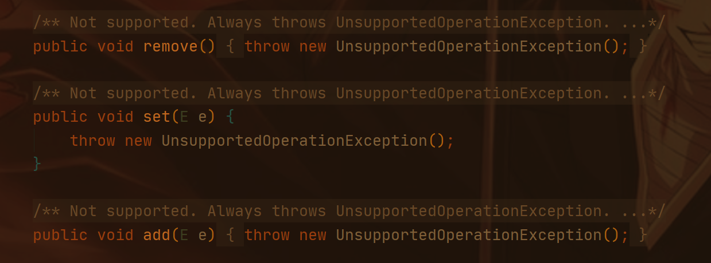

# 并发容器知识点汇总

在JDK1.5之前，线程安全的容器主要还是一些同步容器，性能较差，所有方法都使用了synchronized来保证互斥性。在JDK1.5提出了并发容器。

容器主要分为四大类：List、Set、Map、Queue

以下分别介绍各个类型的常见并发容器

- List

只有一个实现类——CopyOnWriteArrayList。

简单介绍：读取的时候直接读取array，每次修改的时候就将共享变量array复制一份出来，修改完成之后就让array指向复制出来的新数组，原数组交给GC去回收，主要如图所示：

注意的点：

1. 应该在读多写少的环境下使用，因为每次复制都需要占用大量内存，还会提前触发GC
2. 使用迭代器进行迭代的时候进行增删改操作都会直接报错，因为Iterator遍历的是原数组array，随时都有可能被废弃，所以直接在Iterator的方法层面直接抛出错误了

- Map

Map的主要实现是：ConcurrentHashMap和ConcurrentSkipListMap

主要区别是**ConcurrentHashMap是无序的，而ConcurrentSkipListMap是有序的**，还有就是Map的key和value能否为空的问题

理论上ConcurrentSkipListMap所有操作的复杂度和并发数没有关系（基于调表实现的），所以如果在并发度相当高的情况下对ConcurrentHashMap不满意可以尝试下ConcurrentSkipListMap

- Set

两个：CopyOnWriteArraySet和ConcurrentSkipListSet

前者就是将数据存储到内部的CopyOnWriteArrayList中，后者就是将数据存放在了ConcurrentSkipListMap的Key中

- Queue

最为复杂，大概可以分为两类：阻塞和非阻塞、单端和双端

单端：只能队尾入队，队首出队，双端是都可入队可出队。

在Java中阻塞用Blocking标识，单端用Queue，双端用Deque

两两组合，有四种：

1.单端阻塞队列：其实现有 ArrayBlockingQueue、LinkedBlockingQueue、SynchronousQueue、LinkedTransferQueue、PriorityBlockingQueue 和 DelayQueue。

实现简介：内部一般会持有一个队列，这个队列可以是数组（其实现是 ArrayBlockingQueue）也可以是链表（其实现是 LinkedBlockingQueue）；甚至还可以不持有队列（其实现是 SynchronousQueue）

2.双端阻塞队列：其实现是：LinkedBlockingDeque

3.单端非阻塞队列：其实现是：ConcurrentLinkedQueue

4.双端非阻塞队列：其实现是：ConcurrentLinkedDeque

> 非阻塞队列一般都是链表实现的，因为会出现频繁的拓展

在实际中一般不提倡使用无界队列，很有可能导致OOM异常，上述队列中只有ArrayBlockingQueue和LinkedBlockingQueue是有界的