# 序


设计模式（GOF23：Gang of Four，编写《设计模式》的四位大佬的统称）的引入：主要是由一本书《Design Patterns：Elements of Reusable Object Oriented Software》，中文译名为《设计模式——可复用面向对象软件的基础》，可见，设计模式是建立在面向对象编程模型之上的，可以理解为是面向对象的高级使用方法，前人已经对其进行了总结。因此，本书主要是围绕着面向对象编程思想和23种设计模式展开的。

作者对本书的定义：一本通过故事讲述程序如何设计的方法集，本书希望能给渴望了解OO世界的初学者、困惑于僵硬，脆弱，无法复用的代码编程体验者、一直打着OO编程的旗号，做着过程式开发的基于对象的编程实践者一些好的建议和提示。争取理解其中设计模式的迭代与改进过程，在以后自己编写面向对象程序时候进行运用。

这本书吸引我的地方：在不断的提问与回答过程中，在程序的不断重构演变中，把设计模式的门槛降低，而不是直接给出一个趋近于完美的答案。

本书分为4个部分：

1、面向对象的意义与好处以及几个重要的设计原则（很有必要，因为设计模式是简历在OO之上的，意义了解更为重要，因为现在好像都在推崇函数式编程，让我有点迷惑，看这部分的时候可以带着这几个问题去看）

2、详细讲解23个设计模式

3、对设计模式的总结，相互之间的比较

4、附录：针对面向对象概念的补充，如：类、封装、继承、多态、接口、事件等

设计模式其实发展至今远不止23种，但是在学习GOF总结的23种设计模式应该是可以学习到很多东西的，像是别人自己总结了编程经验并直接传授给你，这种感受是非常好的，当然还是需要与自己的编程过程相呼应，要不就是对牛弹琴，无法产生共鸣了。


# 第一章、代码无错便是优？——简单工厂模式


作者的文笔真的非常好，看的蛮有意思的，或许是前面讲述的东西以前了解过，所以感觉非常轻松。

第一阶段代码：

```java
/**
 * @author LuckyCurve
 * @date 2021/1/8 17:08
 * 实现计算器功能，两个数的四则运算
 */
public class Operation1 {
    public static void main(String[] args) {
        Scanner scanner = new Scanner(System.in);
        String info = scanner.nextLine();
        int num1 = Integer.parseInt(info.substring(0, 1));
        String oper = info.substring(1, 2);
        int num2 = Integer.parseInt(info.substring(2, 3));

        switch (oper) {
            case "+":
                System.out.println(num1 + num2);
                break;
            case "-":
                System.out.println(num1 - num2);
                break;
            case "*":
                System.out.println(num1 * num2);
                break;
            case "/":
                System.out.println(num1 / num2);
                break;
            default:
                System.out.println("error:Operation Not Found");
        }
    }
}
```

主要就是将业务和界面分离开来，即OO三大特性中的封装性，让下次使用的时候可以选择是代码复用（对函数的调用）而不是简单的代码复制（Ctrl C）了

第二阶段代码：

```java
/**
 * @author LuckyCurve
 * @date 2021/1/8 17:18
 * 实现业务与界面的分离
 */
public class Operation2 {
    public static void main(String[] args) {
        Scanner scanner = new Scanner(System.in);
        String info = scanner.nextLine();
        int num1 = Integer.parseInt(info.substring(0, 1));
        String oper = info.substring(1, 2);
        int num2 = Integer.parseInt(info.substring(2, 3));
        System.out.println(Operation.getResult(num1, oper, num2));
    }

    static class Operation {
        public static Integer getResult(Integer num1, String oper, Integer num2) {
            switch (oper) {
                case "+":
                    return num1 + num2;
                case "-":
                    return num1 - num2;
                case "*":
                    return num1 * num2;
                case "/":
                    return num1 / num2;
                default:
                    throw new IllegalArgumentException("error:Operation Not Found");
            }
        }
    }
}
```

但是一旦需要添加一个运算方法，如开方运算，则需要重新去修改代码，在修改过程中可能存在将以前代码改变的情况（如果这是一个算员工工资的系统，有些员工就可以改变计算过程从而改变自身的工资了），因此，更正确地操作是使用继承，创建一个计算接口，分别实现加减乘除类分别实现这个接口，重写其中的getResult方法即可。这就是继承的具体应用，至于到底该使用哪个子类，我们可以通过工厂来实现。

第三阶段代码：

```java
/**
 * @author LuckyCurve
 * @date 2021/1/8 17:24
 * 实现OO的继承特性
 */
public class Operation3 {
    public static void main(String[] args) {
        Scanner scanner = new Scanner(System.in);
        String info = scanner.nextLine();
        int num1 = Integer.parseInt(info.substring(0, 1));
        String oper = info.substring(1, 2);
        int num2 = Integer.parseInt(info.substring(2, 3));

        Operation operate = OperationFactory.createOperate(oper);
        System.out.println(operate.getResult(num1, num2));
    }

}

/**
 * 创建Operation对象工厂，具体创建哪个类的对象由该工厂给定
 */
class OperationFactory {

    public static Operation createOperate(String operate) {
        switch (operate) {
            case "+":
                return new OperationAdd();
            case "-":
                return new OperationSub();
            case "*":
                return new OperationMul();
            case "/":
                return new OperationDiv();
            default:
                throw new IllegalArgumentException("error:Operation not Found");
        }
    }
}

interface Operation {

    Integer getResult(Integer num1, Integer num2);
}

class OperationAdd implements Operation {

    @Override
    public Integer getResult(Integer num1, Integer num2) {
        return num1 + num2;
    }
}

class OperationSub implements Operation {

    @Override
    public Integer getResult(Integer num1, Integer num2) {
        return num1 - num2;
    }
}

class OperationMul implements Operation {

    @Override
    public Integer getResult(Integer num1, Integer num2) {
        return num1 * num2;
    }
}

class OperationDiv implements Operation {

    @Override
    public Integer getResult(Integer num1, Integer num2) {
        return num1 / num2;
    }
}

```

这里就简单使用到了工厂模式这种设计模式，当然在编写的时候难免感觉有些拖沓，但在使用的时候体验是真的棒。


画出上面的UML类图，方便分析

> 继承关系：
>
> 
>
> 实现接口：
>
> 
>
> 关联：
>
> 
>
> > Code：
> >
> > ```java
> > class 企鹅 {
> >     private 气候 气候;
> > }
> > ```
>
> 聚合关系：
>
> 
>
> > Code：
> >
> > ```java
> > class 雁群 {
> >     private 大雁[] 大雁;
> > }
> > ```
>
> 合成（组合）关系：
>
> 
>
> 与关联关系非常类似，但是这个关系的生命周期是相同的
>
> > Code：
> >
> > ```java
> > class 鸟 {
> >     private 翅膀 翅膀;
> >     public 鸟() {
> >         翅膀 = new 翅膀();
> >     }
> > }
> > ```
>
> 依赖关系：
>
> 
>
> > Code：
> >
> > ```java
> > class 动物 {
> >     public void 新陈代谢(氧气 氧气,水 水);
> > }
> > ```
> >
> > 可以认为是方法的输入


# 第二章、商场促销——策略模式


实现商品促销，主要的促销方式有：不打折、打几折、满多少减多少。

由于上述情况都有可能出现，因此使用工厂模式来做，但是出现了一个问题：入参个数和类型不同，那么应该怎么样进行抽象呢。

> 在子类的内部维护对象成员，从而实现方法的入参和出参都相同。
>
> 有两种注入方法：构造器注入和Set注入，这里优先应该选择构造器注入，使得组成合成关系（同生共死）

代码：

```java
/**
 * @author LuckyCurve
 * @date 2021/1/9 9:28
 * 实现收费，工厂方式
 */
public class Cash {
    public static void main(String[] args) {
        CashSuper cash = CashFactory.createCashAccept("满300减100");
        System.out.println(cash.acceptCash(500.0));
    }
}

class CashFactory {
    public static CashSuper createCashAccept(String type) {
        switch (type) {
            case "正常收费":
                return new CashNormal();
            case "打8折":
                return new CashRebate(0.8);
            case "满300减100":
                return new CashReturn(300.0, 100.0);
            default:
                throw new IllegalArgumentException("error:Type Not Found");
        }
    }
}

interface CashSuper {
    /**
     * 收取现金的方法
     */
    Double acceptCash(Double money);
}

class CashNormal implements CashSuper {

    @Override
    public Double acceptCash(Double money) {
        return money;
    }
}

/**
 * 打折
 */
class CashRebate implements CashSuper {

    private Double moneyRebate;

    public CashRebate(Double moneyRebate) {
        this.moneyRebate = moneyRebate;
    }

    @Override
    public Double acceptCash(Double money) {
        return money * moneyRebate;
    }
}

/**
 * 满减
 */
class CashReturn implements CashSuper {

    private Double moneyCondition;

    private Double moneyReturn;

    public CashReturn(Double moneyCondition, Double moneyReturn) {
        this.moneyCondition = moneyCondition;
        this.moneyReturn = moneyReturn;
    }

    @Override
    public Double acceptCash(Double money) {
        if (money >= moneyCondition) {
            money -= moneyReturn * (int) (money / moneyCondition);
        }
        return money;
    }
}
```


虽然推出了新的打折活动，程序只需要简单继承CashSuper，然后去收费对象生成工厂里面加上这种判断条件就行了。

> 面对算法的时常变动，应该有更好的办法，就是策略模式


策略模式：定义了算法家族，分别封装起来，让它们之间可以相互替换，此模式让算法的变化，不会影响到使用算法的客户。

策略模式的UML图：


感觉策略模式和工厂模式非常的像，使用策略模式实现商场促销的代码如下：

```java
/**
 * @author LuckyCurve
 * @date 2021/1/9 18:39
 * 更好的是使用策略模式来实现，直接使用前面的类和接口原型即可
 */
public class Cash2 {
    public static void main(String[] args) {
        // 选择满减策略测试
        CashContext context = new CashContext(new CashReturn(100.0, 30.0));
        System.out.println(context.getResult(200.0));
    }
}

/**
 * 从工厂改成了Context
 */
class CashContext {
    private CashSuper cashSuper;

    public CashContext(CashSuper cashSuper) {
        this.cashSuper = cashSuper;
    }

    Double getResult(Double money) {
        return cashSuper.acceptCash(money);
    }
}
```

此时存在一个弊端，判断逻辑需要在主函数里面写出来，当然感觉这影响不是很大，改进方法是结合工厂模式：

```java
/**
 * @author LuckyCurve
 * @date 2021/1/9 19:07
 * 策略模式结合工厂模式
 */
public class Cash3 {
    public static void main(String[] args) {
        CashContext2 context = new CashContext2("满300减100");
        System.out.println(context.getResult(500.0));
    }
}

/**
 * 策略模式结合工厂模式，将判断逻辑进一步内移
 */
class CashContext2 {
    private CashSuper cashSuper;

    public CashContext2(String type) {
        switch (type) {
            case "正常收费":
                cashSuper = new CashNormal();
                break;
            case "打8折":
                cashSuper = new CashRebate(0.8);
                break;
            case "满300减100":
                cashSuper = new CashReturn(300.0,100.0);
                break;
            default:
                throw new IllegalArgumentException("error:Type Not Found");
        }
    }

    public Double getResult(Double money) {
        return cashSuper.acceptCash(money);
    }
}
```

当这样优化之后，主函数（可以理解成客户端）对代码的调用就只有涉及到了CashContext对象了

感觉如果只有一个方法需要重写，使用策略模式是远好于工厂方法的，说白了，工厂方法返回对象，策略模式返回函数，但是在Java8之前不涉及函数。


# 第三章、拍摄UFO——单一职责原则


> 故事真的蛮有意思，由衷感叹一句作者不做老师可惜了。


讲述了使用手机拍摄和数码相机拍摄的差距，由于手机集成了太多其他功能导致拍摄效果非常差，从而引出单一职职责原则。

大多数时候，一件产品简单一些，职责单一一些，或许是更好的选择。这就和设计模式中的一大原则——单一职责的道理是一样的。

单一职责原则：就一个类而言，应该仅有一个引起他变化的原因。

> 说人话，就是如果需要你设计一个窗口程序，不要将运算、数据库访问、页面展示都塞在这一个类里面，这会导致维护麻烦，基本上无法复用，缺乏灵活性。


如果要开发一个俄罗斯方块的游戏，应该尽量将游戏逻辑如：下落、旋转、碰撞检测单独拿出来写一个类，这样在如果需要将项目移动到手机端，这些游戏逻辑都是可以直接重用的。

如果一个类承担的职责过多，就等于把这些职责耦合在一起，一个职责的变化可能会削弱或者抑制这个类完成其他职责的能力。这种耦合会导致脆弱的设计，当变化发生时，设计会遭到意想不到的破坏。


# 第四章、考研求职两不误——开放-封闭原则


开放-封闭原则（Open-Closed Principle、简称OCP，也叫开-闭原则）：软件实体（类、模块、函数等等）应该可以扩展，但是不可修改。

对扩展是开放的，对更改是封闭的。

> 对应到平时的软件开发：因为需求肯定是在不停的变化的，为了要容易维护又不容易出问题的最好的办法，就是多扩展，少修改（宁愿出现代码冗余，也不能偷懒就直接修改代码）

开放-封闭原则要求我们尽量设计这个类足够完善，如果需求来了，新增加一个类来解决这个需求，而不是改变原来的代码。

但是上面只是理想情况，如果发现新需求的提出，应该创建抽象来隔离以后发生的同种变化

:zap:：一二章中对代码的重构就是试图去靠近开-闭原则的，重构之后的代码遇到要添加新的运算法则的时候，只是需要添加新的Operation子类，而不用再去改Client的代码了。


查明可能发生的变化所等待的时间越长，要创建正确地抽象就越困难。

随着项目原来耦合度的增加，解耦操作就越发的困难了。解耦操作应该在项目规模不大的情况下及时进行。


# 第五章、会修电脑不会修收音机？——依赖倒置原则


面向对象编程的四个好处：可维护、可扩展、可复用和灵活性好。


这里举例了电脑更换元件的例子，只需要接口相同，协议兼容即可。

这里就引出了依赖倒置的原则：抽象不应该依赖于细节，细节应该依赖于抽象。也就是应该面向接口编程，而不是面向实现编程。就如上面电脑的例子，CPU种类有那么多种，但是对外提供的针脚接口等都是一样的，因此主板应该根据接口标准来设计，对应编程里也就是面向接口编程，也就是这里提出的依赖倒置原则。

> 依赖倒置原则：
>
> A：高层模块不应该依赖低层模块，两个都应该抽象依赖
>
> B：抽象不应该依赖细节，细节应该依赖抽象


个人认为单就这一个原则就可以让我们面向接口编程了，但是书上还提出了另外的一个原则

里氏替换原则：子类型必须能够替换掉它们的父类型

这种原则感觉应该是默认存在的，在面向对象的继承的时候就默许了这种理念，这里给出了更倾向于数学方式的证明。

这里就对依赖于接口这个概念就更为清晰了，接口能够处理的事情，实现这个接口的类肯定可以替换这个接口，因此我们可以面向接口编程来进行解耦


这里又举出了修收音机的例子，因为收音机内部结构都是一大堆二极管三极管的集成电路，各个部分相互依赖，耦合度高，所以非常难以修理。


**依赖倒置其实可以说是面向对象设计的标志，用哪种语言来编写程序都不重要，如果编写时考虑的都是如何针对抽象编程而不是针对细节编程，即程序中所有的依赖关系都是终止于抽象类或者抽象接口，那就是面向对象的设计，反之（面向实现类）那就是过程化的设计了。**


# 第六章、穿什么有这么重要？——装饰模式


仿写穿衣形象：

为了兼顾开闭原则，单独创建一个服饰接口，UML图如下：


此时主函数的伪代码：

```java
服饰 obj1 = new 大T恤();
服饰 obj2 = new 破球鞋();
// 展示
obj1.形象展示();
obj2.形象展示();
```

应该还要再度封装，让主函数可以直接调用即可

> 装饰模式：动态地给一个对象添加一些额外的职责，就增加功能而言，装饰模式比生成子类更加灵活

这就有点谜语人了，设计模式明显推崇的是单一职责原则，这里又引入额外的职责


装饰模式的UML图结构：


UML图：


> 感觉C#和Java的差距还是蛮明显的，特别是就接口这一块儿而言，c#没有抽象类和接口的区别，转换成Java代码就非常不自然了，不可能全使用抽象类吧


另起炉灶了，看别的Demo去了，重构这个就目前火候还真不太行。


装饰器模式主要为了达到的效果就是：向一个现有的对象添加新的功能，同时又不改变其结构

具体的实现方式：创建一个装饰类，用来包装原有的类


这个就清楚多了，左边的Shape是为了化图像，没有色彩装饰

右边的ShapeDecorator就是用来装饰左边的Shape的。

以上的实现代码：

```java
/**
 * @author LuckyCurve
 * @date 2021/1/13 14:18
 */
public class DecoratorPattern {
    public static void main(String[] args) {
        Circle circle = new Circle();
        RedShapeDecorator decorator = new RedShapeDecorator(circle);
        decorator.show();
    }
}

/**
 * 正常的带装饰的一族
 */
interface Shape {
    void show();
}

class Circle implements Shape {
    @Override
    public void show() {
        System.out.println("Draw a Circle");
    }
}

class Rrctangle implements Shape {
    @Override
    public void show() {
        System.out.println("Draw a Rrctangle");
    }
}

abstract class ShapeDecorator {

    /**
     * 待装饰对象，子类会用到，所以是protected，要么就提供get/set方法了
     */
    protected Shape shape;

    public ShapeDecorator(Shape shape) {
        this.shape = shape;
    }

    public abstract void show();
}

class RedShapeDecorator extends ShapeDecorator {
    public RedShapeDecorator(Shape shape) {
        super(shape);
    }

    @Override
    public void show() {
        System.out.println("Change Painter To Red");
        shape.show();
    }
}
```

装饰器模式是为了当系统中需要添加新功能的时候，会向旧的类中添加新的代码，增加了类的复杂度。

重要的是，装饰器之间往往具有先后顺序，最理想的情况是装饰器之间彼此独立，实现最大程度上的解耦。


# 第七章、为别人做嫁衣——代理模式


代理模式：为其他对象提供一种代理以控制对方这个对象的访问。

代理模式的UML图：


通过这个UML图就非常容易明白了，RealSub和Proxy都实现了相同的接口，具有同样的方法（这些方法是需要代理的）。

然后Proxy持有一个RealSub的对象，每次调用Proxy的方法，就会去调用Proxy内部持有的RealSub对象的方法，因为都实现了一个接口，具有相同的方法。


应用场景：

1. 远程代理：也就是为一个对象在不同的地址空间提供局部代表，这样可以影藏一个对象存在于不同地址空间的事实。（好理解，将其类比为代理服务器翻墙上网即可）
2. 虚拟代理：是根据需要创建开销很大的对象。通过它来存放实例化需要很长时间的真实对象（将其理解为内存地址映射，即内存虚拟化，非常大的扩展了内存空间）
3. 安全代理：用来控制真实对象访问时的权限。（权限检查呗，数据库执行SQL语句之前都要进行权限检查，即安全代理）
4. 智能代理：是指当调用真实的对象时，代理处理另外一些事儿

除了最后一点都好理解，AOP底层使用CGLIB动态字节码生成技术（当前代理对象没有实现任何一个接口的时候，Java动态代理不可用）和Java动态代理技术，这里的动态代理就是使用的代理模式这种设计模式。


# 第八章、雷锋依然在人间——工厂方法模式


在前面的计算器的例子中我们使用到过简单工厂模式，UML图如下：


简单工厂模式和工厂方法模式并不是一个东西。

工厂方法模式的UML图为：


感觉他们之间最大的区别在于简单工厂模式是通过一个类的静态方法返回需要的对象，而工厂方法模式则是为每个对象分别创建一个构造工厂。

> 问题：如果此时使用工厂方法模式，如果要加入一个运算规则，依旧还是要改写客户端代码，因为这是需要客户端来判断使用哪一个操作的工厂来创建操作对象的，这不是和我们使用简单工厂模式，避免客户端代码被修改是有矛盾的吗？


简单工厂模式最大的优点在于工厂类中包含了必要的逻辑判断，根据客户端的选择条件动态实例化相关的类，对于客户端来说，去除了与具体产品的依赖。

但是简单工厂模式存在一个缺点：每次都需要增加case，违反了开放-封闭原则。于是才有了工厂方法模式。

工厂方法模式：定义一个用于创建对象的接口，让子类决定实例化哪一个类。工厂方法使得一个类的实例化延迟到其子类。

但是也存在缺陷，虽然补足了开放-封闭原则，但是使用哪一个工厂类来进行实例化运算类，只是将判断逻辑由工厂转移到了客户端，这也是非常让人疑惑的地方。

工厂方法模式里的工厂类并没有使用静态方法去创建一个对应的对象，而是使用的非静态方法，强制要求必须创建一个工厂类才能进一步去创建对象。

> 学到现在，设计模式都是使用的非静态方法，毕竟是基于面向对象编程的，总归是不能绕开对象的。

> 设计模式只是尽量让客户端代码和业务逻辑代码解耦，但并不强制要求完全解耦，这里的工厂方法模式就是这种效果。


# 第九章、简历复印——原型模式


原型模式：用原型实例指定创建对象的种类，并且通过拷贝这些原型创建新的对象。

UML图：


可以通过clone自己从而避免对new关键字的调用与构造函数的传参过程，节省了大量时间开销。


让Java对象实现Cloneable接口，然后重写clone方法，让其变为public，调用clone方法即可。

出现问题：内部如果是引用方式的话，会直接将对象地址传递过去，内部的引用依旧指向同一片地址，因此需要单独实现深拷贝。

实现的方式有：手动构建里面的每一个对象，然后在内部调用构造函数，显然这是不尽如人意的。推荐使用序列化工具，将对象序列化后再反序列化从而实现Clone。


# 第十章、考题抄错会做也白搭——模板方法模式


给出一份试卷，让同学抄可能会抄错题目，如果有一份试卷模板直接打印就能很好的避免这种情况。

当我们要完成在某一细节层次一致的一个过程或一系列步骤，但其个别步骤在更详细的层次上的实现可能有所不同时，我们通常考虑使用模板方法模式来处理。

模板方法的父类通常会使用空的Abstract函数，然后让子类来重写这些函数，至于函数的调用，则直接封装在父类当中了，只需要重写即可，例如答题函数：

```java
abstract class Question {
    public void question() {
        System.out.println("Question....");
        answer();
    }
    
    public abstract void answer() {
        // TO DO...
    }
}

class Answer extends Question {
    @Override
    public abstract void answer() {
        System.out.println("Answer is A");
    }
} 
```

UML图：


模板方法提供了一个很好的代码复用平台，有时候我们遇到一系列过程需要执行，这个过程从高处看是相同的，只有少数几个有些步骤可能不同。

Spring中的JdbcTemplate就使用到了模板方法模式，其中还大量使用到了回调函数。


# 第十一章、无熟人难办事？——迪米特法则


讲述了件办事儿被踢皮球的事情。

迪米特原则（也叫最少知识原则）：如果两个类不必彼此直接通信，那么这两个类就不应当发生直接的相互作用。如果其中一个类需要调用另一个类的某一个方法的话，可以通过第三者转发这个调用。

迪米特原则强调在类的结构设计上，每一个类都应当尽量降低成员的访问权限，也就是说一个类应该尽量包含private状态，不需要别人知道的就可以不用公开。

> 迪米特原则主要强调类之间的松耦合，类之间的耦合越弱，越有利于复用，一个处在弱耦合的类被修改，不会对有关系的类造成波及。


# 第十二章、牛市股票还在亏钱？——外观模式


由于众多投资者对众多股票的联系太多，反而不利于操作，这在软件中被称为耦合性过高。而有了基金以后，变成众多用户只和基金打交道，而不用和基金后面的股票打交道了。

此时的UML图为：


这也是外观模式/门面模式的大体结构图了。


外观模式：为子系统中的一组接口提供一个一致的界面，此模式定义了一个高级接口这个接口使得这一子系统更加容易使用。


这在我们面向对象编程中使用的非常多了。一个对象持有多个别的对象引用，我们只需要与这一个对象打交道即可。


使用外观模式的三个阶段：

- 首先、在设计初期阶段，应该有意识的将不同的两个层分离。

比如我们常用的三层架构，就需要在层与层之间建立外观Facade。这样可以为复杂的子系统提供一个简单的接口，使得耦合性大大降低

> 确实，层与层之间都是直接使用的接口进行交互，而不是直接指定实现类

- 其次，在开发阶段，子系统往往因为不断的重构演化而变得越来越复杂，给这些子系统增加外观Facade可以提供一个简单的接口，减少他们的依赖
- 最后，在维护一个大型的遗留项目的时候，更应该使用Facade，让新系统实现对Facade的调用，而不是直接与原系统的某些组件直接交互


# 第十三章、好菜每回味不同——建造者模式


因为做菜的流程不同，所以鱼香肉丝可以有几百种味道。

因为我们可能在写程序的时候反复使用到一个流程，如游戏客户端里的人物建模，从头到双手到双脚，其中有些环节容易出错，比如少建模了一个脚，建造者模式就是为了解决这个问题。


人物建模的过程是稳定的，而具体建造的细节是有差异的，如高矮胖瘦。建造者模式（又叫生成器模式）可以将一个产品的内部表象与产品的生成过程分割开来，从而使得一个建造过程生成具有不同的内部表象的产品对象。

如果我们使用建造者模式，那么用户就只需要指定需要建造的类型就可以得到他们，而具体建造的过程和细节就无需知道了。


建造者模式：将一个复杂对象的构建与它的表示分离，使得同样的构建过程可以创建不同的表示。

UML图：


指挥类（Director）指挥建造的过程，Builder接口定义一组抽象方法供指挥类调用和强制子类重写，这样客户端就可以直接调用指挥类的方法即可。

建造者模式是在当创建复杂对象的算法应该独立于该对象的组成部分以及它们的装配方式时适用的模式。


# 第十四章、老板回来，我不知道——观察者模式


观察者模式也叫发布-订阅模式

> 观察者模式定义了一种一对多的依赖关系，让多个观察者对象同时监听某一主题对象，这个主题对象在状态发生变化时，会通知所有观察者对象，使他们能够自动更新自己。


通常直接使用上层接口打交道，依赖倒置原则。

当一个对象（Subject）改变需要同时改变其他对象（Observe）的时候

观察者模式所做的工作就是在解耦，让耦合的双方都依赖于抽象，而不是依赖于具体，从而使得各自的变化都不会影响另一边的变化（指的是代码的改变，而不是状态的改变）。

感觉下面这个图更清楚：


具体的实现类之间是不存在耦合的，使用多态来完成类之间的通信


# 第十五章、就不能不换DB吗？——抽象工厂模式


之前理解错了，一直将工厂方法模式当成了抽象工厂模式

抽象工厂模式：提供一个创建一系列相关或者相互依赖对象的接口，而无需指定他们具体的类。

> 这不是依赖倒置原则嘛。。。

对着工厂方法模式看就好了。

相较于普通的工厂模式，仅仅是对工厂加上了一层抽象，


利用依赖注入的方式，避免switch语句的出现，即如果传入了mysql就自动初始化mysql的组件，而不用switch case的方法了。底层是使用反射来进行实现的。

更进一步，可以通过反射+配置文件的方式来实现数据库访问，直接在配置文件中修改选择的数据库和连接信息，彻底与客户端解耦。


# 第十六章、无尽加班何时休——状态模式


上午状态好，中午想睡觉，下午恢复，加班苦煎熬。这就是一种状态的变化。

程序中往往需要根据当前时间与工作是否完成来决定当前状态，往往会有非常多的判断逻辑即if-else。

应该尽可能的将分支想办法变成类，增加时候不会影响其他的类，状态的变化在各自的类中完成，这就是状态模式。

> 状态模式：当一个对象的内在状态改变时允许改变其行为，这个对象看起来像是改变了其类

状态模式主要解决的就是控制一个对象状态转换的条件表达式过于复杂时的情况，如果条件判断简单，那么就没必要使用状态模式了。

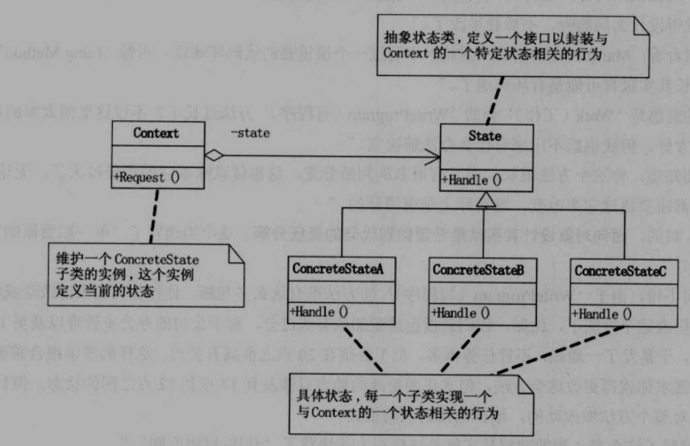


只是将大的判断逻辑分解到各个小的State子类当中来，State子类之间实现状态的轮转。

Context内部会维护一个State对象，在这些State对象执行的时候进行判断，是否要进行交换。


强调状态的一种轮转。

```java
/**
 * @author LuckyCurve
 * @date 2021/1/20 8:31
 * 状态模式，分解各个分支语句
 */
public class WorkTest {
    public static void main(String[] args) {
        Work work = new Work(new State1());
        work.setHour(9);
        work.showState();
        work.setHour(13);
        work.showState();
        work.setHour(18);
        work.showState();
        work.setFinished(true);
        work.showState();
    }
}

/**
 * 其实相当于一个Context，内部持有状态
 */
class Work {
    private Integer hour;
    private Boolean isFinished = false;
    private State state;

    public void showState() {
        state.writeProgram(this);
    }

    public Work(State state) {
        this.state = state;
    }

    public Integer getHour() {
        return hour;
    }

    public void setHour(Integer hour) {
        this.hour = hour;
    }

    public Boolean getFinished() {
        return isFinished;
    }

    public void setFinished(Boolean finished) {
        isFinished = finished;
    }

    public State getState() {
        return state;
    }

    public void setState(State state) {
        this.state = state;
    }
}

interface State {
    void writeProgram(Work work);
}

/**
 * 上午
 */
class State1 implements State {

    @Override
    public void writeProgram(Work work) {
        if (work.getHour() < 12) {
            System.out.println("当前时间：" + work.getHour() + "点，上午工作，精神百倍");
        } else {
            // 转换到下午去
            work.setState(new State2());
            work.showState();
        }
    }
}


/**
 * 下午
 */
class State2 implements State {

    @Override
    public void writeProgram(Work work) {
        if (work.getHour() < 17) {
            System.out.println("当前时间：" + work.getHour() + "点，下午工作，有点小困");
        } else {
            // 转换到晚上
            work.setState(new State3());
            work.showState();
        }
    }
}


/**
 * 晚上
 */
class State3 implements State {

    @Override
    public void writeProgram(Work work) {
        if (work.getFinished()) {
            work.setState(new State4());
            work.showState();
        } else {
            work.setState(new State5());
            work.showState();
        }
    }
}

/**
 * 工作完成
 */
class State4 implements State {

    @Override
    public void writeProgram(Work work) {
        System.out.println("当前时间：" + work.getHour() + "点，下班回家了");
    }
}

/**
 * 加班
 */
class State5 implements State {

    @Override
    public void writeProgram(Work work) {
        if (work.getFinished()) {
            work.setState(new State4());
            work.showState();
        } else {
            System.out.println("当前时间：" + work.getHour() + "点，还在加班，要睡着了");
        }
    }
}
```

从而实现对状态的一种分解。


# 第十七章、在NBA我需要翻译——适配器模式


讲述了姚明刚开始去NBA的时候需要翻译，其中涉及到的模式就是适配器模式。

适配器模式：将一个类的接口转换成客户希望的另一种接口。Adaptor模式使得原本由于接口不兼容而不能一起工作的类可以一起工作了。


主要是直接提供的接口无法使用，但是直接修改代码又不现实，因此需要适配器模式。

理解成笔记本的电源适配器就好了，不管外部电压多少伏特，笔记本的充电电压基本固定不变了。


因为在短期之内姚明不可能学会英语，因此需要一个翻译来当适配器。

适配器模式主要用来复用一些现存的类，但是接口又与复用环境要求不一致的情况。


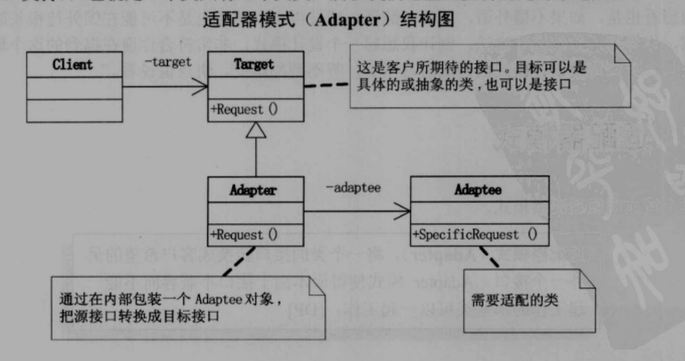

```java
interface Target {
    void request();
}

class Adaptee {
    // 不适配的方法
    void request(HttpServletHandler... req);
}

class Adaptor implements Target {
    private Adaptee adaptee;
    
    @Override
    public void request() {
        // 实现对Adaptee的调用
        ...
    }
}
```

有点亡羊补牢的味道，因为接口没有设计好，只能通过适配器模式来进行斧正了。

应该在双方都不容易修改的时候使用他，而不是一有不同就使用适配器模式。


# 第十八章、如果再回到从前——备忘录模式


在游戏中打Boss前，如果感觉打不过，可以进行存档操作，其中就包含备忘录模式。

不要将这些回退的职责一股脑的塞给客户端，应该将这些操作都进行封装，要不下次加一个经验值的回退，那就要改动非常大了。

> 备忘录模式：在不破坏封装性的前提下，捕获一个对象的内部状态，并在该对象之外保存这个状态。这样以后就可以将该对象恢复为原来的状态。

不能直接使用引用指向原来存储的备忘录，因为有可能发生多次回退操作，只能进行复制。

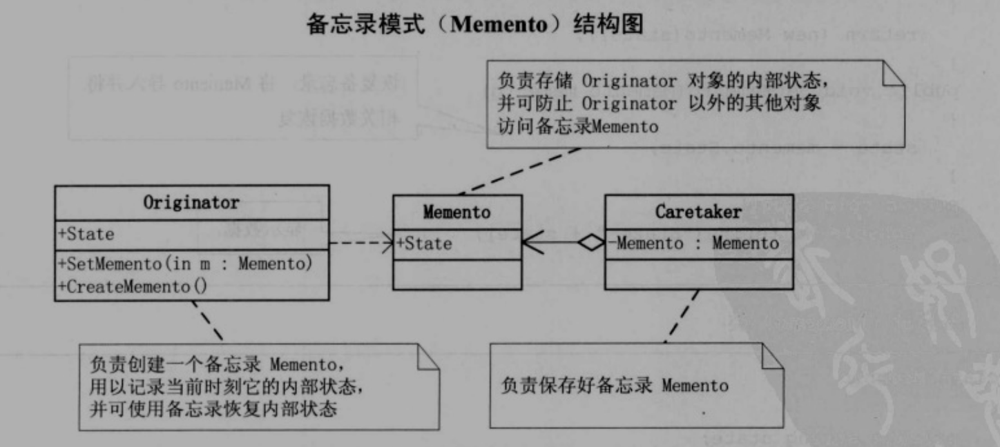

```java
/**
 * @author LuckyCurve
 * @date 2021/1/20 10:07
 * 备忘录模式
 */
public class MementoTest {
    public static void main(String[] args) {
        Originator originator = new Originator();
        originator.setName("LuckyCurve");
        originator.setAge(20);
        Memento memento = originator.createMemento();

        Caretaker caretaker = new Caretaker();
        caretaker.setMemento(memento);

        originator.setAge(21);
        System.out.println(originator);
        System.out.println("回退");
        originator.setMemento(caretaker.getMemento());
        System.out.println(originator);

    }
}

/**
 * 发起人类，相当于是当前状态
 */
class Originator {
    private String name;
    private Integer age;

    public Memento createMemento() {
        return new Memento(name, age);
    }

    public String getName() {
        return name;
    }

    public Integer getAge() {
        return age;
    }

    public void setName(String name) {
        this.name = name;
    }

    public void setAge(Integer age) {
        this.age = age;
    }

    public void setMemento(Memento memento) {
        this.name = memento.getName();
        this.age = memento.getAge();
    }

    @Override
    public String toString() {
        return "Originator{" +
                "name='" + name + '\'' +
                ", age=" + age +
                '}';
    }
}

/**
 * 备忘录，保存的一个状态载体类
 */
class Memento {
    private String name;
    private Integer age;

    public Memento(String name, Integer age) {
        this.name = name;
        this.age = age;
    }

    public String getName() {
        return name;
    }

    public void setName(String name) {
        this.name = name;
    }

    public Integer getAge() {
        return age;
    }

    public void setAge(Integer age) {
        this.age = age;
    }
}

/**
 * 管理者类，对Memento进行管理和存储
 */
class Caretaker {
    private Memento memento;

    public Memento getMemento() {
        return memento;
    }

    public void setMemento(Memento memento) {
        this.memento = memento;
    }
}
```

使用备忘录模式可以把复杂的对象内部信息对其他的对象屏蔽起来，从而可以恰当的保持封装的边界。

缺点：如果需要存储的数据量较大，会造成大量内存的浪费。


# 第十九章、分公司=一部门——组合模式


组合模式：将对象组合成树状结构以表示“部分—整体”的层次结构。组合模式使得用户对单个对象和组合对象的使用具有一致性。

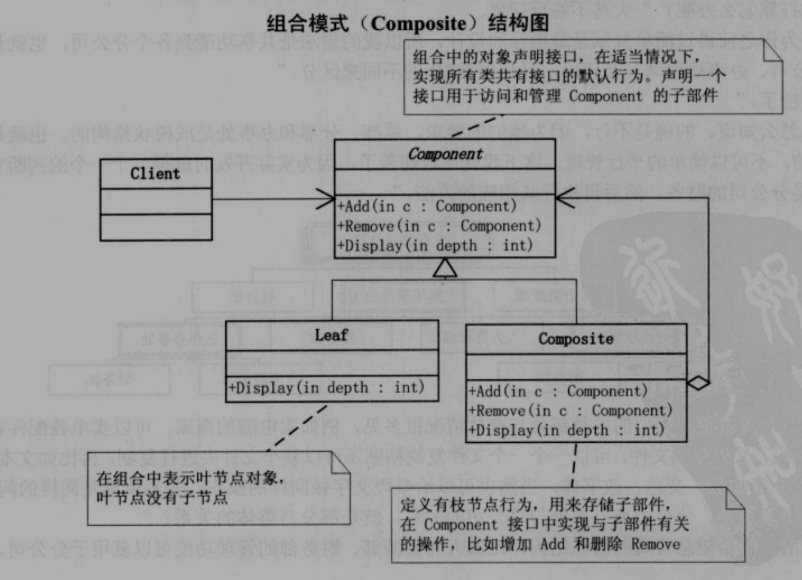

感觉像是对一颗树的操作

对Leaf来说，add，remove等方法可以抛出一个不支持的异常。保持对外的一致性


使用组合模式：当你发现需求中是具体部分与整体层次的结构时，以及你希望用户忽略组合对象与单个对象的不同，统一使用组合结构中的所有对象时，就应该考虑使用组合模式。


组合模式让客户可以一致的使用组合结构（Composite）和单个对象（Leaf）


# 第二十章、想走？可以！先买票——迭代器模式


售票员将车厢里的所有人都遍历了一遍，不放过任何一个不买票的乘客，这就是迭代器模式的体现

迭代器模式：提供一种方法顺序访问一个聚合对象中各个元素，而又不暴露该对象的内部表示

如果需要对聚集有多种方式遍历时，可以考虑迭代器模式

很多语言都已经默认实现了迭代器模式了

迭代器模式要求为遍历不同的聚集结构提供如开始，下一个，是否结束，当前那一项等统一的接口

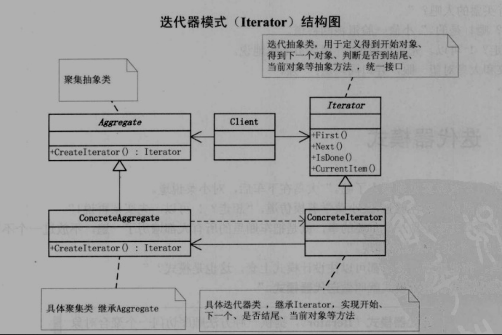

熟悉的不能再熟悉了，通过聚合对象创建一个迭代器，通过操作迭代器的方式来完成对聚合对象的访问。


迭代器就是分离了聚合对象的遍历行为，抽象出一个迭代器类来负责，这样写即可以做到不暴露聚合的内部结构，又可以让外部代码透明的访问聚合对象内部的数据。


# 第二十一章、有些类也需要计划生育——单例模式


将构造方法改成私有，避免在外部new该对象

在写一个静态方法getInstance，返回类实例

单例模式：保证一个类仅有一个实例，并提供一个访问它的全局访问点。

通常都是让这个类自身负责保存他的唯一实例，这个类可以保证没有其他实例可以被创建，并且他可以提供一个访问该实例的方法

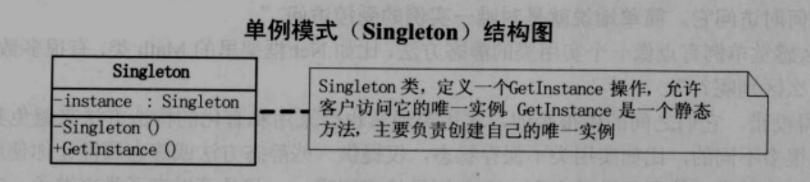


顺带提了多线程下的处理方法，是使用锁来解决的，锁是保证当一个线程位于代码的临界区时，另一个线程不进入临界区，如果其他线程试图进入锁定的代码，则它将一直等待，直到该对象被释放。


Double Check Locking来保证性能的提高，主要是if-lock-if的结构，避免一进去就直接进入lock了，提升了部分性能

第二个if主要是为了防止在外lock外等待的线程进入临界区后都直接无脑创建对象了。


```java
/**
 * @author LuckyCurve
 * @date 2021/1/21 8:37
 * 单例模式
 */
public class Singleton {

    public static void main(String[] args) {
        Singleton singleton = Singleton.getInstance();
        System.out.println(Objects.equals(singleton, getInstance()));
    }

    /**
     * volatile关键字防止JVM进行指令重排
     * 分配内存空间——初始化对象——让singleton指向新创建的对象
     * 如果此时A线程执行逻辑为132，那么B线程可能返回一个没有完全被初始化的对象
     * 是不安全的
     */
    private volatile static Singleton singleton;

    /**
     * 让外界无法调用构造函数
     */
    private Singleton() {
    }

    /**
     * 双重检查模式
     * 优点：
     * 延迟初始化，与懒汉模式一致（就是最简单的单线程安全的实现）
     * 性能优化，双重检查机制，保证不会进入方法直接去竞争锁资源
     * 线程安全，volatile关键字修饰，synchronized 关键字控制
     */
    public static Singleton getSingleton() {
        if (singleton != null) {
            synchronized (Singleton.class) {
                if (singleton != null) {
                    singleton = new Singleton();
                }
            }
        }
        return singleton;
    }

    /**
     * 静态内部类模式
     * 优点：
     * 代码实现简洁
     * 延迟初始化，也是只有方法调用的时候才会初始化内部类的对象
     * 线程安全？？？ 主要是通过JVM的初始化锁来实现的，保证实例的唯一性
     */
    public static Singleton getInstance() {
        return Inner.singleton;
    }

    private static class Inner {
        private static final Singleton singleton = new Singleton();
    }


    // =============剩下的几种就存在这有些设计缺陷了============================================

    /**
     * 懒汉模式，主要说的就是延时加载的特性
     * 多线程不安全
     */
    public static Singleton getInstance2() {
        if (singleton != null) {
            singleton = new Singleton();
        }
        return singleton;
    }


    /**
     * 饿汉模式，直接初始化
     * 多线程是安全的，也是通过初始化锁来保证的
     */

    private static Singleton singleton2 = new Singleton();
    public static Singleton getInstance3() {
        return singleton;
    }

}
```


# 第二十二章、手机软件何时统一——桥接模式


手机刚出来那会儿软件之间无法兼容，往往只能在单一的品牌上面使用。


在面向对象中，我们还有一个很重要的设计原则：就是合成/聚合复用原则，应该优先使用对象合成/聚合，而不是类继承。


合成/聚合复用原则：尽量使用合成/聚合，尽量不要使用类继承

因为类继承会导致父类与子类之间的强耦合

合成（有时翻译成组合）和聚合都是特殊的关联关系，都是指一种包含关系，聚合强调弱的拥有关系，组合则强调强的拥有关系，具有相同的生命周期。


桥接模式：将抽象部分与它的实现部分分离，使他们都可以独立地变化


拿手机软件和手机品牌来做类比：

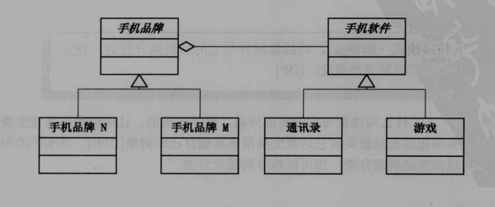


桥接模式通俗易懂来说就是实现系统可能有多种角度分类，每一种分类都有可能变化，那么就把这种多角度分离出来让他们独立变化，减少他们之间的耦合。

说白了桥街模式就是合成/聚合原则的最佳实践。


# 第二十三章、烤羊肉串引来的思考——命令模式


烧烤摊上人聚集过多，老板可能忘记了先后顺序导致场面混乱

店面烧烤店服务员会记录下先后顺序，不会造成混乱

代码结构由：

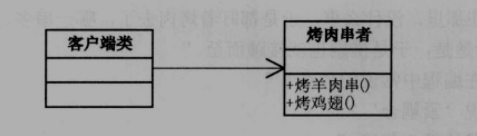

演变成了：

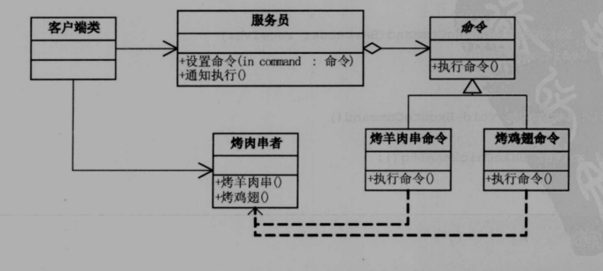

也就是命令模式

命令模式（Command）：将一个请求封装为一个对象，从而使得你可用不同的请求对客户进行参数化，对请求排队或记录请求日志，以及支持可撤销的操作。

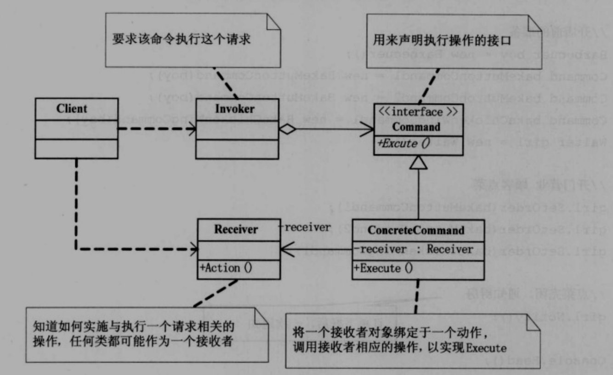


命令模式优点：

- 容易设计出一个命令队列
- 容易将命令记入日志
- 允许接收请求的一方决定是否要否决请求
- 容易实现撤销和重做
- 增加新命令非常容易


# 第二十四章、加薪非要老总批？——责任链模式


加薪这件事儿有时候里面就存在着责任链模式，先给直系领导提加薪请求，然后需要经过人力资源的审批，最后还要经过老总的审批，这就是责任链模式的一种体现。

责任链模式（Chain Of Responsibility）：使多个对象都有机会处理请求，从而避免请求的发送者和接收者之间的耦合关系，将这个对象连成一条链，并沿着这条链传递该请求，直到有一个对象处理他为止。

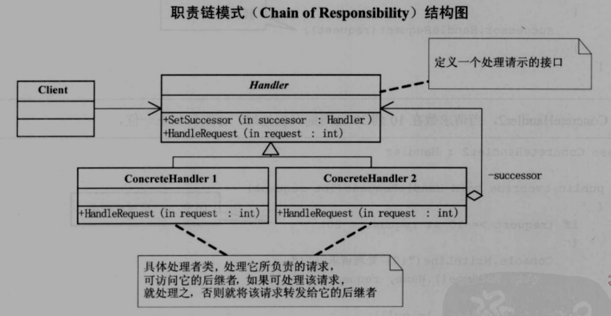

使用Handler构成一条线路，处理的时候按照这个链路来处理，如果不满足需求则递归给下一个类Handler

需要考虑如果到末端还没有处理的请求怎么办，一般都是在末尾就要求处理所有请求了。


# 第二十五章、世界需要和平——中介者模式


中介者模式又叫调停者模式，其实就是中间人或者调停者的意思

联合国在各国中就起到了中介者或者是调停者的角色


尽管将一个系统分割成许多对象通常可以增加可复用性，但是对象间相互连接的激增又会降低其可复用性了。因为大量的连接使得一个对象不可能在没有其他对象的支持下工作，系统表现为一个不可分割的整体，所以，对系统的行为进行任何较大的改动就会十分困难。

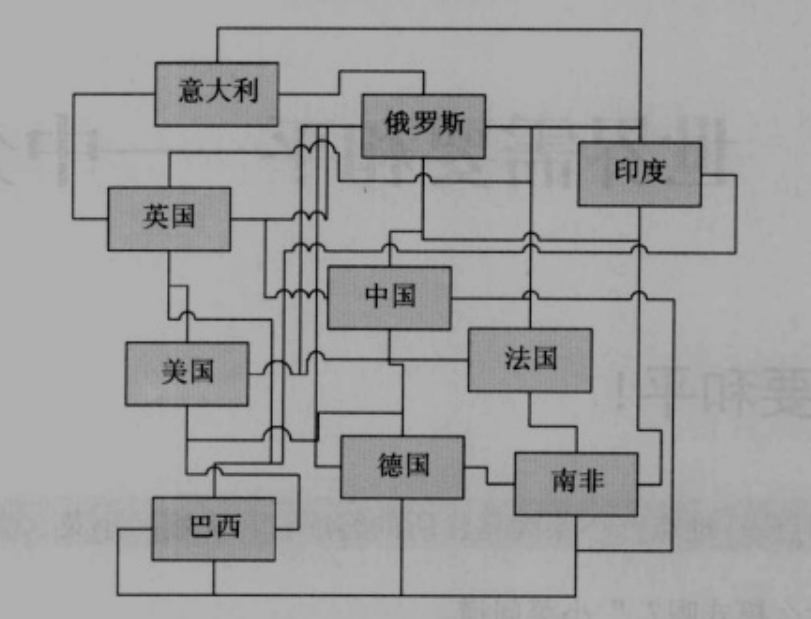

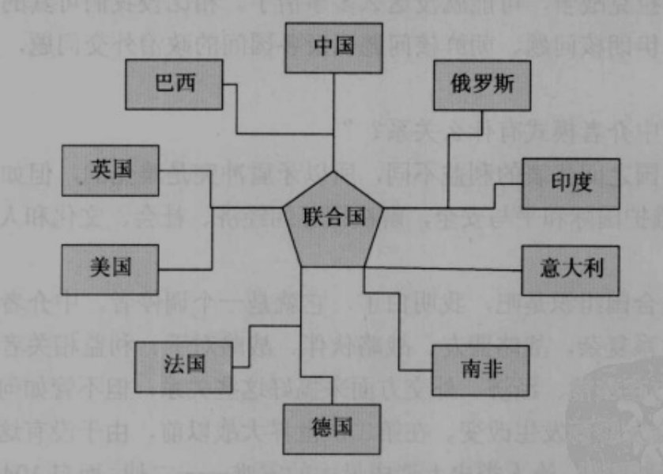


中介者模式：用一个中介者对象来封装一系列的对象交互，中介者使各对象之间不需要显式地相互引用，从而使得耦合松散，而且可以独立的改变他们之间的交互。


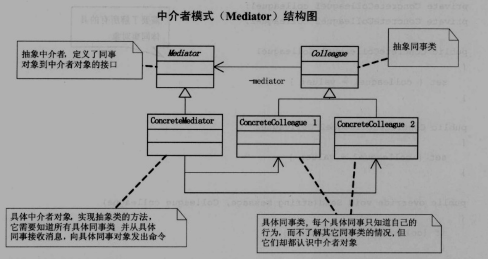


中介者模式有个致命的缺点就是中介者类，非常类似于分布式的数据中心吗，一旦瘫痪了整个系统也就无法运转了。

中介者模式一般应用于一组对象以定义良好但是复杂的方式进行通讯的场合，所以中介者模式很容易被滥用。


# 第二十六章、项目多也别傻做——享元模式


多个客户要求做基本一样的项目，只是细微之处有差别。为每个项目建表，CV代码是比较麻烦的，可以就根据ID号进行区别，这样维护起来也会简单一些


享元模式：运用共享技术有效的支持大量细粒度的对象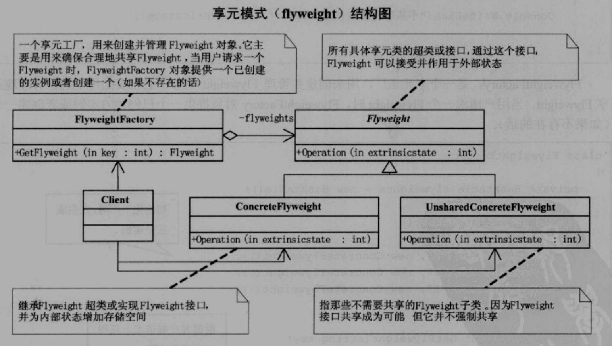

以提高系统性能为目的设计模式

设计思想是：如果一个系统中存在多个相同的对象，那么只需要共享同一份对像的拷贝，而不闭为每一次使用都创建新的对象

主要组件：

享元工厂：用于享元对象的维护，保证内部拥有同一份享元对象，类似单例模式的方法

抽象享元：避免耦合度过高

具体享元类，实现抽象享元

在大部分IoC容器里天生就支持了。


# 第二十七章、其实你不懂老板的心——解释器模式


解释器模式：给定一个语言，定义它的文法的一种表示，并定义一个解释器，这个解释器使用该表示来解释语言中的句子。

正则表达式正是解释器模式的一种应用，其实浏览器也是一个解释器，解释HTML在页面中显示


解释器模式用起来非常难，相当于开发一个编程语言或者脚本给别人用

解释器模式容易改变和扩展文法

解释器模式的缺点：为文法中的每一条规则都至少定义了一个类，因此包含很多规则的文法可能难以管理和维护，当文法非常复杂时，使用其他的技术如语法分析程序或编译器生成器来处理

前几天做的算法题：罗马数字与阿拉伯数字的相互转换就是解释器的实现


#  第二十八章、男人和女人——访问者模式


访问者模式讲的是表示一个作用于某对象结构中的各元素的操作。它使你可以在不改变各元素的类的前提下定义作用于这些元素的新操作

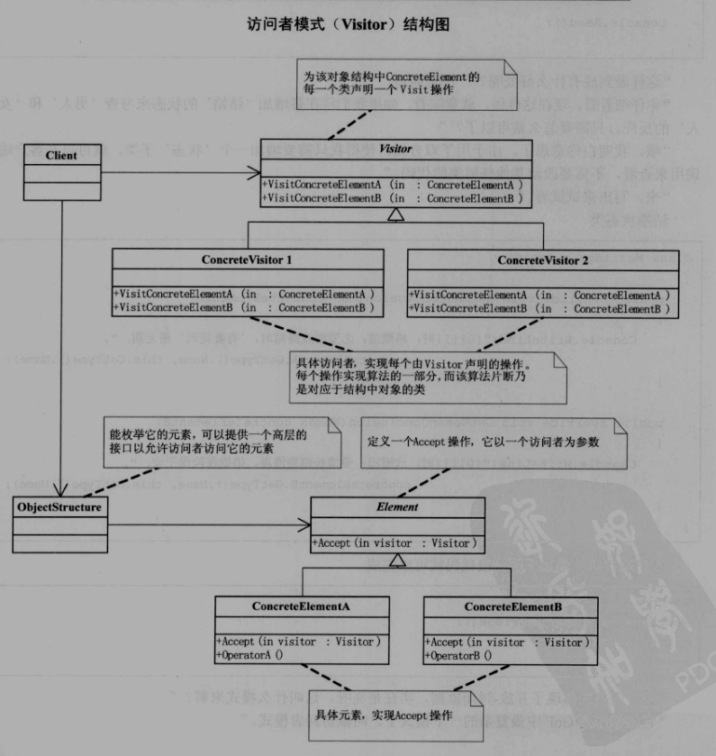

感觉书上这个例子态晦涩了，换了个Demo：

如果老师教学反馈得分大于等于 85 分、学生成绩大于等于 90 分，则可以入选成绩优秀奖；如果老师论文数目大于 8、学生论文数目大于 2，则可以入选科研优秀奖。

常规思路是Person，Student——>Person，Teacher——>Person

然后在内部进行if-else判断，但是这样如果条件新增了，即增加了一个奖项，那么就得修改Student和Teacher的代码了，这是不好的。

重构代码如下：

```java
public interface Person {
    void accept(Visitor visitor);
}

public class Student implements Person {

    /**
     * 内部属性构建
     */
    private String name;
    private Integer grade;
    private Integer paperCount;

    @Override
    public void accept(Visitor visitor) {
        visitor.visit(this);
    }

    // 构造函数和Getter/Setter方法

    public Student(String name, Integer grade, Integer paperCount) {
        this.name = name;
        this.grade = grade;
        this.paperCount = paperCount;
    }

    public String getName() {
        return name;
    }

    public void setName(String name) {
        this.name = name;
    }

    public Integer getGrade() {
        return grade;
    }

    public void setGrade(Integer grade) {
        this.grade = grade;
    }

    public Integer getPaperCount() {
        return paperCount;
    }

    public void setPaperCount(Integer paperCount) {
        this.paperCount = paperCount;
    }
}

public class Teacher implements Person {

    private String name;
    private Integer score;
    private Integer paperCount;

    @Override
    public void accept(Visitor visitor) {
        visitor.visit(this);
    }

    public Teacher(String name, Integer score, Integer paperCount) {
        this.name = name;
        this.score = score;
        this.paperCount = paperCount;
    }

    public String getName() {
        return name;
    }

    public void setName(String name) {
        this.name = name;
    }

    public Integer getScore() {
        return score;
    }

    public void setScore(Integer score) {
        this.score = score;
    }

    public Integer getPaperCount() {
        return paperCount;
    }

    public void setPaperCount(Integer paperCount) {
        this.paperCount = paperCount;
    }
}

public interface Visitor {
    void visit(Student student);

    void visit(Teacher teacher);
}

public class GradeSelection implements Visitor {

    private final String info = "%s 的分数是%d，荣获成绩优秀奖";

    /**
     * 判断逻辑
     */
    @Override
    public void visit(Student student) {
        if (student.getGrade() >= 90) {
            System.out.println(String.format(info, student.getName(), student.getGrade()));
        }
    }

    @Override
    public void visit(Teacher teacher) {
        if (teacher.getScore() >= 85) {
            System.out.println(String.format(info, teacher.getName(), teacher.getScore()));
        }
    }
}

public class ObjectStructure {

    private final List<Person> list = new ArrayList<>();

    /**
     * 提供增删查方法
     */
    public void addPerson(Person person) {
        list.add(person);
    }

    public void removePerson(Person person) {
        list.remove(person);
    }

    /**
     * @param visitor 访问规则
     */
    public void accept(Visitor visitor) {
        for (Person person : list) {
            person.accept(visitor);
        }
    }
}
```

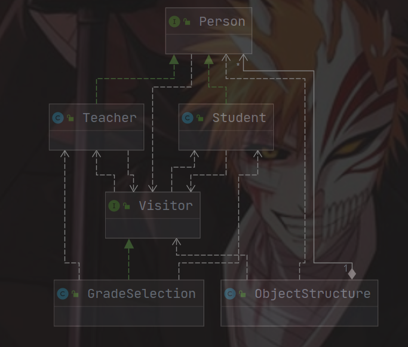

使用时候直接和ObjectStructure打交道就好了。

适用于对象结构稳定但操作不稳定的情况，即数据结构固定，算法可能经常变动的情况。


# 第二十九章、OOTV杯超级模式大赛——模式总结


通过故事串讲总结了设计模式

六大基本原则：单一职责原则、开放封闭原则、依赖倒置原则、里氏替换原则、合成聚合复用原则和迪米特原则。

对象比流程更加稳定，也更加封闭，流程看上去（引用传参）只有一个入口出口，而对象则是完全通过接口与外界联系，接口内部的事情与外界无关

设计模式大体上可以分为创建型、结构型和行为型。